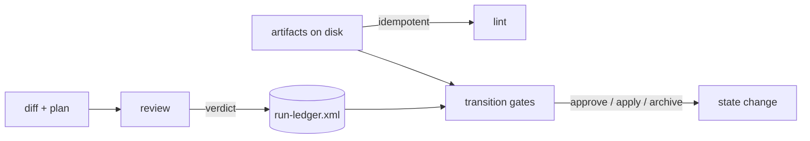
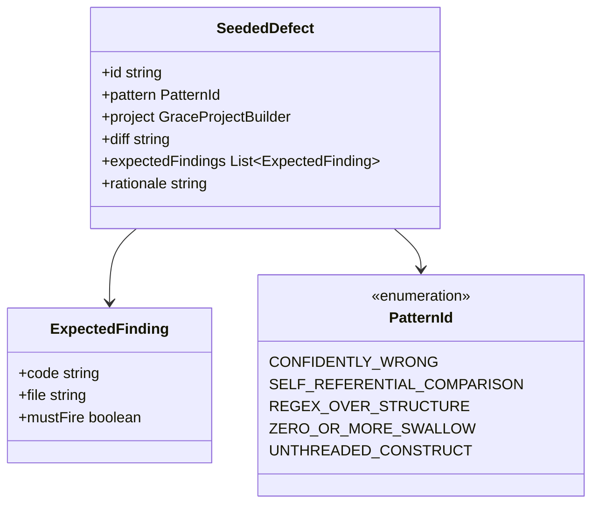

# Agent Reliability — Evidence Harness & Self-Migration

**Target repository:** `neo-grace` (`@neograce/cli`, 6.0.1)
**Audience:** an executor coding agent
**Authority:** derived from `../RM-AGENT-RELIABILITY/decisions.md`, which records fifteen ratified
design decisions (D1–D15) and four verified findings (F1–F4). Where this plan and a source document
disagree, **this plan wins** — the conflicts were adjudicated in `decisions.md`.
**Plan version:** 1.0 · 2026-07-29

> **This bundle exists so that the rest of the track can be specified against measurements instead of
> guesses.** Phase 0 fixes the measurement format and audits what GRACE 3 actually shipped; Phase 1
> gives this repository a real `.ngrace` tree. Every later phase in
> [RM-AGENT-RELIABILITY](../RM-AGENT-RELIABILITY/plan.md) is designed against those two outputs, and
> was originally written before either existed.
>
> **Phase 1 is the self-migration `CLAUDE.md` asks to be approved separately.** Approving this bundle
> *is* that approval. It is a two-phase decision on purpose, so it can be made deliberately rather
> than as a side effect of approving a twelve-phase plan.

> **Releases are not yet assigned.** `targets` is empty and the Release column reads `TBD`.

> **Shared context.** `decisions.md`, `review-consolidated.md` and `review.md` live in the sibling
> bundle and serve both. They do not move when this bundle archives; the relative links above will
> need re-pointing if the sibling archives first, which it will not, since it cannot start until this
> one completes.

---

## 0. Operating contract for the executor

Read this section completely before touching any file. It is the contract you are held to for
every phase.

### 0.1 Four working principles

**1 — Think before coding.** Before writing a line in any phase, open every file listed under
*Files touched*, read it end to end, and write a short note in your response stating: what the
code does today, which of your assumptions the code contradicts, and which named function you
will change. If reading contradicts this plan, **stop and report the contradiction** rather than
improvising — this plan was written against HEAD and drift is possible.

**2 — Simplicity first.** No new runtime dependencies. No new required external toolchains. No
abstraction introduced for a single caller. No "while I'm here" refactors. If a phase can be
done with a 40-line function, do not build a plugin system.

**3 — Surgical changes.** Touch only the files a phase names. Do not reformat untouched code. Do
not rename existing symbols. Do not reorder imports in files you did not otherwise modify. Every
diff hunk must be traceable to a numbered step.

**4 — Goal-driven execution.** Every step is written as `step → verify: check`. You are not done
with a step until the verify check passes and you have shown its output. A step whose verify
check you did not run is an incomplete step.

### 0.2 Definition of "covered by tests"

Every phase requires both, and the review gate checks for both:

| Level | Location | What it proves |
|---|---|---|
| **Unit** | co-located `*.test.ts` next to the changed module | The changed function behaves correctly across the enumerated cases, including the negative and malformed ones |
| **Integration** | `src/grace-lint.test.ts`, `src/grace-status.test.ts`, `src/grace-query.test.ts` | Running the actual CLI against a real temp-directory project produces the expected issue codes, exit status, and JSON shape |

Rules:

- Every new issue code MUST have at least one integration test asserting it fires, and at least
  one asserting it does **not** fire on a clean project. Codes that only fire in tests you wrote
  to make them fire are not evidence.
- Every bug fix MUST have a regression test that fails on the pre-fix code. Write the test first,
  watch it fail, then fix. Show both outputs.
- No test may depend on machine state outside the temp project directory — no network, no
  `go`/`cargo`/`python` on PATH required.
- Tests must be deterministic. No timing assertions, no dependence on filesystem ordering.
- **New for this track:** any test covering ledger events must not assert on wall-clock time.
  Ordering comes from allocated ranges (D2), never from timestamps. A test that sorts by time is
  a defect in the test.

### 0.3 Repository invariants you must not break

1. `skills/ngrace/*` is the source of truth; `plugins/ngrace/skills/ngrace/*` is a byte-identical
   mirror. Any skill edit must be copied to the mirror in the same commit.
2. Versions stay synchronized across `README.md`, `openpackage.yml`,
   `.claude-plugin/marketplace.json`, `plugins/ngrace/.claude-plugin/plugin.json`, `package.json`.
3. Nothing may degrade silently. Every code path that cannot perform a check must emit the
   absence value with a reason (D5).
4. New grammar arrives only with the validator that makes it load-bearing.
5. Existing valid `.ngrace` trees must keep validating. Additive only, unless a phase explicitly
   says otherwise. **The run ledger and cursor are additive by construction** (D1): a project
   without them lints clean.
6. `NGRACE_ARTIFACT_VERSION` (`"1.0"`) is the *artifact grammar* version, validated on every root tag.
   Bump it only when something becomes **required**, and ship a migration path with it. It is
   not the product version.
7. Test helpers must never be published. Put shared test helpers in `src/test-support/` and
   confirm with `bun run validate:packed`.
8. **The binary writes only structural state it can derive or is explicitly given, never
   authored content, and never without an explicit apply** (F1). `ngrace graph split --apply`
   is the existing precedent; the ledger and cursor follow it.

### 0.4 Commands you will use constantly

```bash
bun run typecheck                      # bunx tsc --noEmit
bun test                               # full unit + integration suite
bun run validate:cli                   # the three CLI integration suites
bun run validate:marketplace           # packaging, path safety, version sync, canonical↔packaged drift
bun run validate:ci                    # typecheck + test + validate:cli + validate:marketplace
bun run ngrace lint --path <dir>       # exercise the CLI directly (after Phase -1)
bun run ngrace <cmd> --help            # seven subcommands: doctor file graph lint module status verification
git show v3.11.0:<path>                # read GRACE 3 sources (F2) — they are in this repository
```

**Every command above resolves as written.** `package.json#scripts.ngrace` matches the published
binary since RM-NAMESPACE-SEPARATION Phase 0 (`69475b4`); the plan's former Phase −1, which existed
only to close that gap, was removed when that track completed. There is no `bun run grace` script
and no substitution to make.

**One thing to be careful of:** upstream `@osovv/grace-cli` may be installed on your `PATH` as
`grace`. It was, on the maintainer's machine, and `bun run grace lint` silently ran *upstream's*
linter against this repository. If a command unexpectedly succeeds, check which binary answered.

### 0.5 Per-phase reporting format

At the end of every phase, report exactly this:

```
PHASE <n> — <name>
Status: COMPLETE | BLOCKED
Steps completed: <n>/<n>
Files changed: <list>
New issue codes: <list, or none>
Unit tests added: <count> (<file names>)
Integration tests added: <count> (<file names>)
Verify output:
  bun run typecheck            → <pass/fail>
  bun test                     → <n pass, n fail>
  bun run validate:cli         → <pass/fail>
  bun run validate:marketplace → <pass/fail>
Regression evidence: <for bug-fix phases: failing-before and passing-after output>
Token delta: <skill-text lines added/removed; per-invocation output size change, or "none">

Self-review (§0.7) — all five are required:
  Scope audit:        <files outside the declared list; deletions from existing tests; or "clean">
  Mutation check:     <table: each production change reverted alone → failure count>
                      <any row with 0 failures must name the discriminating negative added>
  Adversarial probe:  <table of >=15 inputs NOT in the case table, pass/fail>
                      <for each failure: the fix, and the test that now covers it>
  Compat sweep:       <new issue codes per fixture; "[]" for each, or explain>
  Anti-pattern audit: <§12.4 line by line: does the diff contain it?>

Deviations from plan: <none, or explain>
Open questions for review: <none, or list>
```

Then **stop and wait for review**. Do not begin the next phase.

The `Token delta` line is new for this track and is not optional. D15 makes the toolkit
accountable for its own footprint; a phase that adds skill text without reporting how much is a
phase that cannot be assessed against that decision.

### 0.6 Status legend

`NOT STARTED` · `IN PROGRESS` · `BLOCKED` · `READY FOR REVIEW` · `COMPLETE`

Update the status board in §2 as you go — it is the plan's own state, and keeping it accurate is
part of the job.

### 0.7 Phase self-review — mandatory before `READY FOR REVIEW`

A green test suite proves your tests pass. It does not prove your tests are *about* anything, and
it does not prove the code is right on inputs you did not think of. Every defect found in review
on the previous track was invisible to a green suite.

Run all five audits below and **put their output in your report**. A phase whose report is
missing an audit is not ready.

> **Note on reflexivity.** This track's product is, in part, the mechanization of this very
> protocol (Phase 6). Until that ships, you run it by hand. Do not skip an audit on the grounds
> that a later phase will automate it — the automation is being built *from* what this manual
> pass finds.

#### 0.7.1 Scope audit

```bash
git diff --name-only HEAD                                                # everything you touched
git diff --name-only HEAD | grep -vE '<the files this phase declares>'   # should be empty
git diff HEAD -- <each test file> | grep '^-' | grep -v '^---'           # deletions from existing tests
```

Report: files touched outside the phase's declared list (with justification), and any deletion
from a pre-existing test. Deleting or weakening an existing assertion is presumed wrong until you
argue otherwise.

#### 0.7.2 Mutation check — do your tests actually hold the code?

For **each** production change in the phase, revert it alone, run `bun test`, record the failure
count, restore.

```bash
cp src/path/to/file.ts /tmp/f.bak
# revert exactly one change (one function, one call site, one condition)
bun test 2>&1 | tail -4
cp /tmp/f.bak src/path/to/file.ts
```

Report as a table:

| Reverted | Failures |
|---|---|
| `foldEpoch` range-density check → always true | 3 |
| `run.xml` referential lint call site | 1 |

**Zero failures is a finding, not a pass.** A change that can be reverted with zero failures is
untested, no matter how many tests you added around it. The fix is one *discriminating negative*
— an input where the correct and incorrect behaviours differ. If a revert yields zero, write that
negative before proceeding.

#### 0.7.3 Adversarial probe — go beyond your own case table

Write a throwaway script in the scratchpad exercising **at least 15 inputs that are not in the
phase's case table**, and put the pass/fail table in your report. Probe, then promote whatever
failed into a test alongside the fix.

Probe these categories every time:

| Category | Why |
|---|---|
| **Multi-line / nested** variants of every construct in the table | Case tables drift toward one-liners |
| **Near-misses** — input resembling the target but not it | Detection logic keys on a prefix or substring |
| **The syntax appearing inside prose, comments, or strings** | Regex over flattened text cannot tell them apart |
| **Empty, truncated, unterminated, pathological** | Must degrade, never throw or hang |
| **The silent direction** — does the check stay quiet when it should? | Over-firing is as bad as under-firing |
| **Every row of the phase's own table, re-run through the public entry point** | Unit tests can pass while the wiring is wrong |

**Categories specific to this track**, to add whenever the phase touches the ledger or a gate:

| Category | Why |
|---|---|
| **Concurrent appends from two allocated ranges** | D2's whole premise; a serial-only test proves nothing about it |
| **A range with a hole, and a range with no terminal event** | D2's loss detection must fire on both, and must not fire on a clean dense range |
| **An interrupted fold** — ledger written, loose files not deleted | D3's write-verify-delete ordering |
| **A cursor naming a task absent from the plan, and an absent cursor** | D1: the first is an error, the second is silent |
| **An absence value with every reason code, through each gate** | D5: required evidence blocks, optional evidence does not |

For each failure ask: **could this produce a confident false error?** That is the worst outcome
in this codebase — worse than the silent gap it replaced — because it blocks correct work and
teaches people to ignore the tool. Rank findings by that.

#### 0.7.4 Backward-compatibility sweep

Any phase that adds an issue code must run it against **every** fixture and report the new codes
per fixture:

```
polyglotFixture()   → []
minimalTsFixture()  → []
scaleFixture(20)    → []
examples/           → []
```

A new **error** on a previously-green project is a release-breaking change. If one appears,
either the severity is wrong or the check is. Do not proceed by editing the fixture to suit the
check.

#### 0.7.5 Anti-pattern self-audit

Re-read §12.4 and state, per line, that your diff does not contain it. The list only works if it
is actually consulted against the finished diff.

#### 0.7.6 When a probe finds something

Fix it in the same phase, add the failing input as a test, and **report both the probe output and
the fix**. Do not silently fix and report clean: the probe result is the evidence that the test
you added is worth having.

If you believe a finding is out of scope, say so explicitly with your reasoning rather than
omitting it.

---

## 1. Orientation — the system as it exists today

Read this against the real code before Phase 0. If any of it is wrong at HEAD, report it.

### 1.1 What already exists that this track builds on

| Capability | Where | Why it matters here |
|---|---|---|
| Absence primitives, fail-closed | `src/artifact/assertions.ts:263`, `:506`; `src/grace-status.ts:127` | `assertion.command-not-evaluated` is already an error. D5 unifies these rather than inventing them |
| Language confidence tiers | `src/language-registry.ts`, adapters | `exact \| heuristic \| no-adapter` — the *precision* axis of D5, already shipped |
| Deterministic retrieval | `src/grace-module.ts`, `src/grace-file.ts` | `module show --with verification --json`, `module find --depends`, `file show --contracts --blocks --json`. D7: the packet's retrieval half already exists |
| Structural writes behind `--apply` | `src/grace-graph.ts:285–290`, `:296`, `:347` | F1: the precedent the ledger follows. Dry-run default, explicit apply, refuses on a bad projection |
| Read-only enforcement by snapshot test | `src/artifact/scale-ergonomics.test.ts:212` | The mechanism for proving a command does not write. Reusable per-command |
| Recursive mirror validation | `scripts/validate-marketplace.ts:229–270` | `git diff --no-index` over each listed skill **directory**. D13 depends on this |
| Grammar forbids nested status | `src/artifact/grammar.ts:167` | `artifact.forbidden-status-attribute` — why the cursor lives outside `plan.xml` (D1) |

### 1.2 What does not exist and this track creates

| Thing | Decision |
|---|---|
| `run-ledger.xml` — append-only epoch record | D1, D2, D3 |
| `run.xml` — regenerable position cache | D1 |
| A unified absence value with reason codes | D5 |
| Transition gates as a surface distinct from lint and review | D14 |
| Detached reviewer with deterministic finding IDs | D4, §4.3 |
| Seeded-defect corpus | D4, §5.4 |
| Task-scoped selection over artifacts and skills | D15 |
| Calibration corpus and report | D6 |

### 1.3 The three check surfaces (D14)



`lint` never reads run state. Gates may. `review` produces findings that land in the ledger.
Confusing these is the failure §5.7 warned about.

---

## 2. Phase status board

Keep this table current. It is the single source of truth for progress.

| # | Phase | Decisions delivered | Release | Status |
|---|---|---|---|---|
| 0 | Evidence harness & v3 capability audit | D4 (corpus), D7 (audit), D15 (measurement format) | TBD | `COMPLETE` |
| 1 | Thin `.ngrace` self-migration | §5.5 | TBD | `NOT STARTED` |

**Hard sequencing rules** — these are dependencies, not preferences.

1. **0 → 1.** The token baseline in Phase 0 must be captured *before* `.ngrace` exists, or the
   before/after comparison has no "before". This is the only ordering constraint inside this bundle,
   and it is why the two phases are here together rather than split again.
2. **0 → everything in the sibling bundle.** The measurement format must be fixed before anything is
   measured, or numbers will not compare across phases. The v3 audit informs the schemas in that
   bundle's Phases 3, 4 and 8.
3. **1 → the sibling bundle's Phases 3, 4, 8, 9.** Those are designed against this repository's real
   change flow. Building them against fixtures inherits the dataset's central lesson in the wrong
   direction.

**Nothing outside this bundle may start until both phases here are `COMPLETE`.** That is the reason
the split exists — see the banner above.

---

# PHASE 0 — Evidence harness & v3 capability audit

**Status:** `COMPLETE`
**Decisions:** D4 (seeded corpus), D7 (audit), D15 (measurement format)
**Release:** TBD

## 0.1 Objective

Build the means to tell whether any later phase worked, and finish the audit whose output shapes
three of them. **Zero behaviour change to shipped code.**

Three deliverables, none of which is a product feature:

1. A **seeded-defect corpus** — fixture projects paired with defective diffs, drawn from the five
   patterns. Ground truth by construction, which is what makes D4's gate and trend measurable
   without human adjudication.
2. The **v3→v5 capability mapping table**, produced by reading `v3.11.0` (F2). Its natural home
   is `ngrace-migrate`, which today has no mapping for `implementationOrder` at all.
3. The **token measurement format** (D15) — fixed up front, so numbers compare across phases.

## 0.2 Preconditions

→ verify: `bun run validate:ci` passes on a clean checkout. If it does not, **stop** — you must
not build on a red baseline.

→ verify: `git show v3.11.0:plugins/grace/skills/grace/grace-init/assets/docs/development-plan.xml.template`
prints a template containing `<ImplementationOrder>`. If it does not, F2 is wrong at HEAD and
this phase's step 0.5.1 has no input — report the contradiction.

## 0.3 Files touched

| File | Action |
|---|---|
| `src/test-support/fixtures.ts` | READ ONLY — study the builder idiom first |
| `src/artifact/test-fixtures.ts` | READ ONLY — study its idiom |
| `src/test-support/defect-corpus.ts` | CREATE |
| `src/test-support/defect-corpus.test.ts` | CREATE |
| `src/test-support/token-accounting.ts` | CREATE |
| `src/test-support/token-accounting.test.ts` | CREATE |
| `skills/ngrace/ngrace-migrate/references/v3-capability-map.md` | CREATE |
| `plugins/ngrace/skills/ngrace/ngrace-migrate/references/v3-capability-map.md` | CREATE (mirror) |

## 0.4 Design

The corpus is **not** a test suite. It is a set of (project, defective diff, expected finding)
triples that later phases score against. It must be usable by a scorer that does not yet exist,
so its shape is fixed here and not revisited.



**Why `mustFire` is a field rather than an assumption:** D4's ratchet compares detection across
versions. A corpus entry that only records what *should* fire cannot express "this must stay
silent," and the silent direction is half of §0.7.3's probe discipline.

## 0.5 Steps

**Step 0.5.1 — Read the v3 sources and produce the capability map.**

Read, in full:

```bash
git show v3.11.0:plugins/grace/skills/grace/grace-init/assets/docs/development-plan.xml.template
git show v3.11.0:plugins/grace/skills/grace/grace-init/assets/docs/operational-packets.xml.template
git show v3.11.0:plugins/grace/skills/grace/grace-execute/SKILL.md
git show v3.11.0:plugins/grace/skills/grace/grace-multiagent-execute/SKILL.md
```

Produce `v3-capability-map.md` as a table with one row per v3 construct and exactly one verdict
from: `superseded` (name the v5 replacement), `collateral-loss` (name the decision restoring it),
`genuinely-missing` (name the phase), `deliberately-dropped` (name why).

D7's first-pass sort is your starting hypothesis, **not** your conclusion. It covers eleven
constructs; the v3 templates contain more. Every row needs a verdict and every verdict needs a
basis.

→ verify: every construct appearing in the four sources above has a row. State the row count and
name any construct you found that D7's table does not list.

**Step 0.5.2 — Create `src/test-support/defect-corpus.ts`.**

```
PSEUDOCODE

export const PATTERNS = [
  "confidently-wrong",            // asserting a fact never checked
  "self-referential-comparison",  // one side derives from the thing under test
  "regex-over-structure",         // guard written as regex over structured text
  "zero-or-more-swallow",         // list allowed empty swallows malformed children
  "unthreaded-construct",         // new construct not threaded through older guarantees
] as const;

export interface SeededDefect {
  id: string;                     // stable; never renumbered (D4's ratchet keys on it)
  pattern: (typeof PATTERNS)[number];
  build(): string;                // writes a temp project, returns its root
  apply(root: string): void;      // applies the defective change
  expected: ExpectedFinding[];    // including mustFire: false entries
  rationale: string;              // why this is a defect, in one sentence
}

export function corpus(): SeededDefect[];
export function byPattern(p): SeededDefect[];
```

Seed **at least two defects per pattern**, ten total. One per pattern is not a corpus — it cannot
distinguish "the check works" from "the check happens to match this one input."

→ verify: `bun test src/test-support/defect-corpus.test.ts` passes, and the test asserts (a)
every `id` is unique, (b) every pattern has ≥2 entries, (c) every `build()` produces a project
that lints **clean before** `apply()` — a corpus entry whose baseline is already dirty measures
nothing.

**Step 0.5.3 — Create `src/test-support/token-accounting.ts`.**

Three measurements, fixed now (D15):

```
PSEUDOCODE

skillTextLines(): { total: number; perSkill: Record<string, number> }
  // counts lines across skills/ngrace/*/SKILL.md and references/**
  // baseline at 5.0.1 is 636 lines across 16 SKILL.md files (E2; re-measured 6.0.1, unchanged)

commandOutputBytes(argv: string[], root: string): number
  // runs a CLI command against a fixture, returns stdout size

selectionRatio(full: number, selected: number): number
  // what a slice saved, as a fraction — the number §4.1 currently lacks
```

→ verify: `skillTextLines().total` reports 636 for `SKILL.md` files at HEAD. If it does not, state
the actual number — the baseline in D15 and §0.5's report format both reference it, and a wrong
baseline silently corrupts every later token delta.

**Step 0.5.4a — Audit the existing checks against D16.** *(added with D16, 2026-07-29)*

D16 says a check whose failure has never been observed is not evidence. Nobody knows how much of this
repository's verification is in that state, and the enforcement decision is explicitly priced against
this number rather than guessed.

Enumerate every `V-M-*` command and every `→ verify:` step reachable from the current artifacts, and
classify each:

| Class | Meaning |
|---|---|
| **witnessed** | a run exists in which this check failed, and the mutation that caused it is known |
| **plausible** | it would clearly fail on an obvious mutation, but nobody has run that |
| **unfalsified** | no mutation is known under which it fails — including "it greps for a string and the string might simply never occur" |

→ verify: report the three counts and the total. Derive the total **twice, by different means** — once
from the verification projection (`ngrace verification find`) and once by grepping the artifacts — and
reconcile them. Two independently-derived counts that agree is the standard D16 asks for; one count is
the thing D16 is about.

→ verify: name the **three** checks most likely to be unfalsified, with the mutation that would settle
each. Do not fix them. This step measures; a later, unscheduled phase decides whether `lint` should
require witnesses, and that decision needs the number first.

**Step 0.5.4 — Mirror the new reference file.**

→ verify: `bun run validate:marketplace` passes. It compares each listed skill directory
recursively, so an unmirrored `references/` file fails here.

## 0.6 Definition of done

- `v3-capability-map.md` exists, mirrored, with a verdict and basis on every row
- Corpus has ≥10 entries, ≥2 per pattern, all baselines lint clean
- Token accounting reports the three measurements and its baseline matches HEAD
- `bun run validate:ci` green
- **No file under `src/` outside `src/test-support/` was modified**
- *(D16)* The check audit is reported with its three counts, reconciled across two derivations

## 0.7 Review gate

Reviewer checks:

1. Does every corpus entry lint clean *before* its defect is applied? A dirty baseline is the
   §2.1 pattern-2 failure — a comparison where one side derives from the thing under test.
2. Does the capability map contain at least one construct D7's table missed? If not, say so
   explicitly — it is possible, but it is also what a shallow read looks like.
3. Are corpus IDs stable and documented as never-renumbered?

## 0.8 Rollback

Delete `src/test-support/defect-corpus*`, `src/test-support/token-accounting*`, and the two
`v3-capability-map.md` copies. Nothing under `src/` proper was touched, so rollback is complete.

---

# PHASE 1 — Thin `.ngrace` self-migration

**Status:** `NOT STARTED`
**Decisions:** §5.5
**Release:** TBD

## 1.1 Objective

Give this repository a real `.ngrace` state, using **6.0.1 tooling only**, so every later phase is
designed against a real project rather than a fixture.

**Thin means thin:** context and graph for the CLI and skills packages, plus one active change for
the next phase. Not a heroic full markup of every adapter.

## 1.2 Preconditions

→ verify: `bun run ngrace lint --path .` reports `project.missing-grace`. That is the documented
expected state at 6.0.1 (`CLAUDE.md`), and it is this phase's starting point.

→ verify: Phase 0 is `COMPLETE`. The token baseline must be captured *before* `.ngrace` exists, or
the skill-text delta for every later phase is measured against a moving baseline.

## 1.3 Files touched

| File | Action |
|---|---|
| `.ngrace/context/*.xml` | CREATE |
| `.ngrace/graph/index.xml` | CREATE |
| `.ngrace/graph/GD-*.xml` | CREATE |
| `.ngrace/verification/index.xml` | CREATE |
| `CLAUDE.md` | EDIT — remove the "does not yet contain its own `.ngrace` state" note |
| `docs/plans/README.md` | EDIT — the note at line 44 says the same thing |

## 1.4 Design

Migrate with the tooling that exists and is enforced today. **Do not attempt to use constructs
this plan has not yet built** — no `run-ledger.xml`, no cursor, no provenance attributes. Those
arrive as ordinary `C-*` bundles in later phases, each eating its own dog food as it lands.

Modules to declare, at minimum:

| Module | Path | Why it must be in the thin slice |
|---|---|---|
| `M-LINT-CORE` | `src/lint/core.ts` | Phase 5 adds gate declarations near it |
| `M-ASSERTIONS` | `src/artifact/assertions.ts` | Phase 2 unifies absence values here |
| `M-GRAMMAR` | `src/artifact/grammar.ts` | Phase 3 adds ledger grammar |
| `M-STATUS` | `src/grace-status.ts` | Phases 3 and 8 both extend it |
| `M-SKILLS` | `skills/ngrace/` | Phase 2 and 8 both touch skill text; it needs an anchor |

## 1.5 Steps

**Step 1.5.1 — Run `ngrace-init` against this repository and stop before writing.**
→ verify: report the proposed artifact list and confirm it does not include any construct from
Phases 2–11.

**Step 1.5.2 — Author context and graph for the five modules above.**
→ verify: `bun run ngrace lint --path .` no longer reports `project.missing-grace`, and reports
zero errors. Warnings are acceptable and must be listed in the report.

**Step 1.5.3 — Author verification entries for the five modules.**
→ verify: `bun run ngrace lint --path .` reports no verification routing issue, **and**
`bun run ngrace verification find --path . --json` returns one entry per declared module.

There is no `verification index` subcommand — the surface is `find` and `show`, and index routing
is validated by `lint`. If you find yourself reaching for a subcommand this plan names but
`--help` does not list, stop and report it rather than inventing an equivalent.

**Step 1.5.4 — Update the two notes that say `.ngrace` does not exist.**
→ verify: `grep -rln 'does not yet contain its own' . --include='*.md' | grep -v docs/plans` returns
nothing. **Match on the prose, not on the path** — the sentence reads *"does not yet contain its own
`.ngrace` state"*, with backticks, so any pattern that spans the directory name silently matches
nothing and passes. This verify was written that way twice; run it before and after the edit and put
both results in the report.
outside `docs/plans/archive/`.

## 1.6 Definition of done

- `ngrace lint --path .` exits zero
- `ngrace doctor --path .` runs and its output is included in the phase report **verbatim** —
  this is the first real doctor reading on this repository and it is the baseline for Phase 10
- `bun run validate:ci` green
- No file under `docs/plans/archive/` modified

## 1.7 Review gate

1. Is the slice actually thin? A migration that marks up every adapter has missed the point and
   will slow every later phase's lint run.
2. Does any authored artifact reference a construct from a later phase? That is a bootstrapping
   violation — the migration must be honest at 6.0.1.
3. Is the `doctor` baseline recorded verbatim rather than summarized?

## 1.8 Rollback

`rm -rf .ngrace` and revert the two note edits. No source changes.

---

---

## 3. Final instruction to the executor

Two phases. Work one at a time, report in the §0.5 format, stop after each and wait for review.

**Phase 0 produces the measuring instrument; Phase 1 produces the thing to measure.** Neither is
interesting on its own, and both exist because the sibling bundle's phases were specified against a
dataset that did not exist. Do not extend either phase toward that work — the point of stopping here
is that the next phases get rewritten with real numbers in hand.

Capture the token baseline in Phase 0 **before** Phase 1 creates `.ngrace`. There is no second
chance at a "before" measurement.

When a `grep` comes back empty, put it in the report, and say what the pattern cannot match. In the
sibling namespace track five defects in a row were patterns narrower than the claims they stood for,
each returning clean. Two independently-derived counts that agree are evidence; one count is not.
