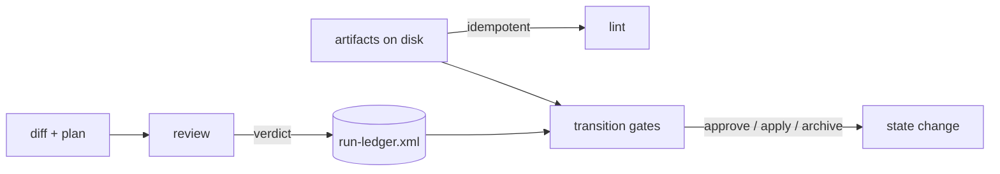

# Agent Reliability Implementation Plan

**Target repository:** `neo-grace` (`@neograce/cli`, 6.0.1)
**Audience:** an executor coding agent
**Authority:** derived from `decisions.md` in this directory, which records fifteen ratified
design decisions (D1–D15) and four verified findings (F1–F4). Where this plan and a source
document disagree, **this plan wins** — the conflicts were adjudicated in `decisions.md`.
`review-consolidated.md` frames the questions; `decisions.md` answers them; this plan orders
and specifies the work.
**Plan version:** 2.0 · 2026-07-29 (split; see below)

> **Approved for execution on 2026-07-30 — see §14 A1 for what that approval does and does not
> clear.** The blocking dependency is satisfied:
> [RM-AGENT-RELIABILITY-EVIDENCE](../../archive/RM-AGENT-RELIABILITY-EVIDENCE/plan.md) is `complete`
> and archived. Phases 0 and 1 were moved into that bundle on 2026-07-29; it fixed the measurement
> format and produced this repository's real `.ngrace` tree. §2 sequencing rule 0 stands as the record
> of why it had to run first.

> **The step detail below is provisional, and that is why the split happened.** Phases 2–11 were
> written in full before the evidence existed — before the measurement format was fixed, before there
> was a real `.ngrace` tree to design against, and before the v3 audit had run. The **objectives,
> decisions delivered, and review gates are ratified**; the **numbered steps and their verify commands
> are drafts against an imagined dataset.**
>
> At each phase's approval, re-derive its steps from what the evidence bundle actually produced, and
> record the difference. Treating these steps as specified is the mistake this structure exists to
> prevent. Every count in them is a claim — §15.

> **Releases are not yet assigned.** `targets` is empty and the Release column in §2 reads `TBD`.

---

## 0. Operating contract for the executor

Read this section completely before touching any file. It is the contract you are held to for
every phase.

### 0.1 Four working principles

**1 — Think before coding.** Before writing a line in any phase, open every file listed under
*Files touched*, read it end to end, and write a short note in your response stating: what the
code does today, which of your assumptions the code contradicts, and which named function you
will change. If reading contradicts this plan, **stop and report the contradiction** rather than
improvising — this plan was written against HEAD and drift is possible.

**2 — Simplicity first.** No new runtime dependencies. No new required external toolchains. No
abstraction introduced for a single caller. No "while I'm here" refactors. If a phase can be
done with a 40-line function, do not build a plugin system.

**3 — Surgical changes.** Touch only the files a phase names. Do not reformat untouched code. Do
not rename existing symbols. Do not reorder imports in files you did not otherwise modify. Every
diff hunk must be traceable to a numbered step.

**4 — Goal-driven execution.** Every step is written as `step → verify: check`. You are not done
with a step until the verify check passes and you have shown its output. A step whose verify
check you did not run is an incomplete step.

### 0.2 Definition of "covered by tests"

Every phase requires both, and the review gate checks for both:

| Level | Location | What it proves |
|---|---|---|
| **Unit** | co-located `*.test.ts` next to the changed module | The changed function behaves correctly across the enumerated cases, including the negative and malformed ones |
| **Integration** | `src/grace-lint.test.ts`, `src/grace-status.test.ts`, `src/grace-query.test.ts` | Running the actual CLI against a real temp-directory project produces the expected issue codes, exit status, and JSON shape |

Rules:

- Every new issue code MUST have at least one integration test asserting it fires, and at least
  one asserting it does **not** fire on a clean project. Codes that only fire in tests you wrote
  to make them fire are not evidence.
- Every bug fix MUST have a regression test that fails on the pre-fix code. Write the test first,
  watch it fail, then fix. Show both outputs.
- No test may depend on machine state outside the temp project directory — no network, no
  `go`/`cargo`/`python` on PATH required.
- Tests must be deterministic. No timing assertions, no dependence on filesystem ordering.
- **New for this track:** any test covering ledger events must not assert on wall-clock time.
  Ordering comes from allocated ranges (D2), never from timestamps. A test that sorts by time is
  a defect in the test.

### 0.3 Repository invariants you must not break

1. `skills/ngrace/*` is the source of truth; `plugins/ngrace/skills/ngrace/*` is a byte-identical
   mirror. Any skill edit must be copied to the mirror in the same commit.
2. Versions stay synchronized across `README.md`, `openpackage.yml`,
   `.claude-plugin/marketplace.json`, `plugins/ngrace/.claude-plugin/plugin.json`, `package.json`.
3. Nothing may degrade silently. Every code path that cannot perform a check must emit the
   absence value with a reason (D5).
4. New grammar arrives only with the validator that makes it load-bearing.
5. Existing valid `.ngrace` trees must keep validating. Additive only, unless a phase explicitly
   says otherwise. **The run ledger and cursor are additive by construction** (D1): a project
   without them lints clean.
6. `NGRACE_ARTIFACT_VERSION` (`"1.0"`) is the *artifact grammar* version, validated on every root tag.
   Bump it only when something becomes **required**, and ship a migration path with it. It is
   not the product version.
7. Test helpers must never be published. Put shared test helpers in `src/test-support/` and
   confirm with `bun run validate:packed`.
8. **The binary writes only structural state it can derive or is explicitly given, never
   authored content, and never without an explicit apply** (F1). `ngrace graph split --apply`
   is the existing precedent; the ledger and cursor follow it.

### 0.4 Commands you will use constantly

```bash
bun run typecheck                      # bunx tsc --noEmit
bun test                               # full unit + integration suite
bun run validate:cli                   # the three CLI integration suites
bun run validate:marketplace           # packaging, path safety, version sync, canonical↔packaged drift
bun run validate:ci                    # typecheck + test + validate:cli + validate:marketplace
bun run ngrace lint --path <dir>       # exercise the CLI directly (after Phase -1)
bun run ngrace <cmd> --help            # seven subcommands: doctor file graph lint module status verification
git show v3.11.0:<path>                # read GRACE 3 sources (F2) — they are in this repository
```

**Every command above resolves as written.** `package.json#scripts.ngrace` matches the published
binary since RM-NAMESPACE-SEPARATION Phase 0 (`69475b4`); the plan's former Phase −1, which existed
only to close that gap, was removed when that track completed. There is no `bun run grace` script
and no substitution to make.

**One thing to be careful of:** upstream `@osovv/grace-cli` may be installed on your `PATH` as
`grace`. It was, on the maintainer's machine, and `bun run grace lint` silently ran *upstream's*
linter against this repository. If a command unexpectedly succeeds, check which binary answered.

### 0.5 Per-phase reporting format

At the end of every phase, report exactly this:

```
PHASE <n> — <name>
Status: COMPLETE | BLOCKED
Steps completed: <n>/<n>
Files changed: <list>
New issue codes: <list, or none>
Unit tests added: <count> (<file names>)
Integration tests added: <count> (<file names>)
Verify output:
  bun run typecheck            → <pass/fail>
  bun test                     → <n pass, n fail>
  bun run validate:cli         → <pass/fail>
  bun run validate:marketplace → <pass/fail>
Regression evidence: <for bug-fix phases: failing-before and passing-after output>
Token delta: <skill-text lines added/removed; per-invocation output size change, or "none">

Self-review (§0.7) — all five are required:
  Scope audit:        <files outside the declared list; deletions from existing tests; or "clean">
  Mutation check:     <table: each production change reverted alone → failure count>
                      <any row with 0 failures must name the discriminating negative added>
  Adversarial probe:  <table of >=15 inputs NOT in the case table, pass/fail>
                      <for each failure: the fix, and the test that now covers it>
  Compat sweep:       <new issue codes per fixture; "[]" for each, or explain>
  Anti-pattern audit: <§12.4 line by line: does the diff contain it?>

Deviations from plan: <none, or explain>
Open questions for review: <none, or list>
```

Then **stop and wait for review**. Do not begin the next phase.

The `Token delta` line is new for this track and is not optional. D15 makes the toolkit
accountable for its own footprint; a phase that adds skill text without reporting how much is a
phase that cannot be assessed against that decision.

### 0.6 Status legend

`NOT STARTED` · `IN PROGRESS` · `BLOCKED` · `READY FOR REVIEW` · `COMPLETE`

Update the status board in §2 as you go — it is the plan's own state, and keeping it accurate is
part of the job.

### 0.7 Phase self-review — mandatory before `READY FOR REVIEW`

A green test suite proves your tests pass. It does not prove your tests are *about* anything, and
it does not prove the code is right on inputs you did not think of. Every defect found in review
on the previous track was invisible to a green suite.

Run all five audits below and **put their output in your report**. A phase whose report is
missing an audit is not ready.

> **Note on reflexivity.** This track's product is, in part, the mechanization of this very
> protocol (Phase 6). Until that ships, you run it by hand. Do not skip an audit on the grounds
> that a later phase will automate it — the automation is being built *from* what this manual
> pass finds.

#### 0.7.1 Scope audit

```bash
git diff --name-only HEAD                                                # everything you touched
git diff --name-only HEAD | grep -vE '<the files this phase declares>'   # should be empty
git diff HEAD -- <each test file> | grep '^-' | grep -v '^---'           # deletions from existing tests
```

Report: files touched outside the phase's declared list (with justification), and any deletion
from a pre-existing test. Deleting or weakening an existing assertion is presumed wrong until you
argue otherwise.

#### 0.7.2 Mutation check — do your tests actually hold the code?

For **each** production change in the phase, revert it alone, run `bun test`, record the failure
count, restore.

```bash
cp src/path/to/file.ts /tmp/f.bak
# revert exactly one change (one function, one call site, one condition)
bun test 2>&1 | tail -4
cp /tmp/f.bak src/path/to/file.ts
```

Report as a table:

| Reverted | Failures |
|---|---|
| `foldEpoch` range-density check → always true | 3 |
| `run.xml` referential lint call site | 1 |

**Zero failures is a finding, not a pass.** A change that can be reverted with zero failures is
untested, no matter how many tests you added around it. The fix is one *discriminating negative*
— an input where the correct and incorrect behaviours differ. If a revert yields zero, write that
negative before proceeding.

#### 0.7.3 Adversarial probe — go beyond your own case table

Write a throwaway script in the scratchpad exercising **at least 15 inputs that are not in the
phase's case table**, and put the pass/fail table in your report. Probe, then promote whatever
failed into a test alongside the fix.

Probe these categories every time:

| Category | Why |
|---|---|
| **Multi-line / nested** variants of every construct in the table | Case tables drift toward one-liners |
| **Near-misses** — input resembling the target but not it | Detection logic keys on a prefix or substring |
| **The syntax appearing inside prose, comments, or strings** | Regex over flattened text cannot tell them apart |
| **Empty, truncated, unterminated, pathological** | Must degrade, never throw or hang |
| **The silent direction** — does the check stay quiet when it should? | Over-firing is as bad as under-firing |
| **Every row of the phase's own table, re-run through the public entry point** | Unit tests can pass while the wiring is wrong |

**Categories specific to this track**, to add whenever the phase touches the ledger or a gate:

| Category | Why |
|---|---|
| **Concurrent appends from two allocated ranges** | D2's whole premise; a serial-only test proves nothing about it |
| **A range with a hole, and a range with no terminal event** | D2's loss detection must fire on both, and must not fire on a clean dense range |
| **An interrupted fold** — ledger written, loose files not deleted | D3's write-verify-delete ordering |
| **A cursor naming a task absent from the plan, and an absent cursor** | D1: the first is an error, the second is silent |
| **An absence value with every reason code, through each gate** | D5: required evidence blocks, optional evidence does not |

For each failure ask: **could this produce a confident false error?** That is the worst outcome
in this codebase — worse than the silent gap it replaced — because it blocks correct work and
teaches people to ignore the tool. Rank findings by that.

#### 0.7.4 Backward-compatibility sweep

Any phase that adds an issue code must run it against **every** fixture and report the new codes
per fixture:

```
polyglotFixture()   → []
minimalTsFixture()  → []
scaleFixture(20)    → []
examples/           → []
```

A new **error** on a previously-green project is a release-breaking change. If one appears,
either the severity is wrong or the check is. Do not proceed by editing the fixture to suit the
check.

#### 0.7.5 Anti-pattern self-audit

Re-read §12.4 and state, per line, that your diff does not contain it. The list only works if it
is actually consulted against the finished diff.

#### 0.7.6 When a probe finds something

Fix it in the same phase, add the failing input as a test, and **report both the probe output and
the fix**. Do not silently fix and report clean: the probe result is the evidence that the test
you added is worth having.

If you believe a finding is out of scope, say so explicitly with your reasoning rather than
omitting it.

---

## 1. Orientation — the system as it exists today

Read this against the real code before you start. If any of it is wrong at HEAD, report it.

### 1.1 What already exists that this track builds on

| Capability | Where | Why it matters here |
|---|---|---|
| Absence primitives, fail-closed | `src/artifact/assertions.ts:263`, `:506`; `src/grace-status.ts:127` | `assertion.command-not-evaluated` is already an error. D5 unifies these rather than inventing them |
| Language confidence tiers | `src/language-registry.ts`, adapters | `exact \| heuristic \| no-adapter` — the *precision* axis of D5, already shipped |
| Deterministic retrieval | `src/grace-module.ts`, `src/grace-file.ts` | `module show --with verification --json`, `module find --depends`, `file show --contracts --blocks --json`. D7: the packet's retrieval half already exists |
| Structural writes behind `--apply` | `src/grace-graph.ts:285–290`, `:296`, `:347` | F1: the precedent the ledger follows. Dry-run default, explicit apply, refuses on a bad projection |
| Read-only enforcement by snapshot test | `src/artifact/scale-ergonomics.test.ts:212` | The mechanism for proving a command does not write. Reusable per-command |
| Recursive mirror validation | `scripts/validate-marketplace.ts:229–270` | `git diff --no-index` over each listed skill **directory**. D13 depends on this |
| Grammar forbids nested status | `src/artifact/grammar.ts:167` | `artifact.forbidden-status-attribute` — why the cursor lives outside `plan.xml` (D1) |

### 1.2 What does not exist and this track creates

| Thing | Decision |
|---|---|
| `run-ledger.xml` — append-only epoch record | D1, D2, D3 |
| `run.xml` — regenerable position cache | D1 |
| A unified absence value with reason codes | D5 |
| Transition gates as a surface distinct from lint and review | D14 |
| Detached reviewer with deterministic finding IDs | D4, §4.3 |
| Seeded-defect corpus | D4, §5.4 |
| Task-scoped selection over artifacts and skills | D15 |
| Calibration corpus and report | D6 |

### 1.3 The three check surfaces (D14)



`lint` never reads run state. Gates may. `review` produces findings that land in the ledger.
Confusing these is the failure §5.7 warned about.

---

## 2. Phase status board

Keep this table current. It is the single source of truth for progress.

| # | Phase | Decisions delivered | Release | Status |
|---|---|---|---|---|
| 2 | Absence value & honest verdicts | D5 (vocabulary half), D13 | TBD | `NOT STARTED` |
| 3 | Run ledger & cursor | D1, D2, D3 | TBD | `NOT STARTED` |
| 4 | Attempt log, fix budget, escalation | D6 (attempt half), D9 | TBD | `NOT STARTED` |
| 5 | Gate declarations & transition surface | D5 (gate half), D11, D12, D14 | TBD | `NOT STARTED` |
| 6 | Detached reviewer & mechanized audits | D4 (gate), §4.3, §5.2 | TBD | `NOT STARTED` |
| 7 | Deterministic failure localization | D8 | TBD | `NOT STARTED` |
| 8 | Selection: task slices & skill subsetting | D15, §4.1 | TBD | `NOT STARTED` |
| 9 | Confidence recording & calibration report | D6 (calibration half) | TBD | `NOT STARTED` |
| 10 | Plan-quality signal & doctor consumers | D10, §4.9 subset | TBD | `NOT STARTED` |
| 11 | Adoption surface | §5.1, §5.3 | TBD | `NOT STARTED` |

**Hard sequencing rules** — these are dependencies, not preferences. Each is stated with what
breaks if violated:

0. **The evidence bundle → everything here.**
   [RM-AGENT-RELIABILITY-EVIDENCE](../../archive/RM-AGENT-RELIABILITY-EVIDENCE/plan.md) must be `complete`.
   Its Phase 0 fixes the measurement format that every number below is reported in; its Phase 1
   produces the real `.ngrace` tree that Phases 3, 4, 8 and 9 are designed against. Starting here
   first does not merely risk rework — it means measuring with an unfixed instrument and designing
   against fixtures, which is this track's own central lesson applied backwards.
1. **2 → 5.** Gates declare required evidence; the absence value is what "evidence is missing"
   means. Without it, gates have no vocabulary to fail on.
2. **3 → 4, 5, 9, 10.** The ledger is where attempts, overrides, degradations and verdicts land.
3. **5 → 6.** The reviewer's verdict requirement is a gate; the gate surface must exist first.
4. **6 → 10.** The plan-quality signal is computed from review outcomes.
5. **11 last.** §5.1 is a blocking constraint on user-visible surfaces: the full-lifecycle
   walkthrough lands with or before the last user-facing capability, not after it.

Phases **7** and **8** may float anywhere after 2 and 3 respectively. **4** may float after 3.

---

# PHASE 2 — Absence value & honest verdicts

**Status:** `NOT STARTED`
**Decisions:** D5 (vocabulary half), D13
**Release:** TBD

## 2.1 Objective

Make *"no answer was produced"* one recognizable thing across every surface, and supply the
missing words for the surfaces the binary does not own.

**This phase is mostly renaming and routing.** Three of the seven absence values already ship.
The work is making them recognizable as a class, not inventing them.

## 2.2 Preconditions

→ verify: `bun run validate:ci` green, and the **evidence bundle** `complete` — both its Phase 0 and
its Phase 1. See [RM-AGENT-RELIABILITY-EVIDENCE](../../archive/RM-AGENT-RELIABILITY-EVIDENCE/plan.md).

→ verify: `grep -n 'assertion.command-not-evaluated' src/artifact/assertions.ts` returns two sites
(≈`:263`, ≈`:506`) and `grep -n 'analysis.no-adapter' src/lint/catalog.ts` returns one. If the
counts differ, F-series findings drifted — report before proceeding.

## 2.3 Files touched

| File | Action |
|---|---|
| `src/lint/types.ts` | EDIT — add the absence classification to the issue record |
| `src/lint/catalog.ts` | EDIT — mark absence-class codes; add `derivedFrom` / `proposedBy` |
| `src/artifact/assertions.ts` | EDIT — two call sites, classification only |
| `src/grace-doctor.ts` | EDIT — report absence counts by reason |
| `skills/ngrace/ngrace-cli/references/verdicts.md` | CREATE — the one shared fragment |
| `plugins/ngrace/skills/ngrace/ngrace-cli/references/verdicts.md` | CREATE (mirror) |
| `skills/ngrace/ngrace-execute/SKILL.md` | EDIT — one sentence |
| `skills/ngrace/ngrace-reviewer/SKILL.md` | EDIT — one sentence |
| `skills/ngrace/ngrace-verification/SKILL.md` | EDIT — one sentence |
| (+ the three packaged mirrors) | EDIT |
| `scripts/validate-marketplace.ts` | EDIT — single-source rule for the verdict tokens |

## 2.4 Design

**The codes are already the reason codes.** D5 asks for one value plus a required reason;
`analysis.no-adapter`, `analysis.runtime-missing` and `assertion.command-not-evaluated` are
exactly that reason, already named and already shipped.

So the unification is **additive classification, not a rename**:

```
PSEUDOCODE  — src/lint/types.ts

type IssueClass = "defect" | "absence";

interface LintIssue {
  // ...existing fields unchanged...
  issueClass?: IssueClass;   // absent means "defect" — no existing consumer breaks
}
```

A consumer can then ask *"is this an absence?"* without enumerating seven names, and the reason
travels in the field that already carries it.

**Renaming the codes is explicitly rejected.** It breaks every consumer matching on code strings,
for no gain: the reason is the code.

| Code | Class | Reason character |
|---|---|---|
| `analysis.no-adapter` | absence | structural; not fixable by rerunning |
| `analysis.runtime-missing` | absence | environmental; install something |
| `assertion.command-not-evaluated` | absence | operator declined; pass a flag |
| everything else today | defect | — |

**The surfaces the binary does not own** get authored vocabulary in one physical file
(D13): review outcomes (`pass | fail | unable-to-determine`), AC satisfaction
(`satisfied | satisfied-unverified | not-satisfied`), verification rows
(`pass | fail | not-run`).

Skills reference it; they do not inline it. Each verdict-emitting skill gains **one sentence**,
not a table:

> Report the value the CLI emitted. Never summarize an absence into a pass.

## 2.5 Steps

**Step 2.5.1 — Add `issueClass` to the issue record.**
→ verify: `bun run typecheck` clean, and `bun test` shows no change in pass count. This step must
be behaviour-neutral; if any test changes, the field is not additive.

**Step 2.5.2 — Classify the three shipped absence codes.**
Set `issueClass: "absence"` at the emission sites in `assertions.ts` and wherever
`analysis.no-adapter` / `analysis.runtime-missing` are raised.
→ verify: an integration test asserts a project missing an adapter produces an issue with
`issueClass === "absence"`, and a project with an ordinary grammar error produces one without it.

**Step 2.5.3 — Add `derivedFrom` / `proposedBy` to the catalog guide type (§12.1).**
Populate them for the three absence codes and leave the rest to be filled as later phases touch
them.
→ verify: a unit test asserts every code carrying `issueClass: "absence"` also carries at least
one of `derivedFrom` / `proposedBy`. Absence codes are the ones this track is built on; an
unjustified one is a design error.

**Step 2.5.4 — Teach `doctor` to report absences by reason.**
→ verify: `ngrace doctor --path .` against the **evidence bundle's** Phase 1 `.ngrace` prints an absence count per reason
code, and prints zero when nothing is absent. Include both outputs in the report.

**Step 2.5.5 — Create `skills/ngrace/ngrace-cli/references/verdicts.md`.**
Contains the three authored vocabularies above and nothing the binary already emits.
→ verify: the file is under 40 lines. If it is longer, it has started restating the catalog.

**Step 2.5.6 — Add the single-source rule to `validate-marketplace.ts`.**
The verdict token set (`unable-to-determine`, `satisfied-unverified`, `not-run`) may appear in
exactly one file under `skills/`.
→ verify: the rule fails when the tokens are duplicated into a second skill (test it by
temporarily adding one), and passes at HEAD.

**Step 2.5.7 — Add the one sentence to the three verdict-emitting skills, and mirror.**
→ verify: `bun run validate:marketplace` passes. Report the skill-text line delta — it should be
in single digits per skill.

## 2.6 Definition of done

- `issueClass` exists and is additive; no pre-existing test changed behaviour
- The three shipped absence codes are classified and justified
- `doctor` reports absences by reason, including the zero case
- One shared fragment; the single-source rule fails on duplication
- Token delta reported; skill text grew by less than 30 lines total
- `bun run validate:ci` green

## 2.7 Review gate

1. Was any existing issue code renamed or removed? It must not have been.
2. Does the shared fragment restate anything the binary emits? It must not.
3. Does the single-source rule actually fail on duplication — with the failing output shown — or
   was it only asserted to pass?

## 2.8 Rollback

Revert `issueClass` and the classification sites; delete the fragment, the two mirror copies, and
the validator rule. All additive, so rollback is clean.

---

# PHASE 3 — Run ledger & cursor

**Status:** `NOT STARTED`
**Decisions:** D1, D2, D3
**Release:** TBD

## 3.1 Objective

Give a change bundle durable position and a durable record of what cannot be re-derived, without
touching the approved plan.

Read D1, D2 and D3 in full before starting. This phase implements them literally; where this
plan is terser than `decisions.md`, `decisions.md` governs the rationale and this plan governs
the code.

## 3.2 Preconditions

→ verify: the **evidence bundle's** Phase 1 is `COMPLETE` — this phase is designed against the real
bundle flow, not a fixture.

→ verify: `grep -n 'NGRACE_CHANGE_COMPANION_TAGS' src/artifact/*.ts` shows the companion-tag
mechanism that `design-context.xml` already uses. The ledger registers the same way; if that
mechanism is gone, stop and report.

## 3.3 Files touched

| File | Action |
|---|---|
| `src/artifact/types.ts` | EDIT — companion tags, event and epoch types |
| `src/artifact/grammar.ts` | EDIT — `validateRunLedgerArtifact`, `validateRunCursorArtifact` |
| `src/artifact/paths.ts` | READ ONLY — every authored path goes through `resolveContainedProjectPath` |
| `src/grace-cursor.ts` | CREATE — the sole write surface |
| `src/grace-cursor.test.ts` | CREATE |
| `src/grace.ts` | EDIT — register the `cursor` subcommand |
| `src/lint/core.ts` | EDIT — referential integrity of ledger against plan |
| `src/grace-status.ts` | EDIT — surface the cursor |
| `src/test-support/fixtures.ts` | EDIT — builders for ledgers and epochs |

## 3.4 Design

### Layout

```
.ngrace/changes/active/C-3/
  spec.xml            immutable once approved
  plan.xml            immutable once approved
  run-ledger.xml      grows by one <Epoch-N> per fold; the truth
  run/                loose event files; empty between epochs
  run.xml             cursor cache; regenerable; disposable
```

### Grammar

`<NgraceRunLedger>` and `<NgraceRunCursor>` register as **change companion tags**, exactly as
`design-context.xml` does. Model `validateRunLedgerArtifact` on
`validateChangeDesignContextArtifact` (`src/artifact/grammar.ts:574`).

**`Epoch-N` is not a semantic anchor.** Do not add it to `ANCHOR_PATTERNS`. §8 of the review is
explicit that reliability is loop and evidence, not more anchors, and `ANCHOR_PATTERNS` is
deliberately reserved for the semantic families. An epoch is structural sequencing.

### Event identity (D2)

```
PSEUDOCODE

interface RangeAllocation { worker: string; from: number; to: number; }

// Emitted as the epoch's opening event; every later event ID must fall inside
// one of these ranges, or the ledger has a rogue writer.
interface EpochOpened {
  epoch: number;
  wave?: string;              // absent is legal — a hotfix outside any planned wave
  executor?: string;          // harness-stated, unverifiable, may be absent (D6)
  allocations: RangeAllocation[];
}
```

Event files are `run/<id>-<task>-<kind>.xml`. **No timestamps in identity or ordering.** A test
that sorts by time is a defect in the test (§0.2).

### Fold (D3)

At epoch close — a quiescent barrier, orchestrator the sole writer:

1. Read `run/*`
2. Verify **range membership** (every ID inside an allocation) and **density** (each used range
   dense from its start to a terminal event)
3. Write `<Epoch-N wave="M">` appended to `run-ledger.xml`
4. Re-read and verify the written ledger contains exactly N events
5. **Only then** delete the loose files

**Write, verify, then delete — never delete first.** An interrupted fold must leave both forms.

### Completeness

Mark each folded epoch complete or incomplete (D6's bias safeguard). Incomplete means a used
range lacked a terminal event, or had a hole.

## 3.5 Steps

**Step 3.5.1 — Types and companion-tag registration.**
→ verify: `bun run typecheck` clean; a fixture bundle carrying an empty `run-ledger.xml` lints
without `change.invalid-root-tag`.

**Step 3.5.2 — `validateRunLedgerArtifact`.**
Rejects: unknown root tag, non-monotonic epoch numbers, a renumbered or reordered epoch, an event
ID outside every allocation, a hole inside a used range, a used range with no terminal event.
→ verify: one unit test per rejection, each asserting the specific code — six tests minimum. A
single "invalid ledger" test is not evidence.

**Step 3.5.3 — `validateRunCursorArtifact` and the conditional referential check.**

Three behaviours, and the middle one is the one that gets built wrong:

| State | Result |
|---|---|
| No `run.xml` | **Silent.** No issue. The cursor is optional (D1) |
| `run.xml` naming a task absent from `plan.xml` | **Error** |
| `run.xml` consistent with `plan.xml` | Clean |

→ verify: three integration tests, one per row. The first is the one to write first — it is the
behaviour most likely to be lost to the house's fail-closed instinct.

**Step 3.5.4 — `src/grace-cursor.ts` as the sole write surface.**

Subcommands: `show`, `advance`, `pause`, `resume`, `fold`. Only `advance`, `pause`, `resume` and
`fold` write; `show` must not.

→ verify: a directory-snapshot test proves `cursor show` leaves the tree byte-identical. Model it
on `src/artifact/scale-ergonomics.test.ts:212`, which already does exactly this for `doctor`.

**Step 3.5.5 — Implement `fold` with write-verify-delete ordering.**
→ verify: a test that injects a failure between write and delete leaves **both** the ledger and
the loose files, and a follow-up `fold` is idempotent rather than duplicating the epoch.

**Step 3.5.6 — Concurrent append test.**
Two allocations, interleaved writes, then fold.
→ verify: the fold succeeds, every event is present, and no ordering assertion anywhere in the
test refers to a clock.

**Step 3.5.7 — Surface the cursor in `ngrace status`.**
→ verify: `ngrace status --path .` prints the change, epoch, task counts and next skill, and
prints normally when no cursor exists.

**Step 3.5.8 — Confirm the write invariant did not leak.**
→ verify: `grep -rn 'writeFileSync\|mkdirSync' src --include='*.ts' | grep -v test` returns
`grace-graph.ts`, `grace-cursor.ts`, and the dart adapter's temp-dir use — and nothing else.
Report the output verbatim.

## 3.6 Definition of done

- Ledger and cursor validate; six rejection tests minimum
- Absent cursor is silent; inconsistent cursor is an error; both tested
- `cursor show` proven non-writing by directory snapshot
- Interrupted fold leaves both forms; re-fold is idempotent
- Concurrent append test passes with no clock dependency
- Write-surface grep output reported verbatim
- `bun run validate:ci` green

## 3.7 Review gate

1. Does an absent cursor produce *any* diagnostic? It must not.
2. Is `Epoch-N` in `ANCHOR_PATTERNS`? It must not be.
3. Does any test order events by timestamp?
4. Was the fold's delete step ever reachable before the verify step?

## 3.8 Rollback

Remove the `cursor` subcommand and its module, the two validators, the referential check and the
status surfacing. Bundles carrying a `run-ledger.xml` then lint as unknown-companion — so
rollback must also remove the companion-tag registration, or state why not.

---

# PHASE 4 — Attempt log, fix budget, escalation

**Status:** `NOT STARTED`
**Decisions:** D6 (attempt half), D9
**Release:** TBD

## 4.1 Objective

Record every attempt, not only outcomes; bound churn at two; escalate to replan rather than abort.

## 4.2 Preconditions

→ verify: Phase 3 `COMPLETE`. Attempts are ledger events; there is nowhere to put them otherwise.

## 4.3 Files touched

| File | Action |
|---|---|
| `src/artifact/types.ts` | EDIT — attempt event, failure signature |
| `src/grace-cursor.ts` | EDIT — attempt recording, budget accounting |
| `src/grace-cursor.test.ts` | EDIT |
| `skills/ngrace/ngrace-execute/SKILL.md` | EDIT — budget and escalation rule |
| `plugins/ngrace/skills/ngrace/ngrace-execute/SKILL.md` | EDIT (mirror) |

## 4.4 Design

**The ledger is an attempt log, not a state log** (D6). Append every attempt and its verdict;
never update a task's status in place.

```
PSEUDOCODE

interface AttemptEvent {
  task: string;
  ordinal: number;              // 1-based within the task
  outcome: "pass" | "fail";
  signature?: FailureSignature; // present when outcome is "fail"
}

interface FailureSignature {
  kind: string;                 // e.g. "test-failure", "typecheck", "lint"
  key: string;                  // stable identity of *what* failed
}
```

**The counter stays dumb** (D9). Every attempt counts against the budget regardless of signature.
The signature is recorded for the escalation message and for analysis — it does not modify the
count. Do not write logic that decides an attempt "was progress" and should not count.

**Budget exhaustion is a normal state.** On the second failed attempt: record the exhaustion
event, transition the task to `paused-pending-approval`, and surface both signatures.

**Flake detection is a read over the log, not a new event.** `fail → (no fix) → pass` on the same
task with no intervening write is a flaky test, and it is classified rather than pooled into the
churn trend (D8).

## 4.5 Steps

**Step 4.5.1 — Attempt and signature types; record on every verification cycle.**
→ verify: a task that passes first time produces one attempt event; a task that fails then passes
produces two, both present in the ledger after fold.

**Step 4.5.2 — Budget accounting with a dumb counter.**
→ verify: a test asserting that two failures with *different* signatures still exhaust the budget.
This is the discriminating negative for "the counter stays dumb" — without it, a later
optimization can quietly make the counter clever and no test will notice.

**Step 4.5.3 — Exhaustion → `paused-pending-approval`, with both signatures surfaced.**
→ verify: the escalation output names both failure signatures and does not claim the task failed.
Show the output.

**Step 4.5.4 — Flake classification.**
→ verify: a fixture where a test fails then passes with no intervening write is reported as
flaky, and one where a fix landed between them is reported as a normal retry.

**Step 4.5.5 — Skill text: the budget and escalation rule, mirrored.**
→ verify: `validate:marketplace` passes; report the line delta.

## 4.6 Definition of done

- Attempts recorded individually; outcome-only recording nowhere in the diff
- Different-signature failures still exhaust the budget (test present)
- Exhaustion pauses rather than fails, with both signatures shown
- Flake distinguished from retry
- `bun run validate:ci` green

## 4.7 Review gate

1. Can the counter be made clever by a one-line change without failing a test? If so, step 4.5.2's
   negative is missing or too weak.
2. Does any code path overwrite a previous attempt rather than appending?
3. Is `2` a named constant with the "judgment, not derived" note from D9 beside it?

## 4.8 Rollback

Remove attempt events, budget accounting and the skill text. The ledger tolerates unknown event
kinds being absent, so older bundles are unaffected.

---

# PHASE 5 — Gate declarations & transition surface

**Status:** `NOT STARTED`
**Decisions:** D5 (gate half), D11, D12, D14
**Release:** TBD

## 5.1 Objective

Create the third check surface, and let each gate declare what evidence it requires — so blocking
is a property of the gate, not of any mechanism.

## 5.2 Preconditions

→ verify: Phase 2 `COMPLETE` — a gate needs the absence class to fail on.
→ verify: Phase 3 `COMPLETE` — gates consult the ledger.

## 5.3 Files touched

| File | Action |
|---|---|
| `src/gates/core.ts` | CREATE — the surface |
| `src/gates/core.test.ts` | CREATE |
| `src/gates/catalog.ts` | CREATE — `gate.*` codes |
| `src/lint/core.ts` | READ ONLY — must not learn about gates |
| `src/lint/core.test.ts` | CREATE — add the boundary test (no such file exists yet) |
| `src/grace.ts` | EDIT — wire gates into the transition commands |
| `skills/ngrace/ngrace-execute/SKILL.md`, `ngrace-reviewer/SKILL.md` | EDIT |
| (+ mirrors) | EDIT |

## 5.4 Design

```
PSEUDOCODE

interface EvidenceRequirement {
  id: string;                    // e.g. "review-verdict", "command-assertions"
  required: boolean;
}

interface Gate {
  id: "approve" | "apply" | "archive";
  requires: EvidenceRequirement[];
}

// The whole blocking rule, in one function:
//   required evidence absent            → gate fails closed
//   optional evidence absent            → reported, does not block
//   evidence present                    → gate consults its value
```

**The D14 boundary is testable and must be tested:** a `gate.*` code may never be emitted by
`runLint`. Lint reads artifacts and is idempotent; gates read run state.

### The three gate declarations this phase ships

| Gate | Requires | From |
|---|---|---|
| `approve` | no unresolved `[NEEDS CLARIFICATION]` on `IC-*` or `INV-*` | D12 |
| `apply` | a recorded review verdict (any value, including `unable-to-determine`); no unresolved clarification on any `AC-*` the change claims to satisfy; no unexecuted declared command assertion | D11, D12, §4.7 |
| `archive` | no open epoch | D3 |

**`applied` requires a verdict to exist, not to be clean** (D11). A change may apply with
`unable-to-determine` or with open judgment findings. It may not apply with no review at all.

**`ASSUMPTION` never appears in any requirement.** It is presence with weak provenance, not
absence (D12). If it shows up in a gate, the phase is wrong.

### Hosts that cannot review

A missing verdict because the host cannot produce one is the absence value with reason
`host-capability-missing` — not an exemption. Whether it blocks is governed by the existing
fail-on policy, and the docs must publish the guarantee as conditional (§5.2).

## 5.5 Steps

**Step 5.5.1 — Create the gate surface and catalog.**
→ verify: `gate.*` codes exist in their own catalog, and a unit test asserts the `gate.` prefix is
absent from `src/lint/catalog.ts`.

**Step 5.5.2 — The boundary test.**
→ verify: an integration test runs `ngrace lint` over a project with an open epoch and an absent
review verdict, and asserts **no** `gate.*` code appears in the output. This is D14's boundary and
it is the test most likely to be skipped.

**Step 5.5.3 — Implement requirement evaluation.**
→ verify: a table test covering the three rows of the blocking rule, with each absence reason code
from Phase 2 exercised through a required and an optional requirement — six cases minimum.

**Step 5.5.4 — The `approve` gate and clarification blocking.**
→ verify: a clarification on `IC-*` blocks approval; the same text on a non-satisfied `AC-*` does
not; an `ASSUMPTION` anywhere does not. Three tests.

**Step 5.5.5 — The `apply` gate and the verdict requirement.**
→ verify: apply blocked with no verdict; apply **permitted** with `unable-to-determine`. The second
is the one that proves D11 was implemented rather than a simpler "review must pass."

**Step 5.5.6 — The `archive` gate and the open-epoch precondition.**
→ verify: archive blocked with loose files in `run/`; permitted after a fold.

**Step 5.5.7 — `host-capability-missing` through the fail-on policy.**
→ verify: with the policy permissive, apply proceeds and the absence is reported; with it strict,
apply blocks. Both outputs shown.

**Step 5.5.8 — Skill text and mirrors.**
→ verify: `validate:marketplace` passes; line delta reported.

## 5.6 Definition of done

- `gate.*` codes exist and cannot be emitted by lint (test present)
- Blocking rule table-tested across every Phase 2 absence reason
- `apply` permitted with `unable-to-determine`, blocked with no verdict
- `ASSUMPTION` blocks nothing anywhere
- Host-capability path exercised both ways
- `bun run validate:ci` green

## 5.7 Review gate

1. Did `src/lint/core.ts` change? It should not have, beyond wiring nothing.
2. Is there anywhere a mechanism decides whether it blocks? Blocking belongs to the gate.
3. Does apply succeed with `unable-to-determine`? If not, D11 was implemented as "review must
   pass," which is a different and worse decision.

## 5.8 Rollback

Delete `src/gates/`, revert the transition wiring and the skill text. Lint is untouched by
construction, so nothing in the existing pipeline regresses.

---

# PHASE 6 — Detached reviewer & mechanized audits

**Status:** `NOT STARTED`
**Decisions:** D4 (gate), §4.3, §5.2
**Release:** TBD

## 6.1 Objective

Productize the self-review protocol that found all nineteen defects on the previous track:
mechanize what can be mechanized, keep the judgment part detached, and make the reviewer's own
stability testable.

## 6.2 Preconditions

→ verify: Phase 5 `COMPLETE` — the verdict requirement is a gate and the gate surface must exist.
→ verify: the **evidence bundle's** Phase 0 corpus has ≥10 entries. The determinism gate has nothing to run against
otherwise.

## 6.3 Files touched

| File | Action |
|---|---|
| `src/review/core.ts` | CREATE — mechanized audits, finding IDs |
| `src/review/core.test.ts` | CREATE |
| `src/review/catalog.ts` | CREATE — `review.*` codes |
| `src/review/scorer.ts` | CREATE — corpus scoring for D4 |
| `src/review/scorer.test.ts` | CREATE |
| `src/grace.ts` | EDIT — `review` subcommand |
| `skills/ngrace/ngrace-reviewer/SKILL.md` | EDIT — detachment contract |
| `skills/ngrace/ngrace-setup-subagents/references/roles/*.md` | EDIT — read-only reviewer preset |
| (+ mirrors) | EDIT |
| `README.md` | EDIT — host capability matrix |

## 6.4 Design

### The three non-negotiables (§4.3), and how each is enforced rather than instructed

| Rule | Enforcement |
|---|---|
| Separate instance, no implementer transcript | Subagent spawn with cold context — a **host capability**, not an instruction (§5.2) |
| Read-only by tool permission | Agent-definition tool allowlist — configuration, not instruction |
| Deterministic finding IDs | A property of `src/review/core.ts`, testable here |

The first two degrade to an honor system on hosts lacking them. **That is published, not hidden**
— see step 6.5.7.

### Mechanized audits

| Audit | Computation |
|---|---|
| Scope | `git diff --name-only` vs. `ObservedWriteScope` |
| Test weakening | diff test files; flag removed or loosened assertions |
| Backward-compat | lint every fixture before and after; diff the issue-code sets |
| Hunk coverage | which changed hunks are defended by *any* test |

**Full `grace mutate` is out of scope** (Q1, unanimous). Hunk coverage attribution first;
revert-and-rerun stays an opt-in deep audit and is not built here.

### Deterministic finding IDs

```
PSEUDOCODE

findingId(f) = hash(auditId, file, anchorOrHunkKey, ruleId)
```

**Never include:** line numbers alone (they move under unrelated edits), timestamps, iteration
order, or anything derived from the agent's narration. Two runs over an unchanged tree must
produce identical IDs *and* identical counts.

## 6.5 Steps

**Step 6.5.1 — Mechanized audits, one at a time, each with its own tests.**
→ verify: each audit fires on a corpus entry designed for it and stays silent on a clean project.
Report the pair per audit.

**Step 6.5.2 — Deterministic finding IDs.**
→ verify: run the reviewer twice over an unchanged fixture; diff IDs and counts; both identical.
Then make an *unrelated* edit elsewhere in the file (add a blank line above the finding) and
assert the ID is unchanged. The second check is what proves IDs are not line-derived.

**Step 6.5.3 — Hunk coverage attribution.**
→ verify: a changed hunk with no covering test is reported; one with a covering test is not.

**Step 6.5.4 — The scorer, over the evidence bundle's Phase 0 corpus.**
→ verify: prints detection rate per pattern and lists every `mustFire: false` entry that
incorrectly fired. Both directions, or the score is half a measurement.

**Step 6.5.5 — Wire the determinism gate into CI.**
The D4 gate: two runs identical, **plus** no seeded defect that was caught last version is missed
now.
→ verify: the gate fails when a detection is deliberately broken. Show the failing output — a gate
never seen red is a gate never tested.

**Step 6.5.6 — Reviewer skill: detachment contract and read-only preset.**
→ verify: the reviewer role definition carries a tool allowlist with no write tool. Report the
allowlist verbatim.

**Step 6.5.7 — Publish the host capability matrix in `README.md`.**

| Layer | Owns |
|---|---|
| CLI (portable) | mechanized audits, finding IDs, scoring, coverage attribution |
| Skills (portable) | when to call the CLI, judgment probe, user-facing explanation |
| Host adapters (optional) | cold subagent spawn, tool-level read-only, pre-write guards |

→ verify: the README states plainly which guarantees are conditional and what degrades without
them. Selling a hard guarantee on a host that cannot provide it is the exact
confidence-without-check failure this track exists to remove.

## 6.6 Definition of done

- Four mechanized audits, each with a fires/silent pair
- IDs stable across reruns **and** across unrelated edits
- Scorer reports both directions
- Determinism gate demonstrated red, then green
- Read-only allowlist reported verbatim
- Capability matrix published with degradation stated
- `bun run validate:ci` green

## 6.7 Review gate

1. Was the determinism gate ever observed failing? If not, it is unproven.
2. Do finding IDs survive a blank line inserted above the finding?
3. Does any audit require the implementer's transcript? It must not — that destroys detachment.
4. Does the README claim any guarantee unconditionally?

## 6.8 Rollback

Delete `src/review/`, the subcommand, the CI gate and the README section. Phase 5's `apply` gate
then has no verdict producer — so rollback must also relax that requirement, or state why not.

---

# PHASE 7 — Deterministic failure localization

**Status:** `NOT STARTED`
**Decisions:** D8
**Release:** TBD

## 7.1 Objective

When verification fails, say *where it started going wrong* — not only where it blew up.

## 7.2 Preconditions

→ verify: Phase 2 `COMPLETE` — an unlocalizable failure reports the absence value, not a guess.

## 7.3 Files touched

| File | Action |
|---|---|
| `src/verification/localize.ts` | CREATE |
| `src/verification/localize.test.ts` | CREATE |
| `src/grace-verification.ts` | EDIT — surface the localization |
| `skills/ngrace/ngrace-fix/SKILL.md` | EDIT — consume it |
| (+ mirror) | EDIT |

## 7.4 Design

Two questions, two sources (D8):

| Question | Source | Status |
|---|---|---|
| Which module failed? | test results + language-aware test-file inference | already computable |
| Where in the flow did it diverge? | observed markers vs. expected markers from `V-M-*` | built here |

```
PSEUDOCODE

firstDivergentBlock(expected: string[], observed: string[]):
  for i in 0..max(len(expected), len(observed)):
    if expected[i] != observed[i]:
      return { index: i, expected: expected[i], observed: observed[i] }
  return null   // sequences agree; the failure is elsewhere
```

**When markers are absent or the verification entry declares none, emit the absence value with a
reason.** Do not fall back to the stack trace and present it as localization — that is a confident
answer to a question the evidence did not settle.

**Self-review is a localization source only for its mechanized subset** (D8). Judgment findings —
adversarial probe, anti-pattern audit — may not feed localization.

## 7.5 Steps

**Step 7.5.1 — `firstDivergentBlock` over marker sequences.**
→ verify: unit tests for divergence at position 0, mid-sequence, at the end, observed shorter than
expected, observed longer, and identical sequences.

**Step 7.5.2 — Join test failures to modules via test-file inference.**
→ verify: a failing test in a governed test file resolves to its module; one in an ungoverned file
resolves to the absence value, not to a guess.

**Step 7.5.3 — Absence path when markers are unavailable.**
→ verify: a module with no declared markers produces an absence with reason, and **no** stack-trace
fallback appears anywhere in the output.

**Step 7.5.4 — Reject judgment findings as a source.**
→ verify: a test asserting that a judgment-class review finding does not appear in localization
output.

**Step 7.5.5 — Surface in `ngrace verification` and consume in `ngrace-fix`.**
→ verify: output shows module, first divergent block, and expected-vs-observed. Report it.

## 7.6 Definition of done

- Divergence detected at every boundary case
- Ungoverned and marker-less paths produce absence, never a guess
- Judgment findings excluded, with a test
- `bun run validate:ci` green

## 7.7 Review gate

1. Is there any path where a stack trace is presented as the divergence point?
2. Does the empty-marker case produce a confident answer?

## 7.8 Rollback

Delete the module and revert the two consumers. Purely additive.

---

# PHASE 8 — Selection: task slices & skill subsetting

**Status:** `NOT STARTED`
**Decisions:** D15, §4.1
**Release:** TBD

## 8.1 Objective

Emit the minimal relevant set — of artifacts and of skills — deterministically, and measure what
it saves.

## 8.2 Preconditions

→ verify: Phase 3 `COMPLETE` — skill subsetting derives from cursor state.
→ verify: the **evidence bundle's** Phase 0 token accounting exists. This phase's entire justification is a number it
cannot produce otherwise.

## 8.3 Files touched

| File | Action |
|---|---|
| `src/grace-context.ts` | CREATE |
| `src/grace-context.test.ts` | CREATE |
| `src/grace.ts` | EDIT — `context` subcommand |
| `src/grace-module.ts`, `src/grace-file.ts` | READ ONLY — the retrieval primitives already exist |
| `skills/ngrace/ngrace-execute/SKILL.md` | EDIT |
| (+ mirror) | EDIT |

## 8.4 Design

**Selection, never compression** (D15). No model is required and none is used.

### The slice (§4.1, D7)

```
grace context --task T-001
  → Purpose header: task Summary + the AC-* text it Satisfies, verbatim from
    approved artifacts — never agent paraphrase at emit time
  → Body (graph-minimal): M-* anchors the task names, their IC-* contracts,
    their V-M-* verification entries, task-local LINKS:
  → ObservedWriteScope paths
  → Explicit exclusions: design-context.xml, archived bundles, other tasks' scopes
```

The field list is v3's `<ExecutionPacket>` (F4). **The v5 improvement is that it is emitted from
the graph rather than assembled by an agent** — composition over `module show --with verification`,
`module find --depends` and `file show --contracts`, all of which already exist and are
deterministic.

`design-context.xml` exclusion is **absolute**, not advisory (§4.6 rule 2).

### Skill subsetting

Derived from cursor state: an approved plan mid-execution needs `ngrace-execute` and `ngrace-cli`,
not `ngrace-init` or `ngrace-migrate`.

**The toolkit recommends; the host loads.** `ngrace` cannot unload a skill from a model's context.
This is a §5.2 conditional guarantee.

### Two-stage narrowing

| Stage | Does | Property |
|---|---|---|
| 1 — toolkit | narrow to candidates from state and graph | deterministic, free |
| 2 — harness | choose among candidates semantically | optional |

**Stage 1 errs toward inclusion.** A false negative is unrecoverable — stage 2 only sees
candidates. A false positive costs tokens.

**Correctness never depends on stage 2.** Without it the caller gets the candidate set: larger,
still correct.

### Parallel safety

Slices are **per worker**, never per plan (§4.1, R1). A shared slice re-breaks the parallel path
on first real use.

## 8.5 Steps

**Step 8.5.1 — Slice emission over the existing queries.**
→ verify: a known graph and task produce exactly the expected anchor set — asserted by explicit
list, not by count. A count assertion passes while the contents are wrong.

**Step 8.5.2 — Exclusions.**
→ verify: `design-context.xml` never appears, including when the task's module links to it; other
tasks' scopes never appear; archived bundles never appear.

**Step 8.5.3 — Purpose header verbatim from approved artifacts.**
→ verify: the emitted text is byte-identical to the source `Summary` and `AC-*`. Any
transformation is a defect — the paraphrase is the failure mode this exists to prevent.

**Step 8.5.4 — Per-worker slices.**
→ verify: two workers on two tasks receive disjoint scopes, with no silent union.

**Step 8.5.5 — Skill subsetting from cursor state.**
→ verify: three cursor states produce three different recommended skill sets, and an absent cursor
produces the full set rather than an empty one. Stage 1 errs toward inclusion.

**Step 8.5.6 — Candidates carry their basis.**
→ verify: each candidate names why it is a candidate — which anchor, which state — not a bare name.

**Step 8.5.7 — Measure.**
→ verify: report `selectionRatio` for at least three real tasks from this repository's own `.ngrace`
(the evidence bundle's Phase 1). **This is the number §4.1 has never had.** If the saving is small, say so — the
measurement is the deliverable, not a favourable result.

## 8.6 Definition of done

- Slice contents asserted by explicit anchor list
- Exclusions absolute and tested
- Purpose header byte-identical to source
- Per-worker disjointness tested
- Absent cursor yields the full set
- Real measurements reported for ≥3 tasks
- `bun run validate:ci` green

## 8.7 Review gate

1. Is any emitted text a paraphrase rather than a quotation?
2. Does stage 1 ever exclude something stage 2 could not recover?
3. Were the measurements taken against this repository, or against fixtures? Fixtures do not
   answer the question.

## 8.8 Rollback

Delete the module and subcommand. Skills fall back to reading artifacts directly, as today.

---

# PHASE 9 — Confidence recording & calibration report

**Status:** `NOT STARTED`
**Decisions:** D6 (calibration half)
**Release:** TBD

## 9.1 Objective

Record self-reported confidence so it can be studied, consume it nowhere, and build the report
without which the field is pure token tax.

## 9.2 Preconditions

→ verify: Phase 3 and Phase 6 `COMPLETE`. Claims need somewhere to land and something to
adjudicate them.

## 9.3 Files touched

| File | Action |
|---|---|
| `src/artifact/types.ts` | EDIT — `claimedConfidence` |
| `src/calibration/report.ts` | CREATE |
| `src/calibration/report.test.ts` | CREATE |
| `src/grace-doctor.ts` | EDIT — surface the report |
| `src/lint/core.ts` | EDIT — the separation rule |
| `skills/ngrace/ngrace-execute/SKILL.md` | EDIT |
| (+ mirror) | EDIT |

## 9.4 Design

**Two fields, never merged** (D6):

| Field | Author | Consumable by a gate? |
|---|---|---|
| `precision` (`exact \| heuristic`) | CLI-derived | Yes |
| `claimedConfidence` (three-level ordinal) | agent-authored | **No** |

**`agent-inferred` anchors may not carry `precision`.** Pattern 1 enforced structurally.

**Context is derived, not authored** (D6) — joined from the ledger and bundle. Executor identity
is the exception: harness-stated, unverifiable, recorded once on `<EpochOpened>`, may be absent.

**Promotion bar, stated in the docs now:** demonstrated calibration on a held-out set, per context
class, before `claimedConfidence` may inform any gate.

## 9.5 Steps

**Step 9.5.1 — Add `claimedConfidence` as a three-level ordinal.**
→ verify: free text and percentages are rejected by the grammar. An unaggregatable scale is a
field that will never answer the question.

**Step 9.5.2 — The separation rule.**
→ verify: a lint error when an `agent-inferred` anchor carries `precision`; and a test asserting
no gate in `src/gates/` reads `claimedConfidence`. The second is the one that matters — grep is
not a test.

**Step 9.5.3 — Context derivation by join.**
→ verify: task kind, adapter presence, wrote-vs-read, and sequential-vs-parallel are all derived;
none is authored alongside the claim.

**Step 9.5.4 — The calibration report.**
→ verify: reports claimed confidence against adjudicated outcome, bucketed by context class, and
excludes incomplete epochs as a class (D6's bias safeguard). Show both the included and excluded
counts.

**Step 9.5.5 — Document the promotion bar.**
→ verify: the docs state that `claimedConfidence` informs nothing today and what would have to be
true for that to change.

## 9.6 Definition of done

- Ordinal scale enforced
- Separation rule tested, including the no-gate-reads assertion
- Context derived, not authored
- Report excludes incomplete epochs and says so
- Promotion bar documented
- `bun run validate:ci` green

## 9.7 Review gate

1. Does anything outside the calibration report read `claimedConfidence`?
2. Does the report pool complete and incomplete epochs?
3. Is the promotion bar written where someone would find it before using the field?

## 9.8 Rollback

Remove the field, the rule and the report. Nothing consumed it, so nothing breaks.

---

# PHASE 10 — Plan-quality signal & doctor consumers

**Status:** `NOT STARTED`
**Decisions:** D10, §4.9 subset
**Release:** TBD

## 10.1 Objective

Measure the plan, not only the agent — and ship the computable subset of requirements-quality
checks.

## 10.2 Preconditions

→ verify: Phase 6 `COMPLETE`. The signal is computed from review outcomes.

## 10.3 Files touched

| File | Action |
|---|---|
| `src/review/outcomes.ts` | CREATE — scope and resolution classification |
| `src/review/outcomes.test.ts` | CREATE |
| `src/grace-doctor.ts` | EDIT — the §4.9 subset |
| `src/grace-doctor.test.ts` | CREATE — no such file exists yet |

## 10.4 Design

**Record scope with every review outcome** — task-scoped and wave-scoped failures mean different
things and may not be pooled (D10).

**Classify by resolution, not by the review's opinion:**

| Resolution | Classification |
|---|---|
| Code-only fix | implementation defect |
| Required an amendment or supersede | **plan defect** |

Both are ledger joins, so classification is deterministic.

**The sound inference, and only this one:** a wave-level review failure where every constituent
task passed its own verification is a decomposition failure. Record the precondition alongside, or
the inference cannot be validated later.

**Honest caveat to carry into the docs:** a code-only fix can paper over a plan defect and will be
scored as implementation. Proxy, not truth.

### Doctor subset (§4.9, computable only)

- `AC-*` with no task `Satisfies` and no `V-M-*` path
- `IC-*` with no owner or version
- `ST-*` with no evidence
- anchors carrying unresolved clarifications

**The judgment-dependent remainder is not built here.** It has no dataset support, and D10 is the
mechanism that will generate it.

## 10.5 Steps

**Step 10.5.1 — Record review scope.**
→ verify: task-scoped and wave-scoped outcomes are distinguishable in the ledger, and a query
cannot accidentally pool them.

**Step 10.5.2 — Resolution classification by join.**
→ verify: a change resolved by amendment classifies as plan defect; one resolved by code only
classifies as implementation. Both asserted against real ledger contents, not mocks.

**Step 10.5.3 — The all-tasks-passed precondition.**
→ verify: a wave failure where one task also failed its own verification is **not** classified as
a decomposition failure.

**Step 10.5.4 — The four doctor checks.**
→ verify: each fires on a fixture designed for it and stays silent on the evidence bundle's Phase 1
`.ngrace`. Report
both.

**Step 10.5.5 — Document the proxy caveat.**
→ verify: the caveat appears next to the number, not in a footnote elsewhere.

## 10.6 Definition of done

- Scope recorded and unpoolable
- Classification by join, tested both ways
- Precondition enforced
- Four doctor checks with fires/silent pairs
- Caveat published beside the metric
- `bun run validate:ci` green

## 10.7 Review gate

1. Can a query pool task-scoped and wave-scoped outcomes?
2. Was any judgment-dependent checklist check built? It should not have been.
3. Is the caveat adjacent to the number?

## 10.8 Rollback

Delete the outcomes module and revert the doctor checks.

---

# PHASE 11 — Adoption surface

**Status:** `NOT STARTED`
**Decisions:** §5.1, §5.3
**Release:** TBD

## 11.1 Objective

Make everything above learnable. **This is a blocking constraint, not a documentation chore**
(§5.1): the walkthrough lands with or before the last user-visible capability.

## 11.2 Preconditions

→ verify: Phases 3, 5, 6 and 8 `COMPLETE`. The walkthrough demonstrates their surfaces, and a
walkthrough written against unshipped behaviour is fiction.

## 11.3 Files touched

| File | Action |
|---|---|
| `examples/polyglot/README.md` | EDIT — extend to a full lifecycle |
| `README.md` | EDIT — tier table |
| `docs/` | CREATE — walkthrough |
| `skills/ngrace/ngrace-explainer/references/*` | EDIT |
| (+ mirrors) | EDIT |

## 11.4 Design

**One complete change lifecycle a newcomer can feel** (§5.1):

approve → execute one task with a sliced context → hit a scope amendment → see a `not-run`
verdict → pass a detached review → fold an epoch → archive.

The existing `examples/polyglot` is CI-verified and governs three files. Extend it rather than
inventing a second example.

### Reliability tier table (§5.3, revised per §3.3)

Tiers change **depth, never whether gates run**.

| Mechanism | T0 hotfix | T1 | T2 | T3 |
|---|---|---|---|---|
| Honest verdicts | Full | Full | Full | Full |
| Ledger & amendment trail | Full | Full | Full | Full |
| Run cursor | Full | Full | Full | Full |
| Context slices | Optional | Default | Default | Default |
| Detached review | Mechanized only | Mechanized + probe | Full | Full + fixpoint |
| Coverage attribution | — | Optional | Default | Default |
| Doctor checklist subset | — | — | Yes | Yes + advisory |

**T0 may not skip honesty or the ledger.** It may skip depth.

## 11.5 Steps

**Step 11.5.1 — Extend the example to the full lifecycle, CI-verified.**
→ verify: the example's CI check exercises every step above and fails if any is removed.

**Step 11.5.2 — Publish the tier table with measured token costs.**
→ verify: every cell that says "Full" or "Default" has a token figure behind it from the evidence
bundle's Phase 0 token accounting. Adjectives without numbers are what §5.3 flagged as the gap.

**Step 11.5.3 — Recovery documentation.**
How to recover when `ngrace lint` fails with an unfamiliar code; how to rebuild a lost cursor from
the ledger; how to read an incomplete epoch.
→ verify: each procedure executed against a deliberately broken fixture, with output shown.

**Step 11.5.4 — Update `docs/plans/README.md` and archive this plan.**
→ verify: status frontmatter agrees with directory (README rule 2); index updated in the same
commit (rule 4).

## 11.6 Definition of done

- Full lifecycle CI-verified end to end
- Tier table published with real numbers
- Recovery procedures executed, not merely written
- Index and status agree
- `bun run validate:ci` green

## 11.7 Review gate

1. Does the walkthrough demonstrate a capability that does not ship?
2. Does any tier cell imply a gate is skipped rather than shallower?
3. Were the recovery procedures run, or only described?

## 11.8 Rollback

Documentation only. Revert the edits.

---

---

## 12. Cross-cutting conventions

### 12.1 New issue codes

Every code added by this plan is registered in `src/lint/catalog.ts` with a severity, a
remediation string, and — new for this track — an evidence link (§5.7, R3's complement):

| Field | Meaning |
|---|---|
| `derivedFrom` | the defect that motivated this code |
| `proposedBy` | the pattern in §2.1 it defends against |

A code with neither is a deletion candidate. This makes §6's *"delete anything not justified by a
failure"* machine-checkable.

Codes are namespaced by surface (D14): `artifact.*` and `projection.*` for lint, `gate.*` for
transition gates, `review.*` for review findings. **A `gate.*` code may not be emitted by
`runLint`.** That is the D14 boundary, and it is testable.

### 12.2 Skill mirroring

Every edit under `skills/ngrace/` is copied to `plugins/ngrace/skills/ngrace/` in the same commit.
`validate-marketplace.ts` compares each listed skill directory recursively; an unmirrored
`references/` file fails the build.

### 12.3 Commit hygiene

One phase, one or more commits, never a commit spanning two phases. Commit messages name the
phase and the step range.

### 12.4 Anti-patterns — do not do these

Re-read this list against your finished diff in every phase (§0.7.5).

1. **Asserting a fact you did not check.** Pattern 1. If you did not run it, the value is the
   absence value with a reason (D5) — never `pass`, never silence.
2. **A comparison where one side derives from the thing under test.** Pattern 2. Round-trip tests
   and symmetric fixtures pass while the code is broken.
3. **A guard written as a regex over structured text.** Pattern 3. Where the input has structure,
   scan the structure.
4. **A zero-or-more list with no cardinality check.** Pattern 4. It will swallow malformed
   children silently.
5. **A new construct not threaded back through earlier guarantees.** Pattern 5. Invisible by
   construction — every existing test still passes.
6. **Ordering by timestamp.** D2. Ranges order events; clocks do not.
7. **Making the cursor authoritative.** D1. The ledger is the truth; the cursor is a cache.
8. **A mechanism whose failure is silent.** D5. Three exits: clean, finding, absence-with-reason.
9. **Blocking policy inside a mechanism.** D5. Gates declare what they require; mechanisms report.
10. **Skill text carrying a vocabulary the binary already emits.** D13. One sentence, not an enum.

### 12.5 When you get stuck

Report the contradiction and stop. Do not improvise a design decision — `decisions.md` records
fifteen of them with their reasoning, and a sixteenth invented mid-phase will not be recorded
anywhere.

---

## 13. Traceability — decision to phase

| Decision | Subject | Phase |
|---|---|---|
| D1 | Cursor is a separate file and a cache | 3 |
| D2 | Immutable event files, pre-allocated ranges | 3 |
| D3 | Per-epoch fold, `Epoch-N` | 3 |
| D4 | Determinism gate + seeded-corpus trend | 0 (corpus), 6 (gate) |
| D5 | Trust model; absence value; gates declare | 2 (vocabulary), 5 (gates) |
| D6 | Confidence recorded, never consumed | 4 (attempt log), 9 (calibration) |
| D7 | Restore v3 surfaces under v5 enforcement | 0 (audit), 3/4/8 (restorations) |
| D8 | Deterministic failure localization | 7 |
| D9 | Fix budget of 2, escalate to replan | 4 |
| D10 | Wave-scoped review as plan-quality signal | 10 |
| D11 | `applied` requires a recorded verdict | 5 |
| D12 | Clarifications block; assumptions do not | 5 |
| D13 | Packaging: no includes, no manifest metadata | 2 |
| D14 | Three check surfaces | 5 (surface), 10.1 (convention) |
| D15 | Token accountability; selection not compression | 0 (format), 8 (selection) |
| D16 | A check that has never failed is not a check | **E**0 (audit what checks exist); enforcement deferred |
| F1 | Binary already writes; invariant restated | 0.3 invariant 8 |
| F4 | v3 execution layer dropped | 0 |

**Phases prefixed `E` are in the evidence bundle** — `E0` and `E1` are
[RM-AGENT-RELIABILITY-EVIDENCE](../../archive/RM-AGENT-RELIABILITY-EVIDENCE/plan.md)'s Phases 0 and 1. Bare
numbers are phases in this document. The unprefixed `0` and `1` in the rows above predate the
2026-07-29 split and mean the evidence bundle in every case: D4's corpus, D7's audit and D15's
measurement format are all its Phase 0, and F1's invariant is its §0.3.

Every decision appears in at least one phase. A decision with no phase is either deferred in
`decisions.md` § Outstanding, or this table is wrong.

**D16 is deliberately half-placed.** Its measurement lands in `E0` — auditing which checks exist and
which have ever been observed to fail. Its *enforcement* has no phase because whether `lint` should
require a falsification witness is priced against that audit, not decided ahead of it. That is a
deferral with a named trigger, not an omission.

---

## 14. Amendments

Append-only. Each entry records a decision or a correction made after the plan was written, with the
date it was made. Never edit an existing entry; add a new one that supersedes it.

### A1 — 2026-07-30 · Approved for execution

**Approved by the maintainer on 2026-07-30.** §2 sequencing rule 0 is satisfied:
[RM-AGENT-RELIABILITY-EVIDENCE](../../archive/RM-AGENT-RELIABILITY-EVIDENCE/plan.md) is `complete` and
archived, both its phases landed (`583a327`, `e33d048`), and `ngrace lint --path .` exits zero on this
repository.

**What this approval clears, and what it does not.** The objectives, decisions delivered, and review
gates for Phases 2–11 are ratified. **The numbered steps are not.** The banner above says they are
drafts against an imagined dataset, and approving the bundle does not promote them: before each phase
runs, re-derive its steps from what the evidence bundle actually produced and record the difference in
this section. Treating a step as specified because the plan is `approved` is the exact failure this
split was made to prevent.

**`targets` stays empty and the Release column stays `TBD`.** Releases are assigned per phase, not by
this approval.

**The evidence to re-derive against, as it exists at `e33d048`:**

- **D15 token accounting** — `src/test-support/token-accounting.ts` with `skillTextLines()`,
  `commandOutputBytes()`, `selectionRatio()`. The baseline is **636 SKILL.md lines across 16 skills**,
  captured pre-`.ngrace` and asserted exactly in `token-accounting.test.ts`. `referencesTotal` is
  asserted only `> 0`, so Phase 8 must pin its own reference figure rather than cite 1285 as
  instrumented. The baseline is not repeatable — do not edit the expected values; the design is that
  the baseline moves while the instrument holds still.
- **D4 defect corpus** — `src/test-support/defect-corpus.ts`, **ten entries** across the five
  patterns, with finding reachability declared per expected finding (`surface`, `lintMode`,
  `changeId`, `moduleId`). Phase 6's mechanized audits consume this. Ids are stable and never
  renumbered. `corpus-zo-03` is a recorded known gap, not an oversight.
- **A real `.ngrace` tree** — five modules (`M-LINT-CORE`, `M-ASSERTIONS`, `M-GRAMMAR`, `M-STATUS`,
  `M-SKILLS`), five verification entries, `GD-MAIN` / `VD-MAIN`, empty change dirs. Thin on purpose;
  Phases 3, 4, 8 and 9 design against it. Four `graph.module-without-linked-files` warnings are
  expected and deliberate: `src/project-utils.ts:568` forces ROLE→MAP_MODE, so adding
  `START_MODULE_CONTRACT` to those four files would mean enumerating 38 exports that must then stay in
  sync forever.

**Two debts this track inherits, both owed by named phases:**

1. **The `scripts/` lint suppression.** `.ngrace-lint.json` ignores `examples` (a nested project,
   covered by `validate:examples`) and `scripts` — the second hides **20 pre-existing errors** in this
   repository's own code: six `markup.unknown-link` to `M-RELEASE-AUTOMATION`, five
   `role-map-mode-mismatch`, five `module-map-mismatch`, three `reversed-marker`, one
   `duplicate-marker`. Adoption is deferred to a later `C-*`. Phase 10 must not read a rising
   `Governed files` count as progress it caused.
2. **Candidate `corpus-re-03`.** `src/project-utils.ts:130` matches marker names with a line-oriented
   regex and no string-literal awareness, so fixture markers inside template literals parse as real
   markup. Phase 1 worked around it in `src/project-utils.test.ts`; the defect is open. It belongs to
   whichever phase touches markup scanning. The rewritten helper is not evidence the scanner is
   correct.

### A2 — 2026-07-30 · Phase 10's doctor baseline, recorded here

The evidence bundle's A2 item 5 required the first `ngrace doctor` reading on this repository to be
recorded **with the `.ngrace-lint.json` contents inline**, as Phase 10's baseline. It was reported at
Phase 1 review but never committed to a file, and that bundle is archived and may not be edited — so
the baseline is recorded here, in the plan that owns Phase 10. Re-captured at `e33d048`, whose tree is
byte-identical to the tree Phase 1 landed.

Configuration in force (`.ngrace-lint.json`):

```json
{
  "ignoredDirs": [
    "examples",
    "scripts"
  ]
}
```

`bun run ngrace doctor --path .` → exit 0:

```
neo-grace Doctor
================
Root: /Users/sas/Projects/neo-grace

Adapters
  - js-ts: .cjs, .cts, .js, .jsx, .mjs, .mts, .ts, .tsx
  - python: .py, .pyi
  - dart: .dart
  - go: .go
  - rust: .rs

Analysis coverage
  Governed files: 0
  Adapter-backed: (none)
  Unverified: (none)

Document size (limits: 50 anchors / 30720 bytes)
  No documents over limit.

Optional context artifacts
  - design-system.xml: missing (optional)
  - invariants.xml: missing (optional)

Analysis issues
  None.
```

`bun run ngrace lint --path .` → exit 0, 72 files checked, **0 governed files**, 9 XML artifacts,
0 errors, 4 warnings (the four `graph.module-without-linked-files` named in A1).

**`Governed files: 0` is the honest reading of `src/`**, which has never carried semantic markup — not
a measurement failure. It is zero *because* of the configuration above, and Phase 10 compares against
both together or against neither.

---

## 15. Final instruction to the executor

Work one phase at a time. Report in the §0.5 format. Stop after each phase and wait for review.

The failure this plan exists to prevent is not a bug — it is a **confident report about work that
was not checked**. Every mechanism here is downstream of that. If you find yourself about to
write "verified" next to something you inferred, that is the moment the whole track is about.

Write the absence value instead. It is always available, and it is never wrong.
