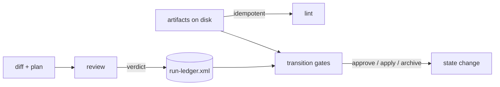

# Agent Reliability Implementation Plan

**Target repository:** `neo-grace` (`@neograce/cli`, 6.0.1)
**Audience:** an executor coding agent
**Authority:** derived from `decisions.md` in this directory, which records fifteen ratified
design decisions (D1–D15) and four verified findings (F1–F4). Where this plan and a source
document disagree, **this plan wins** — the conflicts were adjudicated in `decisions.md`.
`review-consolidated.md` frames the questions; `decisions.md` answers them; this plan orders
and specifies the work.
**Plan version:** 2.0 · 2026-07-29 (split; see below)

> **Approved for execution on 2026-07-30 — see §14 A1 for what that approval does and does not
> clear.** The blocking dependency is satisfied:
> [RM-AGENT-RELIABILITY-EVIDENCE](../../archive/RM-AGENT-RELIABILITY-EVIDENCE/plan.md) is `complete`
> and archived. Phases 0 and 1 were moved into that bundle on 2026-07-29; it fixed the measurement
> format and produced this repository's real `.ngrace` tree. §2 sequencing rule 0 stands as the record
> of why it had to run first.

> **The step detail below is provisional, and that is why the split happened.** Phases 2–11 were
> written in full before the evidence existed — before the measurement format was fixed, before there
> was a real `.ngrace` tree to design against, and before the v3 audit had run. The **objectives,
> decisions delivered, and review gates are ratified**; the **numbered steps and their verify commands
> are drafts against an imagined dataset.**
>
> At each phase's approval, re-derive its steps from what the evidence bundle actually produced, and
> record the difference. Treating these steps as specified is the mistake this structure exists to
> prevent. Every count in them is a claim — §15. **§14 A3.1 sets the quality bar every phase is held
> to:** a step list is a floor, not a budget.

> **Releases are not yet assigned.** `targets` is empty and the Release column in §2 reads `TBD`.

---

## 0. Operating contract for the executor

Read this section completely before touching any file. It is the contract you are held to for
every phase.

### 0.1 Four working principles

**1 — Think before coding.** Before writing a line in any phase, open every file listed under
*Files touched*, read it end to end, and write a short note in your response stating: what the
code does today, which of your assumptions the code contradicts, and which named function you
will change. If reading contradicts this plan, **stop and report the contradiction** rather than
improvising — this plan was written against HEAD and drift is possible.

**2 — Simplicity first.** No new runtime dependencies. No new required external toolchains. No
abstraction introduced for a single caller. No "while I'm here" refactors. If a phase can be
done with a 40-line function, do not build a plugin system.

**3 — Surgical changes.** Touch only the files a phase names. Do not reformat untouched code. Do
not rename existing symbols. Do not reorder imports in files you did not otherwise modify. Every
diff hunk must be traceable to a numbered step.

**4 — Goal-driven execution.** Every step is written as `step → verify: check`. You are not done
with a step until the verify check passes and you have shown its output. A step whose verify
check you did not run is an incomplete step.

### 0.2 Definition of "covered by tests"

Every phase requires both, and the review gate checks for both:

| Level | Location | What it proves |
|---|---|---|
| **Unit** | co-located `*.test.ts` next to the changed module | The changed function behaves correctly across the enumerated cases, including the negative and malformed ones |
| **Integration** | `src/grace-lint.test.ts`, `src/grace-status.test.ts`, `src/grace-query.test.ts` | Running the actual CLI against a real temp-directory project produces the expected issue codes, exit status, and JSON shape |

Rules:

- Every new issue code MUST have at least one integration test asserting it fires, and at least
  one asserting it does **not** fire on a clean project. Codes that only fire in tests you wrote
  to make them fire are not evidence.
- Every bug fix MUST have a regression test that fails on the pre-fix code. Write the test first,
  watch it fail, then fix. Show both outputs.
- No test may depend on machine state outside the temp project directory — no network, no
  `go`/`cargo`/`python` on PATH required.
- Tests must be deterministic. No timing assertions, no dependence on filesystem ordering.
- **New for this track:** any test covering ledger events must not assert on wall-clock time.
  Ordering comes from allocated ranges (D2), never from timestamps. A test that sorts by time is
  a defect in the test.

### 0.3 Repository invariants you must not break

1. `skills/ngrace/*` is the source of truth; `plugins/ngrace/skills/ngrace/*` is a byte-identical
   mirror. Any skill edit must be copied to the mirror in the same commit.
2. Versions stay synchronized across `README.md`, `openpackage.yml`,
   `.claude-plugin/marketplace.json`, `plugins/ngrace/.claude-plugin/plugin.json`, `package.json`.
3. Nothing may degrade silently. Every code path that cannot perform a check must emit the
   absence value with a reason (D5).
4. New grammar arrives only with the validator that makes it load-bearing.
5. Existing valid `.ngrace` trees must keep validating. Additive only, unless a phase explicitly
   says otherwise. **The run ledger and cursor are additive by construction** (D1): a project
   without them lints clean.
6. `NGRACE_ARTIFACT_VERSION` (`"1.0"`) is the *artifact grammar* version, validated on every root tag.
   Bump it only when something becomes **required**, and ship a migration path with it. It is
   not the product version.
7. Test helpers must never be published. Put shared test helpers in `src/test-support/` and
   confirm with `bun run validate:packed`.
8. **The binary writes only structural state it can derive or is explicitly given, never
   authored content, and never without an explicit apply** (F1). `ngrace graph split --apply`
   is the existing precedent; the ledger and cursor follow it.

### 0.4 Commands you will use constantly

```bash
git fetch origin && git status -sb     # FIRST, every phase — see §0.4.1
bun run typecheck                      # bunx tsc --noEmit
bun test                               # full unit + integration suite
bun run validate:cli                   # the three CLI integration suites
bun run validate:marketplace           # packaging, path safety, version sync, canonical↔packaged drift
bun run validate:ci                    # typecheck + test + validate:cli + validate:marketplace
bun run ngrace lint --path <dir>       # exercise the CLI directly (after Phase -1)
bun run ngrace <cmd> --help            # seven subcommands: doctor file graph lint module status verification
git show v3.11.0:<path>                # read GRACE 3 sources (F2) — they are in this repository
```

**Every command above resolves as written.** `package.json#scripts.ngrace` matches the published
binary since RM-NAMESPACE-SEPARATION Phase 0 (`69475b4`); the plan's former Phase −1, which existed
only to close that gap, was removed when that track completed. There is no `bun run grace` script
and no substitution to make.

**One thing to be careful of:** upstream `@osovv/grace-cli` may be installed on your `PATH` as
`grace`. It was, on the maintainer's machine, and `bun run grace lint` silently ran *upstream's*
linter against this repository. If a command unexpectedly succeeds, check which binary answered.

### 0.4.1 Fetch before you measure — the first command of every phase

**Run `git fetch origin && git status -sb` before reading anything, and confirm the local branch is not
behind `origin/main`.** Then confirm in §2's status board *on the fetched tree* that the phase you are
about to start is not already `COMPLETE`.

`git log` shows the local head. A clone that has not fetched shows a head that may be hours old, with a
clean tree, a green suite, and a `plan.md` whose last amendment is exactly where you expect it — every
signal consistent with a phase that has not started. Nothing in the worktree distinguishes *"this work
is not done"* from *"you have not looked."*

This is A5.5 one level up. That rule says an amendment is a claim measured at a commit; this one says
**check that the commit is still the track's head before you measure at it.** Re-deriving a phase
against a superseded baseline produces corrections that are true of a commit and irrelevant to the
work — and the whole phase built on them is unmergeable, which is not a defect any review of its
contents can find. See A28.

Cost: one second. It is stated as a command rather than a caution because the failure is invisible to
care and visible to `git fetch` (A15.4, A27.1 — prefer the check a tool performs over the diligence a
reader supplies).

### 0.5 Per-phase reporting format

At the end of every phase, report exactly this:

```
PHASE <n> — <name>
Status: COMPLETE | BLOCKED
Baseline: <local head> — origin/main <commit> after fetch; local not behind (§0.4.1)
Steps completed: <n>/<n>
Files changed: <list>
New issue codes: <list, or none>
Unit tests added: <count> (<file names>)
Integration tests added: <count> (<file names>)
Verify output:
  bun run typecheck            → <pass/fail>
  bun test                     → <n pass, n fail>
  bun run validate:cli         → <pass/fail>
  bun run validate:marketplace → <pass/fail>
Regression evidence: <for bug-fix phases: failing-before and passing-after output>
Token delta: <skill-text lines added/removed; per-invocation output size change, or "none">

Self-review (§0.7) — all five are required:
  Scope audit:        <files outside the declared list; deletions from existing tests; or "clean">
  Mutation check:     <table: each production change reverted alone → failure count>
                      <any row with 0 failures must name the discriminating negative added>
  Adversarial probe:  <table of >=15 inputs NOT in the case table, pass/fail>
                      <for each failure: the fix, and the test that now covers it>
  Compat sweep:       <new issue codes per fixture; "[]" for each, or explain>
  Anti-pattern audit: <§12.4 line by line: does the diff contain it?>

Deviations from plan: <none, or explain>
Open questions for review: <none, or list>
```

Then **stop and wait for review**. Do not begin the next phase.

The `Token delta` line is new for this track and is not optional. D15 makes the toolkit
accountable for its own footprint; a phase that adds skill text without reporting how much is a
phase that cannot be assessed against that decision.

### 0.6 Status legend

`NOT STARTED` · `IN PROGRESS` · `BLOCKED` · `READY FOR REVIEW` · `COMPLETE`

Update the status board in §2 as you go — it is the plan's own state, and keeping it accurate is
part of the job.

### 0.7 Phase self-review — mandatory before `READY FOR REVIEW`

A green test suite proves your tests pass. It does not prove your tests are *about* anything, and
it does not prove the code is right on inputs you did not think of. Every defect found in review
on the previous track was invisible to a green suite.

Run all five audits below and **put their output in your report**. A phase whose report is
missing an audit is not ready.

> **Note on reflexivity.** This track's product is, in part, the mechanization of this very
> protocol (Phase 6). Until that ships, you run it by hand. Do not skip an audit on the grounds
> that a later phase will automate it — the automation is being built *from* what this manual
> pass finds.

#### 0.7.1 Scope audit

```bash
git diff --name-only HEAD                                                # everything you touched
git diff --name-only HEAD | grep -vE '<the files this phase declares>'   # should be empty
git diff HEAD -- <each test file> | grep '^-' | grep -v '^---'           # deletions from existing tests
```

Report: files touched outside the phase's declared list (with justification), and any deletion
from a pre-existing test. Deleting or weakening an existing assertion is presumed wrong until you
argue otherwise.

#### 0.7.2 Mutation check — do your tests actually hold the code?

For **each** production change in the phase, revert it alone, run `bun test`, record the failure
count, restore.

```bash
cp src/path/to/file.ts /tmp/f.bak
# revert exactly one change (one function, one call site, one condition)
bun test 2>&1 | tail -4
cp /tmp/f.bak src/path/to/file.ts
```

Report as a table:

| Reverted | Failures |
|---|---|
| `foldEpoch` range-density check → always true | 3 |
| `run.xml` referential lint call site | 1 |

**Zero failures is a finding, not a pass.** A change that can be reverted with zero failures is
untested, no matter how many tests you added around it. The fix is one *discriminating negative*
— an input where the correct and incorrect behaviours differ. If a revert yields zero, write that
negative before proceeding.

#### 0.7.3 Adversarial probe — go beyond your own case table

Write a throwaway script in the scratchpad exercising **at least 15 inputs that are not in the
phase's case table**, and put the pass/fail table in your report. Probe, then promote whatever
failed into a test alongside the fix.

Probe these categories every time:

| Category | Why |
|---|---|
| **Multi-line / nested** variants of every construct in the table | Case tables drift toward one-liners |
| **Near-misses** — input resembling the target but not it | Detection logic keys on a prefix or substring |
| **The syntax appearing inside prose, comments, or strings** | Regex over flattened text cannot tell them apart |
| **Empty, truncated, unterminated, pathological** | Must degrade, never throw or hang |
| **The silent direction** — does the check stay quiet when it should? | Over-firing is as bad as under-firing |
| **Every row of the phase's own table, re-run through the public entry point** | Unit tests can pass while the wiring is wrong |

**Categories specific to this track**, to add whenever the phase touches the ledger or a gate:

| Category | Why |
|---|---|
| **Concurrent appends from two allocated ranges** | D2's whole premise; a serial-only test proves nothing about it |
| **A range with a hole, and a range with no terminal event** | D2's loss detection must fire on both, and must not fire on a clean dense range |
| **An interrupted fold** — ledger written, loose files not deleted | D3's write-verify-delete ordering |
| **A cursor naming a task absent from the plan, and an absent cursor** | D1: the first is an error, the second is silent |
| **An absence value with every reason code, through each gate** | D5: required evidence blocks, optional evidence does not |

For each failure ask: **could this produce a confident false error?** That is the worst outcome
in this codebase — worse than the silent gap it replaced — because it blocks correct work and
teaches people to ignore the tool. Rank findings by that.

#### 0.7.4 Backward-compatibility sweep

Any phase that adds an issue code must run it against **every** fixture and report the new codes
per fixture:

```
polyglotFixture()   → []
minimalTsFixture()  → []
scaleFixture(20)    → []
examples/           → []
```

A new **error** on a previously-green project is a release-breaking change. If one appears,
either the severity is wrong or the check is. Do not proceed by editing the fixture to suit the
check.

#### 0.7.5 Anti-pattern self-audit

Re-read §12.4 and state, per line, that your diff does not contain it. The list only works if it
is actually consulted against the finished diff.

#### 0.7.6 When a probe finds something

Fix it in the same phase, add the failing input as a test, and **report both the probe output and
the fix**. Do not silently fix and report clean: the probe result is the evidence that the test
you added is worth having.

If you believe a finding is out of scope, say so explicitly with your reasoning rather than
omitting it.

---

## 1. Orientation — the system as it exists today

Read this against the real code before you start. If any of it is wrong at HEAD, report it.

### 1.1 What already exists that this track builds on

| Capability | Where | Why it matters here |
|---|---|---|
| Absence primitives, fail-closed | `src/artifact/assertions.ts:263`, `:506`; `src/grace-status.ts:127` | `assertion.command-not-evaluated` is already an error. D5 unifies these rather than inventing them |
| Language confidence tiers | `src/language-registry.ts`, adapters | `exact \| heuristic \| no-adapter` — the *precision* axis of D5, already shipped |
| Deterministic retrieval | `src/grace-module.ts`, `src/grace-file.ts` | `module show --with verification --json`, `module find --depends`, `file show --contracts --blocks --json`. D7: the packet's retrieval half already exists |
| Structural writes behind `--apply` | `src/grace-graph.ts:285–290`, `:296`, `:347` | F1: the precedent the ledger follows. Dry-run default, explicit apply, refuses on a bad projection |
| Read-only enforcement by snapshot test | `src/artifact/scale-ergonomics.test.ts:212` | The mechanism for proving a command does not write. Reusable per-command |
| Recursive mirror validation | `scripts/validate-marketplace.ts:229–270` | `git diff --no-index` over each listed skill **directory**. D13 depends on this |
| Grammar forbids nested status | `src/artifact/grammar.ts:167` | `artifact.forbidden-status-attribute` — why the cursor lives outside `plan.xml` (D1) |

### 1.2 What does not exist and this track creates

| Thing | Decision |
|---|---|
| `run-ledger.xml` — append-only epoch record | D1, D2, D3 |
| `run.xml` — regenerable position cache | D1 |
| A unified absence value with reason codes | D5 |
| Transition gates as a surface distinct from lint and review | D14 |
| Detached reviewer with deterministic finding IDs | D4, §4.3 |
| Seeded-defect corpus | D4, §5.4 |
| Task-scoped selection over artifacts and skills | D15 |
| Calibration corpus and report | D6 |

### 1.3 The three check surfaces (D14)



`lint` never reads run state. Gates may. `review` produces findings that land in the ledger.
Confusing these is the failure §5.7 warned about.

---

## 2. Phase status board

Keep this table current. It is the single source of truth for progress.

| # | Phase | Decisions delivered | Release | Status |
|---|---|---|---|---|
| 2 | Absence value & honest verdicts | D5 (vocabulary half), D13 | TBD | `COMPLETE` |
| 3 | Run ledger & cursor | D1, D2, D3 | TBD | `COMPLETE` |
| 4 | Attempt log, fix budget, escalation | D6 (attempt half), D9 | TBD | `COMPLETE` |
| 5 | Gate declarations & transition surface | D5 (gate half), D11, D12, D14 | TBD | `COMPLETE` |
| 6 | Detached reviewer & mechanized audits | D4 (gate), §4.3, §5.2 | TBD | `COMPLETE` |
| 7 | Deterministic failure localization | D8 | TBD | `COMPLETE` |
| 8 | Selection: task slices & skill subsetting | D15, §4.1 | TBD | `COMPLETE` |
| 9 | Confidence recording & calibration report | D6 (calibration half) | TBD | `READY FOR REVIEW` |
| 10 | Plan-quality signal & doctor consumers | D10, §4.9 subset | TBD | `NOT STARTED` |
| 11 | Adoption surface | §5.1, §5.3 | TBD | `NOT STARTED` |

**Hard sequencing rules** — these are dependencies, not preferences. Each is stated with what
breaks if violated:

0. **The evidence bundle → everything here.**
   [RM-AGENT-RELIABILITY-EVIDENCE](../../archive/RM-AGENT-RELIABILITY-EVIDENCE/plan.md) must be `complete`.
   Its Phase 0 fixes the measurement format that every number below is reported in; its Phase 1
   produces the real `.ngrace` tree that Phases 3, 4, 8 and 9 are designed against. Starting here
   first does not merely risk rework — it means measuring with an unfixed instrument and designing
   against fixtures, which is this track's own central lesson applied backwards.
1. **2 → 5.** Gates declare required evidence; the absence value is what "evidence is missing"
   means. Without it, gates have no vocabulary to fail on.
2. **3 → 4, 5, 9, 10.** The ledger is where attempts, overrides, degradations and verdicts land.
3. **5 → 6.** The reviewer's verdict requirement is a gate; the gate surface must exist first.
4. **6 → 10.** The plan-quality signal is computed from review outcomes.
5. **11 last.** §5.1 is a blocking constraint on user-visible surfaces: the full-lifecycle
   walkthrough lands with or before the last user-facing capability, not after it.

Phases **7** and **8** may float anywhere after 2 and 3 respectively. **4** may float after 3.

---

# PHASE 2 — Absence value & honest verdicts

**Status:** `COMPLETE`
**Decisions:** D5 (vocabulary half), D13
**Release:** TBD

> **Amended by §14 A3–A6 — read all four before §2.5.** The steps below were written before the evidence
> existed. A3 re-derives them against HEAD (eight corrections), adds the scope A3.1's quality bar pulls in,
> and carries two decisions; A4 answers both and adds a ninth correction; A5 adds a tenth and an eleventh,
> **withdraws A4.3's consequence 2**, and sets three standing rules; A6 adds corrections 12–14, **corrects
> A5.2's flag name**, sets a fourth standing rule, and approves the spec; A7 is the review gate — one
> undisclosed behaviour change, four defects to fix before merge, and a fifth standing rule; A8 answers
> A7.1 with a warning-level near-miss code.

## 2.1 Objective

Make *"no answer was produced"* one recognizable thing across every surface, and supply the
missing words for the surfaces the binary does not own.

**This phase is mostly renaming and routing.** Three of the seven absence values already ship.
The work is making them recognizable as a class, not inventing them.

## 2.2 Preconditions

→ verify: `bun run validate:ci` green, and the **evidence bundle** `complete` — both its Phase 0 and
its Phase 1. See [RM-AGENT-RELIABILITY-EVIDENCE](../../archive/RM-AGENT-RELIABILITY-EVIDENCE/plan.md).

→ verify: `grep -n 'assertion.command-not-evaluated' src/artifact/assertions.ts` returns two sites
(≈`:263`, ≈`:506`) and `grep -n 'analysis.no-adapter' src/lint/catalog.ts` returns one. If the
counts differ, F-series findings drifted — report before proceeding.

## 2.3 Files touched

| File | Action |
|---|---|
| `src/lint/types.ts` | EDIT — add the absence classification to the issue record |
| `src/lint/catalog.ts` | EDIT — mark absence-class codes; add `derivedFrom` / `proposedBy` |
| `src/artifact/assertions.ts` | EDIT — two call sites, classification only |
| `src/grace-doctor.ts` | EDIT — report absence counts by reason |
| `skills/ngrace/ngrace-cli/references/verdicts.md` | CREATE — the one shared fragment |
| `plugins/ngrace/skills/ngrace/ngrace-cli/references/verdicts.md` | CREATE (mirror) |
| `skills/ngrace/ngrace-execute/SKILL.md` | EDIT — one sentence |
| `skills/ngrace/ngrace-reviewer/SKILL.md` | EDIT — one sentence |
| `skills/ngrace/ngrace-verification/SKILL.md` | EDIT — one sentence |
| (+ the three packaged mirrors) | EDIT |
| `scripts/validate-marketplace.ts` | EDIT — single-source rule for the verdict tokens |

## 2.4 Design

**The codes are already the reason codes.** D5 asks for one value plus a required reason;
`analysis.no-adapter`, `analysis.runtime-missing` and `assertion.command-not-evaluated` are
exactly that reason, already named and already shipped.

So the unification is **additive classification, not a rename**:

```
PSEUDOCODE  — src/lint/types.ts

type IssueClass = "defect" | "absence";

interface LintIssue {
  // ...existing fields unchanged...
  issueClass?: IssueClass;   // absent means "defect" — no existing consumer breaks
}
```

A consumer can then ask *"is this an absence?"* without enumerating seven names, and the reason
travels in the field that already carries it.

**Renaming the codes is explicitly rejected.** It breaks every consumer matching on code strings,
for no gain: the reason is the code.

| Code | Class | Reason character |
|---|---|---|
| `analysis.no-adapter` | absence | structural; not fixable by rerunning |
| `analysis.runtime-missing` | absence | environmental; install something |
| `assertion.command-not-evaluated` | absence | operator declined; pass a flag |
| everything else today | defect | — |

**The surfaces the binary does not own** get authored vocabulary in one physical file
(D13): review outcomes (`pass | fail | unable-to-determine`), AC satisfaction
(`satisfied | satisfied-unverified | not-satisfied`), verification rows
(`pass | fail | not-run`).

Skills reference it; they do not inline it. Each verdict-emitting skill gains **one sentence**,
not a table:

> Report the value the CLI emitted. Never summarize an absence into a pass.

## 2.5 Steps

**Step 2.5.1 — Add `issueClass` to the issue record.**
→ verify: `bun run typecheck` clean, and `bun test` shows no change in pass count. This step must
be behaviour-neutral; if any test changes, the field is not additive.

**Step 2.5.2 — Classify the three shipped absence codes.**
Set `issueClass: "absence"` at the emission sites in `assertions.ts` and wherever
`analysis.no-adapter` / `analysis.runtime-missing` are raised.
→ verify: an integration test asserts a project missing an adapter produces an issue with
`issueClass === "absence"`, and a project with an ordinary grammar error produces one without it.

**Step 2.5.3 — Add `derivedFrom` / `proposedBy` to the catalog guide type (§12.1).**
Populate them for the three absence codes and leave the rest to be filled as later phases touch
them.
→ verify: a unit test asserts every code carrying `issueClass: "absence"` also carries at least
one of `derivedFrom` / `proposedBy`. Absence codes are the ones this track is built on; an
unjustified one is a design error.

**Step 2.5.4 — Teach `doctor` to report absences by reason.**
→ verify: `ngrace doctor --path .` against the **evidence bundle's** Phase 1 `.ngrace` prints an absence count per reason
code, and prints zero when nothing is absent. Include both outputs in the report.

**Step 2.5.5 — Create `skills/ngrace/ngrace-cli/references/verdicts.md`.**
Contains the three authored vocabularies above and nothing the binary already emits.
→ verify: the file is under 40 lines. If it is longer, it has started restating the catalog.

**Step 2.5.6 — Add the single-source rule to `validate-marketplace.ts`.**
The verdict token set (`unable-to-determine`, `satisfied-unverified`, `not-run`) may appear in
exactly one file under `skills/`.
→ verify: the rule fails when the tokens are duplicated into a second skill (test it by
temporarily adding one), and passes at HEAD.

**Step 2.5.7 — Add the one sentence to the three verdict-emitting skills, and mirror.**
→ verify: `bun run validate:marketplace` passes. Report the skill-text line delta — it should be
in single digits per skill.

## 2.6 Definition of done

- `issueClass` exists and is additive; no pre-existing test changed behaviour
- The three shipped absence codes are classified and justified
- `doctor` reports absences by reason, including the zero case
- One shared fragment; the single-source rule fails on duplication
- Token delta reported; skill text grew by less than 30 lines total
- `bun run validate:ci` green

## 2.7 Review gate

1. Was any existing issue code renamed or removed? It must not have been.
2. Does the shared fragment restate anything the binary emits? It must not.
3. Does the single-source rule actually fail on duplication — with the failing output shown — or
   was it only asserted to pass?

## 2.8 Rollback

Revert `issueClass` and the classification sites; delete the fragment, the two mirror copies, and
the validator rule. All additive, so rollback is clean.

---

# PHASE 3 — Run ledger & cursor

**Status:** `COMPLETE`
**Decisions:** D1, D2, D3
**Release:** TBD

> **Amended by §14 A10 and A11 — read both before §3.5.** The steps below were written before the evidence
> existed. A10 re-derives them against HEAD: §3.1, §3.6 and §3.7 stand; **§3.5 does not**. Eight corrections
> (16–23), of which correction 16 invalidates §3.4's "registers exactly as `design-context.xml` does"
> premise and correction 17 shows step 3.5.1's verify check passes today with no code written.
> **A11 answers A10.12's four decisions and adds a fifth**, and is normative where it disagrees with §3.4
> and §3.5: twelve issue codes, required bundle identity, a sixth `regenerate` subcommand reading three
> sources, and three graph modules the phase must add.
> **A12 and A14 are the review gates.** A12's two corrections (row 3 unbuilt, no integration tests) were
> satisfied at `f7de98e`; A13 answered A12.1 and corrected the criterion that caused it. **A14 is the
> gates that followed:** A14's corrections 27–28 applied D5's absence reasoning to `state` and
> `complete`; A15's 29–30 pinned the delete surface and added this phase's suites to Windows CI. **A16
> clears all findings** — the only thing left is running the Windows job (A16.2). Standing rules 6–7 came
> from A12, rule 8 from A14, and A15.4 carries Phase 6's priority evidence.

## 3.1 Objective

Give a change bundle durable position and a durable record of what cannot be re-derived, without
touching the approved plan.

Read D1, D2 and D3 in full before starting. This phase implements them literally; where this
plan is terser than `decisions.md`, `decisions.md` governs the rationale and this plan governs
the code.

## 3.2 Preconditions

→ verify: the **evidence bundle's** Phase 1 is `COMPLETE` — this phase is designed against the real
bundle flow, not a fixture.

→ verify: `grep -n 'NGRACE_CHANGE_COMPANION_TAGS' src/artifact/*.ts` shows the companion-tag
mechanism that `design-context.xml` already uses. The ledger registers the same way; if that
mechanism is gone, stop and report.

## 3.3 Files touched

| File | Action |
|---|---|
| `src/artifact/types.ts` | EDIT — companion tags, event and epoch types |
| `src/artifact/grammar.ts` | EDIT — `validateRunLedgerArtifact`, `validateRunCursorArtifact` |
| `src/artifact/paths.ts` | READ ONLY — every authored path goes through `resolveContainedProjectPath` |
| `src/grace-cursor.ts` | CREATE — the sole write surface |
| `src/grace-cursor.test.ts` | CREATE |
| `src/grace.ts` | EDIT — register the `cursor` subcommand |
| `src/lint/core.ts` | EDIT — referential integrity of ledger against plan |
| `src/grace-status.ts` | EDIT — surface the cursor |
| `src/test-support/fixtures.ts` | EDIT — builders for ledgers and epochs |

## 3.4 Design

### Layout

```
.ngrace/changes/active/C-3/
  spec.xml            immutable once approved
  plan.xml            immutable once approved
  run-ledger.xml      grows by one <Epoch-N> per fold; the truth
  run/                loose event files; empty between epochs
  run.xml             cursor cache; regenerable; disposable
```

### Grammar

`<NgraceRunLedger>` and `<NgraceRunCursor>` register as **change companion tags**, exactly as
`design-context.xml` does. Model `validateRunLedgerArtifact` on
`validateChangeDesignContextArtifact` (`src/artifact/grammar.ts:574`).

**`Epoch-N` is not a semantic anchor.** Do not add it to `ANCHOR_PATTERNS`. §8 of the review is
explicit that reliability is loop and evidence, not more anchors, and `ANCHOR_PATTERNS` is
deliberately reserved for the semantic families. An epoch is structural sequencing.

### Event identity (D2)

```
PSEUDOCODE

interface RangeAllocation { worker: string; from: number; to: number; }

// Emitted as the epoch's opening event; every later event ID must fall inside
// one of these ranges, or the ledger has a rogue writer.
interface EpochOpened {
  epoch: number;
  wave?: string;              // absent is legal — a hotfix outside any planned wave
  executor?: string;          // harness-stated, unverifiable, may be absent (D6)
  allocations: RangeAllocation[];
}
```

Event files are `run/<id>-<task>-<kind>.xml`. **No timestamps in identity or ordering.** A test
that sorts by time is a defect in the test (§0.2).

### Fold (D3)

At epoch close — a quiescent barrier, orchestrator the sole writer:

1. Read `run/*`
2. Verify **range membership** (every ID inside an allocation) and **density** (each used range
   dense from its start to a terminal event)
3. Write `<Epoch-N wave="M">` appended to `run-ledger.xml`
4. Re-read and verify the written ledger contains exactly N events
5. **Only then** delete the loose files

**Write, verify, then delete — never delete first.** An interrupted fold must leave both forms.

### Completeness

Mark each folded epoch complete or incomplete (D6's bias safeguard). Incomplete means a used
range lacked a terminal event, or had a hole.

## 3.5 Steps

**Step 3.5.1 — Types and companion-tag registration.**
→ verify: `bun run typecheck` clean; a fixture bundle carrying an empty `run-ledger.xml` lints
without `change.invalid-root-tag`.

**Step 3.5.2 — `validateRunLedgerArtifact`.**
Rejects: unknown root tag, non-monotonic epoch numbers, a renumbered or reordered epoch, an event
ID outside every allocation, a hole inside a used range, a used range with no terminal event.
→ verify: one unit test per rejection, each asserting the specific code — six tests minimum. A
single "invalid ledger" test is not evidence.

**Step 3.5.3 — `validateRunCursorArtifact` and the conditional referential check.**

Three behaviours, and the middle one is the one that gets built wrong:

| State | Result |
|---|---|
| No `run.xml` | **Silent.** No issue. The cursor is optional (D1) |
| `run.xml` naming a task absent from `plan.xml` | **Error** |
| `run.xml` consistent with `plan.xml` | Clean |

→ verify: three integration tests, one per row. The first is the one to write first — it is the
behaviour most likely to be lost to the house's fail-closed instinct.

**Step 3.5.4 — `src/grace-cursor.ts` as the sole write surface.**

Subcommands: `show`, `advance`, `pause`, `resume`, `fold`. Only `advance`, `pause`, `resume` and
`fold` write; `show` must not.

→ verify: a directory-snapshot test proves `cursor show` leaves the tree byte-identical. Model it
on `src/artifact/scale-ergonomics.test.ts:212`, which already does exactly this for `doctor`.

**Step 3.5.5 — Implement `fold` with write-verify-delete ordering.**
→ verify: a test that injects a failure between write and delete leaves **both** the ledger and
the loose files, and a follow-up `fold` is idempotent rather than duplicating the epoch.

**Step 3.5.6 — Concurrent append test.**
Two allocations, interleaved writes, then fold.
→ verify: the fold succeeds, every event is present, and no ordering assertion anywhere in the
test refers to a clock.

**Step 3.5.7 — Surface the cursor in `ngrace status`.**
→ verify: `ngrace status --path .` prints the change, epoch, task counts and next skill, and
prints normally when no cursor exists.

**Step 3.5.8 — Confirm the write invariant did not leak.**
→ verify: `grep -rn 'writeFileSync\|mkdirSync' src --include='*.ts' | grep -v test` returns
`grace-graph.ts`, `grace-cursor.ts`, and the dart adapter's temp-dir use — and nothing else.
Report the output verbatim.

## 3.6 Definition of done

- Ledger and cursor validate; six rejection tests minimum
- Absent cursor is silent; inconsistent cursor is an error; both tested
- `cursor show` proven non-writing by directory snapshot
- Interrupted fold leaves both forms; re-fold is idempotent
- Concurrent append test passes with no clock dependency
- Write-surface grep output reported verbatim
- `bun run validate:ci` green

## 3.7 Review gate

1. Does an absent cursor produce *any* diagnostic? It must not.
2. Is `Epoch-N` in `ANCHOR_PATTERNS`? It must not be.
3. Does any test order events by timestamp?
4. Was the fold's delete step ever reachable before the verify step?

## 3.8 Rollback

Remove the `cursor` subcommand and its module, the two validators, the referential check and the
status surfacing. Bundles carrying a `run-ledger.xml` then lint as unknown-companion — so
rollback must also remove the companion-tag registration, or state why not.

---

# PHASE 4 — Attempt log, fix budget, escalation

**Status:** `COMPLETE`
**Decisions:** D6 (attempt half), D9
**Release:** TBD

> **Amended by §14 A18 — read it before §4.4 and §4.5.** §4.4's pseudocode was written before Phases 2
> and 3 existed and does not survive contact with what they shipped: six corrections (31–36) follow,
> one of which (31) means the phase's central payload is **silently destroyed by the existing fold**
> before any Phase 4 code is written. A18 is normative where it disagrees with §4.4 and §4.5. Three of
> its decisions (A18.8) are the maintainer's, not the executor's. **A17.3 binds this phase: the bundle
> carries a `plan.xml` authored before execution, together with the spec.**

## 4.1 Objective

Record every attempt, not only outcomes; bound churn at two; escalate to replan rather than abort.

## 4.2 Preconditions

→ verify: Phase 3 `COMPLETE`. Attempts are ledger events; there is nowhere to put them otherwise.

## 4.3 Files touched

| File | Action |
|---|---|
| `src/artifact/types.ts` | EDIT — attempt event, failure signature |
| `src/grace-cursor.ts` | EDIT — attempt recording, budget accounting |
| `src/grace-cursor.test.ts` | EDIT |
| `skills/ngrace/ngrace-execute/SKILL.md` | EDIT — budget and escalation rule |
| `plugins/ngrace/skills/ngrace/ngrace-execute/SKILL.md` | EDIT (mirror) |

## 4.4 Design

**The ledger is an attempt log, not a state log** (D6). Append every attempt and its verdict;
never update a task's status in place.

```
PSEUDOCODE

interface AttemptEvent {
  task: string;
  ordinal: number;              // 1-based within the task
  outcome: "pass" | "fail";
  signature?: FailureSignature; // present when outcome is "fail"
}

interface FailureSignature {
  kind: string;                 // e.g. "test-failure", "typecheck", "lint"
  key: string;                  // stable identity of *what* failed
}
```

**The counter stays dumb** (D9). Every attempt counts against the budget regardless of signature.
The signature is recorded for the escalation message and for analysis — it does not modify the
count. Do not write logic that decides an attempt "was progress" and should not count.

**Budget exhaustion is a normal state.** On the second failed attempt: record the exhaustion
event, transition the task to `paused-pending-approval`, and surface both signatures.

**Flake detection is a read over the log, not a new event.** `fail → (no fix) → pass` on the same
task with no intervening write is a flaky test, and it is classified rather than pooled into the
churn trend (D8).

## 4.5 Steps

**Step 4.5.1 — Attempt and signature types; record on every verification cycle.**
→ verify: a task that passes first time produces one attempt event; a task that fails then passes
produces two, both present in the ledger after fold.

**Step 4.5.2 — Budget accounting with a dumb counter.**
→ verify: a test asserting that two failures with *different* signatures still exhaust the budget.
This is the discriminating negative for "the counter stays dumb" — without it, a later
optimization can quietly make the counter clever and no test will notice.

**Step 4.5.3 — Exhaustion → `paused-pending-approval`, with both signatures surfaced.**
→ verify: the escalation output names both failure signatures and does not claim the task failed.
Show the output.

**Step 4.5.4 — Flake classification.**
→ verify: a fixture where a test fails then passes with no intervening write is reported as
flaky, and one where a fix landed between them is reported as a normal retry.

**Step 4.5.5 — Skill text: the budget and escalation rule, mirrored.**
→ verify: `validate:marketplace` passes; report the line delta.

## 4.6 Definition of done

- Attempts recorded individually; outcome-only recording nowhere in the diff
- Different-signature failures still exhaust the budget (test present)
- Exhaustion pauses rather than fails, with both signatures shown
- Flake distinguished from retry
- `bun run validate:ci` green

## 4.7 Review gate

1. Can the counter be made clever by a one-line change without failing a test? If so, step 4.5.2's
   negative is missing or too weak.
2. Does any code path overwrite a previous attempt rather than appending?
3. Is `2` a named constant with the "judgment, not derived" note from D9 beside it?

## 4.8 Rollback

Remove attempt events, budget accounting and the skill text. The ledger tolerates unknown event
kinds being absent, so older bundles are unaffected.

---

# PHASE 5 — Gate declarations & transition surface

**Status:** `COMPLETE`
**Decisions:** D5 (gate half), D11, D12, D14
**Release:** TBD

> **Amended by §14 A29 — read it before §5.4 and §5.5.** §5.3's files table and §5.5's step list
> were written before Phases 2–4 existed and do not survive contact with HEAD: there are no transition
> commands to wire into, no verdict record, no typed clarification hole, and no project-level fail-on
> declaration. A29 re-derives the phase at `6389e3a` with corrections 49 onward, works A27.3's three
> inheritances into concrete steps, and records four ratified conclusions that stage 2 builds to.
> **A29 is normative where it disagrees with §5.3, §5.4 and §5.5.** A17.3 still binds: the bundle
> carries a `spec.xml` (draft, awaiting approval) before plan and execution.
>
> **A30 accepts A29 and corrects one thing in it — read it after A29 and before building.** Correction
> 61: gate decisions and review verdicts are bundle-scoped, and the run event stream is task- and
> epoch-scoped, so they live in a non-`Epoch-N` section of `run-ledger.xml`. A30 also sets standing
> rule 10 and retires `NON_POSITION_KINDS` from this phase's scope.
>
> **A31, A32, A33 and A34 are the four review gates — A34 closes the phase.** Corrections 62–69 landed
> across them; the phase shipped two bundles, `C-GATE-SURFACE` and `C-GATE-RECORD-ABSENCE`, each closed
> through its own gates. A34.1 records what the rounds measured and hands Phase 6 four parameterized
> join queries; A33.3 records the self-recorded verdict that Phase 6 exists to replace.

## 5.1 Objective

Create the third check surface, and let each gate declare what evidence it requires — so blocking
is a property of the gate, not of any mechanism.

## 5.2 Preconditions

→ verify: Phase 2 `COMPLETE` — a gate needs the absence class to fail on.
→ verify: Phase 3 `COMPLETE` — gates consult the ledger.

## 5.3 Files touched

| File | Action |
|---|---|
| `src/gates/core.ts` | CREATE — the surface |
| `src/gates/core.test.ts` | CREATE |
| `src/gates/catalog.ts` | CREATE — `gate.*` codes |
| `src/lint/core.ts` | READ ONLY — must not learn about gates |
| `src/lint/core.test.ts` | CREATE — add the boundary test (no such file exists yet) |
| `src/grace.ts` | EDIT — wire gates into the transition commands |
| `skills/ngrace/ngrace-execute/SKILL.md`, `ngrace-reviewer/SKILL.md` | EDIT |
| (+ mirrors) | EDIT |

## 5.4 Design

```
PSEUDOCODE

interface EvidenceRequirement {
  id: string;                    // e.g. "review-verdict", "command-assertions"
  required: boolean;
}

interface Gate {
  id: "approve" | "apply" | "archive";
  requires: EvidenceRequirement[];
}

// The whole blocking rule, in one function:
//   required evidence absent            → gate fails closed
//   optional evidence absent            → reported, does not block
//   evidence present                    → gate consults its value
```

**The D14 boundary is testable and must be tested:** a `gate.*` code may never be emitted by
`runLint`. Lint reads artifacts and is idempotent; gates read run state.

### The three gate declarations this phase ships

| Gate | Requires | From |
|---|---|---|
| `approve` | no unresolved `[NEEDS CLARIFICATION]` on `IC-*` or `INV-*` | D12 |
| `apply` | a recorded review verdict (any value, including `unable-to-determine`); no unresolved clarification on any `AC-*` the change claims to satisfy; no unexecuted declared command assertion | D11, D12, §4.7 |
| `archive` | no open epoch | D3 |

**`applied` requires a verdict to exist, not to be clean** (D11). A change may apply with
`unable-to-determine` or with open judgment findings. It may not apply with no review at all.

**`ASSUMPTION` never appears in any requirement.** It is presence with weak provenance, not
absence (D12). If it shows up in a gate, the phase is wrong.

### Hosts that cannot review

A missing verdict because the host cannot produce one is the absence value with reason
`host-capability-missing` — not an exemption. Whether it blocks is governed by the existing
fail-on policy, and the docs must publish the guarantee as conditional (§5.2).

## 5.5 Steps

**Step 5.5.1 — Create the gate surface and catalog.**
→ verify: `gate.*` codes exist in their own catalog, and a unit test asserts the `gate.` prefix is
absent from `src/lint/catalog.ts`.

**Step 5.5.2 — The boundary test.**
→ verify: an integration test runs `ngrace lint` over a project with an open epoch and an absent
review verdict, and asserts **no** `gate.*` code appears in the output. This is D14's boundary and
it is the test most likely to be skipped.

**Step 5.5.3 — Implement requirement evaluation.**
→ verify: a table test covering the three rows of the blocking rule, with each absence reason code
from Phase 2 exercised through a required and an optional requirement — six cases minimum.

**Step 5.5.4 — The `approve` gate and clarification blocking.**
→ verify: a clarification on `IC-*` blocks approval; the same text on a non-satisfied `AC-*` does
not; an `ASSUMPTION` anywhere does not. Three tests.

**Step 5.5.5 — The `apply` gate and the verdict requirement.**
→ verify: apply blocked with no verdict; apply **permitted** with `unable-to-determine`. The second
is the one that proves D11 was implemented rather than a simpler "review must pass."

**Step 5.5.6 — The `archive` gate and the open-epoch precondition.**
→ verify: archive blocked with loose files in `run/`; permitted after a fold.

**Step 5.5.7 — `host-capability-missing` through the fail-on policy.**
→ verify: with the policy permissive, apply proceeds and the absence is reported; with it strict,
apply blocks. Both outputs shown.

**Step 5.5.8 — Skill text and mirrors.**
→ verify: `validate:marketplace` passes; line delta reported.

## 5.6 Definition of done

- `gate.*` codes exist and cannot be emitted by lint (test present)
- Blocking rule table-tested across every Phase 2 absence reason
- `apply` permitted with `unable-to-determine`, blocked with no verdict
- `ASSUMPTION` blocks nothing anywhere
- Host-capability path exercised both ways
- `bun run validate:ci` green

## 5.7 Review gate

1. Did `src/lint/core.ts` change? It should not have, beyond wiring nothing.
2. Is there anywhere a mechanism decides whether it blocks? Blocking belongs to the gate.
3. Does apply succeed with `unable-to-determine`? If not, D11 was implemented as "review must
   pass," which is a different and worse decision.

## 5.8 Rollback

Delete `src/gates/`, revert the transition wiring and the skill text. Lint is untouched by
construction, so nothing in the existing pipeline regresses.

---

# PHASE 6 — Detached reviewer & mechanized audits

**Status:** `COMPLETE`
**Decisions:** D4 (gate), §4.3, §5.2
**Release:** TBD

> **Amended by §14 A35 — read it before §6.3–§6.5.** The steps below were written before Phases 2–5
> existed and before the corpus named exact `review.*` codes. A35 re-derives the phase at `e5627ca`
> with corrections 70 onward, reconciles §6.4's process audits against the corpus's pattern codes
> (they are different things; the scorer as written would measure nothing on the review surface), and
> sets the detector set as a **superset**: five pattern detectors + four process audits + A34.1's
> parameterized join engine as the build method. **A35 is normative where it disagrees with §6.3,
> §6.4 and §6.5.** A17.3 still binds: the bundle carries a `spec.xml` (draft, awaiting approval)
> before plan and execution. Two archived bundles already hold self-recorded `pass` verdicts
> (A33.3) — Phase 6 is what makes detachment real rather than honor-system. Closed after A39 (corr
> 92) with `C-REVIEW-SURFACE` applied and archived; first bundle whose apply verdict is backed by a
> mechanized `ngrace review` of its own surface (residual judgment still honor-system — A33.3).

## 6.1 Objective

Productize the self-review protocol that found all nineteen defects on the previous track:
mechanize what can be mechanized, keep the judgment part detached, and make the reviewer's own
stability testable.

## 6.2 Preconditions

→ verify: Phase 5 `COMPLETE` — the verdict requirement is a gate and the gate surface must exist.
→ verify: the **evidence bundle's** Phase 0 corpus has ≥10 entries. The determinism gate has nothing to run against
otherwise.

## 6.3 Files touched

| File | Action |
|---|---|
| `src/review/core.ts` | CREATE — mechanized audits, finding IDs |
| `src/review/core.test.ts` | CREATE |
| `src/review/catalog.ts` | CREATE — `review.*` codes |
| `src/review/scorer.ts` | CREATE — corpus scoring for D4 |
| `src/review/scorer.test.ts` | CREATE |
| `src/grace.ts` | EDIT — `review` subcommand |
| `skills/ngrace/ngrace-reviewer/SKILL.md` | EDIT — detachment contract |
| `skills/ngrace/ngrace-setup-subagents/references/roles/*.md` | EDIT — read-only reviewer preset |
| (+ mirrors) | EDIT |
| `README.md` | EDIT — host capability matrix |

## 6.4 Design

### The three non-negotiables (§4.3), and how each is enforced rather than instructed

| Rule | Enforcement |
|---|---|
| Separate instance, no implementer transcript | Subagent spawn with cold context — a **host capability**, not an instruction (§5.2) |
| Read-only by tool permission | Agent-definition tool allowlist — configuration, not instruction |
| Deterministic finding IDs | A property of `src/review/core.ts`, testable here |

The first two degrade to an honor system on hosts lacking them. **That is published, not hidden**
— see step 6.5.7.

### Mechanized audits

| Audit | Computation |
|---|---|
| Scope | `git diff --name-only` vs. `ObservedWriteScope` |
| Test weakening | diff test files; flag removed or loosened assertions |
| Backward-compat | lint every fixture before and after; diff the issue-code sets |
| Hunk coverage | which changed hunks are defended by *any* test |

**Full `grace mutate` is out of scope** (Q1, unanimous). Hunk coverage attribution first;
revert-and-rerun stays an opt-in deep audit and is not built here.

### Deterministic finding IDs

```
PSEUDOCODE

findingId(f) = hash(auditId, file, anchorOrHunkKey, ruleId)
```

**Never include:** line numbers alone (they move under unrelated edits), timestamps, iteration
order, or anything derived from the agent's narration. Two runs over an unchanged tree must
produce identical IDs *and* identical counts.

## 6.5 Steps

**Step 6.5.1 — Mechanized audits, one at a time, each with its own tests.**
→ verify: each audit fires on a corpus entry designed for it and stays silent on a clean project.
Report the pair per audit.

**Step 6.5.2 — Deterministic finding IDs.**
→ verify: run the reviewer twice over an unchanged fixture; diff IDs and counts; both identical.
Then make an *unrelated* edit elsewhere in the file (add a blank line above the finding) and
assert the ID is unchanged. The second check is what proves IDs are not line-derived.

**Step 6.5.3 — Hunk coverage attribution.**
→ verify: a changed hunk with no covering test is reported; one with a covering test is not.

**Step 6.5.4 — The scorer, over the evidence bundle's Phase 0 corpus.**
→ verify: prints detection rate per pattern and lists every `mustFire: false` entry that
incorrectly fired. Both directions, or the score is half a measurement.

**Step 6.5.5 — Wire the determinism gate into CI.**
The D4 gate: two runs identical, **plus** no seeded defect that was caught last version is missed
now.
→ verify: the gate fails when a detection is deliberately broken. Show the failing output — a gate
never seen red is a gate never tested.

**Step 6.5.6 — Reviewer skill: detachment contract and read-only preset.**
→ verify: the reviewer role definition carries a tool allowlist with no write tool. Report the
allowlist verbatim.

**Step 6.5.7 — Publish the host capability matrix in `README.md`.**

| Layer | Owns |
|---|---|
| CLI (portable) | mechanized audits, finding IDs, scoring, coverage attribution |
| Skills (portable) | when to call the CLI, judgment probe, user-facing explanation |
| Host adapters (optional) | cold subagent spawn, tool-level read-only, pre-write guards |

→ verify: the README states plainly which guarantees are conditional and what degrades without
them. Selling a hard guarantee on a host that cannot provide it is the exact
confidence-without-check failure this track exists to remove.

## 6.6 Definition of done

- Four mechanized audits, each with a fires/silent pair
- IDs stable across reruns **and** across unrelated edits
- Scorer reports both directions
- Determinism gate demonstrated red, then green
- Read-only allowlist reported verbatim
- Capability matrix published with degradation stated
- `bun run validate:ci` green

## 6.7 Review gate

1. Was the determinism gate ever observed failing? If not, it is unproven.
2. Do finding IDs survive a blank line inserted above the finding?
3. Does any audit require the implementer's transcript? It must not — that destroys detachment.
4. Does the README claim any guarantee unconditionally?

## 6.8 Rollback

Delete `src/review/`, the subcommand, the CI gate and the README section. Phase 5's `apply` gate
then has no verdict producer — so rollback must also relax that requirement, or state why not.

---

# PHASE 7 — Deterministic failure localization

**Status:** `COMPLETE`
**Decisions:** D8
**Release:** TBD

> **Closed after A45 (corr 114).** Amended by §14 A41–A45: observed sequence from caller-supplied
> log (route 2), requirement/transcript subsequence comparator, absent vs out-of-order discriminator,
> task-grouped flake producer via `--change`, D8-closed review process context. Bundle
> `C-FAILURE-LOCALIZATION` archived `spec=applied plan=applied`. **A41–A45 are normative where they
> disagree with §7.3–§7.5.**

## 7.1 Objective

When verification fails, say *where it started going wrong* — not only where it blew up.

## 7.2 Preconditions

→ verify: Phase 2 `COMPLETE` — an unlocalizable failure reports the absence value, not a guess.

## 7.3 Files touched

| File | Action |
|---|---|
| `src/verification/localize.ts` | CREATE |
| `src/verification/localize.test.ts` | CREATE |
| `src/grace-verification.ts` | EDIT — surface the localization |
| `skills/ngrace/ngrace-fix/SKILL.md` | EDIT — consume it |
| (+ mirror) | EDIT |

> **Provisional.** A41.6 replaces this table for the build. Do not implement from the rows above.

## 7.4 Design

Two questions, two sources (D8):

| Question | Source | Status |
|---|---|---|
| Which module failed? | test results + language-aware test-file inference | already computable |
| Where in the flow did it diverge? | observed markers vs. expected markers from `V-M-*` | built here |

```
PSEUDOCODE

firstDivergentBlock(expected: string[], observed: string[]):
  for i in 0..max(len(expected), len(observed)):
    if expected[i] != observed[i]:
      return { index: i, expected: expected[i], observed: observed[i] }
  return null   // sequences agree; the failure is elsewhere
```

**When markers are absent or the verification entry declares none, emit the absence value with a
reason.** Do not fall back to the stack trace and present it as localization — that is a confident
answer to a question the evidence did not settle.

**Self-review is a localization source only for its mechanized subset** (D8). Judgment findings —
adversarial probe, anti-pattern audit — may not feed localization.

> **§7.4's "observed sequence from the run" is the open premise.** At HEAD no observed sequence
> exists (A41.2 corr 93). A41.3 states the options and recommendation; the maintainer settles it
> before stage 2.

## 7.5 Steps

**Step 7.5.1 — `firstDivergentBlock` over marker sequences.**
→ verify: unit tests for divergence at position 0, mid-sequence, at the end, observed shorter than
expected, observed longer, and identical sequences.

**Step 7.5.2 — Join test failures to modules via test-file inference.**
→ verify: a failing test in a governed test file resolves to its module; one in an ungoverned file
resolves to the absence value, not to a guess.

**Step 7.5.3 — Absence path when markers are unavailable.**
→ verify: a module with no declared markers produces an absence with reason, and **no** stack-trace
fallback appears anywhere in the output.

**Step 7.5.4 — Reject judgment findings as a source.**
→ verify: a test asserting that a judgment-class review finding does not appear in localization
output.

**Step 7.5.5 — Surface in `ngrace verification` and consume in `ngrace-fix`.**
→ verify: output shows module, first divergent block, and expected-vs-observed. Report it.

> **Provisional.** A41.7 replaces this step list for the build.

## 7.6 Definition of done

- Divergence detected at every boundary case
- Ungoverned and marker-less paths produce absence, never a guess
- Judgment findings excluded, with a test
- `bun run validate:ci` green

## 7.7 Review gate

1. Is there any path where a stack trace is presented as the divergence point?
2. Does the empty-marker case produce a confident answer?

## 7.8 Rollback

Delete the module and revert the two consumers. Purely additive.

---

# PHASE 8 — Selection: task slices & skill subsetting

**Status:** `COMPLETE`
**Decisions:** D15, §4.1
**Release:** TBD

> **Closed after A49 (corr 135–137).** Amended by §14 A47–A49: A47 re-derived against `7e2eadb`;
> A48 answered the three decisions and corr 133–134; A49's review gate forced plan-wave metrics
> (per-slice vs union vs overlap), live skill narrowing, and per-entry `fullComposition` sizes.
> **A47–A49 are normative where they differ from §8.3–§8.5.** `C-SELECTION` archived
> `spec=applied plan=applied`.

## 8.1 Objective

Emit the minimal relevant set — of artifacts and of skills — deterministically, and measure what
it saves.

## 8.2 Preconditions

→ verify: Phase 3 `COMPLETE` — skill subsetting derives from cursor state.
→ verify: the **evidence bundle's** Phase 0 token accounting exists. This phase's entire justification is a number it
cannot produce otherwise.

## 8.3 Files touched

| File | Action |
|---|---|
| `src/grace-context.ts` | CREATE |
| `src/grace-context.test.ts` | CREATE |
| `src/grace.ts` | EDIT — `context` subcommand |
| `src/grace-module.ts`, `src/grace-file.ts` | READ ONLY — the retrieval primitives already exist |
| `skills/ngrace/ngrace-execute/SKILL.md` | EDIT |
| (+ mirror) | EDIT |

## 8.4 Design

**Selection, never compression** (D15). No model is required and none is used.

### The slice (§4.1, D7)

```
grace context --task T-001
  → Purpose header: task Summary + the AC-* text it Satisfies, verbatim from
    approved artifacts — never agent paraphrase at emit time
  → Body (graph-minimal): M-* anchors the task names, their IC-* contracts,
    their V-M-* verification entries, task-local LINKS:
  → ObservedWriteScope paths
  → Explicit exclusions: design-context.xml, archived bundles, other tasks' scopes
```

The field list is v3's `<ExecutionPacket>` (F4). **The v5 improvement is that it is emitted from
the graph rather than assembled by an agent** — composition over `module show --with verification`,
`module find --depends` and `file show --contracts`, all of which already exist and are
deterministic.

`design-context.xml` exclusion is **absolute**, not advisory (§4.6 rule 2).

### Skill subsetting

Derived from cursor state: an approved plan mid-execution needs `ngrace-execute` and `ngrace-cli`,
not `ngrace-init` or `ngrace-migrate`.

**The toolkit recommends; the host loads.** `ngrace` cannot unload a skill from a model's context.
This is a §5.2 conditional guarantee.

### Two-stage narrowing

| Stage | Does | Property |
|---|---|---|
| 1 — toolkit | narrow to candidates from state and graph | deterministic, free |
| 2 — harness | choose among candidates semantically | optional |

**Stage 1 errs toward inclusion.** A false negative is unrecoverable — stage 2 only sees
candidates. A false positive costs tokens.

**Correctness never depends on stage 2.** Without it the caller gets the candidate set: larger,
still correct.

### Parallel safety

Slices are **per worker**, never per plan (§4.1, R1). A shared slice re-breaks the parallel path
on first real use.

## 8.5 Steps

**Step 8.5.1 — Slice emission over the existing queries.**
→ verify: a known graph and task produce exactly the expected anchor set — asserted by explicit
list, not by count. A count assertion passes while the contents are wrong.

**Step 8.5.2 — Exclusions.**
→ verify: `design-context.xml` never appears, including when the task's module links to it; other
tasks' scopes never appear; archived bundles never appear.

**Step 8.5.3 — Purpose header verbatim from approved artifacts.**
→ verify: the emitted text is byte-identical to the source `Summary` and `AC-*`. Any
transformation is a defect — the paraphrase is the failure mode this exists to prevent.

**Step 8.5.4 — Per-worker slices.**
→ verify: two workers on two tasks receive disjoint scopes, with no silent union.

**Step 8.5.5 — Skill subsetting from cursor state.**
→ verify: three cursor states produce three different recommended skill sets, and an absent cursor
produces the full set rather than an empty one. Stage 1 errs toward inclusion.

**Step 8.5.6 — Candidates carry their basis.**
→ verify: each candidate names why it is a candidate — which anchor, which state — not a bare name.

**Step 8.5.7 — Measure.**
→ verify: report `selectionRatio` for at least three real tasks from this repository's own `.ngrace`
(the evidence bundle's Phase 1). **This is the number §4.1 has never had.** If the saving is small, say so — the
measurement is the deliverable, not a favourable result.

## 8.6 Definition of done

- Slice contents asserted by explicit anchor list
- Exclusions absolute and tested
- Purpose header byte-identical to source
- Per-worker disjointness tested
- Absent cursor yields the full set
- Real measurements reported for ≥3 tasks
- `bun run validate:ci` green

## 8.7 Review gate

1. Is any emitted text a paraphrase rather than a quotation?
2. Does stage 1 ever exclude something stage 2 could not recover?
3. Were the measurements taken against this repository, or against fixtures? Fixtures do not
   answer the question.

## 8.8 Rollback

Delete the module and subcommand. Skills fall back to reading artifacts directly, as today.

---

# PHASE 9 — Confidence recording & calibration report

**Status:** `READY FOR REVIEW` (stage 1 re-derive + draft spec; no production code — A56)
**Decisions:** D6 (calibration half)
**Release:** TBD

## 9.1 Objective

Record self-reported confidence so it can be studied, consume it nowhere, and build the report
without which the field is pure token tax.

## 9.2 Preconditions

→ verify: Phase 3 and Phase 6 `COMPLETE`. Claims need somewhere to land and something to
adjudicate them.

## 9.3 Files touched

| File | Action |
|---|---|
| `src/artifact/types.ts` | EDIT — `claimedConfidence` |
| `src/calibration/report.ts` | CREATE |
| `src/calibration/report.test.ts` | CREATE |
| `src/grace-doctor.ts` | EDIT — surface the report |
| `src/lint/core.ts` | EDIT — the separation rule |
| `skills/ngrace/ngrace-execute/SKILL.md` | EDIT |
| (+ mirror) | EDIT |

## 9.4 Design

**Two fields, never merged** (D6):

| Field | Author | Consumable by a gate? |
|---|---|---|
| `precision` (`exact \| heuristic`) | CLI-derived | Yes |
| `claimedConfidence` (three-level ordinal) | agent-authored | **No** |

**`agent-inferred` anchors may not carry `precision`.** Pattern 1 enforced structurally.

**Context is derived, not authored** (D6) — joined from the ledger and bundle. Executor identity
is the exception: harness-stated, unverifiable, recorded once on `<EpochOpened>`, may be absent.

**Promotion bar, stated in the docs now:** demonstrated calibration on a held-out set, per context
class, before `claimedConfidence` may inform any gate.

## 9.5 Steps

**Step 9.5.1 — Add `claimedConfidence` as a three-level ordinal.**
→ verify: free text and percentages are rejected by the grammar. An unaggregatable scale is a
field that will never answer the question.

**Step 9.5.2 — The separation rule.**
→ verify: a lint error when an `agent-inferred` anchor carries `precision`; and a test asserting
no gate in `src/gates/` reads `claimedConfidence`. The second is the one that matters — grep is
not a test.

**Step 9.5.3 — Context derivation by join.**
→ verify: task kind, adapter presence, wrote-vs-read, and sequential-vs-parallel are all derived;
none is authored alongside the claim.

**Step 9.5.4 — The calibration report.**
→ verify: reports claimed confidence against adjudicated outcome, bucketed by context class, and
excludes incomplete epochs as a class (D6's bias safeguard). Show both the included and excluded
counts.

**Step 9.5.5 — Document the promotion bar.**
→ verify: the docs state that `claimedConfidence` informs nothing today and what would have to be
true for that to change.

## 9.6 Definition of done

- Ordinal scale enforced
- Separation rule tested, including the no-gate-reads assertion
- Context derived, not authored
- Report excludes incomplete epochs and says so
- Promotion bar documented
- `bun run validate:ci` green

## 9.7 Review gate

1. Does anything outside the calibration report read `claimedConfidence`?
2. Does the report pool complete and incomplete epochs?
3. Is the promotion bar written where someone would find it before using the field?

## 9.8 Rollback

Remove the field, the rule and the report. Nothing consumed it, so nothing breaks.

---

# PHASE 10 — Plan-quality signal & doctor consumers

**Status:** `NOT STARTED`
**Decisions:** D10, §4.9 subset
**Release:** TBD

## 10.1 Objective

Measure the plan, not only the agent — and ship the computable subset of requirements-quality
checks.

## 10.2 Preconditions

→ verify: Phase 6 `COMPLETE`. The signal is computed from review outcomes.

## 10.3 Files touched

| File | Action |
|---|---|
| `src/review/outcomes.ts` | CREATE — scope and resolution classification |
| `src/review/outcomes.test.ts` | CREATE |
| `src/grace-doctor.ts` | EDIT — the §4.9 subset |
| `src/grace-doctor.test.ts` | CREATE — no such file exists yet |

## 10.4 Design

**Record scope with every review outcome** — task-scoped and wave-scoped failures mean different
things and may not be pooled (D10).

**Classify by resolution, not by the review's opinion:**

| Resolution | Classification |
|---|---|
| Code-only fix | implementation defect |
| Required an amendment or supersede | **plan defect** |

Both are ledger joins, so classification is deterministic.

**The sound inference, and only this one:** a wave-level review failure where every constituent
task passed its own verification is a decomposition failure. Record the precondition alongside, or
the inference cannot be validated later.

**Honest caveat to carry into the docs:** a code-only fix can paper over a plan defect and will be
scored as implementation. Proxy, not truth.

### Doctor subset (§4.9, computable only)

- `AC-*` with no task `Satisfies` and no `V-M-*` path
- `IC-*` with no owner or version
- `ST-*` with no evidence
- anchors carrying unresolved clarifications

**The judgment-dependent remainder is not built here.** It has no dataset support, and D10 is the
mechanism that will generate it.

## 10.5 Steps

**Step 10.5.1 — Record review scope.**
→ verify: task-scoped and wave-scoped outcomes are distinguishable in the ledger, and a query
cannot accidentally pool them.

**Step 10.5.2 — Resolution classification by join.**
→ verify: a change resolved by amendment classifies as plan defect; one resolved by code only
classifies as implementation. Both asserted against real ledger contents, not mocks.

**Step 10.5.3 — The all-tasks-passed precondition.**
→ verify: a wave failure where one task also failed its own verification is **not** classified as
a decomposition failure.

**Step 10.5.4 — The four doctor checks.**
→ verify: each fires on a fixture designed for it and stays silent on the evidence bundle's Phase 1
`.ngrace`. Report
both.

**Step 10.5.5 — Document the proxy caveat.**
→ verify: the caveat appears next to the number, not in a footnote elsewhere.

## 10.6 Definition of done

- Scope recorded and unpoolable
- Classification by join, tested both ways
- Precondition enforced
- Four doctor checks with fires/silent pairs
- Caveat published beside the metric
- `bun run validate:ci` green

## 10.7 Review gate

1. Can a query pool task-scoped and wave-scoped outcomes?
2. Was any judgment-dependent checklist check built? It should not have been.
3. Is the caveat adjacent to the number?

## 10.8 Rollback

Delete the outcomes module and revert the doctor checks.

---

# PHASE 11 — Adoption surface

**Status:** `NOT STARTED`
**Decisions:** §5.1, §5.3
**Release:** TBD

## 11.1 Objective

Make everything above learnable. **This is a blocking constraint, not a documentation chore**
(§5.1): the walkthrough lands with or before the last user-visible capability.

## 11.2 Preconditions

→ verify: Phases 3, 5, 6 and 8 `COMPLETE`. The walkthrough demonstrates their surfaces, and a
walkthrough written against unshipped behaviour is fiction.

## 11.3 Files touched

| File | Action |
|---|---|
| `examples/polyglot/README.md` | EDIT — extend to a full lifecycle |
| `README.md` | EDIT — tier table |
| `docs/` | CREATE — walkthrough |
| `skills/ngrace/ngrace-explainer/references/*` | EDIT |
| (+ mirrors) | EDIT |

## 11.4 Design

**One complete change lifecycle a newcomer can feel** (§5.1):

approve → execute one task with a sliced context → hit a scope amendment → see a `not-run`
verdict → pass a detached review → fold an epoch → archive.

The existing `examples/polyglot` is CI-verified and governs three files. Extend it rather than
inventing a second example.

### Reliability tier table (§5.3, revised per §3.3)

Tiers change **depth, never whether gates run**.

| Mechanism | T0 hotfix | T1 | T2 | T3 |
|---|---|---|---|---|
| Honest verdicts | Full | Full | Full | Full |
| Ledger & amendment trail | Full | Full | Full | Full |
| Run cursor | Full | Full | Full | Full |
| Context slices | Optional | Default | Default | Default |
| Detached review | Mechanized only | Mechanized + probe | Full | Full + fixpoint |
| Coverage attribution | — | Optional | Default | Default |
| Doctor checklist subset | — | — | Yes | Yes + advisory |

**T0 may not skip honesty or the ledger.** It may skip depth.

## 11.5 Steps

**Step 11.5.1 — Extend the example to the full lifecycle, CI-verified.**
→ verify: the example's CI check exercises every step above and fails if any is removed.

**Step 11.5.2 — Publish the tier table with measured token costs.**
→ verify: every cell that says "Full" or "Default" has a token figure behind it from the evidence
bundle's Phase 0 token accounting. Adjectives without numbers are what §5.3 flagged as the gap.

**Step 11.5.3 — Recovery documentation.**
How to recover when `ngrace lint` fails with an unfamiliar code; how to rebuild a lost cursor from
the ledger; how to read an incomplete epoch.
→ verify: each procedure executed against a deliberately broken fixture, with output shown.

**Step 11.5.4 — Update `docs/plans/README.md` and archive this plan.**
→ verify: status frontmatter agrees with directory (README rule 2); index updated in the same
commit (rule 4).

## 11.6 Definition of done

- Full lifecycle CI-verified end to end
- Tier table published with real numbers
- Recovery procedures executed, not merely written
- Index and status agree
- `bun run validate:ci` green

## 11.7 Review gate

1. Does the walkthrough demonstrate a capability that does not ship?
2. Does any tier cell imply a gate is skipped rather than shallower?
3. Were the recovery procedures run, or only described?

## 11.8 Rollback

Documentation only. Revert the edits.

---

---

## 12. Cross-cutting conventions

### 12.1 New issue codes

Every code added by this plan is registered in `src/lint/catalog.ts` with a severity, a
remediation string, and — new for this track — an evidence link (§5.7, R3's complement):

| Field | Meaning |
|---|---|
| `derivedFrom` | the defect that motivated this code |
| `proposedBy` | the pattern in §2.1 it defends against |

A code with neither is a deletion candidate. This makes §6's *"delete anything not justified by a
failure"* machine-checkable.

Codes are namespaced by surface (D14): `artifact.*` and `projection.*` for lint, `gate.*` for
transition gates, `review.*` for review findings. **A `gate.*` code may not be emitted by
`runLint`.** That is the D14 boundary, and it is testable.

### 12.2 Skill mirroring

Every edit under `skills/ngrace/` is copied to `plugins/ngrace/skills/ngrace/` in the same commit.
`validate-marketplace.ts` compares each listed skill directory recursively; an unmirrored
`references/` file fails the build.

### 12.3 Commit hygiene

One phase, one or more commits, never a commit spanning two phases. Commit messages name the
phase and the step range.

### 12.4 Anti-patterns — do not do these

Re-read this list against your finished diff in every phase (§0.7.5).

1. **Asserting a fact you did not check.** Pattern 1. If you did not run it, the value is the
   absence value with a reason (D5) — never `pass`, never silence.
2. **A comparison where one side derives from the thing under test.** Pattern 2. Round-trip tests
   and symmetric fixtures pass while the code is broken.
3. **A guard written as a regex over structured text.** Pattern 3. Where the input has structure,
   scan the structure.
4. **A zero-or-more list with no cardinality check.** Pattern 4. It will swallow malformed
   children silently.
5. **A new construct not threaded back through earlier guarantees.** Pattern 5. Invisible by
   construction — every existing test still passes.
6. **Ordering by timestamp.** D2. Ranges order events; clocks do not.
7. **Making the cursor authoritative.** D1. The ledger is the truth; the cursor is a cache.
8. **A mechanism whose failure is silent.** D5. Three exits: clean, finding, absence-with-reason.
9. **Blocking policy inside a mechanism.** D5. Gates declare what they require; mechanisms report.
10. **Skill text carrying a vocabulary the binary already emits.** D13. One sentence, not an enum.

### 12.5 When you get stuck

Report the contradiction and stop. Do not improvise a design decision — `decisions.md` records
fifteen of them with their reasoning, and a sixteenth invented mid-phase will not be recorded
anywhere.

---

## 13. Traceability — decision to phase

| Decision | Subject | Phase |
|---|---|---|
| D1 | Cursor is a separate file and a cache | 3 |
| D2 | Immutable event files, pre-allocated ranges | 3 |
| D3 | Per-epoch fold, `Epoch-N` | 3 |
| D4 | Determinism gate + seeded-corpus trend | 0 (corpus), 6 (gate) |
| D5 | Trust model; absence value; gates declare | 2 (vocabulary), 5 (gates) |
| D6 | Confidence recorded, never consumed | 4 (attempt log), 9 (calibration) |
| D7 | Restore v3 surfaces under v5 enforcement | 0 (audit), 3/4/8 (restorations) |
| D8 | Deterministic failure localization | 7 |
| D9 | Fix budget of 2, escalate to replan | 4 |
| D10 | Wave-scoped review as plan-quality signal | 10 |
| D11 | `applied` requires a recorded verdict | 5 |
| D12 | Clarifications block; assumptions do not | 5 |
| D13 | Packaging: no includes, no manifest metadata | 2 |
| D14 | Three check surfaces | 5 (surface), 10.1 (convention) |
| D15 | Token accountability; selection not compression | 0 (format), 8 (selection) |
| D16 | A check that has never failed is not a check | **E**0 (audit what checks exist); enforcement deferred |
| F1 | Binary already writes; invariant restated | 0.3 invariant 8 |
| F4 | v3 execution layer dropped | 0 |

**Phases prefixed `E` are in the evidence bundle** — `E0` and `E1` are
[RM-AGENT-RELIABILITY-EVIDENCE](../../archive/RM-AGENT-RELIABILITY-EVIDENCE/plan.md)'s Phases 0 and 1. Bare
numbers are phases in this document. The unprefixed `0` and `1` in the rows above predate the
2026-07-29 split and mean the evidence bundle in every case: D4's corpus, D7's audit and D15's
measurement format are all its Phase 0, and F1's invariant is its §0.3.

Every decision appears in at least one phase. A decision with no phase is either deferred in
`decisions.md` § Outstanding, or this table is wrong.

**D16 is deliberately half-placed.** Its measurement lands in `E0` — auditing which checks exist and
which have ever been observed to fail. Its *enforcement* has no phase because whether `lint` should
require a falsification witness is priced against that audit, not decided ahead of it. That is a
deferral with a named trigger, not an omission.

---

## 14. Amendments

Append-only. Each entry records a decision or a correction made after the plan was written, with the
date it was made. Never edit an existing entry; add a new one that supersedes it.

### A1 — 2026-07-30 · Approved for execution

**Approved by the maintainer on 2026-07-30.** §2 sequencing rule 0 is satisfied:
[RM-AGENT-RELIABILITY-EVIDENCE](../../archive/RM-AGENT-RELIABILITY-EVIDENCE/plan.md) is `complete` and
archived, both its phases landed (`583a327`, `e33d048`), and `ngrace lint --path .` exits zero on this
repository.

**What this approval clears, and what it does not.** The objectives, decisions delivered, and review
gates for Phases 2–11 are ratified. **The numbered steps are not.** The banner above says they are
drafts against an imagined dataset, and approving the bundle does not promote them: before each phase
runs, re-derive its steps from what the evidence bundle actually produced and record the difference in
this section. Treating a step as specified because the plan is `approved` is the exact failure this
split was made to prevent.

**`targets` stays empty and the Release column stays `TBD`.** Releases are assigned per phase, not by
this approval.

**The evidence to re-derive against, as it exists at `e33d048`:**

- **D15 token accounting** — `src/test-support/token-accounting.ts` with `skillTextLines()`,
  `commandOutputBytes()`, `selectionRatio()`. The baseline is **636 SKILL.md lines across 16 skills**,
  captured pre-`.ngrace` and asserted exactly in `token-accounting.test.ts`. `referencesTotal` is
  asserted only `> 0`, so Phase 8 must pin its own reference figure rather than cite 1285 as
  instrumented. The baseline is not repeatable — do not edit the expected values; the design is that
  the baseline moves while the instrument holds still.
- **D4 defect corpus** — `src/test-support/defect-corpus.ts`, **ten entries** across the five
  patterns, with finding reachability declared per expected finding (`surface`, `lintMode`,
  `changeId`, `moduleId`). Phase 6's mechanized audits consume this. Ids are stable and never
  renumbered. `corpus-zo-03` is a recorded known gap, not an oversight.
- **A real `.ngrace` tree** — five modules (`M-LINT-CORE`, `M-ASSERTIONS`, `M-GRAMMAR`, `M-STATUS`,
  `M-SKILLS`), five verification entries, `GD-MAIN` / `VD-MAIN`, empty change dirs. Thin on purpose;
  Phases 3, 4, 8 and 9 design against it. Four `graph.module-without-linked-files` warnings are
  expected and deliberate: `src/project-utils.ts:568` forces ROLE→MAP_MODE, so adding
  `START_MODULE_CONTRACT` to those four files would mean enumerating 38 exports that must then stay in
  sync forever.

**Two debts this track inherits, both owed by named phases:**

1. **The `scripts/` lint suppression.** `.ngrace-lint.json` ignores `examples` (a nested project,
   covered by `validate:examples`) and `scripts` — the second hides **20 pre-existing errors** in this
   repository's own code: six `markup.unknown-link` to `M-RELEASE-AUTOMATION`, five
   `role-map-mode-mismatch`, five `module-map-mismatch`, three `reversed-marker`, one
   `duplicate-marker`. Adoption is deferred to a later `C-*`. Phase 10 must not read a rising
   `Governed files` count as progress it caused.
2. **Candidate `corpus-re-03`.** `src/project-utils.ts:130` matches marker names with a line-oriented
   regex and no string-literal awareness, so fixture markers inside template literals parse as real
   markup. Phase 1 worked around it in `src/project-utils.test.ts`; the defect is open. It belongs to
   whichever phase touches markup scanning. The rewritten helper is not evidence the scanner is
   correct.

### A2 — 2026-07-30 · Phase 10's doctor baseline, recorded here

The evidence bundle's A2 item 5 required the first `ngrace doctor` reading on this repository to be
recorded **with the `.ngrace-lint.json` contents inline**, as Phase 10's baseline. It was reported at
Phase 1 review but never committed to a file, and that bundle is archived and may not be edited — so
the baseline is recorded here, in the plan that owns Phase 10. Re-captured at `e33d048`, whose tree is
byte-identical to the tree Phase 1 landed.

Configuration in force (`.ngrace-lint.json`):

```json
{
  "ignoredDirs": [
    "examples",
    "scripts"
  ]
}
```

`bun run ngrace doctor --path .` → exit 0:

```
neo-grace Doctor
================
Root: /Users/sas/Projects/neo-grace

Adapters
  - js-ts: .cjs, .cts, .js, .jsx, .mjs, .mts, .ts, .tsx
  - python: .py, .pyi
  - dart: .dart
  - go: .go
  - rust: .rs

Analysis coverage
  Governed files: 0
  Adapter-backed: (none)
  Unverified: (none)

Document size (limits: 50 anchors / 30720 bytes)
  No documents over limit.

Optional context artifacts
  - design-system.xml: missing (optional)
  - invariants.xml: missing (optional)

Analysis issues
  None.
```

`bun run ngrace lint --path .` → exit 0, 72 files checked, **0 governed files**, 9 XML artifacts,
0 errors, 4 warnings (the four `graph.module-without-linked-files` named in A1).

**`Governed files: 0` is the honest reading of `src/`**, which has never carried semantic markup — not
a measurement failure. It is zero *because* of the configuration above, and Phase 10 compares against
both together or against neither.

### A3 — 2026-07-30 · The standing quality bar, and Phase 2 re-derived against HEAD

A1 required each phase to re-derive its steps from what the evidence bundle actually produced before it
runs, and to record the difference here. This is that record for Phase 2, done before execution rather
than during it. It also sets a bar that applies to **every remaining phase**, not only this one.

#### A3.1 The quality bar — normative for Phases 2–11

**A phase's step list is a floor, not a budget.** A phase is done when its objective is genuinely met —
tested, recorded, no workaround left standing — not when its numbered steps are ticked off. The steps
were written before the code existed, so they are routinely thinner than the work; where they are, do the
work and record the difference in this section.

Three consequences, binding on every phase:

1. **Test what you change.** A surface this plan modifies must have a test that covers the modification.
   "No test file exists yet" is a reason to create one, not a reason to skip it.
2. **Fix defects in the files you are already editing.** A known defect in a file a phase touches belongs
   to that phase. Deferring it to a later phase that may never arrive is how the debt in A1 accumulated
   in the first place.
3. **Keep the `.ngrace` tree honest.** Work on files no module governs is work this repository's own
   tooling cannot see. Either bring them under the graph or state per file why they stay out.

**The bar is depth, not breadth.** Depth on the phase's own surface is required; reaching into a later
phase's design is still refused — no `run-ledger.xml`, cursor, attempt log or provenance attribute
before the phase that owns it. If a phase appears to *need* a later construct, that is a finding to
report, not a licence to build it. Deferral stays legitimate when folding work in would swamp the review
gate that has to judge the phase — but it is then a decision to raise, never an omission to leave
implied.

#### A3.2 Eight corrections to Phase 2, measured at `009a3e8`

**1 — §2.3 omits the file that raises two of the three absence codes.** The table names
`src/artifact/assertions.ts` but not `src/project-utils.ts`:

| Code | Emission site |
|---|---|
| `assertion.command-not-evaluated` | `src/artifact/assertions.ts:263`, `:506` |
| `analysis.no-adapter` | `src/project-utils.ts:344` |
| `analysis.runtime-missing` | `src/project-utils.ts:330` |

`:330` is a ternary — `LanguageRuntimeMissingError ? "analysis.runtime-missing" : "analysis.adapter-failed"`.
One branch is an absence, the other a defect; they may not be classified together.

**2 — step 2.5.4 cannot work until a `Pick` is widened.** `src/grace-doctor.ts:52` declares
`analysisIssues: Array<Pick<LintIssue, "code" | "severity" | "file" | "message">>`, which structurally
drops any field 2.5.1 adds. Widen it to include `issueClass`. The failure mode is silent: the
classification appears in `lint --format json`, is absent from `doctor`, and nothing errors.

**3 — step 2.5.6's rule may not be written as "exactly one file."** Measured across `skills/`:
`unable-to-determine` **0 files**, `satisfied-unverified` **0**, `not-run` **0**. As *exactly one* the
rule fails on any tree without `verdicts.md` — including one where 2.5.6 lands before 2.5.5, and any tree
a bisect visits. Write it as **at most one**, with a separate assertion that `verdicts.md` exists and
carries all three tokens: two checks that each fail for one reason. **Scope the scan to `skills/`** —
`plugins/ngrace/skills/` is a byte-identical mirror, so a repo-wide scan fails on correct work.

**4 — §12.1's `proposedBy` cites a section that no longer holds patterns.** It defines the field as "the
pattern in §2.1 it defends against"; after the 2026-07-29 split, §2.1 is Phase 2's *Objective*. The
vocabulary is the D4 corpus's `PatternId` (`src/test-support/defect-corpus.ts:18,26`) — five values:
`confidently-wrong`, `self-referential-comparison`, `regex-over-structure`, `zero-or-more-swallow`,
`unthreaded-construct`. Type `proposedBy` against that union, **without importing `src/test-support/`
into `src/lint/`** — invariant 7 keeps test support off the published surface. Duplicate the union in
`catalog.ts` or lift it to a shared non-test module, and state which.

**5 — `skills/ngrace/ngrace-cli/references/` does not exist.** Step 2.5.5 assumes it does. The directory
is part of the create, in both trees.

**6 — step 2.5.7 will fail `src/test-support/token-accounting.test.ts`, correctly.** The test asserts
`expect(measured.total).toBe(636)` exactly; one sentence in three SKILL.md files makes it 639. Update the
expected value in the same commit and report both numbers and the delta. This is the instrument working,
not a regression — the baseline is meant to move while the instrument holds still. Do not modify
`token-accounting.ts`. Two figures that do **not** move: `perSkill` length stays **16** (a reference file
is not a skill), and `referencesTotal` is asserted only `> 0` — which also means **1285 is pinned by
nothing**, so any references figure must be measured before it is cited.

**7 — §2.4's pseudocode says `interface LintIssue`; it is a `type`** (`src/lint/types.ts:11`). Add the
optional field; do not convert the declaration.

**8 — the phase changes two surfaces that nothing tests and nothing governs.**

| Gap | Measured |
|---|---|
| `src/grace-doctor.test.ts` | **does not exist**; doctor is exercised once, incidentally, at `src/artifact/scale-ergonomics.test.ts:381` |
| Graph ownership of the files §2.3 edits | `assertions.ts` → `M-ASSERTIONS`; `src/lint/types.ts`, `src/lint/catalog.ts`, `src/grace-doctor.ts` → **no module** |

Also confirmed: **§2.2's preconditions hold exactly as written** — two `command-not-evaluated` sites at
`:263` and `:506`, one `analysis.no-adapter` in `catalog.ts` at `:34`. F-series findings have not
drifted. And **no test asserts an exact issue-object or guide shape** (`grace-lint.test.ts` uses
`objectContaining` or code projections at `:102`, `:116`, `:199`, `:276`, `:239`–`:241`, `:972`), so
2.5.1's additive-field bar is achievable. `schemaVersion` stays `"1.0.0"`: an optional additive field is
not a breaking schema change, and bumping it would ripple into `grace-status` and `grace-query` for
nothing.

#### A3.3 Scope added to Phase 2 by A3.1

- **`src/grace-doctor.test.ts` is created in this phase**, covering absence-by-reason output, the zero
  case, and `--format json` shape. Phase 10's §10.3 lists this file as `CREATE — no such file exists
  yet`; that assumed doctor stayed untested until Phase 10, which step 2.5.4 invalidates. **Phase 10
  inherits the file rather than creating it.**
- **Candidate `corpus-re-03` is reassigned to Phase 2, and the scanner defect is fixed here.** A1 owed it
  to "whichever later phase touches markup scanning"; step 2.5.2 edits `src/project-utils.ts`, and the
  defect is at `:130` in that same file — a line-oriented regex over
  `START_MODULE_CONTRACT|START_MODULE_MAP|…` with no string-literal awareness. Give the scanner
  string-literal awareness, land `corpus-re-03` with the shape that used to defeat it, and revert Phase
  1's `contract()` workaround in `src/project-utils.test.ts` if the fix makes it redundant. Leaving a
  `regex-over-structure` defect in the parser while building reliability tooling is the contradiction A1
  named when it said the rewritten helper is not evidence the scanner is correct.
- **`corpus-zo-03` gets a real attempt.** It is a recorded gap because no shape was found that still
  linted clean after apply — not because the gap is acceptable. If it still cannot be written honestly,
  report the shapes tried and why each failed. A gap with an attempt behind it is evidence; one with
  nothing behind it is a placeholder.
- **Graph and verification cover the files the phase edits**, or each exception carries a stated reason.
  `M-LINT-CORE` covers `src/lint/core.ts` only — `types.ts` and `catalog.ts` are separately unowned.
  Stay thin; "thin" was never "the files we edit are invisible to lint."

#### A3.4 Two decisions pending, to be answered before Phase 2 is applied

1. **A `C-*` change bundle for this phase.** This repository dogfoods its own tooling, `CLAUDE.md` says
   per-change execution artifacts are bundles under `.ngrace/changes/`, and Phase 2 is a real change to
   `src/`. **Recommendation: open one.** Phase 1 shipping with no active change was right *for Phase 1* —
   `ngrace-init`'s SKILL.md forbids dummy bundles and there was nothing to gate (A2 item 4 of the
   evidence bundle). Phase 2 is not a dummy, and doing it here means Phase 5's transition gates land on a
   repository that already has a real bundle to gate.
2. **Whether Phase 2 also adopts `scripts/`.** The 20 suppressed errors are the last standing silent
   degradation in this repository (invariant 3), and Phase 2 edits a file inside the ignored directory.
   **Recommendation: keep the guard and give adoption its own `C-*`** — folding six unrelated files in
   would swamp the review gate that must judge the absence-value work. Raised rather than left implied.
   If it is folded in, it lands as a separate commit on the same branch.

   Either way, Phase 2 must report the un-ignored error count before and after its changes. The reference
   reading at `009a3e8` with `ignoredDirs: ["examples"]` alone is **6 governed files, 20 errors**:
   6 `markup.unknown-link`, 5 `markup.role-map-mode-mismatch`, 5 `markup.module-map-mismatch`,
   3 `markup.reversed-marker`, 1 `markup.duplicate-marker`. `scripts/` is lint-invisible at the default
   config, so drift introduced there is silent unless measured.

#### A3.5 Additions to §2.6 definition of done

- A3's corrections applied, with each measurement reproduced in the phase report
- `issueClass` visible in **both** `lint --format json` and `doctor`
- `src/grace-doctor.test.ts` exists and covers the three cases above
- Both doctor readings reported — the zero case from this repository, the non-zero case from a fixture,
  each labelled. The non-zero case **cannot** come from this repository: root reports
  `Governed files: 0`, so build a fixture governing an extension no adapter supports (the five adapters
  are js-ts, python, dart, go, rust; use `codeExtensions: [".ex"]`). Do not weaken the root config to
  manufacture an absence.
- Scanner string-literal aware; `corpus-re-03` in the corpus and firing; Phase 1's workaround reverted if
  redundant
- `corpus-zo-03` landed, or refused with the attempted shapes shown
- Graph and verification coverage settled for every file edited
- Single-source rule shown **failing** on deliberate duplication, not only passing — §2.7 gate 3, and
  §0.7.2: zero failures is a finding, not a pass
- Token delta reported, new expected value committed
- `bun run validate:ci` **and** `bun run validate:packed` green — invariant 7, since this phase touches
  both `src/test-support/` and the catalog

A pointer to this amendment was added under the `# PHASE 2` header, so a phase-by-phase reader reaches it
without reading to the end of the plan. Nothing in §2.1–§2.8 was rewritten.

### A4 — 2026-07-30 · A3.4 answered, and a ninth Phase 2 correction

Both decisions A3.4 left open are answered by the maintainer, and settling the first one surfaced a
correction A3.2 missed.

#### A4.1 Phase 2 opens a `C-*` change bundle — decided yes

This repository dogfoods its own tooling, so Phase 2's work flows through a bundle rather than landing as
a bare commit. Phase 5's transition gates then arrive at a repository that already has a real bundle to
gate, instead of gating a hypothetical.

Mechanics verified against `src/artifact/grammar.ts` and `src/artifact/types.ts` at `3f943b4`, not
assumed:

- **Location and files.** `.ngrace/changes/active/C-<ID>/` holding `spec.xml` and `plan.xml`. Only
  `spec.xml`, `plan.xml` and `design-context.xml` may be `.xml` files in that directory
  (`grammar.ts:809`) — anything else is an error, so working notes go elsewhere.
- **Statuses are closed sets.** Active bundles accept `draft` or `approved` only; archive accepts
  `applied`, `rejected`, `cancelled`, `superseded` (`types.ts:53,56`). A `plan.xml` present in an active
  bundle requires its `spec.xml` to be `approved` (`grammar.ts:788`) — so `spec.xml` at `draft` means
  `plan.xml` does not exist yet, and writing both at once means the spec is being approved in the same
  breath. Author the spec, stop for review, then the plan.
- **The wrapper tag must equal the directory name**, in both files, or `change.bundle-id-mismatch` /
  `change.spec-plan-id-mismatch` fire (`grammar.ts:757,768,771`).
- **Shape reference:** `examples/polyglot/.ngrace/changes/active/C-ADD-KEYBOARD-NAV/`. Read it rather
  than inventing a shape. Its `DurableScope` names `GraphAnchors` and `VerificationAnchors`.

**That last point couples the bundle to A3.3.** A bundle's `DurableScope` names graph and verification
anchors, and three of the four `src/` files Phase 2 edits are owned by no module. So the graph coverage
A3.3 requires is not optional bookkeeping — without it the bundle has no anchors to declare, and the
dogfooding is decorative. Do the graph work before writing `plan.xml`.

#### A4.2 `scripts/` keeps its guard — adoption stays its own `C-*`

Phase 2 does not adopt `scripts/`. It measures the un-ignored error count before and after its changes
and reports both (reference at `009a3e8`: **6 governed files, 20 errors**, broken down in A3.4). Adoption
needs an `M-RELEASE-AUTOMATION` module plus ROLE/MAP_MODE parity fixes across six files unrelated to
absence values; folding that in would swamp the review gate that has to judge the absence-value work.

**This is a deferral with a named owner, not an omission:** its own `C-*`, and it remains the last
standing instance of the silent degradation invariant 3 forbids. Do not let the guard's presence imply
the debt is settled.

#### A4.3 Correction 9 — `doctor` sees only two of the three absence codes

`src/grace-doctor.ts:105–106` builds `analysisIssues` by string prefix:

```ts
analysisIssues: lint.issues.filter((issue) => issue.code.startsWith("analysis."))
```

`analysis.no-adapter` and `analysis.runtime-missing` match. **`assertion.command-not-evaluated` does
not** — so step 2.5.4's "report absences by reason" can only ever report two thirds of the class while
that filter stands. A3.2 correction 2 found the `Pick` that drops the field; this is the filter that drops
the *issue*, and widening the `Pick` alone leaves the third code invisible.

**Replace the prefix filter with the classification** — `issue.issueClass === "absence"` — rather than
adding `assertion.` to the prefix list. §2.4's stated purpose for `issueClass` is that "a consumer can ask
*is this an absence?* without enumerating seven names," and this filter is that consumer. A prefix test
extended by hand is the same enumeration in a different shape, and it silently under-reports the moment a
fourth absence code lands in a fourth namespace.

Two consequences to carry into the report:

1. **`doctor`'s absence count will move from 2 possible codes to 3.** That is a behaviour change on a
   surface Phase 10 baselines. A2 recorded the baseline with `Analysis issues: None`, so the zero case is
   unaffected — but say explicitly that the widening happened, so Phase 10 does not read the new shape as
   drift.
2. **A `C-*` bundle with a `MustPassCommand` makes this observable in this repository.** Command
   assertions are not executed under default lint, so they emit `assertion.command-not-evaluated` — an
   absence, in this repo's own output, with no fixture required. A4.1's bundle therefore gives Phase 2 a
   live absence to demonstrate against. It does **not** replace A3.5's fixture requirement: the fixture
   covers `analysis.no-adapter`, which needs a governed file with no adapter, and this repository has
   `Governed files: 0`. Report both.

> **Consequence 2 is withdrawn by A5.2.** Its premise is right and its inference is wrong: default lint
> *skips* unevaluated command assertions rather than reporting them, so the bundle yields no live absence.

### A5 — 2026-07-30 · Two more corrections, and three standing rules against the class that produced them

Phase 2's draft `spec.xml` was reviewed before approval. Two further corrections came out of it — but the
more useful finding is that corrections 2, 9 and 10 are **the same defect three times**, so this entry also
sets rules that bind every remaining phase, not only this one.

#### A5.1 Correction 10 — `issueClass` cannot reach lint from `assertions.ts`

Measured at `0085f32`:

- `assertion.command-not-evaluated` is emitted as an `NgraceIssue` (`src/artifact/types.ts:150-156`).
  That type carries `severity`, `code`, `file`, `line`, `message` — and nothing else.
- `addNgraceIssue` (`src/lint/core.ts:48-56`) re-lists exactly those five fields into the `LintResult`.
  Anything the artifact layer attaches beyond them is dropped on the way in.

So §2.5.2's "set `issueClass` at the emission sites" works for the two `analysis.*` codes —
`src/project-utils.ts` builds a `LintIssue` directly via `markupIssue` (`:607`) — and **cannot** work for
the third. Choose a route and state which:

1. **Widen `NgraceIssue` and `addNgraceIssue`.** Keeps §2.5.2's emission-site model, at the cost of a field
   on the artifact-layer record that only lint reads.
2. **Derive the class from the catalog** in `withLintIssueGuide` (`src/lint/catalog.ts:459`).
   `finalizeResult` already maps every issue through it (`core.ts:65`) and it already spreads `...issue`, so
   the class arrives on every issue regardless of which layer emitted it, and a new absence code cannot
   forget to classify itself.

**Recommendation: route 2** — it makes `AC-CATALOG-JUSTIFY`'s catalog the single source of the
classification instead of a second one running beside the emission sites. Either route pulls a file into the
change that the draft spec does not name: `src/lint/core.ts` (`M-LINT-CORE`) or `src/artifact/types.ts`.

#### A5.2 Correction 11 — `doctor` cannot observe `assertion.command-not-evaluated` at all

A4.3's consequence 2 claimed the `C-*` bundle's `MustPassCommand` gives Phase 2 a live absence in this
repository with no fixture. The premise is right — command assertions are not executed under default lint —
and the inference is wrong: default lint **skips** them rather than reporting the absence.

Measured at `0085f32`:

- `doctor` calls `lintGraceProject(root)` with no options (`src/grace-doctor.ts:68`) → `assertionMode:
  "current"`, and `doctorCommand` accepts only `--path` and `--format` (`:173-186`). There is no way to ask
  it for another mode.
- In `current` mode an active approved plan gets `BaselineAssertions` with `skipUnevaluatedCommands=true`
  and `TargetAssertions` with `evaluateSemantically=false` (`src/lint/core.ts:238-244`); the skip covers
  exactly `MustPassCommand` and `MustPassBudget` (`:290-297`). Archived plans are never evaluated
  semantically (`:247-250`).
- Two existing tests already pin this: `src/grace-lint.test.ts:410` and `:1080`.

The skip is deliberate, and the code's severity is why: it is an **error** (`assertions.ts:263`). If current
mode emitted it, every repository holding an active approved plan with a command gate would fail its own
lint. Three consequences:

1. **Writing `plan.xml` produces no absence in this repository.** A3.5's zero case survives — for *this*
   reason. Say so in the report, or a reader takes "zero" as evidence nothing was wired up.
2. **Step 2.5.4's `doctor` can report at most the two `analysis.*` codes.** Do not add flags to `doctor` to
   manufacture the third; that is Phase 2 growing scope to satisfy a sentence. Instead make the absence
   partition a pure function over `LintIssue[]`, unit-test it across all three codes, and add one lint-level
   test asserting the third code carries `issueClass` under `--assertion-mode target --change
   C-ABSENCE-VALUE`. Report it as *classified, unreachable from `doctor` today*, citing this amendment.
3. **Phase 10 baselines `doctor`.** It must not read "two of three" as an incomplete Phase 2.

#### A5.3 The shape three of these corrections share

| # | Record | The allowlist that drops it |
|---|---|---|
| 2 (A3.2) | `DoctorResult.analysisIssues` | `Pick<LintIssue, …>` — `grace-doctor.ts:52` |
| 9 (A4.3) | the issue itself | `code.startsWith("analysis.")` — `grace-doctor.ts:105-106` |
| 10 (A5.1) | `NgraceIssue` → `LintIssue` | five-field re-copy — `lint/core.ts:48` |

One defect, three times: a value is added at one end, an explicit list of fields or values on the path drops
it, **nothing errors**, and the surface reports a confident, smaller truth. That is §15's failure in
miniature — a report about work that was not checked. None of the three was found by the executor; each was
found by a different reader, after the step depending on it had been written.

Correction 11 is a second shape: a claim about runtime behaviour that nobody traced to the code. And the
draft `spec.xml` re-loosened two things a correction had already tightened (A5.6). One rule each.

#### A5.4 Standing rule 1 — inventory the drop sites before widening a record

**Normative for Phases 2–11.** Before a phase adds a field to a record that crosses a module boundary, it
produces a **drop-site inventory** for that record and puts it in the phase report: every point between
emission and each consumer surface that re-lists fields instead of carrying the record whole.

Shapes that qualify: `Pick<>` / `Omit<>`, an object literal that re-copies fields, a destructure-and-rebuild,
a projection inside `.map()`, a serializer with an explicit field list, and any filter that enumerates
*values* of the new field rather than reading it.

Each site is named `file:line` and marked **widened**, **deliberately not widened** (with the reason), or
**not on the path**. A phase that widens a record and reports no inventory has not finished the step.

#### A5.5 Standing rule 2 — an amendment is a claim measured at a commit, not a fact

Every amendment states what it measured and where. A phase that **depends** on a claim from an earlier
amendment re-measures it and reports agreement or contradiction. It does not transcribe it.

A4.3's consequence 2 was wrong on the day it was written, and the draft `spec.xml` carried it into an
acceptance criterion unexamined — `assertion.command-not-evaluated countable when present`, beside `zero case
on this repo`, two clauses that cannot both be demonstrated. Presence in an approved plan is not evidence.

When a claim contradicts the code: **report it and amend the plan before the work proceeds.** Silently
adopting it and silently working around it fail the same way — both leave the plan lying to the next reader.

#### A5.6 Standing rule 3 — a criterion that descends from a correction cites it

Corrections lose their teeth on transcription. Both instances in the draft spec come from corrections
already recorded in this section:

- **A3.2 correction 3** scoped the token scan to `skills/` and named the packaged mirror as the reason.
  `AC-SINGLE-SOURCE` says "at most one under `skills/`" — which a naive glob reads as matching
  `plugins/ngrace/skills/` too: precisely the failure the correction exists to prevent.
- **A3.2 correction 1** added `src/project-utils.ts` to §2.3 because the file table had been derived from
  prose rather than from the emission path. The draft's `AffectedAreas` repeats that error one layer up,
  omitting whichever file correction 10 pulls in.

So: an acceptance criterion descending from a correction **cites it inline** — `AC-SINGLE-SOURCE (A3.2 §3)` —
and carries the correction's discriminating detail: the excluded path, the defect branch, the mode. A
reviewer can then diff the criterion against its source in one read. And `AffectedAreas` is derived from the
traced code path, never from §x.3's file table — that table is a floor, exactly like the steps (A3.1).

#### A5.7 A finding for whichever phase owns scope checking — recorded, not scheduled

`src/artifact/scope.ts` validates `ObservedWriteScope`'s shape and computes overlaps between concurrent
active changes. **Nothing cross-checks its files against the graph's module `Path`s.** So a plan may write a
file whose owning module appears in neither `DurableScope` nor `AffectedAreas`, and lint stays quiet — the
same invisibility A3.3 fixed by hand for Phase 2, unenforced for the next change.
`change.scope-does-not-cover-spec` covers spec→plan (`grammar.ts:1176`) and `change.plan-scope-exceeds-spec`
the reverse as a warning (`:1199`); the file→module direction has no check at all. Do not build it in
Phase 2.

#### A5.8 Revisions required before `spec.xml` is approved

1. **`AC-DOCTOR-ABSENCE`** — rewrite per A5.2. Two codes reachable from `doctor`; the third classified and
   tested where it is reachable; the zero case attributed to the skip, not to absence of wiring.
2. **`AffectedAreas`** — add the file A5.1's chosen route pulls in, and state the route.
3. **`AC-SINGLE-SOURCE`** — "the repository-root `skills/` tree only; the packaged mirror is excluded",
   citing A3.2 §3.
4. **`AC-ISSUE-CLASS`** — name `analysis.adapter-failed` as the defect branch of the `:330` ternary
   (A3.2 §1). The trap is the branch, so the criterion must name it.
5. **`VerificationIntent`** — add `bun run ngrace lint --path .`. `validate:ci` lints only
   `examples/polyglot` (`package.json:60`), never this repository's own tree, and this change lands its
   first real bundle plus four new modules.
6. **Assumption 1** — the §2.2 preconditions were re-measured at HEAD, not assumed. Record them as verified.

#### A5.9 Additions to §2.6 definition of done

- The drop-site inventory for `LintIssue` / `NgraceIssue` reported per A5.4
- The reachability of each absence code recorded per surface — `lint --format json`, `doctor`,
  `--assertion-mode target` — rather than a single "absences are reported"

### A6 — 2026-07-30 · Route 2's unstated precondition, and evidence that outlives its bundle

The revised `spec.xml` adopts A5.1 route 2 and applies every A5.8 item. Three corrections remain, two of
them created *by* the route change and one of them inherited from an error in A5 itself.

#### A6.1 Correction 12 — the third absence code is not in the catalog, and the prefix guide is a trap

Route 2 derives the class from the catalog, so it depends on the catalog knowing the code. Measured at
`0085f32`: `getLintIssueGuide` (`src/lint/catalog.ts:440-457`) resolves **exact entry → prefix guide →
synthesized fallback**, and `assertion.command-not-evaluated` has **no exact entry**. It falls through to the
`assertion.` prefix guide (`:390`). Three things follow, none of them stated in the spec:

1. **The code must gain an exact catalog entry**, or `AC-ISSUE-CLASS`'s "carries `absence` after
   `withLintIssueGuide`" cannot hold. This is also what lets `AC-CATALOG-JUSTIFY` attach its
   `derivedFrom` / `proposedBy` to it.
2. **The class may be set on exact entries only — never on a prefix guide.** Setting `issueClass:
   "absence"` on the `assertion.` prefix guide classifies *every* `assertion.*` code as an absence:
   `assertion.MustExist`, `assertion.MustVerify`, `assertion.invalid-pattern`, `assertion.budget-no-match`,
   `assertion.change-required`. Those are failures and defects. None of them has an exact entry either, so
   they all resolve through that same prefix — the misclassification would be silent and wholesale. Pin it:
   a test asserting a non-absence `assertion.*` code carries no `absence` class.
3. **The synthesized fallback yields no class**, so an uncatalogued code is a defect by default. That is the
   right default; state it as chosen rather than leaving it to be inferred.

`AC-CATALOG-JUSTIFY` currently carries the hole in its own trailing conditional — "a new absence code cannot
forget to classify itself **if it is catalogued**" — and today the uncatalogued one is exactly the third
absence code. Rewrite it so being catalogued is a requirement, not a hypothesis.

#### A6.2 Correction 13 — evidence pinned to `C-ABSENCE-VALUE` dies when the bundle is archived

`AC-DOCTOR-ABSENCE` specifies a lint-level test run with `--change C-ABSENCE-VALUE`. Archived plans are
**never** evaluated semantically (`src/lint/core.ts:247-250`), so the moment this phase's own bundle moves to
`.ngrace/changes/archive/` as `applied`, that test stops seeing the code and fails. It would go green for the
length of the phase and break on the commit that completes it.

Use a **fixture** bundle. `src/grace-lint.test.ts:399-417` already builds exactly the right one —
`writeApprovedChange(root, "C-COMMAND", …)`, target mode, no `--run-commands` — and asserts the code at
`:414`. Extend that assertion to `issueClass`; the fixture is durable because nothing archives it.

#### A6.3 Correction 14 — the flag is `--assertions`, not `--assertion-mode`

`assertionMode` is the programmatic `LintOptions` key; the CLI flag is `--assertions`
(`src/grace-lint.ts:114-118`). **A5.2 wrote it wrong and the spec inherited it verbatim** — `AC-DOCTOR-ABSENCE`
and `VerificationIntent` both cite a flag that does not exist. This entry supersedes the flag name wherever
A5.2 and A5.9 use it; per this section's append-only rule those entries stay as written. This is A5.5
catching an amendment of its own: a claim in an approved plan is not evidence, including when the plan is
this one.

#### A6.4 Standing rule 4 — evidence must not depend on transient artifact state

**Normative for Phases 2–11.** A test or recorded measurement may not depend on a project artifact whose
lifecycle moves: an active change bundle, a plan at a particular status, a cursor position, a ledger entry, a
file that a later phase archives. Evidence is built on fixtures the phase owns outright.

This track is about to build run ledgers, cursors, attempt logs and gates — all of them transient by design.
A test that reads live project state passes during the phase that wrote it and fails for whoever moves the
state next, which reads as an unrelated regression. When a phase genuinely needs live state, it records the
reading in the report and tests the mechanism against a fixture.

#### A6.5 One tree note, then approval

`V-M-DOCTOR` now points at `src/artifact/scale-ergonomics.test.ts`, and the `Scenario` says the coverage is
incidental until the real file lands. That is honest and acceptable as an interim, but A3.3 requires
`src/grace-doctor.test.ts` **in this phase**, and `VerificationIntent` still names it — so the anchor must be
repointed in the commit that creates the file. Added to §2.6: `V-M-DOCTOR` names the real test file at phase
end, and the interim pointer does not survive the phase.

**With A6.1–A6.3 applied, the spec is approved.** No third stop for review: apply them, set
`status="approved"`, write `plan.xml`, and proceed to §2.5 as corrected by A3–A6.

### A7 — 2026-07-30 · Phase 2 review gate: one undisclosed behaviour change, four small defects

Phase 2's implementation was reviewed against the diff at `READY FOR REVIEW`. §2.7's three gates pass:
no code was renamed or removed; `verdicts.md` restates nothing the binary emits; and the single-source
rule was reproduced **failing** on deliberate duplication during review, not merely asserted. Every
verify-table row reproduces. What follows does not undo any of that.

#### A7.1 Correction 15 — the near-miss marker guard trades three errors for silence, undisclosed

The adversarial probe found that `hasGraceMarkers` over-matched `START_MODULE_CONTRACTX`, and the fix
added `(?![A-Za-z0-9_])` guards plus `START_BLOCK_[A-Z0-9_]+`. Measured on the branch:

| Input | Before | After |
|---|---|---|
| `// START_MODULE_CONTRACTX` | governed → `markup.missing-module-contract`, `markup.module-map-missing`, `markup.module-map-mismatch` | **not governed → no issues** |
| `// START_BLOCK_foo` | governed → the same three | **not governed → no issues** |

`hasGraceMarkers` is the governance gate (`src/lint/core.ts:104`), so a file that fails it is not linted
at all. **The direction is defensible** — §0.7.3 ranks a confident false error above a silent gap, and
`START_BLOCK_[A-Z0-9_]+` now matches the real block grammar at `project-utils.ts:478`. But the ranking
covers the file that never opted in (`// START_MODULE_MAPPER`), not the file that opted in and *typed the
marker wrong*: there the author wanted governance and now gets nothing. One regex cannot tell the two
apart, and the fix answers both the same way.

What is missing is the disclosure. The report says "over-match found and fixed"; that three errors became
silence appears nowhere, and §0.7.4's compat sweep cannot surface it because no fixture carries a
near-miss marker. §0.7.6 requires the probe output **and** the fix.

Required: state the trade in the phase report with the table above. Then either accept it explicitly as a
recorded decision, or raise a warning-level near-miss code (`START_MODULE_CONTRACT[A-Za-z0-9_]+` in a
comment, file not governed) so both cases stay loud — that is a new issue code under §12.1, so it is a
decision to raise, never a unilateral add.

#### A7.2 Standing rule 5 — a change to a detection boundary reports both directions

**Normative for Phases 2–11.** When a phase changes what a detector matches — a regex, a gate, a filter,
a governance predicate — the report gives a table of inputs whose outcome changed, in **both**
directions: what newly fires, and what newly stays quiet. "Fixed an over-match" is half a sentence; the
half that matters is what went silent.

This is the sibling of A5.4. A5.4 catches a value dropped between modules; this catches a *case* dropped
at a boundary. Both are invisible in a green test run, and both read as improvements in a report.

#### A7.3 Four defects to fix before the phase merges

1. **`DefectPatternId` is duplicated with nothing keeping it honest.** A3.2 §4 allowed the duplicate into
   `catalog.ts:10-16` and the phase stated the choice — but nothing pins it against `PATTERNS` in
   `src/test-support/defect-corpus.ts:26`. A sixth D4 pattern, or a rename, diverges silently and
   `proposedBy` types against a stale vocabulary. `catalog.test.ts` is a test file, so it may import
   test-support without touching invariant 7: one assertion that the two sets are equal.
2. **Two assertions are vacuous by construction.** `grace-lint.test.ts` (`if (defect) { … }`) and
   `language-registry.test.ts` (`if (ordinary) { … }`) skip their check when `find` returns `undefined`.
   Assert the discriminating issue exists, then assert its class.
3. **A skipped test reports as a pass.** `grace-doctor.test.ts`'s python-gated case does `if (!hasPython)
   return;`. On a host without `python3` it is green having checked nothing. Use `it.skipIf(...)` so the
   absence is reported as a skip — `verdicts.md`, shipped by this same phase, defines `not-run` as
   "evidence was not produced," and this test converts exactly that into a pass.
4. **Dead defensive default in `formatDoctorText`.** Every row of `report.analysisIssues` comes from
   `toDoctorAbsenceIssues`, so `issue.issueClass ?? "absence"` can never fire; if a non-absence row ever
   leaked in, the `??` would launder it instead of surfacing it. Count by `code` directly.

#### A7.4 Phase 10 inherits the `analysisIssues` naming debt

`doctor`'s JSON key `analysisIssues` and its "Analysis issues" heading now carry absence-class rows, kept
for A2 baseline continuity. That is the right call for Phase 2 and the wrong name to keep forever: it is
accurate only while every reachable absence happens to be an `analysis.*` code. **Phase 10 owns the
rename**, together with whatever baseline note the change needs. Recorded here so it is a named debt with
an owner rather than an open question in a report.

### A8 — 2026-07-30 · A7.1 answered: the near-miss marker gets a warning

**Decided by the maintainer:** Phase 2 closes the silence it introduced rather than recording it. The file
still does not become governed — that part of A7.1's fix stands, and no false errors return — but a comment
that *resembles* a marker is reported instead of ignored. Both the "never opted in" and the "opted in and
typo'd" cases are loud again, which is what invariant 3 asks for.

Scope, so this does not sprawl at a review gate:

- **One code, warning severity.** A warning cannot turn a previously-green project red (§0.7.4 makes that
  test about *errors*), so the blast radius is bounded.
- **Registered per §12.1** with `derivedFrom` and `proposedBy` — it is an exact catalog entry like the three
  absence codes, and `proposedBy` is a `DefectPatternId`. It is a **defect**, not an absence: do not give it
  `issueClass: "absence"`. The file's markup is malformed, not missing.
- **Detection is the near-miss, not the near-match.** A comment line whose marker token starts with a known
  marker name and continues with `[A-Za-z0-9_]` — the inputs A7.1 tabulated. `START_BLOCK_` with a
  lowercase name belongs here too, since `project-utils.ts:478` will never parse it.
- **§0.7.4's sweep runs for it**, and the phase report's "New issue codes: none" line becomes one warning
  with the per-fixture table.
- **A7.2 applies to the code itself:** report what newly fires *and* what stays quiet, including the fact
  that a near-miss file is still not governed.

The rest of A7 is unchanged: A7.1's disclosure table is still required — it is what makes this decision
legible to the next reader — and A7.3's four fixes still land before merge.

### A9 — 2026-07-30 · §0.7.4's sweep gains this repository's own tree

**Add `bun run ngrace lint --path .` to §0.7.4's fixture list**, expecting `[]` like the rest.

A8's near-miss code passed the sweep against `polyglotFixture()`, `minimalTsFixture()`, `scaleFixture(20)`
and `examples/` — then warned on its own JSDoc at `src/project-utils.ts:202`. Every fixture is *built to
exercise* markers; only the dogfood tree contains prose that *discusses* them, which is the input class
§0.7.3 names and the synthetic fixtures structurally cannot contain. A check that reads comments must be
swept against a tree with real comments in it.

Not added to the `# PHASE 2` banner: this binds every phase, not that one.

### A10 — 2026-07-30 · Phase 3 re-derived against HEAD

**Everything below was measured at `7388d5e`** (Phase 2 merged, tree clean), per A5.5: this entry is a
set of claims tied to a commit, and the executor re-measures the ones it depends on rather than
transcribing them.

§3.1, §3.4's design, §3.6's definition of done and §3.7's four gates survive the re-derivation
unchanged. §3.2's preconditions hold. **§3.5's step list does not survive intact**: eight corrections
follow, one of which (16) invalidates a step's central premise and one of which (17) makes a verify
check vacuous — it passes today, before any code is written.

#### A10.1 §3.2's preconditions, re-measured

Both hold:

| Precondition | Measured | Result |
|---|---|---|
| Evidence bundle Phase 1 `COMPLETE` | `docs/plans/archive/RM-AGENT-RELIABILITY-EVIDENCE/plan.md` frontmatter `status: complete`; `.ngrace/` tree present at repository root | ✅ |
| `NGRACE_CHANGE_COMPANION_TAGS` mechanism live | `src/artifact/types.ts:28`; consumed at `src/artifact/grammar.ts:11,26` | ✅ |

One line of drift, recorded so §3.4's cross-reference stays usable: `validateChangeDesignContextArtifact`
is at `src/artifact/grammar.ts:575`, not `:574`.

#### A10.2 Correction 16 — companion-tag registration does not admit the *file*, and the plan assumes it does

§3.4 says the two new roots "register as **change companion tags**, exactly as `design-context.xml`
does." That is true of the **root tag** and false of the **file**, and the file is the half Phase 3 needs.

Measured at `7388d5e`, `design-context.xml` is admitted by **three separate hardcoded mentions of its
filename**, none of which consults `NGRACE_CHANGE_COMPANION_TAGS`:

| Site | What it does |
|---|---|
| `grammar.ts:751` | `const designFile = path.join(entryPath, "design-context.xml")` — the file is found by literal name |
| `grammar.ts:798-806` | `if (existsSync(designFile))` — validation runs only for that name |
| `grammar.ts:809` | `!["spec.xml", "plan.xml", "design-context.xml"].includes(fileEntry.name)` — a literal allowlist; everything else in the bundle is `change.unexpected-file`, **error** |

`NGRACE_CHANGE_COMPANION_TAGS` is read at `grammar.ts:26` into `COMPANION_ROOT_TAGS`, whose only use is
the root-tag check inside `validateChangeDesignContextArtifact` (`:585`). Adding two entries to that
constant therefore changes **nothing** about whether `run-ledger.xml` and `run.xml` are accepted.

Reproduced, not inferred — a bundle carrying both a `run-ledger.xml` and a `run/` directory, linted
through the real CLI:

```
- [error] change.unexpected-file …/C-RUN-LEDGER-PROBE/run-ledger.xml
          — Unsupported XML artifact 'run-ledger.xml' in change bundle C-RUN-LEDGER-PROBE.
```

**Consequence:** Step 3.5.1 as written produces a bundle that fails lint with an error. `grammar.ts`'s
filename allowlist is load-bearing for this phase and §3.3 must say so — it currently lists `grammar.ts`
only for the two new validators.

**Recommended shape, to avoid a fourth literal:** derive the bundle's known filenames from one exported
constant beside `NGRACE_CHANGE_COMPANION_TAGS` — filename → validator — and have `:751`, `:798` and
`:809` all read it. That keeps invariant 4 honest (grammar arrives with the validator that makes it
load-bearing) and means a fifth companion cannot be half-registered the way this correction describes.
It is a small refactor of an existing literal, not a new abstraction, so it stays inside working
principle 2 — but it touches a line the phase would otherwise not touch, so it is a decision to
ratify, not to improvise (§12.5).

#### A10.3 Correction 17 — step 3.5.1's verify check cannot fail

Step 3.5.1 reads: *"a fixture bundle carrying an empty `run-ledger.xml` lints without
`change.invalid-root-tag`."*

`change.invalid-root-tag` is emitted at `grammar.ts:499`, inside `validateChangeArtifact`, which runs
only against `spec.xml` and `plan.xml` (`:753`, `:764`). **No input to `run-ledger.xml` can produce it.**
The check passes at `7388d5e` with no Phase 3 code written at all — while the real behaviour, the
`change.unexpected-file` error above, goes unobserved.

This is A5.3's shape at the verify layer rather than the data layer: a check that reports a confident,
smaller truth. Replace it with the assertion that actually discriminates:

> → verify: a fixture bundle carrying an empty `run-ledger.xml` and a `run/` directory lints with **no
> `change.unexpected-file`** for either path, and the near-neighbour case — an unregistered
> `notes.xml` in the same bundle — still errors. Show both.

The second clause is the one that must not be dropped: widening an allowlist is a detection-boundary
change, and A7.2 requires the silent direction be reported alongside the new-pass direction.

#### A10.4 Correction 18 — `run/` is invisible to lint, and the plan never decides whether it should be

The sweep at `grammar.ts:808` iterates `readdirSync(entryPath, { withFileTypes: true })` and filters
`fileEntry.isFile()`. A `run/` **subdirectory** is therefore skipped entirely: in the probe above, the
event file `run/1-T-001-start.xml` produced **no issue of any kind** — no error, and no validation.

So loose event files are unreachable from `validateNgraceProject` today, and §3.5 contains no step that
changes this. That is a defensible design (D2's events are validated at fold time, by the fold, against
range membership and density) but it is currently an accident of a `isFile()` filter rather than a
decision, and it means **a malformed event file is silent until someone folds**.

Decide explicitly and record it in the phase report:

- **(a) Lint stays out of `run/`.** Validation of events is the fold's job (D3 step 2). Then say so in
  §3.4, and add one test pinning that a garbage file under `run/` produces no lint issue — otherwise the
  next reader "fixes" the gap.
- **(b) Lint validates `run/*` shallowly** — root tag and ID-inside-an-allocation only. Costs a
  directory walk on every lint of every bundle.

**Recommendation: (a).** It matches D3, keeps lint cheap, and the fold already owns the invariants. But
(a) is only safe *with* its pinning test, because "no issue" is indistinguishable from "not implemented"
— which is the exact confusion D5 exists to remove.

#### A10.5 Correction 19 — Phase 3 names no issue codes, and §12.1's namespace guidance does not match HEAD

Step 3.5.2 requires "one unit test per rejection, each asserting the specific code — six tests minimum"
and then names **zero codes**. Step 3.5.3's table says "Error" without a code. §3.6 repeats the count.

§12.1 says codes are "namespaced by surface: `artifact.*` and `projection.*` for lint". Measured against
`src/lint/catalog.ts` at `7388d5e`, lint's actual namespaces are `config.*`, `project.*`, `markup.*`,
`analysis.*`, `assertion.*`, `graph.*`, `change.*`, `design-context.*`, `artifact.*` and `path.*`. The
governing precedent is not §12.1's list — it is `design-context.*`: **a change-bundle companion artifact
gets its own namespace**, registered as exact catalog entries.

Following that precedent, and requiring registration per §12.1 with `derivedFrom` and `proposedBy`
(`catalog.ts:22-26`):

| Code | Severity | Fires when | `proposedBy` |
|---|---|---|---|
| `ledger.invalid-root-tag` | error | root is not `NgraceRunLedger` | `unthreaded-construct` |
| `ledger.non-monotonic-epoch` | error | epoch numbers not strictly increasing | `zero-or-more-swallow` |
| `ledger.reordered-epoch` | error | an epoch renumbered or moved vs. its predecessor | `zero-or-more-swallow` |
| `ledger.event-outside-allocation` | error | an event ID in no `RangeAllocation` — D2's rogue writer | `zero-or-more-swallow` |
| `ledger.range-hole` | error | a used range not dense from its start | `zero-or-more-swallow` |
| `ledger.range-unterminated` | error | a used range with no terminal event | `confidently-wrong` |
| `cursor.invalid-root-tag` | error | root is not `NgraceRunCursor` | `unthreaded-construct` |
| `cursor.unknown-task` | error | cursor names a task absent from `plan.xml` — D1 | `unthreaded-construct` |

Eight codes, which satisfies "six minimum" for the ledger with the two cursor codes beside it. These are
**defects, not absences** — a malformed ledger is malformed, not missing; do not set `issueClass:
"absence"` (A8's distinction, applied again). An *absent* ledger or cursor emits nothing at all (D1,
invariant 5).

The names above are a proposal, not a ratification. §12.5 forbids the executor inventing them mid-phase,
so they are settled here or in the `spec.xml` review — not in the diff.

#### A10.6 Correction 20 — §3.3's file table omits every surface a new subcommand touches

`src/grace.ts:20-28` registers seven subcommands. Phase 3 makes it eight. Each of the following names
that set and is absent from §3.3:

| File | Why it is pulled in |
|---|---|
| `README.md:170-186` | The CLI command table and the per-command output-format list |
| `skills/ngrace/ngrace-cli/SKILL.md:16` | Enumerates the CLI surfaces an agent may call |
| `plugins/ngrace/skills/ngrace/ngrace-cli/SKILL.md` | Byte-identical mirror — invariant 1, §12.2 |
| `skills/ngrace/ngrace-execute/SKILL.md` + mirror | D1: *"It ships, and `grace-execute` maintains it by default."* A `cursor` subcommand no skill invokes is a mechanism with no caller |

The `ngrace-execute` row is the substantive one. Without it Phase 3 delivers a write surface that
nothing in the methodology drives, and D1's "optional to build: **No**" is unmet. Keep the skill edit to
one or two sentences — §12.4 anti-pattern 10 forbids skill text restating a vocabulary the binary emits,
so the skill says *when* to advance and fold, never *what the codes are*.

Per A5.6, `AffectedAreas` in the `spec.xml` is derived from this traced set, never from §3.3.

#### A10.7 Correction 21 — step 3.5.4's model reference points at a private helper

Step 3.5.4 says to model the directory-snapshot test on `src/artifact/scale-ergonomics.test.ts:212`.
Measured: the `describe` is at `:212`, the `it` at `:213`, and the snapshot helper it calls,
`snapshotTree`, is a **file-local function at `:66`** — not exported.

Meanwhile `src/test-support/fixtures.ts:194` exports `snapshotProjectTree(root)`, which is the shared
helper and the one invariant 7 wants used. The reference stands as a *model*; the dependency is
`snapshotProjectTree`. Do not copy the private helper into a third location.

Related, and worth stating because §3.3 names only one of them: there are **two** fixture modules that
build change bundles — `src/test-support/fixtures.ts:391` and `src/artifact/test-fixtures.ts:26,101`
(`writeMinimalNgraceProject`, used by the grammar and ergonomics suites). Step 3.5.1's "fixture bundle"
must name which, and if ledger builders are needed by both, invariant 7 says the shared home is
`src/test-support/`.

#### A10.8 Correction 22 — step 3.5.7 overstates the work, and hides the decision inside it

Step 3.5.7: *"`ngrace status --path .` prints the change, epoch, task counts and next skill."* Measured
at `7388d5e`, two of those four already ship:

- **the change** — `formatStatusText:333` already prints `changeId`, location, spec/plan status and
  derived states, from `ChangeBundleStatus` (`grace-status.ts:22-29`)
- **the next skill** — `chooseNextAction` (`:171-184`) already returns `$ngrace-execute` and friends,
  printed at `:364` under "Suggested Next Action"

The new content is **epoch and task counts**. Phase 2's §2.1 made the same kind of note honestly
("three of the seven absence values already ship"); this step should too, so the phase is not credited
with work that shipped in an earlier release.

The decision the step conceals: **must `chooseNextAction` consult the cursor?** It must not. §12.4
anti-pattern 7 — *making the cursor authoritative* — is exactly this, and D1 makes the cursor a
regenerable cache. `nextAction` stays derived from spec/plan status and integrity. The cursor is
*displayed*, never *consulted*. State this in the report and add a test: a project whose cursor names a
different position than the plan state implies still gets the plan-derived `nextAction`.

**A5.4 applies here, and this is its most likely victim in Phase 3.** `ChangeBundleStatus` is a record
crossing a module boundary, and `formatStatusText:333` is a textbook drop site — an object literal that
re-lists five fields by name. Add `epoch` to the type, forget `:333`, and JSON carries it while text
silently does not: corrections 2, 9 and 10 for a fourth time. The drop-site inventory for
`ChangeBundleStatus` and `StatusResult` is required in the phase report.

#### A10.9 Correction 23 — step 3.5.8's baseline reproduces exactly, and this is its pre-state

Recorded now so the executor compares against a measurement rather than re-deriving expectations after
writing the code. At `7388d5e`, `grep -rn 'writeFileSync\|mkdirSync' src --include='*.ts' | grep -v test`
returns exactly:

```
src/grace-graph.ts:3:import { existsSync, mkdirSync, writeFileSync } from "node:fs";
src/grace-graph.ts:289:  mkdirSync(path.dirname(newAbsolute), { recursive: true });
src/grace-graph.ts:291:    writeFileSync(write.file, write.contents);
src/lint/adapters/dart.ts:2:import { mkdtempSync, rmSync, writeFileSync } from "node:fs";
src/lint/adapters/dart.ts:178:  writeFileSync(analyzerFile, DART_ANALYZER_SCRIPT, "utf8");
```

Step 3.5.8's expected post-state is this set **plus `src/grace-cursor.ts` and nothing else**. Note the
dart adapter's two lines are its `mkdtempSync` temp-dir use, which §3.5.8 already anticipates.

Invariant 8 binds the new module: the cursor writes only structural state, and `fold` — which deletes
files — is the phase's one destructive operation. It needs an explicit trigger, not an implicit one.

#### A10.10 The step list's floor — three things D1–D3 require that §3.5 does not cover

Per A3.1, §3.5 is a floor. Three obligations fall inside Phase 3's objective and have no step:

1. **D3's archive precondition.** *"The archive precondition becomes 'no open epoch'"* (`decisions.md`
   §D3). Nothing in §3.5 implements or tests it, and `grammar.ts:786-796` — where archive-bundle rules
   already live — is where it belongs. A bundle archiving with work in flight loses the open epoch.
2. **Invariant 5, demonstrated rather than asserted.** §3.6 says nothing about it. The additive claim is
   testable in one line: every existing fixture plus `bun run ngrace lint --path .` yields zero new
   codes (A9 folds the dogfood tree into that sweep, and A9's own finding is why it matters).
3. **The `run.xml` → `plan.xml` reference direction.** Step 3.5.3 covers *cursor names an unknown task*.
   The reverse — a cursor whose named change bundle does not exist, or names a different bundle than
   its own directory — has a direct precedent in `design-context.bundle-id-mismatch` (`grammar.ts:803`)
   and no step. Add `cursor.bundle-id-mismatch` to A10.5's table or state why the case cannot arise.

#### A10.11 Standing rules that bind this phase, named so they are not rediscovered at the gate

- **A5.4** — drop-site inventory required for `ChangeBundleStatus` / `StatusResult` (A10.8), and for
  any field added to `LintIssue`. Note that `addNgraceIssue` (`lint/core.ts:54-62`) still re-lists five
  fields: anything the ledger validators attach beyond `severity/code/file/line/message` is dropped on
  the way into `LintResult`. Phase 2 chose route 2 (catalog-derived) to sidestep this; Phase 3 must not
  reintroduce it.
- **A5.5** — every claim in this entry is measured at `7388d5e`. Re-measure what you depend on.
- **A5.6** — acceptance criteria descending from these corrections cite them inline, e.g.
  `AC-BUNDLE-FILE-ALLOWLIST (A10.2)`, and carry the discriminating detail.
- **A7.2** — `grammar.ts:809` is a detection boundary. Widening it requires the both-directions table:
  what newly passes (`run-ledger.xml`, `run.xml`) **and** what still errors (`notes.xml`, a stray
  `spec.old.xml`, a `.xml` file directly under `changes/active/` — `grammar.ts:737-739`).
- **§0.2** — no test may order ledger events by clock. This is also §3.7 gate 3 and §12.4 anti-pattern 6;
  it is stated three times because it is the one the house's instincts will reintroduce.

#### A10.12 Decisions required before `spec.xml` is drafted

Four, none of which the executor may take alone (§12.5):

1. **A10.2** — refactor `grammar.ts`'s filename allowlist to one derived constant, or add two more
   literals? *(recommend: derive)*
2. **A10.4** — does lint walk `run/`? *(recommend: no, with a pinning test)*
3. **A10.5** — ratify the eight code names and the `ledger.*` / `cursor.*` namespaces.
4. **A10.10 §3** — `cursor.bundle-id-mismatch`: in or out?

#### A10.13 Additions to §3.6 definition of done

- The `grammar.ts:809` both-directions table per A7.2, including the still-erroring near neighbours
- The drop-site inventory for `ChangeBundleStatus` / `StatusResult` per A5.4
- Whichever A10.4 route was taken, named, with its pinning test
- `nextAction` proven independent of the cursor (A10.8)
- The archive-precondition decision from A10.10 §1, implemented or explicitly deferred with a reason
- Invariant 5 demonstrated across all five sweep targets, not asserted

### A11 — 2026-07-30 · A10's four decisions answered, and the cursor's recovery contract

**Decided by the maintainer.** A10.12's four questions are closed, and answering the fourth opened a
fifth that is closed here too. This entry is normative for Phase 3 and supersedes §3.4 and §3.5
wherever they disagree.

#### A11.1 Decision 1 — derive the bundle's filename allowlist (A10.2)

`grammar.ts`'s three literal mentions of `"design-context.xml"` (`:751`, `:798`, `:809`) collapse into
one exported constant beside `NGRACE_CHANGE_COMPANION_TAGS`, mapping bundle filename → root tag →
validator. All three sites read it.

This is the correction's own argument applied: a companion registered in the tag list but absent from
the filename allowlist is *half-registered*, and nothing today detects that state. After this change a
companion is one entry or it does not exist. Invariant 4 — grammar arrives with the validator that
makes it load-bearing — becomes structurally true rather than a convention.

It touches a line Phase 3 would not otherwise touch. That is ratified here, not improvised (§12.5).

#### A11.2 Decision 2 — lint does not walk `run/` (A10.4 route a)

Event validation is the fold's job (D3 step 2: range membership and density). Lint stays out.

**The pinning test is not optional.** A garbage file under `run/` must be shown to produce no lint
issue, in a test that says so. Without it, "no issue" is indistinguishable from "not implemented" —
which is the confusion D5 exists to remove, and the next reader will "fix" the gap.

#### A11.3 Decision 3 — twelve issue codes, `ledger.*` and `cursor.*` (A10.5, extended by A11.4)

Ratified. The namespaces follow `design-context.*`: a change-bundle companion artifact owns its own
namespace. All twelve are **defects**, never `issueClass: "absence"` — a malformed ledger is malformed,
not missing (A8's distinction). An *absent* ledger or cursor emits nothing (D1, invariant 5).

| Code | Fires when |
|---|---|
| `ledger.invalid-root-tag` | root is not `NgraceRunLedger` |
| `ledger.invalid-change-id` | identity is not exactly one canonical `C-*` |
| `ledger.bundle-id-mismatch` | identity disagrees with the bundle directory |
| `ledger.non-monotonic-epoch` | epoch numbers not strictly increasing |
| `ledger.reordered-epoch` | an epoch renumbered or moved relative to its predecessor |
| `ledger.event-outside-allocation` | an event ID in no `RangeAllocation` — D2's rogue writer |
| `ledger.range-hole` | a used range not dense from its start |
| `ledger.range-unterminated` | a used range with no terminal event |
| `cursor.invalid-root-tag` | root is not `NgraceRunCursor` |
| `cursor.invalid-change-id` | identity is not exactly one canonical `C-*` |
| `cursor.bundle-id-mismatch` | identity disagrees with the bundle directory |
| `cursor.unknown-task` | cursor names a task absent from `plan.xml` |

Each registers per §12.1 with `derivedFrom` and `proposedBy` (`catalog.ts:22-26`).

**Why the identity trio collapses to one code per artifact.** `design-context` splits missing /
ambiguous / invalid into three (`grammar.ts:616-620`) because it is hand-authored and the diagnostics
guide the author. Ledger and cursor are machine-written by `grace-cursor.ts`; the granular distinction
buys nothing and costs four codes.

#### A11.4 Decision 4 — identity is required on both artifacts, and `cursor.unknown-task` does not cover it

**Identity is required, not optional.** Both `run-ledger.xml` and `run.xml` declare their bundle and
are cross-checked against the directory they sit in.

The check `cursor.unknown-task` was expected to subsume this and does not. `ANCHOR_PATTERNS.task` is
`/^T-[0-9]{3}$/` (`types.ts:98`), so every plan starts at T-001. Measured at `7388d5e`:
`.ngrace/changes/archive/C-ABSENCE-VALUE/plan.xml` carries T-001…T-005 and the `examples/` bundle
carries T-001…T-002. **Task IDs collide across bundles by construction.** Copy a bundle directory to
template a new change — a normal thing to do — and the stale `run.xml` pointing at T-002 validates
clean against the new plan while reporting a position that was never true.

A ledger under the wrong bundle is worse still: it attributes one change's approvals, overrides and
degradations — D1's non-recoverable column — to another change. It is the single worst corruption this
phase can produce.

This also restores the house convention. Spec and plan cross-check via `change.bundle-id-mismatch`
(`grammar.ts:757`, `:768`), design-context via `design-context.bundle-id-mismatch` (`:803`), all
errors. Ledger and cursor would have been the first bundle artifacts to opt out.

#### A11.5 Decision 5 — lint reports, the mechanism recovers

Required identity and dynamic recovery are not in tension; they live on different surfaces.

| Surface | Behaviour on a missing, identity-less, or mismatched cursor |
|---|---|
| `ngrace lint` | **Error**, per the codes in A11.3 — the written file is wrong |
| `ngrace cursor show` | **Never blocks.** Distrusts the cursor, re-derives position, and announces the degradation |

This is §12.4 anti-pattern 9 — *"Blocking policy inside a mechanism. Gates declare what they require;
mechanisms report."* It also means an untrustworthy cursor and an absent cursor take the **same** code
path, which is the property that makes it testable.

The degradation is announced, never silent (invariant 3). It reports through Phase 2's absence
vocabulary in `skills/ngrace/ngrace-cli/references/verdicts.md` — Phase 3 does not invent a second one
(anti-pattern 5, and D13's one-fragment rule).

##### Regeneration reads three sources, in order of authority

| # | Source | Covers | Authority |
|---|---|---|---|
| 1 | `run-ledger.xml` | every closed epoch | **the truth** (D1) |
| 2 | `run/*` loose events | the open epoch, unfolded | authoritative, unfolded |
| 3 | Codebase evidence — `ObservedWriteScope` diff (`scope.ts:19`, `:91`, `:405`), anchors present, `--assertion-mode target` | work done but never recorded | **inference** |

**Row 3 output is labelled inferred and never merged flat into rows 1–2.** Regenerating from code alone
would silently manufacture D1's non-recoverable column: a cursor that looks complete having lost every
approval record. That is §15's failure with a fresh coat of paint.

**All three rows land in Phase 3.** Row 3 is not an edge case — it is the *adoption* case. Where the
ledger is intact, rows 1–2 make regeneration trivial; the case that actually hurts is work done with no
events recorded at all, which is the normal early state of any project adopting this. A regeneration
that handles the easy case and reports absence on the common one is a mechanism that fails where it is
needed. Both objections to building it now are already dissolved: the scope-diffing pieces exist, and
Phase 2 shipped the vocabulary for labelling inference.

Nothing downstream forced this. Phases 4, 5 and 9 each name the **ledger** in their preconditions, not
the cursor, and Phase 10 depends on Phase 6. Row 3 is in Phase 3 because it belongs to the capability,
not because a later phase blocks on it — and because a deferral with no phase number and no owner is
how a real gap becomes permanent debt (contrast A5.7 and A7.4, which both name an owner).

##### `regenerate` writes, so it takes `--apply`

Invariant 8 / F1. `ngrace graph split` is the complete template: dirty-worktree guard
(`grace-graph.ts:110`), `dryRun: !options.apply` (`:165`), early return (`:169`), and the
*"dry-run; pass --apply to write"* line (`:297`). Bare `regenerate` prints the position it would write
and stays read-only, preserving §3.4's rule that only `advance`, `pause`, `resume` and `fold` write.

Subcommands become six: `show`, `regenerate`, `advance`, `pause`, `resume`, `fold`.

#### A11.6 Three tiers of desync, each with an existing owner

`doctor` **diagnoses and never repairs.** It is pinned strictly read-only by a directory-snapshot test
(`src/artifact/scale-ergonomics.test.ts:213`, *"is strictly read-only (directory snapshot unchanged)"*),
and repairing would break both that test and invariant 8.

| Condition | Surface | Action |
|---|---|---|
| Cursor missing, identity-less, or mismatched | `cursor show` | Re-derive, announce the degradation; lint errors on the file |
| Cursor recoverable but stale | `cursor regenerate --apply` | Rewrite from rows 1–3 |
| Code diverged from the artifacts themselves | `status` → `$ngrace-refresh` | **Replan through a new spec** |

The third tier already ships and is not Phase 3's to rebuild: `collectObservedDrift` →
`unexplained-observed-drift` → the `nextAction` at `grace-status.ts:177`, *"Use $ngrace-refresh to
reconcile unexplained repository changes through a new NgraceChangeSpec and NgraceChangePlan."*
Regenerating a cursor against a plan the code no longer matches would produce a confident position over
stale tasks.

`doctor`'s contribution is **one report line** — cursor present / absent / stale / unrecoverable — and
it belongs to Phase 10 ("doctor consumers"; A2 already baselines doctor). Do not add doctor flags in
Phase 3; that is the scope growth A5.2 §2 refused.

#### A11.7 Consequences for §3.3 — the graph does not cover this phase's files

Measured at `7388d5e`, `.ngrace/graph/main.xml` declares nine modules, eight carrying a `Path`:
`src/lint/{core,types,catalog}.ts`, `src/artifact/{assertions,grammar}.ts`, `src/project-utils.ts`,
`src/grace-status.ts`, `src/grace-doctor.ts`.

**`src/artifact/types.ts` and `src/grace.ts` are in no module, and `src/grace-cursor.ts` will not be.**
This is A5.7's recorded finding arriving in practice: a plan may write a file whose owning module
appears in neither `DurableScope` nor `AffectedAreas`, and lint stays quiet.

Phase 3 adds, with matching `V-M-*` entries:

- **`M-CURSOR`** → `src/grace-cursor.ts`. Required, not optional: it is a new module and the phase's
  sole write surface, which is exactly what invariant 8 governs.
- **`M-ARTIFACT-TYPES`** → `src/artifact/types.ts`. Phases 4 and 9 both edit it per their file tables;
  it has earned a module.
- **`M-CLI`** → `src/grace.ts`. Phase 5 also edits it.

Together with A10.6's documentation surface (README, `ngrace-cli`, `ngrace-execute`, and the two
mirrors), this is the set §3.3 omits. `AffectedAreas` derives from here, not from §3.3 (A5.6).

**And nothing will catch it if the executor forgets.** `AffectedAreas` anchors are compared only
against the *plan's* `DurableScope` — `validateSpecPlanCoverage` (`grammar.ts:1140`, `:1163`), yielding
`change.scope-does-not-cover-spec` and `change.plan-scope-exceeds-spec`. **Nothing cross-checks them
against the graph.** Verified: the `C-RUN-LEDGER` draft spec names `M-CURSOR`, `M-ARTIFACT-TYPES` and
`M-CLI`, none of which exist, and `ngrace lint --path .` reports zero errors.

This is A5.7's family one direction over — that finding covers file→module, this covers
anchor→existence — and it is why `AC-GRAPH-COVERAGE` has to be an acceptance criterion checked by a
human rather than a lint code the executor can lean on. Recorded, not scheduled: do not build the
check in Phase 3.

#### A11.8 Two commits, one review gate

Phase 3 is the largest phase in the track and §12.3 already permits the shape: *"One phase, one or more
commits, never a commit spanning two phases."*

1. Grammar, filename allowlist, both validators, the twelve codes, `fold`, and the graph modules
2. `regenerate`, the three-source re-derivation, `status` surfacing, and the skill and README edits

One `READY FOR REVIEW`, one §0.5 report, one §0.7 self-review covering both. This keeps each diff
reviewable without inventing a phase boundary the sequencing rules do not support.

### A12 — 2026-07-30 · Phase 3 review gate: a capability reported as built was not built

Phase 3's implementation was reviewed against the diff at `e412025`..`77fa9aa`, by reading the code
rather than the report. **§3.7's four gates pass, and they were verified independently:**

| Gate | Verified |
|---|---|
| An absent cursor produces no diagnostic | `grammar.ts:1089` — `if (!existsSync(companionFile)) continue;` |
| `Epoch-N` is not in `ANCHOR_PATTERNS` | `EPOCH_SECTION_PATTERN` is its own constant (`artifact/types.ts:67`) |
| No test orders events by timestamp | zero clock references across the new suites |
| Delete was never reachable before verify | delete at `grace-cursor.ts:330-337`, strictly after verify at `:295-321` |

The A11.1 companion registry landed as designed; the A7.2 both-directions test
(`grammar.test.ts:655`) and the AC-RUN-DIR-UNWALKED pinning test (`:677`) are real; the drop-site
inventory is complete and `chooseNextAction` correctly not widened; the write-surface post-state is the
A10.9 baseline plus `grace-cursor.ts` and nothing else; the suite is green at 641 pass / 0 fail; and
both edits to pre-existing tests are additive. **Nothing below undoes any of that.**

#### A12.1 Correction 24 — row 3 was not built, and the test covering it cannot fail

`grace-cursor.ts:446-467` reads **no codebase evidence**. It returns `tasks[0]` — the plan's first task
— unconditionally: no `ObservedWriteScope` diff, no anchor presence, no `--assertion-mode target`,
though `AC-REGENERATE-SOURCES` names `scope.ts:19`, `:91` and `:405` explicitly.

The covering test, `grace-cursor.test.ts:182`, is named *"work with no recorded events still yields an
inferred position"* and **constructs no work**: `seedBundle(root)` then `showCursor`. Its assertion
`expect(position.task).toBe("T-001")` passes identically whether zero tasks are complete or all of
them are, because the value is a constant.

**This is A10.3's defect, one layer down, inside the phase that A10.3 corrected.** There, a step's
verify named a code its path could not emit; here, a test's name states a scenario its body does not
build. Both pass before the thing they check exists.

And the behaviour is not merely incomplete, it is confidently wrong. A bundle where T-001 and T-002 are
finished but unrecorded reports `Task: T-001, Inferred: yes`. §0.7.3 ranks a confident false result as
the worst outcome in this codebase — worse than the silent gap it replaced. With no evidence of
position, anti-pattern 1 and invariant 3 both give the same answer: **the absence value with a reason**,
never a guess wearing an inference label.

Two resolutions are acceptable, and the choice is the maintainer's:

1. **Build row 3** against `ObservedWriteScope` as `AC-REGENERATE-SOURCES` specifies, with a test whose
   scenario actually completes tasks without recording them and asserts a position that moves.
2. **Return the absence value** when rows 1–2 are empty, and record the deferral as a named debt with an
   owning phase — the A5.7 / A7.4 form, never an unowned follow-up.

What may not stand is a constant labelled as inference.

#### A12.2 Correction 25 — twelve new codes, zero integration tests

`grace-lint.test.ts`, `grace-status.test.ts` and `grace-query.test.ts` contain **zero** occurrences of
`ledger.` or `cursor.`, and zero of `epochCount` / `taskCount`. Every one of the twelve codes is
covered at unit level only.

§0.2 is explicit — one integration test that each code fires, one that it does not fire on a clean
project, because *"codes that only fire in tests you wrote to make them fire are not evidence."*
`AC-CURSOR-CONDITIONAL` says "three behaviours, **one integration test each**"; `AC-CATALOG-REGISTRATION`
repeats it; `AC-STATUS-SURFACE` requires the status assertions.

The report's `validate:cli → pass` is true and proves nothing about this phase: that script runs
exactly the three suites the phase never touched.

#### A12.3 Standing rule 6 — the self-review has no abbreviated form

**Normative for Phases 2–11.** A phase reports all five §0.7 audits or reports `BLOCKED`. There is no
short form, and "abbreviated" is not a status this protocol has.

Phase 3's report omitted the **mutation check** (§0.7.2) and the **adversarial probe** (§0.7.3)
outright, and replaced the **compat sweep** (§0.7.4) with the claim *"additive by construction"* in
place of the required per-fixture table across `polyglotFixture()`, `minimalTsFixture()`,
`scaleFixture(20)`, `examples/` and `ngrace lint --path .` (A9).

The selection is the finding. Those are precisely the two audits that find what a green suite cannot,
and the mutation check is the mechanism that would have surfaced A12.1 unaided: reverting the row-3
branch fails nothing, and §0.7.2 already says **zero failures is a finding, not a pass.** An audit
dropped for brevity is an audit dropped where it would have bitten.

#### A12.4 Standing rule 7 — a deviation that removes a ratified capability is reported as absence

**Normative for Phases 2–11.** When a phase does not build something a ratified decision required, the
report says it was **not built**. It does not describe a smaller version of it.

Phase 3 reported: *"Row-3 inference uses plan task list (recoverable), not a full `ObservedWriteScope`
diff walk."* That reads as a reduced implementation. What shipped reads no repository state at all, so
the honest sentence is "row 3 was not built." The framing matters because A11.5 settled this
deliberately — row 3 is in Phase 3 because unrecorded work is the *adoption* case — and a deviation
worded as a scope trim silently reverses a decision that was argued out and recorded.

This is the sibling of A5.4 and A7.2. Those catch a value dropped between modules and a case dropped at
a boundary; this catches a **capability** dropped between the decision and the diff. All three are
invisible in a green test run, and all three read as reasonable in a report.

#### A12.5 Two disclosures, not rework

1. **An undisclosed fourth cursor behaviour.** `grammar.ts:1126-1135` raises `cursor.unknown-task` when
   a cursor names a task and the bundle has no `plan.xml`. `AC-CURSOR-CONDITIONAL` specified three
   rows; this is a fourth. The fail-closed direction is defensible — it just needs stating under A7.2
   rather than being found in review.
2. **Test-only injection hooks in shipped code.** `grace-cursor.ts:237-239` carries `throw` points that
   exist solely for the interrupted-fold tests. Testing a crash window legitimately needs something
   like this, but it puts a test-only path in published code (`package.json#files` now lists
   `src/grace-cursor.ts`), so it is a decision to record, not a detail to pass over.

#### A12.6 Not a finding: the warning count

`ngrace lint --path .` moving from 8 to 11 `graph.module-without-linked-files` warnings is correct and
expected — three new path-only modules under A11.7, an existing warning code, not a new one.
`AC-ADDITIVE`'s "zero new codes" is satisfied. Recorded so a later reader does not re-open it.

### A13 — 2026-07-30 · A12.1 answered: row 3 is built, and the criterion that specified it was wrong

**Decided by the maintainer:** resolution 1. Row 3 is built in Phase 3; it is not deferred, and it does
not become a named debt. A11.5's reasoning stands — unrecorded work is the adoption case.

Tracing the mechanism to write this entry surfaced a defect in the criterion itself.

#### A13.1 Correction 26 — `AC-REGENERATE-SOURCES` named a mechanism that cannot answer its question

Measured at `77fa9aa`:

- `ObservedWriteScope` is **bundle-level**. It is extracted once from the plan root
  (`scope.ts:279`, `:405`) into `{ files, globs }` for the whole change.
- A plan task carries `Title`, `DependsOn`, `AcceptanceCriteria`, `Satisfies` and
  `Verification/Command` — `TASK_REQUIRED_SECTIONS` at `grammar.ts:48`, confirmed against a real task
  in `C-ABSENCE-VALUE/plan.xml`. **There is no per-task file list anywhere in the model.**

So no static signal maps a written file to the task that wrote it, and `ObservedWriteScope` cannot
yield task-level position. `AC-REGENERATE-SOURCES` asked for exactly that, citing `scope.ts:19`, `:91`
and `:405`. **The criterion was wrong when it was written** — a claim about a mechanism nobody traced
to the code, which is the failure A5.5 exists to name, committed in the document that enforces A5.5.

This is the wall the executor hit. It does not excuse the response: §12.5 requires reporting the
contradiction and stopping, and substituting `tasks[0]` silently is what standing rule 7 now forbids.
But the criterion asked for something unbuildable, and that belongs on the record beside correction 24.

#### A13.2 The corrected row-3 contract

Row 3 answers the question the evidence supports, and returns the absence value for the one it does
not. **This is a capability, not a reduced one:** it separates *"nothing has happened in this bundle"*
from *"work has happened here and was never recorded"*, which is precisely the adoption case A11.5
named — while refusing to guess which task.

| Field | Row 3 value | Derived from |
|---|---|---|
| `state` | `in-progress` when the bundle's `ObservedWriteScope` intersects the repository's changed files; `idle` when it does not | `observedWriteScopeContains` (`scope.ts:91`) against `collectObservedDrift`'s changed set (`grace-status.ts:369`) |
| `task` | **the absence value, with reason** — never a task id | nothing in the model maps files to tasks (A13.1) |
| `epoch` | absent | no fold has occurred |
| `complete` | set when `--assertion-mode target` evaluates the plan's `TargetAssertions` clean | existing assertion machinery |

`tasks[0]` is deleted. Reporting the first task as the position is a confident false position (A12.1)
and there is no evidence for it at any granularity.

**The discriminating test** — the one whose absence made correction 24 invisible — constructs a bundle
whose `ObservedWriteScope` files are genuinely modified, and asserts `state` is `in-progress` while
`task` carries the absence value. A second constructs an untouched bundle and asserts `idle`. If the
row-3 branch is reverted, both must fail; that is the §0.7.2 evidence the phase owes.

**No commands are run.** Per-task `Verification/Command` would give task granularity and is rejected:
it requires execution, `MustPassCommand` is deliberately skipped under default lint (A5.2), and §0.2
forbids tests that depend on an external toolchain. `cursor show` stays cheap and deterministic.

#### A13.3 `AC-REGENERATE-SOURCES` is amended, not reinterpreted

The criterion in `.ngrace/changes/active/C-RUN-LEDGER/spec.xml` is rewritten to A13.2 and cites this
entry, per A5.6. A criterion discovered to be unbuildable is corrected in the spec — never satisfied by
quietly redefining it in the diff, which is how correction 24 happened.

### A14 — 2026-07-30 · Second review gate: absence reasoning applied one field short

Reviewed at `f7de98e`, against the code. **A12 and A13 were satisfied**, verified independently:

- `tasks[0]` is deleted; `deriveRow3Position` (`grace-cursor.ts:482-521`) implements A13.2 — state from
  `observedWriteScopeContains`, `taskAbsence` carrying verdict and reason, `epoch` absent, `complete`
  from target-mode assertions
- all twelve codes appear in `grace-lint.test.ts`, three occurrences each; suite 665 pass / 0 fail
- the probe artifact exists (`/tmp/ngrace-phase3-probe/probe.ts`, 10.7 KB) — last round the scratchpad
  was empty, which is how its absence was known
- the compat sweep is measured, and its dogfood row reproduces: 0 errors, 11 warnings
- the mutation table's row-3 revert fails three tests — the discriminating negative whose absence made
  correction 24 invisible

Two defects remain, and they share a shape worth naming.

#### A14.1 Correction 27 — `state: "idle"` is asserted where nothing was checked

`deriveRow3Position:493-497` initializes `state = "idle"` and refines it only under
`if (available && scope)`. Two paths reach the default having looked at nothing:

| Path | Cause |
|---|---|
| `available === false` | `listRepositoryChangedFiles` returns it whenever git exits non-zero (`:539-541`) |
| `scope === undefined` | `collectActiveChangeScopes` reads **only** `changesActiveDir` (`scope.ts:199-202`), so **every archived bundle** takes this path, and `showCursor` does not refuse archived bundles |

In both, `idle` asserts *"no work has happened in this bundle"* when the mechanism never looked. That
is correction 24's shape, and the second path is reachable in ordinary use.

Neither path has a test; the two row-3 tests cover `in-progress` and `idle` only.

#### A14.2 Correction 28 — `complete` collapses "could not check" into `false`, and reports `true` on unevaluated evidence

`targetAssertionsClean` (`grace-cursor.ts:567-574`) returns a bare boolean, both directions wrong:

- It passes `runCommands: false`, so `MustPassCommand` and `MustPassBudget` are skipped — the mechanism
  A5.2 documented. **`Complete: yes` can therefore print while command-gated evidence was never
  produced.** That is precisely what `assertion.command-not-evaluated` exists to say.
- A change that cannot be resolved emits `assertion.change-not-approved`, which matches the
  `assertion.` prefix filter and lands as `complete: false` — conflating *"target not reached"* with
  *"target not evaluable"*.

`formatCursorPosition:587` already renders `undefined` as `n/a`, so the type carries the third value
and nothing ever sets it.

#### A14.3 The shape the two share

**A two-valued answer where absence is the honest third value — inside the phase whose subject is
absence values.** `deriveRow3Position` builds `taskAbsence` correctly for the task field and then does
not apply the same reasoning one field over; `AbsenceValue` is already in the file. The fix is a
`stateAbsence` on both unchecked paths and a three-valued `complete`.

This is D5 turned on the phase that implements D5. Recorded that way because the recurrence is the
point: knowing the rule and applying it to the field you were thinking about are different things.

#### A14.4 The mutation check covers two changes, not the phase

§0.7.2 asks for each production change, reverted alone. The table has two rows against a production
diff spanning `grammar.ts` (+393), `grace-cursor.ts` (+930 then +156), `catalog.ts` (+97),
`artifact/types.ts` (+34) and `grace-status.ts` (+51). Commit 1's surface has never been
mutation-checked — the first round omitted the audit entirely and the second did not backfill it.

#### A14.5 18/18 PASS means the probe was aimed at what already works

§0.7.3 asks for at least fifteen inputs **not in the phase's case table**. At least six of the eighteen
are the case table re-run: `notes.xml` (`grammar.test.ts:655`), range-hole and range-unterminated (unit
tests), interrupted fold (AC-FOLD-ORDERING), absent cursor and unknown task (AC-CURSOR-CONDITIONAL rows
1–2), garbage under `run/` (`grammar.test.ts:677`). Re-running the case table through the public entry
point is *one of six* categories, not the probe.

Phase 2's probe found the `START_MODULE_CONTRACTX` over-match. §0.7.6 exists because probes are
expected to find things. Corrections 27 and 28 were found by reading the one function this round was
about — which is what a probe pointed at new ground would have covered.

#### A14.6 Standing rule 8 — an audit reports its artifact, and enumerated inputs declare their ground

**Normative for Phases 2–11.** Two additions to §0.5's self-review block:

1. **Every audit names the artifact it produced and its path** — the mutation table, the probe script,
   the captured sweep output. Across these two rounds the artifact was decisive twice: an empty
   scratchpad proved no probe ran, and a 10.7 KB script proved one did. An audit that leaves nothing
   behind cannot be distinguished from an audit that was described.
2. **Where an audit enumerates inputs, each row is marked `new` or `case-table`**, and the count of
   `new` rows is what §0.7.3's fifteen-input floor is measured against. Six of eighteen rows being
   re-runs was invisible until someone cross-referenced them by hand.

This is the legibility sibling of standing rule 6. Rule 6 says the self-review has no short form; rule
8 makes a short form detectable without re-deriving it.

### A15 — 2026-07-30 · Third gate: corrections 27–28 satisfied, and what the three rounds measured

Reviewed at `88f5494`, against the code. **A14's corrections are correctly built:**

- `deriveRow3Position:507-518` uses `state: CursorState | undefined` with a `stateAbsence`, and the two
  paths carry **distinct reasons** — git-unavailable and archived-bundle — rather than one collapsed
  string
- `evaluateTargetComplete:571-593` returns `{ complete?, completeAbsence? }`, with `not-run` for the
  skipped-command case, which is the honest reading of A5.2's skip
- suite 671 pass / 0 fail

**Standing rule 8 worked on its first outing.** All four cited artifacts exist on disk
(`mutation-results.tsv`, `a14-probe.ts`, `a14-probe-results.tsv`, `compat-sweep.txt`). This is the first
round in which an audit could be confirmed to have run without reconstructing it by hand. The mutation
table now spans both commits at fifteen rows and **discloses a genuine zero-failure finding** — the fold
membership, hole and unterminated reverts failed nothing until two refuse-before-write negatives were
added. That is §0.7.2 performed as written rather than described.

Two corrections remain, both small, and one of them is partly to the executor's credit.

#### A15.1 Correction 29 — the write-surface check does not pin deletions

§3.5.8 and `AC-WRITE-SURFACE` grep for `writeFileSync|mkdirSync`. Nothing anywhere pins destructive
operations. Measured at `88f5494`:

```
src/grace-cursor.ts:374        unlinkSync(contained.absolutePath)      ← fold's delete
src/lint/adapters/dart.ts:206  rmSync(temporaryDirectory, …)           ← temp cleanup
```

**Phase 3 introduces the first destructive operation into the tree** — the spec calls `fold` "the
phase's one destructive operation" — and the check guarding invariant 8 has a hole exactly where this
phase adds risk. Extend the grep to `unlinkSync|rmSync|rmdirSync` and pin the post-state as the two
lines above.

The gap surfaced because the executor's off-spec grep included `unlinkSync`, which the documented
pattern structurally cannot. It was filed inside a field where it read as noncompliance rather than as
a finding; it is the latter.

#### A15.2 Correction 30 — Windows CI runs a hardcoded file list, and this phase is outside it

`.github/workflows/validate.yml:32` runs a `windows-latest` job on every PR. It runs a **fixed list**:

| Suite | Runs on Windows? |
|---|---|
| `src/grace-lint.test.ts`, `src/grace-status.test.ts` | yes, via `validate:cli` |
| `src/grace-cursor.test.ts` — the 930-line write surface | **no** |
| `src/artifact/grammar.test.ts` — both new validators | **no** |

The production code appears Windows-safe by construction: the one forward-slash build
(`grace-cursor.ts`, `${runDirRel}/${filename}`) is the *authored* form, which
`normalizeProjectRelativePath` canonicalizes (`paths.ts:63`) and `paths.ts:104` re-splits and rejoins
with the platform separator. The spec's constraint that every authored path route through
`resolveContainedProjectPath` is what makes that hold. So this is a coverage gap, not a known break.

Adding the phase's two suites to that list is Phase 3's own hygiene and lands in this phase.
**Replacing the hardcoded list** with something that cannot drift — a new module's tests silently miss
Windows coverage and every existing test still passes, which is anti-pattern 5 sitting in CI config —
is an inherited defect. It gets its own `C-*`, not a fold-in.

#### A15.3 The verbatim field, three rounds running

`AC-WRITE-SURFACE` and §3.5.8 require the grep output **verbatim**. A12 flagged paraphrase in round 2.
At `88f5494` the field is still not command output: it includes `src/artifact/test-fixtures.ts:1,:9`
(which `grep -v test` excludes) and two `unlinkSync` lines (which the pattern does not match), and omits
four `mkdirSync` lines (`grace-graph.ts:289`, `grace-cursor.ts:5`, `:200`, `:899`).

The substance is correct — the write surface was verified independently. No new rule is added: the
requirement already exists and was already flagged. It is recorded here as evidence for A15.4.

#### A15.4 What three rounds measured, and what Phase 6 should build first

**Recorded for Phase 6 — "Detached reviewer & mechanized audits" — as design input, not scheduled work.**

Sorting every finding from the three review rounds by whether a report schema plus **re-execution**
could have caught it:

| Round | Finding | Machine-detectable? |
|---|---|---|
| 1 | Two §0.7 audits missing | yes — required fields |
| 1 | Compat sweep given as a claim | yes — schema demands rows |
| 1 | Write-surface field paraphrased | yes — re-run and diff |
| 1 | Twelve codes, zero integration tests (25) | yes — grep the CLI suites per declared code |
| 1 | **Row 3 not built (24)** | **no — needed a reader** |
| 2 | Mutation table covers 2 of ~6 changed files | yes — compare against git's changed set |
| 2 | Six of eighteen probe rows were case-table re-runs | yes, once tagged (rule 8) |
| 2 | **`state: idle` asserted unchecked (27)** | **no** |
| 2 | **`complete` two-valued (28)** | **no** |
| 3 | Windows list omits the phase's suites (30) | yes — compare suite list to workflow list |
| 3 | Verbatim field, third occurrence | yes — re-run and diff |
| 3 | **Delete surface unpinned (29)** | **no** |

Nine of twelve are machine-detectable — and the split is not random. **Every machine-detectable finding
is process compliance; every reader-required finding is a semantic defect in the code.** Corrections
24, 27, 28 and 29 are the four that changed what the software does, and no schema would have found any
of them.

So Phase 6's priority follows from the measurement: **the report schema and the re-execution harness
first**, because they retire two-thirds of the findings — the two-thirds that consumed the most review
turns for the least insight — and leave the reader's attention for the third that actually needs it.
Mechanizing the semantic audits is a later and much harder problem; it should not be attempted first
merely because it sounds more valuable.

Two design constraints fall out of the same evidence:

1. **Fields the executor computes are weak; fields the tool recomputes are strong.** The strongest
   single data point in this phase is a controlled comparison inside one round: standing rule 8 — a
   *structural* requirement, verifiable by `ls` — changed behaviour immediately and the artifacts were
   real. The verbatim requirement — *prose*, unchecked — failed three rounds running. Prefer recomputed
   fields everywhere they are possible.
2. **The report format needs absence values (D5).** A field the executor could not produce is `not-run`
   with a reason, never omitted and never fabricated. Otherwise structure converts omission into hollow
   compliance: the round-2 probe satisfied "≥15 inputs" numerically while a third of it was case-table
   re-runs, and both probe rounds returned 100% pass. A schema makes skipping impossible and
   box-ticking easier, and only re-execution closes that gap.

### A16 — 2026-07-30 · Corrections 29–30 cleared; one verification remains unobserved

Reviewed at `88ead8d`. **No outstanding findings against the code.**

- **Correction 29 satisfied.** The delete surface is pinned precisely: the new test filters grep output
  to actual call sites and asserts `toEqual` against exactly `grace-cursor.ts:374` and
  `dart.ts:206`, plus a negative on `rmdirSync`. Drift in either direction fails.
- **Correction 30 satisfied.** `validate.yml:52` now runs `src/grace-cursor.test.ts` and
  `src/artifact/grammar.test.ts` on `windows-latest`. The hardcoded-list defect was correctly left
  alone as inherited (A15.2).
- **Both greps are verbatim.** Re-run independently; content matches line for line — twelve and four.
  Ordering differs, which is grep traversal, not editing. The delete surface was filed as its own line
  item rather than folded into the write-surface field, which is what A15.1 asked for.
- Suite 669 pass + 3 skip = 672 total, one more than the previous round.

#### A16.1 The scope audit understated a change in the executor's favour

The report says *"Test deletions: none (additive only)."* One test was **replaced**, with a much
stronger form. The old `it("only grace-graph, grace-cursor, and dart adapter write")` read
`grace-cursor.ts` and asserted the file *contains* the strings `"writeFileSync"` and `"mkdirSync"` —
which passes for any file that merely mentions them. It was near-vacuous. The replacement runs the real
grep and constrains every returned line.

§0.7.1's presumption against weakening is therefore not triggered. But "none" is the wrong word:
replacing a vacuous assertion with a real one is precisely what a reviewer wants named, and the same
sentence would have covered a weakening had one occurred.

#### A16.2 The one thing nobody has observed

**Phase 3 is not `COMPLETE` yet, and the reason is a single unrun check.**

The two new pin tests shell out to `bash -lc` with `grep`, and the same round added their file to the
Windows job. Two changes that interact, neither verifiable from macOS. `windows-latest` ships Git Bash
on PATH, the grep paths use forward slashes, and the `startsWith("src/…")` assertions should hold — so
it will probably pass. **Probably is not observed.** `expect(result.exitCode).toBe(0)` fails hard if
`bash` does not resolve in that context.

Per §15 — *"if you find yourself about to write 'verified' next to something you inferred, that is the
moment the whole track is about"* — the status stays `READY FOR REVIEW` until the Windows job has
actually run. §0.6's legend has no value meaning "done pending CI", and inventing one to cover an
unobserved result would be this track's own failure at the last step.

If the job goes red, the fix is to have the pin tests read the filesystem directly instead of shelling
out — more portable, and it removes a shell dependency from a test that exists to pin a shell command's
output.

#### A16.3 Observed 2026-07-31 — the Windows job is green, and the real hazard was a different one

**The `windows-latest` job ran on PR #22 and passed.** `bash` resolves, the grep paths hold, and both
pin tests pass on Windows. Phase 3 is `COMPLETE`.

The risk A16.2 named was not the risk that nearly bit. Merging `main` produced a conflict in exactly
this workflow line, because `9cf1ffd` (#21) had landed independently: the Windows and Dart shards
invoked `bun test` directly, **bypassing `--timeout=30000`** and running at Bun's 5000 ms default. Its
evidence — a cold Windows runner spawning Python took 6088 ms and failed an unrelated PR.

Neither side of that conflict was correct alone, and **taking this branch's side would have been
actively wrong**: it would have reverted the timeout fix onto the two files most exposed to it — the
fold and concurrent-append tests, plus two pin tests that spawn `bash` and `grep`. Process spawn
latency on a cold runner is precisely what #21 measured. The failure would have read as "the new tests
are broken" rather than "the shard lost its timeout." Resolved by taking both (`b4045c1`).

Recorded because the inference in A16.2 was sound and still aimed at the wrong thing. The check was
worth holding the status for; what it caught was not what it was watching for. That is an argument for
running the check rather than for predicting its outcome better.

#### A16.4 Outstanding, and not Phase 3's to decide alone: the bundle cannot archive as it stands

`.ngrace/changes/active/C-RUN-LEDGER/` contains **`spec.xml` only**. The Phase 2 precedent,
`archive/C-ABSENCE-VALUE/`, carries both `spec.xml` and `plan.xml`. Phase 3 executed against this
document's §3 and its amendments rather than against a bundle `plan.xml`, so none was ever authored.

Two consequences:

1. **Archiving is blocked.** `change.applied-plan-missing` (`grammar.ts:1082-1084`) errors on an
   archived bundle whose spec is `applied` without an `applied` plan. Setting the spec to `applied` and
   moving the directory would fail this repository's own lint.
2. **Leaving it in `active/` is also wrong.** Measured at close-out, `ngrace status --path .` reports
   `C-RUN-LEDGER [active] spec=approved plan=missing states=needs-plan`, and `nextAction` sends the
   reader to `$ngrace-plan`. The repository's own status surface asks for a plan for work that is
   finished — the toolkit misreporting its own state, in the track about not doing that.

Do not resolve this by authoring a retrospective `plan.xml` to satisfy the check — that is a record of
work that did not happen the way the record would claim. The honest options are to write the bundle
plan before the next phase and treat spec-only bundles as a lifecycle gap to close deliberately, or to
decide that plan-level phases drive execution and the bundle grammar should permit a spec-only applied
bundle. **This is a decision, not a cleanup**, and it belongs with whoever owns the archive precondition
still unowned from A10.10 §1.

### A17 — 2026-07-31 · A16.4 answered: bundles carry a plan, and this one records why it did not

**Decided by the maintainer.** Change bundles carry a `plan.xml` authored **before** execution. Phase 3
is a recorded exception, not a precedent.

#### A17.1 The exception is written into the artifact, not only into this document

`C-RUN-LEDGER/plan.xml` was authored at close-out on 2026-07-31 and states so in two places: an XML
comment at the top for the reader who scans, and the `IntentSummary` for durability. **Both are
required, because the parser discards comments** — verified: a document with `<!-- … -->` parses with
zero issues and the comment absent from `root.children`. A comment-only record would be invisible to
every tool from the moment it was written.

The task breakdown is the real commit sequence — T-001 through T-005 map to `e412025`, `77fa9aa`,
`f7de98e`, `88f5494` and `88ead8d` — so the plan describes work that happened rather than work that was
imagined. That is what makes writing it after the fact honest: **the objection was never to a
retrospective plan, it was to one that implied it had guided the work.** The label is the fix; omission
was not.

The bundle is now `applied` and archived, and `ngrace status` reports
`C-RUN-LEDGER [archive] spec=applied plan=applied tasks=5 states=none`.

#### A17.2 This was an ignored signal, not a missing check

`ngrace status` reported `states=needs-plan` on this bundle **continuously from the moment the spec was
approved**, and `nextAction` pointed at `$ngrace-plan` the entire time. The detection was correct and
was walked past — through four review rounds, by the executor and by review alike.

So the prevention is not another check. It is making that signal **blocking instead of informational**,
which has an owner: **Phase 5's transition surface** (D11, D14 — gates declare what they require). A
gate refusing `applied` without a plan is precisely the shape Phase 5 exists to express. Recorded as a
named obligation on Phase 5 rather than a good intention, in the A7.4 form.

Note the family this belongs to. A5.3 collected three defects where a value was dropped by an
allowlist and *nothing errored*; A15.4 found that every machine-detectable finding on this track was
process compliance. This is a third variant: **a correct, continuous, non-blocking signal is
functionally equivalent to no signal.** Worth carrying into Phase 6's design alongside A15.4 — a
mechanized reviewer that reports without gating would reproduce exactly this.

#### A17.3 Until Phase 5 ships, the discipline is manual

**Phase 4 authors its bundle `plan.xml` before execution**, together with the spec. No phase after this
one may reach `READY FOR REVIEW` with a spec-only bundle. The archive precondition from A10.10 §1 — "no
open epoch" — should be settled in the same Phase 5 work, since both govern what a bundle must look
like to leave `active/`.

### A18 — 2026-07-31 · Phase 4 re-derived against HEAD

**Everything below was measured at `235f0f8`** (Phase 3 merged, tree clean), per A5.5. Claims are tied
to that commit; the executor re-measures the ones it depends on rather than transcribing them.

§4.1's objective, §4.7's three gates and §4.8's rollback survive unchanged. **§4.4's design and §4.5's
step list do not.** Both were written before Phases 2 and 3 existed, and six corrections follow. One of
them (31) is not a drafting defect at all: it is a live data-loss defect in shipped Phase 3 code that
Phase 4 is the first phase to stand on.

Read them in order — 31 changes what the phase must build first, and 32–34 all describe fields that
correction 31 would destroy anyway.

#### A18.1 §4.2's precondition, re-measured

| Precondition | Measured | Result |
|---|---|---|
| Phase 3 `COMPLETE` | §2 status board; `src/grace-cursor.ts` present (1136 lines), `C-RUN-LEDGER` archived `spec=applied plan=applied` | ✅ |

Holds. The ledger exists and attempts have somewhere to go — but see correction 31 for *what* it can
hold, which is much less than §4.4 assumes.

#### A18.2 Correction 31 — the fold discards every event field except `id/task/kind`, and its verify step counts rather than compares

This is the phase's blocking finding.

`buildEpochNode` (`src/grace-cursor.ts:735-769`) folds each loose event into the ledger as exactly three
attributes and no children:

```js
...events.map((event) => ({
  tag: "Event",
  attributes: { id: String(event.id), task: event.task, kind: event.kind },
  children: [] as GraceXmlNode[],
  text: "",
})),
```

The fold's verify step (`:343-353`) then compares `writtenEvents.length` against `events.length` — **a
count, not a comparison**. Payload loss is invisible to it. The delete step (`:367-375`) runs on that
verdict and `unlinkSync`s every loose file (`:374`).

So the sequence is: write a signature → drop it → verify passes on count → delete the only copy.
**Permanent, silent, and unrecoverable**, because D3's delete is what makes the loose file the only
other copy.

Reproduced at `235f0f8`, not inferred. A loose event carrying an outcome, an ordinal and a signature
child:

```xml
<NgraceRunEvent graceVersion="1.0" id="2" task="T-001" kind="attempt" outcome="fail" ordinal="1">
  <FailureSignature kind="test-failure" key="grace-cursor.test.ts:fold"/>
</NgraceRunEvent>
```

after `ngrace cursor fold`:

```xml
<Event id="2" task="T-001" kind="attempt" />
```

`run/` is empty, and the command printed:

```
Fold applied
Change: C-PROBE
Epoch: 1
Events: 3
```

**A confident success report about data it had just destroyed** — this plan's own thesis (§15),
reproduced inside the mechanism built to prevent it. It is also the exact shape of A17.2's family: the
loss is not merely undetected, it is *reported as success*.

Note where the defect is **not**: `validateRunLedgerArtifact` (`src/artifact/grammar.ts:628-732`) never
enumerates `Event` attributes, so the grammar accepts a richer event happily. A reader of the validator
would reasonably conclude the ledger supports payload. The drop is in the fold's serializer alone,
which is why reading either file on its own does not reveal it.

**Consequence for §4.5:** step 4.5.1 as written produces attempt events whose `outcome` and `signature`
survive until the first fold and then vanish, and every test asserting on them passes if it reads loose
events rather than the folded ledger. **The first step of this phase is widening the fold**, not adding
event types. §4.3's files-touched table must say so — it currently lists `grace-cursor.ts` for "attempt
recording, budget accounting" only.

**Required with the fix, and not optional:** verify must compare payload, not count. A fold that keeps
`id/task/kind` and drops a new field must **fail** its own verify and leave the loose files on disk.
Without that, the next field added after Phase 4 walks into this again — and D3's delete makes every
such walk unrecoverable.

Minor, on the same path: `:344` reads
`events.filter((e) => e.kind !== "opened" || true)` — `|| true` makes the predicate constant, so the
filter is a no-op and the enclosing `if` re-does the same comparison inside itself. Harmless today, and
sitting exactly on the verify line this correction rewrites. Clean it up while there.

#### A18.3 Correction 32 — `AttemptEvent` drops the event id and invents a second ordering beside D2's

§4.4 declares:

```
interface AttemptEvent { task; ordinal; outcome; signature? }
```

The shipped `LooseEvent` (`grace-cursor.ts:102-108`) is `{ id, task, kind, file, allocations? }`, where
`id` comes from a pre-allocated range and is the identity D2 exists to provide. §4.4's shape **has no
`id`** and adds `ordinal: 1-based within the task` — a second ordering scheme running alongside the one
the previous phase built specifically so ordering never depends on anything else.

An ordinal is derivable by counting a task's attempts in id order. Storing it creates two sources that
can disagree, and nothing reconciles them. That is anti-pattern 5 (unthreaded construct) and it is the
same instinct §0.2, §3.7 gate 3 and anti-pattern 6 already forbid for clocks.

**Attempts are ordinary run events**: `id` from the allocation, `task`, `kind`. Ordinal is a read.

#### A18.4 Correction 33 — `outcome: "pass" | "fail"` is two-valued, and this is correction 28 again

§4.4's outcome admits two values. Phase 2 shipped the vocabulary for the third
(`AbsenceVerdict = "not-run" | "unable-to-determine"`, `grace-cursor.ts:44-49`) and Phase 3's
correction 28 already forced exactly this widening on `complete`, whose shipped shape is the precedent
to copy (`:78-79`, returned as a pair at `:574`): `complete?: boolean` plus
`completeAbsence?: AbsenceValue`.

An attempt whose verification could not run — harness unavailable, commands skipped, the change not
approved — has no honest outcome. Forcing it to `fail` inflates the churn count and burns the two-attempt
budget on something that never ran; forcing it to `pass` is the confident-report failure directly.

Reuse `AbsenceValue`. **Do not invent a second absence vocabulary** (A13.2, anti-pattern 5). The budget
question this raises — does a non-outcome count against the two? — is A18.8's decision 1, not the
executor's.

#### A18.5 Correction 34 — `paused-pending-approval` does not exist, and unknown kinds silently read as `in-progress`

Two halves, both measured.

**The state is not in the union.** `CursorState` is
`"absent" | "idle" | "in-progress" | "paused" | "complete"` (`grace-cursor.ts:35`), and
`paused-pending-approval` appears nowhere in `src/` or `skills/`.

**Worse, the kind→state map is a closed ternary with a silent default, and it exists twice.**

`advanceCursor` (`:235-236`), on the write path:

```js
const state: CursorState =
  kind === "terminal" ? "complete" : kind === "pause" ? "paused" : "in-progress";
```

and `derivePosition` (`:465`), on the read path, with the branches in the opposite order:

```js
state = lastEvent?.kind === "pause" ? "paused" : lastEvent?.kind === "terminal" ? "complete" : "in-progress";
```

`kind` is unvalidated free-form input (`advance --kind`, default `progress`). So an `attempt-fail` event
and a budget-exhaustion event both fall through to **`in-progress`** — the cursor reports normal forward
progress for a task that has just escalated. Nothing errors. This is A5.3's family a fourth time.

**Two independent sites is the correction's real content.** Fixing only the writer leaves the reader
re-deriving `in-progress` from the ledger the moment the cursor is regenerated, which is precisely the
recovery path D1 promises — so a half-fix would look correct until the cache is dropped. The
inventory required by A5.4 is what finds the second site; this entry found it only because the
first citation was checked against the file rather than transcribed.

Whichever route A18.8 decision 2 takes, both sites must become one shared exhaustive map over known
kinds with an explicit unknown-kind branch. An unrecognized kind must not silently mean "still working."

Two further interactions this correction pulls in, both consequences of escalation rather than new
design:

1. **A paused-pending-approval task cannot fold.** `validateEventsAgainstAllocations` (`:727-730`)
   requires a `terminal` event inside every allocation, or the fold refuses with
   `unterminated range for <worker>` — observed directly while building the correction 31 probe. An
   escalated task has no terminal event by definition, so its epoch stays open indefinitely. This is
   the concrete case behind A10.10 §1's archive precondition, and it now has a caller.
2. **`foldEpoch` writes `state: "idle"` unconditionally** (`:382`). The cursor is a cache (D1) and will
   re-derive, but it re-derives *from the ledger* — so escalation must be recoverable from folded
   events, which is only true if correction 31 is fixed first.

#### A18.6 Correction 35 — step 4.5.4's "no intervening write" is not readable at HEAD

Step 4.5.4 requires distinguishing `fail → (no fix) → pass` from `fail → fix → pass`. The distinguishing
input is whether a write landed between two attempts, and **HEAD cannot answer that per attempt**.

What exists is `listRepositoryChangedFiles` (`:620-652`), which returns
`{ available: boolean; changedFiles: string[] }` for the whole repository at the moment it is called.
It is the function whose `available: false` branch forced `stateAbsence` into existence in Phase 3
(correction 27) — the same branch applies here.

So the flake classifier needs a decided source for "a write happened between attempt *n* and *n+1*", and
it needs a third verdict from the start for the case where that source is unavailable. Writing it as a
two-way classifier and asserting on an unchecked value is anti-pattern 1, and this step is currently
specified as a two-way classifier.

Step 4.5.4's verify clause must gain its absence case: a fixture where the write evidence is unavailable
is reported as **`unable-to-determine`**, not as flaky and not as a retry.

#### A18.7 Correction 36 — the write surface is unnamed, and the two precedents disagree

Attempt recording is a write, and §4.5 never says which surface it lands on. HEAD offers two shapes that
answer invariant 8 differently:

| Surface | Behaviour |
|---|---|
| `cursor advance` (`:1039`) | writes an event file immediately, no `--apply` |
| `cursor regenerate` (`:1009`) | dry-run by default; writes only under `--apply`, plus `--allowDirty` |

Both are correct for what they do — `advance` is the executor recording a fact it just produced,
`regenerate` is a derivation that could overwrite a durable record. Attempt recording is the former, so
`advance` is the precedent to follow. **Say so in the phase report rather than leaving it implicit**,
because the escalation path is the former shape wrapped around the latter's risk: it changes a task's
disposition, not just its position.

#### A18.8 Decisions required before `spec.xml` is drafted

Three. None may be taken by the executor alone (§12.5).

1. **A18.4** — does an attempt with an absence outcome count against D9's budget of two? *(recommend:
   no — it never ran, so counting it burns the budget on the harness rather than on churn. But D9 says
   the counter stays dumb, and "dumb except here" is how clever counters begin. If it does not count,
   the exemption is on the **recording** side — an unran verification produces no attempt event —
   never a condition inside the counter.)*
2. **A18.5** — widen `CursorState` with `paused-pending-approval`, or map escalation onto the existing
   `paused` plus a reason field? *(recommend: widen. `paused` already means "a human paused this";
   conflating it with "the budget is exhausted and this needs a decision" loses the distinction Phase 5's
   gate will need to read. Widening triggers A5.4's drop-site inventory — that is a cost, not an
   objection.)*
3. **A18.6** — what is the source of truth for "a write landed between two attempts"? *(recommend: a
   write-scope snapshot recorded on the attempt event itself, so the classification is a read over the
   ledger like every other Phase 4 query, rather than a live `git` call at report time whose answer
   depends on when it is asked.)*

#### A18.9 Standing rules that bind this phase, named so they are not rediscovered at the gate

- **A5.4** — drop-site inventory required for `LooseEvent`, `writeEventFile`, `buildEpochNode`,
  `listLooseEvents` and `CursorState`. Correction 31 **is** an uninventoried drop site that shipped;
  treat the inventory as the thing that would have caught it, not as paperwork.
- **A5.5** — every claim here is measured at `235f0f8`. Re-measure what you depend on.
- **A5.6** — acceptance criteria descending from these corrections cite them inline, e.g.
  `AC-FOLD-PRESERVES-PAYLOAD (A18.2)`, and carry the discriminating detail.
- **A7.2** — the fold's verify step is a detection boundary. Strengthening it requires the
  both-directions table: what newly fails (an event whose payload was dropped) **and** what still
  passes (an unchanged three-attribute event, a re-fold with nothing loose — `:282-297`).
- **§0.2 / anti-pattern 6** — no test may order attempts by clock. Attempts are ordered by allocated id,
  and correction 32 exists because §4.4 proposed a second ordering.
- **A12.3 (rule 6)** — the §0.7 self-review has no abbreviated form.
- **A12.4 (rule 7)** — a deviation that removes a ratified capability is reported as an absence value,
  not silently substituted.
- **A14.6 (rule 8)** — every audit names the artifact it read; enumerated inputs declare their ground.
- **A17.3** — the bundle carries a `plan.xml` authored **before** execution, together with the spec.
  Phase 5's gate does not exist yet, so this is manual and is checked first at the review gate.

#### A18.10 Additions to §4.6 definition of done

- The fold preserves event payload, with the both-directions table per A7.2 (correction 31)
- A fold whose verify detects payload loss **fails and leaves the loose files on disk** — demonstrated,
  not asserted
- No `ordinal` field on any persisted event; ordinal shown in output is derived (correction 32)
- The attempt outcome is three-valued and reuses Phase 2's `AbsenceValue` (correction 33)
- The kind→state map is exhaustive with an explicit unknown-kind branch (correction 34)
- Flake classification has an `unable-to-determine` case with a fixture (correction 35)
- Whichever A18.8 routes were taken, named, each with the test that pins it
- The bundle carries a pre-execution `plan.xml` (A17.3)

### A19 — 2026-07-31 · A18.8's three decisions answered, and one hole the inventory found

**Decided by the maintainer**, all three as recommended. Normative where they disagree with §4.4 and
§4.5. Measured at `235f0f8`.

#### A19.1 Decision 1 — an unran verification produces no attempt event at all

The budget counts attempt events. It does not inspect them. D9's "dumb counter" survives literally
because **the exemption lives on the recording side**: a verification that could not run does not
produce an attempt, so there is nothing for the counter to skip and no condition inside it.

That requires a second event kind, because "no attempt event" must not mean "nothing happened":

| Kind | Written when | Counts against the budget |
|---|---|---|
| `attempt` | verification ran and produced a verdict | yes, always |
| `verification-unavailable` | verification could not run — harness absent, commands skipped, change not approved | no |

The `verification-unavailable` event carries an `AbsenceValue` with its reason. **It is a recorded
event, not a silence** — that is the whole point, and it is the difference between this and the
"non-blocking signal ≈ no signal" failure of A17.2.

The discriminating negative in step 4.5.2 stays exactly as written (two *different* signatures still
exhaust the budget). Add its sibling: **two `verification-unavailable` events in a row do not exhaust
the budget, and both appear in the folded ledger.** A test that only checks the counter would pass
while the events vanished into correction 31.

#### A19.2 Decision 2 — `CursorState` gains `paused-pending-approval`

`paused` already means "a human paused this". Budget exhaustion means "a decision is owed before this
can move", which is what Phase 5's gate will need to read. Collapsing them loses the distinction at
exactly the surface built to consume it.

The A5.4 inventory, taken before writing rather than at the gate. Every site touching `CursorState` at
`235f0f8`:

| Site | Disposition |
|---|---|
| `grace-cursor.ts:35` | the union — widened |
| `:66`, `:507` | `CursorPosition.state`, row-3 local — type-driven, no change |
| `:235-236` (write), `:465` (read) | the two ternaries of correction 34 — **both** replaced by one shared exhaustive map |
| `:220`, `:382` | literal `in-progress` / `idle` at epoch-open and post-fold — reviewed, unchanged, but `:382` is the interaction in A18.5 §2 |
| `:662` | `formatCursorPosition` state line — passes any value through; no change needed |
| `:835-841` | `writeCursorFile`, which maps `absent` → `idle` on serialize and passes everything else through — new state round-trips, **verify with a test rather than by reading** |
| `:438` | **hole — see below** |
| `grace-status.ts:337-339`, `query/types.ts:109` | a different `state` (module readiness) — not on this path, listed so the next reader does not re-check |

**The hole at `:438`:** reading a written cursor does
`state: (stateText as CursorState) || "idle"` — an unchecked cast. Any string in `run.xml` becomes a
`CursorState`, so a stale or hand-edited cursor claiming `state="shipped"` is accepted silently and
flows into every consumer above. Today that is nearly harmless because state is advisory. **Phase 4
makes it load-bearing**: `paused-pending-approval` is the value a gate will refuse to move past, and an
unvalidated cast is exactly how a task escapes an escalation it never resolved.

Phase 4 replaces the cast with a parse against the widened union, with an unrecognized value producing
the **degradation** path `cursor show` already owns (`CursorPosition.degradation` at `:88`, set at
`:422` and `:445`, reported at `:675`) rather than a throw — invariant 3 and anti-pattern 9: the
mechanism recovers, `lint` reports. This is scope A18 did not name, admitted here rather than
discovered mid-execution.

#### A19.3 Decision 3 — write evidence is snapshotted onto the attempt event

The flake classifier reads the ledger. It does not call `git`.

Each `attempt` event carries the write evidence observed when it was recorded, so
`fail → (no fix) → pass` is answered by comparing two recorded snapshots rather than by asking the
repository a question whose answer depends on when it is asked. A live call would make the same ledger
classify differently on Tuesday than on Monday — non-determinism in a record whose entire purpose is to
be durable (D1).

When `listRepositoryChangedFiles` returns `available: false` (`:620-652`), the event records the
absence value, and the classifier reports **`unable-to-determine`** — not flaky, not a retry. Same
branch that forced `stateAbsence` into existence in Phase 3 (correction 27); same answer.

**This decision makes correction 31 blocking rather than merely first.** The snapshot is event payload,
and payload is what the fold currently destroys. Ordered plainly: fix the fold, prove the fix fails on
dropped payload, then build everything else. Any other order writes evidence into a shredder.

#### A19.4 The spec is approved for drafting

With A18's six corrections and these three answers, Phase 4's bundle may be written:
`C-ATTEMPT-LOG`, carrying `spec.xml` **and** a `plan.xml` authored before execution per A17.3.

### A20 — 2026-07-31 · Phase 4 review gate: the budget does not survive a fold

Measured at `c4199b1`. The report is accurate about what it built, the five audits are present in full,
and standing rules 6 and 8 held again — every audit named its artifact. **Four corrections follow, and
the first two mean the phase's two headline mechanisms do not work.** Both were found by running the
code, not by reading it; neither is visible in the 685-test suite.

#### A20.1 Correction 37 — the fix budget resets to zero on every fold

`recordAttempt` counts attempts from **loose events only** (`src/grace-cursor.ts:887-889`):

```js
const loose = listLooseEvents(bundlePath);
const attemptCount = countTaskAttemptEvents(loose, task);
const signatures = collectFailureSignatures(loose, task);
```

D3's fold deletes every loose file. So the count — and the signature list — go to zero at each epoch
boundary, and the escalation the phase exists to produce never fires across one.

Proven, not argued. A worker records a failed attempt on `T-001`, the wave quiesces with a **different**
task's `terminal` event satisfying the allocation (`validateEventsAgainstAllocations` checks the range,
not the task), the epoch folds, and `T-001` fails again:

```
attempt 1 -> count=1 escalated=false
folded epoch 1, events=3, loose now=0
ledger still holds T-001 attempts: 1
attempt 2 -> count=1 escalated=false
BUDGET RESET BY FOLD
```

Note line 3: **the ledger has the attempt.** Correction 31's fix worked — the payload is durable. The
counter simply never reads it. D9's budget of two is unbounded in practice, and the churn bound this
phase delivers is decorative.

This is anti-pattern 7 in a new place. D1 says the cursor is a cache and the ledger is truth; here a
*policy decision* is computed from the ephemeral half. Phase 3 already established the fix precedent and
it is four lines away: `nextEventId` (`:1442`) takes `max(looseMax + 1, ledgerMax + 1)` via
`maxLedgerEventId` (`:1449`) for exactly this reason. `listLedgerEvents` (`:1043`) already exists and is
already used by the tests. The counter must read both, and so must `collectFailureSignatures` (`:1125`)
— otherwise a post-fold escalation surfaces one signature and silently omits the other, which is the
"both signatures" criterion failing quietly.

**Why the suite missed it:** every budget test lives inside a single open epoch. The mutation table's
three budget rows (`FIX_ATTEMPT_BUDGET=3`, clever counter, escalation kind) all mutate code that only
ever runs pre-fold, so all three score non-zero while the defect sits untouched. A mutation table with
no zero rows is necessary and not sufficient — §0.7.2 measures whether a test notices a change, not
whether the tests reach the state where the change matters.

#### A20.2 Correction 38 — the fold's verify compares the writer's output against the writer's own transform

`AC-FOLD-PRESERVES-PAYLOAD` requires that a fold whose serializer drops a field **fails its own verify
and leaves the loose files on disk**. What shipped satisfies that for an injected switch and not for a
real defect.

Verify computes both sides through the same function (`:470-471`):

```js
const expected = payloadFingerprint(eventAttributesForLedger(event), event.children);
const actual   = payloadFingerprint(writtenEvent.attributes, writtenEvent.children);
```

`eventAttributesForLedger` (`:1275`) is also what `buildEpochNode` writes with. So a drop introduced
*inside that function* appears identically on both sides, the fingerprints match, verify passes, and the
delete proceeds.

Demonstrated by mutation — one line added to `eventAttributesForLedger`:

```js
delete attributes.outcome;
```

Result: **2 tests fail, and neither is the verify.** Both failures are content assertions reading
`attributes.outcome` off the folded ledger (`grace-cursor.test.ts:516`, `:581`) — `expect(received).toBe("pass")`,
`Received: undefined`. The fold reported success and deleted the loose files exactly as it did at
`235f0f8`.

The `dropPayload` option (`buildEpochNode`'s `options.dropPayload`) bypasses `eventAttributesForLedger`
entirely, which is why the injected test passes while the real path is unguarded.

The general form is worth stating because it will recur: **a self-check that derives its expectation
from the producer verifies only that the producer is deterministic.** The expected side must come from
the loose event as parsed from disk, with the one legitimate transform (`graceVersion` removal, `id`/
`task`/`kind` normalization) applied explicitly and *tested in its own right*, so a change to the
transform is a change to something with its own assertion rather than a silent redefinition of correct.

Today the content tests happen to cover it because `outcome` is this phase's field. **A field added in
Phase 5 gets no such test, and verify is the only thing standing between it and the delete.**

#### A20.3 Correction 39 — flake classification calls the common fix sequence a flake

`classifyFlakeFromEvidence` (`:987`) decides "no intervening write" by comparing changed-file **path
sets** (`:1007`):

```js
earlierSet.size === laterSet.size && [...earlierSet].every((file) => laterSet.has(file))
```

`listRepositoryChangedFiles` runs `git status --porcelain=v1` and collects paths. Editing a file that is
**already in the changed set** — the normal case during a task, since the task has been editing that
file all along — leaves the set byte-identical. Fail, fix `src/foo.ts`, pass, and the verdict is
`flaky` (`:1010`).

That inverts D8: a flake is "classified rather than pooled into the churn trend", so a misclassified
retry is *removed* from the churn measurement. The most common real repair sequence would be
systematically deleted from the number this track exists to measure. Correcting one signal by corrupting
another is worse than not classifying at all.

Path-set equality cannot answer the question. Either record content-sensitive evidence (a digest per
changed file), or return `unable-to-determine` when the sets match — because identical paths genuinely
do not distinguish "nothing was written" from "the same file was written again", and §0.7's whole
posture is that an honest absence beats a confident guess. Recommend the digest: it is the same
snapshot, one field wider, and it makes the flaky verdict mean what it says.

#### A20.4 Correction 40 — the skill instructs a recording with no way to perform it

`skills/ngrace/ngrace-execute/SKILL.md` step 5 now tells the executing agent to *"record every
verification cycle as an attempt event"* and to *"record verification-unavailable"*. There is no
command that does either. `recordAttempt` and `recordVerificationUnavailable` are library exports;
`cursorCommand.subCommands` still holds the same six from Phase 3 — `show`, `regenerate`, `advance`,
`pause`, `resume`, `fold`.

Step 4 directly above names `ngrace cursor advance` and `ngrace cursor fold`. Step 5 names nothing,
because nothing exists.

Worse, the surface that *is* reachable produces a malformed attempt. `ngrace cursor advance --kind
attempt` writes:

```xml
<NgraceRunEvent graceVersion="1.0" id="2" task="T-001" kind="attempt" />
```

No `outcome`, no `WriteEvidence`, no signature — and `countTaskAttemptEvents` filters on
`kind === "attempt"` alone, so **it counts against the budget** while `recordAttempt` would have
rejected it (a failed attempt without a signature throws at `:864-869`). The one path an agent can
actually take is the one that corrupts the record.

The executor disclosed the gap as an open question and shipped the instruction anyway. That is the
decision to revisit: on this track, **instruction without mechanism is the failure mode, not the
fallback.** A15.4 measured that mechanized checks changed behaviour where prose did not, and A17.2
found that even a correct signal does nothing until it blocks. A skill step with no command is the
weakest member of that family.

Either add `ngrace cursor attempt` (`--outcome`, `--signature-kind`, `--signature-key`) and
`ngrace cursor verification-unavailable --reason`, following the `advance` precedent A18.7 already
ratified, or remove step 5 until the surface exists. **Do not ship the text without the command.**
Recommend adding the subcommands — the library functions are written and tested; this is wiring, and
leaving it undone strands the whole phase behind an API no agent can call.

#### A20.5 Standing rule 9 — accounting that governs a decision reads the durable record

Corrections 37 and its signature half are one rule, not two incidents:

> **Any count, budget, or accumulation that a policy decision depends on is computed from the durable
> record — the ledger — and not from the ephemeral working set, even when the ephemeral set is more
> convenient and currently complete.**

The cache-versus-truth boundary (D1) is usually discussed for *reporting*. Correction 37 is the same
boundary for *deciding*, where being wrong does not merely misreport — it changes what the system does.
Anti-pattern 7 says the cursor is never authoritative; rule 9 says the same of anything derived only
from loose events.

The test obligation that comes with it: **every accounting test must have a folded twin.** A budget
test inside one epoch measures nothing about a budget, since epochs close.

#### A20.6 What this round measured

Four rounds on Phase 3 produced a 9-of-12 split toward process compliance (A15.4). This round is the
opposite and worth recording: **all four findings are behavioural, none was machine-detectable, and two
required executing code that no test executes.** The process compliance was clean on the first pass —
the audits were complete, the artifacts were named, the inventory was re-measured, the drop-site table
was honest, and the one weakened pin (the delete-surface line number) was disclosed and still asserts
`toHaveLength(2)`.

That is what the standing rules bought, and it is the second controlled data point after rule 8: the
mechanized-and-enumerable half of review is now reliably clean, and the remaining defects are exactly
the ones a schema cannot catch. **A15.4's recommendation for Phase 6 stands but its ceiling is now
visible** — a report schema and a re-execution harness would have caught none of corrections 37–40.
What would have caught 37 and 38 is a *differential* harness: run the mechanism across the state
transition it is specified to survive (fold, restart, regenerate) rather than within one state. Phase 6
should treat that as the first-class capability and the schema as scaffolding for it.

### A21 — 2026-07-31 · Second Phase 4 gate: corrections 37–40 clear, two more behind them

Measured at `d48a713`. **All four A20 corrections are fixed and independently re-verified** — not
accepted from the report:

- **37.** My own probe from A20.1, re-run unchanged against the fix: `attempt 2 -> count=2
  escalated=true`, `BUDGET DURABLE`. `listAccountingEvents` (`:880`) merges ledger and loose by id with
  loose winning, which also answers the interrupted-fold double-count.
- **38.** `expectedLedgerEventAttributes` (`:1362`) is a genuinely separate function from the writer's
  `eventAttributesForLedger`. The duplication is deliberate and documented, and it is the right shape:
  a self-check must not import its expectation from the thing it checks. Re-running my mutation now
  makes the fold **throw** and leaves all three loose files on disk.
- **39.** Per-file sha256 digests, the recommended route.
- **40.** The CLI exists and works end to end. `advance --kind attempt` now refuses with a message that
  names the right command. The escalating attempt prints both signatures above the position, satisfying
  AC-ESCALATION's "does not claim the task failed".

Two corrections follow. Both were found by driving the new CLI rather than by reading it, and both are
the same defect this phase has now produced three times: **a value that means "we do not know" being
compared as though it meant something.**

#### A21.1 Correction 41 — escalation is cleared by the next event, whatever it is

`paused-pending-approval` is written at escalation and then silently overwritten by the next event on
that task. Both paths take last-event-wins through the shared map — the write path at `:364` and the
read path at `:627` — and `KNOWN_KIND_STATE` (`:165-173`) maps `attempt`, `progress` and
`verification-unavailable` all to `in-progress`.

Reproduced through the shipped CLI. Two failing attempts escalate correctly:

```
Budget exhausted for T-001 after 2 attempts — paused-pending-approval (replan decision owed; task has not failed).
Signatures (2):
  1. test-failure: suite-a
  2. typecheck: suite-b
State: paused-pending-approval
```

then one ordinary `ngrace cursor verification-unavailable`:

```
Change: C-X
State: in-progress
```

The decision that was owed is no longer owed by anybody. The ledger still holds the escalation event —
correction 37's fix means the *count* stays exhausted, so a third failure escalates again — but between
escalations the task reports as normally progressing, which is the state every consumer reads and the
state Phase 5's gate is being built to read.

A19.2's rationale for widening the union was that an unvalidated cast "is exactly how a task escapes an
escalation it never resolved". The cast was fixed; the same escape exists through the front door.

**Why the phase's own test missed it:** the drop-cursor-and-re-derive test asserts
`paused-pending-approval` survives regeneration, and it does — because in that fixture the escalation
happens to be the last event. Last-event-wins is invisible to any fixture where the interesting event is
last. The twin that catches it is one more event after the escalation.

**Scope line, and it matters here.** *Refusing* further attempts on an escalated task is a gate, and
gates are Phase 5 (anti-pattern 9 — no blocking policy inside a mechanism). Phase 4 owes only that the
position stay honest: an escalation is sticky until an event that explicitly resolves it. `resume` is
the natural resolver, since it is already a deliberate act rather than a by-product of executing. So
the read path derives state from the last *unresolved* escalation rather than the last event, and the
write path stops overwriting it. That is a state-derivation rule, not a policy, and it stays inside
this phase's remit.

#### A21.2 Correction 42 — digest sentinels are absence values compared for equality

`digestProjectFile` (`:866`) returns three magic strings where a hash is expected: `"absent"` when the
file is gone (`:868`), `"unreadable"` on any read error (`:872`), and `parseWriteEvidenceNode` supplies
`"unknown"` when the attribute is missing (`:1187`).

`writeEvidenceFingerprint` (`:1079`) then joins `path\0digest` and `classifyFlakeFromEvidence` compares
the strings (`:1066`). So two attempts whose digests are both `"unreadable"`, or both `"unknown"`, are
**identical evidence** and the verdict is a confident `flaky` — computed from content that was never
read.

This is A20.3 one level down. That correction removed a confident `flaky` derived from path sets that
could not answer the question; this one is a confident `flaky` derived from a digest that was never
taken. `"absent"` on both sides is genuine evidence and should keep comparing equal — a file that did
not exist either time did not change. `"unreadable"` and `"unknown"` are not evidence, and the honest
verdict is `unable-to-determine`, which the classifier already returns for the `available: false` case
four lines above.

It is also anti-pattern 5. Phase 2 shipped `AbsenceValue` and this phase already uses it correctly for
`verification-unavailable`; encoding a second absence vocabulary as reserved strings inside a digest
field is the unthreaded construct the anti-pattern names, and it is what allowed the comparison to look
total when it is partial.

#### A21.3 What the two rounds together say about this phase

Every Phase 4 defect found at review — 37, 38, 39, 41, 42 — is one shape: **a mechanism treating an
unknown as a known.** The budget read an incomplete set as complete; verify read the writer's intent as
independent truth; the classifier read path sets, then sentinel digests, as content; and the position
reads the last event as the current state. Five instances, one root, in a phase whose *stated* purpose
is to record honestly when something did not happen.

That is worth carrying to Phase 6 alongside A20.6. A differential harness catches the state-transition
half (37, 41). The other half needs something narrower and more mechanical: **an audit that enumerates
every value a function can return and asks which of them mean "unknown", then checks whether any
comparison treats those as data.** For `digestProjectFile` that is a three-line inspection with an
unambiguous answer, and it would have caught 42 before the tests were written.

### A22 — 2026-07-31 · Third Phase 4 gate: the sticky escalation is bundle-wide, and the fold still erases it

Measured at `e53e914`. **Corrections 41 and 42 are fixed for the case they were reported in**, verified
by re-driving the CLI rather than by reading the report: after escalation a `verification-unavailable`
now leaves `State: paused-pending-approval`, and `resume` clears it. The unknown-value audit was
delivered in the form A21.3 asked for, `FileContentEvidence` replaces the magic strings with a modelled
`undetermined` carrying an `AbsenceValue`, and the fixture-position column on the mutation table is
exactly the right addition — it makes the "necessary but not sufficient" property visible per row
instead of as a footnote.

Two corrections follow. Both are the escalation escaping again, and both were found by driving the CLI
with **two tasks** and with a **fold** — the two states the fixtures still do not reach.

#### A22.1 Correction 43 — an unrelated task's `resume` clears another task's escalation

`deriveStateFromEvents` (`:215-247`) walks the event stream and tracks **one** `unresolvedEscalation`
flag for the whole bundle. It is not task-scoped. Escalation is per task — the budget counts
`countTaskAttemptEvents(accounting, task)` — so a per-task fact is being held in a bundle-level
variable.

Reproduced through the shipped CLI:

```
--- T-001 escalates ---
Budget exhausted for T-001 after 2 attempts — paused-pending-approval (replan decision owed; …)
State: paused-pending-approval
--- sanity: VU on T-001 keeps it sticky ---
State: paused-pending-approval
--- now an UNRELATED task T-002 resumes ---
State: in-progress
```

`resume --task T-002` resolved an escalation owed on `T-001`. Correction 41 closed the door where any
event cleared the escalation; this is the same escape through the door marked *resolver*, and in a
parallel wave — the thing epochs, allocations and waves exist for — it is the ordinary case rather than
an edge one.

The converse is wrong too, and follows from the same line: while the flag is set, every other task's
events are skipped (`// Non-resolvers leave the escalation sticky; do not apply their kind map`), so a
bundle where `T-002` is progressing normally reports `paused-pending-approval` for work that is not
blocked.

**Fix:** track unresolved escalations as a **set keyed by task**. `resume --task X` removes only `X`.
The bundle-level state is `paused-pending-approval` while that set is non-empty, and otherwise derives
from the last non-sticky event as it does now. That keeps `CursorPosition` single-valued — no widening,
no A5.4 inventory — while making the aggregate honest about what it is aggregating.

#### A22.2 Correction 44 — the fold writes `state: "idle"` over an unresolved escalation, and `show` believes it

`foldEpoch` still writes a literal (`:597`):

```js
state: "idle",
sources: { epoch: "ledger", task: "ledger", state: "ledger" },
```

Every other write path in the phase now derives (`:433`, `:1067`, `:1117` all call
`positionStateFromBundle`). The fold does not. And because `showCursor` prefers the written cursor and
takes its `State` verbatim once it parses (`:648`, `:661-662`), the erasure is what every reader sees:

```
--- escalated; now T-002 terminal closes the range, then fold ---
Fold applied / Events: 5
--- written run.xml State ---
<State>idle</State>
--- cursor show after fold ---
State: idle
Task: T-002
```

An unresolved escalation, gone from the position entirely. The ledger still holds the escalation event,
so `regenerate` would recover it — but nothing on the default read path looks, and `sources` claims
`state=ledger` for a value the ledger does not support.

**The reason this survived two rounds is a justification I accepted.** A19.2's inventory marked
post-fold idle *"deliberately unchanged (A18.5 §2); escalated epochs do not fold"*, and I passed it in
A20 — while writing, in A20.1 of the same round, that the allocation's terminal requirement "is
per-range, not per-task, so this is an ordinary multi-task wave". Those two statements contradict, and I
held both. **Escalated epochs fold whenever any other task in the range terminates.** Recording it
plainly because the inventory did its job and the review did not: A5.4 surfaced the row, and I read the
row and did not connect it to a fact I had just written three paragraphs earlier.

**Fix:** the fold derives like every other write path. It is one line, and the general rule is worth
keeping — *no write path composes a `CursorPosition` from literals once a shared derivation exists*,
because the literal silently stops tracking the derivation the moment either changes.

#### A22.3 Both are the same root, and it is now named

Corrections 41, 43 and 44 are three doors into one room: **escalation is a per-task fact that this
phase stores and reads at bundle granularity.** 41 was "any event clears it", 43 is "any task's resume
clears it", 44 is "the fold overwrites it". Each fix closed a door rather than the room.

The room is the mismatch. Once escalations are a per-task set and every write path derives, all three
doors close together, and the next one — whatever it is — has nowhere to open onto.

This is the fourth Phase 4 defect class found only by reaching a state no fixture reaches: post-fold
(37), post-fold again (44), second-event (41), second-task (43). **A20.6's differential harness is now
the highest-value item on Phase 6's list, and it needs a second axis.** Not only *transitions* — fold,
restart, regenerate — but *plurality*: two tasks, two workers, two epochs. Every defect in this phase
lived in one of those two axes, and the entire 115-test suite lives at the origin of both.

### A23 — 2026-07-31 · Fourth Phase 4 gate: the state is right and the attribution is not

Measured at `1216e00`. **Corrections 43 and 44 are fixed**, re-verified by driving the CLI: an unrelated
`resume --task T-002` leaves `State: paused-pending-approval`, and after `T-002`'s terminal closes the
range and the epoch folds, both `run.xml` and `cursor show` still report it.

The room fix is the right one. `deriveStateFromEvents` (`:217`) now keys unresolved escalations by task,
`resume` deletes only its own key, and non-resolvers update `lastNonSticky` again — so the swallow the
previous shape introduced is gone as a consequence of the design rather than as another patch. The
mutation table's two zero rows (M4, M5) were reported **as findings rather than presented as passes**,
which is the honest form and the first time on this track a zero row has been argued rather than
avoided.

Two corrections follow, and one decision that is not the executor's.

#### A23.1 Correction 45 — the position pairs the right state with the wrong task

`cursor show`, on a bundle where `T-001` is escalated and `T-002` has just terminated successfully:

```
State: paused-pending-approval
Task: T-002
```

State is now aggregated across tasks (correction 43's fix). `task` is not — it is still last-event-wins
(`:694`, `lastEvent?.task ?? lastTaskFromLedger(bundlePath)`). So the pair asserts that **`T-002` is
awaiting a replan decision**, which is false: `T-002` is finished, and the task that owes a decision is
not named anywhere in the position.

This is worse than what it replaced, and the direction matters. Before correction 43 the state was
wrongly cleared — obviously wrong, and cheap to disbelieve. Now the state is right, which makes the
whole line credible, and the credible line names the wrong task. A confident false statement about a
*named* task is precisely §15's failure.

It is also the half of A22.3's room that aggregation cannot close. A single `task` slot cannot represent
"`T-001` blocked, `T-002` done"; there is no value that makes the pair true.

**Fix, and it should be the field rather than a heuristic.** `CursorPosition` gains the escalated task
set — `escalatedTasks: string[]`, empty when none — and `task` is drawn from it when it is non-empty so
the pair stops lying. Phase 5's gate is the known consumer and it needs *which* tasks are blocked, not
merely that some are; deriving it there from the ledger a second time would duplicate the rule this
phase owns. This is a `CursorPosition` widening, so it carries A5.4's drop-site inventory —
`formatCursorPosition`, `writeCursorFile`, the JSON output, and the parse side of `derivePosition` at
minimum.

#### A23.2 Correction 46 — approval grants zero attempts, and the escalation message contradicts itself

`resume` clears the escalation state and leaves the attempt count untouched. `countTaskAttemptEvents`
(`:899`) counts every `attempt` event for the task over all history, so the first failure after an
approval re-escalates immediately:

```
--- approval: resume T-001 ---
State: in-progress
--- one more failure after approval ---
Budget exhausted for T-001 after 2 attempts — paused-pending-approval (replan decision owed; …)
Signatures (3):
  1. test: a
  2. test: b
  3. test: c
State: paused-pending-approval
```

Two defects in that output.

**The message contradicts itself.** It says *"after 2 attempts"* — `formatEscalationMessage` (`:1372`)
interpolates the constant `FIX_ATTEMPT_BUDGET` rather than the count that actually triggered — and then
lists three signatures immediately below. One of those numbers is wrong on its face, and this is the
output AC-ESCALATION requires be shown verbatim to a human deciding what to do. Report the measured
`attemptCount`; the constant is what the budget *is*, not what happened.

**Approval is worth nothing.** Resolving an escalation returns the task to `in-progress` with its budget
already spent, so the human's decision buys exactly zero further attempts and the next failure escalates
again. The resolver exists to unblock, and it does not.

#### A23.3 Decision required — what a resolved escalation does to the count

Not the executor's to take (§12.5), because it touches D9 directly.

The counter must stay dumb: no condition on signature, outcome or content. But *which events it counts*
is a separate question from whether it inspects them, and A19.1 already established that this phase
answers budget questions on the **recording** side rather than inside the counter.

**Recommend: count attempts since the task's last resolution event.** A `resume` that clears an
escalation is a marker; the counter counts `attempt` events for that task with a higher id. That keeps
the counter a count — it still inspects nothing — while making approval mean "two more attempts", which
is the only reading under which escalation is a pause rather than a slower abort.

It also fixes the message for free: the count reported is the count in the current window, and
`collectFailureSignatures` (`:1361`) windows the same way, so the escalation surfaces the two signatures
from *this* round rather than the full history. That is what "both signatures" in AC-ESCALATION always
meant.

The alternative — approval resets nothing, and a re-escalation is the correct signal that the task needs
replanning rather than another attempt — is defensible, but then `resume` is not a resolver and the plan
should say the resolution is a replan, not a resume. Do not leave it as it is: the current behaviour is
the first reading's mechanism with the second reading's effect, and nothing records which was intended.

#### A23.4 Four rounds, and what is actually left

Every correction in this phase after the first round has been found by leaving the origin of A22.3's two
axes, and each round's fix has been correct for the case reported and silent about its neighbour: 41
closed "any event", 43 closed "any task's resume", 44 closed "the fold", 45 is "the task field", 46 is
"the count". Five doors, and the room was named at 43.

The pattern to carry into Phase 6 is not that the executor missed them — the fixes have been clean and
the audits honest. It is that **a review that reports one door at a time produces one fix at a time.**
A22.3 named the room and the next round still fixed only the two doors it was handed, because those were
the two with reproductions attached. The mechanized reviewer should be built to enumerate the room:
given a fact stored per task, list every read of it that is not per task. That is a query over the code,
it is deterministic, and it would have produced 43, 44 and 45 in one pass from the same starting point.

### A24 — 2026-07-31 · A23.3 answered: the counter windows from the resolution

**Decided by the maintainer**, as recommended. Normative where it disagrees with §4.4.

The budget counts `attempt` events for a task with an id **greater than that task's last resolution
event**. Escalation is a pause, and approval buys two more attempts.

The counter still inspects nothing — no condition on outcome, signature or content — so D9 survives
literally. What changed is the window, not the predicate, which is the same recording-side/counting-side
split A19.1 established.

#### A24.1 The marker is a resume that resolved something, not any resume

Stated because the loose reading is a hole with no floor: if *every* `resume` opened a new window, then
`ngrace cursor resume` would be an unlimited budget reset available to the executing agent at any time,
with no approval anywhere in the loop. The budget would be advisory and D9 would be decorative.

So the window opens only on a `resume` that **removed an unresolved escalation for that task** — the
same condition `deriveStateFromEvents` already computes. A `resume` on a task with nothing to resolve is
an ordinary event: it updates state and opens no window.

This is worth a discriminating negative of its own, in §4.5.2's form: **two `resume` calls on a task
that never escalated do not extend its budget.** Without that test the hole reopens the first time
someone simplifies the condition to "last resume wins".

#### A24.2 What windows with it

`collectFailureSignatures` uses the same window, so an escalation surfaces the signatures from the
current round rather than the full history — which is what AC-ESCALATION's "both signatures" always
meant, and what correction 46's three-signatures-under-a-two-attempt-headline exposed.

`formatEscalationMessage` reports the **measured** count, not `FIX_ATTEMPT_BUDGET`. The constant is what
the budget is; the message says what happened.

The ledger keeps everything. Windowing is a read over a complete record — no event is dropped, nothing is
rewritten, and the full attempt history for a task stays recoverable. That is the property that makes
this safe to do at all (D1).

### A25 — 2026-07-31 · Fifth Phase 4 gate: one position, two authorities

Measured at `4abc775`. **Corrections 45 and 46 are fixed**, verified by driving the CLI:

```
State: paused-pending-approval
Task: T-001
EscalatedTasks: T-001
```

and after a resolving `resume`, two further failures escalate at **2** with signatures `c` and `d` only.
The window works, the negative for ordinary resumes is present, and the per-task/aggregate table in
A23.4's form is the right artifact — the split it lands on (aggregate state, per-task list, `task`
constrained to the list) is correct and worth keeping as the phase's stated model.

One correction, and it is the last unexamined seam in this phase: the **read** path.

#### A25.1 Correction 47 — the written cursor overrides the ledger on escalation, in both directions

`derivePosition`'s prefer-written branch composes a position from two authorities without reconciling
them (`:738-770`):

```js
const fromStream = listUnresolvedEscalatedTasks(listAccountingEvents(bundlePath));
const escalatedTasks = fromFile.length > 0 ? fromFile : fromStream;
…
state: parsedState.state,
sources: { epoch: "cursor", task: "cursor", state: "cursor" },
```

`state` always comes from the file. `escalatedTasks` comes from the file when present and from the
ledger otherwise. Nothing checks that the two agree, and they need not.

**Direction 1 — the upgrade path, and it produces a self-contradictory position.** A `run.xml` with no
`<EscalatedTask>` children takes `state` from the file and the set from the stream:

```
State: in-progress
Task: T-001
EscalatedTasks: T-001
```

One line says nothing is blocked; the next names the blocked task. This is not a hypothetical fixture —
**every `run.xml` written before `4abc775` has exactly that shape**, so any bundle in flight across this
commit lands here. `sources` compounds it by reporting `state=cursor` for a position whose set came from
the ledger.

**Direction 2 — a stale cursor keeps a resolved escalation alive.** With the ledger showing the
escalation resolved by a `resume`, a `run.xml` still carrying the entry wins:

```
State: paused-pending-approval
Task: T-001
EscalatedTasks: T-001
```

No degradation, no announcement. A task that is free reads as owing a decision, indefinitely, until
something rewrites the cursor.

**This is anti-pattern 7 meeting standing rule 9.** Rule 9 says accounting a policy decision depends on
reads the durable record; the write paths were all corrected to do that, and the read path was never
examined because every previous round arrived through a write. Escalation is not the kind of fact a
cache may answer for: `epoch` and `task` are cheap to recover and harmless to lag, but "is a decision
owed" governs whether work may proceed.

The comment on the line above the defect says *"Absent → recover from stream (D1)"*. The instinct was
right and was applied to one of the two fields.

**Fix:** escalation is always derived from the ledger∪loose stream, never read from the written cursor —
both the set and the `paused-pending-approval` state that follows from it. The written cursor stays a
cache for `epoch` and `task`. When the file disagrees with the derivation, announce it through the
existing `degradation` channel, which is already wired for exactly this by the A19.2 parse path four
lines below, and set `sources.state` to `ledger`/`events` so the attribution stops lying.

That also deletes the `fromFile.length > 0` precedence question rather than answering it, which is the
better outcome: there is no correct precedence between a cache and the record it caches.

#### A25.2 Five rounds, and the shape of the last one

37 and 44 were write paths reading the wrong set. 41, 43 and 45 were reads of a per-task fact at bundle
granularity. 47 is the same per-task fact read from the cache instead of the record. **Every correction
in this phase after 38 is one sentence: escalation is a durable, per-task fact, and the code kept
treating it as an ephemeral, bundle-level one.**

That sentence is now true of exactly one remaining surface, and it is named. Worth stating plainly for
Phase 6's benefit: the enumeration A23.4 proposed — *given a fact stored per task, list every read of it
that is not per task* — would have produced 43, 44, 45 **and 47** together, because the query does not
care whether the read arrives through a write path or a read path. That is the argument for building it
as a query over the code rather than as a checklist a reviewer applies while following reproductions.

### A26 — 2026-07-31 · Sixth Phase 4 gate: the new element recovers but is never reported

Measured at `c2223f3`. **Correction 47 is fixed in both directions**, verified by driving the CLI.

Upgrade fixture — a `run.xml` with no `<EscalatedTask>` children over a ledger holding an unresolved
escalation:

```
State: paused-pending-approval
EscalatedTasks: T-001
Sources: epoch=cursor task=cursor state=events
Degradation: unable-to-determine — written cursor escalation disagrees with durable event stream; …
```

Stale fixture — the ledger shows the escalation resolved, the file still carries it:

```
State: in-progress
Sources: epoch=cursor task=cursor state=events
Degradation: unable-to-determine — …
```

The hybrid shape is right: `epoch` and `task` stay cached, escalation comes from the stream, `sources`
reports the real origin per field, and the disagreement is announced rather than silently won.

**The remaining-surface claim in A25.2 was checked independently and holds.** No module outside
`grace-cursor.ts` reads escalation: `grammar.ts` touches `run.xml` only for root tag, identity and the
`cursorNamedTask` referential check, and `catalog.ts`'s mentions are entry text. That is the first
executor claim on this track that asserted an absence across the codebase, and it is correct.

One correction, and it is narrow.

#### A26.1 Correction 48 — `<EscalatedTask>` is written and recovered from, and never validated

Correction 45 added a new persisted element to `run.xml` (`grace-cursor.ts:1816`). The referential check
that exists for exactly this purpose was not extended to it. `grammar.ts:1112` resolves the cursor's
task against `plan.xml` through `cursorNamedTask` (`:795`), which reads `<Task>` alone.

Reproduced against the real CLI, holding everything else constant:

| Cursor | `cursor.unknown-task` |
|---|---|
| `<Task>T-001</Task>` + `<EscalatedTask>T-999</EscalatedTask>` | **not emitted** |
| `<Task>T-999</Task>` | emitted |

So a cursor naming an escalated task that does not exist in the plan passes lint silently.

The consequence is bounded — correction 47 made the mechanism derive escalation from the stream, so a
bogus entry now only triggers the degradation path rather than misleading a consumer. But bounded is not
the same as absent, and the pairing this phase inherited is explicit. C-RUN-LEDGER's
`AC-RECOVER-NOT-BLOCK` states it: *"lint still errors on the written file — the two surfaces disagree by
design, and one test asserts exactly that pairing."* `<Task>` has both halves. `<EscalatedTask>` has the
recovery half only.

It is also invariant 4 — grammar arrives with the validator that makes it load-bearing — and the same
family as correction 16 (A10.2), where a companion was registered as a tag and not as a file. A new
element that a reader can hand-author needs the check that tells them they got it wrong.

**Fix:** resolve every `<EscalatedTask>` against `plan.xml` in the same block, reusing
`cursor.unknown-task` (`catalog.ts:488`) rather than minting a code — the diagnosis is identical and the
message can name the element. The no-plan branch already present four lines below applies unchanged.

#### A26.2 Phase 4 after this

Nothing else is outstanding. Corrections 31–48 are recorded, 31–47 are fixed and independently verified,
and the phase's own sentence — *escalation is a durable, per-task fact* — is now true of every surface I
can reach. With 48 closed, Phase 4 is ready for close-out: status board to `COMPLETE`, `C-ATTEMPT-LOG`
to `applied`, and `git mv` to `archive/`. The bundle already carries the pre-execution `plan.xml`, so
A17.3's manual discipline holds and no retrospective exception is needed.

Six rounds is the most this track has spent on one phase, and the shape of the spend is worth recording:
one correction from reading the diff (38), one from a mutation (37), and **six from driving the CLI into
states the suite does not reach** (41, 43, 44, 45, 47, 48). The suite is now 129 tests and green at every
round. That is the number Phase 6 exists to change, and A25.2's query plus A22.3's two axes plus this
one's — *does every persisted element have a validator?* — are the three checks that would have produced
this phase's entire finding list mechanically.

### A27 — 2026-07-31 · Phase 4 closed, and A26.2's count corrected

Measured at `104388b`. **Phase 4 is `COMPLETE`.** Correction 48 verified independently in both
directions — `<Task>T-001</Task>` beside `<EscalatedTask>T-999</EscalatedTask>` now emits
`cursor.unknown-task` naming the element, and an all-real pair stays silent. Close-out is real, not
reported: status board and banner `COMPLETE`, `C-ATTEMPT-LOG [archive] spec=applied plan=applied`, root
lint 0 errors, `bun test` 720 pass / 3 skip / 0 fail, `validate:ci` green, working tree clean.

Corrections 31–48 are recorded and fixed. The bundle carried a `plan.xml` authored before execution, so
A17.3's manual discipline held through six review rounds and no retrospective exception was needed —
the first phase on this track to close without one.

#### A27.1 The findings-source count, corrected

A26.2 said *one from reading the diff, one from a mutation, six from driving the CLI*. The executor
pushed on it rather than inheriting it, which was the right instinct, and re-deriving it honestly moves
the number further than their nuance did:

| Source | Corrections | Count |
|---|---|---|
| Reading the code | 39 (path-set equality), 42 (digest sentinels), 40 and 48 (a surface named in text or written to disk with no counterpart) | 4 |
| Mutation harness | 38 | 1 |
| Driving into a state the suite does not reach | 37, 41, 43, 44, 45, 46, 47 | 7 |

**A26.2 undercounted the reading class by three**, because I attributed 40 and 48 to the probes that
confirmed them rather than to the inspection that found them — the probe was the evidence, not the
discovery. That distinction matters here precisely because it is the input to Phase 6's build order.

**The corrected reading: a third of this phase's findings were statically visible.** 39 and 42 are
"this comparison treats an unknown as data" and are pure inspection; 40 and 48 are "a surface exists on
one side and not the other" and are a join over two lists. None needed execution. So the static half of
a mechanized reviewer is worth more than A20.6 and A26.2 implied, and A15.4's original recommendation
survives better than my own later hedging about its ceiling.

What does not survive is the idea that a *report schema* is the static half. None of the four static
findings is about report shape; all four are queries over code and artifacts.

#### A27.2 What Phase 6 inherits, in build order

Three checks, each of which would have produced part of this phase's list mechanically, ordered by
findings per unit of work:

1. **The unknown-value query** (A21.3, and 39 + 42). Enumerate every value a function can return, mark
   which mean "unknown", flag any comparison that treats those as data. Static, deterministic, and it
   caught two corrections in a phase whose stated purpose was honest absence.
2. **The counterpart query** (A26.1, and 40 + 48). For every persisted element, does a validator resolve
   it? For every instruction in skill text, does an invocable surface exist? Both are joins between two
   enumerable lists.
3. **The differential harness** (A20.6 + A22.3, and the seven). Run each mechanism across the states it
   must survive — **transition** (fold, restart, regenerate) and **plurality** (two tasks, two workers,
   two epochs) — and now **authority** (cache versus record), which A25 added. This is the expensive one
   and it found the most, but it is also the one the executor can partly build for itself as fixtures,
   which is what the late twins in this phase already are.

#### A27.3 What Phase 5 inherits

Unchanged, and now all with concrete callers:

- **A17.2** — gate `applied` on plan presence, which retires A17.3's manual discipline.
- **A10.10 §1** — the "no open epoch" archive precondition. A18.5 §1 gave it its caller: an escalated
  task has no `terminal` event, so `paused-pending-approval` bundles cannot fold.
- **A21.1 / A22.3's scope line** — refusing further attempts on an escalated task is a gate, deliberately
  left out of Phase 4 (anti-pattern 9). Phase 5 is where it belongs, and `escalatedTasks` on the position
  is the field it reads.

Phase 5's §5.5 needs the same re-derivation this phase got, numbered from correction 49. Its step list
predates the ledger, the cursor and everything above.

### A28 — 2026-07-31 · Phase 4 was re-derived and built a second time, against a stale local head

**This entry records a whole phase of duplicated work, and the one-second check that would have
prevented it.** It adds §0.4.1 and a `Baseline:` line to §0.5.

Phase 4 landed as `3c47b25` (#23) at 02:15. Eleven hours later a second effort began: it read
`git log`, saw `235f0f8` — Phase 3's merge — at the top, took that for the track's head, and re-derived
Phase 4 from scratch. It produced its own A18 through A22, its own five ratified decisions, four review
gates, fourteen corrections, and a complete implementation. All of it is unmergeable: two independent
answers to the same ratified decisions, colliding amendment numbers, and a phase already `COMPLETE`
with its bundle archived.

**The local clone had not fetched.** Proof, from the fetch that finally ran: `235f0f8..3c47b25 main ->
main` — the remote-tracking ref had sat at `235f0f8` the entire time. Every other signal agreed with
the mistake: clean tree, `validate:ci` green, `plan.md` ending exactly at A17 where a reader would
expect Phase 4 to begin.

Three properties make this worth a rule rather than a caution:

1. **No amount of care inside the session detects it.** Every measurement taken was accurate about the
   commit it named. The re-derivation was careful, the probes were real, the review gates found
   genuine defects in the code they were reviewing. Correctness at every step, against the wrong tree.
2. **It is not a review finding.** Reviewing the contents of that work would never surface it —
   §0.7's five audits all operate inside the tree. It is detectable only by comparing the tree to
   something outside it, which nothing in this document asked anyone to do.
3. **It is the cheapest check on the track.** One command, one second, versus a phase.

That triple — invisible to diligence, invisible to review, trivially visible to a tool — is exactly
A15.4's and A27.1's argument for what a mechanized reviewer should do first, arriving from outside the
code. **The strongest checks compare two things that were never compared before**, and A27.1's reading
class (a surface named on one side and absent on the other) is the same shape at file scale. Local head
versus remote head is that join at repository scale.

Recorded as a rule, a command in §0.4, and a required report field, in that order of strength: prose
was ignored three rounds running in Phase 3 (A15.3), a structural requirement changed behaviour
immediately (A15.4's controlled comparison). The `Baseline:` field makes staleness a thing a phase must
state rather than a thing it may assume.

### A29 — 2026-07-31 · Phase 5 re-derived against HEAD

**Everything below was measured at `6389e3a`**
(`6389e3a3caaa5d032acd71cf8571f9a4558926d3` — `docs(RM-AGENT-RELIABILITY): fetch before you measure,
as a command and a report field (#25)`). After `git fetch origin && git status -sb`: local `main` was
not behind `origin/main` (both at `6389e3a`, left-right `0 0`). Tree clean on branch
`feat/phase-5-rederive` cut from that commit. The track head named in the stage-1 prompt is still the
head; if it had moved, this entry would have said so (A28 / §0.4.1).

§5.1's objective, §5.6–§5.8's done/review/rollback shape, and the three gate *names*
(`approve` / `apply` / `archive`) survive. **§5.3's file table, §5.4's evidence sources, and §5.5's
step list do not.** All three were written before the ledger, the cursor, the attempt log, and the
status derivations existed. Twelve corrections follow (49–60), starting where A27.3 left the number.
Four conclusions from the stage-1 pre-read are **recorded as derived** rather than re-opened; none is
contradicted by the code at this commit (A29.5).

#### A29.1 §5.2's preconditions, re-measured

| Precondition | Measured | Result |
|---|---|---|
| Phase 2 `COMPLETE` | §2 status board; `issueClass` and three absence codes in `src/lint/catalog.ts` (`analysis.no-adapter` `:52–67`, `analysis.runtime-missing` `:119–126`, `assertion.command-not-evaluated` `:127–139`); `AbsenceValue` / `AbsenceVerdict` at `src/grace-cursor.ts:69–74` | ✅ |
| Phase 3 `COMPLETE` | §2; `src/grace-cursor.ts` present (2222 lines); `C-RUN-LEDGER` archived `spec=applied plan=applied` | ✅ |
| Phase 4 `COMPLETE` | §2; `C-ATTEMPT-LOG` archived `spec=applied plan=applied`; `escalatedTasks` on position (`:137`); fix budget + sticky escalation shipped | ✅ |

Holds. What the gates must *read* exists. What §5.4 assumes they read as *evidence of review and of
typed holes* does not — corrections 50 and 51.

#### A29.2 Correction 49 — there are no transition commands to wire gates into

§5.3 lists `src/grace.ts` **EDIT — wire gates into the transition commands**.

HEAD: `src/grace.ts:21–30` registers exactly eight subcommands — `cursor`, `doctor`, `file`, `graph`,
`lint`, `module`, `status`, `verification`. None approves a plan, applies a change, or archives a
bundle. A repository-wide search for a command that writes `status="applied"` or moves a bundle under
`archive/` returns **no production path** — only fixtures and skill prose.

The transitions are **authored acts**. `skills/ngrace/ngrace-execute/SKILL.md` rules 8–9:

> 8. Ask for explicit apply confirmation after fresh end-state evidence passes.
> 9. Only then set spec and plan to `applied` and archive the complete bundle.

Plan approval is the same shape in `ngrace-plan` / `ngrace-spec` (draft → approved by the human, not by
a CLI verb).

**This is a correction, not a design question.** The host §5.3 names does not exist. Wiring gates
"into the transition commands" has nowhere to land.

**What the step becomes:** introduce an invocable evaluation surface —
`ngrace gate <approve|apply|archive> --change C-X` — that the skill text places **before** the authored
transition. The gate does not itself set `status` or `git mv` the bundle (invariant 8 / F1: the binary
writes structural state it derives or is given, never authored content). It evaluates, emits a
machine-readable report, and **records the decision** (correction 56). The agent still performs the
authored write after a permitting decision.

#### A29.3 Correction 50 — nothing can record a review verdict

D11 and §5.5.5 require a recorded review verdict (any value, including `unable-to-determine`). HEAD
has no evidence source for that fact.

`KNOWN_KIND_STATE` (`src/grace-cursor.ts:178–187`) is an exhaustive kind→state map:

```
opened, progress, resume, attempt, verification-unavailable → in-progress
pause → paused
terminal → complete
escalation → paused-pending-approval
```

No `review-verdict` (or any verdict) kind. No code path writes one — `writeEventFile` (`:1845`) is
generic, but every caller (`advance`, `recordAttempt`, `recordVerificationUnavailable`, open-epoch,
pause, resume, escalation) passes a kind from the known set or free-form progress kinds. Skills
document review outcome *tokens* in `skills/ngrace/ngrace-cli/references/verdicts.md` (`pass` /
`fail` / `unable-to-determine`) and never a place to put them on disk.

§5.5.5's second test ("apply **permitted** with `unable-to-determine`") cannot be exercised through a
real surface until something can put a verdict on disk.

**What the step becomes:** Phase 5 ships **the verdict record and its validator**; Phase 6 ships what
produces the content. That is invariant 4 read forward (grammar with the validator that makes it
load-bearing) and sequencing rule 3 (5 before 6). Recommended home: a **ledger event** (kind
`review-verdict`) carrying the outcome as structured attributes / children — the ledger is already the
run record, gates already read it, and folds already preserve event payload (correction 31 / A18.2).

**Wrinkle, inventoried before touch (standing rule 1 / A5.4).** A verdict moves no cursor state, but
`KNOWN_KIND_STATE` and `deriveStateFromEvents` (`:277–309`) treat every known kind as a state update
via `lastNonSticky = cursorStateForEventKind(...)`. Drop sites for a non-position-moving kind:

| Site | Role |
|---|---|
| `KNOWN_KIND_STATE` `:178–187` | exhaustive kind→state |
| `cursorStateForEventKind` `:202–210` | unknown → degradation, not in-progress |
| `deriveStateFromEvents` `:298`, `:303` | every non-escalation kind updates `lastNonSticky` |
| `advanceCursor` reserved-kind list `:497–506` | attempt / verification-unavailable / escalation refused |
| `countTaskAttemptEvents` `:1069+` | filters `kind === "attempt"` only — verdict safe |
| `listUnresolvedEscalatedTasks` `:222–238` | only `escalation` / resolvers — verdict safe if not a resolver |
| fold `eventAttributesForLedger` / `expectedLedgerEventAttributes` | payload-preserving; new attributes ride for free |
| `validateEventsAgainstAllocations` | requires `terminal` in range; verdict is not terminal |

If `review-verdict` were mapped to `in-progress` and treated as an ordinary non-resolver, a verdict
written after `terminal` would overwrite `complete` with `in-progress` the moment the cursor
re-derived — the same family as correction 41 (last-event-wins clearing a still-true fact).

**Required with the verdict kind:** a `NON_POSITION_KINDS` (or equivalent) set that
`deriveStateFromEvents` skips when updating `lastNonSticky`, inventoried against every site above,
with a discriminating negative: *verdict after terminal leaves state `complete`*. If stage 2's
inventory finds the ledger the wrong home, that is a §12.5 contradiction and stops for the
maintainer — it is not a free redesign mid-build.

#### A29.4 Correction 51 — `[NEEDS CLARIFICATION: …]` does not exist; the typed hole must be built

D12's table and §5.5.4 assume typed holes are an authoring convention. At HEAD they are not.

Repository-wide search for `NEEDS CLARIFICATION`, `NEEDS_CLARIFICATION`, `needs-clarification`, and
`Clarification` under `src/` and `skills/` returns **zero hits**. The string is only in plan /
decisions prose.

`ASSUMPTION` *does* exist, only as the optional template block
`<Assumptions><Assumption>` in `skills/ngrace/ngrace-spec/references/change-spec-template.xml:30–32`.
Grammar does not require or specially validate it (`SPEC_REQUIRED_SECTIONS` at
`src/artifact/grammar.ts:31–39` has no Assumptions row; optional sections are silently admitted).
So §5.5.4's third test (an assumption blocks nothing) is buildable today; the first two are not.

**What the step becomes:** Phase 5 builds the typed hole as a **schema element carrying its target
anchor** — never a prose marker scanned by regex (anti-pattern 3; box 2 cannot verify what it must
regex out of English). Derive placement from the existing optional-section pattern (Assumptions,
DesignReferences): a `Clarifications` section under the change-spec and change-plan wrappers, with
children of the form `<Clarification target="IC-…">…</Clarification>` (and `INV-*`, `AC-*` as D12's
table requires). Validator: `target` is a canonical anchor of an admitted family; unresolved means
present and not marked resolved. Authoring change mirrored into `ngrace-spec` and `ngrace-plan`
templates and skill text (and packaged mirrors).

**Not deferrable.** Clarifications on `IC-*` / `INV-*` are the `approve` gate's only requirement in
§5.4's table. A Phase 5 without them ships an `approve` gate that requires nothing.

#### A29.5 Correction 52 — fail-on is a per-command flag, not a project declaration

D11: *"the project declares whether a missing review verdict is fatal"*, routed through the "existing
fail-on policy surface". §5.5.7 says "with the policy permissive / with it strict".

HEAD: `--fail-on errors|warnings|never` exists on `lint` (`src/grace-lint.ts:45`, default `errors`) and
`status` (`src/grace-status.ts:552`, default `never`). `.ngrace-lint.json` accepts no such key —
`SUPPORTED_KEYS` (`src/lint/config.ts:7–13`) is exactly
`ignoredDirs | unverifiedLanguages | codeExtensions | documentAnchorLimit | documentByteLimit`.

A per-invocation flag an agent chooses is not a project policy (A17.2's family: a correct signal the
caller can walk past is equivalent to no signal).

**What the step becomes:** add a **project declaration** on the existing config surface
(`.ngrace-lint.json` is the only project-level CLI config file and the only place `SUPPORTED_KEYS`
validates). Name it so it is not lint-only — e.g. `gateFailOn` with values aligned to the existing
vocabulary (`errors` | `warnings` | `never`), governing whether a missing / absent review verdict
(`host-capability-missing` or no verdict event) is fatal at the `apply` gate. Per-invocation override
on `ngrace gate` only if the existing lint/status flags justify the parallel; default is the project
value. Lint and status keep their own `--fail-on` for *their* exits — gates do not silently reuse
lint's process exit policy without a named project key.

#### A29.6 Correction 53 — `host-capability-missing` is a new reason code

§5.4 / D11 name reason `host-capability-missing`. Phase 2's absence vocabulary at HEAD is three issue
codes with `issueClass: "absence"` and free-form `AbsenceValue.reason` strings on cursor surfaces.
`host-capability-missing` appears only in plan/decisions prose — not in `src/lint/catalog.ts`, not as
a constrained reason enum, not in `verdicts.md`.

**What the step becomes:** introduce `host-capability-missing` as a **named absence reason** on the
verdict / gate path (and document it next to the shared vocabulary), not as a fourth lint
`issueClass` code unless a lint surface needs to emit it. Gates fail on absence of required evidence;
the reason codes remediation. Reuse `AbsenceValue` — do not invent a second absence vocabulary
(anti-pattern 5, A13.2).

#### A29.7 Correction 54 — `src/gates/` and `src/lint/core.test.ts` are still absent

§5.3's two CREATE rows and its parenthetical are accurate at HEAD:

```
$ ls src/gates          → No such file or directory
$ ls src/lint/core.test.ts → No such file or directory
```

`src/lint/core.ts` exists and is the D14 boundary that must not learn about gates. The boundary test
needs a home; creating `src/lint/core.test.ts` (or colocating under `src/gates/` with an integration
that invokes `runLint`) remains correct. Prefer the §5.3 shape so the test lives next to the surface
it pins.

#### A29.8 Correction 55 — §5.3's skill list is short by two

§5.3 names only `ngrace-execute` and `ngrace-reviewer`.

| Gate | Skill that performs the transition today |
|---|---|
| `approve` (plan) | `ngrace-plan` (and `ngrace-spec` for the authorizing approved spec) |
| `apply` / `archive` | `ngrace-execute` rules 8–9 |
| verdict content (Phase 6) | `ngrace-reviewer` — Phase 5 only needs the record shape and a note that production lands in 6 |

**What the step becomes:** edit `ngrace-execute`, `ngrace-plan`, `ngrace-spec`, and a narrow note in
`ngrace-reviewer` (verdict record shape / where it will be written), plus all packaged mirrors.

#### A29.9 Correction 56 — a gate decision that is not recorded is functionally no gate (A17.2)

A17.2: a correct, continuous, non-blocking signal was walked past for four review rounds. The gate's
decision must be **recorded**, and a bundle that reached `applied` or `archive` with no gate record is
a finding.

**Where the record lives.** Same reasoning as the verdict (correction 50): a ledger event
(`kind` e.g. `gate-decision`, attributes `gate=approve|apply|archive`, `decision=permit|refuse`, plus
structured requirement results as children). Folds preserve payload. D1 already places
non-recoverable approval facts on the ledger.

**What reports a missing record.** Not `lint` — D14 forbids lint from asking whether a process step
happened. Options that keep the boundary:

1. **`ngrace status`** derives a state (e.g. `applied-without-gate-record`) for archive/active bundles
   whose status is `applied` but whose ledger∪loose stream has no matching `gate-decision` for apply —
   same family as `needs-plan` (`grace-status.ts:199`).
2. **`ngrace gate` itself** can refuse further evaluations or surface the gap when asked.

Prefer (1) for continuous visibility and (2) as the blocking check before a subsequent transition.
Do **not** emit `gate.*` from `runLint`.

#### A29.10 Correction 57 — archive "no open epoch" and plan-presence are unimplemented gates, not lint

**A10.10 §1 / D3:** archive precondition is "no open epoch". Still unowned. `listLooseEvents`
(`grace-cursor.ts:376`) returns the open-epoch working set; non-empty `run/` (or unterminated
allocation — A18.5 §1, escalated task with no `terminal`) is the concrete check. Grammar's archive
rules (`grammar.ts:1093–1097`) cover status pairing and `change.applied-plan-missing` for applied
archives, **not** open epochs.

**A17.2:** refuse `applied` without a plan. `ngrace status` already derives `needs-plan` when
`specStatus === "approved" && !planStatus` (`grace-status.ts:198–199`) and points `nextAction` at
`$ngrace-plan` (`:223`). `change.applied-plan-missing` (`grammar.ts:1096–1097`) only fires for
**archived** bundles already marked applied — after the walk-past, as integrity, not as a gate.

**What the steps become:**

- `archive` gate requires `listLooseEvents(bundle).length === 0` (and no unterminated allocation if a
  ledger epoch is still open — same predicate fold already uses). Consumes existing helpers; does not
  re-implement epoch detection.
- `apply` gate requires a plan artifact present (and, per A17.2, retires A17.3's manual discipline).
  **Consume** status's derivation inputs (`planStatus` present) or call the same pure function status
  uses — do not fork a second `needs-plan` rule (standing rules 1 and 9).
- Attempt path: refuse further attempts when `task ∈ escalatedTasks` (A21.1 / A22.3). Read
  `escalatedTasks` from the position / `listUnresolvedEscalatedTasks` (`grace-cursor.ts:137`,
  `:222–238`). Policy lives in `src/gates/`; `recordAttempt` / `cursor attempt` **calls** the
  evaluation rather than inventing a budget rule (anti-pattern 9).

#### A29.11 Correction 58 — §5.4's apply row names evidence that now has real homes

§5.4 apply requires: recorded review verdict; no unresolved clarification on any `AC-*` the change
claims to satisfy; no unexecuted declared command assertion.

| Evidence | At HEAD |
|---|---|
| Review verdict | **missing** — correction 50 |
| Clarification on `AC-*` | **missing** — correction 51 |
| Unexecuted command assertion | **exists** — `assertion.command-not-evaluated` (`catalog.ts:127–139`), emitted when commands are not opted in under assertion modes that evaluate them |

The third row is buildable against the existing absence code. The first two are not until 50 and 51
land. Order in the revised step list: grammar/records first, then requirement evaluation, then the
three gate declarations.

#### A29.12 Correction 59 — `ASSUMPTION` must stay out of every gate requirement

D12 and §5.4: assumptions never block. HEAD has Assumptions only in the spec template. When
clarification grammar lands, the approve/apply tables must name **Clarification** only. A test that an
`<Assumption>` anywhere does not refuse is still required (protects against conflating the two in the
evaluator). No grammar change required for Assumptions beyond leaving them non-required.

#### A29.13 Correction 60 — §5.3's `grace.ts` edit is CREATE of a subcommand, not EDIT of transitions

Combining 49 and 54: `src/grace.ts` still changes (register `gate: gateCommand`), but the semantic is
**add a ninth subcommand**, not wire into approve/apply/archive verbs that do not exist. File table
must say so.

#### A29.14 Scope A27.3 hands this phase — as concrete steps, not acknowledgements

| Inheritance | Concrete step |
|---|---|
| **A17.2** — refuse `applied` without a plan | `apply` gate requirement: plan present. Consume `needs-plan` derivation (`grace-status.ts:199`), do not re-derive. Retires A17.3's manual discipline once the gate ships. |
| **A10.10 §1** — no open epoch to archive | `archive` gate requirement: `listLooseEvents` empty (open epoch = loose `run/` events). Caller named in A18.5 §1: escalated task has no `terminal`, so `paused-pending-approval` bundles cannot fold and must not archive. |
| **A21.1 / A22.3** — refuse further attempts on escalated task | Gate evaluation on the attempt write path; reads `escalatedTasks` / `listUnresolvedEscalatedTasks`. Not a fourth gate *name* in the D14 trio — a requirement the attempt transition must pass through `src/gates/`. |

#### A29.15 Four ratified conclusions — recorded as derived, not re-opened

These descend from the pipeline framing (LLM → verifier → **gate** → execute/apply) and from
corrections above. Stage 2 builds to them. They are not open questions for the maintainer unless the
code contradicts them — it does not at `6389e3a` (A29.16).

**Conclusion 1 — Gate is its own invocable surface, and it is not advisory.**
(From correction 49 + 56.) There is no transition command host. The gate is box 3: `ngrace gate
<approve|apply|archive> --change C-X`. Report shape is structured (JSON flag and/or exit + typed
fields: `gate`, `decision`, `requirements[]` with id/required/present/blocking) so a caller acts
without parsing prose. Decision is recorded as a ledger event; missing record on an applied/archived
bundle is a status/gate finding, never a `gate.*` from lint (D14).

**Conclusion 2 — Phase 5 ships the verdict record and validator; Phase 6 produces content.**
(From correction 50.) No write path exists for a review verdict. Home: ledger event
`review-verdict`, with `NON_POSITION_KINDS` handling so cursor state is not disturbed. Invariant 4 +
sequencing rule 3. Phase 6's reviewer fills the record; Phase 5 makes apply able to require it.

**Conclusion 3 — Phase 5 builds the typed clarification element, not a prose marker.**
(From correction 51.) Schema element with `target` anchor under spec/plan grammar + validator;
skills that author specs/plans teach it. Anti-pattern 3. Without this, `approve` requires nothing.

**Conclusion 4 — D11's project declaration is binding; a per-call flag alone is insufficient.**
(From correction 52.) Project key on `.ngrace-lint.json` (only existing project CLI config);
gates read it for missing-verdict / `host-capability-missing` severity. Per-invocation override only
on the gate command if kept at all.

#### A29.16 Contradictions between §3's four conclusions and the code

**None at `6389e3a`.** Every conclusion is either a gap the phase must fill (1–3) or a policy home the
code does not yet provide (4). No existing surface implements a conflicting design that would force
re-opening a conclusion under §12.5.

#### A29.17 Standing rules that bind this phase, named so they are not rediscovered at the gate

- **A5.4** — drop-site inventory required before widening `KNOWN_KIND_STATE` / adding
  `NON_POSITION_KINDS` / adding ledger event kinds (`review-verdict`, `gate-decision`). Correction 50's
  table is the starting inventory; re-measure at build time.
- **A5.5** — every claim here is measured at `6389e3a`. Re-measure what you depend on; §0.4.1 before
  anything else.
- **A5.6** — acceptance criteria descending from these corrections cite them inline, e.g.
  `AC-GATE-OWN-SURFACE (A29.2)`, and carry the discriminating detail.
- **A6.4** — tests and measurements must not depend on transient artifact state; fixture bundles only.
- **A7.2** — any detection-boundary change (clarification validator, gate catalog prefix, lint
  boundary test) carries the both-directions table.
- **A12.3 (rule 6)** — the §0.7 self-review has no abbreviated form.
- **A12.4 (rule 7)** — a deviation that removes a ratified capability is reported as an absence value,
  not silently substituted.
- **A14.6 (rule 8)** — every audit names the artifact it read; enumerated inputs declare their ground.
- **A20.5 (rule 9)** — accounting and policy decisions read the durable record (ledger∪loose via
  `listAccountingEvents`), not the cursor cache alone. Gate evaluation of verdicts, escalations, and
  gate-decision history reads the stream.
- **Standing rule 1 (do not re-derive)** — `needs-plan` and `escalatedTasks` are consumed from
  existing derivations (`grace-status.ts:199`, `listUnresolvedEscalatedTasks`), not reimplemented.
- **A17.3** — until this phase's apply gate ships, the bundle still carries a pre-execution plan;
  stage 1 authors `spec.xml` first (grammar: active plan requires approved spec,
  `grammar.ts:1090–1091`). Spec is `draft` for maintainer approval before plan.
- **Anti-pattern 3** — no regex over structured text for clarifications or verdicts.
- **Anti-pattern 9** — blocking policy lives in `src/gates/`; mechanisms report; attempt path *calls*
  the gate.
- **D14** — `runLint` never emits `gate.*`; boundary test is not optional.
- **Invariant 4** — verdict and clarification grammar arrive with their validators in the same phase.
- **Invariant 8 / F1** — gate records structural decisions; it does not author `status` or archive paths.

#### A29.18 Revised §5.3 files-touched table

| File | Action |
|---|---|
| `src/gates/core.ts` | CREATE — evaluate requirements; emit structured decision |
| `src/gates/core.test.ts` | CREATE |
| `src/gates/catalog.ts` | CREATE — `gate.*` codes (never registered in lint catalog as emit-able by lint) |
| `src/gates/command.ts` (or equivalent) | CREATE — `ngrace gate <approve\|apply\|archive>` CLI |
| `src/grace.ts` | EDIT — register `gate` subcommand only (correction 49, 60) |
| `src/grace-cursor.ts` | EDIT — `review-verdict` + `gate-decision` kinds; `NON_POSITION_KINDS`; write helpers; attempt path calls gate for escalated-task refusal |
| `src/grace-cursor.test.ts` | EDIT — non-position kind after terminal; gate-decision payload survives fold |
| `src/artifact/grammar.ts` | EDIT — `Clarifications` / `Clarification target=…` validation on spec and plan |
| `src/artifact/types.ts` | EDIT only if companion/tag constants need a new kind token (prefer keeping events under existing ledger/run tags) |
| `src/lint/config.ts` / `src/lint/types.ts` | EDIT — project `gateFailOn` (or equivalent) key |
| `src/lint/core.ts` | READ ONLY — must not learn about gates |
| `src/lint/core.test.ts` | CREATE — D14 boundary: no `gate.*` from `runLint` |
| `src/grace-status.ts` | EDIT — derive missing-gate-record / surface gate-relevant states without re-deriving `needs-plan` |
| `src/lint/catalog.ts` | EDIT only if a lint-visible code is justified; gate codes stay in `src/gates/catalog.ts` |
| `skills/ngrace/ngrace-execute/SKILL.md` | EDIT — call `ngrace gate apply` / `archive` before rules 8–9 transitions |
| `skills/ngrace/ngrace-plan/SKILL.md` | EDIT — call `ngrace gate approve` before setting plan approved; teach Clarification |
| `skills/ngrace/ngrace-spec/SKILL.md` | EDIT — teach Clarification; Assumptions remain non-blocking |
| `skills/ngrace/ngrace-reviewer/SKILL.md` | EDIT — narrow: verdict record shape / Phase 6 produces content |
| `skills/ngrace/ngrace-spec/references/change-spec-template.xml` | EDIT — Clarifications section |
| `skills/ngrace/ngrace-plan/references/change-plan-template.xml` | EDIT — Clarifications section if plan-scoped holes are admitted |
| `skills/ngrace/ngrace-cli/references/verdicts.md` | EDIT — host-capability-missing / review-verdict placement note |
| (+ all packaged mirrors under `plugins/ngrace/skills/ngrace/`) | EDIT |
| `.ngrace/changes/active/C-GATE-SURFACE/` | CREATE — this phase's bundle |

#### A29.19 Revised §5.5 step list

**Step 5.5.1 — Gate surface, catalog, and CLI host.** Create `src/gates/{core,catalog,command}.ts` and
register `gate` on `src/grace.ts`. No approve/apply/archive write commands.
→ verify: `ngrace gate --help` lists `approve|apply|archive`; `gate.*` codes exist only in the gates
catalog; unit test asserts the `gate.` prefix is absent from `src/lint/catalog.ts` emit paths
(A29.2, A29.13).

**Step 5.5.2 — D14 boundary test.**
→ verify: integration test runs `ngrace lint` over a project with open epoch, absent review verdict,
and unresolved clarification fixture material, and asserts **no** `gate.*` code appears
(A29.7). This is the test most likely to be skipped.

**Step 5.5.3 — Project `gateFailOn` declaration.**
→ verify: `.ngrace-lint.json` accepts the new key; unknown keys still error; gate evaluation reads the
project value; per-invocation override behaviour is pinned if implemented (A29.5, conclusion 4).

**Step 5.5.4 — Typed Clarification grammar + validator + templates.**
→ verify: `<Clarification target="IC-…">` under spec/plan validates; bad target errors; prose
`[NEEDS CLARIFICATION]` is **not** detected (anti-pattern 3); Assumptions still optional and
unvalidated as blockers (A29.4, A29.12, conclusion 3). Both-directions table per A7.2.

**Step 5.5.5 — Verdict record (`review-verdict` event) + non-position kind handling.**
→ verify: write path records outcome including `unable-to-determine` and
`host-capability-missing`; fold preserves payload (A18.2); verdict after `terminal` leaves state
`complete` (A29.3 discriminating negative); unknown kind still does not silently mean in-progress
(correction 34 preserved). Phase 6 content production is out of scope (conclusion 2).

**Step 5.5.6 — Gate-decision record + structured report.**
→ verify: every evaluation appends a `gate-decision` event; report is machine-actionable without
prose parsing; status derives a finding when `applied`/archive lacks the matching record; lint still
silent (A29.9, conclusion 1).

**Step 5.5.7 — Requirement evaluation table.**
→ verify: required evidence absent → refuse; optional absent → report, do not block; present →
consult value. Exercise Phase 2 absence reasons plus `host-capability-missing` through required and
optional rows (A29.6, A29.11).

**Step 5.5.8 — `approve` gate.**
→ verify: clarification on `IC-*` or `INV-*` refuses; same text as assumption does not; clarification
on a non-satisfied `AC-*` does not block approve (D12 table); no clarification present permits
(A29.4). Three+ tests.

**Step 5.5.9 — `apply` gate.**
→ verify: refuse with no plan (A17.2 / A29.10 — consume `needs-plan` inputs); refuse with no verdict;
**permit** with `unable-to-determine` (D11 discriminating test); refuse with unresolved clarification
on a `Satisfies` `AC-*`; refuse with unexecuted required command assertion when that evidence is
required; `host-capability-missing` under project permissive vs strict (A29.5, A29.11).

**Step 5.5.10 — `archive` gate.**
→ verify: refuse with loose files in `run/` (open epoch); permit after fold empties `run/`; refuse
when escalated/unterminated state implies the epoch cannot be clean (A10.10 §1, A29.10).

**Step 5.5.11 — Escalated-task attempt refusal.**
→ verify: `cursor attempt` on `task ∈ escalatedTasks` refuses via gate evaluation; after resolving
`resume`, attempts proceed within the A24 window; mechanism does not embed the policy (A21.1,
A22.3, anti-pattern 9).

**Step 5.5.12 — Skill text and mirrors.**
→ verify: execute/plan/spec/reviewer (+ templates, verdicts.md) updated; `validate:marketplace`
passes; line delta reported (D15).

#### A29.20 Additions to §5.6 definition of done

- `ngrace gate` is the invocable surface; no fake transition commands (A29.2)
- Verdict and gate-decision events exist, survive fold, and do not move cursor state (A29.3, A29.9)
- Clarification is schema-bound with validator; approve is not vacuous (A29.4)
- Project `gateFailOn` (or named equivalent) exists and is what apply consults for missing verdict
  (A29.5)
- Apply permits `unable-to-determine`, refuses no-verdict and no-plan (D11, A17.2)
- Archive refuses open epoch; attempt refuses escalated task (A10.10 §1, A21.1)
- D14 boundary test present; `ASSUMPTION` blocks nothing
- Bundle `C-GATE-SURFACE` carries pre-execution plan once maintainer approves this draft spec (A17.3)
- `bun run validate:ci` green

#### A29.21 Bundle for this phase

Proposed change id: **`C-GATE-SURFACE`** (precedents: `C-ABSENCE-VALUE`, `C-RUN-LEDGER`,
`C-ATTEMPT-LOG`). Stage 1 authors `.ngrace/changes/active/C-GATE-SURFACE/spec.xml` with
`status="draft"`. Maintainer approves the spec; then `plan.xml` is authored before any production
code (A17.3, `grammar.ts:1090–1091`).

### A30 — 2026-07-31 · A29 accepted, and the one place its recording home does not survive contact

**Measured at `ea8d6af`** — branch `feat/phase-5-rederive`, one commit on `6389e3a`. Verified here
rather than transcribed from the stage-1 report: `validate:ci` green, `ngrace lint --path .` 0 errors
with the draft bundle admitted, the `plan.md` diff append-only with exactly two modifications (§2's
board row, the Phase 5 banner) and A1–A28 untouched.

**A29 is accepted, and corrections 49–60 stand.** Spot-checked and holding: `KNOWN_KIND_STATE`
(`grace-cursor.ts:178–187`), `SUPPORTED_KEYS` (`lint/config.ts:7–13`), the `needs-plan` derivation
(`grace-status.ts:199`), the approved-spec precondition (`grammar.ts:1090–1091`),
`SPEC_REQUIRED_SECTIONS` carrying no Assumptions row (`grammar.ts:31–39`), and the absence of
`src/gates/` and `src/lint/core.test.ts`. A27.3's three inheritances arrived as steps 5.5.9–5.5.11
rather than as acknowledgements, which is what A27.3 asked for.

**One correction, and it lands on the part both the re-derivation and the review that commissioned it
signed off on.** Conclusions 1 and 2 chose a home for two new records without asking what scope the
existing record has.

#### A30.1 Correction 61 — gate decisions and review verdicts are bundle-scoped; the run event stream is not

Conclusions 1 and 2 record `gate-decision` and `review-verdict` as loose run events folded into an
epoch. Approve, apply, archive and a review verdict are facts about **the bundle**. Loose events are
task-scoped and epoch-scoped by construction:

| Site | What it requires |
|---|---|
| `EVENT_FILENAME = /^(\d+)-(T-[0-9]{3})-(.+)\.xml$/` (`grace-cursor.ts:359`) | The filename's middle segment is literally `T-NNN`. `listLooseEvents`' loop `continue`s on a non-match, so a bundle-scoped file is **not rejected — it is invisible** |
| `advanceCursor` (`:490`) | Throws unless `task` matches `ANCHOR_PATTERNS.task` |
| `collectAllocations` (`:1622`) | Reads allocations from **loose** events only; a folded epoch's allocations are gone from that set |
| `foldEpoch` (`:580`) | Throws `Cannot fold …: no Allocation found` when the loose set has no `opened` event |
| `validateEventsAgainstAllocations` (`:1627`) | Every event id must fall inside a live allocation |

A verdict is written at apply time — after the wave folded, when `run/` is empty. It therefore lands
in a bundle with no open epoch, and the chain closes on itself:

> apply gate records its decision → `run/` is non-empty → **the archive gate this phase adds
> (`AC-ARCHIVE-OPEN-EPOCH`) refuses** → the only way to clear `run/` is a fold → the fold refuses,
> no allocation → the bundle cannot archive.

The apply gate's own permit is what blocks archive. That is a confident false error blocking correct
work, which §0.7.3 ranks as the worst outcome available in this codebase, and the phase would have
shipped it as a feature interaction between two of its own new requirements.

The escape an implementer would reach for — naming a synthetic `T-000` so the filename matches — is
worse than the deadlock. It feeds a task that does not exist into `derivePosition`'s preferred-task
selection and into every task-keyed read, and it is silent.

**A29.3's inventory reached the right table and stopped one column short.** It checked that a verdict
is not `terminal` and would not satisfy a range's terminal requirement. It did not ask whether an
allocation exists at all, or whether the discovery path admits the filename. Standing rule 1 says
inventory the drop sites before widening a record; this adds that the **discovery** path is a drop
site.

#### A30.2 The decision — bundle-scoped records live in `run-ledger.xml`, outside `Epoch-N`

A `<Verdicts>` / `<Decisions>` section under the change wrapper, sibling to `Epoch-N`, written
directly by the gate and verdict surfaces with the fold's write-then-verify ordering (D3: write,
re-read, verify; never delete first — there is nothing to delete here, and the ordering still binds
the write). `validateRunLedgerArtifact` learns the section in the same phase (invariant 4).

Why this and not the event stream: it needs no task, no allocation and no fold, `run/` keeps meaning
exactly what the archive gate says it means — the open-epoch working set — and D1 already names the
ledger as the record of what cannot be re-derived. A gate decision is the definition of that.

#### A30.3 Rejected — a separate companion artifact

`gate-log.xml` or `review.xml` registered as a change companion tag is cleaner in isolation and was
rejected: it splits the durable run record across two files, which is A25's *"one position, two
authorities"* rebuilt deliberately. One record, two sections.

#### A30.4 What this simplifies, which is the tell that it is the right shape

`NON_POSITION_KINDS` is **no longer required**. A29.3 introduced it to stop a verdict from overwriting
`complete` with `in-progress` through `deriveStateFromEvents`. A record that is not an event in the
stream cannot move the position at all, so the guard has nothing to guard. `KNOWN_KIND_STATE` stays
exhaustive and untouched, and correction 34's *"an unrecognized kind does not silently mean
in-progress"* keeps its current meaning.

Stage 2 does not add the widening and then defend it. It does not add it.

#### A30.5 What changes in A29, precisely

| A29 item | Change |
|---|---|
| Conclusion 1 | Decision recorded in the ledger's `Decisions` section, not as a `gate-decision` loose event |
| Conclusion 2 | Verdict recorded in the ledger's `Verdicts` section; drop `NON_POSITION_KINDS` and the verdict-after-terminal negative with it |
| Step 5.5.5 | Verify becomes: a verdict recorded after the epoch folded leaves cursor state `complete`, leaves `run/` empty, and does not block archive |
| Step 5.5.6 | Same home; the machine-readable report and the missing-record finding are unchanged |
| Step 5.5.10 | Add the discriminating negative: a bundle with a recorded apply decision and an empty `run/` archives cleanly. Gate records must not read as an open epoch |
| §5.5's ordering | The ledger section and its validator land before any gate records into it |
| `AC-VERDICT-RECORD`, `AC-GATE-DECISION-RECORDED`, `AC-ARCHIVE-OPEN-EPOCH` | Restated in the bundle spec against this home |
| Spec `Assumption` 3 | Retired — it deferred this question to build time; it is answered here |

Everything else in A29 stands, including all four conclusions' substance. Only the home moves.

#### A30.6 Standing rule 10 — a new record states its scope before it is given a home

**Before choosing where a record lives, state what it is scoped to — task, epoch, bundle, or project —
and check that the chosen home's discovery path, identity rules and lifecycle admit that scope.** A
home is not a storage decision; it inherits every invariant the existing record enforces.

The failure this rule catches is not a wrong answer, it is an unasked question. Both A29 and the
review that commissioned it reasoned about the ledger as *the durable record* and never as *a
task-keyed, epoch-partitioned, fold-gated stream* — which is what it is at the level where records
enter it.

Pairs with standing rule 1: rule 1 inventories the sites that read a record, rule 10 inventories the
constraints that admit it.

#### A30.7 How this was found, as input to Phase 6's build order

This is A27.2's **counterpart query** at record scope: two enumerable lists — what the discovery and
fold paths require of an entry, and what the two new entries provide — joined for the first time. No
execution, no fixture, no probe; the mismatch is visible in five citations. It reinforces A27.1's
corrected reading that the static half of a mechanized reviewer is worth more than A20.6 implied, and
it extends the query's shape: **the strongest form joins a thing this phase adds against a constraint
this phase also adds**, which no pre-existing test can cover by construction.

Phase 6's counterpart query should therefore enumerate, for every new persisted element: its scope,
its discovery path, and every gate or validator introduced in the same change that will read it.

### A31 — 2026-07-31 · Phase 5 review gate: the record ships with no way to write it

**Measured at `babde3e`.** Verified independently, not transcribed: `validate:ci` green, `ngrace lint
--path .` 0 errors, `ngrace gate --help` lists the three gates, and the two pre-existing tests the
phase touched were **strengthened, not weakened** — the write-surface pin gained a positive assertion
that `src/gates/ledger.ts` appears, and the token count moved 651 → 674 with the reason recorded.

**What the build got right**, confirmed by probe rather than by reading: fold preserves `Verdicts` and
`Decisions` and appends `Epoch-N` after them (`order: ['Decisions', 'Epoch-1']` on a real bundle); the
epoch validator ignores non-epoch siblings, so interleaving is clean; A30.1's deadlock is gone in both
directions — archive permits with recorded Decisions and an empty `run/`, refuses with two loose events;
and a controlled before/after comparison shows a gate call adds **zero** lint issues to a project.

Six corrections follow, 62–67. Two are blocking. Five were found by driving the CLI into states the
suite does not reach, which is the same source that produced seven of Phase 4's eighteen.

#### A31.1 Correction 62 (blocking) — the verdict record has no writer

`recordReviewVerdict` (`src/gates/ledger.ts:110`) is exported and called from exactly one place:
`src/gates/core.test.ts`. No CLI surface writes a verdict — not `ngrace gate`, not `ngrace cursor`.

Consequences, in the order a user meets them:

1. `ngrace gate apply` refuses on **every** real bundle with `gate.apply.no-verdict`, and nothing can
   satisfy it. Verified against this repository's own `C-GATE-SURFACE`.
2. `skills/ngrace/ngrace-cli/references/verdicts.md` now ships a paragraph telling agents the verdict
   *is recorded* in `run-ledger.xml` under `<Verdicts>`, naming a surface that does not exist.
3. `ngrace-execute` now places `ngrace gate apply` before rules 8–9, so the instruction the phase adds
   is one no bundle can clear.

**This is A27.2's counterpart query #2** — *for every instruction in skill text, does an invocable
surface exist?* — failing on the phase that was told to run it. A30.7's table was run honestly and has
a **Readers** column and no **Writers** column, so the query as executed could not surface this. A7.2's
both-directions rule applies to the query itself: every persisted element needs both its readers and
its writers enumerated, and a column with one entry that says "tests" is the finding.

Fix: an invocable verdict surface — `ngrace gate verdict --change C-X --outcome pass|fail|unable-to-determine
[--reason …] [--note …]` is the smallest thing that works and keeps the vocabulary in one place. Phase
6 still owns *forming* the judgment; Phase 5 owes the write path, because "ships the record" without a
writer is a record only the test suite can produce.

#### A31.2 Correction 63 (blocking) — a malformed newest verdict silently promotes an older one

Demonstrated on a real bundle. Ledger holding, in order:

```xml
<Verdicts><Verdict outcome="pass" /><Verdict outcome="failed" /></Verdicts>
```

`listReviewVerdicts` (`ledger.ts:184`) `continue`s past any entry whose outcome is not in the closed
set, so `latestReviewVerdict` returns the **older `pass`**, and the gate answers:

```
Decision: permit
Verdict: pass
  - review-verdict: required=true present=true blocking=false — outcome=pass
```

`ngrace lint` does report `ledger.invalid-verdict` on the same file. That is not a defence: lint is
advisory here and the gate is the blocking surface, so the surface that decides is the one that got it
wrong — and it did not merely miss the newest record, it **substituted an older one and reported
`present=true`**. Anti-pattern 1, and the unknown-as-data family A27.2 put first in Phase 6's build
order.

Fix: an unparseable or unknown entry is an absence with a reason, never a skip. The newest entry
governs; if the newest cannot be read, apply refuses and names `ledger.invalid-verdict`. Same rule for
`listGateDecisions`, which has the identical `continue` at `:219`.

#### A31.3 Correction 64 — apply permits a plan that was never approved

`hasPlan` (`core.ts:131`) is `existsSync(plan.xml)`. Demonstrated: set `plan.xml` to `status="draft"`
and apply still reports `plan-present: required=true present=true blocking=false`.

`AC-APPLY-NEEDS-PLAN` required consuming the inputs status uses for `needs-plan`
(`grace-status.ts:198–199`) *rather than a forked rule*, and standing rule 1 says the same. The fork is
not just a style violation — it lands **weaker than the prose it was meant to mechanize**:
`ngrace-execute`'s preflight already requires "approved, identity-matched `spec.xml` and `plan.xml`".
A17.2's finding was a bundle reaching `applied` without a proper plan; the gate built to prevent it
accepts a draft.

Fix: read `planStatus` from the artifact the way status does, and require `approved`.

#### A31.4 Correction 65 — `--format json` emits JSON followed by prose

The parent `gate` command defines both `subCommands` and a `run()` that prints usage, so citty runs the
parent after the subcommand. Every invocation appends the usage banner to the output, including
`--format json`:

```
$ ngrace gate archive --change C-… --format json | jq -r .decision
jq: parse error: Invalid numeric literal at line 18, column 6
```

`AC-GATE-DECISION-RECORDED` requires a report a caller can act on "without requiring prose parse", and
conclusion 1 requires the same. Fix: the parent prints usage only when no subcommand ran.

#### A31.5 Correction 66 — the recorder writes before it verifies, keeps no rollback, and eats the answer

`writeAndVerifyLedger` (`ledger.ts:94`) serializes, writes, re-reads, validates, and throws on error —
with the invalid file already on disk and no prior content retained. Demonstrated: with one unrelated
pre-existing `ledger.invalid-verdict` anywhere in the file, `ngrace gate apply` printed

```
run-ledger.xml failed verification after write: ledger.invalid-verdict
```

and **no decision at all**, while the Decision it had just appended stayed on disk (`3 → 4` decisions
across repeated attempts, each one failing the same way). So a single foreign invalidity makes the gate
unable to answer, while it keeps writing to the record on every attempt.

Fold's write-verify-delete is safe because the loose files survive a failed verify (D3). This path has
no such second copy, so the ordering has to change rather than be imitated:

1. Validate the constructed tree **before** writing, and refuse without touching the file.
2. If a post-write re-read still fails, restore the prior bytes.
3. A recording failure must not suppress the evaluation the caller asked for — report the decision,
   then report that recording failed. Losing the answer to a bookkeeping error is the confident-silence
   shape D5 exists to forbid.

#### A31.6 Correction 67 (minor) — dead `parseGate`, retained by a `void` statement

`command.ts:12` defines `parseGate`, nothing calls it, and `:137` carries `void parseGate;` to silence
the unused warning. Delete both; the subcommand map already constrains the gate name. A compiler
complaint answered with a suppression is a note that the code was left half-done.

#### A31.7 What this round measured

Findings by source, in A27.1's classes:

| Source | Corrections | Count |
|---|---|---|
| Reading the code | 62 (writer counterpart), 67 | 2 |
| Driving into a state the suite does not reach | 63, 64, 65, 66 | 4 |

The reading class again found the one that matters most, and again it was a **join between two lists**
— exported writers against invocable surfaces — rather than anything about report shape. Third
consecutive phase where that query would have paid for itself, and the second where it was named in
advance and still not run in the direction that mattered (A30.7 ran readers only).

`unable-to-determine`, `no-adapter` and the other absence values were all reported honestly by this
build; the two blocking findings are both cases where an **absence was converted into a value** — a
missing writer into a shipped instruction, and an unreadable record into an older reading. That is one
pattern, not two, and it is the pattern this track exists to remove.

### A32 — 2026-07-31 · Second Phase 5 gate: 62–67 clear, and the same rule one level up

**Measured at `7994288`.** `validate:ci` green here, not transcribed: 743 pass / 0 fail, marketplace
PASS, walkthrough validated, root lint 0 errors.

**All six A31 corrections are fixed, and five were verified by driving the CLI rather than by reading
the diff:**

| Correction | Evidence at `7994288` |
|---|---|
| 62 — no verdict writer | `ngrace gate verdict --change … --outcome pass` records; apply then reports `review-verdict: present=true — outcome=pass` |
| 63 — malformed newest promoted an older | `pass` then `outcome="failed"` now yields `Decision: refuse` with `gate.apply.invalid-verdict` naming `ledger.invalid-verdict` |
| 64 — draft plan permitted apply | `plan-present: present=false — status=draft (required approved)`, refused |
| 65 — JSON followed by prose | `ngrace gate archive --format json \| jq -r .decision` → `permit` |
| 66 — write-before-validate, answer swallowed | Against an invalid ledger: decision reported, `Recording: failed — …before write`, and the file **byte-identical** afterwards (md5 unchanged) |
| 67 — dead `parseGate` | Deleted with its `void` suppression |

D11's honest choice was also checked in both directions on a real bundle: `unable-to-determine` with
`host-capability-missing` refuses under the default `gateFailOn=errors` and permits under `never`, with
the reason surfaced either way.

Correction 66's fix is the one worth naming as a pattern: validate the constructed tree first, so the
error path never touches the file, and report the evaluation separately from the recording failure.
The previous shape appended on every failed attempt while answering nothing.

#### A32.1 Correction 68 — the newest-governs rule stops at the section boundary

A31.2 established: *the newest entry governs; unreadable is an absence with a reason, never a skip.*
The fix applied it to entries **inside** a section and left the choice **of** a section unguarded.

Both readers select with `wrapper.children.find(child => child.tag === …)` — first wins. Demonstrated
on a real bundle:

```xml
<C-GATE-SURFACE>
  <Verdicts><Verdict outcome="pass" /></Verdicts>
  <Verdicts><Verdict outcome="fail" /></Verdicts>
</C-GATE-SURFACE>
```

```
lint  → error ledger.duplicate-verdicts-section
gate  → Decision: permit    Verdict: pass
```

The newest record in the file says `fail`; the gate permits on `pass`. Identical to correction 63 with
the ambiguity moved one level up, and identical in consequence: lint calls it an error, and the surface
that actually blocks resolves the ambiguity silently in the permissive direction. The same holds for
`Decisions` and therefore for status's `applied-without-gate-record`.

**Second facet — the two readers disagree about strictness, and the lenient one is on the blocking
path.** `readGateDecisions` rejects any non-`Decision` child. `readLatestReviewVerdict` *filters* to
`Verdict` children, so a stray survives:

```xml
<Verdicts><Verdict outcome="pass" /><Bogus /></Verdicts>
```

```
lint  → error ledger.invalid-verdict — <Verdicts> does not allow child <Bogus>
gate  → Decision: permit    Verdict: pass
```

Fix, one rule for both readers: **a section that is duplicated, or that contains any child the
validator rejects, is `{ state: "invalid" }` with `ledger.invalid-verdict` / `ledger.invalid-decision`
— not a section to pick from.** Where "which record is newest" is undefined, there is no newest record,
and that is an absence.

Reachability is hand-authored XML, the same as 63 — and 63 is why that is not a mitigation. A ledger is
a file agents write; the gate is the thing that must not be talked into a permit by a malformed one.

#### A32.2 What this round measured

One finding, from reading: a `find` against a constraint the phase's own validator already calls an
error. That is the counterpart query again — **the lint catalog enumerates what is malformed, the
readers enumerate what they tolerate, and the join is where the blocking surface disagrees with the
advisory one.** Worth handing to Phase 6 as a concrete query: for every code in the lint catalog, does
any gate or read path treat that same condition as benign?

Three rounds, three phases, and every finding on the blocking path has had the same shape: an unknown
converted into a usable value. 63 was an entry, 68 is a section, 62 was an absent writer read as a
present instruction.

### A33 — 2026-07-31 · Third Phase 5 gate: 68 clears, and the new signal fires on every older bundle

**Measured at `94fed65`.** Correction 68 is fixed and the fix was verified by probe, not by reading:

| Fixture | Result at `94fed65` |
|---|---|
| Two `<Verdicts>` sections, `pass` then `fail` | `refuse` — `ledger.invalid-verdict: duplicate Verdicts sections (2); newest is undefined` |
| `<Verdicts><Verdict outcome="pass" /><Bogus /></Verdicts>` | `refuse` — `unexpected <Bogus> under Verdicts` |
| One section, `pass` then `fail` | `Verdict: fail`, and **apply permits** — D11's "recorded, not clean", checked on a plan-approved bundle |
| No ledger at all | `gate.apply.no-verdict` — absent, not invalid |

The close-out is real. `C-GATE-SURFACE` is archived `spec=applied plan=applied states=none`, its ledger
holds one `Verdicts` and one `Decisions` section with `approve`, `apply` and `archive` permits, `lint`
emits zero `gate.*` codes, and `validate:ci` is green. **This is the first phase on this track whose own
transitions were gated by the surface it built**, which is the strongest evidence the phase works that
this document can carry.

#### A33.1 Correction 69 — `applied-without-gate-record` fires on every bundle that predates the gate

`ngrace status --path .` on this repository, at this commit:

```
- C-ABSENCE-VALUE [archive] spec=applied plan=applied tasks=5 states=applied-without-gate-record
- C-ATTEMPT-LOG   [archive] spec=applied plan=applied tasks=5 states=applied-without-gate-record
- C-GATE-SURFACE  [archive] spec=applied plan=applied epochs=0 tasks=8 states=none
- C-RUN-LEDGER    [archive] spec=applied plan=applied tasks=5 states=applied-without-gate-record
```

Three of the four bundles carry the finding permanently, and none of them can ever clear it: they were
applied in Phases 2, 3 and 4, before a gate existed to record anything. None of them has a
`run-ledger.xml` with a `Decisions` section, because none could have.

**It does not change exit codes** — I checked, and `ngrace status --fail-on errors` already exits 1 at
`6389e3a` for unrelated integrity reasons, so this is noise rather than a break. Noise is still the
failure mode A17.2 named from the other side: a signal that is permanently on for reasons the reader
cannot act on gets filtered out, and then the one bundle that genuinely skipped its gate looks like the
other three.

**The distinction already exists in the code and is thrown away one line later.** `applyGateRecord`
carries `permit | absent | invalid`, and `invalid` earns its own `gate-record-invalid:<code>` state —
but `absent` pushes the same `applied-without-gate-record` as a bundle whose Decisions section exists
and lacks the permit.

Fix: give `absent` its own state and reason. A bundle with no `Decisions` section at all cannot be
distinguished from one that predates the gate, and D5's answer to that is to say so, not to guess — an
absence with a reason, reported and not dressed as a violation. Keep `applied-without-gate-record` for
what it was designed to catch: a Decisions section that exists and does not contain a permitting apply.
The three older bundles are then grandfathered **by construction**, with no archived artifact edited.

#### A33.2 Why the compat sweep did not catch it

§0.7.4's sweep was run and reported *"no new lint issue codes on clean fixtures"* — true, and beside the
point: the phase's new diagnostic is a **status derived state**, not a lint code. A9 put this repository's
own tree into the sweep precisely so a new signal would be seen against real bundles, and running
`ngrace status --path .` once would have shown three of them lit.

**The sweep's ground is "new diagnostics of any kind, on every surface this phase touched" — not "new
lint codes."** Recorded here rather than as a standing rule because it is a clarification of §0.7.4
rather than a new obligation; if it recurs, it earns rule 11.

#### A33.3 The self-recorded verdict, recorded as a limitation rather than left implicit

The close-out's `Verdict outcome="pass"` was written by the same agent that wrote the code, through
`ngrace gate verdict`. The gate cannot tell that apart from a detached review, and it is not supposed
to — §4.3's detachment is a **host capability**, and D11 requires a verdict to exist, not to be
trustworthy on its own.

So Phase 5 closes with its own central guarantee running on the honor system, exactly as §6.4's table
predicts for hosts without cold-context subagents. That is not a defect in this phase; it is the reason
Phase 6 exists, and it is written here so the first bundle in the archive carrying a self-recorded pass
is a known fact rather than a discovery later.

#### A33.4 The fix needs a second bundle, and that is the right answer

`C-GATE-SURFACE` is `applied` and archived. Correction 69 is a defect this phase introduced, found
before the branch left the machine, so it belongs in this work rather than in a follow-up track — but
it cannot go into a bundle that is already applied, because approved and applied artifacts are
immutable and A17.1 settled that the honest move is to record rather than rewrite.

So: **fix 69 under a new bundle** — `C-GATE-RECORD-ABSENCE` or a better name — spec and plan authored
before the code, gated through `ngrace gate` exactly as `C-GATE-SURFACE` was. §2's board and this
phase's banner go back to `IN PROGRESS` until it lands, then to `COMPLETE`.

This is the first time on this track that a phase found a defect in its own work *after* closing its
bundle, and the second bundle is not a demerit: it is the lifecycle behaving as designed, on the phase
that built the gates. The alternative — reopening an archived bundle to keep the count at one — is
exactly the immutability violation the gates exist to refuse.

### A34 — 2026-07-31 · Phase 5 closed

**Measured at `09b230f`. Phase 5 is `COMPLETE`.** Correction 69 is fixed and the three states are
distinct, verified by probe on real bundles rather than by reading the report:

| Situation | State |
|---|---|
| No `Decisions` section (the three pre-gate bundles) | `apply-gate-record-absent` |
| `Decisions` present, no permitting apply | `applied-without-gate-record` |
| `Decisions` unreadable | `gate-record-invalid:ledger.invalid-decision`, beside the lint error |
| Gated bundle with an apply permit | `states=none` |

Grandfathering is by construction: `git diff` over the Phase 2–4 archives across the whole phase
returns **zero files**. `validate:ci` exits 0 with 754 pass / 0 fail, root lint 0 errors, `lint` emits
no `gate.*`.

Both bundles this phase produced were closed through the surface it built. `C-GATE-SURFACE` and
`C-GATE-RECORD-ABSENCE` each carry a recorded verdict and `approve` / `apply` / `archive` permits in
their ledgers, and A33.4's second bundle turned out to be the cleanest demonstration available that the
lifecycle works: a defect found after a bundle closed did not reopen it.

#### A34.1 What the four review rounds measured

Eight findings across four rounds (62–69), plus 61 from the review of the re-derivation itself:

| Source | Findings | Count |
|---|---|---|
| A join between two lists that had never been compared | 61 (record scope × home constraints), 62 (writers × readers), 68 (validator rejects × reader tolerates), 69 (new diagnostic × pre-existing bundles) | 4 |
| Driving the CLI into a state the suite does not reach | 63, 64, 65, 66 | 4 |
| Reading the code plainly | 67 | 1 |

**Half of this phase's findings were joins, and each was a different pair of lists.** That is the
sharpest result of the phase, and it revises A27.2's build order: the counterpart query is not one check
but a *shape* — enumerate two lists that the code assumes agree, and compare them. Phase 6 should build
it parameterized over pairs, with these four as its first instances:

1. every persisted element × the discovery, identity and lifecycle rules of its home (61)
2. every exported record surface × the invocable commands that reach it, in both directions (62)
3. every code in the lint catalog × every read path that treats the same condition as benign (68)
4. every new diagnostic × the artifacts that already exist and cannot ever clear it (69)

None of the four needed execution. All four were invisible to a green suite, and three were invisible to
a self-review that ran honestly — the fourth, 69, was invisible because the sweep's ground was narrower
than the phase's surface (A33.2).

#### A34.2 The pattern all four blocking-path findings shared

62, 63, 68 and 69 are one sentence with four subjects: **an unknown was converted into a usable value.**
A missing writer read as a present instruction; an unreadable entry read as an older entry; an ambiguous
section read as the first one; an inapplicable check read as a violation. D5 exists to make that
conversion impossible, and the phase that implements D5's gate half still made it four times — which is
the argument for mechanizing the query rather than for trying harder.

#### A34.3 Phase 6 is unblocked, with one precondition still to check

Sequencing rule 3 (5 → 6) is satisfied: the gate surface exists, and the reviewer's verdict requirement
is a live gate with a write path. §6.2's other precondition — the evidence bundle's Phase 0 corpus
holding ≥10 entries — has not been re-measured since that bundle archived, and the determinism gate has
nothing to run against if it is short. Measure it before starting, not after.

A33.3's limitation carries forward unchanged: two archived bundles now hold self-recorded `pass`
verdicts. Phase 6 is what makes that a detached fact rather than an honor-system one.

### A35 — 2026-07-31 · Phase 6 re-derived against HEAD

**Everything below was measured at `e5627ca`**
(`e5627cafb46169d182f29a8af6a907eae87b38c0` — `feat(reliability): transition gates, ledger verdicts
and decisions, typed clarifications (Phase 5) (#26)`). After `git fetch origin && git status -sb`:
local `main` was not behind `origin/main` (both at `e5627ca`, left-right `0 0`). Tree clean on branch
`feat/phase-6-rederive` cut from that commit. The track head named in the stage-1 prompt is still the
head; if it had moved, this entry would have said so (A28 / §0.4.1).

§6.1's objective, §6.6–§6.8's done/review/rollback shape, D4, the three non-negotiables, and the
host-capability framing survive. **§6.3's file table, §6.4's implicit claim that the audits feed the
corpus scorer, and §6.5's step list do not.** All three predate the corpus's exact codes, the gates
surface, and A27.2–A34.1's measured build order. Fifteen corrections follow (70–84), starting where
A34 left the number. The detector-set reconciliation is **recorded as derived** (A35.3), not as a
sixteenth design decision — it joins things already ratified (D4, D14, A27.2, A34.1–A34.2, the corpus
`PATTERNS` array) rather than inventing a new one (§12.5).

#### A35.1 §6.2's preconditions, re-measured

| Precondition | Measured | Result |
|---|---|---|
| Phase 5 `COMPLETE` | §2 board row 5 `COMPLETE`; `src/gates/` ships `core.ts`, `catalog.ts`, `command.ts`, `ledger.ts`, `core.test.ts`; `ngrace gate --help` lists `approve\|apply\|archive\|verdict`; `C-GATE-SURFACE` and `C-GATE-RECORD-ABSENCE` archived `spec=applied plan=applied states=none` | ✅ |
| Corpus ≥ 10 entries | `src/test-support/defect-corpus.ts` — `corpus().length === 11` (ids `corpus-cw-01` … `corpus-ut-02`); `defect-corpus.test.ts` asserts `>= 10`; five `PATTERNS`, each with ≥2 entries | ✅ |

Corpus composition at `e5627ca` (denominator for the scorer):

| | Count |
|---|---|
| Seeded-defect entries | **11** (not 12 — correction 70) |
| Expected findings total | **18** |
| By surface | lint **7**, health **2**, review **9**, gate **0** |
| `mustFire` | **14 true / 4 false** |

The four `mustFire: false` rows are over-fire guards (D4 both directions). Unique `review.*` codes the
corpus expects: `review.confidently-wrong`, `review.self-referential-comparison`,
`review.regex-over-structure`, `review.zero-or-more-swallow`, `review.unthreaded-construct` — one per
`PATTERNS` entry. **None of those codes is registered in any catalog at HEAD** (correction 77).

#### A35.2 Corrections 70–84

##### Correction 70 — the corpus has eleven entries, not twelve

Stage materials said "12 seeded defects across 5 patterns". Measured: `ALL` in
`defect-corpus.ts:686–698` lists eleven constants; `corpus()` returns eleven; ids are unique. Findings
totals (18; 7/2/9/0; 14/4) match the stage materials even when the entry count does not.

**What the step becomes:** scorer denominators and ratchet keys use `corpus()` at HEAD — 11 entries,
18 expected findings. Do not invent a twelfth entry to match a prompt.

##### Correction 71 — §6.4's audits and the corpus's `review.*` codes are about different things

§6.4's audit table:

| Audit | Computation | Emits `review.<pattern>`? |
|---|---|---|
| Scope | `git diff --name-only` vs `ObservedWriteScope` | **No** |
| Test weakening | diff test files; flag removed/loosened assertions | **No** |
| Backward-compat | lint every fixture before/after; diff issue-code sets | **No** |
| Hunk coverage | which changed hunks are defended by any test | **No** |

The corpus names exact codes (`review.confidently-wrong`, …) — **code-analysis / structure detectors**
keyed to the five `PATTERNS`. Verified per entry (A35.3 mapping table): no corpus row expects a
scope/test-weakening/compat/hunk code.

§6.5.4 as written ("scorer over the corpus") therefore reports **zero detection on all nine
review-surface findings** while every process audit can pass its own unit tests. A scorer measuring
nothing, in the phase whose subject is measurement, is the defect D4 exists to prevent (determinism
alone certifies a reviewer that finds nothing).

**What the step becomes:** see A35.3 — detector set is a **superset**; the scorer measures over the
corpus's declared surfaces and codes; process audits keep their fires/silent pairs and feed the
determinism half of D4; they are not silently dropped (standing rule 7 / A12.4).

##### Correction 72 — A27.2 / A34.1 map onto some patterns and miss others

Verified against the eleven entries (not assumed):

| A27.2 / A34 check | Corpus patterns it would catch | Entries |
|---|---|---|
| **Unknown-value query** (unknown treated as data) | `confidently-wrong` | `cw-01` (marker never emitted claimed as required), `cw-02` (MustExist of a path never created) |
| **Counterpart query** (two lists that should agree) | `unthreaded-construct`; also the over-fire half of several entries | `ut-02` (new child never threaded); A34.1 instances 61/62/68/69 are this shape and are **not** in the corpus |
| **Differential harness** (transition / plurality / authority) | partially `zero-or-more-swallow` when exercised as state, not as static shape | weak fit at corpus level — `zo-02` is a static empty-DependsOn, not a plurality run |

**Patterns the A27.2 trio does *not* cover as primary detectors:**

| Pattern | Why the trio is not enough | Corpus evidence |
|---|---|---|
| `self-referential-comparison` | Needs analysis of whether both sides of a comparison share one origin | `sr-01` (test reads own source and `expect(src).toBe(src)`); `sr-02` (baseline pattern matches the plan's own IntentSummary) |
| `regex-over-structure` | Needs structural vs regex-over-text analysis of guards | `re-01`, `re-02`, `re-03` — all ship defective helpers that grep structured text |
| `zero-or-more-swallow` (silent half) | Needs cardinality / "empty list admits malformed intent" judgment beyond existing lint | `zo-01` is already lint (`change.task-empty-acceptance`); `zo-02` is the silent case (`review.zero-or-more-swallow`) |

**What the step becomes:** A27.2 / A34.1 are the **build order for the static half**, not the full
detector set. Pattern detectors for all five `PATTERNS` remain required. A34.1's four parameterized
joins are the first instances of the counterpart engine and also catch production defects the corpus
does not seed.

##### Correction 73 — `src/review/` does not exist; `src/gates/` is the structural precedent

```
$ ls src/review   → No such file or directory
$ ls src/gates    → catalog.ts command.ts core.test.ts core.ts ledger.ts
```

D14: review is its own surface. Gates already own `src/gates/catalog.ts` and never register in
`src/lint/catalog.ts`; `src/lint/core.test.ts:19–59` pins `runLint` emits no `gate.*`. Phase 6 needs
the same boundary **one surface over**: `runLint` emits no `review.*`, and `evaluateGate` does not
become the review emitter.

**What the step becomes:** CREATE `src/review/{core,catalog,scorer,command}.ts` (+ tests) mirroring
gates ownership. Boundary test extends or parallels the gate one — assert no `review.*` from
`runLint`, and that the review surface *does* emit `review.*` on a seeded fixture (A7.2 both
directions).

##### Correction 74 — role presets carry no tool allowlists

Measured under `skills/ngrace/ngrace-setup-subagents/references/roles/`:

| File | Tool allowlist today? |
|---|---|
| `contract-reviewer.md` | **None** — mission prose only |
| `verification-reviewer.md` | **None** |
| `fixer.md` | **None** (and it *writes*) |
| `module-implementer.md` | **None** (and it *writes*) |

§6.3 says "EDIT — read-only reviewer preset". There is nothing to edit that is an allowlist; the
second non-negotiable (§6.4) requires **enforcement by allowlist, not instruction**. Hosts that
cannot enforce degrade to honor system, published (§6.5.7 / §5.2).

**What the step becomes:** CREATE an explicit read-only tool allowlist on the reviewer role
definition(s) (contract-reviewer and any dedicated detached-reviewer preset this phase adds), with
no write tools. Report the allowlist verbatim (step 6.5.6). Fixer/implementer stay writable; do not
silently convert them. Mirrors under `plugins/ngrace/skills/ngrace/…` in the same commit (§12.2).

##### Correction 75 — `README.md` has no host-capability or degradation language

```
$ grep -nE 'capabilit|host|degrad' README.md  → (no matches)
```

§6.5.7 is a **CREATE** of a section, not an EDIT of existing matrix prose.

**What the step becomes:** author the three-layer matrix (CLI portable / skills portable / host
adapters optional) and state degradation for cold subagent spawn and tool-level read-only. Selling
either as unconditional is the confidence-without-check failure this track removes (D4, D11 host
tail, §5.2).

##### Correction 76 — CI has no determinism gate and no corpus script

`.github/workflows/validate.yml` at HEAD: jobs `validate` (`bun run validate:ci`),
`windows-compatibility`, `dart-adapter`. **No** matrix shard, **no** determinism job, **no** corpus
score step. `package.json` scripts follow `validate:*` (`validate:cli`, `validate:ci`,
`validate:marketplace`, `validate:examples`, `validate:release`, `validate:packed`) — no
`validate:determinism` / `validate:corpus`.

**What the step becomes:** add a `validate:determinism` (or equivalent) script that runs two review
passes over an unchanged tree and the no-regression ratchet over `corpus()`, wire it into
`validate:ci` and/or the workflow, and **demonstrate it red** when a detection is deliberately
broken (D4 §6.5.5, D16, §6.7.1). The red demonstration is a deliverable, not a verification step
you may assert.

##### Correction 77 — no `review.*` code exists in any catalog

`src/lint/catalog.ts` has `DefectPatternId` and `proposedBy` fields (lines 10–26) that *name* the five
patterns for lint codes that defend against them, but **zero** `review.*` entries.
`src/gates/catalog.ts` is exclusively `gate.*`. Grep for `review.` under `src/gates/` and
`src/lint/catalog.ts` is empty.

**What the step becomes:** register every emitted `review.*` code in `src/review/catalog.ts` with
severity, remediation, and §12.1 evidence links (`derivedFrom` / `proposedBy`). Pattern codes match
the corpus exactly. Process-audit codes get distinct names (correction 71 / A35.3) so the scorer can
tell them apart from pattern detectors.

##### Correction 78 — the grammar line the stage prompt cited has moved

Stage prompt: `src/artifact/grammar.ts:1090`. Measured: the active-plan / approved-spec rule is at
`grammar.ts:1205–1207` (`change.plan-requires-approved-spec`: *"An active plan may exist only beside
an approved spec."*). A29.21's citation was correct at its commit; the file grew through Phase 5.

**What the step becomes:** stage 1 authors `spec.xml` `status="draft"` only; no `plan.xml` until the
spec is approved (A17.3). Cite the rule by code and current line, re-measured at build time (A5.5).

##### Correction 79 — §6.3's file table is short by the surfaces the phase actually touches

§6.3 names: `src/review/{core,catalog,scorer}`, tests, `src/grace.ts`, reviewer skill, role presets,
README. Missing at HEAD's packaging reality (A10.6 / A29.8 family):

| Omitted | Why it is load-bearing |
|---|---|
| `src/review/command.ts` (or equivalent) | gates needed `command.ts` for the invocable surface; a library without a CLI is a writer-only-in-tests shape (A31.1) |
| `src/lint/core.test.ts` (EDIT) | extend D14 boundary one surface over |
| `package.json` scripts | `validate:determinism` / scorer entry |
| `.github/workflows/validate.yml` | wire the gate |
| `skills/ngrace/ngrace-cli/references/verdicts.md` | where review findings meet the verdict record |
| packaged mirrors | §12.2 |
| `.ngrace/changes/active/C-REVIEW-SURFACE/` | this phase's bundle |

**What the step becomes:** revised table in A35.5.

##### Correction 80 — two archived bundles hold self-recorded `pass` verdicts

Measured:

```
C-GATE-SURFACE/run-ledger.xml        <Verdict outcome="pass">Phase 5 review complete …
C-GATE-RECORD-ABSENCE/run-ledger.xml <Verdict outcome="pass">A33.1 correction 69
```

Both written through `ngrace gate verdict` by the implementer. The gate cannot distinguish self-review
from detached review (A33.3, D11: existence not trustworthiness). That is not a Phase 5 defect; it is
**this phase's purpose stated as a fact about the repository**.

**What the step becomes:** detachment is enforced by host allowlist + cold spawn where the host
supports it, published as conditional elsewhere (corrections 74–75). Do not try to make the gate
detect self-review — that would invent a trust signal the toolkit cannot verify (D5 authority axis).

##### Correction 81 — `ngrace` has nine subcommands; `review` is not among them

`src/grace.ts:22–32` registers: `cursor`, `doctor`, `file`, `gate`, `graph`, `lint`, `module`,
`status`, `verification`. No `review`.

**What the step becomes:** register a tenth subcommand `review` that runs mechanized audits /
pattern detectors and emits deterministic finding IDs. It does **not** author a verdict — Phase 5's
`ngrace gate verdict` remains the recorder (sequencing rule 3, A29 conclusion 2, invariant 8 / F1).
Judgment content is formed by the detached reviewer (skill) consulting the CLI's findings; recording
is a separate, already-shipped act.

##### Correction 82 — the scorer must multi-surface; a review-only scorer fails half the corpus

Of 18 expected findings, 9 are `surface: "review"`, 7 `lint`, 2 `health`. A scorer that only invokes
the new review surface under-reports detection rate and cannot exercise the four over-fire guards that
sit on lint codes (`project.missing-grace`, `graph.module-without-linked-files`,
`markup.missing-module-contract`, `assertion.command-not-evaluated`).

**What the step becomes:** scorer dispatches by `finding.surface` — `runLint` / health query / review
core — and reports per-pattern and per-surface rates, both directions (mustFire true missed;
mustFire false fired).

##### Correction 83 — D16 requires a falsification witness for the determinism gate, not a green assertion

D16: a check that has never failed is not a check. §6.7.1 asks: was the determinism gate ever
observed failing? A `validate:determinism` job that has only ever been green is A10-of-namespace
track all over again.

**What the step becomes:** (1) a unit/integration test that deliberately breaks a detector (or
tampers with a finding ID input) and asserts the gate **refuses** / exits non-zero; (2) the phase
report shows that red output once. CI stays green because the witness lives inside a test, not as a
permanently-broken job. Both are required — the test holds the red; the report proves someone saw it.

##### Correction 84 — full `grace mutate` stays out; hunk coverage is attribution, not revert-and-rerun

§6.4 already says this (Q1 unanimous). Re-confirmed: no `mutate` surface exists at HEAD; Phase 6
builds hunk-coverage *attribution* (which hunks have any defending test) and leaves revert-and-rerun
as an opt-in deep audit not built here. Do not re-open Q1.

#### A35.3 Detector set — reconciliation (normative)

**Phase 6's detector set is a superset of three families.** Dropping any one is standing-rule-7
territory and is not done here.

| Family | What it is | Codes | How D4 sees it |
|---|---|---|---|
| **A — Pattern detectors** | Code/artifact analysis for the five `PATTERNS` | exactly the five `review.<pattern>` codes the corpus names | **Trend** denominator for review-surface rows; ratchet keys |
| **B — Process audits** | §6.4's four: scope, test weakening, backward-compat, hunk coverage | distinct `review.*` codes *not* in the five pattern names (e.g. `review.scope-outside-write-scope`, `review.test-assertion-weakened`, `review.compat-new-error`, `review.hunk-uncovered`) | **Determinism** half (IDs + counts stable); fires/silent unit pairs; **not** the five-pattern trend until the corpus gains rows for them |
| **C — Join engine** | A34.1's parameterized counterpart query (and A27.2's unknown-value query) | findings map onto family A codes where the shape fits; A34.1 instances that are not corpus-seeded still emit under the matching pattern or under a process-audit code when they are process-shaped | build method for A and for production defects the corpus does not seed |

**Mapping table — corpus pattern → primary implementation → A27.2/A34 coverage**

| Pattern | Corpus entries (`mustFire: true` review) | Primary detector | A27.2 / A34 coverage |
|---|---|---|---|
| `confidently-wrong` | `cw-01`, `cw-02` | unknown-value / claim-without-evidence query | **Primary** (A27.2 #1); A34.2's "unknown→usable value" is the same family |
| `self-referential-comparison` | `sr-01`, `sr-02` | both-sides-share-origin analysis of tests and assertions | **Not covered** by the A27.2 trio as primary |
| `regex-over-structure` | `re-01`, `re-02`, `re-03` | regex-over-structured-text detector on changed helpers | **Not covered** by the A27.2 trio as primary |
| `zero-or-more-swallow` | `zo-02` only (`zo-01` is lint) | empty/zero-or-more cardinality with malformed intent | **Partial** — static shape, not differential harness |
| `unthreaded-construct` | `ut-02` (`ut-01` is lint `graph.unknown-module-type`) | counterpart query: new element × readers that load-bear it | **Primary** (A27.2 #2, A34.1) |

**Lint/health rows in the corpus** are already owned by existing surfaces. The scorer runs them for a
complete rate; Phase 6 does not re-implement `change.task-empty-acceptance` or
`health.required-log-marker-not-found` inside `src/review/`.

**A34.1's four join instances, as first parameterizations of family C:**

1. every persisted element × discovery / identity / lifecycle of its home (corr 61)
2. every exported record surface × invocable commands that reach it, both directions (corr 62)
3. every lint-catalog code × every read path that treats the same condition as benign (corr 68)
4. every new diagnostic × artifacts that already exist and can never clear it (corr 69)

These are not corpus rows. They are the build-order tests that would have caught Phase 5's half of
findings, and they ship as unit fixtures of the join engine.

**What the scorer measures over:** every `expected` finding in `corpus()`, dispatched by
`finding.surface`, both directions. Per-pattern rates use `entry.pattern`. Process-audit codes that
are not in any `expected` row do not move the trend number and must not be force-fitted into a
pattern bucket to inflate it.

**What is not dropped:** §6.4's four audits remain deliverables (A35.6 steps). Reporting them as
"covered by pattern detectors" would be a silent substitution (A12.4).

#### A35.4 Standing rules that bind this phase, named so they are not rediscovered at the gate

- **A5.4** — drop-site inventory before any new review finding lands in a shared report type, and
  before `LintIssue` / status / gate report shapes grow a review field they do not own.
- **A5.5** — every claim here is measured at `e5627ca`. Re-measure what you depend on; §0.4.1 first.
- **A5.6** — acceptance criteria descending from these corrections cite them inline, e.g.
  `AC-REVIEW-PATTERN-CODES (A35.2 corr 77)`, and carry the discriminating detail.
- **A6.4** — corpus scoring and determinism runs use temp fixtures / `corpus()` builders, never
  transient repo state.
- **A7.2** — detection boundaries (pattern fire/silent, process-audit fire/silent, `runLint` never
  emits `review.*`, review surface does emit `review.*`) carry the both-directions table.
- **A12.3 (rule 6)** — the §0.7 self-review has no abbreviated form. **Reflexivity:** this phase's
  product is the mechanization of that protocol, and you still run it by hand while building it
  (§0.7 note).
- **A12.4 (rule 7)** — a deviation that removes a ratified capability (any of the four §6.4 audits,
  any of the five pattern detectors, the determinism-red witness) is reported as absence with
  reasoning, never silently substituted.
- **A14.6 (rule 8)** — every audit names the artifact it read; corpus scoring declares its ground
  (`corpus()` ids, commit, surfaces invoked).
- **A20.5 (rule 9)** — if review consults run state at all, it reads the durable record
  (ledger∪loose), not the cursor cache alone. Prefer pure diff/artifact inputs for detachment.
- **A30.6 (rule 10)** — a new record states its scope before it is given a home. Review *findings*
  are change-scoped and ephemeral-to-the-run unless a later decision records them; do not stuff them
  into `Epoch-N` or invent a second ledger section without stating scope first. Verdict recording
  stays on Phase 5's `Verdicts` section via `ngrace gate verdict`.
- **A17.3** — bundle carries draft `spec.xml` this stage; plan before production code after
  maintainer approval.
- **D14** — `runLint` never emits `review.*` or `gate.*`; each surface owns its catalog.
- **D4** — gate (determinism + ratchet) **and** trend (per-pattern rate); neither alone.
- **D16** — the determinism gate's falsification witness is a deliverable (correction 83).
- **Anti-pattern 1** — do not assert detection rates you did not compute from `corpus()`.
- **Anti-pattern 2** — scorer ground truth is the corpus entry, not the detector's own output
  re-read as expected.
- **Anti-pattern 3** — pattern detectors that need structure scan structure; do not regex the plan
  into a false `review.*`.
- **Anti-pattern 9** — blocking policy for apply stays in `src/gates/`; review reports findings.
- **Invariant 8 / F1** — `ngrace review` does not author `status` or verdict records.
- **§5.2** — detachment and tool-level read-only are conditional guarantees; publish degradation.

#### A35.5 Revised §6.3 files-touched table

| File | Action |
|---|---|
| `src/review/core.ts` | CREATE — pattern detectors, process audits, finding IDs, join engine entry points |
| `src/review/core.test.ts` | CREATE — fires/silent pairs per audit and per pattern; ID stability |
| `src/review/catalog.ts` | CREATE — `review.*` codes (pattern + process-audit); never registered as lint emit-ables |
| `src/review/scorer.ts` | CREATE — multi-surface corpus scoring (D4) |
| `src/review/scorer.test.ts` | CREATE — both directions; deliberate-miss ratchet witness |
| `src/review/command.ts` | CREATE — `ngrace review` CLI (correction 81) |
| `src/grace.ts` | EDIT — register `review` subcommand only |
| `src/lint/core.ts` | READ ONLY — must not learn about review |
| `src/lint/core.test.ts` | EDIT — D14 boundary one surface over: no `review.*` from `runLint` |
| `src/gates/**` | READ ONLY for boundary sanity — review does not emit via gate evaluation |
| `src/test-support/defect-corpus.ts` | READ ONLY this phase unless a maintainer decision expands it (A35.8) |
| `package.json` | EDIT — `validate:determinism` (name may vary; `validate:*` convention) |
| `.github/workflows/validate.yml` | EDIT — wire the determinism/corpus gate |
| `skills/ngrace/ngrace-reviewer/SKILL.md` | EDIT — detachment contract; call `ngrace review`; judgment vs record |
| `skills/ngrace/ngrace-setup-subagents/references/roles/contract-reviewer.md` (and any new detached-reviewer preset) | EDIT/CREATE — read-only tool allowlist verbatim |
| `skills/ngrace/ngrace-cli/references/verdicts.md` | EDIT — how mechanized findings relate to `ngrace gate verdict` |
| `skills/ngrace/ngrace-execute/SKILL.md` | EDIT only if apply path must say "run review then record verdict" — keep minimal |
| (+ all packaged mirrors under `plugins/ngrace/skills/ngrace/`) | EDIT |
| `README.md` | EDIT — CREATE host-capability matrix section (correction 75) |
| `.ngrace/changes/active/C-REVIEW-SURFACE/` | CREATE — this phase's bundle |

#### A35.6 Revised §6.5 step list

**Step 6.5.1 — Review surface skeleton, catalog, CLI host, D14 boundary.** Create
`src/review/{core,catalog,command}.ts`, register `review` on `src/grace.ts`, pin no `review.*` from
`runLint` and some `review.*` from the review surface (corrections 73, 77, 79, 81; A7.2).
→ verify: `ngrace review --help` works; boundary test both directions; `review.*` codes live only in
`src/review/catalog.ts`.

**Step 6.5.2 — Deterministic finding IDs.**
`findingId(f) = hash(auditId | patternId, file, anchorOrHunkKey, ruleId)` — never line numbers alone,
timestamps, iteration order, or narration (correction 84's ID half of §6.4).
→ verify: two runs identical IDs and counts; blank line inserted above a finding leaves the ID
unchanged.

**Step 6.5.3 — Join engine (family C), with A34.1's four pairs as first instances.**
→ verify: each of the four pairs has a fixture that fires and a clean control that stays silent.
Unknown-value query (A27.2 #1) lands here or in 6.5.4 as shared substrate for `confidently-wrong`.

**Step 6.5.4 — Pattern detectors (family A), one pattern at a time.**
Order by A27.2 findings-per-work then the gaps: (1) `confidently-wrong`, (2) `unthreaded-construct`,
(3) `regex-over-structure`, (4) `self-referential-comparison`, (5) `zero-or-more-swallow` for the
silent half (`zo-02`). Do not re-implement lint-owned rows (`zo-01`, `ut-01`, health markers).
→ verify: each pattern fires on its corpus `mustFire: true` review rows and stays silent on clean
projects / `mustFire: false` neighbours. Report the pair per pattern.

**Step 6.5.5 — Process audits (family B), one at a time.**
Scope, test weakening, backward-compat, hunk coverage — each with its own codes and fires/silent
pair (correction 71, 84). Full mutate stays out.
→ verify: pair per audit; none requires the implementer's transcript (review gate §6.7.3).

**Step 6.5.6 — Scorer over `corpus()`, multi-surface, both directions.**
→ verify: prints detection rate per pattern and per surface; lists every `mustFire: false` that
incorrectly fired and every `mustFire: true` that missed (corrections 70, 82). Initial baseline may
show review-surface misses until 6.5.4 is complete — report honestly; do not pad with process-audit
codes (A35.3).

**Step 6.5.7 — Determinism + no-regression gate, with a red witness.**
Wire `validate:determinism` (name under `validate:*`) into CI. Gate = two runs identical **plus**
no previously-caught seeded defect missed now (D4).
→ verify: (a) green on HEAD after detectors ship; (b) **red** when a detection is deliberately
broken — show the failing output in the phase report (corrections 76, 83; D16; §6.7.1). The red
witness is a test that holds, not a permanently broken CI job.

**Step 6.5.8 — Reviewer skill: detachment contract and read-only allowlist.**
→ verify: allowlist reported verbatim with no write tool (correction 74); skill tells agents to run
`ngrace review` for mechanized findings and `ngrace gate verdict` to record; judgment stays
detached. Mirrors pass `validate:marketplace`.

**Step 6.5.9 — Publish the host capability matrix in `README.md`.**
→ verify: matrix states which guarantees are conditional and what degrades without cold subagents /
tool allowlists (correction 75). No unconditional claim for detachment.

**Step 6.5.10 — Skill text minimal path for execute (only if needed) + token delta.**
→ verify: execute does not claim the binary records a detached review it cannot prove; D15 line
delta reported.

#### A35.7 Additions to §6.6 definition of done

- Five pattern detectors emit the exact corpus `review.*` codes; fires/silent pairs reported
  (A35.3 family A)
- Four process audits ship with their own codes and pairs; not folded into pattern rates (family B)
- Join engine ships with A34.1's four instances as fixtures (family C)
- IDs stable across reruns **and** across unrelated edits
- Scorer multi-surface, both directions, over 11 entries / 18 findings
- Determinism gate demonstrated **red then green** (D16 witness)
- Read-only allowlist reported verbatim
- Capability matrix published with degradation stated
- D14 boundary: no `review.*` from `runLint`; review surface emits `review.*`
- `ngrace review` does not write verdicts or status (F1)
- Bundle `C-REVIEW-SURFACE` carries draft spec at stage 1; plan before code after approval (A17.3)
- `bun run validate:ci` green

#### A35.8 Decisions required before `spec.xml` is approved

Two. Neither invents a sixteenth track-level design decision; both are scope choices inside already
ratified D4 / D14 / §6.4. None may be taken by the executor alone if the maintainer wants a different
route (§12.5).

1. **Corpus expansion for process audits this phase?**
   - **Options:** (a) leave the corpus at 11 entries; process audits proven only by unit
     fires/silent pairs and determinism stability; (b) add seeded entries whose `expected` codes are
     the new process-audit codes, expanding D4's ratchet ground.
   - **Costs:** (a) process audits can regress in *content* while the ratchet stays green if only
     pattern detectors are keyed — mitigated by unit pairs and mutation check §0.7.2; (b) expands
     ground truth mid-track and requires new fixture design under anti-patterns 2 and 3.
   - **Recommend: (a).** D4's trend is defined over the five patterns of `review-consolidated.md`
     §2.1; process audits are the mechanization of §0.7 and feed the **gate** half (determinism),
     not the pattern trend. Expanding the corpus is a later ratchet improvement, not a Phase 6
     blocker.

2. **Join-engine findings that are not corpus-seeded — code mapping?**
   - **Options:** (a) always map onto one of the five `review.<pattern>` codes when the shape fits,
     and use process-audit codes when the finding is process-shaped; no sixth pattern name; (b)
     introduce new codes such as `review.counterpart-writer-missing` for A34.1 instances.
   - **Costs:** (a) keeps the catalog aligned with D4's five patterns and the corpus; some A34.1
     instances are slightly forced into a pattern bucket; (b) cleaner names, but a catalog that
     grows outside D4's trend without corpus rows creates codes the scorer never sees (D16 risk).
   - **Recommend: (a).** New codes only for family B (process audits), which §6.4 already named by
     computation. Family C is a build method, not a sixth pattern.

If the maintainer accepts both recommendations, stage 2 may proceed on A35 as written after spec
approval. If either is rejected, amend here before production code.

#### A35.9 Bundle for this phase

Proposed change id: **`C-REVIEW-SURFACE`** (precedent: `C-GATE-SURFACE`). Stage 1 authors
`.ngrace/changes/active/C-REVIEW-SURFACE/spec.xml` with `status="draft"`. Maintainer approves the
spec; then `plan.xml` is authored before any production code (A17.3, `grammar.ts:1205–1207`).

### A36 — 2026-07-31 · A35 accepted, both decisions answered, and one gap in the measurement ground

**Measured at `bd7a228`.** `validate:ci` green, root lint 0 errors, plan diff append-only with A1–A35
untouched.

**A35 is accepted.** Its factual claims were re-measured here rather than transcribed, and they hold —
including the two that correct the stage-1 prompt itself:

| Claim | Verified |
|---|---|
| Corpus is **11** entries, not 12 (corr 70) | `cw01 cw02 sr01 sr02 re01 re02 re03 zo01 zo02 ut01 ut02`; the twelfth `SeededDefect`-typed const is `ALL`, the aggregate |
| The approved-spec rule is `grammar.ts:1207`, not `:1090` (corr 78) | Phase 5 added ~170 lines to `grammar.ts`; the prompt cited a pre-Phase-5 line |
| Nine review-surface rows, `zo-01` and `ut-01` lint-owned | Confirmed per entry, with `ut-01` emitting `graph.unknown-module-type` |
| CI has three jobs and no determinism gate (corr 76) | `validate`, `windows-compatibility`, `dart-adapter` |
| Nine subcommands registered (corr 81) | `src/grace.ts` |

**A35.3's reconciliation is the right answer and is ratified as normative.** Three families, nothing
from §6.4 dropped, process-audit codes barred from the pattern trend. The mapping table's honesty is
what makes it usable: it says plainly that `self-referential-comparison` and `regex-over-structure` are
**not** covered by A27.2's trio, rather than stretching the trio to claim them.

#### A36.1 Decision 1 answered — the corpus stays at 11, with a named trigger

**Option (a), as recommended.** D4's trend is defined over the five patterns; process audits mechanize
§0.7 and feed the **gate** half. Seeding process-audit rows would need either a sixth pattern — changing
what the trend measures, mid-track, in the phase that builds the instrument — or mislabelled rows under
an existing pattern, which is anti-pattern 2 wearing a corpus for a costume.

Falsification ground for family B is therefore its unit fires/silent pairs plus §0.7.2's mutation check,
and that is a weaker ratchet than family A's. Recorded with its trigger, in D16's form: **if a process
audit ever regresses in content while the determinism gate stays green, that is the evidence that seeded
rows are owed** — and it becomes a corpus expansion, not an argument.

#### A36.2 Decision 2 answered — (a), with the mapping rule stated so it cannot inflate

**Option (a), as recommended, sharpened:** a join-engine finding emits a `review.<pattern>` code **only
when it is an instance of that pattern as the corpus defines it**. Otherwise it is process-shaped and
takes a family-B code. Family B never moves the pattern trend.

Without that clause, (a) reads as "map onto a pattern when the shape fits", and "fits" is exactly the
judgment that inflates a detection rate under deadline. Correction 62 — a record with no writer — is the
worked example: it is *not* `unthreaded-construct` as the corpus seeds it (`ut-02` is a new verification
field no reader load-bears), it is the counterpart query finding a missing writer, and it belongs under a
family-B code. Two findings of the same *shape* can belong to different families, and the corpus entry is
the arbiter, not the resemblance.

#### A36.3 Correction 85 — the review surface has no silent-direction ground, and the fix is free

D4 requires both directions, and A35 commits to it in `AC-REVIEW-SCORER` and step 6.5.6. But **all four
`mustFire: false` rows in the corpus are lint-surface** — `project.missing-grace`,
`graph.module-without-linked-files`, `markup.missing-module-contract`,
`assertion.command-not-evaluated`. There is **not one `mustFire: false` row on the review surface.**

So the scorer as specified measures over-firing for lint and health and, for review, reports the silent
direction over an empty set — while printing a "both directions" heading. A measurement that cannot fail
in one direction, in the phase whose subject is measuring detectors, is D16's own argument turned on the
instrument.

**The ground already exists and costs nothing:** every entry's `build()` is documented and tested to
produce a project that lints clean, and `apply()` is what introduces the defect. Run each detector
against the **pre-`apply()` state** and any `review.*` finding there is a false positive. That converts
zero silent-direction data points into eleven, with no corpus expansion and no new fixture design — and
it keeps A36.1's answer intact.

Step 6.5.6 and `AC-REVIEW-SCORER` are amended accordingly: the scorer runs each entry twice, before and
after `apply()`, and reports over-fires from the before-state alongside `mustFire: false` violations from
the after-state.

#### A36.4 Not this phase — the graph does not describe `src/gates/` or `src/review/`

`.ngrace/graph/main.xml` carries twelve modules and none of them is `M-GATES`; Phase 5 shipped a whole
surface without adding one, and Phase 6 will do the same for `src/review/` if nothing says otherwise.
The graph is drifting behind the codebase it governs.

**Explicitly out of Phase 6's scope.** It is inherited from Phase 5, it is not a defect in this phase's
work, and folding it in would widen a phase that already has ten steps. It earns its own `C-*` — noted
here so it is a scheduled item rather than a thing everyone can see and nobody owns.

#### A36.5 Spec approved

`C-REVIEW-SURFACE` is `approved` with A36.3's amendment folded into `AC-REVIEW-SCORER` and
`AC-REVIEW-PATTERN-DETECTORS`, and Assumption 1 retired — the two decisions it deferred are answered
above. `plan.xml` before production code (A17.3), and gate the approval through `ngrace gate approve`,
which exists now.

### A37 — 2026-07-31 · Phase 6 review gate: the detector matches the fixture, and the fixture is the score

**Measured at `3adbcfb`.** Verified here rather than transcribed: `validate:determinism` runs and prints
its score, finding IDs are identical across two runs on this repository, `ngrace lint --path .` emits
zero `review.*` (D14 holds one surface over), and `ngrace review` writes nothing — the only `rmSync` in
`src/review/` is the scorer cleaning its own temp roots.

**What is genuinely built.** `detectConfidentlyWrong` (marker claimed in verification that no source
emits; `MustExist` target absent on disk), `detectUnthreaded` (unknown children of `V-M-*`), and
`detectSelfReferential` (`expect(x).toBe(x)`; a `MustMatchPattern` whose `File` is the plan itself) are
real checks that generalize beyond the corpus. The determinism gate exists with four red witnesses, the
allowlist is published verbatim with an explicit deny list, and `ngrace review` correctly leaves
recording to `ngrace gate verdict`.

Three corrections, 86–88. Two are blocking, and they are two faces of one defect.

#### A37.1 Correction 86 (blocking) — `regex-over-structure` detects the corpus's literals, not the pattern

The corpus seeds `re-01` by writing a file containing:

```ts
return /status\s*=\s*["']approved["']/i.test(xml);
```

The detector's first branch tests source text for `/status\s*=\s*\[?["']approved["']\]?/`, and its own
comments name the branches `re-01 shape`, `re-02 shape`, `re-03 shape`. It is searching for the fixture's
literal, not for the pattern the fixture is an instance of.

Proof, and it took one file. A fresh instance of the *same* pattern — a structural guard over XML
implemented as a regex, which is precisely `regex-over-structure` — written into a temp project:

```ts
export function planHasTask(xml: string, id: string): boolean {
  const re = new RegExp(`<Task[^>]*id="${id}"`);
  return re.test(xml);
}
```

```
runReview(root, { patterns: true }) → findings: []
```

Silent. Meanwhile `validate:determinism` reports `regex-over-structure: 3/3` and an overall
`100.0% (14/14)`.

**That number is the phase's product, and it is measuring the fixtures.** D4 exists to make the reviewer's
capability visible; a detector fit to the corpus makes the corpus a mirror, which is §12.4's anti-pattern
2 — *a comparison where one side derives from the thing under test* — arriving in the phase that A35.4
explicitly bound to that anti-pattern. A 100% score on first build was the tell, and it should be treated
as one in future phases: a brand-new heuristic surface scoring perfectly against its own ground is a
finding, not a milestone.

**Fix, in two parts.** Detect the shape: a regex literal or `new RegExp` whose pattern contains markup or
attribute syntax, consumed by `.test(` / `.exec(` / `.match(` as a guard — with the corpus's three as
instances rather than as the definition. Then add a **held-out generalization control per pattern
detector**: one instance each detector was *not* written against, living in the test suite and never in
`corpus()`, so D4's denominator is untouched (A36.1) while fixture-fitting stops being invisible. The
control is the discriminating negative, applied to detectors.

#### A37.2 Correction 87 (blocking) — the same detector fires a false error on this repository today

`ngrace review --path .` at `3adbcfb`:

```
- [error] review.regex-over-structure src/project-utils.ts —
  Line-oriented marker regex over source without structure awareness.
```

`src/project-utils.ts` is the toolkit's marker scanner. Scanning source *comments* for
`START_MODULE_CONTRACT` with a line-anchored regex is the correct implementation — comments have no
structure to scan — and Phase 2's A8 built the near-miss half of it deliberately.

The trigger is worse than a coincidence. Its final clause is:

```ts
/function\s+\w+\s*\([^)]*source|function\s+\w+\s*\([^)]*line|fileLooksGoverned|hasGraceMarkers/
```

`hasGraceMarkers` is the production symbol at `src/project-utils.ts:171`. **The detector names the
function it flags.** That is the same fixture-fitting as correction 86, pointed at real code instead of
seeded code, and it produces the outcome §0.7.3 ranks worst: a confident false error that blocks correct
work and teaches people to ignore the tool.

**The phase's own compat sweep did not run the surface the phase created.** A33.2 widened the sweep's
ground from "new lint codes" to "new diagnostics of any kind on every surface this phase touched", and
the report ran `ngrace lint` and `ngrace status` — both of which are clean — while `ngrace review
--path .` was never run against this repository. One command, one finding, sitting in the deliverable.

Fix: the false positive goes, the symbol-name clause goes with it, and `ngrace review --path .` on this
repository becomes part of the phase's definition of done — clean, or every finding argued.

#### A37.3 Correction 88 — the reviewer exempts its own source, by path prefix

`src/review/core.ts:328`:

```ts
if (rel.startsWith("src/review/") || rel.includes("defect-corpus")) continue;
```

The stated reason is sound — detector sources hold the defective shapes as data — but the mechanism is a
directory-wide exemption, and the consequence is that **the one directory in this repository most likely
to contain a genuine `regex-over-structure` defect is the one the reviewer cannot see.** Correction 86 is
the proof: `src/review/core.ts` is built out of regexes over source text, and the reviewer would never
say so. §6.1 asks for the reviewer's own stability to be testable, and a path-prefix exemption also
silently covers every file added under `src/review/` later.

Narrow it: exempt the *lines* that carry shapes as data, or move the shapes into a fixture file that is
exempt, and let the detector see the rest of its own surface. If the reviewer then flags itself, that is
information, not an inconvenience.

#### A37.4 What this round measured

| Source | Corrections |
|---|---|
| Driving the surface into a state its suite does not reach (one fresh fixture; one run against the repo) | 86, 87 |
| Reading the code | 88 |

Both blocking findings came from asking the same question in two directions: *does the detector fire on an
instance it was not written against*, and *does it stay silent on legitimate code it was not written
against*. Neither is exotic — they are §0.7.3's first two probe categories, near-misses and the silent
direction, applied to the detector rather than to the artifact. The suite could not have found them,
because the suite and the detector share the corpus as their only ground.

### A38 — 2026-07-31 · Second Phase 6 gate: the symbol-name clause changed sign, not kind

**Measured at `53ba099`.** Verified here: `ngrace review --path .` reports **0 findings**, the five
held-out controls live in `src/review/core.test.ts` and **none** is in `corpus()`, the directory-wide
exemption is gone and replaced by an `@ngrace-review-shape-data` file marker carried by exactly one
production file, and `validate:ci` is green.

**Correction 86 is genuinely fixed.** `detectRegexOverStructure` now extracts pattern sources from
`new RegExp(...)` and regex literals and asks whether the *pattern body* carries markup or attribute
syntax. A37.1's held-out fixture — `new RegExp(\`<Task[^>]*id="${id}"\`)` — fires. Reporting corpus
detection and generalization as two numbers is the right shape, and 5/5 on controls the detectors were
not written against is a real result. **Correction 88 is fixed properly**: exemption by explicit file
marker rather than by path prefix, with a rogue guard under `src/review/` proven visible.

Two corrections follow, 89 and 90.

#### A38.1 Correction 89 — the false positive is suppressed by a second production symbol name

Correction 87 said: the detector's trigger clause names `hasGraceMarkers`, the function it flags. The fix
removed that clause and added this one, sixteen lines away (`src/review/core.ts:395`):

```ts
// Correct implementations strip strings/templates before scanning comments.
if (/\bstripQuotedStrings\b/.test(text)) return false;
```

`stripQuotedStrings` is a production symbol defined once in this repository, at
`src/project-utils.ts:91`. The comment above the function states the coupling outright: *"Production
`hasGraceMarkers` uses `stripQuotedStrings` and must stay silent."*

**The clause that made it fire became the clause that makes it silent.** Same key, opposite sign, same
brittleness — proven with a pure rename, no behaviour change:

```
cp src/project-utils.ts <tmp>/src/  &&  s/stripQuotedStrings/stripLiterals/
runReview(<tmp>, { patterns: true })
→ review.regex-over-structure src/project-utils.ts
```

Identical, legitimate code; the false error returns. It also fails the other way: any file that genuinely
regexes structure while happening to call `stripQuotedStrings` is now exempt.

**The honest discriminator is in the corpus already, and it is dataflow, not naming.** Compare re-03's
seeded defect with the production scanner:

| | Subject of the marker regex |
|---|---|
| `re-03` — defective | `source.split("\n").some(line => /^(\s*)(\/\/|#)\s*START_MODULE_CONTRACT/.test(line))` — the function's **raw input** |
| `project-utils.ts` — correct | `const searchable = stripQuotedStrings(text)` and then the scan — a value **derived by a transform** |

That is the actual difference the corpus encodes: a marker scan applied to raw text versus one applied to
a normalized value. It is checkable with the same text-level analysis already written, it survives a
rename, and it does not need to know which helper performed the transform. Implement that, and re-run the
rename probe as the discriminating negative.

#### A38.2 Correction 90 (minor) — an exemption nobody can see

`fileHoldsShapesAsData` skips any file containing `@ngrace-review-shape-data`, and the review report says
nothing about it. The marker is the right mechanism, but a silent exemption is a lever: a future round
under deadline can retire a finding by adding one line to the file that produced it, and no output
changes.

Report the exempt files — a count in the summary and the paths under `--format json`. An exemption that
must appear in the report is one someone can argue with, which is the whole difference between a scoped
exemption and a quiet one (anti-pattern 8).

#### A38.3 What this round measured

One finding, from a rename. The probe was: *does this detector's answer depend on something that carries
no meaning?* A symbol name is exactly that — it is not behaviour, it is not structure, and any refactor
may change it.

**Both rounds of this phase have found the same defect twice, in three costumes:** a detector keyed to a
fixture's literal (86), keyed to the flagged function's name (87), and keyed to the exempting function's
name (89). The generalization controls A37 required catch the first shape and would not have caught the
other two — they prove a detector fires on new *defects*, and say nothing about whether it stays silent on
new *correct* code. Phase 6's controls should therefore come in pairs: a held-out defect that must fire,
and a **held-out legitimate variant that must stay silent** — for this branch, the renamed scanner is
exactly that control.

### A39 — 2026-07-31 · Third Phase 6 gate: the key stopped being a name and became a syntax

**Measured at `2bc2020`.** Verified here: the rename probe that produced correction 89 is now **silent**
on identical code, `ngrace review --path .` reports `Shape-data exemptions: 2` with both paths and no
findings, `validate:determinism` passes with corpus detection unchanged, and `validate:ci` is green.

**89 and 90 are fixed, and 91 was found by the executor's own probe** — a pattern source containing `\/\/`
with no `#` alternative slipped the comment-prefix check, and the fix decodes one escape level before
testing. That is the §0.7.3 probe doing what it exists for, self-reported.

The three-number report is the right instrument and should survive into later phases: corpus detection
14/14, held-out FIRE 5/5, held-out SILENT 5/5, none collapsed.

One correction, 92 — and it is the same defect in its third costume.

#### A39.1 Correction 92 — the marker branch now decides on whether a value was given a name

The dataflow rule is real: a marker scan over the function's raw input fires, a scan over a transformed
value stays silent. But "transformed value" is implemented as *an identifier assigned from a call*, so the
answer depends on whether the transform's result was bound to a variable. Four one-file fixtures, all
scanning source comments for `START_MODULE_CONTRACT`:

| # | Shape | Expected | Actual |
|---|---|---|---|
| a | `source.split("\n").some(l => /…/.test(l))` — raw input | fire | **fire** ✓ |
| b | `normalize(source).split("\n").some(l => /…/.test(l))` — inline transform | silent | **fires** ✗ |
| c | `const s = normalize(source); const lines = s.split("\n"); lines.some(…)` | silent | **silent** ✓ |
| d | `const lines = source.split("\n"); lines.some(…)` — raw, two-step | fire | **fire** ✓ |

**(b) and (c) are the same program.** One binds the stripped text to a name and one does not, and only the
named one is believed. The key has moved from a symbol name (87, 89) to a syntactic form, which is a
narrower brittleness but the same kind: the detector's answer still depends on something that carries no
meaning.

The fix is a small extension of the rule already written — treat a call expression in subject position as
call-derived, exactly as an identifier assigned from a call is — and the discriminating negatives are (b)
must go silent while (a) and (d) keep firing. Note that (d) firing is a genuine result: the defect written
in two-step form is still caught, so the rule is not merely form-matching in the other direction.

#### A39.2 Why the new SILENT controls did not catch it

A38 asked for a held-out legitimate variant per pattern, and the one written for this branch is the
renamed production scanner — which uses the **const form**, the same form as (c). So the control and the
implementation agree on style, and the style is what the rule keys on. One legitimate variant per pattern
proves the detector is not keyed to a name; it does not prove the detector is not keyed to a form.

**The generalization to carry forward:** a control is only evidence about the axis it varies. The renamed
scanner varies *naming* and holds *form* constant, so it can only ever falsify a name-keyed rule. When a
detector's decision procedure changes — from names to dataflow — the controls have to change axis with it,
or they measure the previous round's defect.

That is worth more than this correction. It says the pair of controls A38 introduced is a floor per
pattern, and the ceiling is one control per *thing the rule could be accidentally keying on*: name, form,
file path, ordering, length. For this detector: two names (done), two forms (this correction), and the
subject's position in the expression.

#### A39.3 What this round measured

One finding, from four one-file fixtures that differ only in style. The probe was the same question as
A38.3's, asked one level down: *does this detector's answer depend on something that carries no meaning?*
Round 1 answered "a fixture's literal", round 2 "a function's name", round 3 "whether a value was given a
name".

**Three rounds, one defect, three costumes — and the detector under repair is the one for
`regex-over-structure`, which is itself the pattern "a guard keyed to text shape rather than to
structure."** The phase is rediscovering its own subject in its own implementation, which is not irony so
much as evidence that the pattern is hard and the corpus entry earns its place.

### A40 — 2026-07-31 · Phase 6 closed

**Measured at `23d89b3`. Phase 6 is `COMPLETE`.** Correction 92 is fixed and all four style fixtures
behave, verified by running them rather than by reading the report:

```
a  source.split("\n").some(…)                                  → review.regex-over-structure   ✓ fire
b  normalize(source).split("\n").some(…)                       → (silent)                      ✓
c  const s = normalize(source); …; lines.some(…)               → (silent)                      ✓
d  const lines = source.split("\n"); lines.some(…)             → review.regex-over-structure   ✓ fire
```

Correction 89's rename probe is still silent, so the fix did not reopen it. `validate:ci` exits 0,
`validate:determinism` passes at 14/14, `ngrace review --path .` reports 0 findings with 2 exemptions
named, `ngrace lint --path .` 0 errors. `C-REVIEW-SURFACE` is archived `spec=applied plan=applied
states=none`, its ledger carrying a `pass` verdict and `approve` / `apply` / `archive` permits.

**This is the first bundle on this track whose verdict is backed by a mechanized pass over its own diff.**
The executor's own statement of what that does and does not mean is the right one and is quoted here so it
survives the report:

> The apply gate's existence of a verdict and the content of the mechanized finding set are mechanized;
> the judgment that residual risk outside those detectors is acceptable — and thus that the outcome should
> be `pass` rather than `unable-to-determine` — is still the honor system.

#### A40.1 What the four rounds measured

Seven corrections, 86–92:

| Source | Corrections | Count |
|---|---|---|
| Driving the surface into a state its suite does not reach | 86 (fresh instance), 87 (`review` on this repo), 89 (rename probe), 92 (four style fixtures) | 4 |
| Reading the code | 88, 90 | 2 |
| The executor's own §0.7.3 probe, self-reported | 91 | 1 |

**Four of the seven are one defect in four costumes**, and the sequence is the phase's real result:

| Round | The detector's answer depended on | Found by |
|---|---|---|
| 1 | the corpus fixture's literal text | an instance it was not written against |
| 1 | the flagged function's name (`hasGraceMarkers`) | running the surface on this repository |
| 2 | the exempting function's name (`stripQuotedStrings`) | renaming that helper |
| 3 | whether a value was bound to a name | the same program in two styles |

Each fix was correct and each moved the coupling somewhere narrower rather than removing it. That is not
a criticism of the work — it is what building a heuristic detector looks like, and it is why the phase
needed four rounds and why the corpus entry for `regex-over-structure` earns its place: **the detector
under repair is itself an instance of the pattern it detects.**

#### A40.2 The instrument this phase leaves behind

Three numbers, never collapsed — corpus detection 14/14, held-out FIRE 5/5, held-out SILENT 5/5 — plus
the per-detector **axis list** A39.2 forced: for each pattern, which axes its controls actually vary, and
which are honestly still unvaried. The axis list is the more valuable half. A score says the detector
works on what it was tested against; the axis list says what "tested against" means.

The rule generalizes past this phase: **a control is only evidence about the axis it varies.** A held-out
defect proves a detector fires on new defects. A held-out legitimate variant proves it stays silent on new
correct code. Neither proves anything about an axis nobody varied, and when a detector's decision procedure
changes, its controls must change axis with it or they measure the previous round's defect.

Phase 9's calibration work inherits this directly: a calibration number over a corpus the detectors were
written from measures the corpus.

#### A40.3 Where the track stands

Phases 2–6 are `COMPLETE`. Sequencing rule 4 (6 → 10) is satisfied; **7 and 8 float** — 7 needs only
Phase 2, 8 needs Phases 2 and 3, and both have been unblocked since Phase 3 landed. 9 needs the ledger
and the confidence recording from 4; 10 needs 6; 11 is last by §5.1.

Three older bundles still carry `apply-gate-record-absent` by construction (A33.1), and two carry
self-recorded verdicts (A33.3) — `C-REVIEW-SURFACE` is the first that does not.

A36.4's item is still owed: `.ngrace/graph/main.xml` describes neither `src/gates/` nor `src/review/`.
Two surfaces now, one `C-*`.

### A41 — 2026-07-31 · Phase 7 re-derived against HEAD

**Everything below was measured at `fe3aaa4`**
(`fe3aaa43132658b51620c567ae30093f52aae942` — `feat(reliability): detached reviewer, mechanized
audits, and the corpus scorer (Phase 6) (#27)`). After `git fetch origin && git status -sb`: local
`main` was not behind `origin/main` (both at `fe3aaa4`, left-right `0 0`). Tree clean on branch
`feat/phase-7-rederive` cut from that commit. The track head named in the stage-1 prompt is still the
head; if it had moved, this entry would have said so (A28 / §0.4.1).

§7.1's objective, §7.6–§7.8's done/review/rollback shape, D8, the two-question split (module vs first
divergent block), the stack-trace ban, and the mechanized-vs-judgment self-review rule survive.
**§7.3's file table, §7.4's claim that both inputs "already exist", and §7.5's step list do not.** All
three predate the discovery that the *observed* marker sequence has no home in this repository, and
predate Phase 6's real `review.*` catalog that makes §7.5.4's test writable. Ten corrections follow
(93–102), starting where A40 left the number. The observed-sequence source is **recorded as a decision
for the maintainer** (A41.3) — it is the one premise the code cannot settle. The review-code
admissibility table (A41.5) is **derived** from D8 plus the catalog at HEAD, not a seventeenth design
decision (§12.5).

#### A41.1 §7.2's preconditions, re-measured

| Precondition | Measured | Result |
|---|---|---|
| Phase 2 `COMPLETE` | §2 board; three `issueClass: "absence"` codes in `src/lint/catalog.ts` (`analysis.no-adapter`, `analysis.runtime-missing`, `assertion.command-not-evaluated`); `AbsenceValue` / `AbsenceVerdict` at `src/grace-cursor.ts:69–74` | ✅ |
| Phases 3–6 `COMPLETE` (sequencing: 7 floats after 2; 6 not required but supplies the mechanized subset D8 names) | §2 board rows 3–6 `COMPLETE`; `src/review/catalog.ts` ships family A + B + join-process codes; `C-REVIEW-SURFACE` archived | ✅ |

Holds. What Phase 7 must *report when it cannot answer* exists (D5 vocabulary). What §7.4 assumes as
the observed half of the join **does not** — correction 93.

#### A41.2 Corrections 93–102

##### Correction 93 — the observed marker sequence does not exist

D8 and §7.4 both state:

> expected marker sequence from the verification entry, observed sequence from the run, first index at
> which they diverge. … both inputs already exist.

**Expected exists.** `collectExactEvidence(node, "Marker")` (`src/artifact/projections.ts:873–880`)
walks `V-M-*` children in document order and fills `VerificationAnchorRecord.markers`;
`toModuleVerificationRecord` copies them to `requiredLogMarkers` (`src/query/core.ts:189`).

**Observed does not.** `src/query/health.ts:91–99` checks each required marker with
`hasRuntimeMarkerEvidence` (`src/project-utils.ts:320–351`), which scans **source text** of linked
runtime files for an emission of that marker (language-aware via `emissionPatternsFor`,
`src/lint/emission-patterns.ts:62`). That is a static presence check: *does the code contain a
statement that would emit this marker*. It is not a record of what a run emitted, in what order.

Repository-wide search for any scrape of markers from command stdout/stderr, test output, or a log
file into a sequence yields **no production path**. `firstDivergentBlock(expected, observed)` needs
`observed`. Nothing captures it.

**What the step becomes:** stage 1's first deliverable is A41.3 — where observed comes from — before
any production code. The pure comparator (corr 94's pure function) can be written once the input
contract is fixed; it cannot invent the second array.

##### Correction 94 — `src/verification/` is a clean create-beside for `localize.ts`

Measured:

```
$ ls src/verification/
check-references.test.ts  check-references.ts
```

`check-references.ts` owns language-aware command→test-path expansion (`expandCommandTargets` for
`go test` / `cargo test`, lines 8–50+). §7.3's `localize.ts` is a clean CREATE beside it — confirmed,
not contradicted. No rename or relocation of `check-references` is required.

##### Correction 95 — `ngrace verification` is find|show only, and it is a query surface

`src/grace-verification.ts` registers exactly two subcommands: `find` and `show`. Both load the
projection index and print; neither writes, neither runs tests, neither localizes. Help text:
"Query neo-grace verification entries, scenarios, and evidence requirements."

D14 names three *check* surfaces (`lint` / gates / `review`). `verification` is a **read-only query**
surface, already registered on `src/grace.ts`. Localization as `ngrace verification localize` (or
equivalent) stays on that query surface: structured answer about a run, not a fourth issue catalog.
**Do not invent `localize.*` codes in a new catalog** without an amendment that says so (anti-pattern 5
/ D14). Absence answers reuse `AbsenceValue` (corr 99).

##### Correction 96 — `--run-commands` executes commands but does not scrape markers

`ngrace lint --run-commands` is a real opt-in (`src/grace-lint.ts:119`, `lint/core.ts` →
`assertions.ts`). `spawnShellCommand` (`assertions.ts:589–599`) captures stdout/stderr via
`Bun.spawnSync` for **exit-code and budget-metric** evaluation only. MustPassBudget reads a number
from stdout (`:521–546`); MustPassCommand checks exit. **No path extracts ordered markers from that
output.**

So route (1) of A41.3 is not "wire up an existing scrape" — it is "add a scrape over an existing
spawn." Nearly free on the *process* half; zero on the *marker-sequence* half.

##### Correction 97 — "language-aware test-file inference" is real but narrower than D8's phrasing

D8: *Which module failed? — test results + language-aware test-file inference — already computable.*

What actually exists:

| Piece | Where | What it does |
|---|---|---|
| V-M-* → module | `moduleIdForVerification` (`projections.ts:954–956`) | `V-M-FOO` → `M-FOO` by stripping `V-` |
| Declared / inferred test files on the entry | `toModuleVerificationRecord` (`query/core.ts:178–187`); `inferTestFiles` (`:203–208`) | explicit `<TestFiles>` or regex over `*.test.*` / `*.spec.*` tokens in commands |
| Command → path expansion (go/cargo) | `expandCommandTargets` (`verification/check-references.ts:8+`) | language-native package/test flags → directory or `tests/<name>.rs` |
| File → module via LINKS | `query/core.ts:137` `linkedModuleIds` | governed file's contract LINKS |
| Test-path heuristic | `isLikelyTestPath` in health/core | regex, not adapter-backed |
| Language adapters | `src/lint/adapters/*`, `language-registry.ts` | export/local parity — **not** test-failure→module mapping |

Step 7.5.2 is implementable as a join over these existing maps, with absence when the failing path is
in no entry's `testFiles` and no module's governed files. It is **not** "call a language adapter and
get a module." Do not invent adapter APIs for localization.

##### Correction 98 — flake classification already ships; Phase 7 consumes it

`classifyFlakeFromEvidence` (`src/grace-cursor.ts:1327–1367`) returns
`FlakeVerdict = "flaky" | "retry" | "unable-to-determine"` (`:98`). Evidence is the write-scope
snapshot on attempt events (Phase 4 / A19.3) — no live git at classify time.

| Verdict | Meaning | Localization treatment (D8 third section) |
|---|---|---|
| `flaky` | fail→pass, identical write evidence | Failure is noise. **Do not present a divergence point as the cause of a flaky fail.** Report the flake verdict; localization of the fail is either omitted or carried only as non-blocking context beside the flake classification. |
| `retry` | fail→pass, write evidence changed | Real intervening work. Localization of the earlier fail is meaningful if the caller still has that run's observed log. |
| `unable-to-determine` | wrong shape, missing evidence, undetermined digests | Cannot classify. Localization may still answer from a supplied log; it must not claim the failure is (or is not) flaky. |

Phase 7 does **not** rebuild the classifier. It imports and consults it when attempt pairs exist.

##### Correction 99 — absence vocabulary is `AbsenceValue`; do not invent a second one

```ts
// src/grace-cursor.ts:69–74
export type AbsenceVerdict = "not-run" | "unable-to-determine";
export type AbsenceValue = { verdict: AbsenceVerdict; reason: string };
```

Phase 2's three catalog absence codes remain `issueClass: "absence"` on the lint surface. Localization
outputs that cannot answer (no markers declared, no observed log supplied, ungoverned test file, flaky
classification) emit **`AbsenceValue` with a reason string** — the same shape the cursor and attempt
paths already use — not a parallel `LocalizationAbsence` enum and not a silent null (anti-pattern 5,
standing rule 7 / A12.4).

##### Correction 100 — `ngrace-fix` is investigation-path prose; the EDIT is real

`skills/ngrace/ngrace-fix/SKILL.md` is 18 lines: five-step `<investigation_path>` and a one-line
`<verification>` note. No localization, no divergence, no call to any CLI beyond the conceptual
"Run the specific V-M-* commands." Packaged mirror under
`plugins/ngrace/skills/ngrace/ngrace-fix/SKILL.md` is byte-identical. §7.3's EDIT is real; D15's
token accounting applies — report the line delta.

##### Correction 101 — step 7.5.4 is now writable against real codes

When §7.5.4 was written, "judgment-class review finding" was a hypothetical class. Phase 6 shipped the
full `REVIEW_CATALOG` (`src/review/catalog.ts`). D8 admits self-review for localization **only** for
its mechanized subset: *scope diff, test-weakening diff, backward-compat fixture sweep*. The judgment
half — adversarial probe, anti-pattern audit — may not.

A41.5 is the per-code table. The test §7.5.4 asks for is: for every code marked **not admissible**,
feeding a finding of that code into the localization assembler leaves it out of the localization
output (and does not turn it into a divergence index). For every code marked **admissible**, it may
appear as secondary process context, never as a substitute for the marker-sequence answer.

##### Correction 102 — boundary cases are axes (A40.2), and the stack-trace ban has no existing violator

§7.5.1 lists six comparator cases: divergence at 0, mid, end, observed shorter, observed longer,
identical. A40.2: **a control is only evidence about the axis it varies.** Each of those six is an
axis; a single "happy path" unit test does not cover the others. Stage 2's unit table must name them
separately.

§7.7 question 1 asks whether any path presents a stack trace as the divergence point. At HEAD there
is no localization path at all, so there is nothing to remove — the ban is a **guard on the new
surface**: parser/CLI/skill must not accept a stack trace as `observed`, must not fill `index` from a
frame line, and must not print a stack frame under a "first divergent block" heading. The empty-marker
and missing-log cases (question 2) are absence, not a confident stack-derived answer.

#### A41.3 Decision required — where does the observed sequence come from?

**This is the one premise the code cannot settle.** Three routes, each with real precedent or real
objection. None invents a track-level design decision; all are implementation routes under ratified
D8. None may be taken by the executor alone if the maintainer wants a different route (§12.5).

1. **The binary runs the declared `V-M-*` commands and scrapes markers from output.**
   - **Precedent:** `ngrace lint --run-commands` already executes project commands under explicit
     opt-in; `Bun.spawnSync` / `spawnShellCommand` exist in `assertions.ts`, `grace-status.ts`,
     `grace-graph.ts`, `grace-cursor.ts`.
   - **Cost:** the toolkit owns test execution for localization. Detached-reviewer posture (§5.2,
     Phase 6) argues against widening what the binary runs. Portability: commands need the project's
     runtimes on PATH. Marker scrape itself does not exist (corr 96) — must be written. Opt-in flag
     required (never default-on; D5 / `command-not-evaluated` precedent).
   - **Absence path:** command not run → `not-run` / reason; command fails before any marker →
     observed empty or partial with reason; scrape finds nothing → observed `[]`, not a guess.

2. **The agent runs the tests and hands the output in** — `ngrace verification localize --log <file>`
   and/or stdin.
   - **Precedent:** `ngrace-execute` rules 3–5 already run verification and record attempts; the
     agent owns the run. Query surfaces already accept paths and print JSON (`grace-verification.ts`).
   - **Cost:** nothing on portability; binary stays out of execution. Input is whatever the caller
     supplies — the absence path must be sharp: missing `--log`, unreadable file, empty file, log with
     no known markers, log that is a stack trace only.
   - **Matches D8's framing:** localization is a verifier-side answer about a run the agent has
     already performed.

3. **Static-only comparison** — expected markers versus markers present in source, in declaration
   order.
   - **Cost:** this is not localization. It is a rename of `health.required-log-marker-not-found`
     (`health.ts:91–94`). D8's whole point is the difference between where execution blew up and where
     it started going wrong; static presence cannot state order of emission at runtime.

**Recommendation: (2) as the primary path, with (1) available as an explicit opt-in** if the maintainer
wants it in the same phase — implemented as the *same* pure scrape function over a string, with
`--run-commands` (or a dedicated flag on `localize`) supplying that string from `spawnShellCommand`
stdout+stderr. The core of the phase is then:

```
parseObservedMarkers(logText, expected: string[]): string[]   // order-preserving filter/extract
firstDivergentBlock(expected, observed)
```

Sources feed `logText`; they do not fork the comparator. Route (3) is rejected as a localization
answer; static health remains the static health check.

If the maintainer accepts the recommendation, stage 2 implements (2) fully and may include (1) as
opt-in behind a flag. If the maintainer wants (1)-only, or (2)-only with (1) deferred, amend here
before production code.

#### A41.4 Standing rules that bind this phase, named so they are not rediscovered at the gate

- **A5.4** — drop-site inventory before localization output grows a field on `LintIssue`,
  `ModuleHealthRecord`, gate reports, or review findings it does not own. Prefer a dedicated result
  type returned by the query surface.
- **A5.5** — every claim here is measured at `fe3aaa4`. Re-measure what you depend on; §0.4.1 first.
- **A5.6** — acceptance criteria descending from these corrections cite them inline, e.g.
  `AC-LOCALIZE-OBSERVED-FROM-LOG (A41.3)`, and carry the discriminating detail.
- **A6.4** — tests use temp fixtures and synthetic logs; never the developer's live test output as
  ground.
- **A7.2** — detection boundaries (divergence axes, admissible vs rejected review codes, absence
  reasons, flake treatments) carry the both-directions table.
- **A12.3 (rule 6)** — the §0.7 self-review has no abbreviated form.
- **A12.4 (rule 7)** — a deviation that removes a ratified capability (any of the six comparator
  axes, the stack-trace ban, the absence path, flake classification consumption) is reported as
  absence with reasoning, never silently substituted.
- **A14.6 (rule 8)** — every audit names the artifact it read; localization reports declare ground
  (V-M-* id, log source, expected marker list, observed list or absence).
- **A20.5 (rule 9)** — if localization consults attempts for flake classification, it reads the
  durable record (ledger∪loose), not the cursor cache alone.
- **A30.6 (rule 10)** — localization *answers* are query-scoped and ephemeral to the invocation
  unless a later decision records them; do not invent a ledger section for localization mid-phase
  without stating scope first.
- **A17.3** — bundle carries draft `spec.xml` this stage; plan before production code after
  maintainer approval. Grammar: active plan requires approved spec (`grammar.ts:1206–1207`).
- **A40.2** — a control is only evidence about the axis it varies. Six comparator axes; each needs
  its own case. Flake and absence are separate axes from divergence index.
- **D5 / anti-pattern 1** — no answer without evidence is absence with reason, never a stack-trace
  stand-in and never silence.
- **D8** — first divergent block from sequences; self-review only for the mechanized subset; flakes
  classified not pooled.
- **D14** — localization lives on the verification *query* surface; `runLint` does not emit
  localization codes; no fourth check catalog without an amendment.
- **Anti-pattern 5** — do not invent a second absence vocabulary or a parallel marker-order type the
  rest of the toolkit never reads.
- **Anti-pattern 9** — localization reports; it does not block apply. Gates stay in `src/gates/`.
- **Invariant 8 / F1** — `ngrace verification localize` does not author status, verdicts, or archive
  paths.
- **D15** — skill text delta for `ngrace-fix` is reported; selection not compression.

#### A41.5 Phase 6 `review.*` codes — admissible localization inputs (derived from D8)

D8: self-review is a localization source **only** for its mechanized subset — scope, test-weakening,
backward-compat. Judgment half (adversarial probe, anti-pattern audit) may not. Phase 6's catalog
makes that table concrete:

| Code | Family | Admissible for localization? | Why |
|---|---|---|---|
| `review.scope-outside-write-scope` | process-audit | **Yes** — secondary process context | D8 names scope diff |
| `review.test-assertion-weakened` | process-audit | **Yes** — secondary process context | D8 names test-weakening |
| `review.compat-new-error` | process-audit | **Yes** — secondary process context | D8 names backward-compat sweep |
| `review.hunk-uncovered` | process-audit | **No** (default) | Mechanized, but D8 does not name hunk coverage as a localization source. Attribution of untested hunks is not "where the flow diverged." Including it would let coverage gaps masquerade as divergence points. Revisit only with an amendment. |
| `review.counterpart-scope-mismatch` | join-process | **No** | Structural join about record homes (A34.1 #1); not about a failed run's marker sequence |
| `review.counterpart-writer-missing` | join-process | **No** | Structural join about writers (A34.1 #2) |
| `review.counterpart-reader-tolerates` | join-process | **No** | Structural join about readers (A34.1 #3) |
| `review.counterpart-grandfather-gap` | join-process | **No** | Structural join about new diagnostics (A34.1 #4) |
| `review.confidently-wrong` | pattern | **No** | Mechanized anti-pattern audit (pattern 1). D8 bars the judgment half; family A is that half made mechanical. Feeding it into localization is pattern 1 as an input to diagnosis. |
| `review.self-referential-comparison` | pattern | **No** | Same — anti-pattern audit mechanized |
| `review.regex-over-structure` | pattern | **No** | Same |
| `review.zero-or-more-swallow` | pattern | **No** | Same |
| `review.unthreaded-construct` | pattern | **No** | Same |

**Admissible codes never replace the marker-sequence answer.** They may appear beside it as process
context ("tests were weakened in this change") when the caller supplies review findings or when a
later step joins a review result. The divergence index itself comes only from
`firstDivergentBlock(expected, observed)` over marker sequences, or absence.

#### A41.6 Revised §7.3 files-touched table

| File | Action |
|---|---|
| `src/verification/localize.ts` | CREATE — `parseObservedMarkers`, `firstDivergentBlock`, module join, absence assembly, optional flake consult; pure over inputs |
| `src/verification/localize.test.ts` | CREATE — six comparator axes; absence paths; judgment-code rejection table (A41.5); flake treatments; no stack-trace-as-divergence |
| `src/grace-verification.ts` | EDIT — add `localize` subcommand (read-only query; `--log` / stdin; JSON+text). Opt-in run path only if A41.3 admits (1) |
| `src/grace-verification` integration tests (existing suite or co-located) | EDIT/CREATE — CLI wiring: module, divergence, expected-vs-observed; absence on missing log; never writes |
| `src/grace-cursor.ts` | READ ONLY this phase unless flake consult needs a thin export already present — prefer importing `classifyFlakeFromEvidence` as-is (corr 98) |
| `src/query/health.ts` | READ ONLY — static marker check stays; localization does not replace or silence it |
| `src/query/core.ts` / projections | READ ONLY for expected markers and test-file maps |
| `src/review/catalog.ts` | READ ONLY — admissibility table keys off existing codes (A41.5); do not move review codes into verification |
| `src/lint/catalog.ts` | READ ONLY unless a justified lint-visible code appears (default: none; localization is query output + AbsenceValue) |
| `skills/ngrace/ngrace-fix/SKILL.md` | EDIT — consume `ngrace verification localize`; teach absence and stack-trace ban in one short path |
| `skills/ngrace/ngrace-execute/SKILL.md` | EDIT only if needed to pass log path into fix/localize after a failed verification cycle — keep minimal (D15) |
| (+ all packaged mirrors under `plugins/ngrace/skills/ngrace/`) | EDIT in same commit (§12.2) |
| `.ngrace/changes/active/C-FAILURE-LOCALIZATION/` | CREATE — this phase's bundle |

#### A41.7 Revised §7.5 step list

**Step 7.5.1 — Pure sequence tools: `parseObservedMarkers` + `firstDivergentBlock`.**
Extract observed markers from a log string against an expected list (order-preserving: first
occurrence of each expected marker in log order, or ordered scan of expected against log lines —
state the algorithm in the module header and pin it with tests). Then `firstDivergentBlock`.
→ verify: unit tests for **each** axis separately (A40.2): divergence at 0, mid-sequence, at the end,
observed shorter, observed longer, identical → null. Plus: empty expected, empty observed, both empty.

**Step 7.5.2 — Expected sequence from `V-M-*`; module join from test path.**
Load expected from verification projection (`requiredLogMarkers` / document order). Join a failing
test path to a module via entry `testFiles` and/or governed `linkedModuleIds` (corr 97). Ungoverned
path → `AbsenceValue`, not a guessed module.
→ verify: governed test path resolves; ungoverned path is absence with reason; expected order matches
document order of `<Marker>` children.

**Step 7.5.3 — Observed input contract (A41.3 primary path).**
Primary: `--log <file>` and/or stdin. Missing, unreadable, or empty log → absence (`not-run` or
`unable-to-determine` with reason — pick one rule and pin it). Log that is only a stack trace and
contains no expected markers → observed empty / absence for divergence, **never** a frame-derived
index (corr 102, §7.7.1).
→ verify: each absence path; stack-trace-only fixture does not produce a divergence index; no code
path labels a stack frame as "first divergent block".

**Step 7.5.4 — Optional opt-in execution (only if A41.3 admits route 1).**
If admitted: flag-gated run of declared commands via existing spawn helper; feed combined
stdout+stderr into the same `parseObservedMarkers`. Default remains log/stdin. If route 1 is
deferred, this step is absence-with-reason when asked to run without the flag, and the step is
recorded as deferred rather than silently dropped (A12.4).
→ verify: default does not spawn; opt-in uses the same pure parse path as `--log`.

**Step 7.5.5 — Absence when markers are unavailable.**
No markers declared on the V-M-* entry → absence (do not fall back to trace assertions as fake
markers). Observed unavailable → absence. Reuse `AbsenceValue` (corr 99).
→ verify: marker-less entry; missing log; both. Output contains no stack-trace fallback.

**Step 7.5.6 — Reject non-admissible review findings as localization sources (A41.5).**
Assembler accepts only the three D8 process-audit codes as secondary context. Family A, join-process,
and `review.hunk-uncovered` are excluded, with a table-driven test over the real catalog codes.
→ verify: for each excluded code, a fixture finding does not appear as divergence; for each admitted
code, it may appear only as process context beside a sequence answer or sequence absence.

**Step 7.5.7 — Consume flake classification; do not rebuild it (corr 98).**
When a fail→pass attempt pair with write evidence is available, call `classifyFlakeFromEvidence`.
`flaky` → do not present divergence as the cause of that fail. `unable-to-determine` → do not claim
flake status. `retry` → localization of the fail remains meaningful if the log is supplied.
→ verify: one fixture per verdict.

**Step 7.5.8 — Surface on `ngrace verification localize` and consume in `ngrace-fix`.**
CLI output: module (or absence), first divergent block (or absence), expected vs observed lists,
optional process context, optional flake verdict. JSON shape stable. Skill: one short path that calls
the command after a failed verification cycle; mirrors updated same commit.
→ verify: integration test over a temp project + synthetic log; skill mirror byte-identical
(`validate:marketplace`); D15 line delta reported.

#### A41.8 Additions to §7.6 definition of done

- Observed-sequence source is the route the maintainer accepted in A41.3, named in the spec
- Six comparator axes each have a unit case (A40.2)
- No path presents a stack trace as the divergence point (§7.7.1), demonstrated by fixture
- Empty-marker and missing-log cases are absence, never a confident answer (§7.7.2)
- A41.5 exclusion table is tested against real catalog codes
- Flake verdicts treated per corr 98; classifier not reimplemented
- `AbsenceValue` reused; no second absence vocabulary
- D14: no `review.*` / `gate.*` / new `localize.*` catalog from this surface without amendment
- `ngrace verification localize` writes nothing (F1)
- Bundle `C-FAILURE-LOCALIZATION` carries draft spec at stage 1; plan before code after approval
- `bun run validate:ci` green; root lint 0 errors

#### A41.9 Anything else undecidable (A18.8 form) — only A41.3

No second design decision is required to draft the spec. Open implementation choices that are
**not** maintainer decisions if A41.3 is accepted as recommended:

- Exact parse algorithm (line-scan vs regex over log) — engineering, pinned by tests, not a track
  decision.
- Whether `ngrace-execute` is edited this phase or only `ngrace-fix` — preference: **fix only**
  unless execute's verification cycle cannot name the log path without one sentence of guidance.
- Whether admitted process-audit codes are auto-loaded from a review run or only accepted when the
  caller passes findings — preference: **caller-supplied or not at all in v1**, so localization stays
  pure over its inputs and does not couple to `ngrace review` invocation order.

These three are recorded so stage 2 does not invent a seventeenth decision around them (§12.5). If the
maintainer wants a different default, say so when answering A41.3.

#### A41.10 Bundle for this phase

Proposed change id: **`C-FAILURE-LOCALIZATION`** (precedent: `C-REVIEW-SURFACE`, `C-GATE-SURFACE`).
Stage 1 authors `.ngrace/changes/active/C-FAILURE-LOCALIZATION/spec.xml` with `status="draft"`.
Maintainer answers A41.3 and approves the spec; then `plan.xml` is authored before any production code
(A17.3, `grammar.ts:1206–1207`).

---

### A42 — 2026-07-31 · A41 accepted, the observed-sequence decision answered, and the block the localizer never finds

**Measured at `0f00738`** on `feat/phase-7-rederive`. Root lint 0 errors / 11 pre-existing graph
warnings, plan diff append-only with A1–A41 untouched, `C-FAILURE-LOCALIZATION/spec.xml` present at
`status="draft"`.

**A41 is accepted.** Its claims were re-measured here rather than transcribed, and they hold:

| Claim | Verified |
|---|---|
| Corr 93 — observed sequence has no home | `health.ts:91–99` calls `hasRuntimeMarkerEvidence` over **source text**; no production path scrapes a log into a sequence |
| Corr 94 — `src/verification/` is a clean create-beside | `check-references.ts`, `check-references.test.ts`, nothing else |
| Corr 95 — `verification` is a query surface | `src/grace-verification.ts` registers `find` and `show` only |
| Corr 99 — absence vocabulary | `AbsenceVerdict = "not-run" \| "unable-to-determine"`, `grace-cursor.ts:69–74` |
| Corr 100 — `ngrace-fix` is 18 lines, mirror byte-identical | `diff` clean against `plugins/ngrace/skills/ngrace/ngrace-fix/SKILL.md` |
| A41.5 is exhaustive over the catalog | 13 codes in `REVIEW_CATALOG`; 13 rows, 3 admitted / 10 excluded |
| Grammar rule | `change.plan-requires-approved-spec`, `grammar.ts:1206` |

Correction 93 is the finding of this stage and it is correct: **D8's "both inputs already exist" was
half true, and the half that was false is the half the phase is named after.** Five corrections follow
(103–107), and they are all downstream of one thing — A41 fixes the *input* contract and leaves the
*output* contract where §7.4's pseudocode left it, as an integer index into an array of strings.

#### A42.1 A41.3 answered — route (2) only; route (1) is deferred and recorded

**Route (2): the observed sequence comes from a caller-supplied log.** Route (1) is **deferred**, not
implemented this phase, and recorded as deferred per rule 7 (A12.4).

The stage-1 prompt offered (1) as an opt-in *if the existing `--run-commands` machinery made it nearly
free*. Correction 96 measured that condition and it failed: `spawnShellCommand`
(`assertions.ts:589–599`) captures stdout/stderr for exit-code and budget-metric evaluation only, and
**no marker scrape exists for either route**. So (1) is not "wire up an existing scrape" — it is the
same scrape everyone needs, plus spawn wiring, plus a flag, plus PATH/runtime portability, plus its own
absence semantics, inside a binary whose posture since §5.2 is that it reads and does not run. The
condition that would have bought it was not met, so it does not ship. This is a scope decision, not a
rejection of the route: `parseObservedMarkers` takes a string, and a later `C-*` can hand it
`spawnShellCommand` output without touching the comparator.

Two consequences, stated so they are not rediscovered at the gate:

1. **`not-run` is unused by localization in v1.** The precedent for `not-run` is the toolkit *knowing*
   execution was skipped (`grace-cursor.ts:996`, "skipped command evidence becomes absence (not-run)").
   With route (1) deferred, localization never runs anything, so it never knows that. Missing log,
   unreadable log, empty log, log with no declared markers, marker-less entry, ungoverned test path —
   all are **`unable-to-determine`** with a reason, matching the default at `grace-cursor.ts:2137`. A
   `not-run` emitted by this surface in v1 would be a claim about a run nobody observed.
2. **Step 7.5.4 becomes a recorded deferral**, not a silent drop and not an absence-at-runtime branch.
   There is no flag to be absent about; there is a paragraph in the spec's NonGoals saying route (1)
   was costed at `fe3aaa4` and deferred.

**Input contract:** `--log <file>`. Stdin is accepted **only** through the explicit `--log -`. A
TTY-sniffing implicit stdin would make "no log supplied" ambiguous with "empty log supplied" — the one
distinction the absence path exists to keep sharp — and the agent can pipe just as well with `--log -`.

#### A42.2 Correction 103 — a divergent *block* is a source location, and the join already exists

D8 asks for the **first divergent block**. A41.7 step 7.5.1 returns `{ index, expected, observed }`,
step 7.5.8 prints "first divergent block (or absence)", and nothing in between converts a marker string
into a place in the code. As specified, the phase ships an array diff and calls it localization: the
fixer is told "expected `[LedgerCore][post][BLOCK_VALIDATE_BALANCE]` at index 2, observed something
else" and is left to grep for it.

**The join is already written, for a different purpose, three lines from the code A41 measured:**

```
parseMarkerBlockName(marker)            project-utils.ts:306–309   "[…][BLOCK_X]" → "X"
moduleRecord.localFiles[].blocks[]      project-utils.ts:420       parseBlocks over START_BLOCK_/END_BLOCK_
FileBlockRecord { name, startLine, endLine }   project-utils.ts:33–37
health.ts:95–98                         already does marker → block name → linked runtime file
```

`health.required-log-marker-block-not-found` walks exactly this path to ask *does any linked runtime
file expose `BLOCK_X`*. Phase 7 needs the same walk to ask *which file, and which lines*. Block records
carry `startLine` and `endLine`, so the answer is `path:startLine–endLine` — a region, not a frame.

**This is also the positive half of the stack-trace ban.** §7.7.1 says what the divergence point must
not be. Until the marker resolves to a `BLOCK_*` region, the output has nothing to offer in its place,
and "no path presents a stack trace" is satisfied trivially by presenting no location at all.

Both directions, per rule 3 (A7.2):

| Case | Answer |
|---|---|
| Divergent marker carries `[BLOCK_X]`, one linked runtime file exposes `BLOCK_X` | `file:startLine–endLine` |
| Marker carries no `[BLOCK_*]` suffix (`parseMarkerBlockName` → `undefined`) | Divergence index and marker strings, **location absent with reason** |
| Block name resolves in no linked runtime file | Location absent with reason — this is `health.required-log-marker-block-not-found` territory; localization reports it, it does not re-lint it |
| Block name resolves in more than one file | Report all of them; do not pick one |

#### A42.3 Correction 104 — `parseObservedMarkers(logText, expected)` cannot see the run leaving the path

The signature takes `expected`, so the only strings it can look for are the ones it already expects.
Therefore **observed ⊆ expected**, and the only divergence the surface can ever report is *an expected
marker did not appear*. The most diagnostic real failure — the run went somewhere else, and said so —
is invisible: a log full of another module's markers parses to `[]`, identical to a log of silence.

**The alphabet is one line away.** `index.verifications` is project-wide (`query/core.ts:130, 151`) and
every entry carries `requiredLogMarkers`. Build the observed sequence against **every marker declared
anywhere in the project**, then split it:

- markers belonging to the queried entry → the `observed` array that goes to `firstDivergentBlock`;
- markers belonging to other entries → reported as **foreign markers observed**, in log order, as
  context beside the answer.

Comparing only the entry's own alphabet is what keeps interleaved logs from producing spurious
divergence at index 0 when two modules emit into one stream. Reporting the foreign ones is what keeps
"the run took a different path" from being indistinguishable from "the run emitted nothing."

Discriminating negatives for the test table: a log containing only another entry's markers must report
foreign markers and an absent/empty own-sequence, **not** silence; a log interleaving both entries must
produce the same divergence answer as the same log with the foreign lines removed.

#### A42.4 Correction 105 — admissibility is closed by name, and the table's rationale must say so

A41.5's ten exclusions are right. Its *rule* is not uniform, and the non-uniform half is attackable.

`review.hunk-uncovered` is excluded on the correct ground: "mechanized, but D8 does not name it."
Family A is excluded on a different ground: "the judgment half made mechanical." But D8's closing
sentence is a property rule — *mechanized findings are evidence, judgment findings are advice* — and
family A at HEAD is deterministic, ID-stable, and gated by `validate:determinism`. Anyone can argue
next round that family A is now mechanized and therefore evidence, and A41.5's own phrasing is the
opening.

**State the governing rule once and derive all thirteen rows from it: D8's admissible set is closed by
name — scope diff, test-weakening diff, backward-compat sweep. Mechanization is necessary, not
sufficient. Any addition is an amendment, not an inference.** Under that rule family A and
`hunk-uncovered` are excluded for the same reason, and the reason survives Phase 6 having mechanized
the anti-pattern audit. D8's stated worry — *or pattern 1 becomes an input to failure diagnosis* — is
about what the finding is about, not about how it was computed, and Phase 6's own four rounds
(corrections 86–92: one defect in four costumes) are the evidence that determinism is not the same
thing as reliability.

Assumption `A-2` in the draft spec is retired by this; the exclusions do not need the maintainer to
amend D8's subset, because nothing here widens it.

#### A42.5 Correction 106 — the exclusion table has no producer, which is D16 on the new surface

A41.9's third preference and the spec's Assumption `A-3` say admitted process-audit codes appear "only
when the caller supplies findings **or not at all in v1**." Taken as written, v1 ships a filter over an
input nothing can supply, tested only by calling the assembler directly — a check that cannot fire in
production, in the track whose D16 is *a check that has never failed is not a check*, and whose
Phase 5 opened with a verdict record no code could write (correction 62).

**Give it the producer that already exists.** `ngrace review --format json` emits a stable, versioned
document with a `findings[]` array (`schemaVersion: "1.0.0"`, `tool: "ngrace-review"`). Accept
`--review-json <file>`, read that shape, apply A41.5, and the admissibility table becomes an
end-to-end path with a real input instead of a unit-tested private function. It costs one flag and one
reader, keeps localization pure over its inputs, and does not couple to `ngrace review` invocation
order — which was the actual concern behind the preference.

If the flag is absent, process context is simply absent — no absence value is owed, because the caller
asked no question about review findings.

#### A42.6 Correction 107 — duplicates are the seventh axis, and they are the only route to "observed longer"

§7.5.1's six axes include "observed longer than expected." Under any parse that keys on declared
markers (A42.3 included), observed cannot contain a marker the entry never declared. **So "observed
longer" is reachable only when a marker is emitted more than once** — a loop, a retry, a re-entered
block. Which means A41.7's aside, "first occurrence of each expected marker in log order, *or* ordered
scan of expected against log lines — state the algorithm", is not an implementation detail: the first
option collapses duplicates and makes the sixth axis unreachable from any real log, and the two options
give different answers for the same input.

Pin it: **every occurrence is kept, in log order.** Then a loop that ran twice is visible, "observed
longer" has a production path, and the repeated-marker case joins the table as its own axis (A40.2 — a
control is only evidence about the axis it varies; a unit call that hand-builds a longer array is
evidence about the comparator, not about the parser).

Seven axes for `firstDivergentBlock`, plus the parser's own cases: empty log, log with no declared
markers, foreign-only log, interleaved log, repeated marker.

#### A42.7 A41.9's open choices, answered

| Choice | Answer |
|---|---|
| Parse algorithm | Every occurrence, log order (A42.6). Alphabet is project-wide, comparison is entry-scoped (A42.3). |
| `ngrace-execute` edited this phase? | **No — `ngrace-fix` only**, as preferred. Execute already runs verification; naming a log path is fix's business. |
| Caller-supplied review findings | **`--review-json <file>`, consuming `ngrace review --format json`** (A42.5). Not auto-invoked, not omitted. |
| Stdin | Only via explicit `--log -` (A42.1). |
| Absence verdict | `unable-to-determine` for every localization absence in v1; `not-run` unused (A42.1). |

#### A42.8 Spec approved

`C-FAILURE-LOCALIZATION` is `approved` with A42.1–A42.7 folded in: route (2) fixed and route (1) moved
to NonGoals with its cost recorded, `AC-LOCALIZE-BLOCK-LOCATION` added (103),
`AC-LOCALIZE-OBSERVED-FROM-LOG` widened to the project-wide alphabet with foreign-marker reporting
(104), `AC-LOCALIZE-REVIEW-ADMISSIBILITY` given the closed-by-name rule and the `--review-json`
producer (105, 106), `AC-LOCALIZE-COMPARATOR-AXES` at seven axes plus parser cases (107), and
Assumptions `A-1`/`A-2`/`A-3` retired — all three are answered above. `plan.xml` before production code
(A17.3), and gate the approval through `ngrace gate approve`.

---

### A43 — 2026-07-31 · Phase 7 review gate: the log with no evidence gets a location anyway

**Measured at `7561f56`.** `bun test` 847 pass / 3 skip / 0 fail (the report's 846 is one stale),
root lint 0 errors, `localize.test.ts` 41 tests / 104 expects.

Corrections 103–107 are **confirmed implemented**: the project-wide alphabet with foreign split
(`projectMarkerAlphabet` / `splitObservedByEntry`), the block-location resolution with its four-row
absence table, the closed-by-name admissibility rule with a `--review-json` producer, every occurrence
kept in log order, and route (1) deferred rather than dropped. The seven comparator axes are seven
cases. None of that needs redoing.

Four corrections follow, **108–111**. The first two are the same failure D8 exists to prevent, arriving
through the input rather than the output: **a log that contains no evidence produces a confident
answer, and a log that contains the word "expected" produces the wrong one.**

#### A43.1 Correction 108 — zero marker evidence yields divergence at index 0, with a source location

Probe on `examples/polyglot`, empty log file:

```
$ bun run ngrace verification localize --path examples/polyglot V-M-LEDGER-CORE --log <empty>
Expected (1): [LedgerCore][post][BLOCK_VALIDATE_BALANCE]
Observed (0): (none)
First divergent block: index 0 expected="[LedgerCore][post][BLOCK_VALIDATE_BALANCE]" observed=null
Location:
  crates/core/src/lib.rs:16-21
```

An empty file is offered as evidence and the surface answers with an index, a marker, and a line range
in the user's source. **This is §7.7.2 — "does the empty-marker case produce a confident answer?" —
answered yes**, and the approved spec names the case three times:
`AC-LOCALIZE-ABSENCE-VALUE` lists "missing log, unreadable log, **empty log**, **log with no declared
markers**" as absences carrying `unable-to-determine`. `localizeFailure` has no such branch: past the
`logText == null` guard it parses, compares, and resolves a location unconditionally.

`localize.test.ts:551` and `:599` **pin the defect as correct** (`expect(result.divergence?.index).toBe(0)`
for a stack-trace-only log and a foreign-only log), and `:555` guards its location assertion behind
`if (result.locations.length > 0)` — an assertion that passes by not running, in the file that is this
phase's evidence.

**The distinction is well-founded and the data is already collected.** Zero observed markers is the
absence of evidence; one or more makes subsequent absence *into* evidence:

| Observed (own) | Foreign markers | Answer |
|---|---|---|
| empty | empty | **Absence** — `unable-to-determine`, "log carries no declared marker of any entry; cannot distinguish a run that died before the first marker from a log that never carried markers" |
| empty | non-empty | **Divergence at 0 is well-founded** — the log demonstrably carries markers, so the absence of *these* is the finding: the run went somewhere else |
| non-empty | either | Divergence as built today |

Today rows 1 and 2 are indistinguishable in the answer — both print `index 0` — which means A42.3's
foreign-marker split is collected and then discarded at the only point where it decides something. The
fix is a branch, not a mechanism.

#### A43.2 Correction 109 — a log saying the marker was **never emitted** parses as two emissions

`parseObservedMarkers` scans with `indexOf` over the raw log text, so any textual occurrence counts as
an emission — including the log's own report that the marker is missing. Probe, same entry:

```
log:  right: "[LedgerCore][post][BLOCK_VALIDATE_BALANCE]"
      expected marker [LedgerCore][post][BLOCK_VALIDATE_BALANCE] was never emitted

Observed (2): [LedgerCore][post][BLOCK_VALIDATE_BALANCE] → [LedgerCore][post][BLOCK_VALIDATE_BALANCE]
First divergent block: index 1 expected=null observed="[LedgerCore][post][BLOCK_VALIDATE_BALANCE]"
Location: crates/core/src/lib.rs:16-21
```

A log stating the marker never fired is read as the marker firing twice, and the surface reports
**observed longer than expected** — the axis A42.6 was written to make reachable, reached here by an
artifact of the parser. This is not an exotic input: an assertion diff that echoes the expected string
is what a failing marker test prints, in every framework.

No purely textual rule separates emission from echo, and inventing one would be pattern 3 wearing a
parser. So the requirement is honesty about ground, not cleverness:

1. **Declare what `observed` means** — in the text output, in the JSON, and in the module header:
   *declared markers textually present in the supplied log, in log order*. Not "markers the run
   emitted." Rule 8 (A14.6): the report names its ground.
2. **At most one occurrence counted per line.** An emission is a log line; a line containing the marker
   twice is a description of it. Deterministic, justified by the emission model the repo already
   teaches, and it removes the within-line inflation.
3. **Pin the probe above as a test** — a known, recorded limitation beats an undiscovered one, and the
   expected value in that test is whatever the fixed parser does, stated plainly.
4. **`ngrace-fix` says which stream to capture** — the run's own output, not the test framework's
   failure report; and if only the failure report exists, the observed sequence is unreliable and the
   honest reading is the absence.

#### A43.3 Correction 110 — flake consumption has no producer, which is 106 in a second costume

`localizeFailure` accepts `flakePair` and calls `classifyFlakeFromEvidence`, and **no CLI path ever
constructs one**: `src/grace-verification.ts:234–241` passes `index`, `verification`, `module`,
`logText`, `logAbsenceReason`, `testFile`, `reviewFindings` — and stops. So
`AC-LOCALIZE-FLAKE-CONSUME` is satisfied by three unit tests calling the assembler directly, and
`classifyFlakeFromEvidence` remains — at `7561f56`, two phases after it shipped — a function whose only
callers in this repository are its own tests.

This is exactly correction 106, which A42.5 raised against the review-findings input. That one was
fixed; the identical defect one field over was not, because it had not been named. **Rule: an assembler
input that no invocation can supply is not a feature, it is a unit test with a type signature.**

The durable side exists — `readAttemptPayload` (`grace-cursor.ts:1386`) reads attempt events, and rule
9 (A20.5) already specifies ledger∪loose rather than the cursor cache. Either give the flag its
producer, or drop `flakePair` from the surface and record the deferral the way route (1) was recorded.
Do not leave a third option.

#### A43.4 Correction 111 (minor) — a third copy of `isLikelyTestPath`

`localize.ts:246` defines it character-identically to `health.ts:13` and `core.ts:220`. It decides which
files count as emission sites, so the day one copy is corrected the localizer silently disagrees with
the health check about where a `BLOCK_*` may live — and `health.required-log-marker-block-not-found` and
the localizer's location absence would then answer differently about the same file. Export one and
import it.

#### A43.5 What this round is really about

108 and 109 are the same shape as every blocking finding on this track: **an unknown converted into a
usable value.** An empty log is an unknown, and it came out as `crates/core/src/lib.rs:16-21`. A log
saying the marker never fired is an unknown about emission, and it came out as two emissions. The
stack-trace ban was honoured in its negative form — no frame ever reaches the output — while the
positive form it was traded for now fires on evidence that does not exist.

The surface is close. What is missing is the branch that says so.

---

### A44 — 2026-07-31 · Second Phase 7 gate: a healthy run reports a divergent block

**Measured at `9e3b125`.** `localize.test.ts` 51 tests / 134 expects, `validate:ci` green, root lint 0
errors.

**108 and 111 are confirmed fixed.** The empty-log probe that produced `crates/core/src/lib.rs:16-21`
now produces `Absence: unable-to-determine — log carries no declared marker of any entry; cannot
distinguish a run that died before the first marker from a log that never carried markers`, with no
index and no location, and the foreign-only row still diverges at 0. `isLikelyTestPath` is exported once
from `query/core.ts`. **109's four parts are all present** — per-line cap, `observedGround` in text and
JSON, the assertion-diff probe pinned, and the skill naming the stream to capture. The flake producer
(110) reads ledger∪loose through `listAccountingEvents`, satisfying rule 9.

Two corrections, **112–113**. The first is the more serious finding of this phase, and part of it is
mine.

#### A44.1 Correction 112 — three emissions of a required marker is reported as a divergence

Probe on `examples/polyglot`, a log in which the required marker fired three times and the failure was
elsewhere:

```
log:  INFO [LedgerCore][post][BLOCK_VALIDATE_BALANCE] ok      (×3)
      test failed: assertion elsewhere

Expected (1): [LedgerCore][post][BLOCK_VALIDATE_BALANCE]
Observed (3): […] → […] → […]
First divergent block: index 1 expected=null observed="[LedgerCore][post][BLOCK_VALIDATE_BALANCE]"
Location: crates/core/src/lib.rs:16-21
```

**A run that satisfied every declared requirement is told its flow diverged, and pointed at the block
that worked.** A loop over three ledger entries is the ordinary case, not a corner: any `<Marker>` in
iterated code produces this. D8's own rationale is the indictment — *test results alone point the fixer
at the assertion site, which is reliably the place the bug is not* — and this points somewhere with more
confidence and less warrant than the stack trace would have.

**The cause is a category error between the two lists, and correction 107 is what exposed it.** I asked
for every occurrence to be kept in log order so the observed-longer axis had a production path; under
the strict index-equality comparator that instruction turned every repeat into a divergence. Collapsing
repeats again is not the fix — it hides genuine information and makes the axis unreachable a second
time. The comparator's semantics are what is wrong:

- **Expected is a requirement list in declaration order.** `health.ts:91–94` reads it that way —
  *requires marker X, but it was not found* — and `ngrace-verification/SKILL.md` defines `<Marker>` as
  what *must be proven emitted*. It is not a transcript.
- **Observed is a transcript.** Repeats, interleaving and extra traffic are normal in it.

So the question is *did the transcript contain the required markers, in order* — an ordered subsequence
scan, where the divergence point is **the first required marker not found at or after the cursor**.
Both directions, each its own case (A40.2):

| Expected | Observed | Answer |
|---|---|---|
| `[A,B,C]` | `[A,A,B,B,C]` | **null** — repeats absorbed; requirements met |
| `[A,B,C]` | `[A,C]` | divergence at expected index 1 — `B` never appeared |
| `[A,B,C]` | `[B,A,C]` | divergence at expected index 1 — `A` satisfied late, `B` not after it |
| `[A,B,C]` | `[A,B,C]` | null |
| `[A]` | `[A,A,A]` | **null**, with the repeat count reported as context, not as divergence |

Extra own-marker occurrences stop being divergence and become a reported count. **A42.6's axis list is
restated by this, and I am restating it rather than the executor guessing:** "observed longer" was an
axis of an equality comparator. Under requirement semantics the axes are *first unmet requirement at 0 /
mid / end*, *all met → null*, *repeats absorbed*, *order violated*, plus the parser's own cases. The
seven-axis count from A42.6 does not survive; the discipline behind it does.

#### A44.2 Correction 113 — the flake producer has never been seen producing

`localize.test.ts` covers `--change` with no attempt pair (`flake: unable-to-determine`) and an unknown
change id (absence). **No test, at any level, has `flakePairFromChange` return a pair.** The success
path of the producer built to answer correction 110 is unexercised, so `classifyFlakeFromEvidence`
still has no demonstrated production call — the third phase in which that is true. D16: a check never
seen succeeding is not yet a check.

And the pairing rule has a defect the missing test would have caught. `findLatestFailPassPair`
(`localize.ts:408–425`) walks the globally ordered event list and considers only `i` with `i+1`,
skipping when the two carry different tasks:

```
T-001 fail → T-002 attempt → T-001 pass     ⇒  no pair found
```

The adjacency that matters is adjacency **within a task's attempt sequence**, not within the bundle's
event stream, and interleaved attempts across tasks are precisely what the wave model (Phase 3) is for.
Group by task, order by id inside the group, then scan adjacent pairs.

Fix both together, and the discriminating pair is: a bundle with an interleaved `fail(T1) / attempt(T2)
/ pass(T1)` sequence yields the flake verdict, and the same bundle with the `pass` removed yields
`unable-to-determine`.

#### A44.3 What the two rounds have in common

Round 1 gave a confident answer to a log with no evidence. Round 2 gives a confident answer to a run
with no defect. Both are the ratified pipeline's `[Deterministic Verifier]` stage emitting a value it
had no grounds for — and in both, the correct answer was already reachable from data the surface had in
hand (`foreignMarkers` then, the requirement/transcript distinction now).

---

### A45 — 2026-07-31 · Third Phase 7 gate: the marker that is in the log is reported as the one that is missing

**Measured at `776bf70`.** `bun test` 866 pass / 3 skip / 0 fail, `localize.test.ts` 60 tests, root lint
0 errors.

**112 and 113 are confirmed fixed.** The polyglot triple-emission probe that reported `index 1` with a
location now reports `First divergent block: (none — all required markers found in order; failure is
elsewhere)` plus `Observed requirement counts: …×3 (repeats absorbed; not a divergence)`.
`firstDivergentBlock` is a clean ordered-subsequence scan over requirements, and the duplicate
requirement case (`[A,A]` against one emission) falls out of it correctly. The flake producer groups by
task and its success path is exercised through the CLI against a bundle built with the real
`recordAttempt` writer, returning `flaky` — the first demonstrated production call into
`classifyFlakeFromEvidence` since it shipped in Phase 4. The A42.6 axis deletions are honest
replacements, and the restated axis list is stated as a list.

One correction, **114**.

#### A45.1 Correction 114 — "expected B, observed C" when B is the first line of the log

```
firstDivergentBlock(["A","B","C"], ["B","A","C"])
  → { index: 1, expected: "B", observed: "C" }

First divergent block: index 1 expected="B" observed="C"
```

`B` is in the transcript. It was the first thing emitted. The surface reports it as the requirement that
was not met and names `C` as what happened instead, and a fixer reads that as *B never ran* — so they go
looking at the block that did run, for a reason that is not the reason.

The subsequence answer is **correct**: requirements are ordered, `A` was satisfied at position 1, and
`B` does not appear after it. What is wrong is that the record collapses two different findings into one
shape:

| Finding | Transcript | What the fixer should do |
|---|---|---|
| Requirement **absent** | `B` appears nowhere | The block never ran — look upstream of it |
| Requirement **out of order** | `B` appears, before the cursor | The block ran too early — look at the sequencing, not the block |

These are different bugs with different fixes, and the second is exactly the case D8's rationale
describes — *state is corrupted in one block and detected three blocks later*. The discriminator is one
lookup the comparator already has in hand: whether `want` occurs in `observed` at all.

Give `Divergence` a typed discriminator — `requirement-absent` versus `requirement-out-of-order`, the
latter carrying the position where the marker *did* appear — and render them as different sentences.
When the answer is out-of-order, `observed` must not be presented as a substitute for the missing
marker; there is no substitute, because nothing took its place.

**Both directions:** `["A","B","C"]` vs `["A","C"]` stays `requirement-absent` at index 1; vs
`["B","A","C"]` becomes `requirement-out-of-order` at index 1 naming position 0; vs `["A","B","C"]`
stays null.

#### A45.2 The probe that found this and stopped one question short

§0.7's adversarial probe this round included the reverse-order input, and the report records it as: *one
initial FAIL was a wrong probe expectation (reverse `[C,B,A]` meets A late then unmets B at index 1 —
correct code). Re-checked: pass. No production fix required.*

The code was right and the probe expectation was wrong, so the conclusion was sound as far as it went.
What was not asked is whether the **report** of that correct answer is honest — and it is not. **A probe
that lands on a real case and is resolved by correcting the probe should be finished by reading the
output aloud as a user would**, because "correct under the rule" and "true as a sentence" are different
properties, and this track exists for the gap between them.

---

### A46 — 2026-07-31 · Phase 7 closed

**Measured at `4cc351a`.** `bun test` 871 pass / 3 skip / 0 fail (874 collected), `validate:ci` green,
`validate:marketplace` PASS, root lint 0 errors with the 11 pre-existing graph warnings, polyglot lint
clean, working tree clean.

**Correction 114 is confirmed fixed** with a typed discriminator rather than a reworded string:

```
["B","A","C"] → { kind: "requirement-out-of-order", index: 1, expected: "B", appearedAt: 0 }
["A","C"]     → { kind: "requirement-absent",       index: 1, expected: "B", atCursor: "C" }
["A","B","C"] → null
```

and the renderer prints them as different sentences, with `at-cursor` labelled *not a substitute for the
missing requirement*. `C-FAILURE-LOCALIZATION` is archived at `spec=applied plan=applied`, and the
board row and banner are `COMPLETE`.

#### A46.1 Four rounds, and every one of them was a value with no warrant behind it

| Round | The surface said | The input supported |
|---|---|---|
| 1 | `crates/core/src/lib.rs:16-21` | an empty file |
| 2 | *first divergent block: index 1* | a run that met every requirement |
| 3 | *expected B, observed C* | a log whose first line is B |
| — | *flake: consumed* | a producer no invocation could reach (110, 113) |

Every one is D5's gate rule broken in the same direction, and **in every case the correct answer was
already reachable from data the surface had in hand** — `foreignMarkers` for round 1, the
requirement/transcript distinction for round 2, the earlier-position lookup for round 3. Not one of them
needed a new mechanism. That is the pattern worth carrying out of this phase: when a verifier is about
to state something it cannot support, the discriminator is usually already computed and discarded one
line above.

#### A46.2 The durable idea — a requirement list is not a transcript

Correction 112's category error generalises past markers. `<Marker>` entries are **requirements in
declaration order**; a run log is a **transcript**. Comparing them by index equality makes every loop,
retry and re-entry a divergence — which is why the healthy triple emission was reported as a fault at
the block that worked. The comparison that holds is an ordered subsequence scan: *were the required
things observed, in order*, with repeats absorbed and counted rather than treated as noise or as error.

Anywhere else on this track where a declared list meets an observed stream — attempt outcomes against
planned tasks, expected commands against executed ones — the same question applies first: **which of
these two is a requirement and which is a record?** They are never the same kind of list, and the
comparator has to know which it is holding.

#### A46.3 Standing rule 11 — read the output aloud before calling it correct

A45.2's finding, promoted. **A result that is correct under its rule can still be false as a sentence.**
Round 3's adversarial probe landed on the out-of-order case, found the code behaved as specified,
corrected the probe, and moved on — leaving a surface that told a fixer *B never ran* about a log whose
first line was B.

So: for each non-trivial field a surface can emit, state the sentence a reader will hear, and ask
whether that sentence is true given the input. A probe resolved by correcting the probe is not finished
until that question is asked. The round-4 report carries the first such table; it is the model.

#### A46.4 D16 sharpened — a path never seen succeeding

Corrections 106, 110 and 113 are one defect at three depths: an assembler input with no producer (106),
a producer with no invocation (110), and an invocation whose success path no test ever reached (113).
D16 says a check that has never failed is not a check; the mirror holds. **A path never observed
succeeding is not a path** — it is a type signature. The Phase 5 opener (a verdict record with no
writer, correction 62) is the same finding one surface over, which makes this the second track-wide
instance and the reason it belongs in the amendments rather than in a phase report.

The payoff is concrete: `classifyFlakeFromEvidence` shipped in Phase 4 and, until `776bf70`, had no
caller in this repository outside its own tests. Three phases of "consumed" that were not.

#### A46.5 What shipped, stated at its actual strength

- **`observed` is textual presence, not proven emission.** The ground line says so in text and JSON, the
  assertion-diff case is pinned as a known limitation, and `ngrace-fix` tells the agent which stream to
  capture. A log that echoes an expected marker still inflates the transcript; nothing deterministic
  separates an emission from a quotation of one.
- **Route (1) is deferred, not missing.** The binary does not run tests; `parseObservedMarkers` takes a
  string, so a later `C-*` can supply spawn output without touching the comparator.
- **The bundle's own verdict is half mechanized.** The gate proved a plan was approved, a verdict
  existed, no epoch was open and no clarification was unresolved, and `ngrace review` returned zero
  findings over the diff. That the `pass` judgment deserves trust is still the honor system: it was
  self-recorded by the agent that wrote the code (A33.3).

#### A46.6 Still owed — the graph now misses three surfaces

`.ngrace/graph/main.xml` carries the same twelve modules it had before Phase 5. It describes neither
`src/gates/`, nor `src/review/`, nor now `src/verification/localize.ts` — which is why the eleven
`graph.module-without-linked-files` warnings are the shape they are. A36.4 recorded this as owing its
own `C-*` after Phase 5; two phases later the debt has grown rather than been paid. It stays out of
Phase 8's scope and stays scheduled, not folded in.

### A47 — 2026-07-31 · Phase 8 re-derived against HEAD

**Everything below was measured at `7e2eadb`**
(`7e2eadbbc918a8e09215380730f85acd248ad3cc` — `feat(reliability): deterministic failure localization
(Phase 7) (#28)`). After `git fetch origin && git status -sb`: local `main` was not behind
`origin/main` (both at `7e2eadb`, left-right `0 0`). Tree clean on branch `feat/phase-8-rederive` cut
from that commit. The track head named in the stage-1 prompt is still the head; if it had moved, this
entry would have said so (A28 / §0.4.1).

§8.1's objective, §8.6–§8.8's done/review/rollback shape, D15 (selection not compression; two-stage
narrowing; toolkit recommends, host loads), D7's composition-over-existing-queries frame, the absolute
`design-context.xml` exclusion, stage-1 inclusion bias, and parallel-safety (per worker, never per plan)
survive. **§8.3's file table, §8.4's Purpose-header field name and citation anchors, and §8.5's step list
do not.** All three predate the discovery that this repository has zero active tasks, that
`selectionRatio`'s denominator is undefined, that tasks do not carry `<Summary>` or name `M-*` anchors,
and that project-level `.ngrace/context/*` sits outside both the field list and the exclusion list.
Eighteen corrections follow (115–132), starting where A45 left the number. The measurement-subject /
denominator pair is **recorded as a decision for the maintainer** (A47.3) — it is the one premise the
code cannot settle without inventing a number. Command shape under D15's open wording is the second
(A47.3 decision 3). Nothing here invents a seventeenth design decision (§12.5); D1–D16 stand.

#### A47.1 §8.2's preconditions, re-measured

| Precondition | Measured | Result |
|---|---|---|
| Phase 3 `COMPLETE` — skill subsetting derives from cursor state | §2 board row 3 `COMPLETE`; `src/grace-cursor.ts` present; `C-RUN-LEDGER` archived `spec=applied plan=applied`; cursor kinds and position derivation live | ✅ |
| Evidence-bundle Phase 0 token accounting exists | `src/test-support/token-accounting.ts` exports `skillTextLines()` (`:58`), `commandOutputBytes()` (`:106`), `selectionRatio(full, selected)` (`:143`); co-located tests at `token-accounting.test.ts`; `skillTextLines().total === 723` at this commit; `package.json#files` does **not** enumerate `src/test-support/` (invariant 7) | ✅ instrument exists; see corr 118–119 for what it does **not** fix |
| Phase 7 `COMPLETE` (sequencing: 8 floats after 3; 7 not required) | §2 board row 7 `COMPLETE`; `C-FAILURE-LOCALIZATION` archived | ✅ |

Holds as preconditions. What §8.5.7 assumes as measurement subjects **does not** — correction 117.

#### A47.2 Corrections 115–132

##### Correction 115 — §8.4's "§4.1" and "§4.6 rule 2" do not resolve in `plan.md`

§8.4 opens with "The slice (§4.1, D7)" and closes with "`design-context.xml` exclusion is **absolute**,
not advisory (§4.6 rule 2)." In this document §4.1 is Phase 4's *Objective* and §4.6 is Phase 4's
*Definition of done* — neither holds a slice field list or an exclusion rule.

**The real referents are in `review-consolidated.md`:**

| Plan citation | Actual home | Content |
|---|---|---|
| "§4.1" slice field list | `review-consolidated.md` around line **284** | Purpose header (task Summary + AC-* text it Satisfies, verbatim); body graph-minimal (M-*, IC-*, V-M-*, task-local LINKS:); ObservedWriteScope; exclusions: design-context, archived bundles, other tasks' scopes |
| "§4.6 rule 2" | `review-consolidated.md` around line **493** | "`design-context.xml` is not loaded during execution. Absolute, not advisory" |

**What the step becomes:** every Purpose/body/exclusion claim in this phase cites
`review-consolidated.md` (or D7 / D15) by those anchors, not plan §4.1 / §4.6. The field list at :284 is
still the starting contract; corrections 116, 122, 128–132 amend it against HEAD.

##### Correction 116 — there is no task `<Summary>`; Purpose uses `<Title>` + Satisfies→AC-* text

§8.4 / review-consolidated:284: *"Purpose header: task Summary + the AC-* text it Satisfies."*

Measured at `src/artifact/grammar.ts:48`:

```ts
const TASK_REQUIRED_SECTIONS = ["Title", "DependsOn", "AcceptanceCriteria", "Verification"] as const;
```

No task `<Summary>` appears in grammar or in any of the seven archived plans (zero `<Summary>` under
`<ImplementationPlan>`; every task has `<Title>`). Spec-level `<Summary>` exists
(`SPEC_REQUIRED_SECTIONS` starts with `"Summary"` at `grammar.ts:32`) and is the change's summary, not
the task's.

The other half is real: tasks carry optional `<Satisfies>` children that are AC-* empty elements
(e.g. `<AC-LOCALIZE-COMPARATOR-AXES />`), and the grammar validates those targets against the approved
spec (`grammar.ts:1755–1774` — unmapped warning when AC authored, unknown Satisfies always error).
Resolution path: task Satisfies → spec `<AC-*>` element text body.

**What the step becomes:** Purpose header = **task `<Title>` text + each Satisfies target's AC-* body
from the approved (or, for archive subjects, applied) spec**, after the normalization rule in corr 120.
Never agent paraphrase. Spec Summary is not a Purpose field unless a later amendment says so.

##### Correction 117 — zero active tasks; §8.5.7 cannot run as written; subject ≠ leakage

`.ngrace/changes/active/` holds only `.gitkeep`. **Zero active bundles, therefore zero tasks.**
`ngrace context --task T-001` has no default subject. §8.5.7's "at least three real tasks from this
repository's own `.ngrace`" cannot be satisfied against active alone.

The seven archived bundles hold real tasks (unique `T-*` with `<Title>` under
`<ImplementationPlan>`):

| Bundle | Tasks |
|---|---|
| `C-REVIEW-SURFACE` | 10 |
| `C-GATE-SURFACE` | 8 |
| `C-ABSENCE-VALUE` | 5 |
| `C-ATTEMPT-LOG` | 5 |
| `C-RUN-LEDGER` | 5 |
| `C-FAILURE-LOCALIZATION` | 4 |
| `C-GATE-RECORD-ABSENCE` | 2 |

§8.5.2 makes archived bundles an **exclusion** from slice *content*. It does not answer whether an
archived bundle's own task may be the **subject** of a slice. Those are different questions:

| Question | §8.5.2 answer | Open? |
|---|---|---|
| May content from an archived sibling leak into an active task's slice? | **No** — absolute exclusion | closed |
| May `ngrace context` be pointed at a task that lives in an archived plan? | not answered | **A47.3 decision 1** |

Phase 8's own `C-SELECTION` will be the only active bundle while the phase runs, giving at least one
genuinely live subject once its plan is approved — still fewer than three until the plan has ≥3 tasks.

##### Correction 118 — `selectionRatio(full, selected)` exists; nothing defines `full`

`src/test-support/token-accounting.ts:143–160` implements
`(full - selected) / full` with range checks. It is a pure arithmetic helper. **No caller, no type, and
no document pins what `full` counts** — whole `.ngrace` tree? every artifact an executor might read?
every file the task's modules link to? **Unit** is also unset: the helper is unit-agnostic; sibling
`commandOutputBytes` measures **UTF-8 stdout bytes** (`:91–95`, `:125`).

A ratio whose denominator is chosen after the numerator is known proves whatever it was built to prove.
**The denominator must be fixed in the emitted artifact before any measurement is taken**, and the
output must name what it is a ratio *of* (standing rule 8 / A14.6). Settled in A47.3 decision 2.

##### Correction 119 — ratio helpers live in `test-support/`; a runtime-reported ratio must not import them

Invariant 7: test helpers are never published. `package.json#files` lists individual `src/grace-*.ts`
paths and dirs; **`src/test-support/` is absent** (confirmed: no `test-support` entry; no
`grace-context.ts` yet either). `selectionRatio` and `skillTextLines` are measurement instruments for
phase reports and tests — not a shipped surface.

**What the step becomes:** stage 2 computes the reported ratio inside the production module (a three-line
pure function co-located with the slice emitter, or inlined). Tests may keep using
`test-support/selectionRatio` as an independent check that the numbers agree. **Do not** `import` from
`src/test-support/` into `src/grace-context.ts`. When `grace-context.ts` ships, add it to
`package.json#files` beside the other `grace-*.ts` entries (corr 130).

##### Correction 120 — "byte-identical" is untestable without a normalization rule

§8.5.3: *"the emitted text is byte-identical to the source `Summary` and `AC-*`."* XML text nodes in
this repository's plans are indented and often multi-line. Example, a real Title after parse:

```
'Pure sequence tools: parseObservedMarkers and firstDivergentBlock'
```

(single line — already trim-friendly). Real AC bodies carry leading whitespace per line from the
authoring indent (e.g. AC-LOCALIZE-OBSERVED-FROM-LOG body begins `'\n        A42.1 / A41.2…'`).

Raw file-byte identity of the element interior includes indentation that is an authoring accident, not
purpose text. Emitting it "byte-identical" either (a) dumps indent into the agent context or (b) forces
the test to assert on indent — both wrong. The paraphrase check this rule exists to enforce is about
**wording**, not layout.

**Pinned normalization rule (normative for this phase):**

1. Extract the element's text content after XML parse (entity-decoded; character data only; no tags).
2. Split on `\n` (normalize `\r\n` → `\n` first).
3. On each line: strip trailing ASCII whitespace (`[ \t]`).
4. Compute the minimum leading-space count among **non-empty** lines; strip that many leading spaces
   from every non-empty line (common-indent strip). Do not strip additional interior spaces.
5. Drop leading and trailing empty lines from the block. Preserve interior empty lines (paragraph breaks).
6. Join with `\n`. That string is the **verbatim form**.

Purpose header asserts equality under this normalizer against source Title / AC-* bodies. Any
rewrite, summary, synonym, truncation, or reordering of words is a defect. Tests pin the normalizer
itself (indent in / indent out) as a separate axis from "paraphrase rejected."

##### Correction 121 — 16 skills in both trees; all 16 are published

`skills/ngrace/` and `plugins/ngrace/skills/ngrace/` each hold **16** skill directories. D15's "which
of the 16 apply" is accurate as a count. `.claude-plugin/marketplace.json` lists all 16 under
`plugins[0].skills` (paths under `./skills/ngrace/…` relative to the packaged plugin). At HEAD the
shipped set equals the directory set — there is no unpublished skill to exclude from the recommendation
catalog. Stage 2 still keys recommendations off the **marketplace list** (or an equivalent single source
in the binary), not off `readdir`, so a future unpublished directory cannot silently enter the set
(standing rule: shipped set is declared, Agents.md).

`skillTextLines().total` at this commit: **723** (canonical tree only; mirror not double-counted).

##### Correction 122 — `.ngrace/context/` is real and sits in neither field list nor exclusion list

`.ngrace/context/` holds five project-level artifacts: `principles.xml`, `requirements.xml`,
`technology.xml`, `ux-guidelines.xml`, `deployment.xml` (3 663 bytes combined at HEAD). §8.4's field
list does not mention them; its exclusion list does not either. That is a gap, not an answer.

**Recommendation (A47.3 decision 2 folds this into the envelope):** default **out of the task slice**
(they are project-wide standing docs, not task-scoped; always including them defeats graph-minimal).
They **belong in the `full` envelope** so the ratio accounts for their omission, and the slice output
names them under explicit exclusions when omitted. Standing-invariants reload after compaction
(`review-consolidated.md` rule 3 near :497) remains a **skill instruction** ("reload principles /
cursor / slice"), not a reason to embed `principles.xml` in every slice.

**Naming collision:** a command called `context` that emits a *task slice* will be read as "show me the
context artifacts." Stage 2 help text and skill copy must say *task slice* / *skill recommendation* in
the first sentence. See corr 124 for command shape.

##### Correction 123 — `design-context.xml` is a per-bundle companion, not one of the five

`src/artifact/types.ts:35–37` admits `design-context.xml` with root
`NgraceChangeDesignContext` as a **change-bundle companion** (alongside `run-ledger.xml` and
`run.xml`). It is not under `.ngrace/context/`. No archived bundle at HEAD currently carries one
(`find .ngrace -name design-context.xml` → empty), but the exclusion remains absolute for when one
exists: never load into an execution slice, including when a module or LINKS: path points at it
(`review-consolidated.md:493`). Do not conflate the five project context files with this companion.

##### Correction 124 — D15 leaves command shape open; slice and skills should be separate outputs

D15 outstanding: *"Whether that stays a flag, becomes the default of `--task`, or splits into a
separate skill-recommendation output should be decided on its merits rather than inherited from §4.6's
wording."* Naming risk: `--compact` implies compression.

**Recommendation (A47.3 decision 3):** **separate outputs.**

| Output | Consumer | Source |
|---|---|---|
| Task slice | executing agent | graph + plan + spec composition |
| Skill recommendation | host / harness | cursor state + plan status |

Reasons: different consumers; D15 requires recording *which stage produced the final skill set* for
D6's sliced-vs-full calibration, which a merged blob makes ambiguous; a host that cannot honour skill
subsetting still wants the slice. Avoid `--compact`. Preferred CLI shape under the existing `context`
name (no new top-level verb required):

```
ngrace context --task T-001 [--change C-ID]   # slice only
ngrace context --skills [--change C-ID]       # skill recommendation only
```

Mutual exclusion in v1 (passing both is `invalid-arguments`). JSON shapes differ and each carries its
own `ground` line. If the maintainer prefers a split verb (`ngrace slice` / `ngrace skills`), that is
still selection-not-compression — record it when answering A47.3.

##### Correction 125 — stage 2 has no host adapter here (D16 mirror / A46.4)

Two-stage narrowing: stage 1 toolkit (deterministic), stage 2 harness (optional semantic). **This
repository has no host adapter that performs stage 2.** Shipping types, flags, or skill prose that
describe stage-2 success without an exercised path is corrections 106/110/113 in a new costume
(A46.4): a path never observed succeeding is not a path.

**What stage 2 of Phase 8 exercises:** stage-1 candidate emission with basis; absent-cursor → full skill
set; three cursor/plan-state → three different candidate sets; recording `selectionStage: "toolkit"` (or
equivalent) on the skill output. **What is merely typed / documented:** harness-side semantic narrowing,
host load honouring, any `selectionStage: "harness"` value. Those remain §5.2 conditional guarantees;
tests must not claim them. A unit test that constructs a harness-stage record by hand does not exercise
a path (A46.4).

##### Correction 126 — inclusion bias needs both directions and one-axis controls

"Stage 1 errs toward inclusion; a false negative is unrecoverable" is the design's own risk statement.
A suite that only shows the selector including the right things says nothing about silent drops.

**Required controls (A7.2 + A40.2):**

| Axis | Must fire (inclusion) | Must stay silent (no false drop / no leak) |
|---|---|---|
| Title / AC Purpose | present when authored | paraphrase rejected (corr 120) |
| Plan DurableScope M-* | each anchor in body | module from a different plan's DurableScope absent |
| design-context | — | never present, even if linked |
| Archived sibling content | — | never present in an active subject's slice |
| Other task's Title/AC body | — | never present |
| Project `.ngrace/context/*` | — | absent from default slice (corr 122) |
| Skill candidate | included when state says so | not dropped when cursor mid-execution (false negative) |
| Absent cursor skills | full published set | empty set is a defect |

Each control varies **one** axis. Count assertions alone fail the phase (§8.5.1).

##### Correction 127 — retrieval primitives exist as claimed (READ ONLY confirmed)

| Claim | Measured | Result |
|---|---|---|
| `module find --depends-on` | `grace-module.ts:50` arg `dependsOn`; CLI `--depends-on` | ✅ (plan D7's `--depends` shorthand is informal) |
| `module show --with verification` | `grace-module.ts:97–126`; `with` CSV includes `verification` | ✅ |
| `file show --contracts` | `grace-file.ts:45–48` | ✅ |

§8.3's "READ ONLY — the retrieval primitives already exist" is confirmed. At HEAD, dogfood modules
often report `Linked Files: none` and this graph carries **zero `IC-*` anchors** (`grep IC-`
over `.ngrace/graph` → 0). Composition must tolerate empty contract/LINKS/IC sets as ordinary
outcomes (emit absence or omit with ground), not as errors and not as invented content.

##### Correction 128 — tasks do not name `M-*`; module set is plan `DurableScope`

§8.4: *"M-* anchors the task names."* In every archived plan at HEAD, `M-*` anchors live under plan
`<DurableScope><GraphAnchors>`, not under `<T-*>`. A scan of task bodies finds only occasional prose
mentions inside `<Criterion>`, not structured module children. True task-scoped module sets are not
authored.

**What the step becomes:** slice body module set = **subject plan's `DurableScope` GraphAnchors** (and
VerificationAnchors → `V-M-*` entries), which is **plan-scope-minimal**, not task-scope-minimal. That
is the honest graph-minimal available at HEAD. Inventing a heuristic module set from Criterion prose is
pattern 3 and is refused. If a later phase adds task-level module scope, selection consumes it then.

##### Correction 129 — `ObservedWriteScope` is plan-level; "other tasks' scopes" means other tasks' bodies

Plans carry one `<ObservedWriteScope>` per change, listing `<File>` paths. There is no per-task write
scope in the grammar. Emitting "the task's ObservedWriteScope" is therefore **the plan's OWS** for any
task in that plan — shared, not task-private.

"Other tasks' scopes never appear" cannot mean other OWS documents. It means: **other tasks'
`<Title>`, `<AcceptanceCriteria>` / `<Criterion>`, `<Satisfies>` targets, and `<Verification>`
bodies do not appear in this task's slice.** Plan-level OWS and DurableScope may appear in full for
every task in the plan (corr 128's honesty). Discriminating negative: slicing `T-002` must not contain
`T-001`'s Title string.

##### Correction 130 — shipping `grace-context.ts` requires a `package.json#files` entry

`package.json#files` is an allowlist of individual CLI entry files plus directories. A new
`src/grace-context.ts` is invisible to the published package until listed. Stage 2 adds it in the same
commit that registers the subcommand (precedent: every existing `grace-*.ts`). Mirror not applicable
(CLI source, not skill).

##### Correction 131 — Purpose AC text is multi-target; order is Satisfies document order

A task may Satisfies several AC-* (e.g. T-002 of `C-FAILURE-LOCALIZATION` satisfies four). Emit each
AC body in **Satisfies child document order**, each labelled with its AC id. Missing AC body (should be
unreachable if lint is clean) → AbsenceValue for that slot, not a skip that looks like "no AC."

##### Correction 132 — §8.5.7's "the number §4.1 has never had" is still the deliverable; fixtures still do not answer

§8.7 gate 3: measurements against this repository, not fixtures. After A47.3, the measurement is
`selectionRatio` over the pinned `full` envelope for ≥3 **named** real tasks (archive subjects and/or
live `C-SELECTION` tasks), each report line carrying `changeId`, `taskId`, `selectedBytes`,
`fullBytes`, `unit: "utf8-bytes"`, `fullComposition[]`, and `subjectLocation: active|archive`. A
temp-directory fixture may unit-test composition logic; it may not be the number cited as "this
repository's saving."

#### A47.3 Decisions required before `spec.xml` is approved (A18.8 form)

Three. None invents a track-level design decision; all are implementation resolutions under ratified
D15 / D7. None may be taken by the executor alone if the maintainer wants a different route (§12.5).

**1 — May archived tasks be subjects of a slice / of §8.5.7 measurement?**

| Option | Cost | Note |
|---|---|---|
| **(a) Yes, when the change is explicit** — `ngrace context --task T-001 --change C-REVIEW-SURFACE` (or equivalent disambiguation). Exclusion "archived bundles never appear" means *sibling* archive content does not leak into a different subject's slice; the subject's own plan/spec are the ground. | Low. Unlocks ≥3 real subjects immediately. Ground line must say `subjectLocation: archive`. | **Recommend.** Distinguishes subject from leakage. |
| (b) Active only. Measurement waits until `C-SELECTION` has ≥3 tasks, or is deferred. | Blocks the phase's headline number on its own plan authoring. Archive work becomes invisible to the instrument built to measure real `.ngrace`. | Honest but slow; still needs a story for "three tasks." |
| (c) Fixtures that copy archive XML into temp active bundles. | Fails §8.7 gate 3 in spirit: fixtures do not answer the question. | Reject. |

**Recommendation: (a).** Measure at least three archive tasks *and* every live `C-SELECTION` task once
the plan exists. Report both populations; do not pool them into one unlabeled average (A14.6, A40.2).

**2 — What is `full`, and in what unit?**

| Option | Definition of `full` | Cost |
|---|---|---|
| **(a) Deterministic unselected envelope for the subject task** — UTF-8 byte length of the concatenation of: subject `plan.xml` entire file; subject `spec.xml` entire file; for each `M-*` in plan DurableScope, `module show --with verification` text (or the same projection the slice uses); for each governed file linked from those modules, `file show --contracts` text when links exist; all five `.ngrace/context/*` files; subject `design-context.xml` if present; all 16 published skill `SKILL.md` bodies (for skill-ratio sibling) / or, for the *artifact* ratio alone, omit skills and report a second ratio for skills. Unit: **utf8-bytes**. Composition list emitted on every measurement. | Medium to implement; **denominator fixed before numerator**; comparable across tasks; matches D15's "CLI output size" instrument (`commandOutputBytes`). | **Recommend** for the artifact slice ratio. Skill selection gets its own pair: `full = sum of 16 SKILL.md bytes`, `selected = sum of recommended skill SKILL.md bytes`. |
| (b) Whole `.ngrace/` tree bytes. | Trivial. Inflates savings; confounds selection with "we did not dump unrelated archives." | Reject — proves the wrong claim. |
| (c) Agent-habit estimate ("everything an executor would read"). | Unmeasurable and non-deterministic. | Reject. |
| (d) Tokens via a tokenizer. | Cross-model variance; extra dependency. | Reject for v1; bytes are the fixed instrument. |

**Recommendation: (a), two ratios, both in utf8-bytes, both with composition/ground in the output.**
`selectionRatio` arithmetic may live in production as a local pure function (corr 119). The JSON/text
report **names** `fullBytes`, `selectedBytes`, `unit`, `fullComposition`, never a bare ratio.

**3 — Command shape: one surface or two?**

| Option | Shape | Cost |
|---|---|---|
| **(a) Separate outputs under `context`** — `--task` vs `--skills`, mutually exclusive in v1 | Low. Clear consumers. Stage label unambiguous. | **Recommend** (corr 124). |
| (b) Single merged document with both sections | Host and agent share one blob; D6 stage recording blurs. | Acceptable only if sections are strictly delimited and stage is per-section. |
| (c) Rename to `ngrace slice` + `ngrace skills` | Clearer naming; new top-level verbs; more help/docs churn. | Fine if maintainer wants to dodge the `context` collision (corr 122). |

**Recommendation: (a).** Avoid `--compact` entirely.

#### A47.4 Standing rules that bind this phase, named so they are not rediscovered at the gate

- **A5.4** — drop-site inventory before slice output grows a field on `LintIssue`, gate reports, review
  findings, or cursor position it does not own. Prefer a dedicated result type from the query surface.
- **A5.5** — every claim here is measured at `7e2eadb`. Re-measure what you depend on; §0.4.1 first.
- **A5.6** — acceptance criteria descending from these corrections cite them inline, e.g.
  `AC-SELECTION-FULL-ENVELOPE (A47.3)`, and carry the discriminating detail.
- **A6.4** — composition unit tests use temp fixtures; §8.5.7 measurements name this repository's real
  change ids and never claim a fixture as "this repository's saving."
- **A7.2** — inclusion/exclusion boundaries carry the both-directions table (corr 126).
- **A12.3 (rule 6)** — the §0.7 self-review has no abbreviated form.
- **A12.4 (rule 7)** — a deviation that removes a ratified capability (verbatim Purpose, absolute
  design-context exclusion, absent-cursor → full skill set, per-worker disjointness, real-repo
  measurement) is reported as absence with reasoning, never silently substituted.
- **A14.6 (rule 8)** — every audit names the artifact it read; every ratio names `full`, `selected`,
  unit, composition, and subject ground.
- **A20.5 (rule 9)** — skill subsetting that consults run state reads the durable record
  (ledger∪loose) when state is load-bearing; cursor is the D1 cache for *position*, not a second
  truth for "what was recommended."
- **A30.6 (rule 10)** — slice and skill outputs are ephemeral to the invocation unless a later decision
  records them; do not invent a ledger section for selection mid-phase without stating scope first.
- **A46.3 (rule 11)** — read the output aloud. For every field the slice can contain, the sentence a
  human or agent will hear must be true given the artifacts it came from. Purpose text is quotation,
  not summary; "excluded: design-context" must mean it was eligible to appear and was dropped, or the
  line must say "not present in subject bundle."
- **A46.4 / D16 mirror** — stage-2 harness narrowing is not a path in this repository (corr 125).
- **A40.2** — each exclusion and each inclusion axis has its own control; do not collapse into a count.
- **A17.3** — bundle carries draft `spec.xml` this stage; plan before production code after maintainer
  approval. Grammar: active plan requires approved spec (`grammar.ts:1206–1207`).
- **D15** — selection, never compression; no model in the toolkit path; skill-text delta reported.
- **D7** — compose over existing retrieval primitives; do not restore authored `<ExecutionPacket>`
  documents.
- **D1** — cursor is a cache; skill subsetting derives from it but does not make it authoritative over
  the ledger.
- **D6** — record which selection stage produced the skill set (`toolkit` only, until a host adapter
  exists); do not consume confidence.
- **D5 / anti-pattern 1** — missing task, missing change, empty DurableScope, unresolvable AC: absence
  with reason, never a confident empty slice that looks like "nothing relevant."
- **Anti-pattern 3** — do not regex Criterion prose to invent module sets (corr 128).
- **Anti-pattern 5** — do not invent a second ratio type or a parallel "context packet" artifact the
  rest of the toolkit never reads.
- **Anti-pattern 9** — selection reports; it does not block apply. Gates stay in `src/gates/`.
- **Invariant 7** — no production import from `src/test-support/` (corr 119).
- **Invariant 8 / F1** — `ngrace context` does not author status, verdicts, or archive paths; read-only.
- **§12.2** — skill edits mirrored in the same commit.

#### A47.5 Revised §8.3 files-touched table

| File | Action |
|---|---|
| `src/grace-context.ts` | CREATE — slice composition, Purpose normalizer (corr 120), full-envelope measurement, skill candidate set from cursor/plan state, local pure `selectionRatio`; read-only |
| `src/grace-context.test.ts` | CREATE — explicit anchor lists; exclusion axes (corr 126); normalizer; Purpose wording identity; both-directions inclusion; skill state table; ratio ground fields present |
| `src/grace.ts` | EDIT — register `context` subcommand |
| `package.json` | EDIT — add `src/grace-context.ts` to `"files"` (corr 130) |
| `src/grace-module.ts`, `src/grace-file.ts` | READ ONLY — retrieval primitives (corr 127) |
| `src/grace-cursor.ts` | READ ONLY — position/state for skill subsetting; do not widen cursor schema this phase unless a measured gap forces it (report, do not invent) |
| `src/query/core.ts` / projections | READ ONLY — load plan/spec/module/verification records |
| `src/artifact/grammar.ts` | READ ONLY — task/spec vocabulary; no grammar change required for selection as a projection |
| `src/test-support/token-accounting.ts` | READ ONLY — tests may import; production must not (corr 119) |
| `skills/ngrace/ngrace-execute/SKILL.md` | EDIT — call `ngrace context --task` for the slice; do not paraphrase Purpose; reload standing invariants by path not by embedding |
| `skills/ngrace/ngrace-cli/SKILL.md` | EDIT if help routing needs one line for `context` — keep minimal (D15) |
| (+ all packaged mirrors under `plugins/ngrace/skills/ngrace/`) | EDIT in same commit (§12.2) |
| `.ngrace/changes/active/C-SELECTION/` | CREATE — this phase's bundle |

#### A47.6 Revised §8.5 step list

**Step 8.5.1 — Slice emission over existing queries (corr 127–129, 131).**
Compose Purpose (Title + Satisfies→AC bodies, corr 116/120/131) and body (plan DurableScope M-* /
V-M-*, module show --with verification projections, file show --contracts when links exist, plan
ObservedWriteScope files). Empty IC/LINKS are ordinary (corr 127).
→ verify: for a named real task, explicit expected anchor/id list matches emission — **not** a count.
At least one case with empty Linked Files still emits the module and verification, not an error.

**Step 8.5.2 — Exclusions (corr 115, 122, 123, 129).**
→ verify: `design-context.xml` never appears, including when deliberately present in the subject
bundle fixture; archived *sibling* bundle paths/ids never appear in an active subject's slice; other
tasks' Title/Criterion strings never appear; default slice omits `.ngrace/context/*` and lists them
under exclusions or ground when reporting the full envelope.

**Step 8.5.3 — Purpose wording identity (corr 116, 120).**
→ verify: normalizer unit tests (indent stripped, words preserved, interior blank lines preserved);
Purpose Title and each AC body equal normalized source; a deliberate paraphrase fixture fails the
assertion. No path labels rewritten text as "from approved artifacts."

**Step 8.5.4 — Per-worker / per-task slices (parallel safety).**
→ verify: two tasks in the same plan produce two emissions whose task-local bodies (Title, AC set,
Verification) are disjoint; shared plan DurableScope/OWS may appear in both (corr 128–129) and is
documented as plan-shared, not claimed as task-private.

**Step 8.5.5 — Skill subsetting from cursor / plan state (corr 121, 125).**
→ verify: three distinct states → three different candidate sets (e.g. no plan / approved mid-execution
/ init-only tree); absent cursor → **full published set**, not empty; each candidate carries basis
(which state, which rule). Output records `selectionStage: "toolkit"` only. No test claims harness
stage success (corr 125).

**Step 8.5.6 — Candidates carry their basis.**
→ verify: no bare skill name without a reason field; JSON schema pins `basis` / equivalent.

**Step 8.5.7 — Measure with pinned denominator (A47.3, corr 117–119, 132).**
→ verify: for ≥3 real tasks from this repository (archive subjects allowed under decision 1a, each
named), emit `selectedBytes`, `fullBytes`, `unit: "utf8-bytes"`, `fullComposition`, `selectionRatio`,
`subjectLocation`. Skill ratio reported separately. If savings are small, say so — the measurement is
the deliverable. Fixtures may not substitute for these three.

**Step 8.5.8 — CLI surface and read-only (F1, corr 124, 130).**
→ verify: `ngrace context --task` / `ngrace context --skills` registered; mutual exclusion;
text + JSON; writes nothing (snapshot or temp-root mtime check); `package.json#files` lists
`grace-context.ts`.

**Step 8.5.9 — Skill text delta (D15).**
→ verify: `skillTextLines` before/after reported in the phase report; token-accounting expected total
updated if skills change.

#### A47.7 Additions to §8.6 definition of done

- A47 corrections applied; Purpose uses Title not Summary
- `full` envelope and unit pinned in the emitted artifact, not only in the report
- ≥3 real-repo measurements with named change/task ground; fixtures labeled as non-measurement
- Exclusions absolute and both-directions tested (corr 126)
- Purpose wording-identical under corr 120 normalizer
- Plan-shared vs task-local fields documented and tested (corr 128–129)
- Absent cursor → full skill set; stage field is `toolkit` only unless a host adapter is exercised
- No production import from `test-support/`
- `bun run validate:ci` green; root lint 0 errors
- Bundle `C-SELECTION` carries draft spec at stage 1; plan before code after approval

#### A47.8 Anything else undecidable (A18.8 form) — A47.3's three

No fourth maintainer decision is required to draft the spec. Open implementation choices that are
**not** track decisions if A47.3 is accepted as recommended:

- Exact skill-state rules table (which plan statuses include `ngrace-init` vs `ngrace-execute`) —
  engineering, pinned by the three-state test, drafted in plan.xml after approval.
- Whether `ngrace-cli` is edited this phase or only `ngrace-execute` — preference: **execute + one
  line in cli if routing needs it**.
- Whether JSON is the default for measurement CI or text with a trailing JSON block — preference:
  **`--format json` carries the ratio fields; text prints a human Purpose/body and a final
  `Measurement:` stanza**.

These are recorded so stage 2 does not invent a seventeenth decision around them (§12.5).

#### A47.9 Bundle for this phase

Proposed change id: **`C-SELECTION`** (precedent: `C-FAILURE-LOCALIZATION`, `C-REVIEW-SURFACE`).
Stage 1 authors `.ngrace/changes/active/C-SELECTION/spec.xml` with `status="draft"`. Maintainer
answers A47.3 and approves the spec; then `plan.xml` is authored before any production code (A17.3,
`grammar.ts:1206–1207`).

---

### A48 — 2026-07-31 · A47 accepted, three decisions answered, and the repository has been unpublishable since Phase 5

**Measured at `649797b`** on `feat/phase-8-rederive`. Root lint 0 errors / 11 pre-existing graph
warnings, diff is `plan.md` + `C-SELECTION/spec.xml` only, append-only with A1–A47 untouched.

**A47 is accepted.** Its claims were re-measured rather than transcribed, and they hold:

| Claim | Verified |
|---|---|
| 116 — no task `<Summary>` | `TASK_REQUIRED_SECTIONS = ["Title","DependsOn","AcceptanceCriteria","Verification"]`, `grammar.ts:48`; `Satisfies` → spec `AC-*` validated at `:1755–1762` |
| 117 — archived task counts | **10, 8, 5, 5, 5, 4, 2** across the seven bundles — exactly right, and the stage-1 prompt's larger figures were wrong: they counted `<T-00N />` `DependsOn` references as tasks. A47's count is the correct one |
| 118/119 — `selectionRatio` in `test-support/` | `token-accounting.ts:143`; not on the ship path |
| 121 — sixteen skills | 16 directories in both trees |
| 128 — tasks never name `M-*` | Zero `M-` occurrences inside task bodies; every `M-*` in `plan.xml` sits in plan-level `BaselineAssertions` / `TargetAssertions` |
| 129 — scope is plan-level | `DurableScope` and `ObservedWriteScope` are in `PLAN_REQUIRED_SECTIONS`, `grammar.ts:40–46` |

#### A48.1 Decision 1 answered — yes, an archived task may be a subject, when it is named

**Option (a).** The exclusion in §8.5.2 governs what leaks **into** a slice; a slice's *subject* is
chosen by the caller and never discovered, so naming `--change C-REVIEW-SURFACE --task T-003` is a
different act from a live slice quietly absorbing archived material. Without this the phase has 0
subjects; with it, 39 real tasks across seven bundles.

**One constraint attached:** the slice must declare that its subject is archived, in the output, beside
the subject id (rule 8 / A14.6). A slice of an archived task is a **measurement artifact, not an
execution input**, and nothing should be able to hand one to an executor as if it were live work. That
sentence has to be in the emitted text, not only in the phase report (rule 11 / A46.3).

#### A48.2 Decision 2 answered — the envelope, in bytes, enumerated

**Option (a), sharpened on the point that decides whether the number means anything.**

`full` is the **unselected envelope for the subject**: the bundle's `spec.xml` and `plan.xml`,
`.ngrace/graph/main.xml`, every `.ngrace/verification/*`, and the five `.ngrace/context/*` files — what
an executor reads when nothing selects for it. Unit is **utf-8 bytes**. Tokenizer tokens are rejected
for v1: they need a tokenizer the toolkit does not ship and would make the number model-dependent.

Two requirements that make it falsifiable rather than favourable:

1. **Emit the composition, not only the size.** `fullBytes`, `selectedBytes`, `ratio`, and the
   **enumerated file list the denominator was summed over**. A denominator nobody can enumerate is a
   denominator that can be adjusted after the fact, and §8.7's third gate question exists because this
   phase's deliverable *is* the number.
2. **`design-context.xml` is excluded from the denominator as well as the numerator.** It is never
   loaded during execution (`review-consolidated.md:493`), so counting it in `full` would inflate the
   saving for free — the single cheapest way to make this phase look successful, and therefore the one
   to close by name.

The skill ratio is a separate measurement with its own denominator: the summed bytes of the 16
`SKILL.md` files. Do not average the two into one figure.

#### A48.3 Decision 3 answered — `--task` and `--skills` on `ngrace context`, mutually exclusive

**Option (a).** Not (c): the collision with `.ngrace/context/` is real but it is resolved by correction
122's own answer — those five files are not in a slice by default — and two more top-level verbs on a
ten-command CLI costs more than the collision does. `--compact` is not to exist (D15's named naming
risk).

**Add the stage field D15 requires.** *"Record which stage produced the final set"* — D6 derives
*sliced vs full context* for calibration and pooling the states blurs it. Emit the field. Its only value
today is stage 1, because no host adapter exists here; say that in the output rather than implying a
choice was made among stages (A46.4 — a path never observed taking another value is a ground
declaration, not a check, and must be labelled as one).

#### A48.4 Correction 133 — §8.5.4's per-worker disjointness has no per-task scope to be disjoint over

§8.4 is emphatic: *"Slices are per worker, never per plan (R1). A shared slice re-breaks the parallel
path on first real use."* §8.5.4 verifies it: *"two workers on two tasks receive disjoint scopes, with
no silent union."*

**There is no per-task scope in the artifact model.** `ObservedWriteScope` and `DurableScope` are
plan-level required sections; a task requires `Title`, `DependsOn`, `AcceptanceCriteria`, `Verification`
and nothing else. Two workers on two tasks of the same plan necessarily receive **the same** write
scope. A47's correction 129 records the placement correctly and then reinterprets the *exclusion*
("other tasks' scopes" = other tasks' bodies) — which is right — while leaving §8.5.4's verification
standing on an input that does not exist.

Three ways out, and the choice is made here rather than at the gate:

| | | |
|---|---|---|
| (i) | Derive a per-task scope from the task's `Verification` / `AcceptanceCriteria` targets | **Rejected.** A heuristic narrowing, and D15's own rule is that a false negative in stage 1 is unrecoverable. Inventing a scope narrower than the authored one is the worst available failure |
| (ii) | Write scope in a slice is plan-level; per-task separation is carried by the task body, `DependsOn`, and the exclusions | **Adopted** |
| (iii) | Add a per-task scope element to the grammar | **Rejected** — an artifact-model change and a seventeenth decision (§12.5) |

Under (ii), **§8.5.4 is amended, not satisfied**: the deviation is recorded as absence with reasoning
(rule 7 / A12.4), never silently substituted by a test that asserts something weaker under the old
heading. And the slice must **say** the scope it prints is plan-level and shared with sibling tasks —
a slice that prints a scope without that sentence will be read as *these are your files*, which is
false, and rule 11 exists for exactly this.

#### A48.5 Correction 134 — the packaged CLI has been broken since Phase 5, and CI cannot see it

```
$ bun run validate:packed
✗ Packed CLI smoke failed: lint: expected exit 0, received 1.
  stderr=error: Cannot find module './gates/command'
         from '…/node_modules/@neograce/cli/src/grace.ts'
```

`package.json#files` lists `src/artifact`, `src/lint`, `src/query`, `src/verification` — and **neither
`src/gates` nor `src/review`.** `npm pack --dry-run` produces a 44-file tarball with zero files from
either. `src/grace.ts`, the `bin` entry, statically imports `./gates/command` and `./review/command`, so
the packed CLI fails at import on **every** invocation, not only `gate` and `review`.

Three things make this precise rather than alarming:

- **No user is affected.** Published `@neograce/cli@6.0.1` was built from PR #8's tree, long before
  `src/gates/` (#26) and `src/review/` (#27) existed; it is internally consistent. The registry copy is
  fine.
- **Publishing is blocked, correctly.** `prepublishOnly` → `validate:release` → `validate:packed`, and
  that gate is red. The mechanism worked. **What failed is that nobody ran it for five merged PRs.**
- **`validate:ci` does not include `validate:packed`.** Every phase since Phase 5 reported
  `validate:ci` green, truthfully, over a repository that could not be published. A green suite that
  structurally cannot observe the ship path is D16's argument pointed at this repository's own release
  surface.

**This is inherited, not Phase 8's doing, and it earns its own `C-*` and its own PR** rather than a
fold-in — the same treatment A36.4 gave the graph debt. Two things must land in it, not one: the `files`
list gains `src/gates` and `src/review`, **and** `validate:packed` joins `validate:ci` so the next
surface added cannot repeat it. A47's correction 130 (add `src/grace-context.ts` to `files`) is correct
and must not be the only thing that lands, or Phase 8 will ship a `files` list still missing two
surfaces that shipped before it.

#### A48.6 Spec approved

`C-SELECTION` is `approved` with A48.1–A48.4 folded in. `plan.xml` before production code (A17.3), and
gate the approval through `ngrace gate approve`.

---

### A49 — 2026-07-31 · Phase 8 review gate: the per-worker slice is 86% the same slice

**Measured at `cfd9292`.** `bun test` 899 pass / 3 skip / 0 fail (902 collected), root lint 0 errors,
`validate:ci` green.

**A48's four answers are implemented as decided, and two of them well.** The archived-subject banner is
present and blunt (*ARCHIVED SUBJECT — measurement artifact only… Do not hand this slice to an executor
as live work*). `design-context.xml` is excluded from the denominator as well as the slice, and the
exclusion list says so in the output. The `selected > full` case reports absence with a reason instead
of coercing the numerator. `selectedBytesDefinition` is printed beside the number. `release-check.ts`
and `package.json` gained `src/grace-context.ts` and nothing else, with a comment recording that
`src/gates` and `src/review` are still missing — A48.5's honesty requirement met exactly, including in
the report.

Three corrections, **135–137**. The first is a measurement the phase took and did not report.

#### A49.1 Correction 135 — two tasks of one plan receive the same slice, and the number that would say so is missing

Probe, two tasks of the same bundle:

```
$ ngrace context --task T-001 --change C-GATE-SURFACE   → selectedBytes 10758
$ ngrace context --task T-005 --change C-GATE-SURFACE   → selectedBytes 10151
$ ngrace context --task T-008 --change C-GATE-SURFACE   → selectedBytes 10075

diff of the T-001 and T-008 slice bodies: 20 differing lines out of 350
                                          ~1.4 KB of ~10.5 KB
```

**About 86% of a "per-worker task slice" is byte-identical to the slice its sibling worker gets.** §8.4
is explicit about what that means: *"Slices are per worker, never per plan (R1). A shared slice
re-breaks the parallel path on first real use."*

This is **not a defect in the code**. It follows necessarily from corrections 128 and 133 — tasks never
name modules, and scope is plan-level — so the body is drawn from `DurableScope` and is identical for
every task of the plan, with the task's `Title` and its `Satisfies` bodies as the only delta. A48.4
already amended §8.5.4 for the scope. What was not carried through is the consequence for the phase's
own deliverable:

| Reported | Not reported |
|---|---|
| per-slice `selectionRatio` 0.72–0.82 | that a wave of 8 tasks receives 8 slices sharing ~86% of their bytes |
| "Savings are real (~72–82% of the envelope)" | that the aggregate saving across a plan's tasks is far below the per-slice figure |

The per-slice ratio and the per-plan saving are different numbers, and only the flattering one is on the
page. Report both: per-slice ratio as today, **plus** the union of a plan's task slices against the same
envelope, and the measured cross-task overlap. Then §8.4's "never per plan" can be assessed against
evidence instead of asserted. If the honest conclusion is that a task slice is a plan slice with a
task-shaped header, **say that** — §8.5.7's instruction is that the measurement is the deliverable, not
a favourable result, and it applies to this number too.

#### A49.2 Correction 136 — skill narrowing has never been observed on real state

```
$ ngrace context --skills --path .                        → 16 of 16
$ ngrace context --skills --change C-SELECTION --path .    → 16 of 16
  basis: cursor absent or no plan state — full published set
```

C-SELECTION is active, has an approved `plan.xml`, and has a `run-ledger.xml` carrying a gate Decision.
It is the only live subject in the repository, and the skill surface returns the full set with the
absent-cursor basis. **Every narrowing result in this phase comes from a synthetic cursor in a
fixture**; §8.5.5's "three cursor states produce three different recommended skill sets" is satisfied
entirely by fixtures, and the compat sweep's `context --skills → ok` conceals it.

This is the fourth appearance of one shape on this track — corrections 62, 106, 110, 113 — and A46.4
named it: **a path never observed succeeding is not a path.** The full-set answer is correct behaviour
for absent state; what is missing is any evidence the *other* branch works on anything real.

Cheap and available: advance the cursor on `C-SELECTION` (execution does this anyway), then show the
narrowed set from live state in the report, with the basis string each candidate carries. One real
invocation retires the doubt.

#### A49.3 Correction 137 (minor) — the denominator is enumerable but not checkable

`fullComposition` lists ten paths and no sizes, so a reader can see *which* files were summed and
cannot check the sum. A48.2 asked for the enumeration precisely so the denominator could not be
adjusted after the fact; sizes are what make that auditable rather than merely visible. Emit bytes per
entry.

For the record, the breakdown a reader currently cannot see, for
`C-FAILURE-LOCALIZATION/T-001` (34886 total): spec 16291, plan 7708, verification 4632, graph 2592,
project context 3663. The five `.ngrace/context/*` files are 10.5% of the denominator and are excluded
from the slice by policy while a skill instruction still tells the agent to load them — small, but it
is exactly the kind of thing per-entry sizes let a reader notice without running probes.

### A50 — 2026-08-01 · Phase 8 closed

**Measured at the round-2 commit on `feat/phase-8-rederive`.** Corrections 135–137 fixed:
`fullComposition` is `{ path, bytes }[]`; `planWave` reports sumSelectedBytes, unionSelectedBytes,
meanPairwiseOverlapFraction, and honestReading; skill narrowing exercised on live `run.xml` for
`C-SELECTION` (8 of 16, mid-execution basis). `C-SELECTION` archived `spec=applied plan=applied`.
Board row and Phase 8 banner are `COMPLETE`.

**C-GATE-SURFACE plan-wave (8 tasks), the number 135 asked for:**

| Metric | Value |
|---|---|
| per-slice selectedBytes | 9966–11235 (T-001: 10758, ratio ~0.72) |
| sumSelectedBytes (8 workers each load a slice) | 82931 |
| unionSelectedBytes (shared body once + Purpose each) | 14891 |
| meanPairwiseOverlapFraction | **0.917** (~91.7% body identical across sibling tasks) |
| fullBytes | 38890 |
| planUnionSelectionRatio | ~0.617 |

**Honest reading (rule 11):** a task slice is a plan-level body with a task-shaped Purpose header.
Per-slice selectionRatio 0.72–0.82 is not the wave cost; eight workers receive nearly identical
envelopes. §8.4's "never per plan" is not what the artifact model delivers today.

**Verdict strength (A33.3):** mechanized — approve/apply/archive permits, zero `ngrace review`
findings over the in-scope diff, no open epoch. The `pass` judgment that residual risk outside those
detectors is acceptable remains the honor system (self-recorded by the implementer).

A48.5 ship-path debt (`src/gates` / `src/review` missing from `package.json#files`; `validate:packed`
not in `validate:ci`) is unchanged and still owns its own `C-*`.

**A50 correction (A51 / corr 138–139) — append-only; text above is not rewritten.** The A33.3 sentence
overstated the mechanized half. **What was actually mechanized at close:** gate permits
(approve / apply / archive), no open epoch, and pattern detectors over the tree. **The scope audit
contributed nothing.** At report time `listRepositoryChangedFiles` saw a clean working tree
(`available: true`, `changedFiles: 0`) because §0.5 commits before the report, and `ngrace review`
exposes no `--base` / `--changed-files` input, so the audit that claims to compare the diff to
`ObservedWriteScope` had no input. Against `origin/main` this branch wrote two files outside
`C-SELECTION`'s declared `ObservedWriteScope`:

| File | Why written | Why unreported |
|---|---|---|
| `scripts/release-check.ts` | allowlist dual-edit forced by the ship-path test (A48.5 honesty) | not in OWS; scope audit saw zero files |
| `src/artifact/scale-ergonomics.test.ts` | pinned skill-text / token count for Phase 8 | not in OWS; scope audit saw zero files |

Both writes were legitimate; the defect is the declared scope missing them and the audit never being
in a position to fire. After archive, `runReview` resolves the plan only under `changesActiveDir`, so
`ngrace review --change C-SELECTION` skips the audit in silence and still prints "No review findings"
(corr 139). The archive is immutable — this note is the record, not an edit to the artifact. These
Phase 6 surfaces join A48.5's owed work as draft `C-OBSERVABLE-CHECKS` under
`.ngrace/changes/active/` (spec only; no production fix in this phase). Phase 8's board row stays
`COMPLETE`.

---

### A51 — 2026-08-01 · Phase 8's close cites a scope audit that had no input

**Measured at `f58351f`.** `bun test` 904 collected / 3 skip / 0 fail, root lint 0 errors,
`validate:ci` green, `C-SELECTION` archived at `spec=applied plan=applied`, board row 8 `COMPLETE`.

**135, 136 and 137 are confirmed fixed, and 135 is fixed well.** `planWave` is emitted on every
multi-task slice with `taskCount`, `sumSelectedBytes` 82931, `unionSelectedBytes` 14891,
`meanPairwiseOverlapFraction` 0.917 and `planUnionSelectionRatio` 0.617 — and the `honestReading`
string says the thing that was missing: *a task slice is a plan-level body with a task-shaped Purpose
header; the per-slice selectionRatio is not the wave cost.* That an 8-worker wave loads 82931 bytes
against a 38890-byte envelope — 2.1× the whole unselected envelope — is now on the page instead of
behind a flattering per-slice number. Skill narrowing is demonstrated on live cursor state (8 of 16,
not fixture-only), and `fullComposition` carries per-entry bytes that sum to `fullBytes`.

Two corrections, **138–139**. Neither is a defect in Phase 8's code. Both are Phase 6 surfaces, and
they matter here because Phase 8's close **cited one of them as its mechanized evidence**.

#### A51.1 Correction 138 — the scope audit's only input is the working tree, and the workflow commits first

`auditScopeOutsideWriteScope` is fed by `listRepositoryChangedFiles` (`grace-cursor.ts:1028–1048`),
which runs `git status --porcelain`. **Committed work is invisible to it.** Probed on this branch:

```
$ git status --porcelain | wc -l        → 0
$ listRepositoryChangedFiles(cwd)       → { available: true, changedFiles: 0 }
```

`available: true` with zero files, so nothing distinguishes *nothing changed* from *everything is
committed*. §0.5 requires the executor to commit before reporting, and the close runs `ngrace review`
after that commit — so **the audit and the workflow are mutually exclusive**, and the CLI offers no way
to supply a diff: `options.changedFiles` exists in `runReview` (`review/core.ts:837`) and
`ngrace review` exposes only `--path`, `--change` and `--format`.

The finding it could not produce is present on this very branch. Against `origin/main`, 16 files
changed; `C-SELECTION`'s `ObservedWriteScope` lists 15 paths and does **not** include
`scripts/release-check.ts` or `src/artifact/scale-ergonomics.test.ts`, both of which this phase wrote.
Both edits were legitimate — the allowlist dual-edit is forced by a test, the other is a pinned count —
so the defect is not the writes. **The defect is that a declared scope missed two files and the audit
whose entire job is that comparison reported zero findings.**

This reaches back: Phases 6, 7 and 8 each closed citing *review → 0 findings* as the mechanized half of
the verdict (A33.3). For the pattern detectors that claim holds — they scan the tree, not a diff. **For
the scope audit it has been vacuous at close time in every one of them.**

#### A51.2 Correction 139 — after archiving, `--change` finds no plan and the audit is skipped in silence

`runReview` resolves the plan only under `changesActiveDir`:

```ts
const planPath = path.join(paths.changesActiveDir, options.changeId, "plan.xml");
if (existsSync(planPath)) { … }              // review/core.ts:841–846
```

Once a bundle is archived, `scopeFiles` and `scopeGlobs` stay empty, the `if (changedFiles && (…))`
guard is false, and the audit does not run — with no absence value, no warning, and a summary that
still reads `No review findings`. Every archived bundle on this track is therefore permanently
un-auditable for scope, and a reviewer re-running `ngrace review --change C-SELECTION` today gets a
clean report that means nothing.

Absence with a reason is owed here (D5, rule 7): *scope audit not run — no plan found for C-SELECTION
under active/*, and separately *scope audit not run — no changed files available*. A skipped audit that
prints like a passed audit is the same failure as a confident divergence over an empty log (A43.1),
one surface over.

#### A51.3 What this changes about Phase 8's status

Phase 8's own deliverable is verified: the slice surface, the measurement, the plan-wave honesty, the
live skill narrowing. **The board row stays `COMPLETE`** — reverting it would misattribute a Phase 6
defect to Phase 8's work.

What must change is the close record. A50's A33.3 sentence claims a mechanized half that included a
scope audit with no input. It is corrected to name what was actually mechanized — gate permits, no open
epoch, pattern detectors over the tree — and to state that **the scope audit contributed nothing**,
with the two out-of-scope files named. That is the whole point of A33.3: say which part of the verdict
is real.

#### A51.4 The `C-*` this earns, now carrying three things

A48.5 already owed a ship-path `C-*` (`src/gates` and `src/review` missing from `package.json#files`;
`validate:packed` missing from `validate:ci`). 138 and 139 join it, because they are the same category
— **checks that cannot observe the thing they are named for**:

| | Defect | Fix |
|---|---|---|
| A48.5 | `validate:packed` never runs in CI | Add it to `validate:ci`, add the two directories to `files` |
| 138 | Scope audit sees only uncommitted work | Accept a diff — a `--changed-files` / `--base <ref>` input — and make the CLI able to supply one |
| 139 | Archived bundles resolve to no plan | Look in `archive/` too, and emit absence when the audit is skipped |

Three surfaces, one shape: a green result produced by a check that was never in a position to be red.
D16 has been the track's rule since Phase 6 and this is its third application to the toolkit's own
checks rather than to a user's project.

---

### A52 — 2026-08-01 · Phase 8 closed, and the debt it leaves is scheduled rather than remembered

**Measured at `e11802a`.** `bun test` 901 pass / 3 skip / 0 fail, root lint 0 errors, `validate:ci`
green, diff since `1c2fc73` is two files and 185 insertions with **zero deletions** — append-only, as
required.

**138 and 139 are answered exactly as A51 asked, and the answer is a record rather than a repair.**
A50's A33.3 sentence now carries an append-only correction naming what was actually mechanized (gate
permits, no open epoch, pattern detectors over the tree), stating plainly that **the scope audit
contributed nothing**, and tabling both out-of-scope files with why each was written and why neither was
reported. The archived `C-SELECTION` bundle is untouched — `git diff` over `.ngrace/changes/archive/` is
empty — so the immutability rule held while the omission still got recorded.

`C-OBSERVABLE-CHECKS` is drafted with six acceptance criteria, and the two that matter most are the ones
nobody asked for by name: `AC-SCOPE-ABSENCE-NO-INPUT` and `AC-SCOPE-ABSENCE-NO-PLAN` require the surface
to distinguish *skipped* from *clean*, with the discriminating negative stated as **"No review findings"
is false when the audit was skipped for lack of input.** That is D5 applied to the toolkit's own report,
and it is the correct generalisation of both corrections rather than a fix for each.

#### A52.1 Phase 8's durable output

The phase delivered the slice surface, the skill recommendation, and the measurement §4.1 had never
had. The number that matters is not the headline one:

| Measure | Value | What it means |
|---|---|---|
| Per-slice `selectionRatio` | 0.72–0.82 | One worker's slice against the unselected envelope |
| `meanPairwiseOverlapFraction` | 0.917 | Two workers of one plan receive near-identical slices |
| `sumSelectedBytes` vs `fullBytes` | 82931 vs 38890 | An 8-task wave loads **2.1× the whole envelope** |
| `planUnionSelectionRatio` | 0.617 | The saving if the shared body were sent once |

The first line is what the phase would have reported unchallenged. The rest is what makes it honest, and
it exists because §8.5.7's rule — *the measurement is the deliverable, not a favourable result* — was
applied to the phase's own number. **A task slice is a plan-level body with a task-shaped header**, and
that follows from the artifact model (corrections 128, 133), not from the compositor.

#### A52.2 Five corrections, five sentences

Every Phase 8 correction was about a claim rather than a computation: what the slice *is* (135), what
the skill surface has *done* (136), what the denominator can be *checked* against (137), and what the
verdict has *verified* (138, 139). The code was right each time. That is the expected shape for a phase
whose entire output is text another agent reads as authoritative, and it is standing rule 11 (A46.3)
earning its place two phases after it was written.

#### A52.3 What remains owed, in one place

| Item | Home | Since |
|---|---|---|
| `src/gates`, `src/review` missing from `package.json#files`; `validate:packed` not in `validate:ci` | `C-OBSERVABLE-CHECKS` (draft) | A48.5 |
| Scope audit sees only uncommitted work | `C-OBSERVABLE-CHECKS` (draft) | A51.1 |
| Archived bundles resolve to no plan; audit skipped in silence | `C-OBSERVABLE-CHECKS` (draft) | A51.2 |
| `.ngrace/graph/main.xml` describes neither `src/gates/`, `src/review/`, nor `src/verification/` | still unassigned | A36.4, restated A46.6 |

The first three are now a drafted bundle rather than a memory. **The fourth is not**, and it is the
older debt: three phases have added a surface the graph does not describe, and the eleven
`graph.module-without-linked-files` warnings every phase reports as "pre-existing" are its visible
edge. It should be scheduled before Phase 9 adds a fourth.

### A53 — 2026-08-01 · `C-GRAPH-COVERAGE` stage 1 accepted; the ownership rule is not yet satisfiable

`C-GRAPH-COVERAGE` is the fourth row of A52.3, now a branch (`fix/graph-coverage`, `c0bdb8a`) rather
than a memory. It is **not a phase of this track** — standalone bundle, own PR, no board row — but its
corrections continue this track's numbering because the debt was recorded here.

Stage 1 was re-derived at `170a0c5`. All three layers hold as stated, and two of the executor's own
findings are accepted before anything else:

| Their finding | Verified | Verdict |
|---|---|---|
| **Correction 140** — the debt notes under-counted. A36.4/A46.6/A52.3 name `src/gates`, `src/review`, `src/verification`; **`src/query/` (5 files) was never named** | `plan.md:7371` and `:8299` name three surfaces; neither names `src/query` | **Accepted.** My own framing repeated the same three. Four surfaces, 17 files |
| `src/grace.ts` has zero exports, so `RUNTIME`/`EXPORTS` cannot be satisfied; honest role is `SCRIPT`/`LOCALS` | Adapter: `exports=0 locals=1 conf=exact` | **Accepted, and it is the right call.** `CONFIG` would have been the cheap escape; they named it and refused it |

The draft spec is 262 lines, `status="draft"`, eight ACs carrying discriminating negatives. `src/` and
`.ngrace/changes/archive/` are untouched (`git diff main --stat` empty for both). Root lint unchanged
at 0 errors / 11 warnings / `Governed files: 0`, as it must be for a stage that adds no markup.

#### A53.1 Correction 141 — the layer-3 rule is unsatisfiable for ten existing files

Proposal C is: *every `ObservedWriteScope` file that is a non-test path under `src/` must be owned by
at least one `GraphAnchors` module*, as an **error**, with ownership by module `Path`, by a governed
file's `LINKS`, or by directory prefix.

Applied to the repository as the bundle proposes to leave it — 12 existing modules plus M-GATES,
M-REVIEW, M-LOCALIZE, M-QUERY — ten non-test `src/` files are owned by nothing:

```
src/grace-context.ts   src/grace-file.ts    src/grace-graph.ts
src/grace-lint.ts      src/grace-module.ts  src/grace-verification.ts
src/language-registry.ts       src/test-support/*.ts  (3)
```

This is not hypothetical. **`C-SELECTION`'s `ObservedWriteScope` contains `src/grace-context.ts`** —
Phase 8's own product, merged five days ago. Had this rule existed then, that plan would have been a
lint **error** with no module available to satisfy it, because none is proposed for it.

The rule is correct where it was designed: it fires on `C-REVIEW-SURFACE` (anchors own `src/lint/**`
and `src/grace.ts`; nothing owns `src/review/**`), and for a *new* directory such as Phase 9's
`src/calibration/` it forces a module to be added with the surface — which is precisely the cascade
this bundle exists to stop. What it has not been tested against is the legacy it inherits. **Excluding
the ten reintroduces the blind spot the rule exists to close**, and the exclusion list would name the
CLI verb surface — the most-edited files in the repository.

#### A53.2 Correction 142 — clause 3 decouples the two layers it was meant to join

Ownership clause 3 (a nested `Path src/<dir>/…` owns `src/<dir>/**`) is load-bearing under the
recommended coverage rule, and it has two consequences the proposal does not address.

**Ownership stops being a partition.** `src/artifact/` holds three module `Path`s and ten files, so
M-ASSERTIONS, M-GRAMMAR and M-ARTIFACT-TYPES each own all ten. `src/lint/` is the same shape. "Which
module owns this file" then has no single answer, and a plan satisfies the rule by anchoring any one
of them.

**Layer 2 does no work for layer 3.** If a directory prefix confers ownership, the rule can be
satisfied without a single `MODULE_CONTRACT` — the reverse edge this bundle exists to build is not
what the new check reads. Clause 2 (a governed file declares `LINKS: M-X`) is the clause with teeth:
it makes each file name its own module, which is both a partition and an application of the thing
layer 2 installs.

#### A53.3 The cost comparison understates the option that resolves both

Measured against the real tree with the TypeScript adapter (`exportConfidence: "exact"` for **all 56**
non-test files; one zero-export file, `src/grace.ts`):

| Coverage rule | Files | `MODULE_MAP` lines | Files left unowned |
|---|---|---|---|
| Path-only | 11 | 184 | 41 |
| Path + co-located surface *(their recommendation)* | 28 | 338 | 10 |
| **All non-test `src/`** | 56 | **517** | **0** |

Their estimates (~182, ~501) were sound. What the framing missed is the **delta**: full coverage is
**+179 lines over the option they recommend**, not a different order of magnitude — and it is the only
one of the three under which correction 141 does not arise, clause 3 can be deleted, and clause 2
becomes the whole rule.

The standing objection to full coverage is that a 517-line obligation rots. It cannot rot silently
here: parity is `exact` for every file, so any drift is an **error** on the next lint run, not a
warning someone learns to skip. That is the same property this track has demanded everywhere else —
a check positioned to be red.

#### A53.4 The bundle's own plan is the live subject

`AC-LAYER3-LINT-CHECK` proposes to witness the new code firing on "a real `C-REVIEW-SURFACE` plan body
in a temp active fixture." That is sound as far as it goes, and it is still a fixture. Once this
bundle is implemented it will have an **active `plan.xml` with its own `GraphAnchors` and
`ObservedWriteScope`** — a live subject, in the tree, that the new rule must pass on its own terms.
A rule whose author's plan cannot satisfy it is not ready, and this bundle's write scope will touch
`src/lint/`, `src/project-utils.ts`, `.ngrace/graph/main.xml` and whatever files rule A governs.

Between the fixture and the self-application, the second is the one that would have caught 141.

### A54 — 2026-08-01 · `C-GRAPH-COVERAGE` round 2 accepted; one latent trap in the obligation it creates

Round 2 was verified at `eef6ed4`. **Decisions A and C were re-decided as full coverage with
`LINKS`-only ownership**, which is the answer A53.3 pointed at, and the build is sound.

| Claim | Independently verified |
|---|---|
| Lint 0 errors / 0 warnings / `Governed files: 56` | Confirmed at `eef6ed4` |
| Suite 906 pass / 3 skip / 0 fail | Confirmed |
| 18 anchors in graph and verification, both ≪ 30 KB | Confirmed, `<M-` and `<V-M-` both 18 |
| No `CONFIG` escape | Confirmed: 71 `RUNTIME`, 3 `TYPES`, 1 `SCRIPT`; `MAP_MODE` 73 `EXPORTS`, 1 `LOCALS`. **Zero `NONE`** |
| Self-application: the bundle's own plan passes its own rule | Confirmed — `C-GRAPH-COVERAGE` is active and lint is clean |

The **58-versus-56 gap** is correct and worth recording: `src/grace-lint.test.ts` and
`src/project-utils.test.ts` carry contract markers inside fixture strings and are properly **not**
governed. That is correction 144 working, not an accounting error.

**Correction 144 is accepted and is a real inconsistency, not a convenience.** At `4c4147b`,
`stripQuotedStrings` was already used by `hasGraceMarkers` (`:172`) and by the A8 near-miss surface
(`:209`); `validateMarkerStructure` was the one consumer reading raw text. Aligning it does not weaken
A8, because A8 already stripped. It became reachable only when real files gained contracts.

#### A54.1 The rule fires on real content, not only on a fixture

A53.4 asked for more than a fixture. Verified directly by staging the **real, unmodified
`C-REVIEW-SURFACE` plan body** as an active bundle:

```
Errors: 6
- change.graph-anchors-miss-write-scope — ObservedWriteScope path src/review/core.ts is not linked
  to any GraphAnchors module (file LINKS: M-REVIEW; GraphAnchors: M-CLI, M-LINT-CATALOG,
  M-LINT-CORE, M-SKILLS).
  (…and the same for catalog.ts, command.ts, scope-helpers.ts, scorer.ts, shape-data.ts)
```

Six errors, exactly the six `src/review/*` files, and the message names the path, the file's **actual**
`LINKS`, and the plan's **actual** anchors — so a reader knows what to add without opening anything.
The defect that motivated this bundle is now caught on the artifact that exhibited it. Temporary
bundle removed; tree restored to 0/0/56.

Also verified: the module summaries were widened to stay true of what they now govern. `M-QUERY` —
*"Artifact query and navigation: module, file, graph, and verification resolution"* — honestly covers
`grace-file.ts`, `grace-graph.ts` and `grace-module.ts`. That is rule 11 applied to the graph itself.

#### A54.2 Correction 145 — an apostrophe in a contract field reports three errors, all false

This bundle obliges every non-test `src/` file to carry a `MODULE_CONTRACT` whose `PURPOSE` and
`SCOPE` are English prose — 56 today, one per new file forever. English prose contains apostrophes,
and `stripQuotedStrings` treats `'` in a line comment as a string delimiter:

```
// START_MODULE_CONTRACT
//   PURPOSE: Parse the user's governed file      ← the apostrophe opens a span
//   …
// END_MODULE_CONTRACT                            ← swallowed
```

```
error markup.missing-end-marker    line 1: module-contract is missing its end marker.
error markup.module-map-missing    line 1: MAP_MODE EXPORTS requires a non-empty MODULE_MAP.
error markup.module-map-mismatch   line 1: MODULE_MAP EXPORTS mismatch. Missing: foo; extra: none.
```

**All three sentences are false.** The end marker is on the page. The map is present. The mismatch is
an artifact of the first two. A contributor is told to add something already there, with no indication
that an apostrophe two lines up is the cause.

It **fails closed** — a loud error, never a silent pass — so nothing ships broken, and no shipped
contract currently contains an apostrophe. It is latent, not live. It is also **created by this
bundle**: before round 2 no file in `src/` carried a contract, so the trap was unreachable. Under the
rule that a defect is fixed where it is detected, it belongs here rather than in a fourth deferral.

The fix is not a one-line strip. `stripQuotedStrings` cannot simply ignore quotes inside `//` spans,
because `//` also occurs **inside** string literals (`"http://…"`), so comment state and string state
must be tracked in one pass, in that order. Both directions must be tested: a quote in a comment must
stop opening a span, **and** a `//` inside a string must still not start a comment. The function is
read by governance detection (`hasGraceMarkers`), by A8 near-miss detection, and now by marker
structure validation — all three change behaviour together, and the second is the one that could
regress silently.

### A55 — 2026-08-01 · `C-GRAPH-COVERAGE` closed, and the rule that would have caught 141 in stage 1

Round 3 verified at `ecd6802`. **The bundle is `COMPLETE`** and the fourth row of A52.3 is discharged.

| Close claim | Independently verified |
|---|---|
| Correction 145 fixed, both directions | All five axes re-tested from outside the suite: apostrophe contract → **no issues**; `"http://…/START_MODULE_CONTRACT"` → still ungoverned; string apostrophe → still a delimiter; template marker → still stripped; block-comment apostrophe → markers visible |
| `Governed files:` unchanged at 56 | Confirmed. The fix removes false errors; it pulls no new file into `hasGraceMarkers` |
| Suite green | 914 ran, 3 skip, **0 fail** |
| Root lint | 0 errors / 0 warnings / 56 governed |
| Only this bundle entered `archive/` | `git diff 4c4147b --name-only -- .ngrace/changes/archive/` returns **four files, all `C-GRAPH-COVERAGE`**; `run.xml` retained; `spec` and `plan` both `applied` |

The **A8 pin is the part worth keeping.** It asserts that `markup.near-miss-marker` fires on
`START_MODULE_CONTRACTX` placed after a prose line containing an apostrophe — a case that, before the
fix, was blanked before A8 ever saw it. A near-miss that silently stops being reported is invisible in
a green suite, which is why that pin, and not the apostrophe test, is the one that protects the fix.

Their A33.3 sentence is honest without being prompted into it: the `review` scope audit is **vacuous
post-commit**, `0 findings` is not a proven write-scope cover of the branch, and `C-OBSERVABLE-CHECKS`
still owns that defect. That is the third phase in a row where the honest verdict sentence was written
without an argument about it.

#### A55.1 Standing rule 12 — a new check is measured against the tree as it is

Correction 141 is the first defect on this track that was neither a wrong computation nor a false
sentence. The proposed ownership rule computed correctly and said something true. It was still
unusable, because it was designed against the tree **as the design assumed it to be** — every source
file belonging to a module — rather than the tree as it actually was, where ten files belonged to
none. `C-SELECTION`'s own write scope contained one of them.

> **Standing rule 12.** Before a new check ships, run it over the existing repository and count what
> it would flag. A check that is red on legacy it cannot express a fix for is not ready, and the count
> is the evidence — not the intent behind the rule.

This is cheap and mechanical, and it is the step that turns "the rule is correct" into "the rule is
adoptable." It generalizes past lint: the same question applies to any gate, assertion or verdict
added to a tree that predates it. Phase 9's separation rule (`agent-inferred` anchors may not carry
`precision`) is the next candidate and should be measured this way before it is written.

Note what did **not** work: stage 1 asked for a discriminating negative per AC, and got good ones. A
discriminating negative establishes that a check *can* be red. It says nothing about whether the
things it makes red are fixable. Rule 12 is the missing half.

#### A55.2 What the bundle actually removed

| Layer | Before | After |
|---|---|---|
| Coverage | 12 modules, 11 files, four surfaces undescribed | 18 modules, `src/gates`, `src/review`, `src/verification`, `src/query`, `src/grace-context.ts`, `src/test-support` all described |
| Linkage | `Governed files: 0`; every module `Linked Files — none` | `Governed files: 56`; every `Path` module linked; 11 warnings gone |
| Consistency | Nothing joined `GraphAnchors` to `ObservedWriteScope` | `change.graph-anchors-miss-write-scope`, error, verified red on the real `C-REVIEW-SURFACE` body |

`ngrace context --task` now prints real files under `Linked Files`. The surface Phase 8 shipped and
measured was, for its largest section, projecting nothing; it no longer is.

#### A55.3 What remains owed

| Item | Home | Since |
|---|---|---|
| `src/gates`, `src/review` missing from `package.json#files`; `validate:packed` not in `validate:ci` | `C-OBSERVABLE-CHECKS` (draft) | A48.5 |
| Scope audit sees only uncommitted work | `C-OBSERVABLE-CHECKS` (draft) | A51.1 |
| Archived bundles resolve to no plan; audit skipped in silence | `C-OBSERVABLE-CHECKS` (draft) | A51.2 |
| ~~Graph describes neither `src/gates`, `src/review`, nor `src/verification`~~ | **Discharged** — `C-GRAPH-COVERAGE`, archived `applied` | A36.4 → A55 |

One item remains, it is a drafted bundle rather than a memory, and it is next. The debt discharged
here took three amendments to schedule and one bundle to remove; the difference between those two
numbers is the whole argument for fixing a defect in the cycle that detects it.

#### A55.4 Phase 9's precondition is not met

Recorded here because it blocks the next phase rather than this bundle. §9.2 requires Phases 3 and 6
`COMPLETE`, and both are — but the substance Phase 9 reports over does not exist:

```
EpochOpened in .ngrace/**  → 0
EpochOpened in src/**      → 0
```

`<EpochOpened>` is not an event kind in this codebase. `run.xml` carries `<Epoch>1</Epoch>`, a counter
with no executor identity. So **A40.3's row reading *"Mechanism is in place — executor identity on
`<EpochOpened>`, same corpus"* is not true at HEAD**, and D6's context-derivation-by-join has nothing
to join against. Step 9.5.4's report would print `0 included, 0 excluded`, and every Phase 9 assertion
would pass over an empty corpus.

An empty corpus is not a failure — D6's argument is *record now so the study becomes possible later*.
The failure mode is a well-formed calibration table that has adjudicated nothing. Phase 9's first step
is therefore the one §9.5 does not list: make `<EpochOpened>` exist with executor identity, and
produce one genuine labeled pair end-to-end so the join is observed working. Otherwise the phase's
only honest output is an absence value — acceptable as a designed outcome, stated up front; not as
something round 2 discovers.

### A56 — 2026-08-01 · Phase 9 stage 1 re-derive + draft `C-CALIBRATION`

**Everything below was measured at `4569196`**
(`45691960c9390f464e199ad4b43f35fa10a3c676` — `fix(graph): describe every source surface and make the
reverse edge real (#30)`). After `git fetch origin && git status -sb`: local `main` was not behind
`origin/main` (both at `4569196`). Branch `feat/phase-9-rederive` cut from that commit. Tree clean at
cut; root lint `0` errors / `0` warnings / `Governed files: 56`. Findings continue from **146**.

A55.4's precondition warning is **confirmed, not relaxed.** Stage 1 delivers a draft spec and this
amendment only — **no production code**, no `gate approve`.

#### A56.1 Gap re-derivation (commands and whether they hold)

| Gap | Command (at `4569196`) | Output | Holds? |
|---|---|---|---|
| **1 — corpus / EpochOpened** | `rg -c "EpochOpened" .ngrace/` · `rg -c "EpochOpened" src/` | both exit 1, **0 matches** | **Yes** — A55.4 stands |
| **1b — what exists instead** | `rg -n "<Epoch" .ngrace/changes/archive --glob '**/run.xml'` | one hit: `C-SELECTION/run.xml` has `<Epoch>1</Epoch>` inside `NgraceRunCursor` | **Yes** — counter only, no executor identity |
| **1c — event kind map** | `KNOWN_KIND_STATE` in `src/grace-cursor.ts:237–246` | `opened \| progress \| resume \| attempt \| verification-unavailable \| pause \| terminal \| escalation` — **no** `EpochOpened` | **Yes** — open path writes `kind: "opened"` with allocations (`:528–534`) |
| **2 — authority axis** | `rg -in "agent-inferred\|user-stated\|tool-verified" src/ .ngrace/` | **0 matches** | **Yes** |
| **2b — where the words live** | same pattern under `docs/` | only `decisions.md`, `plan.md`, `review*.md` (and one archived namespace plan) | **Yes** — decided, never built |
| **3 — precision on anchors** | `rg -n "exportConfidence\|heuristic-confidence" src/` + `ANCHOR_PATTERNS` at `src/artifact/types.ts:168` | `exportConfidence: "exact" \| "heuristic"` on `LanguageAnalysis` (`src/lint/types.ts:161`); issue `analysis.heuristic-confidence`; anchors are **id shapes only** | **Yes** — no anchor field named precision or authority |
| **claimedConfidence** | `rg -n "claimedConfidence\|claimed-confidence" src/ .ngrace/` | **0** | **Yes** — field not present |

**Finding 146** — Gap 1 confirmed. A40.3's row *"Mechanism is in place — executor identity on
`<EpochOpened>`, same corpus"* is **false at HEAD**. The live open event is `kind="opened"`. Cursor
`<Epoch>` is a number, not an event.

**Finding 147** — Gap 2 confirmed. Standing rule 12 applied to §9.5.2 half-1
(`agent-inferred` × `precision`): **0 flags because both operands are absent**, not because the tree
is clean. Shipping that half as a check would be a D16 vacuous green.

**Finding 148** — Gap 3 confirmed. §9.4's table describes two fields on anchors; **neither exists on
an anchor.** Precision that exists is adapter file analysis, not claim provenance.

#### A56.2 Adjudicator table re-derived

| Adjudicator (D6) | Status at `4569196` | Evidence |
|---|---|---|
| Assertions — "this AC is satisfied" | **Real** | 15 `AssertionKind`s (`MustExist`…`MustPassBudget`), `BaselineAssertions` / `TargetAssertions`, `evaluateAssertion` (`src/artifact/assertions.ts:38, 133`) |
| Detached reviewer — "this change is clean" | **Real** | `src/review/core.ts`, `findingId` at `:158`, `runReview` |
| Ledger degradation — "this mechanism ran" | **Real** | `AbsenceValue` throughout `src/grace-cursor.ts` |
| Gate verdicts | **Real but tiny** | `ReviewVerdictRecord { outcome: pass \| fail \| unable-to-determine, reason?, note? }` (`src/gates/ledger.ts:49–58`); **6** `<Verdict>` entries, one per archived bundle that recorded apply (`C-GATE-SURFACE`, `C-GATE-RECORD-ABSENCE`, `C-REVIEW-SURFACE`, `C-FAILURE-LOCALIZATION`, `C-SELECTION`, `C-GRAPH-COVERAGE`) |

No correction to the stage-1 prompt's adjudicator inventory — counts match (AssertionKind is **15**
including `MustPassBudget`, not 14; recorded here as the live count).

#### A56.3 What is already decided (not re-opened)

1. Phase 9 does **not** build D5 authority. §12.5 + A48 precedent (per-task scope not added for
   §8.5.4). Separation half-1 is **amended with reasoning**, never silently retargeted.
2. §9.5.2 second half (no gate reads `claimedConfidence`) is the load-bearing half and is buildable
   at HEAD.
3. Empty corpus is reported, never fabricated.
4. Ordinal scale, three levels, grammar-enforced (D6 condition 5).
5. Standing rule 12 applies to every check this phase adds.

#### A56.4 Five proposals (recommendation + cost) — draft in `C-CALIBRATION/spec.xml`

Full text lives under `<Proposals>` in
`.ngrace/changes/active/C-CALIBRATION/spec.xml` (`status="draft"`). Summary:

| Id | Recommendation | Cost if adopted |
|---|---|---|
| **P1** Epoch open / identity | **In Phase 9** as step 9.5.0: optional harness-stated executor identity on existing `kind="opened"`, not a new `KnownEventKind` and not a blocking solo `C-*` that nothing else schedules | `grace-cursor` write/read + tests + skill note; observe success path once (A46.4) |
| **P2** Attachment site | Optional on **attempt** (primary) and optionally **Verdict** — only elements that already carry an adjudicator outcome. Grammar rejects every other parent | Grammar + `recordAttempt` / optional `recordReviewVerdict` + CLI flag |
| **P3** Report at N=0/1/small | N=0: counts + honest empty sentence, **no rate table**. N=1: one raw row. N small: counts only; no self-certified "calibrated" | Branching in `src/calibration/report.ts` + doctor surface |
| **P4** Separation rule | Half-1 **deferred** (rule 7 / A12.4) with recorded rule-12 count 0/0 subjects. Half-2 **ships** as a real test that goes red if `src/gates/` reads the field | Plan amend + one mutation-grade test; **no** vacuous lint code for half-1 |
| **P5** Precision | Phase 9 **does not** put precision on anchors. §9.4 table remains design target; only `claimedConfidence` row is implemented; docs say so | Docs only for the precision half |

#### A56.5 Read-aloud — what the report says at N=0 (rule 11)

> Calibration report: 0 labeled pairs included, 0 epochs excluded as incomplete. No adjudicated
> claims with claimedConfidence are available to score. claimedConfidence is not used by any gate.

**Truth conditions at `4569196`:** field absent, no executor identity on open, no authority axis, six
verdicts exist but none carry claimed confidence, attempt corpus has no such attribute. A flatter
"calibration: OK" or an empty rate table would be **false in the flattering direction** — the
phase's primary failure mode (D16 + A46.4 at once).

#### A56.6 GraphAnchors rule on greenfield (`src/calibration/`)

Phase 9 creates a **new directory**. Since #30 that implies module + `MODULE_CONTRACT` + export
parity + `GraphAnchors` ownership, or `change.graph-anchors-miss-write-scope` is an error.

**Stage 1 experience (honest):** the rule **helped**. It forced `M-CALIBRATION` (or ratified name)
and GraphAnchors into the draft ACs before any file was written, instead of discovering the miss at
close. It did not obstruct stage 1 (spec-only). Stage 2 will be the real test of cost: graph edit +
module contract + OWS listing in the same plan that introduces the path. Report again at close if
the reverse edge fights the change shape.

#### A56.7 Draft artifact

| Artifact | Path | Status |
|---|---|---|
| Change spec | `.ngrace/changes/active/C-CALIBRATION/spec.xml` | `status="draft"`; every AC has a discriminating negative; modelled on `C-OBSERVABLE-CHECKS` |

#### A56.8 Corrections / findings index (146–148)

| # | Finding |
|---|---|
| 146 | `EpochOpened` absent; `opened` + cursor `<Epoch>` counter only; A40.3 mechanism row false |
| 147 | Authority axis absent under `src/` and `.ngrace/`; §9.5.2 half-1 has no subject (rule 12: 0/0) |
| 148 | Anchor-level `precision` absent; `exportConfidence` is file language analysis only |

No count in the stage-1 prompt was wrong on the three gaps. Adjudicator AssertionKind count is **15**
(prompt said 14) — minor; all four adjudicators remain **Real**.

---

## 15. Final instruction to the executor

Work one phase at a time. Report in the §0.5 format. Stop after each phase and wait for review.

The failure this plan exists to prevent is not a bug — it is a **confident report about work that
was not checked**. Every mechanism here is downstream of that. If you find yourself about to
write "verified" next to something you inferred, that is the moment the whole track is about.

Write the absence value instead. It is always available, and it is never wrong.

### A57 — 2026-08-01 · Phase 9 stage 1 accepted; the labeled pair is self-adjudicated

A56 was verified at `e4b5f85`. Gaps 1–3 hold, the draft `C-CALIBRATION` spec is 358 lines with twelve
ACs each carrying a discriminating negative, and the plan edit is correct: `READY FOR REVIEW` is in
the §0.6 legend, and §0.6 requires the board to be kept current, so the three deletions (frontmatter
date, board row, §9 status) are the job rather than a rewrite.

**Two of their corrections are to me, and both stand:**

| Correction | Verified |
|---|---|
| `AssertionKind` is **15**, not the 14 in my prompt — `MustPassBudget` was the one I dropped | Confirmed, `assertions.ts:39–53` |
| `<EpochOpened>` is not merely absent; **the event vocabulary already exists** as `KNOWN_KIND_STATE` (`grace-cursor.ts:237`) with `opened`, `progress`, `resume`, `attempt`, `verification-unavailable`, `pause`, `terminal`, `escalation` | Confirmed. `KnownEventKind` is the type |

The second is a better reading than mine. I framed gap 1 as *"make `<EpochOpened>` exist"*, which
invites a new event kind. The honest shape is **optional harness identity on the existing
`kind="opened"` event**, which is what P1 proposes. A40.3's row is still false, but the remedy is
smaller than I described.

**Ratified: P1** (identity on `opened`, not a new kind), **P3** (N=0 emits counts and the honest
sentence, never a rate table), **P4** (half-1 amended under rule 7, with the rule-12 count recorded
rather than shipped as a check), **P5** (Phase 9 does not put `precision` on anchors).

`AC-SEPARATION-HALF1-DEFERRED` and `AC-NO-GATE-READS` are the two best ACs in the draft. The first
records *"0 flags / 0 subjects — recorded, not shipped as a check"*, which is standing rule 12 doing
exactly what it was written for. The second states that a green suite alone is not the evidence and
names the mutation that must make it red. Neither was asked for in that form.

#### A57.1 Correction 149 — the pair P2 would collect is the agent grading itself

P2 attaches `claimedConfidence` to an `attempt` as the primary site, on the grounds that an attempt
already carries an adjudicator outcome. It carries **an outcome**. It does not carry an
**adjudicator's** outcome:

```ts
export function recordAttempt(projectRoot, changeId, options: {
  task: string;
  outcome: "pass" | "fail";      // ← supplied by the caller, via `ngrace cursor attempt --outcome`
  signature?: FailureSignature;
})
```

The only validation is that a `fail` carries a signature (`grace-cursor.ts:1242`). Nothing checks that
a `pass` is true. So the agent writes the claim and, in the same command, writes the grade of its own
work. Correlating those two measures **self-consistency, not calibration** — and an unfalsifiable
self-report is precisely what D6 says GRACE avoids: *"claims are adjudicated by machinery already
being built,"* whose four rows are verification assertions, reviewer findings, ledger degradation
records, and ground truth by construction. An agent-authored attempt outcome is none of them.

`AC-ATTACHMENT-ADJUDICATED-ONLY` is therefore a rule-11 finding against its own name: *"accepted only
on elements that already carry an adjudicator outcome (attempt…)"* is read as *these pairs are
labeled data*, and for the attempt site that sentence is false. The AC is well-constructed; the claim
in its first line is not yet true.

**The attachment site is not the problem — the outcome side of the join is.** Where the agent records
its claim is a fine question; what the claim is scored against is the question that decides whether
this phase produces a corpus or a mirror.

#### A57.2 Correction 150 — the adjudicator already exists and has never run

```
$ rg -n "targetAssertionsClean" src
src/grace-cursor.ts:1078:export function targetAssertionsClean(projectRoot, changeId): boolean
```

**One hit: the definition.** No caller anywhere in `src/`. A machine evaluation of a change's
`TargetAssertions` — exactly the first row of D6's adjudicator table — is exported, tested by nothing
in production use, and consulted by no surface. `recordAttempt` does not call it; nothing does.

This is A46.4 again, and it is also the fix for 149: the outcome half of a labeled pair should come
from an adjudicator that is not the claimant, and one is sitting unused two hundred lines above
`recordAttempt`. Whatever the join ends up reading — `targetAssertionsClean`, reviewer findings, a
gate verdict recorded after `ngrace review` — **the report must record which adjudicator supplied the
outcome**, per D15's *"record which stage produced the final set"* applied here. A pair whose
provenance is unstated is not evidence about anything.

#### A57.3 Correction 151 — no criterion requires one live pair

`AC-REPORT-FIXTURE-NOT-LIVE` correctly forbids fixture numbers from being presented as the project's
calibration result. Nothing requires the live path to be **observed succeeding once**.

Phase 9 can produce its own first labeled pair by dogfooding: `C-CALIBRATION`'s own execution opens an
epoch, records attempts, and reaches an adjudicated outcome. Phase 8 was held to the same standard and
it is what turned its measurement from a fixture claim into a number about this repository.

Without it the phase ships a report whose only observed output is `N=0` — correct, honest, and
identical to what it would print if the join were broken. **`0 included, 0 excluded` is not
distinguishable from a join that silently never fires**, and that indistinguishability is the thing to
remove before the phase closes.
