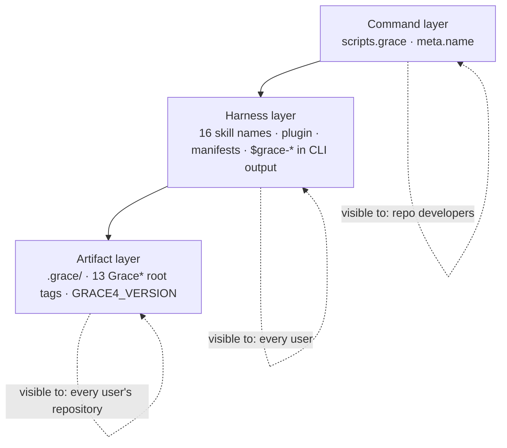

# Namespace Separation Implementation Plan

**Target repository:** `neo-grace` (`@neograce/cli`, 5.0.1)
**Audience:** an executor coding agent
**Authority:** derived from `review.md` in this directory. Where this plan and the review
disagree, **this plan wins**.
**Plan version:** 1.0 · 2026-07-29

> **Releases are not assigned.** `targets` is empty and every Release cell reads `TBD`. Renaming
> published skill identifiers is breaking, so this almost certainly ships as a major (review N4) —
> but the number is a separate decision from the work.

---

## 0. Operating contract for the executor

### 0.1 Four working principles

**1 — Think before renaming.** A rename looks mechanical and is not. Before each phase, open every
file in *Files touched*, and state in your report which occurrences are **identifiers** (must
change), which are **history** (must not), and which are **prose about the methodology** (usually
must not). Getting that classification wrong is how this plan fails.

**2 — Centralize, then change the value.** Phase 1 exists because a scattered literal cannot be
renamed verifiably. Never sweep a literal you could have first turned into a constant.

**3 — Surgical changes.** Touch only what a phase names. No "while I'm here" reformatting. Every
hunk traceable to a numbered step.

**4 — Goal-driven execution.** Every step is `step → verify: check`. A step whose verify check you
did not run is incomplete.

### 0.2 Three categories of occurrence — classify before you edit

| Category | Examples | Action |
|---|---|---|
| **Identifier** | `scripts.grace`, skill `name:` fields, `GraceChangeSpec`, `.grace/` paths | Rename |
| **History** | `CHANGELOG.md` entries describing shipped releases; anything under `docs/plans/archive/**` | **Never touch.** These record what past releases actually shipped, under the names they shipped with |
| **Methodology prose** | "GRACE means Graph-RAG Anchored Code Engineering"; "contract-first AI engineering" | **Usually keep.** GRACE is the method; `ngrace` is this implementation's executable |

A `grep` result set that includes `CHANGELOG.md` or `docs/plans/archive/` has over-matched. Narrow
it rather than filtering by hand each time.

### 0.3 Repository invariants you must not break

1. `skills/<dir>/*` is the source of truth; `plugins/<plugin>/skills/<dir>/*` is a byte-identical
   mirror. Any skill edit lands in both in the same commit.
2. Versions stay synchronized across `README.md`, `openpackage.yml`,
   `.claude-plugin/marketplace.json`, `plugins/*/.claude-plugin/plugin.json`, `package.json`.
3. `docs/plans/archive/**` is never edited (`docs/plans/README.md` rule 1).
4. `CHANGELOG.md` is append-only history. New entries yes; rewriting old ones never.
5. The published file list (`package.json#files`) and `scripts/release-check.ts` must stay in
   agreement. Four sites in that script reference `src/grace.ts` by path.

### 0.4 Commands you will use constantly

```bash
bun run typecheck
bun test
bun run validate:cli
bun run validate:marketplace
bun run validate:examples      # end-to-end against a real project tree — see §0.6
bun run validate:packed        # the published surface
bun run validate:ci
bun run validate:release       # includes release-check.ts; required by Phases 0 and 5
```

**`validate:ci` is not sufficient for this plan.** Renames break packaging and release tooling
before they break tests. Phases that touch `package.json`, manifests, or published paths run
`validate:release`.

### 0.5 Per-phase reporting format

```
PHASE <n> — <name>
Status: COMPLETE | BLOCKED
Steps completed: <n>/<n>
Files changed: <count, and the list>

Occurrence classification (§0.2):
  Identifiers renamed:   <count>
  History left untouched: <files — confirm CHANGELOG.md and docs/plans/archive/ are absent from the diff>
  Prose deliberately kept: <examples, with reasoning>

Verify output:
  bun run typecheck            → <pass/fail>
  bun test                     → <n pass, n fail>
  bun run validate:cli         → <pass/fail>
  bun run validate:marketplace → <pass/fail>
  bun run validate:examples    → <pass/fail>
  bun run validate:release     → <pass/fail, or "not required this phase">

Residual scan: <the phase's grep command, and its output — empty or explained>

Self-review (§0.6):
  Scope audit:        <files outside the declared list, or "clean">
  Self-reference check: <how you proved the tests are not merely renamed alongside the code>
  Compat sweep:       <fixtures and examples still lint clean>

Deviations from plan: <none, or explain>
```

Then **stop and wait for review.**

### 0.6 Phase self-review — adapted, not copied

The sibling track's five-audit protocol was written for logic changes. Three of its audits apply
here; two do not, and pretending otherwise would be ceremony.

**Applies — scope audit.** `git diff --name-only HEAD` against the phase's declared list. A rename
is exactly the kind of change that quietly spreads.

**Applies — compatibility sweep.** `examples/polyglot` and every fixture must still lint clean.

**Applies, and is the critical one here — the self-reference check.**

> A rename that updates the code *and* its tests in the same pass produces a green suite that
> proves nothing. Both sides moved together; the comparison has no independent side.

This is pattern 2 from the sibling track's defect log — *a comparison where one side derives from
the thing under test* — and a rename is the purest possible instance of it.

The independent side is **`bun run validate:examples`**, which lints `examples/polyglot`: a real
project tree, not a builder-constructed fixture. If a phase renames something and `validate:examples`
was not run, the phase has no evidence. State in every report how the independent check was
satisfied.

**Does not apply — mutation check.** There is little conditional logic to revert.

**Does not apply — adversarial probe.** There is no input space to explore. Its place is taken by
the **residual scan**: the phase's own `grep`, run after the edit, with its output in the report.

---

## 1. Orientation

### 1.1 The three layers (review F1)



### 1.2 What makes this tractable

| Fact | Consequence | Source |
|---|---|---|
| No `neo-grace` projects exist yet | Every migration cost is zero | maintainer, 2026-07-29 |
| `.grace` has no path constant | Centralize first, or the rename is unverifiable | review F3 |
| The binary prints `$grace-*` skill names in 11 sites | Renaming skills without these makes `status` recommend nonexistent skills | review F2 |
| `GRACE4_VERSION` is the *grammar* version, not the product version | Cannot be swept; needs its own decision | review F4 |

---

## 2. Phase status board

| # | Phase | Layer | Release | Status |
|---|---|---|---|---|
| 0 | Command name: `grace` → `ngrace` | Command | TBD | `COMPLETE` |
| 1 | Centralize the scattered literals | — (enabling) | TBD | `NOT STARTED` |
| 2 | Harness surface: skills, plugin, manifests, CLI guidance | Harness | TBD | `NOT STARTED` |
| 3 | Artifact surface: `.ngrace/` and root tags | Artifact | TBD | `NOT STARTED` |
| 4 | Grammar identity: retire `GRACE4_VERSION` | Artifact | TBD | `NOT STARTED` |
| 5 | Prose sweep and documentation | — | TBD | `NOT STARTED` |
| 6 | Reconcile RM-AGENT-RELIABILITY; release | — | TBD | `NOT STARTED` |

**Hard sequencing rules**, each with what breaks if violated:

1. **1 → 2, 3, 4.** Without centralization these phases are unverifiable find-and-replace sweeps.
   This is the plan's central method, not a preference.
2. **2 is atomic.** Skill names and the `$grace-*` guidance strings move in the *same* phase.
   Splitting them ships a state where `ngrace status` recommends skills that do not exist.
3. **4 → after 3.** The grammar version travels with the artifact layer or it re-splits the
   identity it was meant to unify.
4. **6 last.** It reconciles a sibling document and cuts the release.

Review N1 and N2 were ratified on 2026-07-29, so **no phase in this plan is gated on an open
question.** The board can be worked straight through.

---

# PHASE 0 — Command name: `grace` → `ngrace`

**Status:** `COMPLETE` · **Layer:** Command · **Release:** TBD

## 0.1 Objective

One command name in this project instead of two. `package.json#bin` publishes `ngrace`;
`package.json#scripts` defines `grace`; `bun run ngrace --help` fails with *"Script not found"* —
and `CLAUDE.md:48` documents exactly that failing form.

## 0.2 Preconditions

→ verify: `bun run validate:ci` passes on a clean checkout.
→ verify: `bun run ngrace --help` fails. If it succeeds, this phase is already done — report and skip.

## 0.3 Files touched

| File | Action |
|---|---|
| `package.json` | EDIT — `scripts.grace` → `scripts.ngrace`; `scripts.grace:lint` → `scripts.ngrace:lint` |
| `src/grace.ts` | EDIT — **one line**, `meta.name` at ≈`:15` |
| `CLAUDE.md` | READ ONLY — verify it becomes correct; do not edit |
| `CHANGELOG.md` | **DO NOT TOUCH** |

## 0.4 Design

Four constraints, each a way this goes wrong:

1. **`CHANGELOG.md` is history** (§0.2). It has ~15 `grace status` / `grace lint` references
   describing shipped releases under their shipped names.
2. **`src/grace.ts` is not renamed as a file.** Referenced by `package.json#files`, `#bin`, three
   scripts, and four sites in `scripts/release-check.ts` including a published-paths list. The gain
   is cosmetic; the blast radius is the release validator. Explicit non-goal (review §4.2).
3. **No compatibility alias.** Keeping `scripts.grace` preserves the ambiguity being removed. The
   generic `scripts.lint` alias is unrelated and stays.
4. **`scripts.validate:examples` invokes `./src/grace.ts` by path**, not by script name. Unaffected.
   Leave it.

## 0.5 Steps

**Step 0.5.1 — Rename the two scripts.**
→ verify: `bun run ngrace --help` prints the seven subcommands; `bun run grace --help` now fails.
Show both.

**Step 0.5.2 — Update `meta.name` in `src/grace.ts`.**
→ verify: help output reads `USAGE ngrace doctor|file|…` and the footer reads
`Use ngrace <command> --help`. The help text is the user's model of what to type; leaving it as
`grace` reintroduces the confusion in the one place people look to resolve it.

**Step 0.5.3 — Confirm `CLAUDE.md` became correct without being edited.**
→ verify: run the command `CLAUDE.md:48` documents — `bun run ngrace lint --path .` — and confirm
it reports `project.missing-grace` as that line predicts. Show the output.

**Step 0.5.4 — Residual scan.**
```bash
grep -rn 'bun run grace' . --include='*.ts' --include='*.json' --include='*.yml' --include='*.md' \
  | grep -v node_modules | grep -v CHANGELOG | grep -v 'docs/plans/archive'
```
→ verify: empty. Report the command and its output.

## 0.6 Definition of done

- `bun run ngrace <cmd>` works; `bun run grace` does not
- Help output names `ngrace` in usage line **and** footer
- The command documented in `CLAUDE.md:48` runs and behaves as documented
- `CHANGELOG.md` and `docs/plans/archive/**` absent from `git diff --name-only`
- `bun run validate:release` green — this phase touches `package.json`

## 0.7 Review gate

1. Was `CHANGELOG.md` touched?
2. Was `src/grace.ts` renamed as a file?
3. Does a compatibility alias survive?
4. Does the help footer still say `grace`? That is the half-done version.

## 0.8 Rollback

Revert `package.json` and one line in `src/grace.ts`.

---

# PHASE 1 — Centralize the scattered literals

**Status:** `NOT STARTED` · **Layer:** enabling · **Release:** TBD

## 1.1 Objective

Turn every namespace literal into a named constant **without changing any value.** Zero behaviour
change.

This is the phase that makes the rest of the plan verifiable. A scattered literal can only be
renamed by sweep, and a sweep cannot be proven complete. A constant can be renamed by changing one
line, and completeness is then a type error rather than a hope.

## 1.2 Preconditions

→ verify: Phase 0 `COMPLETE`.

## 1.3 Files touched

| File | Action |
|---|---|
| `src/grace4/paths.ts` | EDIT — export the artifact-directory constant |
| `src/grace4/types.ts` | EDIT — derive root tags from a prefix constant |
| `src/grace-status.ts` | EDIT — three `.grace/` literals; 11 `$grace-*` guidance strings |
| `src/lint/core.ts` | EDIT — one `.grace` literal |
| `src/lint/catalog.ts` | EDIT — `.grace/` and `$grace-*` in remediation prose |
| `src/test-support/fixtures.ts` | EDIT — one `.grace/` literal |

## 1.4 Design

```
PSEUDOCODE — values unchanged in this phase

// src/grace4/paths.ts
export const ARTIFACT_DIR = ".grace";                  // Phase 3 changes this value

// src/grace4/types.ts
export const ARTIFACT_TAG_PREFIX = "Grace";            // Phase 3 changes this value
export const GRACE4_ROOT_TAGS = [
  `${ARTIFACT_TAG_PREFIX}Requirements`,
  `${ARTIFACT_TAG_PREFIX}Technology`,
  // …13 total, plus the companion tag
] as const;

// skill names printed as next-action guidance (review F2)
export const SKILL_PREFIX = "grace";                   // Phase 2 changes this value
export const skillRef = (s: string) => `$${SKILL_PREFIX}-${s}`;
```

**The literal values do not change in this phase.** If any test output differs, the
centralization was not faithful — that is the signal to look for, and it is why this phase is
worth its own review gate.

**Type-level note:** `GRACE4_ROOT_TAGS` currently gives `Grace4RootTag` a useful literal union.
Template-literal types preserve that; a plain `string[]` does not. If the union degrades, downstream
exhaustiveness checks silently stop working — check it explicitly rather than assuming.

## 1.5 Steps

**Step 1.5.1 — `ARTIFACT_DIR`, threaded through every `.grace` literal.**
→ verify: `grep -rn '"\.grace"' src --include='*.ts' | grep -v paths.ts` is empty.

**Step 1.5.2 — `ARTIFACT_TAG_PREFIX`, with root tags derived.**
→ verify: `Grace4RootTag` is still a literal union, not `string`. Prove it — assign an invalid tag
in a scratch file and confirm `typecheck` rejects it. Show the error.

**Step 1.5.3 — `SKILL_PREFIX` and `skillRef`, threaded through all 11 guidance sites.**
→ verify: `grep -rn '\$grace-' src --include='*.ts' | grep -v test` is empty.

**Step 1.5.4 — Remediation prose in `src/lint/catalog.ts`.**
These are user-facing strings containing both `.grace/` paths and `$grace-*` skill names.
→ verify: catalog remediation text is built from the constants; the rendered output is byte-identical
to before. Diff it.

**Step 1.5.5 — Prove behaviour did not change.**
→ verify: `bun test` pass count identical to the Phase 0 baseline, and `bun run validate:examples`
green. **Any** changed output means the centralization was not faithful.

## 1.6 Definition of done

- Three constants exist; no residual literals outside their defining modules
- `Grace4RootTag` remains a literal union, proven by a rejected assignment
- Test pass count unchanged from baseline
- Rendered remediation text byte-identical
- `bun run validate:ci` green

## 1.7 Review gate

1. Did **any** value change? None should have.
2. Did the root-tag type degrade to `string`?
3. Are there literals left outside the defining modules? Show the greps.

## 1.8 Rollback

Inline the constants. Behaviour-neutral in both directions.

---

# PHASE 2 — Harness surface

**Status:** `NOT STARTED` · **Layer:** Harness · **Release:** TBD

## 2.1 Objective

Remove the collision. Sixteen skill identifiers, the plugin name, both directory trees, both
manifests, and the CLI's guidance strings move from `grace` to `ngrace` **together**.

## 2.2 Preconditions

→ verify: Phase 1 `COMPLETE` — the guidance strings must already be behind `SKILL_PREFIX`.
→ verify: `bun run validate:release` green at HEAD.

## 2.3 Files touched

| File | Action |
|---|---|
| `skills/grace/` → `skills/ngrace/` | `git mv` |
| `skills/ngrace/grace-*/` → `skills/ngrace/ngrace-*/` | `git mv` × 16 |
| `skills/ngrace/*/SKILL.md` | EDIT — `name:` frontmatter × 16 |
| `plugins/grace/` → `plugins/ngrace/` | `git mv` |
| (packaged mirror, same two renames) | `git mv` |
| `.claude-plugin/marketplace.json` | EDIT — plugin name, 16 skill paths |
| `plugins/ngrace/.claude-plugin/plugin.json` | EDIT — plugin name |
| `openpackage.yml` | EDIT — if it names the plugin |
| `src/grace4/types.ts` | EDIT — **one line**, `SKILL_PREFIX` value |
| `scripts/validate-marketplace.ts` | EDIT — `REQUIRED_GRACE4_SKILLS`, `FORBIDDEN_GRACE4_SKILLS` |
| `README.md` | EDIT — skill names in the workflow section |

## 2.4 Design

**Atomic.** Skill directories, `name:` fields, manifests and `SKILL_PREFIX` land in one phase. Any
split ships a state where `ngrace status` recommends skills that do not exist (review F2) — a
confidently wrong instruction, which is the failure this project exists to remove.

**Use `git mv`,** not delete-and-create, so history survives on 32 directories.

**Cross-references inside skill text.** Skills mention sibling skills (`$grace-refresh`,
`$grace-init`). Those are prose in Markdown, not behind `SKILL_PREFIX`, and must be swept
explicitly.

**`validate-marketplace.ts` is both subject and instrument.** It hardcodes the required and
forbidden skill name sets, and it validates the mirror. Update it and then trust it — but confirm
it fails on a *deliberately* wrong name before relying on it (step 2.5.6).

## 2.5 Steps

**Step 2.5.1 — `git mv` both trees and all 32 skill directories.**
→ verify: `git status` shows renames, not adds and deletes.

**Step 2.5.2 — Update 16 `name:` frontmatter fields, mirrored.**
→ verify: `grep -h '^name:' skills/ngrace/*/SKILL.md` lists 16 `ngrace-*` names and no `grace-*`.

**Step 2.5.3 — Update both manifests.**
→ verify: `bun run validate:marketplace` passes.

**Step 2.5.4 — Change the `SKILL_PREFIX` value — one line.**
→ verify: `bun run ngrace status --path .` recommends an `$ngrace-*` skill. Show it.

**Step 2.5.5 — Sweep skill-to-skill references in Markdown.**
→ verify: `grep -rn '\$grace-' skills/ plugins/ README.md` is empty.

**Step 2.5.6 — Prove the validator actually guards this.**
Temporarily set one skill's `name:` back to `grace-init`.
→ verify: `validate:marketplace` **fails**. Show the failure, then revert. A validator never seen
red is a validator never tested.

**Step 2.5.7 — Independent check (§0.6).**
→ verify: `bun run validate:examples` and `bun run validate:packed` both green. These exercise a
real project tree and the published surface — the two things a self-consistent rename cannot fake.

## 2.6 Definition of done

- 16 skills named `ngrace-*`, mirrored byte-identically
- Plugin named `ngrace` in both manifests
- History preserved (`git status` shows renames)
- `SKILL_PREFIX` changed in one line; `status` recommends `$ngrace-*`
- Validator demonstrated red, then green
- `validate:examples`, `validate:packed`, `validate:release` all green

## 2.7 Review gate

1. Does any surface still say `grace-*` for a skill?
2. Was `git mv` used, or was history lost?
3. Was the validator observed failing?
4. Could `status` recommend a nonexistent skill at any commit in this phase?

## 2.8 Rollback

Reverse the `git mv`s and revert the manifests and `SKILL_PREFIX`. Large but mechanical.

---

# PHASE 3 — Artifact surface: `.ngrace/` and root tags

**Status:** `NOT STARTED` · **Layer:** Artifact · **Release:** TBD

## 3.1 Objective

Move the artifact namespace: `.grace/` → `.ngrace/`, and `Grace*` root tags → `Ngrace*`.

## 3.2 Preconditions

→ verify: Phase 1 `COMPLETE` — this phase is two value changes, or it is a sweep and must not proceed.

**Review N1 was ratified on 2026-07-29:** `.grace/` → `.ngrace/`, `Grace*` → `Ngrace*`. This phase
is no longer gated.

Verified at ratification: there is **no home-directory or global config surface** — no `homedir`,
`$HOME`, or `XDG_*` reference anywhere in `src/` or `scripts/`. Every path is project-local, so
this phase changes the project-root directory only and no user-level state exists to migrate.

## 3.3 Files touched

| File | Action |
|---|---|
| `src/grace4/paths.ts` | EDIT — `ARTIFACT_DIR` value |
| `src/grace4/types.ts` | EDIT — `ARTIFACT_TAG_PREFIX` value |
| `skills/ngrace/*/references/*.xml` | EDIT — template root tags |
| `skills/ngrace/ngrace-init/assets/**` | EDIT — scaffolded skeleton |
| `examples/polyglot/.grace/` → `.ngrace/` | `git mv` + tag edits |
| `src/test-support/fixtures.ts` | EDIT — if any tag literal survived Phase 1 |
| `README.md`, `CLAUDE.md` | EDIT — `.grace` references |

## 3.4 Design

**Two value changes plus their data.** The code side is `ARTIFACT_DIR` and `ARTIFACT_TAG_PREFIX`.
The data side — XML templates, the init skeleton, `examples/polyglot` — is not behind a constant and
must be edited.

**`examples/polyglot` is the independent check and therefore must be edited by hand, not by the
same sweep that edits the source.** If one script rewrites both the code and the example, the
example stops being independent evidence and this phase has no verification (§0.6, pattern 2).

**Do not add a compatibility reader for `.grace/`.** There are no projects to be compatible with,
and a fallback path would silently accept upstream GRACE artifacts into a diverged grammar —
producing exactly the confident false errors review §4.1 gives as a reason to separate.

**`grace-migrate` gains a second source.** It converts GRACE 3 → 4 today; upstream GRACE 4 in
`.grace/` is now also a legacy input, read from `.grace/` and written to `.ngrace/`, original
untouched. Note it for that skill's owner; do not build it here.

## 3.5 Steps

**Step 3.5.1 — Change `ARTIFACT_DIR` to `.ngrace`.**
→ verify: `bun test` fails loudly, in fixtures rather than in logic. A silent pass here means
Phase 1 missed a literal — stop and report.

**Step 3.5.2 — Change `ARTIFACT_TAG_PREFIX` to `Ngrace`.**
→ verify: `typecheck` clean and the root-tag union now reads `Ngrace*`.

**Step 3.5.3 — Update XML templates and the init skeleton, mirrored.**
→ verify: `bun run ngrace lint` on a freshly scaffolded project is clean.

**Step 3.5.4 — Migrate `examples/polyglot` by hand.**
→ verify: `bun run validate:examples` green. State explicitly that this was edited by hand and not
by the same mechanism that edited `src/`.

**Step 3.5.5 — Residual scan.**
```bash
grep -rn '"\.grace"\|\.grace/\|"Grace[A-Z]' src skills plugins examples README.md CLAUDE.md \
  | grep -v node_modules
```
→ verify: empty, or every remaining hit explained as methodology prose (§0.2).

## 3.6 Definition of done

- `ARTIFACT_DIR` and `ARTIFACT_TAG_PREFIX` changed; no residual literals
- Scaffolded project lints clean
- `examples/polyglot` migrated by hand and green
- No compatibility fallback for `.grace/` anywhere in the diff
- `bun run validate:ci` green

## 3.7 Review gate

1. Was `examples/polyglot` edited by the same mechanism as `src/`? If so, the independent check
   was destroyed.
2. Is there a fallback path that still reads `.grace/`?
3. Did step 3.5.1 fail loudly? A silent pass means Phase 1 was incomplete.

## 3.8 Rollback

Revert both constant values and the data edits; `git mv` the example back.

---

# PHASE 4 — Grammar identity: retire the `Grace4` name in code

**Status:** `NOT STARTED` · **Layer:** Artifact · **Release:** TBD
**Amended 2026-07-29 (A1)** — see §9.

## 4.1 Objective

Stop claiming kinship with upstream GRACE 4 anywhere in the source. `GRACE4_VERSION = "4.0"` is
validated on every artifact root and asserts compatibility with a grammar this codebase has
diverged from — but it is one of **17** identifiers carrying that claim, and the original phase
covered only it.

The full set **(E2, enumerated 2026-07-29)**:

```
GRACE4_VERSION                     Grace4RootTag
GRACE4_ROOT_TAGS                   Grace4ChangeCompanionTag
GRACE4_CHANGE_COMPANION_TAGS       Grace4ContextArtifact
GRACE4_CONTEXT_ARTIFACTS           Grace4OptionalContextArtifact
GRACE4_OPTIONAL_CONTEXT_ARTIFACTS  Grace4Issue
REQUIRED_GRACE4_SKILLS             Grace4ModuleRecord
FORBIDDEN_GRACE4_SKILLS            Grace4ProjectPaths
validateGrace4Project              Grace4ValidationResult
validateGrace4ProjectLayout
validateGrace4SkillSurface
validateGrace4Dependencies
```

Phase 2 edits the **values** of the two `*_SKILLS` constants; it does not rename them. Nothing
else in the plan touched the remaining 16, so a plan-following executor would leave every one in
place and correctly report each phase complete.

## 4.2 Preconditions

→ verify: Phase 3 `COMPLETE`.

**Review N2 was decided on 2026-07-29:** `GRACE4_VERSION = "4.0"` becomes
`NGRACE_ARTIFACT_VERSION = "1.0"` — a fresh line, not a bump. The grammar is ours; inheriting a
version number asserts a lineage that no longer holds.

## 4.3 Files touched

| File | Action |
|---|---|
| `src/grace4/types.ts` | EDIT — constant and type names, and the version value |
| `src/grace4/grammar.ts` | EDIT — `validateGrace4Project`, `validateGrace4ProjectLayout`, re-exports |
| `scripts/validate-marketplace.ts` | EDIT — `REQUIRED_/FORBIDDEN_GRACE4_SKILLS`, `validateGrace4SkillSurface`, `validateGrace4Dependencies` |
| (all remaining reference sites across `src/`) | EDIT — follow the compiler |
| `src/grace4/` → `src/artifact/` | `git mv` — **optional, see 4.4** |
| `skills/ngrace/*/references/*.xml` | EDIT — VERSION attributes |
| `README.md` | EDIT — grammar version documentation |

## 4.4 Design

**The constant is renamed and re-based, not bumped.** Bumping `"4.0"` → `"5.0"` would keep the
claim and change the number. The claim is the problem.

**New names carry no version number.** `Grace4RootTag` became stale precisely because it embedded
a version in an identifier, so the replacement must not repeat the mistake:

| Old | New |
|---|---|
| `GRACE4_ROOT_TAGS` | `NGRACE_ROOT_TAGS` |
| `Grace4RootTag` | `NgraceRootTag` |
| `validateGrace4Project` | `validateNgraceProject` |
| `Grace4Issue`, `Grace4ProjectPaths`, … | `NgraceIssue`, `NgraceProjectPaths`, … |

> **An identifier names the system, not its version.** `NGRACE_ARTIFACT_VERSION` is the sole
> exception, because the version *is* what it names.

Renaming these is a compiler-guided refactor, not a text sweep: change the declaration, then
follow `typecheck` to every use. That is the Phase 1 principle applied to symbols instead of
literals — and it is why this can be done safely in one pass.

**Two of these are exported and re-exported** (`GRACE4_CONTEXT_ARTIFACTS`,
`GRACE4_OPTIONAL_CONTEXT_ARTIFACTS`, at `src/grace4/grammar.ts:1665`). `package.json#files`
publishes `src/`, so a determined consumer could import them — but the package's supported surface
is the `ngrace` binary, not its TypeScript internals. Rename them; do not add compatibility
aliases.

**Directory rename is optional and should be decided, not defaulted.** `src/grace4/` encodes the
old grammar version in a path. Renaming to `src/artifact/` removes a stale claim; leaving it costs
one confusing directory name. Either is defensible — but say which you chose and why, because a
silent default here is how a stale name survives a rename plan.

**Document two numbers, not one.** After this phase the product is `6.x` and the grammar is `1.0`,
and they move independently. That is not a new scheme — `RM-POLYGLOT-ENFORCEMENT` invariant 6
already treats the grammar version as deliberately separate, bumped only when something becomes
*required* and shipped with a migration path. This phase corrects the number in the one that was
making a false claim.

Two things need stating in `README.md`, or the fresh number invites the same confusion in the
other direction:

1. The grammar version is **not comparable** to upstream GRACE's numbering.
2. The grammar version is **not** the product version, and a grammar bump means something became
   required — not that the release is bigger.

## 4.5 Steps

**Step 4.5.1 — Rename and re-base the version constant.**
→ verify: no `GRACE4_VERSION` reference remains; `typecheck` clean.

**Step 4.5.1a — Rename the remaining 16 identifiers, compiler-guided.**
Change each declaration and let `typecheck` find every use. Do not text-sweep.
→ verify: `grep -rnE '\b(GRACE4_[A-Z_]+|Grace4[A-Za-z]+|validateGrace4[A-Za-z]*)\b' src scripts --include='*.ts'`
returns **nothing**, including test files. Report the command and its empty output.

→ verify: `bun test` pass count matches the pre-phase baseline exactly. A rename that changes a
test count changed behaviour, which this step must not.

**Step 4.5.2 — Update template VERSION attributes, mirrored.**
→ verify: a scaffolded project lints clean and carries the new version.

**Step 4.5.3 — Decide the directory question and record the decision.**
→ verify: state the choice and its reasoning in the report, whichever way it goes.

**Step 4.5.4 — Document both version numbers in `README.md`.**
→ verify: the README states (a) the grammar version is independent of upstream numbering, and
(b) the grammar version is not the product version. Quote both lines in the report.

## 4.6 Definition of done

- No `GRACE4_VERSION` anywhere
- **No `Grace4`/`GRACE4` identifier anywhere in `src/` or `scripts/`, tests included** — grep
  output reported and empty
- **No new identifier embeds a version number**, `NGRACE_ARTIFACT_VERSION` excepted
- Test pass count unchanged from the pre-phase baseline
- Templates carry the new version; scaffolded project clean
- Directory decision made and recorded
- Discontinuity documented
- `bun run validate:release` green

## 4.7 Review gate

1. Was the version bumped rather than re-based? That keeps the claim.
2. Was the directory question answered, or silently defaulted?
3. Does `README.md` explain the numbering discontinuity?
4. Did any identifier acquire a version number in its new name? That reproduces the defect being
   removed.
5. Was the rename compiler-guided, or text-swept? A text sweep over symbols will silently miss a
   re-export and silently hit a string.

## 4.8 Rollback

Revert the constant and the template edits.

---

# PHASE 5 — Prose sweep and documentation

**Status:** `NOT STARTED` · **Release:** TBD
**Amended 2026-07-29 (A1)** — see §9.

## 5.1 Objective

Retire the "GRACE 4" notion from product-facing prose. The product is `neo-grace` 6.x; roughly 80
files still say otherwise.

**Prose is prose wherever it lives.** The original phase listed documentation files only, which
would have left **46 "GRACE 4" strings inside `src/` and `scripts/`** **(E2, counted 2026-07-29)** —
CLI command descriptions, error messages, lint-catalog titles, explanations and remediations, and
JSDoc. `ngrace --help` would still have announced itself as *"GRACE 4 CLI for .grace linting…"*
after the entire plan completed.

§0.2's three categories apply to strings in code exactly as they apply to Markdown. Where a string
is *displayed to a user*, its file extension is irrelevant.

**This phase absorbs the standing backlog item** for that cleanup.

## 5.2 Preconditions

→ verify: Phases 0–4 `COMPLETE`. Prose describing the artifact layer must match what actually
shipped, and with N1 and N2 ratified there is no partial-state branch to handle.

## 5.3 Files touched

**Documentation:** `README.md`, `CLAUDE.md`, `examples/polyglot/README.md`, all 16 `SKILL.md` files
and their mirrors, `skills/ngrace/*/references/**`, `docs/ngrace-explainer.html`.

**Prose inside code** — 46 sites, concentrated in:

| File | Character |
|---|---|
| `src/lint/catalog.ts` | issue titles, explanations, remediations — the highest-visibility prose in the product |
| `src/grace-status.ts` | next-action guidance, JSDoc, command description |
| `src/grace.ts` | the root command `description` — what `ngrace --help` announces |
| `src/grace-doctor.ts`, `src/grace-graph.ts`, `src/lint/core.ts` | error messages and JSDoc |

**Not touched:** `CHANGELOG.md`, `docs/plans/archive/**`.

## 5.4 Design

Apply §0.2's classification. Most remaining hits are **methodology prose** and stay: "GRACE means
Graph-RAG Anchored Code Engineering" is correct and should not become "NGRACE means…". What changes
is text implying the *product* is "GRACE 4" — a version of someone else's tool.

**The `grace3` identifiers stay.** `project.grace3-detected`, `projectKind === "grace3"` and the
migration text refer to genuine legacy artifacts.

## 5.5 Steps

**Step 5.5.1 — Classify every remaining hit before editing.**
→ verify: report counts per §0.2 category. A phase that edits before classifying will convert
methodology prose into nonsense.

**Step 5.5.2 — Edit product-facing prose in documentation; mirror all skill edits.**
→ verify: `bun run validate:marketplace` green.

**Step 5.5.2a — Edit product-facing prose inside code.**
Start with `src/grace.ts`'s root `description` and `src/lint/catalog.ts`, which together account
for most of what a user actually reads.

→ verify: `bun run ngrace --help` no longer announces "GRACE 4"; quote the new description line.
→ verify: `bun run ngrace lint --explain <a project.* code>` shows a title and explanation free of
the stale product name; quote one before and after.
→ verify: `grep -rn 'GRACE 4' src scripts --include='*.ts'` returns only deliberate keeps, each
explained per §0.2. Legitimate keeps exist — text about *migrating from* GRACE 4, and the
`grace3`/legacy detection messages, are describing real other things.
→ verify: `bun test` pass count unchanged. Several catalog strings are asserted in tests; if a
count moves, a test was asserting on prose and needs looking at rather than silently updating.

**Step 5.5.3 — Confirm `grace3` identifiers survived.**
→ verify: `grep -rn 'grace3' src --include='*.ts' | grep -v test` unchanged from HEAD.

**Step 5.5.4 — Confirm history untouched.**
→ verify: `git diff --name-only` contains neither `CHANGELOG.md` nor `docs/plans/archive/`.

## 5.6 Definition of done

- Product-facing prose says `neo-grace` 6.x, **in documentation and in code**
- `ngrace --help` and `ngrace lint --explain` free of the stale product name
- Methodology prose intact, with the classification reported
- `grace3` identifiers unchanged
- Test pass count unchanged
- History untouched
- `bun run validate:ci` green

## 5.7 Review gate

1. Did any "GRACE means Graph-RAG Anchored Code Engineering" text get mangled?
2. Were `grace3` identifiers swept by accident?
3. Was the classification done before editing, or reconstructed afterwards?

## 5.8 Rollback

Revert the prose edits.

---

# PHASE 6 — Reconcile RM-AGENT-RELIABILITY; release

**Status:** `NOT STARTED` · **Release:** TBD

## 6.1 Objective

Leave the sibling plan correct rather than leaving its executor to discover the drift, and cut the
release.

## 6.2 Preconditions

→ verify: Phases 0–5 `COMPLETE` or explicitly `BLOCKED` with reasons.

## 6.3 Files touched

| File | Action |
|---|---|
| `docs/plans/active/RM-AGENT-RELIABILITY/plan.md` | EDIT — reconcile |
| `docs/plans/active/RM-AGENT-RELIABILITY/decisions.md` | EDIT — one paragraph, not a rewrite |
| `docs/plans/README.md` | EDIT — index both tracks |
| `CHANGELOG.md` | EDIT — **append** a new entry |

## 6.4 Design

Four known drift points (review §6):

1. **Phase −1 is absorbed.** Remove it and its board row from the sibling plan; this plan's Phase 0
   did that work.
2. **The run-ledger root tag.** D1–D3 specify `<GraceRunLedger>`; it becomes `<NgraceRunLedger>` if
   Phase 3 shipped. Update `decisions.md` **by appending a dated note**, not by rewriting the
   decision — the reasoning stands, only the spelling moved.
3. **Phase 1's self-migration target** is `.ngrace/` if Phase 3 shipped.
4. **`skills/grace/grace-cli/references/verdicts.md`** (D13) becomes
   `skills/ngrace/ngrace-cli/references/verdicts.md`.

Also re-check every command in the sibling plan's §0.4 and its verify steps: they were written as
`bun run ngrace` in anticipation of this work and should now all resolve.

## 6.5 Steps

**Step 6.5.1 — Remove Phase −1 from the sibling plan; renumber nothing else.**
→ verify: its board has no `−1` row and its sequencing rule 0 is gone.

**Step 6.5.2 — Update tag, path and directory references in the sibling plan.**
→ verify: `grep -n '\.grace/\|GraceRunLedger\|skills/grace' ../RM-AGENT-RELIABILITY/plan.md`
returns only intentional historical references.

**Step 6.5.3 — Append a dated reconciliation note to `decisions.md`.**
→ verify: no existing decision text was rewritten — `git diff` shows additions only.

**Step 6.5.4 — Verify the sibling plan's commands resolve.**
→ verify: run three verify steps from three different phases of that plan and confirm the commands
execute. Report which three.

**Step 6.5.5 — Update `docs/plans/README.md`.**
Both tracks, with their companion documents, per rule 4.
→ verify: every row's `status` matches its directory (rule 2).

**Step 6.5.6 — Append the CHANGELOG entry and cut the release as `6.0.0`.**

Package identity is unchanged: **`@neograce/cli`, continuing at `6.0.0`** (review N4). No new
package, no version restart, no tag-format change — tags continue `v3.11.0 … v5.0.1 → v6.0.0`, and
no `npm deprecate` step is required because nothing is being replaced.

→ verify: versions synchronized across `package.json`, `README.md`, `openpackage.yml`,
`.claude-plugin/marketplace.json`, `plugins/ngrace/.claude-plugin/plugin.json` (§0.3 invariant 2);
`bun run validate:release` green; the entry names the breaking skill rename, lists the 16 new
identifiers, and states the `.grace/` → `.ngrace/` move.

The entry must be plain about the break. A user upgrading from 5.0.1 loses every `grace-*` skill
name and every `.grace/` path; a changelog that softens that is the same failure this project is
built to prevent.

## 6.6 Definition of done

- Sibling plan reconciled; its commands resolve
- `decisions.md` appended to, never rewritten
- Index updated; statuses agree with directories
- CHANGELOG appended; release validated

## 6.7 Review gate

1. Was any existing decision **rewritten** rather than appended to? The immutability rule applies
   to this repo's own planning artifacts.
2. Do the sibling plan's commands actually run, or was that only asserted?
3. Does the CHANGELOG entry state the break plainly?

## 6.8 Rollback

Documentation only; revert the edits. A cut release cannot be rolled back — verify before tagging.

---

## 7. Cross-cutting conventions

### 7.1 Renames use `git mv`

Thirty-two skill directories plus two trees. `git mv` preserves history; delete-and-create loses
blame on every skill.

### 7.2 Mirroring

Every `skills/` edit lands in `plugins/*/skills/` in the same commit.
`scripts/validate-marketplace.ts` compares each listed skill directory recursively.

### 7.3 Anti-patterns — do not do these

1. **Sweeping a literal you could have centralized.** Phase 1 exists for this.
2. **Renaming code and its tests in one pass and calling the green suite evidence.** Pattern 2. The
   independent side is `validate:examples`.
3. **Editing `CHANGELOG.md` history.** It records what shipped, under the names it shipped with.
4. **Touching `docs/plans/archive/**`.**
5. **Renaming methodology prose.** GRACE is the method; `ngrace` is the executable.
6. **Adding a compatibility fallback for the old namespace.** There is nothing to be compatible
   with, and it would silently admit a diverged grammar.
7. **Leaving the CLI recommending skills that no longer exist.** Phase 2 is atomic for this reason.
8. **Rewriting a ratified decision instead of appending to it.**

### 7.4 When you get stuck

Report the contradiction and stop. Do not invent a naming decision — `review.md` §5 records five
open questions, and a sixth invented mid-phase will not be recorded anywhere.

---

## 8. Traceability

| Review item | Subject | Phase |
|---|---|---|
| F1 | Three layers | 0, 2, 3 |
| F2 | CLI emits skill names | 1 (centralize), 2 (change) |
| F3 | `.grace` not centralized | 1 |
| F4 | Grammar identity is a claim | 4 |
| N1 | Does the artifact layer move? | 3 (gate) |
| N2 | What replaces `GRACE4_VERSION`? | 4 (gate) |
| N3 | Skill names `ngrace-*` | 2 |
| N4 | Major version | 6 |
| N5 | Repo-level coexistence | **Partially answered by Phase 0's execution:** upstream `@osovv/grace-cli` v4.0.4 was found installed on PATH as `grace`, so `bun run grace` silently ran upstream's linter against this repository. The collision is live, not hypothetical |
| §6 | Sibling reconciliation | 6 |
| backlog | Retire "GRACE 4" prose | 5, **widened by A1** to include 46 sites inside `src/`+`scripts/` |
| A1 | `Grace4` code identifiers | 4 |

---

## 9. Amendments

This plan is `approved` and under execution, so changes are recorded here rather than made
silently. Append only; never renumber or rewrite an earlier entry.

### A1 — 2026-07-29 · Phases 4 and 5 widened

**Raised during a backlog reconciliation**, after Phase 0 completed and before Phase 1 began.

Two gaps, same family — the plan treated "GRACE 4" as a *documentation* problem when much of it
lives in *code*:

| Gap | Scale | Phase |
|---|---|---|
| `Grace4`/`GRACE4` code identifiers — types, validators, constant names | 16 of 17 uncovered; only `GRACE4_VERSION` was in scope | 4 |
| "GRACE 4" prose inside `src/`+`scripts/` — CLI descriptions, error messages, lint-catalog text | 46 sites, all outside the phase's file list | 5 |

Both were invisible to the original phase gates: an executor following the plan exactly would have
completed every phase correctly and left `ngrace --help` announcing *"GRACE 4 CLI"* over a codebase
still full of `Grace4RootTag`.

Phase 4 also gained the rule that **new identifiers carry no version number** — `Grace4RootTag`
went stale precisely because it embedded one, and repeating that would rebuild the defect being
removed.

**No phase already executed is affected.** Phase 0 is untouched by this amendment; Phases 1–3 are
unchanged.

---

## 10. Final instruction to the executor

Work one phase at a time. Report in the §0.5 format. Stop after each phase and wait for review.

A rename is the easiest kind of change to do 95% of, and the 5% is invisible: a literal in a
template, a skill name in a remediation string, a fixture that was renamed alongside the code so
the test still passes. **Phase 1 exists so that the invisible part becomes a compile error instead
of a discovery.** Do not skip it, and do not start Phase 3 without it.

When a `grep` comes back empty, put it in the report. An empty result you ran is evidence; an empty
result you assumed is not.
