# GRACE 4 → 5 Implementation Plan

**Target repository:** `grace-marketplace` (`@osovv/grace-cli`, GRACE 4.0.4)
**Audience:** an executor coding agent
**Authority:** derived from `review.md` in this directory. Where this plan and a source review disagree, **this plan wins** — the conflicts were already adjudicated in `review.md` §5.
**Plan version:** 1.0 · 2026-07-28

---

## 0. Operating contract for the executor

Read this section completely before touching any file. It is the contract you are held to for every phase.

### 0.1 Four working principles

These come from the Karpathy skills framing and are binding.

**1 — Think before coding.** Before writing a line in any phase, open every file listed under *Files touched*, read it end to end, and write a short note in your response stating: what the code does today, which of your assumptions the code contradicts, and which named function you will change. If reading contradicts this plan, **stop and report the contradiction** rather than improvising — this plan was written against HEAD and drift is possible.

**2 — Simplicity first.** No new runtime dependencies. No new required external toolchains. No abstraction introduced for a single caller. No "while I'm here" refactors. If a phase can be done with a 40-line function, do not build a plugin system.

**3 — Surgical changes.** Touch only the files a phase names. Do not reformat untouched code. Do not rename existing symbols. Do not reorder imports in files you did not otherwise modify. Every diff hunk must be traceable to a numbered step.

**4 — Goal-driven execution.** Every step in this plan is written as `step → verify: check`. You are not done with a step until the verify check passes and you have shown its output. A step whose verify check you did not run is an incomplete step.

### 0.2 Definition of "covered by tests"

Every phase requires both, and the review gate checks for both:

| Level | Location | What it proves |
|---|---|---|
| **Unit** | co-located `*.test.ts` next to the changed module | The changed function behaves correctly across the enumerated cases, including the negative and malformed ones |
| **Integration** | `src/grace-lint.test.ts`, `src/grace-status.test.ts`, `src/grace-query.test.ts` | Running the actual CLI against a real temp-directory project produces the expected issue codes, exit status, and JSON shape |

Rules:

- Every new issue code MUST have at least one integration test asserting it fires, and at least one asserting it does **not** fire on a clean project. Codes that only fire in tests you wrote to make them fire are not evidence.
- Every bug fix MUST have a regression test that fails on the pre-fix code. Write the test first, watch it fail, then fix. Show both outputs.
- No test may depend on machine state outside the temp project directory — no network, no `go`/`cargo`/`python` on PATH required (except the existing Python/Dart tests, which already guard for it).
- Tests must be deterministic. No timing assertions, no dependence on filesystem ordering.

### 0.3 Repository invariants you must not break

From `CLAUDE.md` and `review.md` §8:

1. `skills/grace/*` is the source of truth; `plugins/grace/skills/grace/*` is a byte-identical mirror. Any skill edit must be copied to the mirror in the same commit.
2. Versions stay synchronized across `README.md`, `openpackage.yml`, `.claude-plugin/marketplace.json`, `plugins/grace/.claude-plugin/plugin.json`, `package.json`.
3. Nothing may degrade silently. Every code path that cannot perform a check must emit an issue with a code and remediation.
4. New grammar arrives only with the validator that makes it load-bearing.
5. Existing valid `.grace` trees must keep validating. Additive only, unless a phase explicitly says otherwise.
6. `GRACE4_VERSION` (`"4.0"`) is the *artifact grammar* version, validated on every root tag. Bump it only when something becomes **required**, and ship a migration path with it.
7. Test helpers must never be published. `package.json#files` enumerates published paths; put shared test helpers in `src/test-support/` (not enumerated, therefore not published) and confirm with `bun run validate:packed`.

### 0.4 Commands you will use constantly

```bash
bun run typecheck                      # bunx tsc --noEmit
bun test                               # full unit + integration suite
bun test src/lint/adapters/go.test.ts  # single file
bun run validate:cli                   # the three CLI integration suites
bun run validate:marketplace           # packaging, path safety, version sync, canonical↔packaged drift
bun run validate:ci                    # typecheck + test + validate:cli + validate:marketplace
bun run grace lint --path <dir>        # exercise the CLI directly
```

### 0.5 Per-phase reporting format

At the end of every phase, report exactly this:

```
PHASE <n> — <name>
Status: COMPLETE | BLOCKED
Steps completed: <n>/<n>
Files changed: <list>
New issue codes: <list, or none>
Unit tests added: <count> (<file names>)
Integration tests added: <count> (<file names>)
Verify output:
  bun run typecheck            → <pass/fail>
  bun test                     → <n pass, n fail>
  bun run validate:cli         → <pass/fail>
  bun run validate:marketplace → <pass/fail>
Regression evidence: <for bug-fix phases: the failing-before output and passing-after output>
Deviations from plan: <none, or explain>
Open questions for review: <none, or list>
```

Then **stop and wait for review**. Do not begin the next phase.

### 0.6 Status legend

`NOT STARTED` · `IN PROGRESS` · `BLOCKED` · `READY FOR REVIEW` · `COMPLETE`

Update the status board in §2 as you go — it is the plan's own state, and keeping it accurate is part of the job.

---

## 1. Orientation — the system as it exists today

Read this against the real code before Phase 0. If any of it is wrong at HEAD, report it.

### 1.1 Lint pipeline

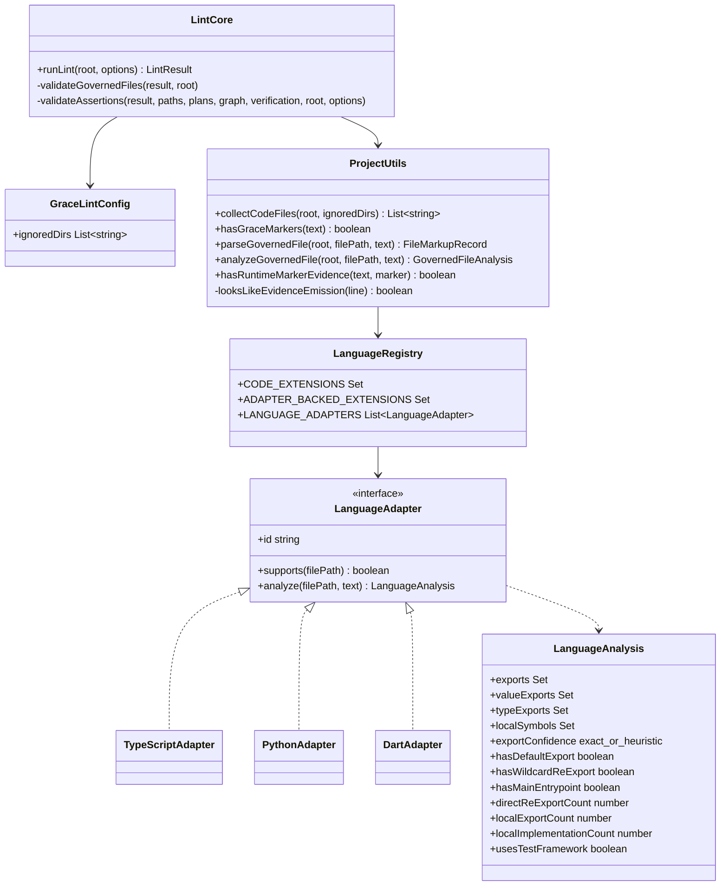
```mermaid
classDiagram
    class LintCore {
        +runLint(root, options) LintResult
        -validateGovernedFiles(result, root)
        -validateAssertions(result, paths, plans, graph, verification, root, options)
    }
    class GraceLintConfig {
        +ignoredDirs List~string~
    }
    class ProjectUtils {
        +collectCodeFiles(root, ignoredDirs) List~string~
        +hasGraceMarkers(text) boolean
        +parseGovernedFile(root, filePath, text) FileMarkupRecord
        +analyzeGovernedFile(root, filePath, text) GovernedFileAnalysis
        +hasRuntimeMarkerEvidence(text, marker) boolean
        -looksLikeEvidenceEmission(line) boolean
    }
    class LanguageRegistry {
        +CODE_EXTENSIONS Set
        +ADAPTER_BACKED_EXTENSIONS Set
        +LANGUAGE_ADAPTERS List~LanguageAdapter~
    }
    class LanguageAdapter {
        <<interface>>
        +id string
        +supports(filePath) boolean
        +analyze(filePath, text) LanguageAnalysis
    }
    class LanguageAnalysis {
        +exports Set
        +valueExports Set
        +typeExports Set
        +localSymbols Set
        +exportConfidence exact_or_heuristic
        +hasDefaultExport boolean
        +hasWildcardReExport boolean
        +hasMainEntrypoint boolean
        +directReExportCount number
        +localExportCount number
        +localImplementationCount number
        +usesTestFramework boolean
    }
    class TypeScriptAdapter
    class PythonAdapter
    class DartAdapter

    LintCore --> GraceLintConfig
    LintCore --> ProjectUtils
    ProjectUtils --> LanguageRegistry
    LanguageRegistry --> LanguageAdapter
    LanguageAdapter <|.. TypeScriptAdapter
    LanguageAdapter <|.. PythonAdapter
    LanguageAdapter <|.. DartAdapter
    LanguageAdapter ..> LanguageAnalysis
```

**The defect, in one picture:** `ProjectUtils.analyzeGovernedFile` consults `ADAPTER_BACKED_EXTENSIONS` before consulting `LANGUAGE_ADAPTERS`. A `.rs` file is in `CODE_EXTENSIONS` but not `ADAPTER_BACKED_EXTENSIONS`, so `adapter` is `undefined`, `language` stays `null`, `validateMapParity` is never called, **and no issue is emitted**. That is gap G-01.

### 1.2 Module health / marker evidence

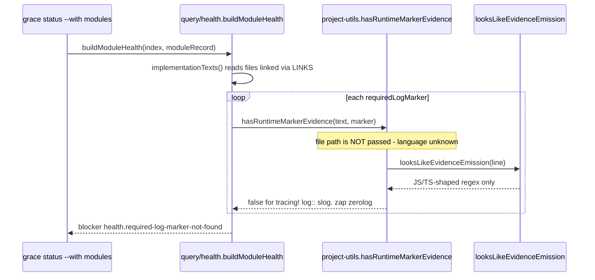
```mermaid
sequenceDiagram
    participant CLI as grace status --with modules
    participant H as query/health.buildModuleHealth
    participant PU as project-utils.hasRuntimeMarkerEvidence
    participant RX as looksLikeEvidenceEmission

    CLI->>H: buildModuleHealth(index, moduleRecord)
    H->>H: implementationTexts() reads files linked via LINKS
    loop each requiredLogMarker
        H->>PU: hasRuntimeMarkerEvidence(text, marker)
        Note over PU: file path is NOT passed - language unknown
        PU->>RX: looksLikeEvidenceEmission(line)
        RX-->>PU: JS/TS-shaped regex only
        PU-->>H: false for tracing! log:: slog. zap zerolog
    end
    H-->>CLI: blocker health.required-log-marker-not-found
```

**The defect:** the file path never reaches the regex, so the check cannot be language-aware even in principle. Phase 1 threads it through. That is gap G-02.

### 1.3 Change-bundle validation

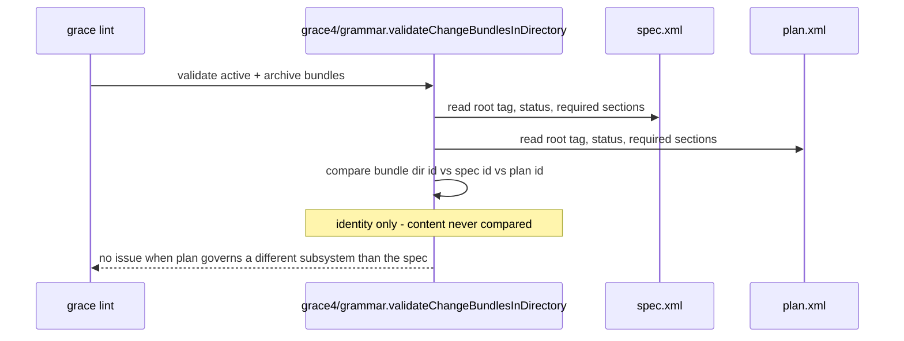
```mermaid
sequenceDiagram
    participant CLI as grace lint
    participant G as grace4/grammar.validateChangeBundlesInDirectory
    participant S as spec.xml
    participant P as plan.xml

    CLI->>G: validate active + archive bundles
    G->>S: read root tag, status, required sections
    G->>P: read root tag, status, required sections
    G->>G: compare bundle dir id vs spec id vs plan id
    Note over G: identity only - content never compared
    G-->>CLI: no issue when plan governs a different subsystem than the spec
```

That is gap G-05, closed in Phase 5.

---

## 2. Phase status board

Keep this table current. It is the single source of truth for progress.

| # | Phase | Gaps closed | Release | Status |
|---|---|---|---|---|
| — | Pre-Phase-0 hotfix: lexical vs realpath project paths (see §0.2) | — (unblocking) | 4.1.0 | `COMPLETE` |
| 0 | Test harness & polyglot fixtures | — (enabling) | 4.1.0 | `COMPLETE` |
| 1 | Stop the misleading signals | G-01, G-02, G-21 | 4.1.0 | `COMPLETE` |
| 2 | Go export adapter | G-03 | 4.1.0 | `NOT STARTED` |
| 3 | Rust export adapter | G-04 | 4.1.0 | `NOT STARTED` |
| 4 | Polyglot health restoration | G-10, G-11, G-12 | 4.1.0 | `NOT STARTED` |
| 5 | Spec→plan traceability (`AC-*`) | G-05 | 4.2.0 | `NOT STARTED` |
| 6 | Design-system layer | G-06, G-09 | 5.0.0 | `NOT STARTED` |
| 7 | Systems modeling | G-07, G-08, G-14, G-15 | 5.0.0 | `NOT STARTED` |
| 8 | Scale & ergonomics | G-13, G-16, G-22 | 5.0.0 | `NOT STARTED` |
| 9 | Adoption surface & release | G-17, G-18, G-19, G-20 | 5.0.0 | `NOT STARTED` |

**Hard sequencing rule:** phases 0→5 are strictly ordered. Phases 6, 7, 8 may be reordered among themselves after 5 lands, but 6 depends on `AC-*` from 5. Phase 9 is last.

---

# PHASE 0 — Test harness & polyglot fixtures

**Status:** `COMPLETE`
**Gaps:** none directly — this is the scaffolding every later phase's tests stand on.
**Release:** 4.1.0

## 0.1 Objective

Create reusable fixture builders so that later phases write ten-line tests instead of eighty-line temp-directory setups. Zero behavior change to shipped code.

## 0.2 Preconditions

→ verify: `bun run validate:ci` passes on a clean checkout. If it does not, **stop** — you must not build on a red baseline.

### Pre-Phase-0 hotfix (landed 2026-07-28)

Phase 0 was blocked at 4.0.4: **9 tests failed on macOS** because `resolveContainedProjectPath`
returns a realpath'd `absolutePath` while `listXmlFiles` and the status root stay lexical.
Where `/var/folders` symlinks to `/private/var/folders` the two forms never compare equal,
producing false `projection.*.unindexed-document` issues and drift routes that escaped the
project root, so graph drift was never attributed.

Fixed by `canonicalizeExistingPath` / `toProjectRelativePath` in `src/grace4/paths.ts`, applied
at the two mixing call sites (`projections.reportUnindexedDocuments`,
`grace-status.buildDriftRouteIndex`). Both are pinned by pre-existing tests: reverting
`projections.ts` alone reproduces 25 failures, `grace-status.ts` alone reproduces 1.

**This is a precondition, not a phase.** It is recorded here because Phase 0's fixture builders
run entirely in `mkdtempSync(tmpdir())` directories — on macOS every fixture in this plan sits
behind that symlink, so without the fix every later phase would inherit false failures.

Two constraints this creates for later phases:

- `toProjectRelativePath` is **not** a containment boundary — it returns `../`-escaping output
  for paths outside the root. Only use it for paths GRACE derived itself. Every author-supplied
  path still goes through `resolveContainedProjectPath`, including the new path fields in
  Phases 6 and 7 (`TokenSource`, `IC-*/Schema`, `VisualCheck/Baseline`).
- `canonicalizeExistingPath` is best-effort identity: it degrades to the lexical form on an
  unreadable or racing path rather than throwing. Do not build a check on it that must fail closed.

## 0.3 Files touched

| File | Action |
|---|---|
| `src/grace4/test-fixtures.ts` | READ ONLY — study its idiom first |
| `src/grace-lint.test.ts` | READ ONLY — study how integration tests build temp projects |
| `src/test-support/fixtures.ts` | CREATE |
| `src/test-support/fixtures.test.ts` | CREATE |

## 0.4 Design

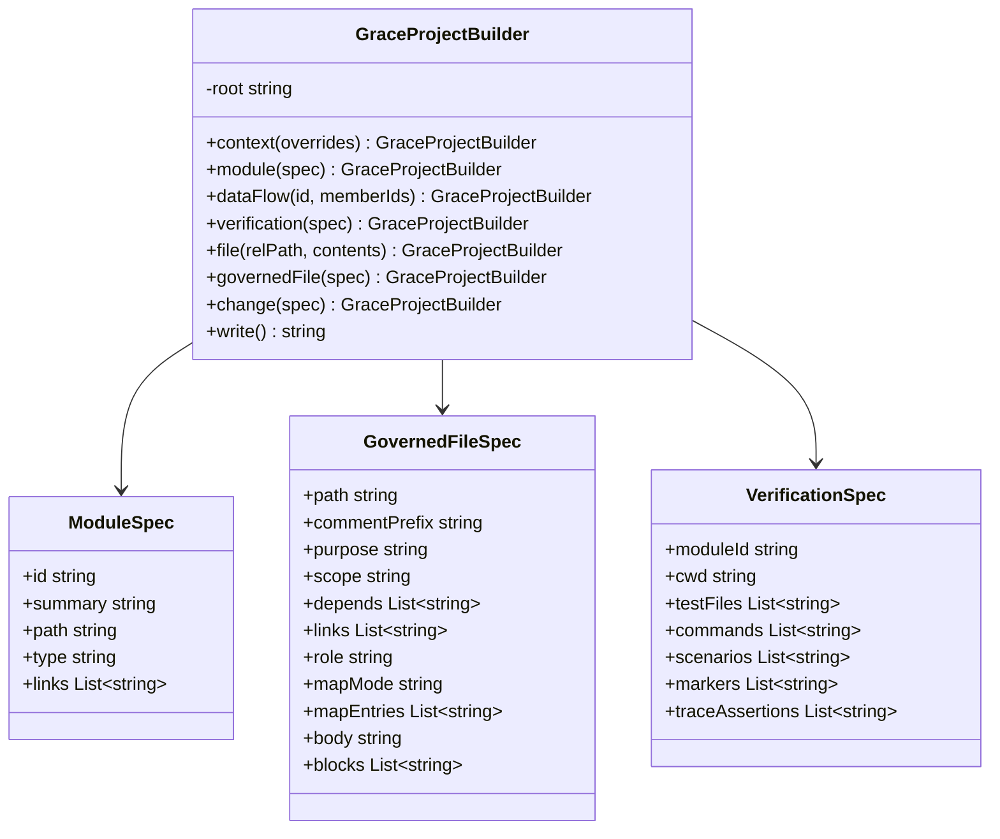
```mermaid
classDiagram
    class GraceProjectBuilder {
        -root string
        +context(overrides) GraceProjectBuilder
        +module(spec) GraceProjectBuilder
        +dataFlow(id, memberIds) GraceProjectBuilder
        +verification(spec) GraceProjectBuilder
        +file(relPath, contents) GraceProjectBuilder
        +governedFile(spec) GraceProjectBuilder
        +change(spec) GraceProjectBuilder
        +write() string
    }
    class ModuleSpec {
        +id string
        +summary string
        +path string
        +type string
        +links List~string~
    }
    class GovernedFileSpec {
        +path string
        +commentPrefix string
        +purpose string
        +scope string
        +depends List~string~
        +links List~string~
        +role string
        +mapMode string
        +mapEntries List~string~
        +body string
        +blocks List~string~
    }
    class VerificationSpec {
        +moduleId string
        +cwd string
        +testFiles List~string~
        +commands List~string~
        +scenarios List~string~
        +markers List~string~
        +traceAssertions List~string~
    }
    GraceProjectBuilder --> ModuleSpec
    GraceProjectBuilder --> GovernedFileSpec
    GraceProjectBuilder --> VerificationSpec
```

## 0.5 Steps

**Step 0.5.1 — Study the existing idiom.**
Read `src/grace4/test-fixtures.ts` in full, then read the first 120 lines of `src/grace-lint.test.ts`.
→ verify: in your phase report, state in two sentences how existing integration tests create a temp project and clean it up. Match that idiom exactly; do not invent a second one.

**Step 0.5.2 — Create `src/test-support/fixtures.ts`.**

```
PSEUDOCODE

createTempProject(prefix) -> string:
    dir = mkdtempSync(join(tmpdir(), prefix))
    register cleanup with the SAME mechanism existing tests use
    return dir

class GraceProjectBuilder:
    root: string
    modules: ModuleSpec[]
    dataFlows: {id, members}[]
    verifications: VerificationSpec[]
    files: Map<relPath, contents>
    changes: ChangeSpec[]
    contextOverrides: Partial<Record<contextFileName, string>>

    context(overrides):
        merge into contextOverrides; return this

    module(spec):
        push spec; return this

    verification(spec):
        push spec; return this

    file(relPath, contents):
        files.set(relPath, contents); return this

    governedFile(spec):
        // renders markup with the right comment prefix for the extension
        prefix = spec.commentPrefix ?? commentPrefixForExtension(extname(spec.path))
        header = renderModuleContract(prefix, spec)     // PURPOSE/SCOPE/DEPENDS/LINKS [+ROLE/MAP_MODE]
        map    = spec.mapEntries ? renderModuleMap(prefix, spec.mapEntries) : ""
        files.set(spec.path, header + "\n" + map + "\n" + (spec.body ?? ""))
        return this

    change(spec):
        push spec; return this

    write() -> root:
        // 1. .grace/context: write all five artifacts; defaults are minimal-valid,
        //    overridden by contextOverrides
        for each of requirements|technology|principles|deployment|ux-guidelines:
            writeFile(.grace/context/<name>.xml, contextOverrides[name] ?? DEFAULT_<NAME>)

        // 2. .grace/graph
        writeFile(.grace/graph/index.xml,
                  GraceGraphIndex listing GD-MAIN -> graph/main.xml owning every module + data flow id)
        writeFile(.grace/graph/main.xml,
                  GraceGraphDocument > GD-MAIN > one element per module and data flow)

        // 3. .grace/verification  (mirror structure, VD-MAIN)
        //    IMPORTANT: projections require V-<moduleId> to exist for EVERY module.
        //    If a caller declared a module with no verification, auto-generate a
        //    minimal-valid V-M-* so unrelated tests do not drown in
        //    projection.verification.missing-module-coverage.
        for module in modules where no verification declared:
            synthesize minimal verification { commands:[placeholder], scenarios:[placeholder] }

        // 4. change bundles under .grace/changes/active/<C-ID>/ or archive/
        // 5. plain + governed files
        return root

commentPrefixForExtension(ext):
    ".py" | ".rb" | ".sh" | ".bash" | ".zsh"   -> "#"
    ".sql"                                      -> "--"
    ".clj" | ".cljs" | ".cljc"                  -> ";;"
    otherwise                                   -> "//"
```

Also export three ready-made scenario builders that later phases reuse verbatim:

```
PSEUDOCODE

polyglotFixture() -> root:
    // Rust + Go + TSX, one module each, one DF, three verifications.
    // Mirrors the fixture used to reproduce G-01/G-02 in the review.
    builder
      .module({id:"M-LEDGER-CORE", path:"services/ledger/src/lib.rs", type:"CORE_LOGIC"})
      .module({id:"M-GATEWAY-ROUTER", path:"services/gateway/internal/router/router.go", type:"INTEGRATION"})
      .module({id:"M-WEB-LEDGER-TABLE", path:"apps/web/src/components/LedgerTable.tsx", type:"UI_COMPONENT"})
      .dataFlow("DF-POSTING", ["M-WEB-LEDGER-TABLE","M-GATEWAY-ROUTER","M-LEDGER-CORE"])
      .governedFile(<rust file: pub fn post, MODULE_MAP lists "post", BLOCK_VALIDATE_BALANCE,
                     tracing::warn! emitting "[LedgerCore][post][BLOCK_VALIDATE_BALANCE]">)
      .governedFile(<go file: func Route, MODULE_MAP lists "Route", BLOCK_DISPATCH,
                     slog.Info emitting "[GatewayRouter][Route][BLOCK_DISPATCH]">)
      .governedFile(<tsx file: export function LedgerTable, MODULE_MAP lists "LedgerTable">)
      .verification({moduleId:"M-LEDGER-CORE", cwd:"services/ledger",
                     commands:["cargo test --lib"], scenarios:[...],
                     markers:["[LedgerCore][post][BLOCK_VALIDATE_BALANCE]"]})
      ... etc
      .write()

scaleFixture(moduleCount) -> root:
    // N modules, N governed TS files, single GD-MAIN / VD-MAIN. For §8 size checks
    // and for guarding the 0.14s performance property.

minimalTsFixture() -> root:
    // one module, one governed .ts file, one verification. The smallest thing that lints clean.
```

→ verify: `bun test src/test-support/fixtures.test.ts` passes.

**Step 0.5.3 — Prove the fixtures lint clean.**
`src/test-support/fixtures.test.ts` must assert:

| Test | Assertion |
|---|---|
| `minimalTsFixture lints clean` | `runLint(root)` → `summary.errors === 0` |
| `polyglotFixture lints clean at HEAD` | `summary.errors === 0` — this is the pre-fix baseline that Phase 1 and 2 will change **deliberately** |
| `polyglotFixture module health` | `M-LEDGER-CORE` state is `blocked` with `health.required-log-marker-not-found` — **this is the bug, asserted as current behavior; Phase 1 flips it** |
| `scaleFixture(50) lints clean` | `summary.errors === 0` |
| `builder is deterministic` | two `write()` calls with identical specs produce byte-identical file trees |

→ verify: `bun test src/test-support/fixtures.test.ts` — all pass. The two rows asserting *buggy* behavior are intentional: they are the regression tests Phase 1 will invert, and they prove the bug exists before you fix it (§0.2).

**Step 0.5.4 — Confirm test helpers are not published.**
→ verify: `bun run validate:packed` passes AND `src/test-support/` does not appear in the packed output. If `package.json#files` would include it, do not add it to `files`.

## 0.6 Definition of done

```
bun run typecheck            → pass
bun test                     → all pass, no pre-existing test modified
bun run validate:cli         → pass
bun run validate:marketplace → pass
bun run validate:packed      → pass, src/test-support absent from tarball
```

## 0.7 Review gate

- [ ] `src/test-support/fixtures.ts` created; no file outside `src/test-support/` modified
- [ ] Fixture builder follows the temp-dir/cleanup idiom already in `src/grace-lint.test.ts`
- [ ] The two "asserts current buggy behavior" tests exist and pass, with a comment naming the gap ID they encode
- [ ] Test helpers excluded from the published tarball
- [ ] Zero production-code changes in this phase

## 0.8 Rollback

Delete `src/test-support/`. Nothing else was touched.

---

# PHASE 1 — Stop the misleading signals

**Status:** `COMPLETE`
**Gaps:** G-02 (marker false-block), G-01 (fail-open parity), G-21 (docs imply parity)
**Release:** 4.1.0

> This is the highest-leverage phase in the plan. It is roughly a hundred lines of production code and it converts GRACE's Rust/Go signal from *actively misleading in both directions* to *honest*. It ships before any adapter, because an honest "GRACE cannot verify this" is worth more than a silent lie, and because a false blocker teaches teams to ignore module health — which destroys the value of everything built later.

## 1.1 Objective

1. Make marker evidence detection language-aware so idiomatic Rust and Go logging is recognized.
2. Emit an explicit `analysis.no-adapter` warning when a governed file claims export/local parity in a language with no adapter, with a deliberate opt-out.
3. Report analysis coverage in `grace lint --format json` and `grace status`.
4. Correct the documentation so `CODE_EXTENSIONS` is not read as a support matrix.

## 1.2 Preconditions

→ verify: Phase 0 is `COMPLETE` and its two "current buggy behavior" tests are green.

## 1.3 Files touched

| File | Action |
|---|---|
| `src/lint/emission-patterns.ts` | CREATE |
| `src/lint/emission-patterns.test.ts` | CREATE |
| `src/project-utils.ts` | MODIFY — `looksLikeEvidenceEmission`, `hasRuntimeMarkerEvidence`, `analyzeGovernedFile` |
| `src/project-utils.test.ts` | MODIFY — add cases |
| `src/query/health.ts` | MODIFY — pass the file path through |
| `src/lint/types.ts` | MODIFY — `GraceLintConfig`, `LintResult` |
| `src/lint/config.ts` | MODIFY — new key + validation |
| `src/lint/core.ts` | MODIFY — thread config, collect coverage |
| `src/lint/catalog.ts` | MODIFY — guide for `analysis.no-adapter`, `config.invalid-unverified-languages` |
| `src/grace-status.ts` | MODIFY — coverage section |
| `src/grace-lint.test.ts`, `src/grace-status.test.ts` | MODIFY — integration tests |
| `README.md` | MODIFY — support matrix |
| `skills/grace/grace-explainer/references/semantic-markup.md` | MODIFY — support matrix |
| `skills/grace/grace-cli/SKILL.md` | MODIFY — no-false-parity rule |
| `plugins/grace/skills/grace/...` | MIRROR — byte-identical copies of the two skill edits |

## 1.4 Part A — Language-aware marker evidence (G-02)

### Design

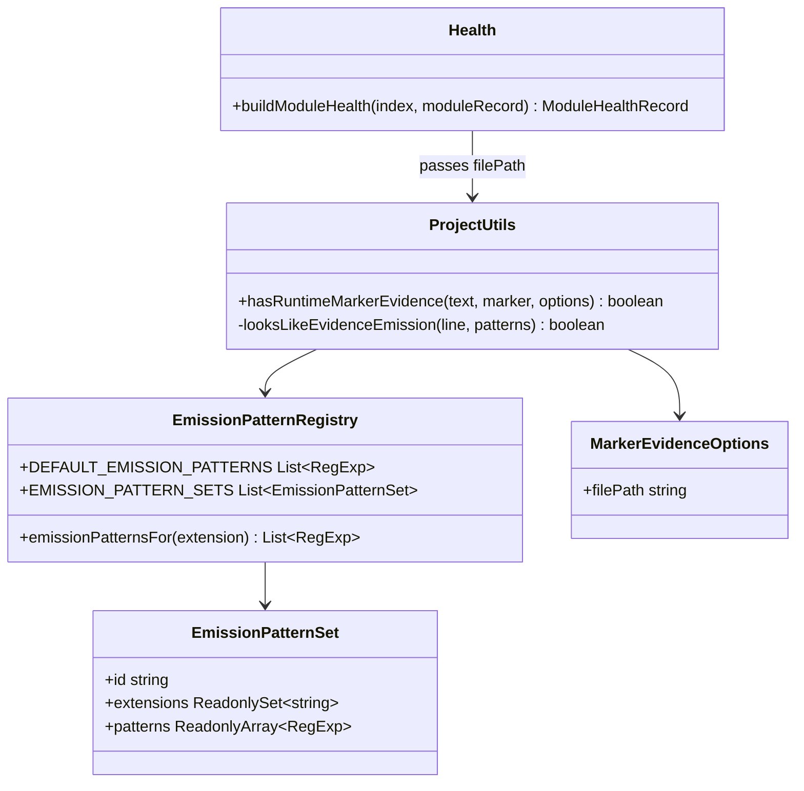
```mermaid
classDiagram
    class EmissionPatternSet {
        +id string
        +extensions ReadonlySet~string~
        +patterns ReadonlyArray~RegExp~
    }
    class EmissionPatternRegistry {
        +DEFAULT_EMISSION_PATTERNS List~RegExp~
        +EMISSION_PATTERN_SETS List~EmissionPatternSet~
        +emissionPatternsFor(extension) List~RegExp~
    }
    class ProjectUtils {
        +hasRuntimeMarkerEvidence(text, marker, options) boolean
        -looksLikeEvidenceEmission(line, patterns) boolean
    }
    class MarkerEvidenceOptions {
        +filePath string
    }
    class Health {
        +buildModuleHealth(index, moduleRecord) ModuleHealthRecord
    }
    EmissionPatternRegistry --> EmissionPatternSet
    ProjectUtils --> EmissionPatternRegistry
    ProjectUtils --> MarkerEvidenceOptions
    Health --> ProjectUtils : passes filePath
```

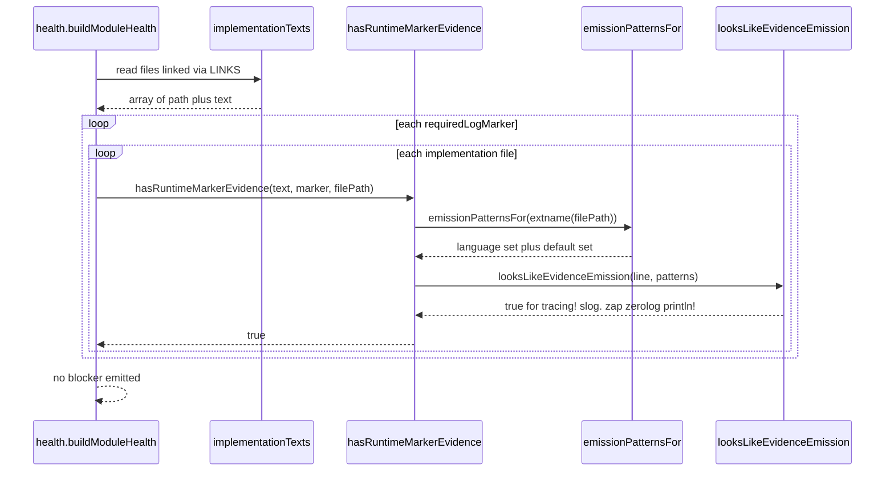
```mermaid
sequenceDiagram
    participant H as health.buildModuleHealth
    participant IT as implementationTexts
    participant PU as hasRuntimeMarkerEvidence
    participant REG as emissionPatternsFor
    participant L as looksLikeEvidenceEmission

    H->>IT: read files linked via LINKS
    IT-->>H: array of path plus text
    loop each requiredLogMarker
        loop each implementation file
            H->>PU: hasRuntimeMarkerEvidence(text, marker, filePath)
            PU->>REG: emissionPatternsFor(extname(filePath))
            REG-->>PU: language set plus default set
            PU->>L: looksLikeEvidenceEmission(line, patterns)
            L-->>PU: true for tracing! slog. zap zerolog println!
            PU-->>H: true
        end
    end
    H-->>H: no blocker emitted
```

### Steps

**Step 1.4.1 — Create `src/lint/emission-patterns.ts`.**

```
PSEUDOCODE

export type EmissionPatternSet = {
    id: string
    extensions: ReadonlySet<string>
    patterns: readonly RegExp[]
}

// Existing JS/TS behavior, decomposed. This is the fallback for every language
// and MUST stay behaviorally identical to today's single regex for .ts/.js files.
export const DEFAULT_EMISSION_PATTERNS: readonly RegExp[] = [
    /console\./,
    /logger\./,
    /tracer\./,
    /trace\s*\(/,
    /emit\s*\(/,
    /\.(?:info|warn|error|debug|trace)\s*\(/,
]

const RUST_PATTERNS = [
    // tracing::info!(...)  log::warn!(...)  slog::error!(...)  defmt::info!(...)
    /\b(?:tracing|log|slog|defmt)\s*::\s*(?:trace|debug|info|warn|error)\s*!\s*\(/,
    // bare imported macros: info!(...)  warn!(target: "app", ...)
    /(?<![A-Za-z0-9_])(?:trace|debug|info|warn|error|event)\s*!\s*\(/,
    // println!/eprintln!/print!/eprint!/write!/writeln!/panic!
    /(?<![A-Za-z0-9_])(?:println|eprintln|print|eprint|write|writeln|panic)\s*!\s*\(/,
    // tracing span field recording
    /\.(?:event|record|emit|log)\s*\(/,
]

const GO_PATTERNS = [
    // slog.Info(...)  log.Printf(...)  zap.L().Info(...)  logrus.Warn(...)  klog.V(2).Info(...)
    /\b(?:slog|log|logger|logr|zap|sugar|logrus|klog|glog|zerolog)\s*\./,
    // exported method-call logging, incl. zap w/f/s variants and Context suffixes
    /\.(?:Info|Warn|Warning|Error|Debug|Trace|Fatal|Panic|Print|Printf|Println|Log)(?:f|w|s|Context|Ctx)?\s*\(/,
    // zerolog terminal calls: .Msg("...")  .Msgf("...")  .Send()
    /\.Msg(?:f)?\s*\(/,
    /\.Send\s*\(\s*\)/,
]

export const EMISSION_PATTERN_SETS: readonly EmissionPatternSet[] = [
    { id: "rust", extensions: new Set([".rs"]), patterns: RUST_PATTERNS },
    { id: "go",   extensions: new Set([".go"]), patterns: GO_PATTERNS },
]

export function emissionPatternsFor(extension: string | undefined): readonly RegExp[] {
    if (!extension) {
        // Unknown language: union of everything. A false POSITIVE here is a
        // missed blocker; a false NEGATIVE is a permanent unfixable block.
        // Prefer the false positive - that is the G-02 lesson.
        return [...DEFAULT_EMISSION_PATTERNS, ...EMISSION_PATTERN_SETS.flatMap(s => s.patterns)]
    }
    const set = EMISSION_PATTERN_SETS.find(s => s.extensions.has(extension))
    return set ? [...set.patterns, ...DEFAULT_EMISSION_PATTERNS] : DEFAULT_EMISSION_PATTERNS
}
```

**Implementation rules — non-negotiable:**

- **No `/g` or `/y` flags on any pattern.** A global regex is stateful across `.test()` calls (`lastIndex`) and will produce alternating true/false results. This is the classic bug in exactly this kind of registry.
- Lookbehind `(?<!...)` is supported by Bun's regex engine. → verify: add a one-line unit assertion that `/(?<![A-Za-z0-9_])info\s*!\s*\(/.test("info!(")` is `true` and `.test("xinfo!(")` is `false`, so a future engine change fails loudly.
- Add a comment above `GO_PATTERNS` noting the known limitation: zerolog structured fields (`.Str("k", "[MARKER]")`) are matched only when the same line also carries a terminal `.Msg(...)`. Do not try to solve that here.

→ verify: `bun test src/lint/emission-patterns.test.ts` passes with the table in Step 1.4.4.

**Step 1.4.2 — Rewire `looksLikeEvidenceEmission` in `src/project-utils.ts`.**

```
PSEUDOCODE

- function looksLikeEvidenceEmission(line) {
-     return /(console\.|logger\.|...)/.test(line)
- }
+ function looksLikeEvidenceEmission(line: string, patterns: readonly RegExp[]) {
+     return patterns.some(pattern => pattern.test(line))
+ }
```

**Step 1.4.3 — Thread the file path into `hasRuntimeMarkerEvidence`.**

```
PSEUDOCODE

export type MarkerEvidenceOptions = { filePath?: string }

export function hasRuntimeMarkerEvidence(
    text: string,
    marker: string,
    options: MarkerEvidenceOptions = {},        // OPTIONAL - keeps every existing 2-arg caller valid
): boolean {
    const patterns = emissionPatternsFor(options.filePath ? extname(options.filePath) : undefined)
    const lines = text.split("\n")

    // direct emission - unchanged logic, parameterized predicate
    if (lines.some(line => !isCommentOnlyLine(line) && line.includes(marker)
                           && looksLikeEvidenceEmission(line, patterns))) {
        return true
    }

    // indirect emission via an identifier assigned the exact marker - UNCHANGED,
    // except looksLikeEvidenceEmission now takes patterns.
    // NOTE: the existing assignment regex `([A-Za-z_$][A-Za-z0-9_$]*)\s*(?::[^=\n]+)?=\s*"MARKER"`
    // already handles Go `const marker = "..."` and Rust `const MARKER: &str = "...";`
    // Do NOT change it. Add unit tests proving both, so the coverage is recorded.
    ... unchanged ...
}
```

Do not change the identifier-boundary behavior. The existing `marker$` / `marker$Other` tests must still pass unmodified — if you have to touch them, you broke something.

**Step 1.4.4 — Pass the path from health.**

In `src/query/health.ts`, `implementationTexts()` already returns `{ path, text }`.

```
PSEUDOCODE

- if (!runtimeTexts.some(({ text }) => hasRuntimeMarkerEvidence(text, marker)))
+ if (!runtimeTexts.some(({ path: filePath, text }) =>
+       hasRuntimeMarkerEvidence(text, marker, { filePath })))
```

→ verify: `bun test src/query` and `bun test src/grace-query.test.ts` pass.

**Step 1.4.5 — Unit tests: `src/lint/emission-patterns.test.ts`.**

Encode the full eleven-form probe from `review.md` Appendix A. Marker: `[X][y][BLOCK_Z]`.

| # | Line | Extension | Expected |
|---|---|---|---|
| 1 | `tracing::info!("[X][y][BLOCK_Z] hi");` | `.rs` | ✅ |
| 2 | `log::warn!("[X][y][BLOCK_Z] hi");` | `.rs` | ✅ |
| 3 | `info!(target: "app", "[X][y][BLOCK_Z]");` | `.rs` | ✅ |
| 4 | `println!("[X][y][BLOCK_Z]");` | `.rs` | ✅ |
| 5 | `eprintln!("[X][y][BLOCK_Z]");` | `.rs` | ✅ |
| 6 | `tracing::warn!("[X][y][BLOCK_Z] unbalanced");` | `.rs` | ✅ |
| 7 | `slog.Info("[X][y][BLOCK_Z]")` | `.go` | ✅ |
| 8 | `zap.L().Infow("[X][y][BLOCK_Z]")` | `.go` | ✅ |
| 9 | `log.Printf("[X][y][BLOCK_Z]")` | `.go` | ✅ |
| 10 | `log.Info().Msg("[X][y][BLOCK_Z]")` | `.go` | ✅ |
| 11 | `logger.Error("[X][y][BLOCK_Z]")` | `.go` | ✅ |
| 12 | `console.log("[X][y][BLOCK_Z]")` | `.ts` | ✅ (no regression) |
| 13 | `logger.info("[X][y][BLOCK_Z]")` | `.ts` | ✅ (no regression) |
| 14 | `const s = "[X][y][BLOCK_Z]";` | `.rs` | ❌ assignment alone is not emission |
| 15 | `// tracing::info!("[X][y][BLOCK_Z]");` | `.rs` | ❌ comment-only line |
| 16 | `return "[X][y][BLOCK_Z]";` | `.go` | ❌ not an emission |
| 17 | `const MARKER: &str = "[X][y][BLOCK_Z]";` + `tracing::info!("{}", MARKER);` | `.rs` | ✅ indirect |
| 18 | `const marker = "[X][y][BLOCK_Z]"` + `slog.Info(marker)` | `.go` | ✅ indirect |
| 19 | (no extension supplied) `tracing::info!("[X][y][BLOCK_Z]")` | `undefined` | ✅ union fallback |

Plus the stateless-regex guard: call `emissionPatternsFor(".go")` twice and assert every pattern has `.global === false` and `.sticky === false`.

→ verify: all 19 + guards pass.

**Step 1.4.6 — Invert the Phase-0 bug assertion.**
In `src/test-support/fixtures.test.ts`, change the `M-LEDGER-CORE` health test from asserting `blocked` / `health.required-log-marker-not-found` to asserting `ready` (or at minimum: that blocker code is absent). Add the same for the Go module.

→ verify: run the test **before** the Phase 1.4 changes are staged, confirm it fails; then with them, confirm it passes. Show both outputs in your report — this is the regression evidence required by §0.2.

**Step 1.4.7 — Integration test in `src/grace-query.test.ts`.**
Build `polyglotFixture()`, run the module-health path used by `grace status --with modules`, and assert:

- `M-LEDGER-CORE` has no `health.required-log-marker-not-found` blocker
- `M-GATEWAY-ROUTER` has no `health.required-log-marker-not-found` blocker
- A negative control: a Rust file where the marker appears **only** in a comment still produces the blocker

→ verify: `bun run validate:cli` passes.

## 1.5 Part B — `analysis.no-adapter` (G-01)

### Design

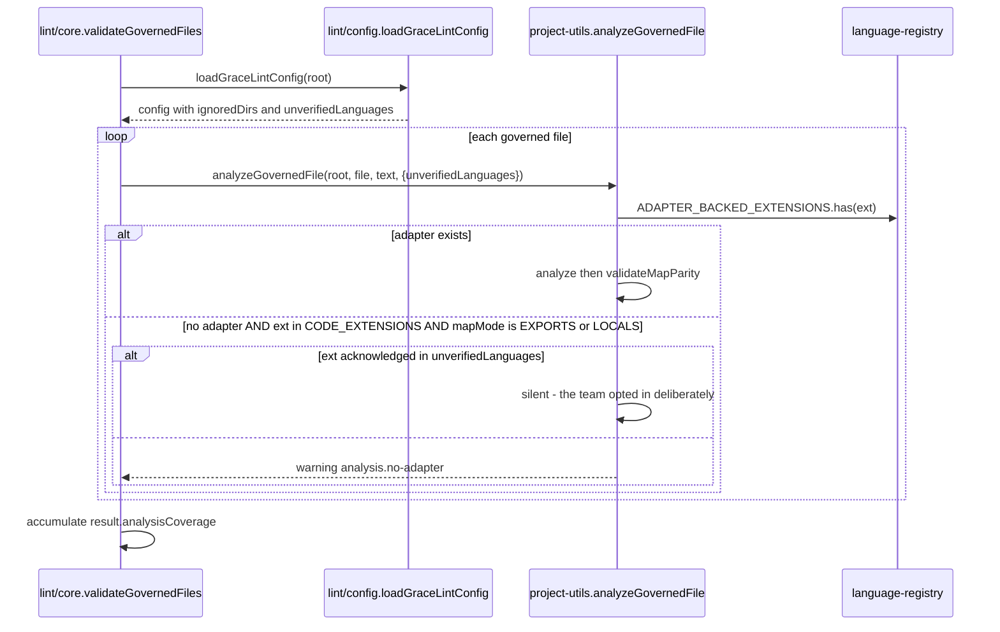
```mermaid
sequenceDiagram
    participant C as lint/core.validateGovernedFiles
    participant CFG as lint/config.loadGraceLintConfig
    participant A as project-utils.analyzeGovernedFile
    participant R as language-registry

    C->>CFG: loadGraceLintConfig(root)
    CFG-->>C: config with ignoredDirs and unverifiedLanguages
    loop each governed file
        C->>A: analyzeGovernedFile(root, file, text, {unverifiedLanguages})
        A->>R: ADAPTER_BACKED_EXTENSIONS.has(ext)
        alt adapter exists
            A->>A: analyze then validateMapParity
        else no adapter AND ext in CODE_EXTENSIONS AND mapMode is EXPORTS or LOCALS
            alt ext acknowledged in unverifiedLanguages
                A->>A: silent - the team opted in deliberately
            else
                A-->>C: warning analysis.no-adapter
            end
        end
    end
    C->>C: accumulate result.analysisCoverage
```

### Steps

**Step 1.5.1 — Extend the lint config.**

`src/lint/types.ts`:
```
PSEUDOCODE
export type GraceLintConfig = {
    ignoredDirs?: string[]
    unverifiedLanguages?: string[]     // e.g. [".rs", ".go"] - suppresses analysis.no-adapter
}
```

`src/lint/config.ts`:
```
PSEUDOCODE
SUPPORTED_KEYS = new Set(["ignoredDirs", "unverifiedLanguages"])

// in the validation block, after the ignoredDirs check:
if (parsed.unverifiedLanguages !== undefined) {
    if (!Array.isArray(parsed.unverifiedLanguages)
        || parsed.unverifiedLanguages.some(v => typeof v !== "string" || !v.startsWith("."))) {
        issues.push({
            severity: "error",
            code: "config.invalid-unverified-languages",
            file: CONFIG_FILE_NAME,
            message: "`unverifiedLanguages` must be an array of file extensions beginning with a dot, e.g. [\".rs\", \".go\"].",
        })
    }
}
```
Also update the `config.unknown-key` message text, which currently enumerates `ignoredDirs` only.

**Step 1.5.2 — Emit the diagnostic in `analyzeGovernedFile`.**

```
PSEUDOCODE

export type GovernedFileAnalysisOptions = {
    unverifiedLanguages?: readonly string[]
}

export function analyzeGovernedFile(
    root, filePath, text,
    options: GovernedFileAnalysisOptions = {},      // OPTIONAL - existing 3-arg callers and tests stay valid
): GovernedFileAnalysis {
    ... unchanged up to and including the adapter lookup ...

    const extension = path.extname(filePath)

    if (!adapter) {
        const claimsParity = effectiveMapMode === "EXPORTS" || effectiveMapMode === "LOCALS"
        const acknowledged = new Set(options.unverifiedLanguages ?? []).has(extension)
        if (claimsParity && CODE_EXTENSIONS.has(extension) && !acknowledged) {
            issues.push(markupIssue(
                "warning",
                "analysis.no-adapter",
                filePath,
                contract?.startLine ?? 1,
                `MODULE_MAP ${effectiveMapMode} parity is not verified for ${extension} files. `
                + `GRACE has no export adapter for this language; treat MODULE_MAP as unverified `
                + `documentation. Acknowledge per repo with .grace-lint.json `
                + `{ "unverifiedLanguages": ["${extension}"] }.`,
            ))
        }
    }

    ... unchanged from `if (language)` onward ...
}
```

**Why `claimsParity` gates it:** `MAP_MODE: SUMMARY` and `NONE` make no parity claim (barrels, config files), so warning there would be noise that teaches people to add blanket suppressions. This is the difference between an honest diagnostic and an ignored one.

**Step 1.5.3 — Thread config through `src/lint/core.ts`.**

```
PSEUDOCODE
// in validateGovernedFiles, replace:
- for (const issue of analyzeGovernedFile(root, file, text).issues) {
+ const analysis = analyzeGovernedFile(root, file, text, {
+     unverifiedLanguages: config?.unverifiedLanguages,
+ })
+ for (const issue of analysis.issues) {
      addIssue(result, issue)
  }
```

**Step 1.5.4 — Collect coverage into `LintResult`.**

`src/lint/types.ts`:
```
PSEUDOCODE
export type AnalysisCoverageEntry = { extension: string; files: number; adapterId?: string }

export type AnalysisCoverage = {
    adapterBacked: AnalysisCoverageEntry[]     // sorted by extension
    unverified: AnalysisCoverageEntry[]        // sorted by extension
    governedFiles: number
}

// add to LintResult:
    analysisCoverage: AnalysisCoverage
```

Initialize it in `createResult` (empty arrays, zero) so the JSON shape is stable even on early returns.

In `validateGovernedFiles`, accumulate per-extension counts over governed files only, splitting on `ADAPTER_BACKED_EXTENSIONS`. Record `adapterId` by finding the supporting adapter.

**Step 1.5.5 — Catalog entries in `src/lint/catalog.ts`.**

```
PSEUDOCODE
"analysis.no-adapter": {
    title: "No Language Adapter For Governed File",
    explanation:
        "This governed file declares a MODULE_MAP that claims export or local parity, but GRACE has "
        + "no language adapter for its extension. The map is therefore unverified documentation, not an "
        + "enforced contract. GRACE reports this instead of passing silently.",
    remediation: [
        "Prefer MAP_MODE: SUMMARY for files whose exports GRACE cannot verify.",
        "Back the module with MustPassCommand evidence such as the language's own test and lint commands.",
        "Acknowledge the limitation deliberately with .grace-lint.json { \"unverifiedLanguages\": [\".ext\"] } "
        + "so the silence is a recorded decision rather than an accident.",
    ],
},
"config.invalid-unverified-languages": {
    title: "Invalid unverifiedLanguages Config",
    explanation: "`unverifiedLanguages` in .grace-lint.json must be an array of dot-prefixed file extensions.",
    remediation: ["Use the form [\".rs\", \".go\"].", "Remove the key to restore default reporting."],
},
```

**Step 1.5.6 — `grace status` coverage section.**

In `src/grace-status.ts`: add `analysisCoverage` to `StatusResult` (sourced from the lint result it already computes — do **not** re-walk the tree), and render in `formatStatusText`:

```
Analysis Coverage
- Adapter-backed: 41 files (.ts, .tsx)
- Unverified:    118 files (.rs, .go)  <- MODULE_MAP parity not enforced
```

Omit the `Unverified` line entirely when the count is zero, so single-language projects see no noise.

**Step 1.5.7 — Tests.**

*Unit* — `src/project-utils.test.ts`:

| Case | Expected |
|---|---|
| `.rs` governed file, `MAP_MODE: EXPORTS` | issues contain `analysis.no-adapter`, severity `warning` |
| `.go` governed file, `MAP_MODE: EXPORTS` | contains `analysis.no-adapter` |
| `.rs` governed file, `MAP_MODE: SUMMARY` | does **not** contain `analysis.no-adapter` |
| `.rs` governed file, `MAP_MODE: NONE` | does **not** contain it |
| `.rs`, `MAP_MODE: EXPORTS`, `options.unverifiedLanguages: [".rs"]` | does **not** contain it |
| `.ts` governed file | never contains it (adapter exists) |
| `.md`-like non-code extension | never contains it (not in `CODE_EXTENSIONS`) |
| Called with 3 args (no options) | still works; warning fires |

*Unit* — `src/lint/config.test.ts` (create if absent):

| Case | Expected |
|---|---|
| `{"unverifiedLanguages": [".rs"]}` | no issues; parsed through |
| `{"unverifiedLanguages": "rs"}` | `config.invalid-unverified-languages` |
| `{"unverifiedLanguages": ["rs"]}` | `config.invalid-unverified-languages` (missing dot) |
| `{"nope": 1}` | `config.unknown-key`, message names both supported keys |

*Integration* — `src/grace-lint.test.ts`:

| Case | Expected |
|---|---|
| `polyglotFixture()` lint | ≥2 `analysis.no-adapter` warnings; `summary.errors === 0` (warnings must not break existing green builds) |
| Same fixture + `.grace-lint.json {"unverifiedLanguages":[".rs",".go"]}` | zero `analysis.no-adapter`; still `errors === 0` |
| `--format json` | `analysisCoverage.unverified` includes `.rs` and `.go` with correct counts; `adapterBacked` includes `.tsx` |
| `minimalTsFixture()` | zero `analysis.no-adapter`; `analysisCoverage.unverified` is empty |

*Integration* — `src/grace-status.test.ts`:

| Case | Expected |
|---|---|
| polyglot fixture, text format | output contains `Analysis Coverage` and `Unverified` |
| TS-only fixture, text format | contains `Analysis Coverage`, does **not** contain `Unverified` |
| json format | `analysisCoverage` present with the expected shape |

→ verify: `bun test && bun run validate:cli` — all pass.

## 1.6 Part C — Documentation honesty (G-21)

**Step 1.6.1 — Support matrix.**
Add this table to `README.md` (near the language/adapters discussion) and to `skills/grace/grace-explainer/references/semantic-markup.md`:

| Language | Export parity | Marker evidence | Test-file inference |
|---|---|---|---|
| TypeScript / JavaScript | exact (compiler-backed) | ✅ | ✅ |
| Python | exact with `__all__`, else heuristic | ✅ | ✅ |
| Dart | exact (runtime adapter) | ✅ | ✅ |
| Go | *(Phase 2)* | ✅ | *(Phase 4)* |
| Rust | *(Phase 3)* | ✅ | *(Phase 4)* |
| Java, Kotlin, Ruby, PHP, Swift, Scala, Clojure, SQL, shell | ❌ unverified — `analysis.no-adapter` | partial (default patterns) | ❌ |

Immediately beneath it, in bold:

> `CODE_EXTENSIONS` is a **file-discovery** list, not a support matrix. A file's extension appearing there means GRACE will find and govern the file — not that GRACE can verify its `MODULE_MAP`.

**Step 1.6.2 — No-false-parity rule in skills.**
Add to `skills/grace/grace-cli/SKILL.md` (and by extension the reviewer/verification skills if they assert parity):

> MODULE_MAP parity is enforced only for adapter-backed languages. For languages reported under `analysis.no-adapter`, treat MODULE_MAP as agent-maintained documentation and require `MustPassCommand` evidence as the source of structural truth.

**Step 1.6.3 — Mirror to `plugins/`.**
Copy every edited `skills/grace/**` file to its `plugins/grace/skills/grace/**` counterpart.
→ verify: `bun run validate:marketplace` passes (it runs `git diff --no-index` between canonical and packaged).

**Step 1.6.4 — Update the table in this plan's §2.** Set Phase 1 to `READY FOR REVIEW`.

## 1.7 Definition of done

```
bun run typecheck            → pass
bun test                     → all pass
bun run validate:cli         → pass
bun run validate:marketplace → pass
bun run grace lint --path <polyglot fixture>  → analysis.no-adapter warnings visible, 0 errors
```

## 1.8 Review gate

- [ ] Regression evidence shown: the marker test failing before the fix, passing after
- [ ] All 19 emission-probe cases pass; no pattern carries `g` or `y` flags
- [ ] `hasRuntimeMarkerEvidence` and `analyzeGovernedFile` kept backward-compatible signatures (optional trailing param); no existing test signature changed
- [ ] `analysis.no-adapter` is a **warning**, never an error — it must not break existing green builds
- [ ] `analysis.no-adapter` does not fire on `MAP_MODE: SUMMARY` / `NONE`
- [ ] Opt-out via `.grace-lint.json` works and is documented in the catalog remediation
- [ ] `analysisCoverage` present in `LintResult` and `StatusResult`; JSON shape stable on early returns
- [ ] Support matrix added to README **and** `semantic-markup.md`; `CODE_EXTENSIONS` explicitly labeled a discovery list
- [ ] `plugins/` mirror byte-identical
- [ ] Zero changes to adapters, grammar, projections, assertions, or scope in this phase

## 1.9 Rollback

Revert the commit. No persisted state, no artifact format change.

---

# PHASE 2 — Go export adapter

**Status:** `NOT STARTED`
**Gaps:** G-03
**Release:** 4.1.0

## 2.1 Objective

A pure-TypeScript Go adapter that extracts package-level exported identifiers exactly, with **no requirement** that the Go toolchain be installed.

**Read `review.md` §5.1 before starting.** The decision to avoid shipping a Go helper binary is deliberate and is not yours to revisit: `@osovv/grace-cli` publishes only `.ts` files, and requiring `go` on PATH would replace a silent gap with a hard wall for anyone linting Go code on a machine without a Go toolchain.

## 2.2 Preconditions

→ verify: Phase 1 `COMPLETE`. Re-read `src/lint/adapters/python.ts` end to end — it is the reference implementation for adapter shape, and `src/lint/adapters/typescript.ts` for how `LanguageAnalysis` fields are populated by an exact adapter.

## 2.3 Files touched

| File | Action |
|---|---|
| `src/lint/adapters/go.ts` | CREATE |
| `src/lint/adapters/go.test.ts` | CREATE |
| `src/lint/scanners/go-lexer.ts` | CREATE |
| `src/lint/scanners/go-lexer.test.ts` | CREATE |
| `src/language-registry.ts` | MODIFY — register |
| `src/lint/catalog.ts` | MODIFY — if any new code |
| `src/grace-lint.test.ts` | MODIFY — integration |
| `README.md`, `semantic-markup.md` (+ mirror) | MODIFY — matrix row Go → exact |
| `skills/grace/grace-explainer/references/languages/go.md` | CREATE (+ mirror) |

## 2.4 Design

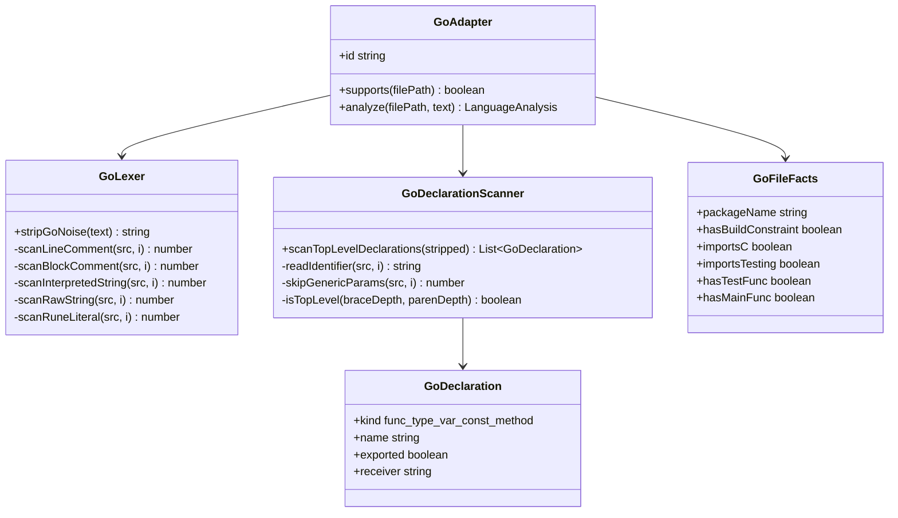
```mermaid
classDiagram
    class GoAdapter {
        +id string
        +supports(filePath) boolean
        +analyze(filePath, text) LanguageAnalysis
    }
    class GoLexer {
        +stripGoNoise(text) string
        -scanLineComment(src, i) number
        -scanBlockComment(src, i) number
        -scanInterpretedString(src, i) number
        -scanRawString(src, i) number
        -scanRuneLiteral(src, i) number
    }
    class GoDeclarationScanner {
        +scanTopLevelDeclarations(stripped) List~GoDeclaration~
        -readIdentifier(src, i) string
        -skipGenericParams(src, i) number
        -isTopLevel(braceDepth, parenDepth) boolean
    }
    class GoDeclaration {
        +kind func_type_var_const_method
        +name string
        +exported boolean
        +receiver string
    }
    class GoFileFacts {
        +packageName string
        +hasBuildConstraint boolean
        +importsC boolean
        +importsTesting boolean
        +hasTestFunc boolean
        +hasMainFunc boolean
    }
    GoAdapter --> GoLexer
    GoAdapter --> GoDeclarationScanner
    GoDeclarationScanner --> GoDeclaration
    GoAdapter --> GoFileFacts
```

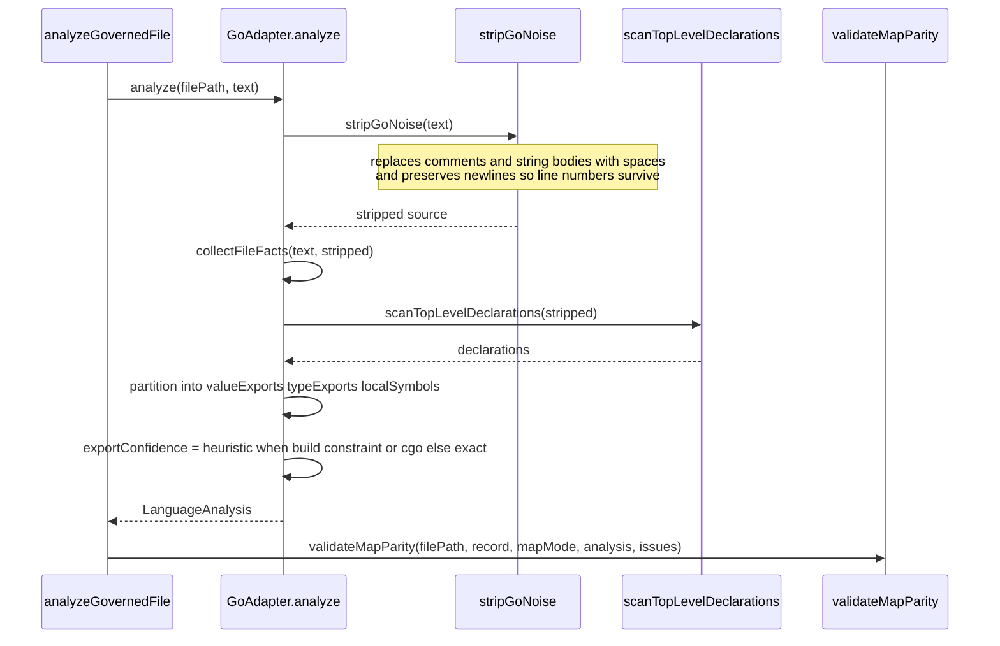
```mermaid
sequenceDiagram
    participant PU as analyzeGovernedFile
    participant A as GoAdapter.analyze
    participant L as stripGoNoise
    participant S as scanTopLevelDeclarations
    participant M as validateMapParity

    PU->>A: analyze(filePath, text)
    A->>L: stripGoNoise(text)
    Note over L: replaces comments and string bodies with spaces<br/>and preserves newlines so line numbers survive
    L-->>A: stripped source
    A->>A: collectFileFacts(text, stripped)
    A->>S: scanTopLevelDeclarations(stripped)
    S-->>A: declarations
    A->>A: partition into valueExports typeExports localSymbols
    A->>A: exportConfidence = heuristic when build constraint or cgo else exact
    A-->>PU: LanguageAnalysis
    PU->>M: validateMapParity(filePath, record, mapMode, analysis, issues)
```

## 2.5 Step 2.5.1 — The lexer (`src/lint/scanners/go-lexer.ts`)

**This is the step people get wrong.** A line-based regex over raw Go source will match declarations inside strings and comments and miss multi-line raw strings. Write the character scanner.

```
PSEUDOCODE

/**
 * Replaces comment bodies and string/rune literal contents with spaces,
 * preserving every newline so that byte offsets and line numbers are stable.
 * Structural characters ( ) { } [ ] and identifiers outside literals survive.
 */
export function stripGoNoise(source: string): string:
    out = array of source.length characters
    i = 0
    while i < source.length:
        ch = source[i]

        if ch == '/' and source[i+1] == '/':
            blank until newline or EOF          // line comment
        else if ch == '/' and source[i+1] == '*':
            blank until closing */ (NOT nested - Go block comments do not nest)
        else if ch == '"':
            keep the opening and closing quote, blank the body
            honor backslash escapes; a bare newline terminates (invalid Go, do not hang)
        else if ch == '`':
            raw string - blank the body INCLUDING newlines?  NO:
            blank each character but WRITE '\n' for newline characters,
            so line numbering downstream is preserved
        else if ch == '\'':
            rune literal - honor '\\' escapes; blank body
        else:
            copy ch
        advance appropriately
    return out.join("")
```

**Unit tests — `src/lint/scanners/go-lexer.test.ts`:**

| # | Input | Assertion |
|---|---|---|
| 1 | `// func Fake()` | output contains no `func` |
| 2 | `/* func Fake() */ func Real() {}` | contains `Real`, not `Fake` |
| 3 | `s := "func Fake()"` | contains no `func` |
| 4 | ``s := `func Fake()\nfunc Also()` `` | contains no `func`; newline count unchanged |
| 5 | `s := "a\\\"func Fake()\\\""` | escaped quote does not end the string early |
| 6 | `r := '\''` then `func Real()` | `Real` present |
| 7 | Any input | `output.split("\n").length === input.split("\n").length` |
| 8 | Any input | `output.length === input.length` |
| 9 | Unterminated `"` at EOF | returns without throwing or hanging |
| 10 | Unterminated `` ` `` at EOF | returns without throwing or hanging |

Assertions 7 and 8 are structural invariants — assert them over **every** other fixture in the file via a loop, not just once.

## 2.6 Step 2.5.2 — The declaration scanner

```
PSEUDOCODE

type GoDeclKind = "func" | "method" | "type" | "var" | "const"
type GoDeclaration = { kind: GoDeclKind; name: string; exported: boolean; receiver?: string }

export function scanTopLevelDeclarations(stripped: string): GoDeclaration[]:
    decls = []
    i = 0
    braceDepth = 0
    parenDepth = 0
    groupKind = null            // set while inside `var (`, `const (`, `type (`

    while i < stripped.length:
        ch = stripped[i]

        if ch == '{': braceDepth++; i++; continue
        if ch == '}': braceDepth--; i++; continue

        if braceDepth > 0:
            // inside a function or type body - only track parens shallowly and move on
            i++; continue

        if ch == '(':
            parenDepth++; i++; continue
        if ch == ')':
            parenDepth--
            if parenDepth == 0: groupKind = null
            i++; continue

        // ---- grouped declaration bodies: var ( A = 1 \n B = 2 ) ----
        if parenDepth > 0 and groupKind != null:
            if at start of a logical line and next token is an identifier:
                name = readIdentifier(stripped, i)
                if name and name != "_":
                    decls.push({kind: groupKind, name, exported: isUpper(name[0])})
                skip to end of this line
                continue
            i++; continue

        // ---- top-level keywords ----
        word = peekWord(stripped, i)

        if word == "package":
            skip line; continue

        if word == "import":
            skip the import spec, single or parenthesized; continue

        if word == "func":
            j = i + 4
            skip whitespace
            if stripped[j] == '(':
                // METHOD: func (r *Recv) Name[T any](...)
                receiver = read up to matching ')'
                skip whitespace
                name = readIdentifier
                skipGenericParams
                decls.push({kind:"method", name, exported:isUpper(name[0]), receiver})
            else:
                name = readIdentifier(stripped, j)
                skipGenericParams
                decls.push({kind:"func", name, exported:isUpper(name[0])})
            skip to matching close of the signature; continue

        if word in ("type", "var", "const"):
            j = i + word.length; skip whitespace
            if stripped[j] == '(':
                groupKind = word; parenDepth++; j++
                i = j; continue
            // single form: `type Name struct{...}` / `var Name = x` / `const Name = x`
            // ALSO handle the multi-name form: `var A, B = 1, 2`
            for each comma-separated identifier before '=' or a type token:
                name = readIdentifier
                if name != "_":
                    decls.push({kind: word, name, exported: isUpper(name[0])})
            skip to end of the declaration; continue

        i++
    return decls


skipGenericParams(src, i) -> number:
    // `func Map[K comparable, V any](...)` - the name is read BEFORE this.
    // Skip a balanced [...] if one immediately follows the identifier.
    if src[i] != '[': return i
    depth = 0
    while i < len: track '[' and ']'; return index after balance reaches 0


readIdentifier(src, i) -> string:
    Go identifiers: unicode letter or '_' first, then letters/digits/'_'.
    Use /\p{L}/u and /\p{Nd}/u - Go allows unicode identifiers.
```

## 2.7 Step 2.5.3 — File facts and the adapter

```
PSEUDOCODE

type GoFileFacts = {
    packageName: string
    hasBuildConstraint: boolean
    importsC: boolean
    importsTesting: boolean
    hasTestFunc: boolean
    hasMainFunc: boolean
}

collectFileFacts(rawText, stripped, decls) -> GoFileFacts:
    // build constraints must be read from the RAW text: they live in comments
    hasBuildConstraint = /^\s*\/\/go:build /m.test(rawText) || /^\s*\/\/ \+build /m.test(rawText)
    packageName        = match /^\s*package\s+(\w+)/m on stripped
    importsC           = raw text contains an import spec for "C"
    importsTesting     = raw text contains an import spec for "testing"
    hasTestFunc        = decls.some(d => d.kind=="func" && /^(Test|Benchmark|Fuzz|Example)/.test(d.name))
    hasMainFunc        = packageName=="main" && decls.some(d => d.kind=="func" && d.name=="main")


export function createGoAdapter(): LanguageAdapter:
    return {
        id: "go",
        supports: filePath => path.extname(filePath) === ".go",
        analyze: (filePath, text) => {
            stripped = stripGoNoise(text)
            decls    = scanTopLevelDeclarations(stripped)
            facts    = collectFileFacts(text, stripped, decls)

            valueExports = new Set()
            typeExports  = new Set()
            localSymbols = new Set()

            for d of decls:
                // METHODS are never package-level exports. They belong to their
                // receiver type. Record them as locals so MAP_MODE: LOCALS can see
                // them, but never as `exports` - Go's export unit is the package
                // identifier, and a MODULE_MAP listing methods would then be
                // required to list every method of every type.
                if d.kind == "method":
                    localSymbols.add(d.name)
                    continue

                if d.exported:
                    if d.kind == "type": typeExports.add(d.name)
                    else:                valueExports.add(d.name)
                localSymbols.add(d.name)     // exported or not, it is declared here

            exports = union(valueExports, typeExports)

            return {
                adapterId: "go",
                exports, valueExports, typeExports, localSymbols,
                // Exact unless build tags or cgo could change the declaration set
                // for a different build configuration than the one we scanned.
                exportConfidence: (facts.hasBuildConstraint || facts.importsC) ? "heuristic" : "exact",
                hasDefaultExport: false,          // Go has no default export
                hasWildcardReExport: false,       // Go has no re-export
                hasMainEntrypoint: facts.hasMainFunc,
                directReExportCount: 0,
                localExportCount: exports.size,   // in Go every export is locally declared
                localImplementationCount: decls.filter(d => d.kind != "method").length,
                usesTestFramework: facts.importsTesting || facts.hasTestFunc,
            }
        },
    }
```

**Do not throw from `analyze`.** Unparseable Go must degrade to `exportConfidence: "heuristic"` with whatever declarations were recovered. The existing `analysis.adapter-failed` path exists for genuine crashes, and a scanner that throws on unusual-but-valid Go would reintroduce a wall.

## 2.8 Step 2.5.4 — Register

`src/language-registry.ts`:
```
PSEUDOCODE
+ import { createGoAdapter } from "./lint/adapters/go"

  ADAPTER_BACKED_EXTENSIONS = new Set([..., ".dart", ".go"])

  LANGUAGE_ADAPTERS = [createTypeScriptAdapter(), createPythonAdapter(), createDartAdapter(), createGoAdapter()]
```

→ verify: `bun run grace lint --path <polyglot fixture>` no longer reports `analysis.no-adapter` for `.go`, and a fabricated Go `MODULE_MAP` symbol now produces `markup.module-map-mismatch`.

## 2.9 Unit tests — `src/lint/adapters/go.test.ts`

Each row is a separate `it()`. Build the source inline; do not require a Go toolchain.

| # | Go source | Expected |
|---|---|---|
| 1 | `package p` + `func Exported() {}` + `func unexported() {}` | `exports={Exported}`, `localSymbols` has both |
| 2 | `type Config struct{}` + `type internal struct{}` | `typeExports={Config}` |
| 3 | `type Reader interface{ Read() }` | `typeExports={Reader}` |
| 4 | `type Alias = Config` | `typeExports` contains `Alias` |
| 5 | `var Version = "1"` / `var debug = false` | `valueExports={Version}` |
| 6 | `const MaxSize = 10` | `valueExports={MaxSize}` |
| 7 | grouped: `const (\n A = iota\n b\n C\n)` | `valueExports={A,C}`; `b` local only |
| 8 | grouped: `var (\n X = 1\n y = 2\n)` | `valueExports={X}` |
| 9 | grouped: `type (\n Foo struct{}\n bar struct{}\n)` | `typeExports={Foo}` |
| 10 | `func (s *Server) Serve() {}` | `exports` does **not** contain `Serve`; `localSymbols` does |
| 11 | `func Map[K comparable, V any](m map[K]V) []K` | `exports={Map}` — generics do not break the name read |
| 12 | `type Set[T comparable] struct{}` | `typeExports={Set}` |
| 13 | `func Exported() { const Fake = 1 }` | `exports={Exported}` only; body decls invisible |
| 14 | `// func Fake()` in a comment | `exports` empty |
| 15 | ``s := `func Fake()` `` inside a func | `exports` empty |
| 16 | `package main` + `func main() {}` | `hasMainEntrypoint === true` |
| 17 | `package p` + `func main() {}` | `hasMainEntrypoint === false` |
| 18 | `import "testing"` + `func TestX(t *testing.T)` | `usesTestFramework === true` |
| 19 | `func BenchmarkX(b *testing.B)` | `usesTestFramework === true` |
| 20 | `//go:build linux` header | `exportConfidence === "heuristic"` |
| 21 | `// +build linux` header | `exportConfidence === "heuristic"` |
| 22 | `import "C"` | `exportConfidence === "heuristic"` |
| 23 | ordinary file | `exportConfidence === "exact"` |
| 24 | `var _ = something` | `_` never appears in any set |
| 25 | `var A, B = 1, 2` | `valueExports={A,B}` |
| 26 | truncated/invalid Go (`func Broken(`) | does not throw; confidence `heuristic` |
| 27 | `func Ünicode()` | `exports={Ünicode}` — unicode identifiers |
| 28 | `func init() {}` | `exports` empty; `localSymbols` has `init` |

## 2.10 Integration tests — `src/grace-lint.test.ts`

| Case | Expected |
|---|---|
| polyglot fixture, Go `MODULE_MAP` matches real exports | no `markup.module-map-mismatch` for the `.go` file |
| **G-01 regression:** Go `MODULE_MAP` replaced with `TotallyFakeSymbol` | `markup.module-map-mismatch` **error** on the `.go` file — write this test first and watch it fail against Phase-1 code |
| Go file with `MAP_MODE: EXPORTS` | no `analysis.no-adapter` |
| Go file with `//go:build` tag | `analysis.heuristic-confidence` **warning** present |
| `--format json` | `analysisCoverage.adapterBacked` includes `.go` with `adapterId: "go"` |

## 2.11 Language reference doc

Create `skills/grace/grace-explainer/references/languages/go.md` (+ mirror). Must cover:

- Comment markup placement relative to godoc: put GRACE markers **above** the package clause or above the godoc block, never between godoc and its declaration (it would break `go doc`).
- **The package convention** (this is the §5.2 resolution — state it explicitly): a Go package spans many files, and export parity is computed **per file**. Put the package-wide `MODULE_MAP` in `doc.go` with `MAP_MODE: SUMMARY`; use `ROLE: RUNTIME` + `MAP_MODE: EXPORTS` only on files whose own exports are the module's whole surface. Every file of the package declares the same `LINKS: M-*`.
- Methods are not package-level exports; do not list them in an `EXPORTS` map.
- Table-driven tests as `TraceAssertion` material.
- Build-tag files report `heuristic` confidence by design.
- Interface satisfaction is implicit in Go, so document it in `MODULE_CONTRACT` prose and pin it with `var _ Iface = (*Impl)(nil)`.

## 2.12 Definition of done

```
bun run typecheck            → pass
bun test                     → all pass
bun run validate:cli         → pass
bun run validate:marketplace → pass
```
Plus: a fabricated Go `MODULE_MAP` symbol produces an error where it produced silence at 4.0.4. Show that output.

## 2.13 Review gate

- [ ] Lexer is a character scanner, not a line regex; invariants 7 & 8 asserted across all lexer fixtures
- [ ] All 28 adapter cases pass
- [ ] `analyze` never throws on malformed input
- [ ] No Go toolchain required by any test or code path
- [ ] Methods excluded from `exports` and the reason documented in `go.md`
- [ ] Build-tag / cgo files marked `heuristic`, not silently `exact`
- [ ] G-01 regression test shown failing pre-fix and passing post-fix
- [ ] README + `semantic-markup.md` matrix updated; `plugins/` mirrored

## 2.14 Rollback

Remove `.go` from `ADAPTER_BACKED_EXTENSIONS` and `createGoAdapter()` from `LANGUAGE_ADAPTERS`. Behavior reverts to Phase 1 (`analysis.no-adapter` warnings) with no data loss.

---

# PHASE 3 — Rust export adapter

**Status:** `NOT STARTED`
**Gaps:** G-04
**Release:** 4.1.0

## 3.1 Objective

Same contract as Phase 2, for `.rs`. Rust is harder in exactly three places: **nested block comments**, **lifetimes vs. char literals**, and **macro-generated items**. Handle the first two correctly; be honest about the third.

## 3.2 Preconditions

→ verify: Phase 2 `COMPLETE`. Reuse the Phase 2 structure — `src/lint/scanners/rust-lexer.ts` mirrors `go-lexer.ts`.

## 3.3 Files touched

Same shape as Phase 2: `src/lint/adapters/rust.ts` (+test), `src/lint/scanners/rust-lexer.ts` (+test), `src/language-registry.ts`, integration tests, matrix docs, `skills/grace/grace-explainer/references/languages/rust.md` (+ mirror).

## 3.4 Design

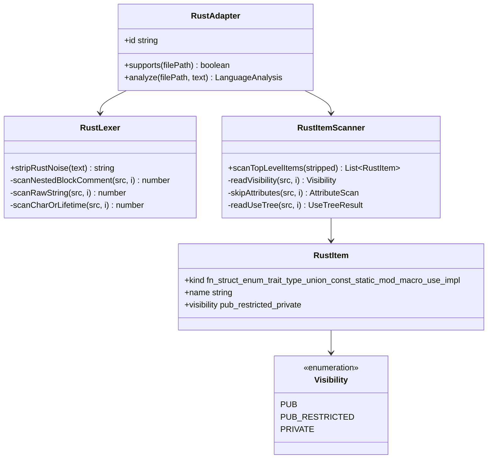
```mermaid
classDiagram
    class RustAdapter {
        +id string
        +supports(filePath) boolean
        +analyze(filePath, text) LanguageAnalysis
    }
    class RustLexer {
        +stripRustNoise(text) string
        -scanNestedBlockComment(src, i) number
        -scanRawString(src, i) number
        -scanCharOrLifetime(src, i) number
    }
    class RustItemScanner {
        +scanTopLevelItems(stripped) List~RustItem~
        -readVisibility(src, i) Visibility
        -skipAttributes(src, i) AttributeScan
        -readUseTree(src, i) UseTreeResult
    }
    class RustItem {
        +kind fn_struct_enum_trait_type_union_const_static_mod_macro_use_impl
        +name string
        +visibility pub_restricted_private
    }
    class Visibility {
        <<enumeration>>
        PUB
        PUB_RESTRICTED
        PRIVATE
    }
    RustAdapter --> RustLexer
    RustAdapter --> RustItemScanner
    RustItemScanner --> RustItem
    RustItem --> Visibility
```

## 3.5 Step 3.5.1 — `src/lint/scanners/rust-lexer.ts`

```
PSEUDOCODE

export function stripRustNoise(source: string): string:
    // Same invariants as Go: same length, same newline positions.
    i = 0
    while i < len:
        ch = source[i]

        if ch=='/' and next=='/':
            blank to newline                        // covers // /// //!
        else if ch=='/' and next=='*':
            // RUST BLOCK COMMENTS NEST. Go's do not. This is the #1 Rust lexer bug.
            depth = 1; advance past "/*"
            while depth > 0 and i < len:
                if "/*" at i: depth++; i += 2
                else if "*/" at i: depth--; i += 2
                else: blank(i) preserving newline; i++
        else if ch=='r' and (next=='"' or next=='#'):
            // raw string: r"..."  r#"..."#  r##"..."##
            count consecutive '#' after 'r' -> n
            expect '"'; blank until the sequence '"' followed by n '#'
        else if ch=='b' and next=='"':
            byte string - same as normal string
        else if ch=='"':
            normal string with backslash escapes
        else if ch=='\'':
            // LIFETIME vs CHAR LITERAL. `&'a str` is a lifetime; `'x'` is a char.
            // Rule: if the character after the identifier that follows ' is NOT a
            // closing quote, it is a lifetime -> copy through verbatim.
            // Handle '\'' and '\\' and '\u{1F600}' as char literals.
            if looksLikeLifetime(source, i): copy the tick; i++
            else: blank the char-literal body
        else:
            copy ch
    return result
```

**Unit tests — `src/lint/scanners/rust-lexer.test.ts`:**

| # | Input | Assertion |
|---|---|---|
| 1 | `/* /* pub fn Fake */ */ pub fn Real() {}` | `Real` present, `Fake` absent — nested comments |
| 2 | `/// pub fn Fake` | absent |
| 3 | `//! pub fn Fake` | absent |
| 4 | `let s = r#"pub fn Fake"#;` | absent |
| 5 | `let s = r##"pub fn "# Fake"##;` | absent; the inner `"#` does not terminate |
| 6 | `fn f<'a>(x: &'a str) {}` then `pub fn Real()` | `Real` present, no hang |
| 7 | `let c = '\'';` then `pub fn Real()` | `Real` present |
| 8 | `let c = '\u{1F600}';` then `pub fn Real()` | `Real` present |
| 9 | `struct S<'a, T: 'a> { x: &'a T }` then `pub fn Real()` | `Real` present |
| 10 | any | length preserved |
| 11 | any | newline count and positions preserved |
| 12 | unterminated `r#"` at EOF | returns without hanging |

Loop assertions 10 and 11 over every fixture in the file.

## 3.6 Step 3.5.2 — Item scanner

```
PSEUDOCODE

type Visibility = "pub" | "pub-restricted" | "private"
type RustItem = { kind: string; name: string; visibility: Visibility }

export function scanTopLevelItems(stripped: string): { items: RustItem[]; flags: ScanFlags }:
    items = []
    flags = { hasWildcardReExport:false, directReExportCount:0, macroGenerated:false,
              hasCfgGatedItem:false, hasInclude:false, usesTestFramework:false, hasMainFn:false }
    i = 0, braceDepth = 0

    while i < len:
        skipWhitespace

        // ---- attributes at item position ----
        if src[i]=='#' and (src[i+1]=='[' or (src[i+1]=='!' and src[i+2]=='[')):
            attr = readBalancedBrackets(i)
            if attr contains "cfg(feature"     : flags.hasCfgGatedItem = true
            if attr contains "cfg(test"        : flags.usesTestFramework = true
            if attr == "#[test]" or "#[tokio::test]" or contains "::test]" : flags.usesTestFramework = true
            if attr contains "macro_export"    : pendingMacroExport = true
            i = end of attr; continue

        if src[i]=='{': braceDepth++; i++; continue
        if src[i]=='}': braceDepth--; i++; continue

        if braceDepth > 0:
            // Inside an item body. We still want:
            //   - `impl Foo { pub fn bar }`  -> bar as a LOCAL symbol
            //   - trait method signatures    -> LOCAL symbols
            // Track the enclosing item kind on a small stack; when it is impl or
            // trait and we see `fn NAME`, record NAME as a local.
            handle as described; i++; continue

        vis = readVisibility(src, i)      // "pub", "pub(crate)"/"pub(super)"/"pub(in ...)", or none
        i = vis.end

        word = peekWord(src, i)

        switch word:
          case "use":
              tree = readUseTree(src, i)        // handles `a::b::{C, D as E, *}` and nested groups
              if vis.kind == "pub":
                  if tree.hasWildcard:
                      flags.hasWildcardReExport = true
                  for name of tree.boundNames:  // alias if present, else last path segment
                      items.push({kind:"use", name, visibility:"pub"})
                  flags.directReExportCount += 1
              i = tree.end; continue

          case "fn": / "async" then "fn" / "const" then "fn" / "unsafe" then "fn" / "extern" "\"C\"" "fn":
              name = readIdentifier after the fn keyword
              skipGenerics(<...>)
              items.push({kind:"fn", name, visibility: vis.kind})
              if name == "main" and vis.kind != "pub": flags.hasMainFn = true
              skip to body or ';'; continue

          case "struct" | "enum" | "trait" | "union" | "type":
              name = readIdentifier; skipGenerics
              items.push({kind: word, name, visibility: vis.kind}); continue

          case "const" | "static":
              // note: `const fn` was handled above
              optionally skip "mut"
              name = readIdentifier
              items.push({kind: word, name, visibility: vis.kind}); continue

          case "mod":
              name = readIdentifier
              items.push({kind:"mod", name, visibility: vis.kind})
              // `mod tests` with a cfg(test) attribute already set usesTestFramework
              continue

          case "macro_rules":
              name = readIdentifier after '!'
              items.push({kind:"macro", name, visibility: pendingMacroExport ? "pub" : "private"})
              pendingMacroExport = false
              flags.macroGenerated = true       // macro definitions may generate items elsewhere
              continue

          case "impl":
              // enter the body; the braceDepth branch records `pub fn` inside as locals
              continue

          default:
              // Top-level macro INVOCATION: `some_macro! { ... }` / `include!("x.rs")`
              if identifier followed by '!' followed by ( [ or { :
                  if identifier == "include": flags.hasInclude = true
                  else: flags.macroGenerated = true
              i++; continue

    return { items, flags }
```

## 3.7 Step 3.5.3 — The adapter

```
PSEUDOCODE

export function createRustAdapter(): LanguageAdapter:
    return {
        id: "rust",
        supports: p => path.extname(p) === ".rs",
        analyze: (filePath, text) => {
            stripped = stripRustNoise(text)
            { items, flags } = scanTopLevelItems(stripped)

            valueExports = new Set(); typeExports = new Set(); localSymbols = new Set()

            for it of items:
                localSymbols.add(it.name)

                // pub(crate) / pub(super) / pub(in path) are NOT crate-external exports.
                // The crate is the module boundary - see unified-review 5.2.
                if it.visibility != "pub": continue

                switch it.kind:
                    "fn" | "const" | "static" | "macro" -> valueExports.add(it.name)
                    "struct"|"enum"|"trait"|"type"|"union"|"mod" -> typeExports.add(it.name)
                    "use" -> valueExports.add(it.name)   // re-export: kind unknown without resolution

            exports = union(valueExports, typeExports)

            // Honesty rule: claim `exact` only when nothing in the file could have
            // produced items we cannot see.
            confidence = (flags.macroGenerated || flags.hasInclude || flags.hasCfgGatedItem)
                         ? "heuristic" : "exact"

            return {
                adapterId: "rust",
                exports, valueExports, typeExports, localSymbols,
                exportConfidence: confidence,
                hasDefaultExport: false,
                hasWildcardReExport: flags.hasWildcardReExport,
                hasMainEntrypoint: flags.hasMainFn,
                directReExportCount: flags.directReExportCount,
                localExportCount: count of exports whose item kind != "use",
                localImplementationCount: items.filter(i => i.kind != "use").length,
                usesTestFramework: flags.usesTestFramework,
            }
        },
    }
```

## 3.8 Unit tests — `src/lint/adapters/rust.test.ts`

| # | Rust source | Expected |
|---|---|---|
| 1 | `pub fn post() {}` / `fn helper() {}` | `exports={post}`; `localSymbols` has both |
| 2 | `pub struct Ledger;` | `typeExports={Ledger}` |
| 3 | `pub enum Error { A, B }` | `typeExports={Error}`; variants not exported |
| 4 | `pub trait Store { fn get(&self); }` | `typeExports={Store}`; `get` in `localSymbols` |
| 5 | `pub type Result<T> = std::result::Result<T, Error>;` | `typeExports={Result}` |
| 6 | `pub const MAX: u32 = 10;` | `valueExports={MAX}` |
| 7 | `pub static NAME: &str = "x";` | `valueExports={NAME}` |
| 8 | `pub(crate) fn internal() {}` | **not** in `exports`; in `localSymbols` |
| 9 | `pub(super) fn s() {}` / `pub(in crate::a) fn t() {}` | neither in `exports` |
| 10 | `pub use crate::a::Foo;` | `exports` has `Foo`; `directReExportCount === 1` |
| 11 | `pub use crate::a::{Foo, Bar as Baz};` | `exports` has `Foo` and `Baz`, not `Bar` |
| 12 | `pub use crate::a::*;` | `hasWildcardReExport === true` |
| 13 | `use crate::a::Foo;` (no `pub`) | `Foo` not in `exports`; `directReExportCount === 0` |
| 14 | `pub mod api;` | `typeExports` has `api` |
| 15 | `#[macro_export] macro_rules! m { () => {} }` | `exports` has `m`; confidence `heuristic` |
| 16 | `macro_rules! m { () => {} }` (no export attr) | `m` not exported |
| 17 | `pub async fn a() {}` | `exports={a}` |
| 18 | `pub const fn c() -> u8 { 0 }` | `exports={c}` |
| 19 | `pub unsafe fn u() {}` | `exports={u}` |
| 20 | `pub extern "C" fn e() {}` | `exports={e}` |
| 21 | `impl Ledger { pub fn post(&self) {} }` | `post` in `localSymbols`, **not** `exports` |
| 22 | `pub fn f<T: Into<String>>(x: T) {}` | `exports={f}`; generics with nested `<>` do not break |
| 23 | `#[cfg(test)] mod tests { #[test] fn t() {} }` | `usesTestFramework === true` |
| 24 | `fn main() {}` | `hasMainEntrypoint === true` |
| 25 | `#[cfg(feature = "x")] pub fn f() {}` | confidence `heuristic` |
| 26 | `include!("generated.rs");` | confidence `heuristic` |
| 27 | plain file, none of the above | confidence `exact` |
| 28 | `/* /* pub fn fake */ */ pub fn real() {}` | `exports={real}` |
| 29 | `let s = r#"pub fn fake"#;` inside a fn | `fake` absent |
| 30 | `fn f<'a>(x: &'a str) {}` + `pub fn real()` | `exports={real}`; no hang |
| 31 | truncated file (`pub fn broken(`) | does not throw; confidence `heuristic` |
| 32 | `pub union U { a: u32 }` | `typeExports={U}` |

## 3.9 Integration tests — `src/grace-lint.test.ts`

| Case | Expected |
|---|---|
| polyglot fixture, Rust map matches | no `markup.module-map-mismatch` |
| **G-01 regression:** Rust map = `TotallyFakeSymbol` | `markup.module-map-mismatch` error |
| Rust file with `MAP_MODE: EXPORTS` | no `analysis.no-adapter` |
| Rust file containing `include!` | `analysis.heuristic-confidence` warning |
| `pub(crate)` symbol listed in an `EXPORTS` map | mismatch error (it is not an export) |
| `--format json` | `analysisCoverage.adapterBacked` includes `.rs` |

## 3.10 Language reference — `references/languages/rust.md`

Must cover: crate visibility semantics and why `pub(crate)` is not an export; where the `MODULE_MAP` lives (`lib.rs` for the crate surface, `mod.rs`/module file for submodules); `MAP_MODE: SUMMARY` for `lib.rs` re-export barrels; feature-gated and macro-generated items reporting `heuristic` by design and what to do about it; `TraceAssertion` over `Marker` for pure crates; tracing/`log` marker emission now being recognized (Phase 1); `unsafe` blocks belonging in `MODULE_CONTRACT` prose with a named `BLOCK_*`.

## 3.11 Definition of done / review gate / rollback

Same shape as Phase 2. Additional gate items:

- [ ] Nested block comments handled (test 1 in both lexer and adapter suites)
- [ ] Lifetime-vs-char disambiguation handled and tested (lexer 6–9, adapter 30)
- [ ] `pub(crate)` / `pub(super)` / `pub(in …)` excluded from `exports`, with the reasoning documented in `rust.md`
- [ ] Macro/`include!`/`cfg(feature)` files downgrade to `heuristic` rather than claiming exactness

Rollback: remove `.rs` from `ADAPTER_BACKED_EXTENSIONS` and the factory from `LANGUAGE_ADAPTERS`.

---

# PHASE 4 — Polyglot health restoration

**Status:** `NOT STARTED`
**Gaps:** G-12 (test-file inference), G-10 (`DEPENDS` unvalidated), G-11 (`LINKS` phantom anchors)
**Release:** 4.1.0

## 4.1 Objective

Make the *health* layer as honest as the *lint* layer now is: infer test targets from `cargo`/`go` commands, and validate that file-header `DEPENDS:` and `LINKS:` reference anchors that actually exist.

## 4.2 Preconditions

→ verify: Phases 2 and 3 `COMPLETE`.

## 4.3 Part A — Language-aware test-file inference (G-12)

### Design

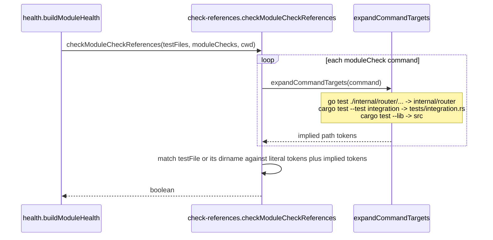
```mermaid
sequenceDiagram
    participant H as health.buildModuleHealth
    participant CR as check-references.checkModuleCheckReferences
    participant EX as expandCommandTargets

    H->>CR: checkModuleCheckReferences(testFiles, moduleChecks, cwd)
    loop each moduleCheck command
        CR->>EX: expandCommandTargets(command)
        Note over EX: go test ./internal/router/... -> internal/router<br/>cargo test --test integration -> tests/integration.rs<br/>cargo test --lib -> src
        EX-->>CR: implied path tokens
    end
    CR->>CR: match testFile or its dirname against literal tokens plus implied tokens
    CR-->>H: boolean
```

### Steps

**Step 4.3.1 — Add `expandCommandTargets` to `src/verification/check-references.ts`.**

```
PSEUDOCODE

/**
 * Returns extra path tokens implied by a language-native test command.
 * Purely additive: literal path tokens already present in the command are
 * still matched by the existing logic. This never removes a match.
 */
export function expandCommandTargets(command: string): string[]:
    out = []
    tokens = command.split(/\s+/)

    // ---- Go ----
    if tokens includes "go" and tokens includes "test":
        for t of tokens where t starts with "./" or t == "..." :
            p = t.replace(/^\.\//, "").replace(/\/?\.\.\.$/, "")
            out.push(p === "" ? "." : p)
        // `go test` with no package argument means the current directory
        if no such token: out.push(".")

    // ---- Rust: cargo test / cargo nextest run ----
    if tokens includes "cargo" and (tokens includes "test" or tokens includes "nextest"):
        if "--test" present:  out.push("tests/" + valueAfter("--test") + ".rs"); out.push("tests")
        if "--bench" present: out.push("benches/" + valueAfter("--bench") + ".rs"); out.push("benches")
        if "--lib" present:   out.push("src")
        if "--bin" present:   out.push("src/bin/" + valueAfter("--bin") + ".rs"); out.push("src")
        if none of the above: out.push("src"); out.push("tests")   // `cargo test` runs everything

    return dedupe(out)
```

**Step 4.3.2 — Use it inside `checkModuleCheckReferences`.**

```
PSEUDOCODE
// inside the `moduleChecks.some(check => ...)` callback, AFTER the existing
// full-path and directory-token checks fail:

const implied = expandCommandTargets(check)
if (implied.some(target =>
        normalized === target ||
        normalized.startsWith(target + "/") ||
        dir === target ||
        dir.startsWith(target + "/") ||
        target === ".")) {
    return true
}
```

**Step 4.3.3 — Same treatment in `src/query/health.ts`.**
The `health.verification-command-does-not-reference-test-file` warning has its own inline `check.includes(testFile) || check.includes(dir)` test. Extend it with `expandCommandTargets` so the two paths cannot disagree. Extract a small shared predicate rather than duplicating the logic.

### Tests

*Unit* — `src/verification/check-references.test.ts`:

| # | testFiles | command | cwd | Expected |
|---|---|---|---|---|
| 1 | `services/gateway/internal/router/router_test.go` | `go test ./internal/router/...` | `services/gateway` | `true` |
| 2 | `services/gateway/internal/router/router_test.go` | `go test ./internal/other/...` | `services/gateway` | `false` |
| 3 | `services/gateway/main_test.go` | `go test ./...` | `services/gateway` | `true` |
| 4 | `services/gateway/main_test.go` | `go test` | `services/gateway` | `true` |
| 5 | `services/ledger/tests/transfer.rs` | `cargo test --test transfer` | `services/ledger` | `true` |
| 6 | `services/ledger/tests/transfer.rs` | `cargo test --test other` | `services/ledger` | `false` |
| 7 | `services/ledger/src/lib.rs` | `cargo test --lib` | `services/ledger` | `true` |
| 8 | `services/ledger/src/lib.rs` | `cargo test` | `services/ledger` | `true` |
| 9 | `services/ledger/benches/b.rs` | `cargo bench --bench b` | `services/ledger` | `true` |
| 10 | `services/ledger/src/lib.rs` | `cargo nextest run --lib` | `services/ledger` | `true` |
| 11 | `src/mod5.test.ts` | `bun test src/mod5.test.ts` | — | `true` (**no regression**) |
| 12 | `src/mod5.test.ts` | `bun test src/` | — | `true` (**no regression**) |
| 13 | `packages/auth/src/a.test.ts` | `bun test src/a.test.ts` | `packages/auth` | `true` (**no regression**) |
| 14 | `[]` (none) | anything | — | `true` (**no regression**) |

Rows 11–14 are the existing behavior. If any of them changes, you broke something.

*Integration* — `src/grace-query.test.ts`: polyglot fixture with `<TestFiles>` declared for the Rust and Go modules; assert `health.verification-test-file-missing-on-disk` fires when the file is absent and clears when present, and that `health.verification-command-does-not-reference-test-file` does **not** fire for `cargo test --lib` / `go test ./internal/router/...`.

## 4.4 Part B — `DEPENDS` and `LINKS` referential validation (G-10, G-11)

### Design

These checks need the graph projection, which `analyzeGovernedFile` does not have. They therefore belong in `src/lint/core.ts`, **after** projections are built.

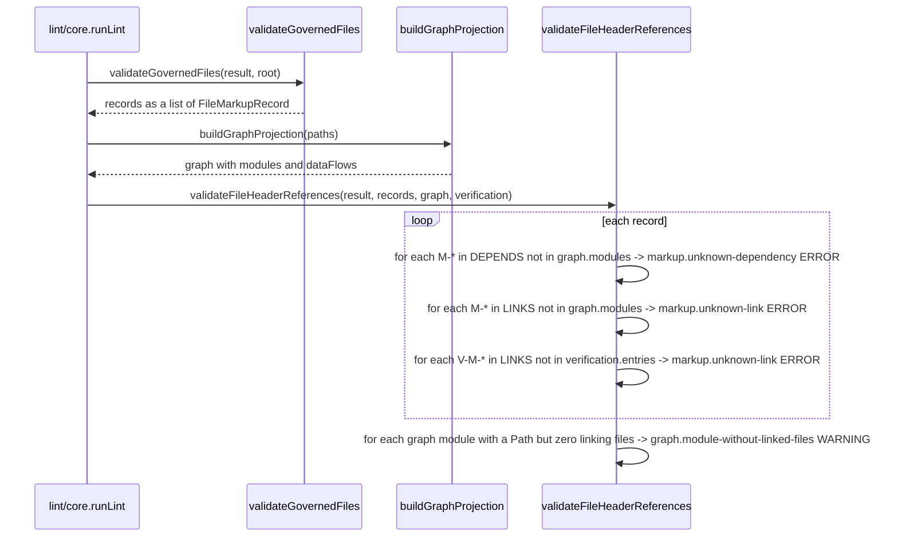
```mermaid
sequenceDiagram
    participant C as lint/core.runLint
    participant VG as validateGovernedFiles
    participant P as buildGraphProjection
    participant V as validateFileHeaderReferences

    C->>VG: validateGovernedFiles(result, root)
    VG-->>C: records as a list of FileMarkupRecord
    C->>P: buildGraphProjection(paths)
    P-->>C: graph with modules and dataFlows
    C->>V: validateFileHeaderReferences(result, records, graph, verification)
    loop each record
        V->>V: for each M-* in DEPENDS not in graph.modules -> markup.unknown-dependency ERROR
        V->>V: for each M-* in LINKS not in graph.modules -> markup.unknown-link ERROR
        V->>V: for each V-M-* in LINKS not in verification.entries -> markup.unknown-link ERROR
    end
    V->>V: for each graph module with a Path but zero linking files -> graph.module-without-linked-files WARNING
```

### Steps

**Step 4.4.1 — Return records from `validateGovernedFiles`.**
Change its return type from `void` to `FileMarkupRecord[]` (already produced by `analyzeGovernedFile(...).record`), and capture the result at the call site. Surgical: one return statement, one array push, one call-site assignment.

→ verify: `bun run typecheck` passes; no other behavior changed.

**Step 4.4.2 — Parse `DEPENDS` into anchors.**
`parseGovernedFile` already computes `linkedModuleIds` from `LINKS`. Add the symmetric fields — keep them separate so consumers are explicit:

```
PSEUDOCODE
// in FileMarkupRecord:
+ dependsModuleIds: string[]       // M-* tokens from DEPENDS
+ linkedVerificationIds: string[]  // V-M-* tokens from LINKS

// in parseGovernedFile:
+ dependsModuleIds: splitList(moduleContract?.fields.DEPENDS)
+                       .filter(t => ANCHOR_PATTERNS.module.test(t))
+ linkedVerificationIds: splitList(moduleContract?.fields.LINKS)
+                       .filter(t => ANCHOR_PATTERNS.verification.test(t))
```

**Important:** the existing `linkedModuleIds` filter uses `/^M-[A-Z0-9]+(?:-[A-Z0-9]+)*$/`, which `V-M-AUTH` does **not** match (it starts with `V`). Confirm this by reading the code — if `V-M-*` currently leaks into `linkedModuleIds`, fix that first and note it, because it would make every module-link check wrong.

**Step 4.4.3 — New validator in `src/lint/core.ts`.**

```
PSEUDOCODE

function validateFileHeaderReferences(result, records, graph, verification):
    knownModules = new Set(graph.modules.keys())
    knownFlows   = new Set(graph.dataFlows.keys())
    knownVerif   = new Set(verification.entries.keys())

    linkedModuleCount = new Map<string, number>()

    for record of records:
        for dep of record.dependsModuleIds:
            if !knownModules.has(dep):
                addIssue(result, {
                    severity: "error", code: "markup.unknown-dependency",
                    file: record.path, line: record.moduleContract?.startLine,
                    message: `MODULE_CONTRACT DEPENDS references ${dep}, which does not exist in the graph.`,
                })

        for link of record.linkedModuleIds:
            if knownModules.has(link) or knownFlows.has(link):
                linkedModuleCount.increment(link)
            else:
                addIssue(result, { severity:"error", code:"markup.unknown-link", ... })

        for vid of record.linkedVerificationIds:
            if !knownVerif.has(vid):
                addIssue(result, { severity:"error", code:"markup.unknown-link", ... })

    for [moduleId, moduleRecord] of graph.modules:
        if moduleRecord has a non-empty Path and (linkedModuleCount.get(moduleId) ?? 0) === 0:
            addIssue(result, {
                severity: "warning", code: "graph.module-without-linked-files",
                file: moduleRecord.file,
                message: `${moduleId} declares a Path but no governed file declares LINKS: ${moduleId}.`,
            })
```

**Severity rationale, and stick to it:** unknown `DEPENDS`/`LINKS` are **errors** — a phantom anchor is a factual falsehood in the contract, and the graph is the authority. A module with no linking file is a **warning** — legitimate during the window between planning a module and implementing it.

**Step 4.4.4 — Catalog entries** for `markup.unknown-dependency`, `markup.unknown-link`, `graph.module-without-linked-files`.

**Step 4.4.5 — Guard against a breaking rollout.**
These are new **errors** on projects that were previously green. Before finishing this phase:

→ verify: run `bun run grace lint --path .` against `examples/` and against every fixture in the test suite. Report every new error. If a legitimate pattern is being flagged (e.g. `DEPENDS` naming an external library rather than an `M-*`), the filter is wrong — only tokens **matching the `M-*` anchor pattern** are checked, and free-text dependency names must pass through untouched. Add a unit test for exactly that: `DEPENDS: postgres, M-DB` validates `M-DB` and ignores `postgres`.

### Tests

*Unit* — `src/project-utils.test.ts`:

| Case | Expected |
|---|---|
| `DEPENDS: M-DB, postgres, M-CACHE` | `dependsModuleIds === ["M-DB","M-CACHE"]` |
| `LINKS: M-AUTH V-M-AUTH DF-LOGIN` | `linkedModuleIds` has `M-AUTH` and `DF-LOGIN`; `linkedVerificationIds` has `V-M-AUTH` |
| `LINKS: V-M-AUTH` only | `linkedModuleIds` empty (does **not** capture `V-M-AUTH`) |
| `DEPENDS: none` | both arrays empty; no crash |

*Integration* — `src/grace-lint.test.ts`:

| Case | Expected |
|---|---|
| **G-10 regression:** governed file with `DEPENDS: M-DOES-NOT-EXIST, M-ALSO-FAKE` | two `markup.unknown-dependency` errors — write first, watch it fail |
| **G-11 regression:** governed file with `LINKS: M-NONEXISTENT` | `markup.unknown-link` error |
| `LINKS: V-M-NONEXISTENT` | `markup.unknown-link` error |
| Graph module with `<Path>` and no linking file | `graph.module-without-linked-files` warning |
| `polyglotFixture()` unmodified | zero new issues |
| `DEPENDS: postgres, redis` (no `M-*` tokens) | zero new issues |

## 4.5 Definition of done

```
bun run typecheck / bun test / bun run validate:cli / bun run validate:marketplace   → all pass
```
Plus: the G-10 and G-11 regression tests shown failing pre-fix and passing post-fix.

## 4.6 Review gate

- [ ] All four "no regression" rows (11–14) in the check-references table pass unchanged
- [ ] `expandCommandTargets` is purely additive — it can only turn `false` into `true`, never the reverse
- [ ] Non-anchor `DEPENDS` tokens pass through silently
- [ ] New errors audited against every existing fixture and example; report shows the audit
- [ ] `graph.module-without-linked-files` is a warning, not an error
- [ ] Update the support matrix: Go and Rust test-file inference → ✅

## 4.7 Rollback

Each part is independently revertible. Part B is one function and one call site.

---

# PHASE 5 — Spec→plan traceability

**Status:** `NOT STARTED`
**Gaps:** G-05
**Release:** 4.2.0

## 5.1 Objective

Close the "approved spec A, executed plan B" hole. Introduce the `AC-*` anchor family so acceptance criteria become addressable, and validate that a plan's scope covers the spec that authorized it.

This is language-independent and benefits every existing user. It is also the structural foundation Phase 6 builds on — do not skip it to get to the design work faster.

## 5.2 Preconditions

→ verify: Phase 4 `COMPLETE`. Read `validateChangeBundlesInDirectory` in `src/grace4/grammar.ts` in full — it already parses both artifacts, which is why this is cheaper than it looks.

## 5.3 Files touched

`src/grace4/types.ts` · `src/grace4/grammar.ts` (+test) · `src/lint/catalog.ts` · `src/grace-lint.test.ts` · `skills/grace/grace-spec/**` · `skills/grace/grace-plan/**` (+ mirrors) · `README.md`

## 5.4 Design

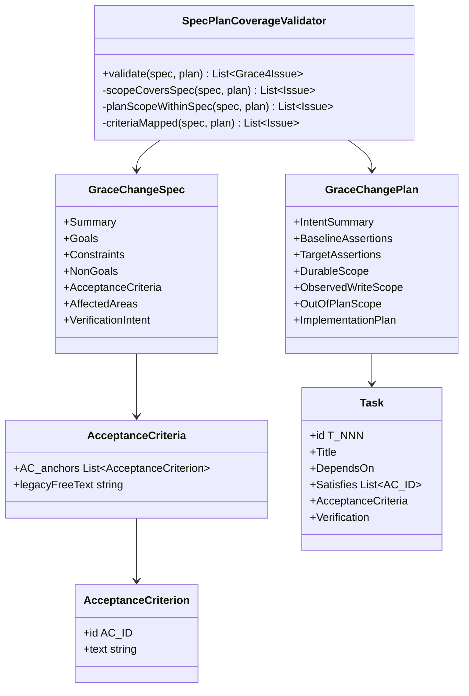
```mermaid
classDiagram
    class GraceChangeSpec {
        +Summary
        +Goals
        +Constraints
        +NonGoals
        +AcceptanceCriteria
        +AffectedAreas
        +VerificationIntent
    }
    class AcceptanceCriteria {
        +AC_anchors List~AcceptanceCriterion~
        +legacyFreeText string
    }
    class AcceptanceCriterion {
        +id AC_ID
        +text string
    }
    class GraceChangePlan {
        +IntentSummary
        +BaselineAssertions
        +TargetAssertions
        +DurableScope
        +ObservedWriteScope
        +OutOfPlanScope
        +ImplementationPlan
    }
    class Task {
        +id T_NNN
        +Title
        +DependsOn
        +Satisfies List~AC_ID~
        +AcceptanceCriteria
        +Verification
    }
    class SpecPlanCoverageValidator {
        +validate(spec, plan) List~Grace4Issue~
        -scopeCoversSpec(spec, plan) List~Issue~
        -planScopeWithinSpec(spec, plan) List~Issue~
        -criteriaMapped(spec, plan) List~Issue~
    }
    GraceChangeSpec --> AcceptanceCriteria
    AcceptanceCriteria --> AcceptanceCriterion
    GraceChangePlan --> Task
    SpecPlanCoverageValidator --> GraceChangeSpec
    SpecPlanCoverageValidator --> GraceChangePlan
```

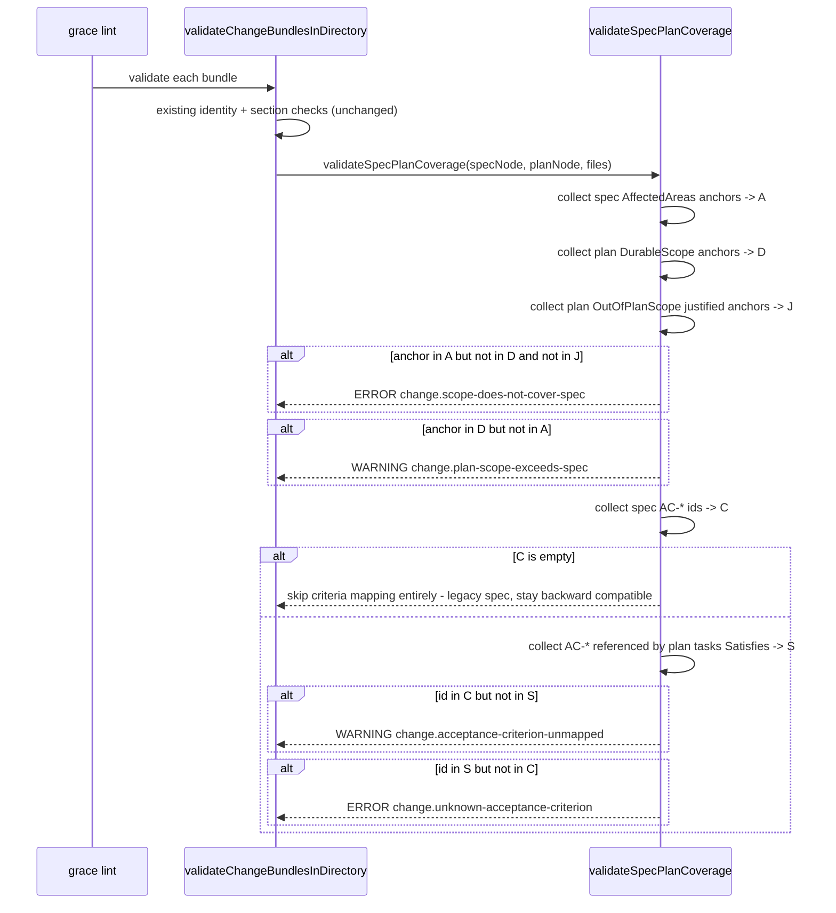
```mermaid
sequenceDiagram
    participant L as grace lint
    participant B as validateChangeBundlesInDirectory
    participant V as validateSpecPlanCoverage

    L->>B: validate each bundle
    B->>B: existing identity + section checks (unchanged)
    B->>V: validateSpecPlanCoverage(specNode, planNode, files)
    V->>V: collect spec AffectedAreas anchors -> A
    V->>V: collect plan DurableScope anchors -> D
    V->>V: collect plan OutOfPlanScope justified anchors -> J
    alt anchor in A but not in D and not in J
        V-->>B: ERROR change.scope-does-not-cover-spec
    end
    alt anchor in D but not in A
        V-->>B: WARNING change.plan-scope-exceeds-spec
    end
    V->>V: collect spec AC-* ids -> C
    alt C is empty
        V-->>B: skip criteria mapping entirely - legacy spec, stay backward compatible
    else
        V->>V: collect AC-* referenced by plan tasks Satisfies -> S
        alt id in C but not in S
            V-->>B: WARNING change.acceptance-criterion-unmapped
        end
        alt id in S but not in C
            V-->>B: ERROR change.unknown-acceptance-criterion
        end
    end
```

## 5.5 Steps

**Step 5.5.1 — Register the `AC-*` anchor family.**

`src/grace4/types.ts`:
```
PSEUDOCODE
ANCHOR_PATTERNS = { ..., acceptanceCriterion: /^AC-[A-Z0-9]+(?:-[A-Z0-9]+)*$/ }
SemanticAnchorFamily = ... | "acceptance-criterion"
```
`src/grace4/grammar.ts`: add to `ANCHOR_FAMILIES`, **after** the `V-M-` entry and before `M-`, so ordering-sensitive prefix classification is unaffected. Read the classification function before inserting, and confirm ordering does not matter — if it does, place it where it cannot shadow another family.

→ verify: existing `src/grace4/grammar.test.ts` anchor-classification tests still pass unmodified.

**Step 5.5.2 — Accept `AC-*` children under `AcceptanceCriteria`.**

Authored form (new, optional):
```xml
<AcceptanceCriteria>
  <AC-KEYBOARD-NAV>Arrow keys move focus; Home/End jump to first/last row.</AC-KEYBOARD-NAV>
  <AC-AXE-CLEAN>axe reports zero serious or critical violations on the ledger route.</AC-AXE-CLEAN>
</AcceptanceCriteria>
```
Legacy form (free text or non-anchor children) stays valid. Rules:
- Duplicate `AC-*` ids within one spec → error `change.duplicate-acceptance-criterion`.
- An `AC-*` element with empty text → error `change.empty-acceptance-criterion`.

**Step 5.5.3 — Accept `<Satisfies>` under tasks and `<OutOfPlanScope>` under the plan.**

```xml
<T-001>
  <Title>Add roving tabindex</Title>
  <DependsOn><None /></DependsOn>
  <Satisfies><AC-KEYBOARD-NAV /></Satisfies>
  <AcceptanceCriteria>…</AcceptanceCriteria>
  <Verification>…</Verification>
</T-001>

<OutOfPlanScope>
  <M-LEGACY-EXPORT><Reason>Deprecated; removal tracked separately in C-DROP-LEGACY.</Reason></M-LEGACY-EXPORT>
</OutOfPlanScope>
```
`<Satisfies>` and `<OutOfPlanScope>` are **optional**; absent means absent, never an error. An `<OutOfPlanScope>` entry without a non-empty `<Reason>` → error `change.out-of-plan-scope-missing-reason`. (Same instinct as the existing `context.ux-not-applicable-reason-insufficient` guard: an escape hatch that costs nothing gets used for everything.)

**Step 5.5.4 — Implement `validateSpecPlanCoverage`.**

```
PSEUDOCODE

function validateSpecPlanCoverage(specArtifact, planArtifact, specFile, planFile): Grace4Issue[]:
    issues = []

    // Only meaningful for an approved or draft pair that both parsed.
    if !specArtifact.root or !planArtifact.root: return issues

    specAnchors = collect anchors (M-* and DF-*) appearing as tags anywhere under AffectedAreas
    planDurable = collect anchors under DurableScope/GraphAnchors and DurableScope/VerificationAnchors
    justified   = collect anchors under OutOfPlanScope that carry a non-empty Reason

    // Compare MODULES and DATA FLOWS only. Verification anchors V-M-X are derived
    // from M-X, so treat the presence of M-X in either set as covering V-M-X.
    for anchor of specAnchors:
        covered = planDurable.has(anchor)
                  or planDurable.has("V-" + anchor)
                  or justified.has(anchor)
        if !covered:
            issues.push(error "change.scope-does-not-cover-spec", planFile,
                `Spec AffectedAreas names ${anchor}, but the plan's DurableScope does not include it `
                + `and it is not justified under OutOfPlanScope.`)

    for anchor of planDurable where isModuleOrFlow(anchor):
        base = anchor.startsWith("V-") ? anchor.slice(2) : anchor
        if !specAnchors.has(base):
            issues.push(warning "change.plan-scope-exceeds-spec", planFile,
                `Plan DurableScope includes ${anchor}, which the approved spec never mentions.`)

    specCriteria = collect AC-* ids under AcceptanceCriteria
    if specCriteria.size == 0:
        return issues            // legacy spec - backward compatible, no criteria checks

    satisfied = collect AC-* ids referenced under any T-*/Satisfies
    for id of specCriteria not in satisfied:
        issues.push(warning "change.acceptance-criterion-unmapped", specFile,
            `${id} is not referenced by any task's Satisfies element.`)
    for id of satisfied not in specCriteria:
        issues.push(error "change.unknown-acceptance-criterion", planFile,
            `Plan references ${id}, which the approved spec does not define.`)

    return issues
```

**Step 5.5.5 — Wire it in.**
Call `validateSpecPlanCoverage` from `validateChangeBundlesInDirectory` at the point where both spec and plan artifacts are already parsed. Do not re-read either file.

**Step 5.5.6 — Catalog entries** for all six new codes, each with concrete remediation naming the exact XML to add.

## 5.6 Backward-compatibility contract — read this twice

`change.scope-does-not-cover-spec` is an **error** that will fire on existing projects whose plans were authored loosely. That is the point — it is the hole being closed — but it must not fire spuriously.

Required safeguards, all of which must have a test:

1. Only anchors that **match `M-*` or `DF-*` patterns** are compared. Free text inside `AffectedAreas` (paths, prose, file names) is ignored entirely.
2. `V-M-X` in the plan's `DurableScope` counts as covering `M-X` in the spec.
3. Criteria mapping is **skipped entirely** when the spec declares no `AC-*` ids.
4. A bundle with a spec but no plan (draft stage) produces **no** coverage issues.
5. Archived bundles are validated identically to today — do not tighten history retroactively. If archived bundles would now error, gate the coverage validator to active bundles only and document it.

→ verify: run `bun run grace lint --path <every fixture>` and report every newly-firing error. Safeguard 5 is decided by that output — if archives light up, gate to active.

## 5.7 Tests

*Unit* — `src/grace4/grammar.test.ts`:

| # | Scenario | Expected |
|---|---|---|
| 1 | Spec `AffectedAreas` has `M-A`; plan `DurableScope/GraphAnchors` has `M-A` | no issue |
| 2 | Spec has `M-A`; plan has `M-B` | `change.scope-does-not-cover-spec` (error) + `change.plan-scope-exceeds-spec` (warning) |
| 3 | Spec has `M-A`; plan has `V-M-A` only | no issue (rule 2) |
| 4 | Spec has `M-A`; plan `OutOfPlanScope` has `M-A` with `<Reason>text</Reason>` | no issue |
| 5 | Same but `<Reason></Reason>` | `change.out-of-plan-scope-missing-reason` |
| 6 | Spec `AffectedAreas` contains only prose | no issue |
| 7 | Spec has two `AC-*`; plan tasks satisfy both | no issue |
| 8 | Spec has two `AC-*`; one satisfied | one `change.acceptance-criterion-unmapped` |
| 9 | Spec has no `AC-*`; plan has `Satisfies` | `change.unknown-acceptance-criterion` |
| 10 | Spec has legacy free-text criteria only | no criteria issues at all |
| 11 | Duplicate `AC-X` in one spec | `change.duplicate-acceptance-criterion` |
| 12 | `<AC-X></AC-X>` empty | `change.empty-acceptance-criterion` |
| 13 | Spec present, plan absent | no coverage issues |
| 14 | `AC-lowercase` | rejected by the anchor pattern as malformed |

*Integration* — `src/grace-lint.test.ts`:

| Case | Expected |
|---|---|
| **G-05 regression:** approved plan `DurableScope` rewritten to a different module than the spec's `AffectedAreas` | `change.scope-does-not-cover-spec` error — write first, watch it fail |
| Well-formed bundle with `AC-*` and `Satisfies` | clean lint |
| Every pre-existing fixture bundle | zero new errors |

## 5.8 Skill updates

- `grace-spec`: instruct authoring `AC-*` anchors; update `references/change-spec-template.xml`. `scripts/skill-contracts.test.ts` asserts the template's contents — read that test and update it deliberately alongside.
- `grace-plan`: instruct `<Satisfies>` on tasks, `<OutOfPlanScope>` with mandatory `<Reason>`, and that `DurableScope` must cover spec `AffectedAreas`.
- Mirror both to `plugins/`.

→ verify: `bun test scripts/skill-contracts.test.ts` and `bun run validate:marketplace` pass.

## 5.9 Definition of done / review gate

```
bun run typecheck / bun test / bun run validate:cli / bun run validate:marketplace → all pass
```

- [ ] All five backward-compatibility safeguards implemented **and** tested
- [ ] Newly-firing-error audit across all fixtures reported; archive-gating decision made from real output and documented
- [ ] `AC-*` registered in `ANCHOR_PATTERNS`, `ANCHOR_FAMILIES`, and `SemanticAnchorFamily`, following the existing tag-not-attribute discipline
- [ ] `<Satisfies>` / `<OutOfPlanScope>` optional; absence is never an error
- [ ] `<OutOfPlanScope>` requires a non-empty `<Reason>`
- [ ] Skill templates updated; `skill-contracts.test.ts` updated deliberately, not by weakening assertions
- [ ] G-05 regression evidence shown

## 5.10 Rollback

Remove the `validateSpecPlanCoverage` call site. The `AC-*` family can remain registered harmlessly (additive grammar).

---

# PHASE 6 — Design-system layer

**Status:** `NOT STARTED`
**Gaps:** G-06, G-09
**Release:** 5.0.0

## 6.1 Objective

Give UI/UX a first-class, *enforced* model. Per `review.md` §5.6: **no new tag ships without the check that makes it load-bearing.** Every element below has a validator, a health rule, or an assertion that reads it — otherwise it reproduces the exact failure (`ux-guidelines.xml`) it exists to fix.

## 6.2 Preconditions

→ verify: Phase 5 `COMPLETE` (this phase reuses `AC-*` and the anchor-family registration pattern).

## 6.3 Design

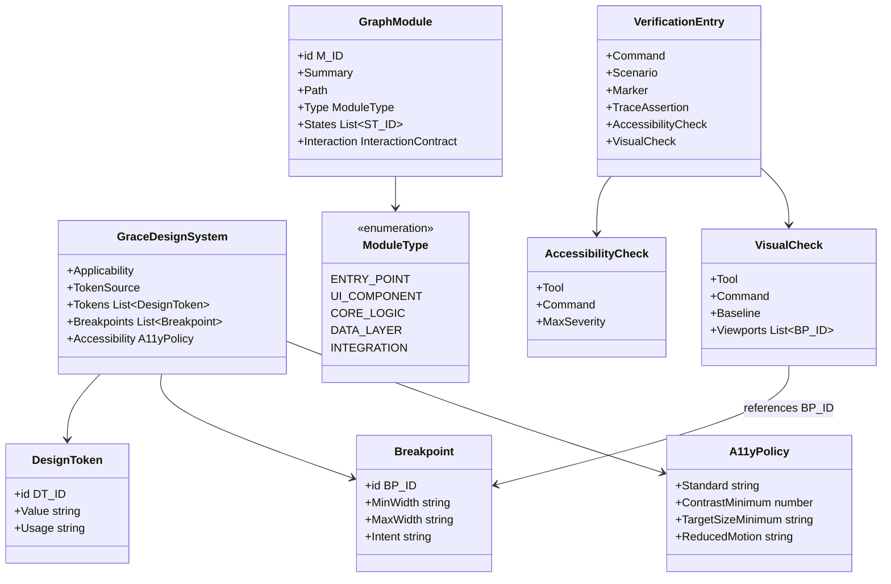
```mermaid
classDiagram
    class GraceDesignSystem {
        +Applicability
        +TokenSource
        +Tokens List~DesignToken~
        +Breakpoints List~Breakpoint~
        +Accessibility A11yPolicy
    }
    class DesignToken {
        +id DT_ID
        +Value string
        +Usage string
    }
    class Breakpoint {
        +id BP_ID
        +MinWidth string
        +MaxWidth string
        +Intent string
    }
    class A11yPolicy {
        +Standard string
        +ContrastMinimum number
        +TargetSizeMinimum string
        +ReducedMotion string
    }
    class GraphModule {
        +id M_ID
        +Summary
        +Path
        +Type ModuleType
        +States List~ST_ID~
        +Interaction InteractionContract
    }
    class ModuleType {
        <<enumeration>>
        ENTRY_POINT
        UI_COMPONENT
        CORE_LOGIC
        DATA_LAYER
        INTEGRATION
    }
    class VerificationEntry {
        +Command
        +Scenario
        +Marker
        +TraceAssertion
        +AccessibilityCheck
        +VisualCheck
    }
    class AccessibilityCheck {
        +Tool
        +Command
        +MaxSeverity
    }
    class VisualCheck {
        +Tool
        +Command
        +Baseline
        +Viewports List~BP_ID~
    }
    GraceDesignSystem --> DesignToken
    GraceDesignSystem --> Breakpoint
    GraceDesignSystem --> A11yPolicy
    GraphModule --> ModuleType
    VerificationEntry --> AccessibilityCheck
    VerificationEntry --> VisualCheck
    VisualCheck --> Breakpoint : references BP_ID
```

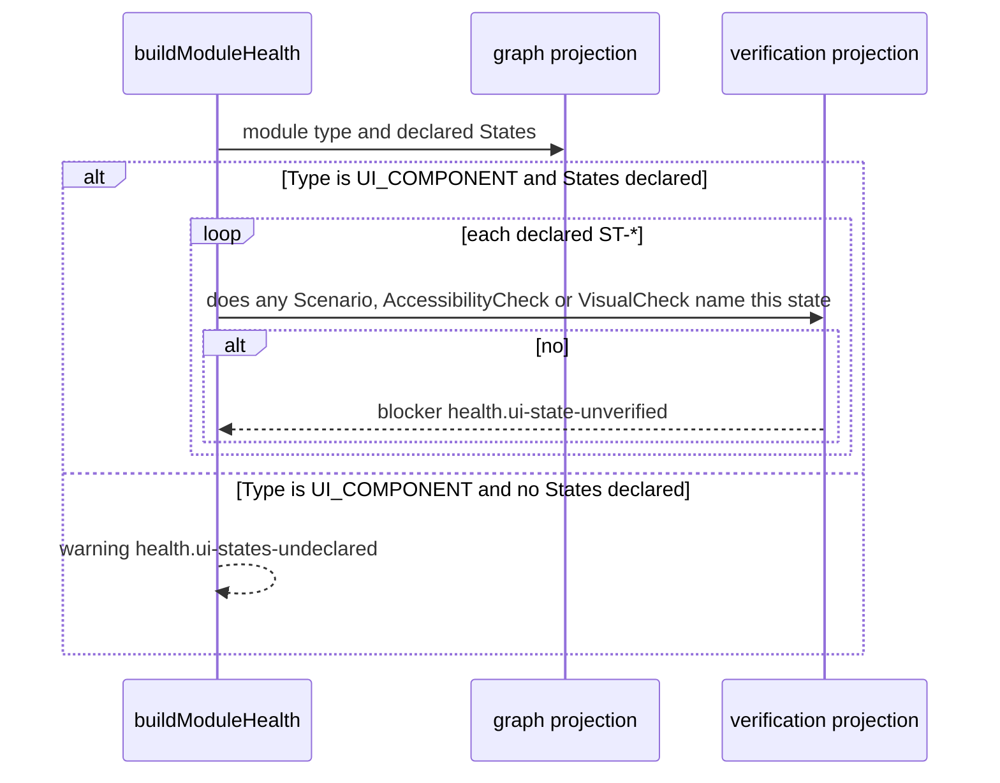
```mermaid
sequenceDiagram
    participant H as buildModuleHealth
    participant G as graph projection
    participant V as verification projection

    H->>G: module type and declared States
    alt Type is UI_COMPONENT and States declared
        loop each declared ST-*
            H->>V: does any Scenario, AccessibilityCheck or VisualCheck name this state
            alt no
                V-->>H: blocker health.ui-state-unverified
            end
        end
    else Type is UI_COMPONENT and no States declared
        H-->>H: warning health.ui-states-undeclared
    end
```

## 6.4 Scope of work

Implement in this order; each sub-step is independently testable.

**6.4.1 — Optional context artifact `design-system.xml` (root `GraceDesignSystem`).**

Critical: it must be **optional**. `GRACE4_CONTEXT_ARTIFACTS` is the *required* list and adding to it breaks every existing project. Introduce a parallel `GRACE4_OPTIONAL_CONTEXT_ARTIFACTS`, add `GraceDesignSystem` to `GRACE4_ROOT_TAGS`, and validate it only when the file exists.

→ verify: a project **without** `design-system.xml` lints exactly as before — assert this explicitly with a test.

**6.4.2 — Anchor families `DT-*`, `BP-*`, `ST-*`.** Same registration pattern as `AC-*` in Phase 5.

**6.4.3 — Validators for the new artifact.** Duplicate `DT-*`/`BP-*` ids; `DT-*` with empty `<Value>`; `BP-*` with neither `MinWidth` nor `MaxWidth`; `TokenSource` resolved through `resolveContainedProjectPath` (path containment is non-negotiable) and required to exist; `Applicability` handled like `ux-guidelines.xml`, including the non-boilerplate-reason guard.

**6.4.4 — `<Type>` becomes a validated enumeration.** Today it is free text and the documented values are unimplemented (G-09). Accept the documented set (`ENTRY_POINT`, `UI_COMPONENT`, `CORE_LOGIC`, `DATA_LAYER`, `INTEGRATION` — confirm the exact list against `knowledge-graph.md`) and emit a **warning** `graph.unknown-module-type` for anything else. Warning, not error: existing projects use free-text types and must not break.

**6.4.5 — `<States>` on modules + `health.ui-state-unverified`.** A `UI_COMPONENT` module may declare `<States><ST-DEFAULT /><ST-EMPTY /><ST-LOADING /><ST-ERROR /><ST-FOCUS-VISIBLE /><ST-DISABLED /></States>`. Health then requires each declared state to be named by at least one `Scenario`, `AccessibilityCheck`, or `VisualCheck` in the module's `V-M-*`. Blocker when declared-and-unverified; warning `health.ui-states-undeclared` when `Type` is `UI_COMPONENT` and no states are declared **and** `ux-guidelines.xml` applicability is `applicable`.

Matching rule: case-insensitive match of the state id minus the `ST-` prefix, with `-` treated as a word separator, against the evidence text. Document it; a fuzzy rule nobody can predict is worse than a strict one.

**6.4.6 — Evidence classes `AccessibilityCheck` and `VisualCheck`.** Extend `collectExactEvidence` in `src/grace4/projections.ts` and the verification record type. Both wrap a `<Command>`, so they run through the existing `MustPassCommand` machinery — but naming them makes them declarable, gateable, and reportable in `grace status` coverage.

**6.4.7 — New assertion kinds** in `ASSERTION_SCHEMAS`:

| Kind | Fields | Semantics |
|---|---|---|
| `MustMatchPattern` | `File`, `Pattern` | regex generalization of `MustContain`; broadly useful beyond UI |
| `MustUseToken` | `File`, `Token` | file references the `DT-*`'s `<Value>` (e.g. `var(--color-accent)`), not a raw literal |
| `MustNotUseLiteral` | `File`, `Pattern` | no raw hex/px where a token exists |
| `MustCoverStates` | `Module` | every declared `ST-*` on the module has evidence |

`MustMatchPattern` implementation warning: the pattern comes from a project file and is compiled at runtime. Guard against catastrophic backtracking — impose a length cap on the pattern, reject nested unbounded quantifiers, and never accept regex flags from the artifact. A malformed or rejected pattern is an **error**, never a silent skip.

**6.4.8 — `grace-design` skill.** Sibling to `grace-verification`: interview for design intent, populate `design-system.xml`, declare component states and interaction contracts, wire a11y/visual checks into `V-M-*`. Register in `.claude-plugin/marketplace.json`, `plugins/grace/.claude-plugin/plugin.json`, and mirror the skill tree.

→ verify: `bun run validate:marketplace` passes (it checks the declared skill list against the tree).

## 6.5 Tests

Unit coverage for every validator and every assertion kind, following the Phase 5 table style. Integration coverage must include:

| Case | Expected |
|---|---|
| Project with **no** `design-system.xml` | lints identically to pre-phase — the compatibility guarantee |
| `design-system.xml` with duplicate `DT-*` | error |
| `TokenSource` pointing outside the project (`../etc/passwd`) | path-containment error, not a read |
| `UI_COMPONENT` with declared states, all covered | clean |
| `UI_COMPONENT` with `ST-ERROR` declared and no matching evidence | `health.ui-state-unverified` blocker |
| `UI_COMPONENT` with no states, UX applicable | `health.ui-states-undeclared` warning |
| `<Type>NONSENSE</Type>` | `graph.unknown-module-type` warning, not error |
| `MustUseToken` where the file uses a raw hex | assertion failure |
| `MustMatchPattern` with a catastrophic-backtracking pattern | rejected with an error, no hang — assert the test completes under a timeout |
| `MustCoverStates` on a module with an uncovered state | assertion failure |

## 6.6 Review gate

- [ ] `design-system.xml` optional; projects without it are byte-identically unaffected (tested)
- [ ] Every new tag has a validator, health rule, or assertion reading it — list them explicitly in the report
- [ ] `<Type>` enumeration is a warning, not an error
- [ ] Regex safety: pattern length cap, no artifact-supplied flags, malformed pattern is an error, timeout test present
- [ ] `TokenSource` and every new path field routed through `resolveContainedProjectPath`
- [ ] `grace-design` skill registered in both manifests and mirrored
- [ ] State-matching rule documented in the skill and the explainer

---

# PHASE 7 — Systems modeling

**Status:** `NOT STARTED`
**Gaps:** G-07 (interface contracts), G-08 (ordered flows), G-14 (invariants), G-15 (perf budgets)
**Release:** 5.0.0

## 7.1 Objective

Give the Rust ↔ Go ↔ TypeScript boundary — where cross-service bugs actually live — an anchor, an owner, a version, and a gate.

## 7.2 Design

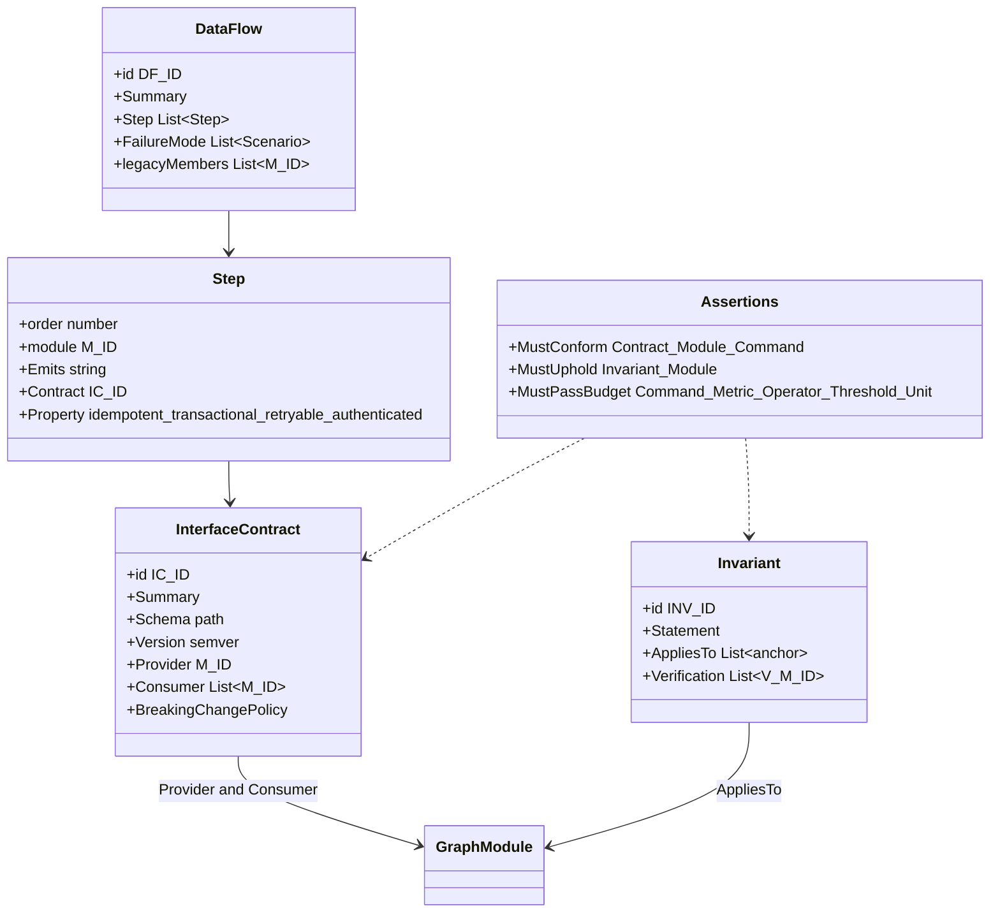
```mermaid
classDiagram
    class InterfaceContract {
        +id IC_ID
        +Summary
        +Schema path
        +Version semver
        +Provider M_ID
        +Consumer List~M_ID~
        +BreakingChangePolicy
    }
    class DataFlow {
        +id DF_ID
        +Summary
        +Step List~Step~
        +FailureMode List~Scenario~
        +legacyMembers List~M_ID~
    }
    class Step {
        +order number
        +module M_ID
        +Emits string
        +Contract IC_ID
        +Property idempotent_transactional_retryable_authenticated
    }
    class Invariant {
        +id INV_ID
        +Statement
        +AppliesTo List~anchor~
        +Verification List~V_M_ID~
    }
    class Assertions {
        +MustConform Contract_Module_Command
        +MustUphold Invariant_Module
        +MustPassBudget Command_Metric_Operator_Threshold_Unit
    }
    DataFlow --> Step
    Step --> InterfaceContract
    InterfaceContract --> GraphModule : Provider and Consumer
    Invariant --> GraphModule : AppliesTo
    Assertions ..> InterfaceContract
    Assertions ..> Invariant
```

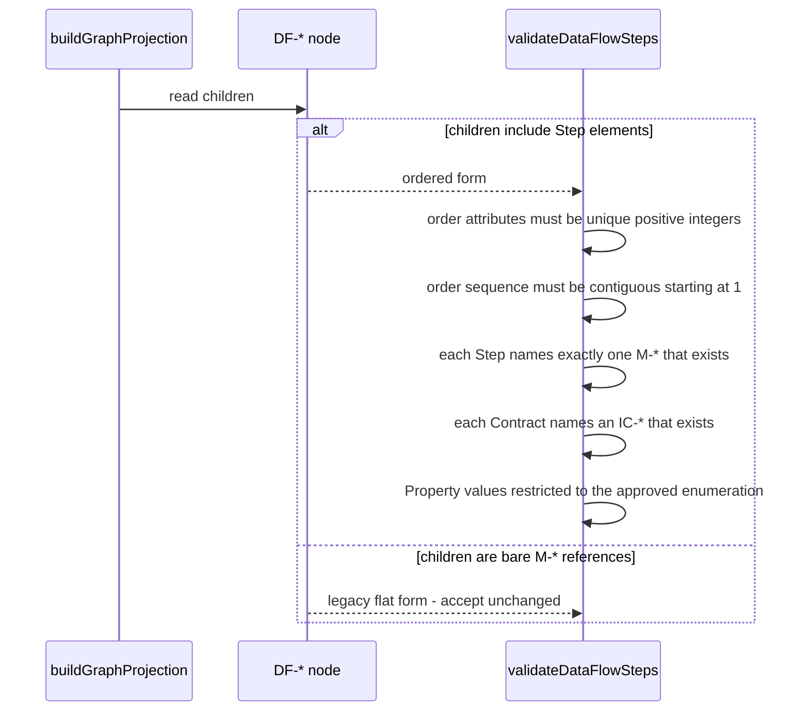
```mermaid
sequenceDiagram
    participant P as buildGraphProjection
    participant D as DF-* node
    participant V as validateDataFlowSteps

    P->>D: read children
    alt children include Step elements
        D-->>V: ordered form
        V->>V: order attributes must be unique positive integers
        V->>V: order sequence must be contiguous starting at 1
        V->>V: each Step names exactly one M-* that exists
        V->>V: each Contract names an IC-* that exists
        V->>V: Property values restricted to the approved enumeration
    else children are bare M-* references
        D-->>V: legacy flat form - accept unchanged
    end
```

## 7.3 Scope of work

**7.3.1 — `IC-*` anchor family and interface-contract records.** Live in graph documents alongside `M-*`/`DF-*`. Validate: `Schema` resolves inside the project and exists; `Provider` is exactly one existing `M-*`; every `Consumer` is an existing `M-*`; `Version` parses as semver; `BreakingChangePolicy` from an enumeration (`additive-only`, `versioned`, `breaking-allowed`). Contribute edges to the projection so `MustLink` and dangling-link checks see them.

**7.3.2 — `MustConform` assertion** with fields `Contract`, `Module`, `Command`. Under `--run-commands` it delegates to the project's own tool (`buf breaking`, `oasdiff`, a codegen-drift check). Without `--run-commands` it validates only that the contract and module exist and that the command is well-formed — matching how `MustPassCommand` already behaves.

**7.3.3 — Ordered `DF-*` steps**, backward compatible: a `DF-*` whose children are bare `M-*` references keeps working exactly as today. **Test that first**, before writing the ordered form.

**7.3.4 — Optional context artifact `invariants.xml` (root `GraceInvariants`)** with `INV-*` anchors, plus `MustUphold` (`Invariant`, `Module`). Same optionality contract as Phase 6.4.1.

**7.3.5 — `MustPassBudget`** with fields `Command`, `Metric`, `Operator` (`lt|lte|gt|gte`), `Threshold`, `Unit`, and optional `Extract` (a regex with one capture group; default `<Metric>\s*[=:]\s*([0-9.]+)`). Under `--run-commands`: run the command, apply `Extract` to stdout, parse the capture as a float, compare. Failure modes that must each be a distinct error, never a silent pass: command fails, no match, capture is not a number, comparison fails. The same regex-safety rules as 6.4.7 apply to `Extract`.

## 7.4 Tests

Unit tests per validator and assertion. Integration must include, at minimum:

| Case | Expected |
|---|---|
| Legacy flat `DF-*` | validates exactly as before — the compatibility guarantee |
| Ordered `DF-*` with gap in `order` (1, 3) | error |
| Ordered `DF-*` with duplicate `order` | error |
| `Step` naming a nonexistent `M-*` | error |
| `IC-*` `Schema` outside the project | path-containment error |
| `IC-*` `Provider` naming a nonexistent module | error |
| `MustConform` without `--run-commands` | validates references only, does not execute |
| `MustConform` with `--run-commands` and a failing command | assertion failure with the command output |
| `MustPassBudget` `p99=42` vs `lt 50 ms` | pass |
| `MustPassBudget` `p99=61` vs `lt 50 ms` | fail |
| `MustPassBudget` where the command emits no match | error, distinct code, not a pass |
| Project with no `invariants.xml` | unaffected |

## 7.5 Review gate

- [ ] Flat `DF-*` compatibility test written and passing **before** the ordered form was implemented
- [ ] `invariants.xml` optional; absence changes nothing
- [ ] Every path field routed through `resolveContainedProjectPath`
- [ ] `MustPassBudget` has a distinct error for each of the four failure modes; none can be mistaken for a pass
- [ ] `MustConform` respects the `--run-commands` opt-in exactly as `MustPassCommand` does
- [ ] New anchors participate in dangling-link validation

---

# PHASE 8 — Scale & ergonomics

**Status:** `NOT STARTED`
**Gaps:** G-16 (segmentation), G-13 (single-stack technology), G-22 (no repair path)
**Release:** 5.0.0

## 8.1 Scope of work

**8.1.1 — `graph.document-too-large` / `verification.document-too-large` warnings.** Default thresholds: 50 anchors or 30 KB per document, configurable via `.grace-lint.json` (`documentAnchorLimit`, `documentByteLimit`). Warning only. Message must name the specific document and suggest a split axis.

**8.1.2 — `grace graph split --by <path-prefix>`.** Mechanically re-routes anchors matching a path prefix into a new `GD-*` document and rewrites `index.xml`.

This command **writes to `.grace/`**, which nothing else in the CLI does. Therefore:
- Default to a dry run that prints the plan and writes nothing.
- Require an explicit `--apply` flag to write.
- Refuse to run when `git status --porcelain` is non-empty, unless `--allow-dirty` is passed — mirroring `grace-migrate`'s posture.
- Never delete an anchor; only move it between documents. Assert byte-for-byte round-tripping of anchor content in tests.
- → verify: after any split, `grace lint` on the same project produces an identical issue set. Assert this in an integration test — it is the correctness property that matters.

**8.1.3 — `grace doctor`.** One read-only command reporting: adapter availability and analysis coverage per extension, unverified-language counts, document-size pressure, missing optional context artifacts, and any `analysis.*` issues. This is the discoverability surface for everything Phase 1 made honest.

**8.1.4 — Multi-stack `GraceTechnology`.** Optional `<Stacks><Stack-WEB>…</Stack-WEB></Stacks>` alongside the existing flat `Language`/`Runtime`/`Framework`/`TestingStack`, which stays valid. Each stack carries `<Root>`; validate roots exist and are contained. `Stack-*` follows the unique-tag discipline — it is a new anchor family, registered like the others.

## 8.2 Review gate

- [ ] `grace graph split` defaults to dry run; `--apply` required; refuses on a dirty worktree without `--allow-dirty`
- [ ] Post-split lint parity test present and passing
- [ ] `grace doctor` is strictly read-only — assert it writes nothing (compare a directory snapshot before and after)
- [ ] Flat `GraceTechnology` still valid; multi-stack purely additive
- [ ] Size thresholds configurable and warning-only

---

# PHASE 9 — Adoption surface & release

**Status:** `NOT STARTED`
**Gaps:** G-20 (no example), G-17 (uniform ceremony), G-19 (dense skills), G-18 (design links)
**Release:** 5.0.0

## 9.1 Scope of work

**9.1.1 — Golden-path example `examples/polyglot/`.** The highest-value non-code deliverable: agents pattern-match from worked examples far better than from schemas. Contents:
- `apps/web` (React + design tokens), `services/api` (Go), `crates/core` (Rust), `proto/` or `openapi/`
- A complete `.grace` tree with **segmented** graph and verification documents (`ui.xml`, `api.xml`, `core.xml`, `contracts.xml`), a populated `design-system.xml`, an `invariants.xml`, and `IC-*` contracts
- One archived happy-path change bundle and one active bundle mid-lifecycle
- → verify: a CI job runs `grace lint --path examples/polyglot` and requires zero errors. **Without this job the example will bitrot** — it is the one mitigation `review.md` §12 names for exactly this risk.

**9.1.2 — Ceremony tiers T0–T3.** Per `review.md` §5.4, **skill-guidance only in this phase**. Tiers change which spec/plan sections are required; they never change whether gates run. `--assertions final` remains the release gate at every tier. The `grace-reviewer` skill must gain an explicit instruction to flag T0 misuse on architectural changes.

Deferred to last on purpose: shipping tiers before the enforcement work would give teams a documented way to route around it.

**9.1.3 — Restructure the dense skills (G-19).** Convert `grace-plan`'s `<must_do>` and `grace-spec`'s `<strict_contract>` from prose paragraphs into numbered tables, matching `grace-execute`'s recovery table, which is measurably more followable. Preserve every requirement — this is a formatting change, not an editorial one. `scripts/skill-contracts.test.ts` asserts substrings in these files; update it deliberately, and never by weakening an assertion.

**9.1.4 — Design-artifact links (G-18).** Optional `<DesignReferences>` under `GraceChangeSpec` with `<Figma url="…">`, `<UserResearch>path</UserResearch>`. Validate: URLs are well-formed and `http(s)`-only; local paths pass containment.

**9.1.5 — Release.**
- Version bump across `package.json`, `README.md` (`Current packaged version:` marker), `openpackage.yml`, `.claude-plugin/marketplace.json`, `plugins/grace/.claude-plugin/plugin.json`
- `CHANGELOG.md` per the repo's conventional-changelog setup
- If any Phase 6/7 artifact became **required**, bump `GRACE4_VERSION` and ship the `grace-migrate` path; if everything stayed optional, leave `"4.0"` and say so explicitly in the changelog
- → verify: `bun run validate:release` passes end to end

## 9.2 Review gate

- [ ] `examples/polyglot` lints with zero errors, enforced by CI
- [ ] Tiers documented as section requirements only; no tier bypasses any gate; reviewer skill flags misuse
- [ ] Skill restructuring preserves every requirement — diff reviewed requirement-by-requirement
- [ ] Version sync verified by `validate:marketplace`
- [ ] `GRACE4_VERSION` decision made explicitly and recorded in the changelog

---

# 10. Cross-cutting conventions

## 10.1 New issue-code registry

Every code in this table needs a `src/lint/catalog.ts` guide and at least one integration test. Track completion here as you go.

| Code | Severity | Phase | Registered |
|---|---|---|---|
| `analysis.no-adapter` | warning | 1 | ☐ |
| `config.invalid-unverified-languages` | error | 1 | ☐ |
| `markup.unknown-dependency` | error | 4 | ☐ |
| `markup.unknown-link` | error | 4 | ☐ |
| `graph.module-without-linked-files` | warning | 4 | ☐ |
| `change.scope-does-not-cover-spec` | error | 5 | ☐ |
| `change.plan-scope-exceeds-spec` | warning | 5 | ☐ |
| `change.acceptance-criterion-unmapped` | warning | 5 | ☐ |
| `change.unknown-acceptance-criterion` | error | 5 | ☐ |
| `change.duplicate-acceptance-criterion` | error | 5 | ☐ |
| `change.empty-acceptance-criterion` | error | 5 | ☐ |
| `change.out-of-plan-scope-missing-reason` | error | 5 | ☐ |
| `context.design-system.*` (family) | error | 6 | ☐ |
| `graph.unknown-module-type` | warning | 6 | ☐ |
| `health.ui-state-unverified` | blocker | 6 | ☐ |
| `health.ui-states-undeclared` | warning | 6 | ☐ |
| `assertion.invalid-pattern` | error | 6 | ☐ |
| `projection.graph.invalid-interface-contract` | error | 7 | ☐ |
| `projection.graph.invalid-data-flow-step` | error | 7 | ☐ |
| `context.invariants.*` (family) | error | 7 | ☐ |
| `assertion.budget-no-match` | error | 7 | ☐ |
| `graph.document-too-large` | warning | 8 | ☐ |
| `verification.document-too-large` | warning | 8 | ☐ |

**Severity policy — apply it consistently:**

| Situation | Severity |
|---|---|
| A contract states something factually false (phantom anchor, map mismatch) | error |
| GRACE cannot verify a claim it is expected to verify | warning + explicit opt-out |
| A legitimate intermediate state (planned but unimplemented module) | warning |
| A scale or ergonomics concern | warning |
| Anything that would break an existing green project without a real defect | **do not ship as an error** |

## 10.2 Skill mirroring

Every `skills/grace/**` edit gets a byte-identical copy at `plugins/grace/skills/grace/**` **in the same commit**. `scripts/validate-marketplace.ts` enforces this via `git diff --no-index`. Never edit only the mirror.

## 10.3 Commit hygiene

- Conventional commits (`.commitlintrc.json` with `@commitlint/config-conventional`); lefthook runs the hooks
- One phase per branch; one logical change per commit
- Bug-fix commits state the gap ID (`fix(lint): language-aware marker emission (G-02)`)
- Do not commit or push unless asked

## 10.4 Anti-patterns — do not do these

| Anti-pattern | Why it is forbidden |
|---|---|
| Regex over raw source instead of a lexer | Matches inside strings and comments; the exact class of bug this plan exists to fix |
| `/g` or `/y` flags on a reused `RegExp` | `lastIndex` is stateful; produces alternating results across calls |
| Making a new check an error to "be strict" | Breaks existing green projects; §10.1 severity policy governs |
| Adding a tag with no validator | Reproduces the `ux-guidelines.xml` failure (`review.md` §5.6) |
| Requiring `go`/`cargo`/`rustc` on PATH | Replaces a silent gap with a hard wall (§5.1) |
| Widening a test assertion to make a test pass | If the assertion was right, the code is wrong |
| Making a required context artifact optional-by-accident, or optional-by-accident required | Either silently weakens validation or breaks every existing project |
| Refactoring code the phase does not name | Surgical-changes principle; makes review impossible |
| Skipping the "watch it fail first" step on a bug fix | You have no evidence the test tests anything |

## 10.5 When you get stuck

1. If the code contradicts this plan → **stop, report the contradiction, do not improvise.**
2. If a step's verify check cannot pass and you believe the check is wrong → **stop and report.** Do not weaken the check.
3. If a phase turns out larger than described → complete what you can, mark the phase `BLOCKED`, and report precisely what remains and why. Partial-and-honest beats complete-and-unverified.
4. If a change would break an existing test → the default assumption is that you broke something. Prove otherwise before changing that test, and say so explicitly in the report.

---

# 11. Traceability matrix

| Gap | Phase | Primary deliverable |
|---|---|---|
| G-01 fail-open parity | 1, 2, 3 | `analysis.no-adapter`, then Go and Rust adapters |
| G-02 marker false-block | 1 | Emission-pattern registry + path threading |
| G-03 no Go adapter | 2 | `src/lint/adapters/go.ts` |
| G-04 no Rust adapter | 3 | `src/lint/adapters/rust.ts` |
| G-05 spec→plan traceability | 5 | `AC-*` family + `validateSpecPlanCoverage` |
| G-06 no UI/UX vocabulary | 6 | `design-system.xml`, `DT-*`/`BP-*`/`ST-*`, a11y/visual evidence |
| G-07 no interface contracts | 7 | `IC-*` + `MustConform` |
| G-08 unordered data flows | 7 | `DF-*` `<Step order>` |
| G-09 unimplemented module types | 6 | `<Type>` enumeration + `graph.unknown-module-type` |
| G-10 `DEPENDS` unvalidated | 4 | `markup.unknown-dependency` |
| G-11 `LINKS` phantom anchors | 4 | `markup.unknown-link`, `graph.module-without-linked-files` |
| G-12 test inference inert | 4 | `expandCommandTargets` |
| G-13 single-stack technology | 8 | `<Stacks>` |
| G-14 no invariants home | 7 | `invariants.xml` + `MustUphold` |
| G-15 no perf assertions | 7 | `MustPassBudget` |
| G-16 unguided segmentation | 8 | size warnings + `grace graph split` |
| G-17 uniform ceremony | 9 | T0–T3 skill guidance |
| G-18 no design links | 9 | `<DesignReferences>` |
| G-19 dense skills | 9 | Table restructuring |
| G-20 no golden path | 9 | `examples/polyglot/` |
| G-21 docs imply parity | 1 | Support matrix |
| G-22 no repair path | 8 | `grace doctor` |

---

# 12. Final instruction to the executor

Work one phase at a time. After each phase, report in the §0.5 format and **stop**.

The three things this plan cares about most, in order:

1. **Honesty over coverage.** A check that says "I cannot verify this" is worth more than one that silently passes. G-01 and G-02 exist because that principle was violated in one direction and then the other.
2. **Evidence over assertion.** Every bug fix shows the test failing before and passing after. Every new code fires in one test and stays silent in another.
3. **Surgical over sweeping.** Every diff hunk traces to a numbered step. If you cannot name the step, do not make the change.

*End of plan.*
