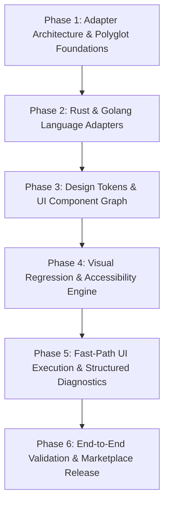

# Comprehensive Architectural Review & Extension Plan: GRACE Methodology Version 4 for Complex Polyglot Backends (Rust/Go) & High-Fidelity UI/UX Systems

**Author**: Senior AI Agentic Systems Architect  
**Target Repository**: `osovv/grace-marketplace` (GRACE Version 4.0.4)  
**Evaluation Scope**: Agentic Code Engineering, Polyglot Backend Extensions (Rust & Golang), High UI/UX Design System Integration, and Verification Engine Evolution.  
**Output Document**: `../grace-review/gemini-3.6-flash/GRACE_REVIEW_AND_PLAN_DOCS.md`

---

## Executive Summary

The **Graph-RAG Anchored Code Engineering (GRACE)** methodology version 4 represents a major evolution in agentic software engineering. By shifting from unstructured conversational prompting to a contract-first, graph-anchored, and assertion-gated development model, GRACE 4 provides a deterministic foundation for LLM-driven codebase modification.

However, an exhaustive architectural evaluation of GRACE 4 (`version 4.0.4`) reveals significant structural limitations when applied beyond standard web/CRUD applications (primarily TypeScript/Python). Specifically:
1. **Polyglot Backend Blind Spot**: Native compiler-backed language analysis in GRACE 4 is restricted to TypeScript/JavaScript, Python, and Dart. Complex systems programming in **Rust** (`.rs`) and **Golang** (`.go`) lacks AST adapters, trait/interface satisfaction checking, export map validation, or diagnostic error parsing.
2. **UI/UX & Design System Deficit**: GRACE 4 treats UI/UX as high-level prose inside `.grace/context/ux-guidelines.xml`. It lacks deterministic primitives for design tokens, visual component contracts, responsive layout bounds, visual regression testing, or accessibility (`WAI-ARIA`) assertions.
3. **High-Ceremony Friction for Rapid UI Iteration**: The strict change lifecycle (`spec.xml` → `plan.xml` → active baseline preflight → target assertions → final gate) introduces unnecessary friction during fast, iterative UI styling and visual component tweaking.

This document presents a comprehensive evaluation of GRACE 4's internal mechanics, strengths, and weaknesses, followed by an actionable, step-by-step design and implementation plan (**GRACE 5 / Polyglot & UI Extension Spec**) to adapt GRACE for enterprise-grade Rust/Go microservice backends and high-fidelity, visually rich frontends.

---

## Part 1: Deep Dive into GRACE 4 Architecture & Mechanics

### 1.1 The Durable `.grace/` Model
GRACE 4 establishes `.grace/` as the single source of truth for project architecture and change tracking:

```
.grace/
├── context/
│   ├── requirements.xml   # High-level requirements & domain boundaries
│   ├── technology.xml     # Language, framework, and tooling constraints
│   ├── principles.xml     # Architectural & code quality principles
│   ├── deployment.xml     # Infrastructure, CI/CD, and operational constraints
│   └── ux-guidelines.xml  # High-level user accessibility & interface guidelines
├── graph/
│   ├── index.xml          # Routing table for graph documents
│   └── main.xml           # Graph projection nodes (GD-*, M-*, DF-*)
├── verification/
│   ├── index.xml          # Routing table for verification documents
│   └── main.xml           # Verification projection nodes (VD-*, V-M-*)
└── changes/
    ├── active/
    │   └── C-*/           # Active GraceChangeSpec, GraceChangePlan & design context
    └── archive/
        └── C-*/           # Immutable applied/rejected/superseded bundles
```

### 1.2 The Change Lifecycle (`C-*`)
GRACE 4 separates changes into active change bundles identified by canonical `C-*` tags:
- **`GraceChangeSpec` (`spec.xml`)**: Declares intent, scope, and non-functional requirements.
- **`GraceChangePlan` (`plan.xml`)**: Contains immutable task definitions (`T-*`), `BaselineAssertions`, `TargetAssertions`, `DurableScope`, `ObservedWriteScope`, and leaf verification commands (`MustPassCommand`).
- **Phase-Gated Assertion Execution**:
  - `current`: Preflight check run before any writes occur.
  - `baseline`: Pre-edit gate evaluating project state against selected `C-*` baseline assertions.
  - `target`: Post-edit evidence evaluating selected target assertions (including `MustPassCommand` test execution).
  - `final`: Outer apply/archive gate that re-evaluates the entire project while keeping active baselines intact.

### 1.3 File-Local Semantic Markup
Governed source files embed lightweight comment-based annotations:
- `START_MODULE_CONTRACT` / `END_MODULE_CONTRACT`: Binds a file to an `M-*` graph module.
- `START_CONTRACT:` / `END_CONTRACT:`: Defines localized interface/function contracts.
- `START_BLOCK_[NAME]` / `END_BLOCK_[NAME]`: Delimits semantic code blocks referenced by data flows (`DF-*`) or tests (`V-M-*`).
- `START_MODULE_MAP`: Defines export symbols mapped to file locations.
- `LINKS:`: Explicit cross-file dependency anchors.

### 1.4 CLI & Engine Architecture (`src/`)
The CLI `@osovv/grace-cli` (implemented in Bun/TypeScript) provides compiler-backed and static verification:
- `src/grace4/grammar.ts`: Validates XML schemas for all `.grace` root tags.
- `src/grace4/projections.ts`: Builds graph and verification indexes (`GD-*`, `M-*`, `DF-*`, `V-M-*`).
- `src/grace4/scope.ts`: Analyzes file overlaps and enforces safe parallel execution (`--parallel-preflight`).
- `src/lint/adapters/`: Contains AST/language analyzers (`typescript.ts`, `python.ts`, `dart.ts`).

---

## Part 2: Evaluation of GRACE 4 Strengths for Agentic Development

1. **Context Engineering & Hallucination Mitigation**:
   - By anchoring AI agents to graph nodes (`M-*`, `DF-*`) and file contracts, GRACE 4 eliminates prompt drift. Agents query relevant nodes via `grace module show` rather than consuming massive workspace token windows.
2. **Immutable Specs & Plans**:
   - Approved `GraceChangePlan` bundles are immutable. If an agent encounters unforeseen complexity, it cannot silently edit the plan; it must supersede the bundle, preventing silent scope creep.
3. **Deterministic Leaf Command Gating (`MustPassCommand`)**:
   - Agents cannot declare task completion based purely on text generation. The CLI requires empirical execution of project verification (e.g. `bun test`, `tsc --noEmit`).
4. **Multi-Agent Parallel Safety**:
   - The scope coexistence analyzer (`grace lint --parallel-preflight`) checks `ObservedWriteScope` across active change bundles, allowing subagents to work concurrently without race conditions on shared files.
5. **Clear Separation of Projections & Code**:
   - Projections (`.grace/graph/`) act as lightweight read-models, ensuring fast querying without parsing the entire AST on every command.

---

## Part 3: Critical Analysis of Weaknesses & Blind Spots

### 3.1 Deficit 1: Absence of Rust and Golang AST/Compiler Adapters
In `src/language-registry.ts`:
```typescript
export const ADAPTER_BACKED_EXTENSIONS: ReadonlySet<string> = new Set([
  ".js", ".jsx", ".ts", ".tsx", ".mjs", ".cjs", ".mts", ".cts",
  ".py", ".pyi", ".dart",
]);
```
- **The Issue**: `.rs` (Rust) and `.go` (Golang) are listed only in generic `CODE_EXTENSIONS`. There are **no language adapters** for Rust or Go in `src/lint/adapters/`.
- **Consequences**:
  - **No Module Map Verification**: GRACE cannot verify `START_MODULE_MAP` against actual Rust `pub fn`/`pub struct`/`pub trait` exports or Go `Capitalized` exported symbols.
  - **No Type/Contract Enforcement**: Interface satisfaction in Go (`var _ Interface = (*Impl)(nil)`) and trait implementations in Rust (`impl Trait for Struct`) are invisible to GRACE linting.
  - **No Memory/Concurrency Control**: Rust lifetime annotations, thread safety invariants (`Send`/`Sync`), Go channel ownership, and goroutine context propagation cannot be tracked or validated.
  - **No Cargo Workspace / Go Module Awareness**: Multi-crate Rust workspaces and Go sub-packages are treated as flat file lists.

### 3.2 Deficit 2: Shallow UI/UX & Design System Primitives
- **The Issue**: UI/UX in GRACE 4 is represented solely as narrative prose in `.grace/context/ux-guidelines.xml` (`<Audience>`, `<Guideline>`).
- **Consequences**:
  - **No Design Token Contracts**: Colors, typography scale, spacing tokens, and CSS variables are unmanaged. Agents frequently introduce arbitrary hardcoded inline styles (e.g., `margin-top: 13px` or custom hex colors `#3b82f6`).
  - **No Component Hierarchy Graph**: UI components (buttons, modals, layout grids) are treated identically to backend services, missing state properties (`props`, `events`, `slots`).
  - **No Visual Regression / DOM Verification**: `MustPassCommand` executes CLI tests, but lacks native bindings for visual snapshot comparisons (Playwright/Storybook screenshot diffing) or accessibility DOM tree audits (`axe-core`).

### 3.3 Deficit 3: High Ceremony for Iterative UI Styling
- **The Issue**: Creating full change specs (`spec.xml` + `plan.xml`) for minor UI tweaks (e.g. adjusting padding, fixing color contrast, fine-tuning micro-animations) creates excessive administrative overhead for agents.
- **Consequences**: Developers working on rich UI applications experience friction, leading to manual bypassing of GRACE workflows.

### 3.4 Deficit 4: Oversimplified Data-Flow Models (`DF-*`)
- **The Issue**: GRACE 4 data flows (`DF-*`) record basic `<Source>` and `<Target>` pointers.
- **Consequences**: Microservices written in Rust/Go rely heavily on gRPC/Protobuf contracts, OpenAPI schemas, and async event queues (Kafka, NATS). GRACE 4 cannot assert payload schemas, RPC method signatures, or queue topic contracts.

### 3.5 Deficit 5: Binary Command Execution without Diagnostic Parsing
- **The Issue**: `MustPassCommand` treats command output as a binary pass/fail exit code.
- **Consequences**: Rich compiler diagnostics from `rustc --error-format=json` or `go test -json` are discarded. Agents must parse raw stdout text, increasing diagnostic effort when fixing complex Rust borrow checker or type errors.

---

## Part 4: Comprehensive Improvement Proposal (GRACE 5 Extensions)

To transform GRACE into a universal, enterprise-grade agentic methodology, we propose five key extensions:

```
+-----------------------------------------------------------------------------------+
|                            GRACE 5 EXTENSION SUITE                                |
+------------------------------------+----------------------------------------------+
| POLYGLOT BACKENDS (RUST & GO)      | HIGH UI/UX & DESIGN SYSTEMS                  |
+------------------------------------+----------------------------------------------+
| 1. Rust AST & Cargo Adapter        | 1. Design Token Schema (.grace/context/)     |
| 2. Go AST & Go Module Adapter      | 2. UI Component Graph Anchors (M-UI-*)       |
| 3. Trait/Interface Assertions      | 3. Visual Regression Gating (V-UI-*)         |
| 4. Rustc/Go JSON Diagnostic Engine | 4. Accessibility (WAI-ARIA) Contracts        |
| 5. gRPC/Protobuf Data-Flow (DF-RPC)| 5. Fast-Path UI Change Bundles (C-FAST-*)     |
+------------------------------------+----------------------------------------------+
```

### Extension A: Native Rust & Golang Language Adapters

#### 1. Rust Language Adapter (`src/lint/adapters/rust.ts`)
- **Integration**: Uses `cargo check --message-format=json` and tree-sitter/AST parsing.
- **Symbol Extraction**:
  - Parses `pub fn`, `pub struct`, `pub enum`, `pub trait`, `pub type`, and `pub mod`.
  - Verifies `START_MODULE_MAP` against `pub` items.
  - Extracts Rust doc comments (`///`) into `MODULE_CONTRACT` fields.
- **Rust-Specific Assertions**:
  - `RustTraitImpl`: Verifies that a type implements a required trait.
  - `CargoWorkspaceDep`: Enforces crate dependency boundaries in Cargo.toml.
  - `UnsafeBlockAudit`: Restricts `unsafe` code blocks unless anchored by an approved `C-*` spec.

#### 2. Golang Language Adapter (`src/lint/adapters/go.ts`)
- **Integration**: Uses `go vet` and `go/ast` export analysis.
- **Symbol Extraction**:
  - Identifies exported identifiers (capitalized `Func`, `Type`, `Struct`, `Const`, `Var`).
  - Maps Go packages and module imports (`go.mod`).
- **Go-Specific Assertions**:
  - `GoInterfaceImpl`: Validates static interface compliance checks.
  - `GoroutineContextContract`: Verifies that async functions accept `context.Context` as their first parameter.

---

### Extension B: High UI/UX Design System Engine

#### 1. Design Tokens Artifact (`.grace/context/design-tokens.xml`)
Establishes a canonical design token contract:
```xml
<GraceDesignTokens graceVersion="5.0">
  <ColorPalette>
    <Token name="primary-600" value="#2563eb" />
    <Token name="surface-dark" value="#0f172a" />
  </ColorPalette>
  <Typography>
    <FontFamily name="sans" value="Inter, system-ui, sans-serif" />
    <Scale name="heading-1" fontSize="2.25rem" lineHeight="2.5rem" fontWeight="700" />
  </Typography>
  <Spacing>
    <Unit name="space-4" value="1rem" />
  </Spacing>
</GraceDesignTokens>
```

#### 2. Visual & Accessibility Verification (`V-UI-*`)
Extends verification entries to include automated visual regression and accessibility auditing:
```xml
<V-UI-001>
  <Title>Navigation Bar Visual & Accessibility Gate</Title>
  <ModuleId>M-UI-NAVBAR</ModuleId>
  <VisualRegression>
    <StorybookId>components-navbar--default</StorybookId>
    <Threshold>0.01</Threshold>
    <BaselineImage>snapshots/navbar-desktop.png</BaselineImage>
  </VisualRegression>
  <AccessibilityContract>
    <Standard>WCAG2AA</Standard>
    <Rules>color-contrast,aria-roles,button-name</Rules>
  </AccessibilityContract>
</V-UI-001>
```

#### 3. Fast-Path UI Execution Profile (`C-FAST-*`)
Introduces a streamlined lifecycle profile for UI styling and layout iterations:
- Bypasses full `GraceChangeSpec` approval for scoped visual edits restricted to `src/components/**` and CSS files.
- Replaces manual approval with automated visual regression check (`V-UI-*`) and linting (`grace lint --fast-path`).

---

### Extension C: Polyglot RPC & Event Data-Flow Contracts

Extends `DF-*` primitives to support microservice IPC:
```xml
<DF-RPC-ORDER-CREATE>
  <Title>Create Order gRPC Flow</Title>
  <Source>M-GATEWAY</Source>
  <Target>M-ORDER-SERVICE</Target>
  <Protocol>gRPC</Protocol>
  <ProtoSchema>proto/order/v1/order_service.proto</ProtoSchema>
  <ServiceMethod>OrderService/CreateOrder</ServiceMethod>
</DF-RPC-ORDER-CREATE>
```

---

## Part 5: Step-by-Step Implementation Roadmap



### Phase 1: Adapter Architecture & Polyglot Foundations
- **Target**: `src/language-registry.ts`, `src/lint/types.ts`
- **Tasks**:
  1. Refactor `LanguageAdapter` interface to support compiled binaries and CLI tool invocations (`cargo`, `go`).
  2. Extend `ADAPTER_BACKED_EXTENSIONS` to include `.rs` and `.go`.
  3. Implement asynchronous AST analysis support for external compiler diagnostics.

### Phase 2: Rust & Golang Language Adapters
- **Target**: `src/lint/adapters/rust.ts`, `src/lint/adapters/go.ts`
- **Tasks**:
  1. Build `RustAdapter`:
     - Parse `Cargo.toml` workspace structures.
     - Extract `pub` symbols (`fn`, `struct`, `enum`, `trait`).
     - Map `START_MODULE_MAP` for `.rs` files.
     - Add `cargo check --message-format=json` diagnostic parser.
  2. Build `GoAdapter`:
     - Parse `go.mod` package hierarchies.
     - Extract exported identifiers (`Capitalized`).
     - Map `START_MODULE_MAP` for `.go` files.
     - Integrate `go vet` and `go/ast` checks.
  3. Write unit and integration test suites (`src/lint/adapters/rust.test.ts`, `src/lint/adapters/go.test.ts`).

### Phase 3: Design Tokens & UI Component Graph
- **Target**: `src/grace4/grammar.ts`, `src/grace4/types.ts`
- **Tasks**:
  1. Introduce `GraceDesignTokens` root tag in `GRACE4_ROOT_TAGS`.
  2. Add `M-UI-*` semantic anchor pattern for UI component graph projections.
  3. Implement design token linter checking for inline style violations and unanchored CSS variables.

### Phase 4: Visual Regression & Accessibility Engine
- **Target**: `src/grace4/assertions.ts`, `src/lint/core.ts`
- **Tasks**:
  1. Create `V-UI-*` verification schema.
  2. Implement Playwright / Storybook snapshot diff evaluator in assertion engine.
  3. Integrate `axe-core` accessibility test execution runner.

### Phase 5: Fast-Path UI Execution & Structured Diagnostics
- **Target**: `src/grace4/scope.ts`, `src/grace.ts`
- **Tasks**:
  1. Implement `C-FAST-*` change bundle profile in CLI for UI-only paths.
  2. Build diagnostic log synthesis for Rust (`rustc` JSON errors) and Go (`go test` JSON logs).
  3. Add visual artifact output directory (`.grace/verification/artifacts/`).

### Phase 6: End-to-End Validation & Marketplace Release
- **Target**: Repository release surfaces (`package.json`, `plugins/`, `skills/`)
- **Tasks**:
  1. Validate full pipeline against complex test fixtures:
     - Rust gRPC microservice (`tonic` + `tokio`).
     - Golang high-concurrency API service (`gin` + `goroutines`).
     - React + Tailwind / WebGL design system application.
  2. Update canonical GRACE skills in `skills/grace/`.
  3. Run `bun run validate:release` and publish updated `@osovv/grace-cli` package.

---

## Conclusion & Strategic Impact

By executing this enhancement plan, GRACE 4 evolves into a truly universal agentic development framework (**GRACE 5**). It bridges the gap between high-level AI prompt orchestration and rigorous systems-level engineering:
- **Rust & Go Backends**: Gain compiler-backed module map parity, trait/interface enforcement, and zero-hallucination refactoring for complex concurrent microservices.
- **Rich UI/UX Applications**: Gain deterministic design token governance, component graph anchoring, automated visual regression gating, and friction-free fast-path execution.
- **Deterministic Quality**: Ensures that AI-driven development remains safe, verifiable, and architectural-first across the entire software stack.
