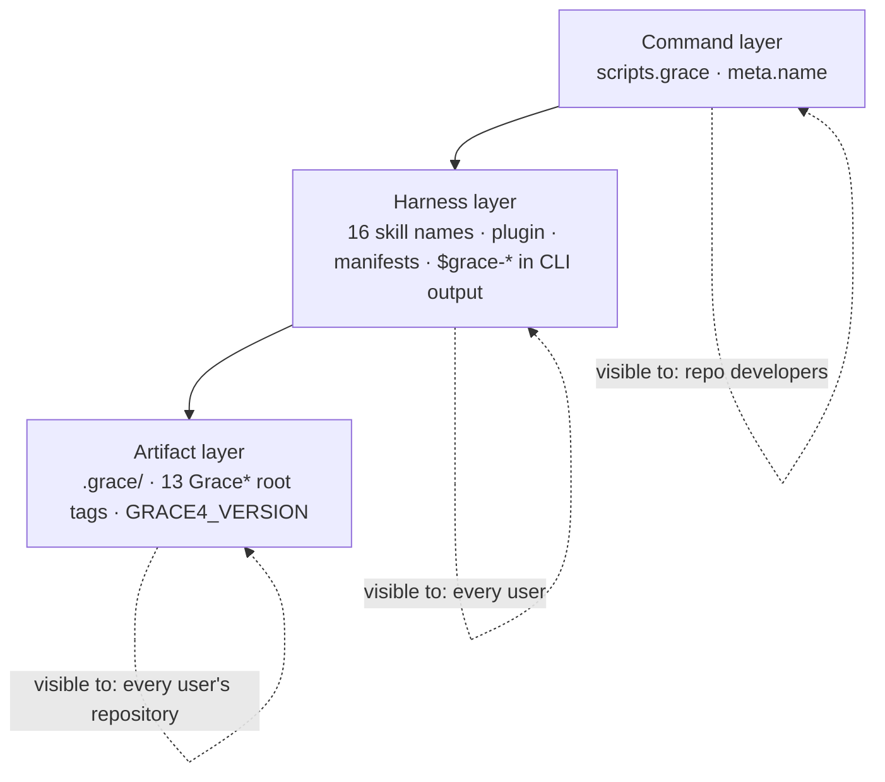

# Namespace Separation Implementation Plan

**Target repository:** `neo-grace` (`@neograce/cli`, 5.0.1)
**Audience:** an executor coding agent
**Authority:** derived from `review.md` in this directory. Where this plan and the review
disagree, **this plan wins**.
**Plan version:** 1.0 · 2026-07-29

> **Complete. Shipped 2026-07-29 as `@neograce/cli` 6.0.1** — `latest` on npm, with SLSA provenance,
> verified by installing the published package and running it. Every phase shipped into one major,
> because Phases 2, 3 and 4 each break a published surface and there is no coherent state between
> them — a release with skills renamed but artifacts not would be worse than either endpoint. The
> package name is unchanged (review N4) and the version line continues from 5.0.1 rather than
> restarting.
>
> **`v6.0.0` is a tag that never shipped.** See §9 A10.

---

## 0. Operating contract for the executor

### 0.1 Four working principles

**1 — Think before renaming.** A rename looks mechanical and is not. Before each phase, open every
file in *Files touched*, and state in your report which occurrences are **identifiers** (must
change), which are **history** (must not), and which are **prose about the methodology** (usually
must not). Getting that classification wrong is how this plan fails.

**2 — Centralize, then change the value.** Phase 1 exists because a scattered literal cannot be
renamed verifiably. Never sweep a literal you could have first turned into a constant.

**3 — Surgical changes.** Touch only what a phase names. No "while I'm here" reformatting. Every
hunk traceable to a numbered step.

**4 — Goal-driven execution.** Every step is `step → verify: check`. A step whose verify check you
did not run is incomplete.

### 0.2 Three categories of occurrence — classify before you edit

| Category | Examples | Action |
|---|---|---|
| **Identifier** | `scripts.grace`, skill `name:` fields, `GraceChangeSpec`, `.grace/` paths | Rename |
| **History** | `CHANGELOG.md` entries describing shipped releases; anything under `docs/plans/archive/**` | **Never touch.** These record what past releases actually shipped, under the names they shipped with |
| **Methodology prose** | "GRACE means Graph-RAG Anchored Code Engineering"; "contract-first AI engineering" | **Usually keep.** GRACE is the method; `ngrace` is this implementation's executable |

A `grep` result set that includes `CHANGELOG.md` or `docs/plans/archive/` has over-matched. Narrow
it rather than filtering by hand each time.

### 0.3 Repository invariants you must not break

1. `skills/<dir>/*` is the source of truth; `plugins/<plugin>/skills/<dir>/*` is a byte-identical
   mirror. Any skill edit lands in both in the same commit.
2. Versions stay synchronized across `README.md`, `openpackage.yml`,
   `.claude-plugin/marketplace.json`, `plugins/*/.claude-plugin/plugin.json`, `package.json`.
3. `docs/plans/archive/**` is never edited (`docs/plans/README.md` rule 1).
4. `CHANGELOG.md` is append-only history. New entries yes; rewriting old ones never.
5. The published file list (`package.json#files`) and `scripts/release-check.ts` must stay in
   agreement. Four sites in that script reference `src/grace.ts` by path.

### 0.4 Commands you will use constantly

```bash
bun run typecheck
bun test
bun run validate:cli
bun run validate:marketplace
bun run validate:examples      # end-to-end against a real project tree — see §0.6
bun run validate:packed        # the published surface
bun run validate:ci
bun run validate:release       # includes release-check.ts; required by Phases 0 and 5
```

**`validate:ci` is not sufficient for this plan.** Renames break packaging and release tooling
before they break tests. Phases that touch `package.json`, manifests, or published paths run
`validate:release`.

### 0.5 Per-phase reporting format

```
PHASE <n> — <name>
Status: COMPLETE | BLOCKED
Steps completed: <n>/<n>
Files changed: <count, and the list>

Occurrence classification (§0.2):
  Identifiers renamed:   <count>
  History left untouched: <files — confirm CHANGELOG.md and docs/plans/archive/ are absent from the diff>
  Prose deliberately kept: <examples, with reasoning>

Verify output:
  bun run typecheck            → <pass/fail>
  bun test                     → <n pass, n fail>
  bun run validate:cli         → <pass/fail>
  bun run validate:marketplace → <pass/fail>
  bun run validate:examples    → <pass/fail>
  bun run validate:release     → <pass/fail, or "not required this phase">

Residual scan: <the phase's grep command, and its output — empty or explained>

Self-review (§0.6):
  Scope audit:        <files outside the declared list, or "clean">
  Self-reference check: <how you proved the tests are not merely renamed alongside the code>
  Compat sweep:       <fixtures and examples still lint clean>

Deviations from plan: <none, or explain>
```

Then **stop and wait for review.**

### 0.6 Phase self-review — adapted, not copied

The sibling track's five-audit protocol was written for logic changes. Three of its audits apply
here; two do not, and pretending otherwise would be ceremony.

**Applies — scope audit.** `git diff --name-only HEAD` against the phase's declared list. A rename
is exactly the kind of change that quietly spreads.

**Applies — compatibility sweep.** `examples/polyglot` and every fixture must still lint clean.

**Applies, and is the critical one here — the self-reference check.**

> A rename that updates the code *and* its tests in the same pass produces a green suite that
> proves nothing. Both sides moved together; the comparison has no independent side.

This is pattern 2 from the sibling track's defect log — *a comparison where one side derives from
the thing under test* — and a rename is the purest possible instance of it.

The independent side is **`bun run validate:examples`**, which lints `examples/polyglot`: a real
project tree, not a builder-constructed fixture. If a phase renames something and `validate:examples`
was not run, the phase has no evidence. State in every report how the independent check was
satisfied.

**Does not apply — mutation check.** There is little conditional logic to revert.

**Does not apply — adversarial probe.** There is no input space to explore. Its place is taken by
the **residual scan**: the phase's own `grep`, run after the edit, with its output in the report.

---

## 1. Orientation

### 1.1 The three layers (review F1)



### 1.2 What makes this tractable

| Fact | Consequence | Source |
|---|---|---|
| No `neo-grace` projects exist yet | Every migration cost is zero | maintainer, 2026-07-29 |
| `.grace` has no path constant | Centralize first, or the rename is unverifiable | review F3 |
| The binary prints `$grace-*` skill names in 11 sites | Renaming skills without these makes `status` recommend nonexistent skills | review F2 |
| `GRACE4_VERSION` is the *grammar* version, not the product version | Cannot be swept; needs its own decision | review F4 |

---

## 2. Phase status board

| # | Phase | Layer | Release | Status |
|---|---|---|---|---|
| 0 | Command name: `grace` → `ngrace` | Command | 6.0.1 | `COMPLETE` |
| 1 | Centralize the scattered literals | — (enabling) | 6.0.1 | `COMPLETE` |
| 2 | Harness surface: skills, plugin, manifests, CLI guidance | Harness | 6.0.1 | `COMPLETE` |
| 3 | Artifact surface: `.ngrace/` and root tags | Artifact | 6.0.1 | `COMPLETE` |
| 4 | Grammar identity: retire `GRACE4_VERSION` | Artifact | 6.0.1 | `COMPLETE` |
| 5 | Prose sweep and documentation | — | 6.0.1 | `COMPLETE` |
| 6 | Reconcile RM-AGENT-RELIABILITY; release | — | 6.0.1 | `COMPLETE` |

**Hard sequencing rules**, each with what breaks if violated:

1. **1 → 2, 3, 4.** Without centralization these phases are unverifiable find-and-replace sweeps.
   This is the plan's central method, not a preference.
2. **2 is atomic.** Skill names and the `$grace-*` guidance strings move in the *same* phase.
   Splitting them ships a state where `ngrace status` recommends skills that do not exist.
3. **4 → after 3.** The grammar version travels with the artifact layer or it re-splits the
   identity it was meant to unify.
4. **6 last.** It reconciles a sibling document and cuts the release.

Review N1 and N2 were ratified on 2026-07-29, so **no phase in this plan is gated on an open
question.** The board can be worked straight through.

---

# PHASE 0 — Command name: `grace` → `ngrace`

**Status:** `COMPLETE` · **Layer:** Command · **Release:** 6.0.1

## 0.1 Objective

One command name in this project instead of two. `package.json#bin` publishes `ngrace`;
`package.json#scripts` defines `grace`; `bun run ngrace --help` fails with *"Script not found"* —
and `CLAUDE.md:48` documents exactly that failing form.

## 0.2 Preconditions

→ verify: `bun run validate:ci` passes on a clean checkout.
→ verify: `bun run ngrace --help` fails. If it succeeds, this phase is already done — report and skip.

## 0.3 Files touched

| File | Action |
|---|---|
| `package.json` | EDIT — `scripts.grace` → `scripts.ngrace`; `scripts.grace:lint` → `scripts.ngrace:lint` |
| `src/grace.ts` | EDIT — **one line**, `meta.name` at ≈`:15` |
| `CLAUDE.md` | READ ONLY — verify it becomes correct; do not edit |
| `CHANGELOG.md` | **DO NOT TOUCH** |

## 0.4 Design

Four constraints, each a way this goes wrong:

1. **`CHANGELOG.md` is history** (§0.2). It has ~15 `grace status` / `grace lint` references
   describing shipped releases under their shipped names.
2. **`src/grace.ts` is not renamed as a file.** Referenced by `package.json#files`, `#bin`, three
   scripts, and four sites in `scripts/release-check.ts` including a published-paths list. The gain
   is cosmetic; the blast radius is the release validator. Explicit non-goal (review §4.2).
3. **No compatibility alias.** Keeping `scripts.grace` preserves the ambiguity being removed. The
   generic `scripts.lint` alias is unrelated and stays.
4. **`scripts.validate:examples` invokes `./src/grace.ts` by path**, not by script name. Unaffected.
   Leave it.

## 0.5 Steps

**Step 0.5.1 — Rename the two scripts.**
→ verify: `bun run ngrace --help` prints the seven subcommands; `bun run grace --help` now fails.
Show both.

**Step 0.5.2 — Update `meta.name` in `src/grace.ts`.**
→ verify: help output reads `USAGE ngrace doctor|file|…` and the footer reads
`Use ngrace <command> --help`. The help text is the user's model of what to type; leaving it as
`grace` reintroduces the confusion in the one place people look to resolve it.

**Step 0.5.3 — Confirm `CLAUDE.md` became correct without being edited.**
→ verify: run the command `CLAUDE.md:48` documents — `bun run ngrace lint --path .` — and confirm
it reports `project.missing-grace` as that line predicts. Show the output.

**Step 0.5.4 — Residual scan.**
```bash
grep -rn 'bun run grace' . --include='*.ts' --include='*.json' --include='*.yml' --include='*.md' \
  | grep -v node_modules | grep -v CHANGELOG | grep -v 'docs/plans/archive'
```
→ verify: empty. Report the command and its output.

## 0.6 Definition of done

- `bun run ngrace <cmd>` works; `bun run grace` does not
- Help output names `ngrace` in usage line **and** footer
- The command documented in `CLAUDE.md:48` runs and behaves as documented
- `CHANGELOG.md` and `docs/plans/archive/**` absent from `git diff --name-only`
- `bun run validate:release` green — this phase touches `package.json`

## 0.7 Review gate

1. Was `CHANGELOG.md` touched?
2. Was `src/grace.ts` renamed as a file?
3. Does a compatibility alias survive?
4. Does the help footer still say `grace`? That is the half-done version.

## 0.8 Rollback

Revert `package.json` and one line in `src/grace.ts`.

---

# PHASE 1 — Centralize the scattered literals

**Status:** `COMPLETE` · **Layer:** enabling · **Release:** 6.0.1
**Amended 2026-07-29 (A2, A3)** — see §9. All steps complete and verified at review. 284 setup
literals centralized, 26 assertions deliberately left; the Phase 3 value flip costs 14 failing tests,
down from 140.

## 1.1 Objective

Turn every namespace literal into a named constant **without changing any value.** Zero behaviour
change.

This is the phase that makes the rest of the plan verifiable. A scattered literal can only be
renamed by sweep, and a sweep cannot be proven complete. A constant can be renamed by changing one
line, and completeness is then a type error rather than a hope.

## 1.2 Preconditions

→ verify: Phase 0 `COMPLETE`.

## 1.3 Files touched

| File | Action |
|---|---|
| `src/artifact/paths.ts` | EDIT — export the artifact-directory constant |
| `src/artifact/types.ts` | EDIT — derive root tags from a prefix constant |
| `src/grace-status.ts` | EDIT — three `.grace/` literals; 11 `$grace-*` guidance strings |
| `src/lint/core.ts` | EDIT — one `.grace` literal |
| `src/lint/catalog.ts` | EDIT — `.grace/` and `$grace-*` in remediation prose |
| `src/test-support/fixtures.ts` | EDIT — one `.grace/` literal |

**This list was incomplete (A2).** Six further files hold literals and were correctly picked up by
the executor's own reading: `src/artifact/assertions.ts`, `src/artifact/grammar.ts`,
`src/artifact/project.ts`, `src/artifact/scope.ts`, `src/artifact/test-fixtures.ts`, `src/query/health.ts`.

Four more are added by step 1.5.6:

| File | Action |
|---|---|
| `src/query/core.ts` | EDIT — `.grace` **and** a skill name in one user-facing error |
| `src/grace-doctor.ts` | EDIT — `.grace` literal and a bare skill name |
| `src/grace-graph.ts` | EDIT — `.grace` literal in a command error |
| `src/grace.ts` | EDIT — `.grace` in the CLI description printed by `--help` |

Treat *Files touched* as a floor, not a ceiling. When your reading finds a literal in a file this
table omits, edit it and say so in the report — that is the principle-1 classification working.

## 1.4 Design

```
PSEUDOCODE — values unchanged in this phase

// src/artifact/paths.ts
export const ARTIFACT_DIR = ".grace";                  // Phase 3 changes this value

// src/artifact/types.ts
export const ARTIFACT_TAG_PREFIX = "Grace";            // Phase 3 changes this value
export const GRACE4_ROOT_TAGS = [
  `${ARTIFACT_TAG_PREFIX}Requirements`,
  `${ARTIFACT_TAG_PREFIX}Technology`,
  // …13 total, plus the companion tag
] as const;

// skill names printed as next-action guidance (review F2)
export const SKILL_PREFIX = "grace";                   // Phase 2 changes this value
export const skillRef = (s: string) => `$${SKILL_PREFIX}-${s}`;
```

**The literal values do not change in this phase.** If any test output differs, the
centralization was not faithful — that is the signal to look for, and it is why this phase is
worth its own review gate.

**Type-level note:** `GRACE4_ROOT_TAGS` currently gives `Grace4RootTag` a useful literal union.
Template-literal types preserve that; a plain `string[]` does not. If the union degrades, downstream
exhaustiveness checks silently stop working — check it explicitly rather than assuming.

## 1.5 Steps

**Step 1.5.1 — `ARTIFACT_DIR`, threaded through every `.grace` literal.**

→ ~~verify: `grep -rn '"\.grace"' src --include='*.ts' | grep -v paths.ts` is empty.~~
**Superseded by A2 — this grep only matches the quoted-standalone form and returns empty while
sentence-embedded literals survive.** Use instead:

```bash
grep -rnE '\.grace\b' src --include='*.ts' \
  | grep -v '\.test\.ts' | grep -v ARTIFACT_DIR | grep -v '\.grace-lint'
```

→ verify: empty, **or** every remaining hit is a code comment and is listed in the report.
Test-file literals are deliberately excluded — see step 1.5.5a.

As run on 2026-07-29 this returns 15 hits: **11 doc comments** (`/** … .grace/graph … */`) and the
**4 string literals** of step 1.5.6. Leave the comments alone — a comment is prose, it changes value
with nothing, and rewriting eleven of them here buries four real edits in a diff nobody can read.
Phase 5 owns them. Report the count and the split; do not report "empty".

**Step 1.5.2 — `ARTIFACT_TAG_PREFIX`, with root tags derived.**
→ verify: `Grace4RootTag` is still a literal union, not `string`. Prove it — assign an invalid tag
in a scratch file and confirm `typecheck` rejects it. Show the error.

**Step 1.5.3 — `SKILL_PREFIX` and `skillRef`, threaded through all 11 guidance sites.**

→ ~~verify: `grep -rn '\$grace-' src --include='*.ts' | grep -v test` is empty.~~
**Superseded by A2 — the `$` prefix is a formatting convention, not the identifier.** Skill names
also appear bare, in sentences. Use instead:

```bash
grep -rnE '\bgrace-(init|spec|plan|execute|refresh|migrate|verification|review|ask|explainer)\b' \
  src scripts --include='*.ts' | grep -v '\.test\.ts'
```

→ verify: every hit is classified in the report as one of three kinds. This grep is **not** expected
to come back empty; it is expected to come back *classified*. An unclassified hit is an incomplete
step.

| Kind | Example | This phase |
|---|---|---|
| **Marketplace skill name in a string** | `src/artifact/project.ts:57`, `src/query/core.ts:108`, `src/grace-doctor.ts:62` | Move behind `skillRef` — step 1.5.6 |
| **Internal tool identifier** | `import … from "./grace-verification"`; `tool: "grace-doctor"`; `"src/grace-verification.ts"` in `scripts/release-check.ts:91` | **Leave.** Review §4.2 — the prefix means *GRACE's verification*, not *the ngrace binary's* |
| **The skill registry itself** | the ten names in `scripts/validate-marketplace.ts:27–41` | **Leave — Phase 2 owns it.** Renaming the expected-skills list here, with the directories still named `grace-*`, breaks `validate:marketplace` and blocks every remaining phase |

That third row is why the grep spans `scripts` and not just `src`: the registry must be *seen* now so
that Phase 2 does not discover it, and must not be *touched* now.

**Step 1.5.4 — Remediation prose in `src/lint/catalog.ts`.**
These are user-facing strings containing both `.grace/` paths and `$grace-*` skill names.
→ verify: catalog remediation text is built from the constants; the rendered output is byte-identical
to before. Diff it.

**Step 1.5.5 — Prove behaviour did not change.**
→ verify: `bun test` pass count identical to the Phase 0 baseline, and `bun run validate:examples`
green. **Any** changed output means the centralization was not faithful.

---

*Steps 1.5.1–1.5.5 were executed and accepted on 2026-07-29. The three below were added by A2.*

**Step 1.5.5a — Test-file literals: draw the line and record it.** *(added by A2)*

> **The counts in this step are wrong. Corrected by A3 — see step 1.5.5b.** The rule below is
> sound and the executor applied it exactly as written; only the population it names is wrong.
> Real figures: **227** `.grace` path literals in `*.test.ts`, of which **26** are assertions and
> **201** are setup. Read the table's *kinds* as authoritative and its *counts* as void.

Test files keep ~32 `.grace` literals. **This is correct and they must not all be centralized.**
A test that builds its fixture from `ARTIFACT_DIR` and asserts against `ARTIFACT_DIR` passes for any
value of `ARTIFACT_DIR`, including a wrong one — Phase 3 would then be self-verifying, which is
§0.6 pattern 2 exactly. The literal in the assertion **is** the independent evidence.

Split them, and do only the first half:

| Kind | Example | Action |
|---|---|---|
| **Shared fixture builders** | `src/test-support/fixtures.ts`, `src/artifact/test-fixtures.ts` | Centralize — done in 1.5.1 |
| **Inline fixture setup** | `mkdirSync(path.join(root, ".grace", "changes", "active"))` in `grace-lint.test.ts`, `grace-status.test.ts`, `grace-query.test.ts`, `grammar.test.ts` (~13 sites) | **Centralize.** Duplicated setup; failing on it in Phase 3 proves nothing a builder would not |
| **Assertions** | `expect(paths.graceDir).toBe(path.join(root, ".grace"))`; `expect(...message).toContain("No .grace directory")` | **Leave literal.** This is the Phase 3 alarm and must not be silenced |

→ verify: list in the report which files were centralized and which assertions were deliberately
left, with the count. An assertion left literal by *decision* is evidence; one left by *oversight*
is a miss, and only the report distinguishes them.

**Step 1.5.5b — Finish the setup literals A2 miscounted.** *(added by A3)*

A2 named three shapes — `mkdirSync`, `rmSync`, `symlinkSync` — and you centralized all of them.
It did not name `writeProjectFile(root, ".grace/context/requirements.xml", …)`, which is the same
kind and is **65 of the remaining sites**. 201 setup literals remain in 13 test files.

**Why this is not "close enough".** Flip `ARTIFACT_DIR` to `.ngrace` today and the suite produces
**140 failures** — measured, not estimated. Phase 3's review gate asks *"did step 3.5.1 fail loudly,
in fixtures rather than in logic?"* At 140 failures that question cannot be answered without reading
all 140, and a genuine logic regression is indistinguishable from fixture noise. The alarm Phase 3
depends on is drowned out by itself.

With setup centralized, the value flip fires only the 26 assertions — few enough to read, and each
one meaningful.

There is also the thesis. Phase 1 exists to do the mechanical part **while it is provably
value-neutral**. Leaving 201 sites for Phase 3 does not avoid the sweep; it moves it into the one
phase that also changes a value, which is the situation this phase was created to prevent.

Centralize every setup literal. Leave all 26 assertions untouched.

```bash
# the population, and the two halves of it
grep -rn '\.grace[/"]' src --include='*.test.ts' | grep -vE 'graceVersion|grace3-detected|\.grace-lint'
```

→ verify: `bun test` still **589 tests / 586 pass / 3 skip / 0 fail / 1889 expects**. Unchanged
counts are the whole proof — a centralization that alters any of them was not faithful.

→ verify, and put the number in the report: temporarily set `ARTIFACT_DIR = ".ngrace"`, run
`bun test`, record the failure count, then `git checkout -- src/artifact/paths.ts`. It must drop from
140 to roughly the assertion count. **Restore the value before reporting** — leaving it flipped
starts Phase 3 by accident.

**Step 1.5.6 — The sentence-embedded literals the original greps could not see.** *(added by A2)*

Six sites in four files, each carrying `.grace`, a skill name, or both, inside running prose:

```
src/query/core.ts:108    "No .grace directory found. Run the grace-init skill before querying this project."
src/grace-doctor.ts:62   "Detected GRACE 3 docs. Run grace-migrate before ngrace doctor."
src/grace-doctor.ts:63   "No GRACE 4 .grace project found."
src/grace-graph.ts:105   "ngrace graph split requires a GRACE 4 .grace project."
src/grace.ts:17          "GRACE 4 CLI for .grace linting, …"          ← printed by ngrace --help
src/artifact/project.ts:57 "Use the grace-migrate skill to review and agent-apply…"
```

`src/query/core.ts:108` is the one that matters most. It emits the same sentence as
`grammar.ts:638` and `lint/core.ts:378`, both of which *were* centralized. Left as is, Phase 3
makes `ngrace lint` say *"No .ngrace directory found"* and `ngrace query` say *"No .grace directory
found"* — two answers to one condition, both authoritative, one wrong. That is review F2's failure
mode arriving through a path F2 did not name.

`src/artifact/project.ts:57` is the instructive one: `.grace` on that line was correctly replaced
while `grace-migrate` beside it was not. The category was missed, not the location.

Leave `"GRACE 4"` and `"GRACE 3"` prose alone here — that is Phase 5's job, and mixing the two makes
both diffs unreadable.

→ verify: both A2 greps above come back empty-or-classified, and the rendered-output check in
step 1.5.4 is re-run and still byte-identical. Note that `src/grace-lint.test.ts:122`,
`src/grace-query.test.ts:647`, and `src/artifact/project.test.ts:65` assert these exact strings.

## 1.6 Definition of done

- Three constants exist; no residual literals outside their defining modules
- `Grace4RootTag` remains a literal union, proven by a rejected assignment
- Test pass count unchanged from baseline
- Rendered remediation text byte-identical
- Both A2 greps run and reported: the `.grace` one empty, the skill-name one classified
- The test-literal split is recorded per step 1.5.5a
- *(A3)* Every setup literal centralized; exactly the 26 assertions left; the value-flip failure
  count measured, reported, and reverted
- `bun run validate:ci` green

## 1.7 Review gate

1. Did **any** value change? None should have.
2. Did the root-tag type degrade to `string`?
3. Are there literals left outside the defining modules? Show the greps.
4. *(A2)* For every skill-name hit: **marketplace name** or **internal tool identifier**? An
   unclassified hit fails this gate.
5. *(A2)* Which test assertions were left literal on purpose, and does the list read like a
   decision rather than a remainder?
6. *(A3)* What does the value flip cost now? A number in the tens means Phase 3 has a readable
   alarm; a number in the hundreds means it does not, and this phase is not done.
7. *(A3)* Is `ARTIFACT_DIR` back to `".grace"` in the committed tree?

## 1.8 Rollback

Inline the constants. Behaviour-neutral in both directions.

---

# PHASE 2 — Harness surface

**Status:** `COMPLETE` · **Layer:** Harness · **Release:** 6.0.1

## 2.1 Objective

Remove the collision. Sixteen skill identifiers, the plugin name, both directory trees, both
manifests, and the CLI's guidance strings move from `grace` to `ngrace` **together**.

## 2.2 Preconditions

→ verify: Phase 1 `COMPLETE` — the guidance strings must already be behind `SKILL_PREFIX`.
→ verify: `bun run validate:release` green at HEAD.

## 2.3 Files touched

| File | Action |
|---|---|
| `skills/grace/` → `skills/ngrace/` | `git mv` |
| `skills/ngrace/grace-*/` → `skills/ngrace/ngrace-*/` | `git mv` × 16 |
| `skills/ngrace/*/SKILL.md` | EDIT — `name:` frontmatter × 16 |
| `plugins/grace/` → `plugins/ngrace/` | `git mv` |
| (packaged mirror, same two renames) | `git mv` |
| `.claude-plugin/marketplace.json` | EDIT — plugin name, 16 skill paths |
| `plugins/ngrace/.claude-plugin/plugin.json` | EDIT — plugin name |
| `openpackage.yml` | EDIT — if it names the plugin |
| `src/artifact/types.ts` | EDIT — **one line**, `SKILL_PREFIX` value |
| `scripts/validate-marketplace.ts` | EDIT — `REQUIRED_GRACE4_SKILLS`, `FORBIDDEN_GRACE4_SKILLS` |
| `README.md` | EDIT — skill names in the workflow section |

## 2.4 Design

**Atomic.** Skill directories, `name:` fields, manifests and `SKILL_PREFIX` land in one phase. Any
split ships a state where `ngrace status` recommends skills that do not exist (review F2) — a
confidently wrong instruction, which is the failure this project exists to remove.

**Use `git mv`,** not delete-and-create, so history survives on 32 directories.

**Cross-references inside skill text.** Skills mention sibling skills (`$grace-refresh`,
`$grace-init`). Those are prose in Markdown, not behind `SKILL_PREFIX`, and must be swept
explicitly.

**`validate-marketplace.ts` is both subject and instrument.** It hardcodes the required and
forbidden skill name sets, and it validates the mirror. Update it and then trust it — but confirm
it fails on a *deliberately* wrong name before relying on it (step 2.5.6).

## 2.5 Steps

**Step 2.5.1 — `git mv` both trees and all 32 skill directories.**
→ verify: `git status` shows renames, not adds and deletes.

**Step 2.5.2 — Update 16 `name:` frontmatter fields, mirrored.**
→ verify: `grep -h '^name:' skills/ngrace/*/SKILL.md` lists 16 `ngrace-*` names and no `grace-*`.

**Step 2.5.3 — Update both manifests.**
→ verify: `bun run validate:marketplace` passes.

**Step 2.5.4 — Change the `SKILL_PREFIX` value — one line.**
→ verify: `bun run ngrace status --path .` recommends an `$ngrace-*` skill. Show it.

**Step 2.5.5 — Sweep skill-to-skill references in Markdown.**
→ verify: `grep -rn '\$grace-' skills/ plugins/ README.md` is empty.

**Step 2.5.6 — Prove the validator actually guards this.**
Temporarily set one skill's `name:` back to `grace-init`.
→ verify: `validate:marketplace` **fails**. Show the failure, then revert. A validator never seen
red is a validator never tested.

**Step 2.5.7 — Independent check (§0.6).**
→ verify: `bun run validate:examples` and `bun run validate:packed` both green. These exercise a
real project tree and the published surface — the two things a self-consistent rename cannot fake.

## 2.6 Definition of done

- 16 skills named `ngrace-*`, mirrored byte-identically
- Plugin named `ngrace` in both manifests
- History preserved (`git status` shows renames)
- `SKILL_PREFIX` changed in one line; `status` recommends `$ngrace-*`
- Validator demonstrated red, then green
- `validate:examples`, `validate:packed`, `validate:release` all green

## 2.7 Review gate

1. Does any surface still say `grace-*` for a skill?
2. Was `git mv` used, or was history lost?
3. Was the validator observed failing?
4. Could `status` recommend a nonexistent skill at any commit in this phase?

## 2.8 Rollback

Reverse the `git mv`s and revert the manifests and `SKILL_PREFIX`. Large but mechanical.

---

# PHASE 3 — Artifact surface: `.ngrace/` and root tags

**Status:** `COMPLETE` · **Layer:** Artifact · **Release:** 6.0.1

## 3.1 Objective

Move the artifact namespace: `.grace/` → `.ngrace/`, and `Grace*` root tags → `Ngrace*`.

## 3.2 Preconditions

→ verify: Phase 1 `COMPLETE` — this phase is two value changes **in `src/`**, or it is a sweep and
must not proceed.

**A2 clarifies the "two value changes" test.** It applies to production code only. Test assertions
holding `.grace` literally are *deliberate* under step 1.5.5a and their Phase 3 failure is the
alarm this phase is verified by — updating them is expected work, not evidence of a sweep. The
question this gate asks is narrower than it used to read: *did any `src/` non-test file need editing
to change the artifact directory?* If yes, Phase 1 was incomplete. Fixture and assertion updates in
`*.test.ts` do not answer that question either way.

**Review N1 was ratified on 2026-07-29:** `.grace/` → `.ngrace/`, `Grace*` → `Ngrace*`. This phase
is no longer gated.

Verified at ratification: there is **no home-directory or global config surface** — no `homedir`,
`$HOME`, or `XDG_*` reference anywhere in `src/` or `scripts/`. Every path is project-local, so
this phase changes the project-root directory only and no user-level state exists to migrate.

## 3.3 Files touched

| File | Action |
|---|---|
| `src/artifact/paths.ts` | EDIT — `ARTIFACT_DIR` value |
| `src/artifact/types.ts` | EDIT — `ARTIFACT_TAG_PREFIX` value |
| `skills/ngrace/*/references/*.xml` | EDIT — template root tags |
| `skills/ngrace/ngrace-init/assets/**` | EDIT — scaffolded skeleton |
| `examples/polyglot/.grace/` → `.ngrace/` | `git mv` + tag edits |
| `src/test-support/fixtures.ts` | EDIT — if any tag literal survived Phase 1 |
| `src/lint/config.ts` | EDIT *(A2)* — `CONFIG_FILE_NAME` value; export it |
| `src/lint/catalog.ts` | EDIT *(A2)* — 7 `.grace-lint.json` literals in remediation prose |
| `*.test.ts` | EDIT — fixture setup and the assertions that fire; expected, see 3.2 |
| `README.md`, `CLAUDE.md` | EDIT — `.grace` references |

## 3.4 Design

**Two value changes plus their data.** The code side is `ARTIFACT_DIR` and `ARTIFACT_TAG_PREFIX`.
The data side — XML templates, the init skeleton, `examples/polyglot` — is not behind a constant and
must be edited.

**`examples/polyglot` is the independent check and therefore must be edited by hand, not by the
same sweep that edits the source.** If one script rewrites both the code and the example, the
example stops being independent evidence and this phase has no verification (§0.6, pattern 2).

**Do not add a compatibility reader for `.grace/`.** There are no projects to be compatible with,
and a fallback path would silently accept upstream GRACE artifacts into a diverged grammar —
producing exactly the confident false errors review §4.1 gives as a reason to separate.

**`grace-migrate` gains a second source.** It converts GRACE 3 → 4 today; upstream GRACE 4 in
`.grace/` is now also a legacy input, read from `.grace/` and written to `.ngrace/`, original
untouched. Note it for that skill's owner; do not build it here.

## 3.5 Steps

**Step 3.5.1 — Change `ARTIFACT_DIR` to `.ngrace`.**
→ verify: `bun test` fails loudly, in fixtures rather than in logic. A silent pass here means
Phase 1 missed a literal — stop and report.

*(A3, corrected on completion)* **Expect exactly 14 failing tests across 8 suites, and 26 fewer
`expect()` calls.** Measured twice — by the executor and at review — after step 1.5.5b:

```
572 pass · 3 skip · 14 fail · 1863 expect()      (baseline: 586 / 3 / 0 / 1889)
```

The 26-vs-14 gap is not a discrepancy: **26 is the count of assertion *lines*, 14 the count of
*tests* containing them.** A3 originally said "~26 failures" by conflating the two. The `1889 → 1863`
drop is the tighter signal — exactly 26 assertions stopped executing, which is the whole population
and nothing else.

The eight suites are: Artifact Grammar · contained project paths · project detection · query core ·
lintGraceProject · ngrace status · graph split · golden-path example (G-20).

A count in the hundreds means 1.5.5b was undone. A count *below* 14 is the more dangerous reading —
it means an assertion was silenced, and the alarm you are relying on has been partly disconnected.

**The tag alarm is separate and still armed.** Test fixtures keep their `<Grace*>` XML literals;
`ARTIFACT_TAG_PREFIX` appears in no test file. So step 3.5.1 (directory) and step 3.5.2 (tags) fail
independently, and neither can mask the other.

**Step 3.5.2 — Change `ARTIFACT_TAG_PREFIX` to `Ngrace`.**
→ verify: `typecheck` clean and the root-tag union now reads `Ngrace*`.

**Step 3.5.3 — Update XML templates and the init skeleton, mirrored.**
→ verify: `bun run ngrace lint` on a freshly scaffolded project is clean.

*(A5)* The population is **39 bare `<Grace*` tags**, measured before this phase began:

| Location | Tags |
|---|---|
| `examples/polyglot/.grace/**` | 18 — step 3.5.4, by hand |
| `skills/ngrace/ngrace-init/assets/.grace/**` | 9 — the scaffolded skeleton |
| `skills/ngrace/{ngrace-spec,ngrace-explainer,…}/references/**` | the remainder |

Each lands twice — canonical and packaged mirror (invariant 1). Per §10, re-measure before scoping:
this count is a claim.

**Step 3.5.4 — Migrate `examples/polyglot` by hand.**
→ verify: `bun run validate:examples` green. State explicitly that this was edited by hand and not
by the same mechanism that edited `src/`.

**Step 3.5.4a — Rename the lint config file: `.grace-lint.json` → `.ngrace-lint.json`.** *(added by A2)*

This was covered by no phase and would otherwise have survived the entire plan, leaving projects
with `.ngrace/` sitting beside `.grace-lint.json`.

It is arguably the **sharper** collision of the two. Two tools sharing a *directory* still read
their own files inside it. Two tools sharing a project-root *config filename* read the same bytes
through different schemas — and this one already rejects unknown keys with
`config.unknown-key`, so upstream's config would not merely be misread, it would be reported as
malformed by a tool the user never pointed at it.

`CONFIG_FILE_NAME` (`src/lint/config.ts:6`) already exists but is **not exported**, which is why
`src/lint/catalog.ts` repeats the literal seven times in prose while threading `ARTIFACT_DIR`
through the same strings. Export it and thread it, then change the value.

Also lands in `README.md` and `skills/ngrace/ngrace-explainer/references/knowledge-graph.md`.
`docs/plans/archive/RM-POLYGLOT-ENFORCEMENT/**` also matches — that is history under §0.2 and
invariant 3. **Do not touch it.**

→ verify: `grep -rn '\.grace-lint' src scripts skills plugins README.md CLAUDE.md` is empty;
`grep -rn '\.grace-lint' docs/plans/archive` still returns its original hits, unchanged.

**Step 3.5.5 — Residual scan.**

> ~~`grep -rn '"\.grace"\|\.grace/\|\.grace-lint\|"Grace[A-Z]' src skills plugins examples …`~~
> **Superseded by A5 — `"Grace[A-Z]` requires a quote and so matches only TypeScript string
> literals.** XML markup is written `<GraceRequirements`, never `"GraceRequirements`. Measured
> before this phase began: that pattern finds **0** hits in `skills` and `examples`, where **39**
> bare tags actually need renaming — including `ngrace-init/assets/.grace/**`, the skeleton this
> phase scaffolds from, and `examples/polyglot`, its independent check.

```bash
grep -rn '\.grace\b\|\.grace-lint\|\bGrace[A-Z]' src skills plugins examples README.md CLAUDE.md \
  | grep -v node_modules
```

→ verify: empty, or every remaining hit explained as methodology prose (§0.2). `\bGrace[A-Z]` catches
opening tags, closing tags, and quoted identifiers alike — run it in `skills` and `examples`
specifically before declaring the phase done, because those are the two trees where a wrong pattern
returns clean and looks finished.

## 3.6 Definition of done

- `ARTIFACT_DIR` and `ARTIFACT_TAG_PREFIX` changed; no residual literals
- `CONFIG_FILE_NAME` changed and exported; no `.grace-lint` outside `docs/plans/archive/`
- Scaffolded project lints clean
- `examples/polyglot` migrated by hand and green
- No compatibility fallback for `.grace/` anywhere in the diff
- `bun run validate:ci` green

## 3.7 Review gate

1. Was `examples/polyglot` edited by the same mechanism as `src/`? If so, the independent check
   was destroyed.
2. Is there a fallback path that still reads `.grace/`?
3. Did step 3.5.1 fail loudly? A silent pass means Phase 1 was incomplete.
4. *(A2)* Did **any** non-test file under `src/` need editing to change the artifact directory?
   That, and not the test churn, is the measure of whether Phase 1 did its job.
5. *(A2)* Did `docs/plans/archive/**` stay byte-identical? `git diff --stat docs/plans/archive` must
   be empty.

## 3.8 Rollback

Revert both constant values and the data edits; `git mv` the example back.

---

# PHASE 4 — Grammar identity: retire the `Grace4` name in code

**Status:** `COMPLETE` · **Layer:** Artifact · **Release:** 6.0.1
**Amended 2026-07-29 (A1)** — see §9.

## 4.1 Objective

Stop claiming kinship with upstream GRACE 4 anywhere in the source. `GRACE4_VERSION = "4.0"` is
validated on every artifact root and asserts compatibility with a grammar this codebase has
diverged from — but it is one of **17** identifiers carrying that claim, and the original phase
covered only it.

The full set **(E2, enumerated 2026-07-29)**:

```
GRACE4_VERSION                     Grace4RootTag
GRACE4_ROOT_TAGS                   Grace4ChangeCompanionTag
GRACE4_CHANGE_COMPANION_TAGS       Grace4ContextArtifact
GRACE4_CONTEXT_ARTIFACTS           Grace4OptionalContextArtifact
GRACE4_OPTIONAL_CONTEXT_ARTIFACTS  Grace4Issue
REQUIRED_GRACE4_SKILLS             Grace4ModuleRecord
FORBIDDEN_GRACE4_SKILLS            Grace4ProjectPaths
validateGrace4Project              Grace4ValidationResult
validateGrace4ProjectLayout
validateGrace4SkillSurface
validateGrace4Dependencies
```

Phase 2 edits the **values** of the two `*_SKILLS` constants; it does not rename them. Nothing
else in the plan touched the remaining 16, so a plan-following executor would leave every one in
place and correctly report each phase complete.

## 4.2 Preconditions

→ verify: Phase 3 `COMPLETE`.

**Review N2 was decided on 2026-07-29:** `GRACE4_VERSION = "4.0"` becomes
`NGRACE_ARTIFACT_VERSION = "1.0"` — a fresh line, not a bump. The grammar is ours; inheriting a
version number asserts a lineage that no longer holds.

## 4.3 Files touched

| File | Action |
|---|---|
| `src/artifact/types.ts` | EDIT — constant and type names, and the version value |
| `src/artifact/grammar.ts` | EDIT — `validateGrace4Project`, `validateGrace4ProjectLayout`, re-exports |
| `src/artifact/grammar.ts` | EDIT *(A6)* — 22 hardcoded `"Ngrace*"` tag literals behind `ARTIFACT_TAG_PREFIX` |
| `src/lint/core.ts` | EDIT *(A6)* — 3 hardcoded tag literals |
| `src/grace-graph.ts` | EDIT *(A6)* — 1 hardcoded tag literal |
| `scripts/validate-marketplace.ts` | EDIT — `REQUIRED_/FORBIDDEN_GRACE4_SKILLS`, `validateGrace4SkillSurface`, `validateGrace4Dependencies` |
| (all remaining reference sites across `src/`) | EDIT — follow the compiler |
| `src/artifact/` → `src/artifact/` | `git mv` — **optional, see 4.4** |
| `skills/ngrace/*/references/*.xml` | EDIT — VERSION attributes |
| `README.md` | EDIT — grammar version documentation |

## 4.4 Design

**The constant is renamed and re-based, not bumped.** Bumping `"4.0"` → `"5.0"` would keep the
claim and change the number. The claim is the problem.

**New names carry no version number.** `Grace4RootTag` became stale precisely because it embedded
a version in an identifier, so the replacement must not repeat the mistake:

| Old | New |
|---|---|
| `GRACE4_ROOT_TAGS` | `NGRACE_ROOT_TAGS` |
| `Grace4RootTag` | `NgraceRootTag` |
| `validateGrace4Project` | `validateNgraceProject` |
| `Grace4Issue`, `Grace4ProjectPaths`, … | `NgraceIssue`, `NgraceProjectPaths`, … |

> **An identifier names the system, not its version.** `NGRACE_ARTIFACT_VERSION` is the sole
> exception, because the version *is* what it names.

Renaming these is a compiler-guided refactor, not a text sweep: change the declaration, then
follow `typecheck` to every use. That is the Phase 1 principle applied to symbols instead of
literals — and it is why this can be done safely in one pass.

**Two of these are exported and re-exported** (`GRACE4_CONTEXT_ARTIFACTS`,
`GRACE4_OPTIONAL_CONTEXT_ARTIFACTS`, at `src/artifact/grammar.ts:1665`). `package.json#files`
publishes `src/`, so a determined consumer could import them — but the package's supported surface
is the `ngrace` binary, not its TypeScript internals. Rename them; do not add compatibility
aliases.

**Directory rename is optional and should be decided, not defaulted.** `src/artifact/` encodes the
old grammar version in a path. Renaming to `src/artifact/` removes a stale claim; leaving it costs
one confusing directory name. Either is defensible — but say which you chose and why, because a
silent default here is how a stale name survives a rename plan.

**Document two numbers, not one.** After this phase the product is `6.x` and the grammar is `1.0`,
and they move independently. That is not a new scheme — `RM-POLYGLOT-ENFORCEMENT` invariant 6
already treats the grammar version as deliberately separate, bumped only when something becomes
*required* and shipped with a migration path. This phase corrects the number in the one that was
making a false claim.

Two things need stating in `README.md`, or the fresh number invites the same confusion in the
other direction:

1. The grammar version is **not comparable** to upstream GRACE's numbering.
2. The grammar version is **not** the product version, and a grammar bump means something became
   required — not that the release is bigger.

## 4.5 Steps

**Step 4.5.1 — Rename and re-base the version constant.**
→ verify: no `GRACE4_VERSION` reference remains; `typecheck` clean.

**Step 4.5.1a — Rename the remaining 16 identifiers, compiler-guided.**
Change each declaration and let `typecheck` find every use. Do not text-sweep.
→ verify: `grep -rnE '\b(GRACE4_[A-Z_]+|Grace4[A-Za-z]+|validateGrace4[A-Za-z]*)\b' src scripts --include='*.ts'`
returns **nothing**, including test files. Report the command and its empty output.

→ verify: `bun test` pass count matches the pre-phase baseline exactly. A rename that changes a
test count changed behaviour, which this step must not.

**Step 4.5.2 — Update template VERSION attributes, mirrored.**
→ verify: a scaffolded project lints clean and carries the new version.

**Step 4.5.3 — Decide the directory question and record the decision.**
→ verify: state the choice and its reasoning in the report, whichever way it goes.

**Step 4.5.4 — Document both version numbers in `README.md`.**
→ verify: the README states (a) the grammar version is independent of upstream numbering, and
(b) the grammar version is not the product version. Quote both lines in the report.

## 4.6 Definition of done

- No `GRACE4_VERSION` anywhere
- **No `Grace4`/`GRACE4` identifier anywhere in `src/` or `scripts/`, tests included** — grep
  output reported and empty
- **No new identifier embeds a version number**, `NGRACE_ARTIFACT_VERSION` excepted
- Test pass count unchanged from the pre-phase baseline
- Templates carry the new version; scaffolded project clean
- Directory decision made and recorded
- Discontinuity documented
- `bun run validate:release` green

## 4.7 Review gate

1. Was the version bumped rather than re-based? That keeps the claim.
2. Was the directory question answered, or silently defaulted?
3. Does `README.md` explain the numbering discontinuity?
4. Did any identifier acquire a version number in its new name? That reproduces the defect being
   removed.
5. Was the rename compiler-guided, or text-swept? A text sweep over symbols will silently miss a
   re-export and silently hit a string.

## 4.8 Rollback

Revert the constant and the template edits.

---

# PHASE 5 — Prose sweep and documentation

**Status:** `COMPLETE` · **Release:** 6.0.1
**Amended 2026-07-29 (A1)** — see §9.

## 5.1 Objective

Retire the "GRACE 4" notion from product-facing prose. The product is `neo-grace` 6.x; roughly 80
files still say otherwise.

**Prose is prose wherever it lives.** The original phase listed documentation files only, which
would have left **46 "GRACE 4" strings inside `src/` and `scripts/`** **(E2, counted 2026-07-29)** —
CLI command descriptions, error messages, lint-catalog titles, explanations and remediations, and
JSDoc. `ngrace --help` would still have announced itself as *"GRACE 4 CLI for .grace linting…"*
after the entire plan completed.

§0.2's three categories apply to strings in code exactly as they apply to Markdown. Where a string
is *displayed to a user*, its file extension is irrelevant.

**This phase absorbs the standing backlog item** for that cleanup.

## 5.2 Preconditions

→ verify: Phases 0–4 `COMPLETE`. Prose describing the artifact layer must match what actually
shipped, and with N1 and N2 ratified there is no partial-state branch to handle.

## 5.3 Files touched

**Documentation:** `README.md`, `CLAUDE.md`, `examples/polyglot/README.md`, all 16 `SKILL.md` files
and their mirrors, `skills/ngrace/*/references/**`, `docs/ngrace-explainer.html`.

**Prose inside code** — 46 sites, concentrated in:

| File | Character |
|---|---|
| `src/lint/catalog.ts` | issue titles, explanations, remediations — the highest-visibility prose in the product |
| `src/grace-status.ts` | next-action guidance, JSDoc, command description |
| `src/grace.ts` | the root command `description` — what `ngrace --help` announces |
| `src/grace-doctor.ts`, `src/grace-graph.ts`, `src/lint/core.ts` | error messages and JSDoc |

**Not touched:** `CHANGELOG.md`, `docs/plans/archive/**`.

## 5.4 Design

Apply §0.2's classification. Most remaining hits are **methodology prose** and stay: "GRACE means
Graph-RAG Anchored Code Engineering" is correct and should not become "NGRACE means…". What changes
is text implying the *product* is "GRACE 4" — a version of someone else's tool.

**The `grace3` identifiers stay.** `project.grace3-detected`, `projectKind === "grace3"` and the
migration text refer to genuine legacy artifacts.

## 5.5 Steps

**Step 5.5.1 — Classify every remaining hit before editing.**
→ verify: report counts per §0.2 category. A phase that edits before classifying will convert
methodology prose into nonsense.

**Step 5.5.2 — Edit product-facing prose in documentation; mirror all skill edits.**
→ verify: `bun run validate:marketplace` green.

**Step 5.5.2a — Edit product-facing prose inside code.**
Start with `src/grace.ts`'s root `description` and `src/lint/catalog.ts`, which together account
for most of what a user actually reads.

→ verify: `bun run ngrace --help` no longer announces "GRACE 4"; quote the new description line.
→ verify: `bun run ngrace lint --explain <a project.* code>` shows a title and explanation free of
the stale product name; quote one before and after.
→ verify: `grep -rn 'GRACE 4' src scripts --include='*.ts'` returns only deliberate keeps, each
explained per §0.2. Legitimate keeps exist — text about *migrating from* GRACE 4, and the
`grace3`/legacy detection messages, are describing real other things.
→ verify: `bun test` pass count unchanged. Several catalog strings are asserted in tests; if a
count moves, a test was asserting on prose and needs looking at rather than silently updating.

**Step 5.5.3 — Confirm `grace3` identifiers survived.**
→ verify: `grep -rn 'grace3' src --include='*.ts' | grep -v test` unchanged from HEAD.

**Step 5.5.4 — Confirm history untouched.**
→ verify: `git diff --name-only` contains neither `CHANGELOG.md` nor `docs/plans/archive/`.

## 5.6 Definition of done

- Product-facing prose says `neo-grace` 6.x, **in documentation and in code**
- `ngrace --help` and `ngrace lint --explain` free of the stale product name
- Methodology prose intact, with the classification reported
- `grace3` identifiers unchanged
- Test pass count unchanged
- History untouched
- `bun run validate:ci` green

## 5.7 Review gate

1. Did any "GRACE means Graph-RAG Anchored Code Engineering" text get mangled?
2. Were `grace3` identifiers swept by accident?
3. Was the classification done before editing, or reconstructed afterwards?

## 5.8 Rollback

Revert the prose edits.

---

# PHASE 6 — Reconcile RM-AGENT-RELIABILITY; release

**Status:** `NOT STARTED` · **Release:** 6.0.1

## 6.1 Objective

Leave the sibling plan correct rather than leaving its executor to discover the drift, and cut the
release.

## 6.2 Preconditions

→ verify: Phases 0–5 `COMPLETE` or explicitly `BLOCKED` with reasons.

## 6.3 Files touched

| File | Action |
|---|---|
| `docs/plans/active/RM-AGENT-RELIABILITY/plan.md` | EDIT — reconcile |
| `docs/plans/active/RM-AGENT-RELIABILITY/decisions.md` | EDIT — one paragraph, not a rewrite |
| `docs/plans/README.md` | EDIT — index both tracks |
| `CHANGELOG.md` | EDIT — **append** a new entry |

## 6.4 Design

Four known drift points (review §6):

1. **Phase −1 is absorbed.** Remove it and its board row from the sibling plan; this plan's Phase 0
   did that work.
2. **The run-ledger root tag.** D1–D3 specify `<GraceRunLedger>`; it becomes `<NgraceRunLedger>` if
   Phase 3 shipped. Update `decisions.md` **by appending a dated note**, not by rewriting the
   decision — the reasoning stands, only the spelling moved.
3. **Phase 1's self-migration target** is `.ngrace/` if Phase 3 shipped.
4. **`skills/grace/grace-cli/references/verdicts.md`** (D13) becomes
   `skills/ngrace/ngrace-cli/references/verdicts.md`.

Also re-check every command in the sibling plan's §0.4 and its verify steps: they were written as
`bun run ngrace` in anticipation of this work and should now all resolve.

**A4 — the trap in step 6.5.2.** The sibling plan holds roughly 30 `skills/grace/` references and
they are **not all the same kind.** Several are `git show v3.11.0:…` commands:

```
git show v3.11.0:plugins/grace/skills/grace/grace-init/assets/docs/development-plan.xml.template
git show v3.11.0:plugins/grace/skills/grace/grace-execute/SKILL.md
git show v3.11.0:plugins/grace/skills/grace/grace-multiagent-execute/SKILL.md
```

At that tag the path **really was** `plugins/grace/skills/grace/`. These are §0.2 **History**, and
renaming them turns working commands into commands that fail with "path does not exist" — the plan's
entire v3 audit becomes unreproducible. 6.5.2's verify already says "only intentional historical
references"; this is what that phrase means, and it is the largest concentration of them in either
plan.

Rule: **a path inside a `git show <ref>:` argument is dated by its ref and never renamed.**
This rule held: Phase 4 swept `src/grace4/` → `src/artifact/` across the sibling plan and left every
`git show v3.11.0:` path alone. Recorded because it is the first time a §0.2 rule written after one
failure prevented the next one.

**A7 — two further rules for 6.5.2, both learned from Phase 4 doing this work early.**

**Reconcile symbols with paths, or reconcile neither.** Phase 4's sweep updated
`src/grace4/*.ts` → `src/artifact/*.ts` in the sibling plan but left the symbol names beside them, so
line 921 became:

```
→ verify: `grep -n 'GRACE4_CHANGE_COMPANION_TAGS' src/artifact/*.ts`
```

A current path and a deleted symbol. Before the sweep both were stale and the line was *consistently*
stale — obviously in need of updating. After, it reads as maintained and returns nothing. **A
half-reconciled reference is worse than an unreconciled one**, because staleness is what makes a
reader check. Lines 90 and 472 still assert `GRACE4_VERSION ("4.0")` as fact and were untouched
because they contain no path — that is the tell: a path sweep cannot reconcile a document, because
what went stale was the claim, not the path.

**`review.md` and `decisions.md` are dated records. Never sweep them.** Both carry `(E2)` provenance
tags meaning *verified against this repository at 5.0.1 on 2026-07-29*. The sweep rewrote
`review.md` §7 to read "Verified against (E2): … `src/artifact/types.ts`, `src/artifact/paths.ts`" —
paths that **did not exist on that date**. The evidence record now claimed files that were not there
when the evidence was gathered. §4 F4 became self-contradicting: `GRACE4_VERSION = "4.0"` cited at
`src/artifact/types.ts:2`, a symbol deleted by the same commit that created that path.

This is the sibling track's own subject arriving here as a formatting change: **D5 is about the
authority of a claim, and a rename silently converted `tool-verified` provenance into a false one.**
Nothing was lying; a sweep simply does not know that some strings are testimony about a moment.

Phase 6 reconciles `plan.md` — normative and forward-looking, so its references *should* end current,
symbols and paths together. It appends a dated note to `decisions.md` (§6.4 point 2 already says so)
and **leaves `review.md` and `review-consolidated.md` alone.** If a path in a dated record is
confusing, the fix is a footnote saying where it moved, never an edit to the record.

This is the same defect Phase 2 produced in `FORBIDDEN_GRACE4_SKILLS` (see §9, A4). Phase 6 has more
instances of it than any other phase, and unlike Phase 2's, these fail loudly rather than silently —
but only if someone runs them.

## 6.5 Steps

**Step 6.5.1 — Remove Phase −1 from the sibling plan; renumber nothing else.**
→ verify: its board has no `−1` row and its sequencing rule 0 is gone.

**Step 6.5.2 — Update tag, path and directory references in the sibling plan.**
→ verify: `grep -n '\.grace/\|GraceRunLedger\|skills/grace' ../RM-AGENT-RELIABILITY/plan.md`
returns only intentional historical references.

**Step 6.5.3 — Append a dated reconciliation note to `decisions.md`.**
→ verify: no existing decision text was rewritten — `git diff` shows additions only.

**Step 6.5.4 — Verify the sibling plan's commands resolve.**
→ verify: run three verify steps from three different phases of that plan and confirm the commands
execute. Report which three.

**Step 6.5.5 — Update `docs/plans/README.md`.**
Both tracks, with their companion documents, per rule 4.
→ verify: every row's `status` matches its directory (rule 2).

**Step 6.5.6 — Append the CHANGELOG entry and cut the release as `6.0.0`.**

Package identity is unchanged: **`@neograce/cli`, continuing at `6.0.0`** (review N4). No new
package, no version restart, no tag-format change — tags continue `v3.11.0 … v5.0.1 → v6.0.0`, and
no `npm deprecate` step is required because nothing is being replaced.

→ verify: versions synchronized across `package.json`, `README.md`, `openpackage.yml`,
`.claude-plugin/marketplace.json`, `plugins/ngrace/.claude-plugin/plugin.json` (§0.3 invariant 2);
`bun run validate:release` green; the entry names the breaking skill rename, lists the 16 new
identifiers, and states the `.grace/` → `.ngrace/` move.

The entry must be plain about the break. A user upgrading from 5.0.1 loses every `grace-*` skill
name and every `.grace/` path; a changelog that softens that is the same failure this project is
built to prevent.

## 6.6 Definition of done

- Sibling plan reconciled; its commands resolve
- `decisions.md` appended to, never rewritten
- Index updated; statuses agree with directories
- CHANGELOG appended; release validated

## 6.7 Review gate

1. Was any existing decision **rewritten** rather than appended to? The immutability rule applies
   to this repo's own planning artifacts.
2. Do the sibling plan's commands actually run, or was that only asserted?
3. Does the CHANGELOG entry state the break plainly?

## 6.8 Rollback

Documentation only; revert the edits. A cut release cannot be rolled back — verify before tagging.

---

## 7. Cross-cutting conventions

### 7.1 Renames use `git mv`

Thirty-two skill directories plus two trees. `git mv` preserves history; delete-and-create loses
blame on every skill.

### 7.2 Mirroring

Every `skills/` edit lands in `plugins/*/skills/` in the same commit.
`scripts/validate-marketplace.ts` compares each listed skill directory recursively.

### 7.3 Anti-patterns — do not do these

1. **Sweeping a literal you could have centralized.** Phase 1 exists for this.
2. **Renaming code and its tests in one pass and calling the green suite evidence.** Pattern 2. The
   independent side is `validate:examples`.
3. **Editing `CHANGELOG.md` history.** It records what shipped, under the names it shipped with.
4. **Touching `docs/plans/archive/**`.**
5. **Renaming methodology prose.** GRACE is the method; `ngrace` is the executable.
6. **Adding a compatibility fallback for the old namespace.** There is nothing to be compatible
   with, and it would silently admit a diverged grammar.
7. **Leaving the CLI recommending skills that no longer exist.** Phase 2 is atomic for this reason.
8. **Rewriting a ratified decision instead of appending to it.**

### 7.4 When you get stuck

Report the contradiction and stop. Do not invent a naming decision — `review.md` §5 records five
open questions, and a sixth invented mid-phase will not be recorded anywhere.

---

## 8. Traceability

| Review item | Subject | Phase |
|---|---|---|
| F1 | Three layers | 0, 2, 3 |
| F2 | CLI emits skill names | 1 (centralize), 2 (change) — **widened by A2**: names also appear bare in sentences, not only as `$grace-*` |
| F3 | `.grace` not centralized | 1 — **widened by A2** to the sentence-embedded form and to `.grace-lint.json` (Phase 3) |
| F4 | Grammar identity is a claim | 4 |
| N1 | Does the artifact layer move? | 3 (gate) |
| N2 | What replaces `GRACE4_VERSION`? | 4 (gate) |
| N3 | Skill names `ngrace-*` | 2 |
| N4 | Major version | 6 |
| N5 | Repo-level coexistence | **Partially answered by Phase 0's execution:** upstream `@osovv/grace-cli` v4.0.4 was found installed on PATH as `grace`, so `bun run grace` silently ran upstream's linter against this repository. The collision is live, not hypothetical |
| §6 | Sibling reconciliation | 6 |
| backlog | Retire "GRACE 4" prose | 5, **widened by A1** to include 46 sites inside `src/`+`scripts/` |
| A1 | `Grace4` code identifiers | 4 |
| A2 | Sentence-embedded literals; test-literal policy; `.grace-lint.json` | 1, 3 |
| A3 | A2's test-literal count corrected: 201 setup sites, not ~13 | 1, 3 |
| A4 | Forbidden-skill guard renamed away from the name it guards; `git show <ref>:` paths are history | 2, 6 |
| A5 | Phase 3's residual scan could not match XML markup | 3 |
| A6 | Tag centralization was never real; `ARTIFACT_TAG_PREFIX` is bypassed by 26 literals | 1 (cause), 3 (surfaced), 4 (fix) |
| A7 | Dated evidence records are history and are never swept; reconcile symbols with paths or neither | 4 (cause), 6 (fix) |
| A8 | Renaming a title left 8 hardcoded underlines 4 chars short; derive, do not re-count | 5 |
| N4 | Release assigned 6.0.0 (A9); shipped as 6.0.1 (A10) | 6 |

---

## 9. Amendments

This plan is `approved` and under execution, so changes are recorded here rather than made
silently. Append only; never renumber or rewrite an earlier entry.

### A1 — 2026-07-29 · Phases 4 and 5 widened

**Raised during a backlog reconciliation**, after Phase 0 completed and before Phase 1 began.

Two gaps, same family — the plan treated "GRACE 4" as a *documentation* problem when much of it
lives in *code*:

| Gap | Scale | Phase |
|---|---|---|
| `Grace4`/`GRACE4` code identifiers — types, validators, constant names | 16 of 17 uncovered; only `GRACE4_VERSION` was in scope | 4 |
| "GRACE 4" prose inside `src/`+`scripts/` — CLI descriptions, error messages, lint-catalog text | 46 sites, all outside the phase's file list | 5 |

Both were invisible to the original phase gates: an executor following the plan exactly would have
completed every phase correctly and left `ngrace --help` announcing *"GRACE 4 CLI"* over a codebase
still full of `Grace4RootTag`.

Phase 4 also gained the rule that **new identifiers carry no version number** — `Grace4RootTag`
went stale precisely because it embedded one, and repeating that would rebuild the defect being
removed.

**No phase already executed is affected.** Phase 0 is untouched by this amendment; Phases 1–3 are
unchanged.

### A2 — 2026-07-29 · Phase 1 reopened; Phase 3 given the test-literal rule and the config file

**Raised by the Phase 1 review.** Steps 1.5.1–1.5.5 were executed correctly and their hard claims
verified independently: the rendered lint catalog is byte-identical across all 65 codes and 768
lines, `bun test` is unchanged at 589/586-pass/3-skip/0-fail with 1889 assertions on both sides, and
`Grace4RootTag` survives as a full 13-member literal union, proven by a rejected assignment. The
phase's objective was met.

**What the phase's own verifications could not see.** Both were greps that came back empty:

| Verify | Matched | Blind to |
|---|---|---|
| 1.5.1 | `"\.grace"` — the quoted-standalone form | `"No .grace directory found. Run the grace-init skill…"` |
| 1.5.3 | `$grace-` | `"Run grace-migrate before ngrace doctor."` |

Six production sites in four files survived, every one of them the *sentence-embedded* form of a
literal the grep matched in its *standalone* form. The greps did not fail; they were narrower than
the objective they were standing in for, and an empty result read as done.

The clearest evidence is `src/artifact/project.ts:57`, where `.grace` was correctly replaced and
`grace-migrate` on the same line was not. Location was not the problem. **Classification was** —
which is principle 1, and which no grep performs. Step 1.5.3's replacement is therefore written to
return *classified*, not *empty*: `grace-doctor` and `grace-status` are legitimate internal tool
identifiers under §4.2 and an empty result there would be wrong.

Three additions:

1. **Step 1.5.6** — the six sites, with the reason `src/query/core.ts:108` is the urgent one: it
   duplicates a sentence that *was* centralized, so Phase 3 would give `lint` and `query` two
   different answers to one condition.
2. **Step 1.5.5a** — a written rule for the ~32 test-file literals. The executor's line (shared
   builders centralized, inline literals left) was right and is now ratified rather than implicit.
   Assertions must stay literal: a test that builds *and* asserts from `ARTIFACT_DIR` passes for any
   value including a wrong one, and Phase 3 would verify itself. Phase 3's precondition is narrowed
   to match — it asks about `src/` non-test files, because test churn there is expected work, not a
   symptom of a skipped Phase 1.
3. **Step 3.5.4a** — `.grace-lint.json` → `.ngrace-lint.json`, which no phase covered. Sharper than
   the directory collision: `config.unknown-key` means upstream's config is not just misread but
   *reported as malformed* by a tool the user never aimed at it.

**Method note, since this is the second amendment of its kind.** A1 and A2 are one family — a check
that passes without being about the thing claimed. A1 was a file list narrower than its objective;
A2 is a grep pattern narrower than its objective. Both produced green. The countermeasure now in the
plan is not a better pattern but a different demand: **1.5.3 and the Phase-1 gate require hits to be
classified rather than absent**, because "I found nothing" and "I found these and here is why each
one stays" are different claims and only the second is checkable. *Files touched* is likewise
declared a floor rather than a ceiling — the executor exceeded it in six files by its own reading,
which was correct and should not have looked like a deviation.

**Phase 1 returns to `IN PROGRESS`.** Steps 1.5.1–1.5.5 stand as accepted and must not be redone.
Phases 0 and 2 are untouched.

### A3 — 2026-07-29 · A2 stated the wrong population for the test literals

**Raised by the second Phase 1 review.** Steps 1.5.5a and 1.5.6 were executed correctly. All six
sentence-embedded sites are behind constants, both A2 greps return exactly what A2 predicted, and
zero value change is re-proven against the pre-Phase-1 tree: the rendered catalog is byte-identical
across 65 codes and 768 lines, `ngrace --help` is byte-identical, and the suite is unchanged at
589 tests / 586 pass / 3 skip / 0 fail / 1889 assertions. `validate:ci` and `validate:release` both
exit 0.

**The defect is in A2, not in the execution.** A2 wrote *"~32 test literals, ~13 inline setup"*. The
real figures are **227** `.grace` path literals in `*.test.ts` — **26** assertions and **201**
setup. That count came from grepping `"\.grace"` and the backtick form — the quoted-standalone
shapes — and then reporting the result as the population.

**This is the same defect A2 was written to correct**, one level up. A2's finding was that step
1.5.1's grep matched the standalone shape and missed the embedded one. A2 then measured its own
remediation with a grep matching the standalone shape, and missed the embedded one. The rule in
1.5.5a is sound and needs no change; the three shapes it named — `mkdirSync`, `rmSync`,
`symlinkSync` — were all handled. It simply never named
`writeProjectFile(root, ".grace/context/…")`, which is 65 of the remainder.

The lesson is narrower than "check your greps," and worth stating exactly: **a number in a plan is a
claim and needs the same evidence as any other claim.** A2's greps were given verify steps. A2's
counts were not — and the counts were what the executor scoped its work against.

**Why it must be fixed rather than absorbed by Phase 3.** Measured, not argued: flipping
`ARTIFACT_DIR` to `.ngrace` today yields **140 test failures**. Phase 3's gate asks whether step
3.5.1 failed *in fixtures rather than in logic*; at 140 failures nobody answers that honestly, and a
real regression hides in the noise. That alarm is the only evidence that the artifact rename reached
production code, and A2's undercount would have left it unreadable.

The second reason is the phase's own thesis. Phase 1 exists to do the mechanical work **while it is
provably value-neutral**. Leaving 201 sites for Phase 3 does not avoid a sweep — it relocates one
into the single phase that also changes a value.

Step 1.5.5b adds the work and requires the flip count to be *measured and reported*, not asserted.
Step 3.5.1 now carries the expected number, so Phase 3 can recognize a wrong one on sight.

**Phase 1 returns to `IN PROGRESS` a second time.** Steps 1.5.1–1.5.6 all stand as accepted and must
not be redone. Phases 0 and 2 untouched.

#### A3 — closing note, 2026-07-29 · two of A3's own numbers were also wrong

Step 1.5.5b is complete and verified at review. Both corrections came from the executor, and both
came from it re-measuring rather than accepting a figure in this document:

**A3's population was still short by 56.** The plan's own grep filtered with `grep -v graceVersion`
— intended to drop the `graceVersion="4.0"` *attribute*, which is a different literal. But the
attribute and the path share a line:

```ts
writeProjectFile(root, ".grace/context/requirements.xml", `<GraceRequirements graceVersion="4.0">…`)
```

so the filter dropped 56 real setup sites along with it. **A line filter used to exclude a token.**
The true population was 284, not 227. Residual is now 26, all assertions, zero setup — verified
independently at review.

**"~26 failures" conflated lines with tests.** 26 assertion *lines* live in 14 *tests*. The measured
flip is 14 failures and `1889 → 1863` expects — exactly 26 assertions stopped running. Step 3.5.1
now carries the corrected figure and both readings of a wrong one.

**This is the fourth instance of one defect and the first caught before it shipped.** Step 1.5.1's
grep matched the standalone shape and missed the embedded one; A2 measured its own remediation the
same way; A3 filtered by line to exclude a token. Each time the check was narrower than the claim it
stood for, and each time it came back clean. The §10 rule added by A3 — *plan counts are claims;
re-measure before scoping against them* — caught the third one on its first outing, in the same pass
it was written for. That is the only evidence so far that this class of defect is being detected
rather than just described, and it is the reason the rule stays in §10 rather than being folded away
as amendment history.

**Unplanned dividend.** Because fixtures keep their `<Grace*>` XML literals while their *paths* are
now centralized, Phase 3 gains two independent alarms — directory (3.5.1) and tags (3.5.2) — where
the plan assumed one. Neither can mask the other. Do not centralize the tag literals in tests to
"finish the job"; that would merge the two alarms back into one.

**Phase 1 is `COMPLETE`.**

### A10 — 2026-07-29 · Closing: shipped as 6.0.1, because 6.0.0 could not publish

**This plan is `complete`.** All seven phases done, shipped as `@neograce/cli` **6.0.1**, `latest` on
npm with a SLSA provenance attestation. Verified by installing the published package into a clean
project and running it — `ngrace v6.0.1` reports the `neo-grace` banner and asks for a `.ngrace`
directory, so every layer of the rename is live for real users rather than merely green in CI.

**`v6.0.0` is a tag that never shipped, and the reason belongs in this record.**

Tagging `v6.0.0` produced a publish run that reported **Success while publishing nothing**. Both
`publish-prerelease` and `publish-stable` were skipped. They are gated on
`needs.verify.outputs.prerelease` being exactly `'true'` or `'false'`; the output was empty, matched
neither, and **a run whose jobs all skipped reports success, because a skipped job is not a failed
one.**

Two compounding causes, both from commit `3a46cc2` — *"refuse to re-release an already-published
version"* — which inserted a fail-fast step between the computation and the writes:

- `prerelease=` and `tag=` were then written from a step with **no `id:`**, while the job declares them
  as `steps.release.outputs.*`. The writes landed in an anonymous namespace; the declared outputs were
  never set.
- `PRERELEASE` and `TAG` are shell variables assigned in the `release` step. Each `run:` is a separate
  process, so both read as empty in the later step regardless of namespace.

`5.0.1` published before `3a46cc2`. `v6.0.0` was the first release attempted after it, and the first
to hit it.

**Why 6.0.0 was abandoned rather than recovered.** `verify` requires a stable tag's commit to equal
`origin/main`. Merging the workflow fix moves `main`, so `v6.0.0` can never satisfy that check again.
Deleting and re-tagging was the alternative and was rejected: the `v*` ruleset blocks tag deletion, and
`RELEASING.md` forbids rewriting an existing tag. Keeping that rule intact cost one patch number;
breaking it would have cost a protection setting and a precedent. Fixed forward instead (`ab400a7`).

**The lesson, and it is the same one as A4.** A4 recorded a guard renamed away from the thing it
guards — a check that passes identically whether or not it is looking at anything. This is that defect
in the release pipeline: a green publish run was treated as evidence of a publish, and it was not
evidence of anything. The fix therefore does two things rather than one:

- `verify` asserts the routing output is decidable, failing at the source instead of skipping silently
- a `confirm-published` job asserts **exactly one publish path succeeded**, so a green publish run now
  *means* "shipped"

On its first real use, for 6.0.1, it routed correctly and `confirm-published` passed. That is why the
6.0.1 green is evidence and the 6.0.0 green was not.

**The operational rule went into `RELEASING.md`**, not just here: *a green publish run is not evidence
of a publish; `npm view dist-tags` is.*

### A9 — 2026-07-29 · Release assigned: `@neograce/cli` 6.0.0

Maintainer decision, closing the `targets: []` / `Release: TBD` gap that this plan carried from the
day it was approved. Every phase ships into **one** major release.

**Why one release and not several.** Phases 2, 3 and 4 each break a published surface, and there is no
coherent state between them. A release with skills renamed but artifacts not would leave
`$ngrace-init` scaffolding `.grace/`; artifacts renamed without the grammar re-base would leave
`.ngrace/` files declaring `graceVersion="4.0"`. Each intermediate point is worse than either
endpoint, so they are not separable even though they were built separately.

**Package name unchanged** — review N4, and `scripts/release-bump.ts:45` already hardcodes
`@neograce/cli`. The npm layer never collided with upstream; the collision was in the harness and
artifact layers, both now moved. Renaming the package would have solved a problem that does not exist,
and a fresh `1.0.0` would have required a new name anyway, since npm versions are effectively
monotonic under a name.

**Version continues from 5.0.1 rather than restarting.** What is discontinuous is the skill namespace
and the artifact grammar, not the product. Asserting a product discontinuity that did not happen would
be the same unchecked claim this repository exists to remove, expressed as a version number.

**Two numbers now move independently:** product `6.0.0`, artifact grammar `1.0`. Documented in
`README.md` per step 4.5.4.

**What was done, and what deliberately was not.** All six version surfaces were updated through the
repository's own exported `updateVersionSurfaceFiles`, plus `package.json` via
`npm version --no-git-tag-version`, plus a `6.0.0` CHANGELOG entry — which `validate-marketplace`
requires, since it refuses a declared version with no changelog block. `validate:release` passes,
including the packed-CLI smoke test.

**No tag was created and nothing was published.** `release:bump` also tags, pushes, and can publish a
prerelease; those are outward-facing and are the maintainer's to run. This amendment records the
number and prepares the surfaces. Phase 6's release step now has a target.

### A8 — 2026-07-29 · Phase 5 review: the rename broke every banner it renamed

**Phase 5 is accepted and `COMPLETE`.** Verified independently: `GRACE 4` and `GRACE4` are gone from
`src` and `scripts` including tests, the `"grace4"` *values* (`GraceProjectKind`, `kind !== "grace4"`,
`project.grace3-detected`) are untouched, the `grace3` count is unchanged at 13, the methodology
sentence survives in `README.md:3` and `CLAUDE.md:5`, `docs/grace-explainer.html` moved by `git mv`
(detected `R097`) with its README link, the mirror is byte-identical, `CHANGELOG.md` and
`docs/plans/archive/**` are absent from the diff, and all six gates exit 0 with the suite unchanged.

The classification was the right one and was done before editing: product identity rewritten, GRACE 3
legacy references and methodology prose kept, and the migration destination correctly rendered as
*"GRACE 3 to neo-grace"* — keeping the `3` and moving only the target.

**The finding: renaming the report titles left every underline four characters short.**

```
neo-grace Lint Report        neo-grace Status        neo-grace Lint Issue Guide
=================            ============            ======================
```

Eight sites — `grace-doctor.ts`, `grace-status.ts`, `lint/core.ts`, `lint/catalog.ts`, and four in
`query/render.ts`. Every one is out by exactly 4, the number of characters `GRACE` → `neo-grace` adds.
The sweep changed each title and could not change the thing *derived from* the title, because the
derivation was done once by hand and frozen as a literal.

**No check could have caught it.** No test asserts a banner rule, so all six gates were green and
correct to be green. It is the plainest instance yet of the pattern this plan keeps producing: a value
that was computed from another value, then stored, so the two can drift silently. Principle 2 covers
it exactly — *never sweep a literal you could have first turned into a constant* — and a hardcoded
underline is a literal standing in for `"=".repeat(title.length)`.

Fixed at review by deriving all eight. Verified by rendering `lint`, `status`, `doctor`, and
`lint --explain` and reading the alignment, since the suite cannot.

**The general lesson, which is narrower than "add a test".** Adding an assertion per banner would
work and would be eight more literals to keep in step. Deriving removes the class. When a rename
breaks something no test covers, prefer making the breakage impossible over making it detectable.

### A7 — 2026-07-29 · Phase 4 review: a sweep cannot reconcile a record

**Phase 4 is accepted and `COMPLETE`.** Verified independently: the A1 residual grep is empty across
`src` and `scripts` including tests, `NGRACE_ARTIFACT_VERSION = "1.0"` is re-based rather than bumped,
`README.md` documents both numbers and the discontinuity, no new identifier embeds a version except
that one, and all six gates exit 0 with the suite unchanged at 589 / 586 pass / 3 skip / 0 fail /
1889 expects.

**A6 is discharged, and measurably.** Zero tag comparisons bypass the constant — checked with a
comparison-shaped grep (`===`, `!==`, `Set([`, `rootTag:`) rather than the broader one A6 specified.
Flipping `ARTIFACT_TAG_PREFIX` now costs **100 failures**, up from 63, and that increase is the
correct signature: production moved wholesale to the new prefix while fixtures kept their literals, so
the two disagree everywhere instead of in the few places production had been hardcoded to agree.
Fixtures must stay literal — §0.6 pattern 2 — so a high number here is health, not noise.

**Step 4.5.3's directory decision is right and was argued rather than defaulted.** `src/grace4/` →
`src/artifact/` removes the last versioned claim from the tree after every `Grace4` symbol was
retired; leaving it would have left a path asserting what the identifiers no longer do.

**The finding: Phase 4 reconciled the sibling documents early, by sweeping paths.** It rewrote
`src/grace4/` → `src/artifact/` in `RM-AGENT-RELIABILITY/{plan,decisions,review-consolidated}.md` and
in this plan's own `review.md` — 52 lines across four files, all of it Phase 6's work, and all of it
purely a path substitution.

Two distinct defects came out of it, and the second is the one worth remembering. Both are now rules
in §6.4:

1. **A half-reconciled reference is worse than a stale one.** Paths were updated; the symbol names
   beside them were not. `GRACE4_CHANGE_COMPANION_TAGS` at `src/artifact/*.ts` is a deleted symbol at
   a current path — it looks maintained and returns nothing, where before it looked stale and invited
   a check.
2. **Dated evidence records are testimony, and a sweep does not know that.** `review.md` §7 came to
   read *"Verified against (E2): … `src/artifact/types.ts` … at 5.0.1 on 2026-07-29"* — a path that
   did not exist on that date. The `(E2)` tag means *tool-verified at a moment*; the rename left the
   tag intact and made its content false. This is the sibling track's D5 — the authority of a claim —
   arriving as a side effect of find-and-replace.

All four documents were reverted to `HEAD`, which restores them to *consistently* stale. Phase 6 will
reconcile `plan.md` properly (symbols with paths), append to `decisions.md`, and leave the two review
documents untouched.

**Also fixed at review:** eight tag names remained inside error and explanation strings — the last of
A6's family, not comparisons, so A6's substance was already met. Threaded through
`ARTIFACT_TAG_PREFIX`; rendered output verified identical.

**A note on my own verify.** A6's grep was `"Ngrace[A-Z]`, which matches a quote followed by the tag
name. That catches comparison literals *and* messages that happen to begin with a tag name, so it was
never going to come back empty while any error message named a root tag. It is the third verify I have
written in this plan whose pattern did not match its intent. The durable form is the one used above:
**grep for the syntax of the thing you care about** — `=== "Ngrace`, `Set(["Ngrace` — not for the
string, which appears in both the code you mean and the prose you do not.

### A6 — 2026-07-29 · Phase 3 review: the tag half of Phase 1 was never centralized

**Phase 3 is accepted and `COMPLETE`.** Its objective is met and verified independently: constants
at `.ngrace` / `Ngrace` / `.ngrace-lint.json`, both artifact directories renamed with no `.grace`
directory anywhere, mirror byte-identical under `diff -r`, `CHANGELOG.md` and `docs/plans/archive/**`
absent from the diff with their `.grace-lint` references preserved, no compatibility fallback, and
all six gates exiting 0 with the suite unchanged at 589 / 586 pass / 3 skip / 0 fail / 1889 expects.
The executor's two count corrections were both right — 58 tags, not 39 (dual trees plus polyglot),
and `NgraceMigrationReport`, a fourteenth root tag missing from the plan's list.

**The finding is in Phase 1, and Phase 3's own gate could not see it.**

Step 1.5.2 created `ARTIFACT_TAG_PREFIX` and derived `GRACE4_ROOT_TAGS` from it, and that was taken
as the tag surface being centralized. It was not. **26 production tag literals never went through
the constant** and were compared directly:

```ts
const CHANGE_ROOT_TAGS = new Set(["GraceChangeSpec", "GraceChangePlan"]);
{ file: "requirements.xml", rootTag: "GraceRequirements" },
if (artifact.root.tag === "GraceDeployment" || artifact.root.tag === "GraceUXGuidelines") {
```

22 in `grammar.ts`, 3 in `lint/core.ts`, 1 in `grace-graph.ts`. Phase 3 had to rewrite every one by
hand — **the tag half of Phase 3 was a sweep**, which is the one thing Phase 3's precondition forbids.

It passed that precondition because **A2 narrowed the gate to the directory**: *"did any `src/`
non-test file need editing to change the artifact directory?"* Answer, correctly, no — `ARTIFACT_DIR`
carried it. Nobody asked the same question about tags. The narrowing was right about test churn and
accidentally exempted half the phase from its own gate.

**Why this is still live and not just history.** `ARTIFACT_TAG_PREFIX` now *looks* like the single
source of truth and is not. Measured: set it to a third value and the suite produces **63 failures**
— not a clean rename needing assertion updates, but a grammar that contradicts itself.
`GRACE4_ROOT_TAGS` accepts the new prefix while `CHANGE_ROOT_TAGS` and the context-artifact mapping
still demand `Ngrace*`, so lint would admit a root tag it then refuses to validate.

That is worse than a visibly scattered literal. A scattered literal tells the truth about itself; a
constant that governs one of twenty-seven call sites invites a maintainer to change it, watch the
derived array update, and ship a broken grammar believing the work is done.

**Not urgent, and not a defect in today's state** — everything currently says `Ngrace` and agrees.
It is a latent trap, so it is scheduled rather than hot-fixed: **Phase 4 picks it up**, which already
edits all three files and already owns making grammar identity explicit. Same theme, no extra churn.

→ Phase 4 verify: after centralizing, flipping `ARTIFACT_TAG_PREFIX` must fail *only* in test
assertions, and `grep -n '"Ngrace[A-Z]' src --include='*.ts' | grep -v test | grep -v types.ts` must
be empty.

**Reviewer error, recorded because it is the same class.** While measuring the 63 failures I ran
`git checkout -- src/artifact/types.ts` to undo the probe, on a file holding uncommitted Phase 3 work,
and destroyed six edits. They were reconstructed from the diff stat and the treatment the rest of the
tree had received, and the restored file matches the original 6-insertion/6-deletion shape with all
gates green. **The lesson is the plan's own:** I had flagged exactly this hazard two reviews earlier
and then did it, because I reached for `git checkout` as an undo rather than as the destructive
operation it is. Probes belong on a copy, or behind a commit.

### A5 — 2026-07-29 · Phase 3's residual scan could not see the data it verifies

**Raised at the Phase 2 review, before Phase 3 began** — a readiness check on Phase 3's declared
files and commands rather than a finding about executed work.

Step 3.5.5's pattern was `"Grace[A-Z]` — a quote, then the tag name. That matches a TypeScript
string literal (`"GraceRequirements"`) and can never match XML markup (`<GraceRequirements`).
Measured: **0** hits in `skills` and `examples`, against **39** bare tags that Phase 3 must rename.

The two trees it is blind to are the two that matter most:

- `skills/ngrace/ngrace-init/assets/.grace/**` — the skeleton `ngrace init` scaffolds from. Missed
  here, every project created afterwards is born in the retired namespace.
- `examples/polyglot` — the phase's *independent* check under §0.6. A residual scan that cannot see
  the independent evidence is not a check on it.

An executor running the phase exactly would have edited `src/`, run 3.5.5, got a clean result, and
shipped an init skeleton still emitting `<GraceRequirements>`.

Pattern widened to `\bGrace[A-Z]`, which catches opening tags, closing tags, and quoted identifiers
alike. Step 3.5.3 now carries the 39-tag population broken out by location.

**Fifth instance of the same defect, and the second caught before execution.** Where A4 was a check
that measured nothing, this is a check that measured the wrong medium — the pattern was written for
`src/`, then pointed at data. The §10 rule from A3 ("re-measure before scoping") is what turned it
up: verifying the population before Phase 3 started is what made the zero visible as *wrong* rather
than as *done*.

### A4 — 2026-07-29 · Phase 2 review: a guard renamed away from what it guards

**Phase 2 is accepted and `COMPLETE`.** Verified at review, independently of the executor's report:
117 renames with no adds or deletes, both skill trees byte-identical under a direct `diff -r`
(not merely via the validator that also checks it), 16/16 `name:` fields on `ngrace-*`, both
manifests consistent, `SKILL_PREFIX = "ngrace"`, and all eight validation gates exiting 0 with the
suite unchanged at 589 / 586 pass / 3 skip / 0 fail / 1889 expects. Review F2 is closed concretely:
`ngrace status` on a bare directory now prints *"Run `$ngrace-init`…"* and on a GRACE 3 tree
*"Use `$ngrace-migrate`…"*. The validator-red probe reproduces — a wrong path yields three distinct
errors and restores to green.

**One defect, in `scripts/validate-marketplace.ts`:**

```ts
const FORBIDDEN_GRACE4_SKILLS = new Set(["ngrace-multiagent-execute"]);   // was grace-…
```

`grace-multiagent-execute` is not a name this project uses — it is the name of a skill that
**shipped and was deliberately removed** (`git show v3.11.0`, removal in `0ea62e3` *"remove
multiagent surface"*). The set exists to keep it out. Renaming it to the new convention pointed the
guard at a string that has never existed, so a resurrection under the original name would now
validate clean.

This is §0.2 **History** misfiled as **Identifier** — principle 1, the one the operating contract
names as *"how this plan fails."* It is also the first defect in this plan that a green check could
never have caught: every gate passed, because a guard that checks for the wrong thing passes exactly
like a guard that has nothing to catch. Contrast A2 and A3, where the checks were too narrow but
still measured something real.

**Fixed at review** by holding both spellings, with the reasoning in the code rather than only here.
Verified red for each spelling independently and green on the real manifest.

**Nothing else in the phase shares the defect.** The other kept names were classified correctly:
internal modules (`src/grace-status.ts`), `tool:` field values, the `grace` keyword in
`openpackage.yml` (a methodology term, not a plugin name), and `.grace/`/`Grace*` (Phases 3 and 5).

**Two notes forward, not defects:**

1. `docs/grace-explainer.html` was reported as deliberately kept, but **Phase 5's file list already
   claims it** as `docs/ngrace-explainer.html`. No conflict in the work — just do not read Phase 2's
   note as a decision that overrides Phase 5. `README.md:18` links to it and must move with it;
   `CHANGELOG.md:66` also names it and **must not** be touched, so that entry becomes a dead link
   and is correct anyway (invariant 4).
2. The `git show v3.11.0:` trap now recorded in §6.4, which is where the same misclassification will
   next be available to make.

---

## 10. Final instruction to the executor

Work one phase at a time. Report in the §0.5 format. Stop after each phase and wait for review.

A rename is the easiest kind of change to do 95% of, and the 5% is invisible: a literal in a
template, a skill name in a remediation string, a fixture that was renamed alongside the code so
the test still passes. **Phase 1 exists so that the invisible part becomes a compile error instead
of a discovery.** Do not skip it, and do not start Phase 3 without it.

When a `grep` comes back empty, put it in the report. An empty result you ran is evidence; an empty
result you assumed is not.

And — added after A2 — **an empty result is only evidence about the pattern, never about the goal.**
Before you accept one, ask what the pattern cannot match. `"\.grace"` and `$grace-` both returned
empty in Phase 1 while six literals sat in the codebase, because both matched the shape a literal
has when it stands alone and neither matched the shape it has inside a sentence. If the answer to
"what would this miss?" is anything at all, widen the pattern or say in the report that you checked
by reading instead. A green check that is not about the claim is worse than no check, because it
stops the search.

And — added after A8 — **when you rename a string, look for what was computed from it.** A title has
a width; a banner has an underline; a padded column has a count. Those were derived once by hand and
frozen, so a rename moves one and not the other, and no test will tell you because nobody asserts
chrome. Prefer deriving (`"=".repeat(title.length)`) over re-counting — it removes the class instead
of covering one case.

And — added after A7 — **grep for the syntax, not the string.** A residual scan for `"Foo` finds the
comparison you meant and the error message you did not, so it never comes back empty and you learn
nothing. Search for `=== "Foo`, `Set(["Foo`, `rootTag: "Foo` — the shapes that carry meaning. And
never sweep a document that carries a date or an evidence tag: `review.md`, `decisions.md`, and
`CHANGELOG.md` are testimony about a moment, and a find-and-replace cannot tell testimony from state.

And — added after A4 — **before renaming any identifier, ask what would happen if it were already
wrong.** A guard, an expected-value list, or a "must not appear" set is named after the thing it is
looking *for*, which is often a name this project no longer uses. Renaming it makes every check pass
and none of them mean anything, and no gate can tell you: a guard pointed at the wrong string is
indistinguishable from a guard with nothing to catch. Anything in a `git show <ref>:` path, an
expected-failure fixture, or a forbidden/deprecated list is **history** under §0.2 — leave it, and
say in the report that you left it and why.

And — added after A3 — **the counts in this plan are claims, not measurements.** Where a step says
"11 sites" or "58 literals", run the grep and report what you actually find before you scope work
against it. A2's "~13 inline setup sites" was really 201, and the phase was signed off twice on that
number. If your count disagrees with the plan's, yours is the evidence: report both and keep going.
